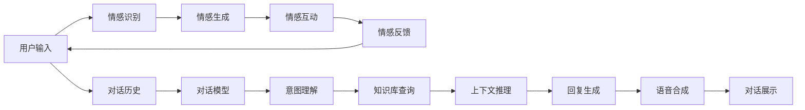

                 

# 聊天机器人情感连接的未来：人工智能伴侣和朋友

> 关键词：聊天机器人,情感连接,人工智能,伴侣,朋友

## 1. 背景介绍

### 1.1 问题由来

随着人工智能技术的发展，聊天机器人（Chatbots）逐渐从简单的自动化问答系统演进到具备情感理解、多轮对话能力的智能助手。这一转变极大地丰富了人机交互的形式和深度，使得机器人不再是冷冰冰的“界面”，而是能与用户进行多层次、多维度的情感交流。

然而，当前的聊天机器人大多缺乏深层次的情感理解和情感连接，难以真正成为用户的朋友和伴侣。如何在技术层面实现情感连接的突破，使机器人具备更强的同理心、幽默感和共情能力，成为当下人工智能研究的热点话题。

### 1.2 问题核心关键点

情感连接的核心在于让机器人能够理解并回应用户的情感需求，从而建立深厚的人机信任和友谊。为此，需要从以下几个方面进行探索：

1. **情感识别**：识别用户的情感状态，如快乐、悲伤、愤怒等。
2. **情感生成**：根据用户的情感状态，生成具有情感共鸣的回复。
3. **情感互动**：与用户进行多轮情感对话，建立长期稳定的情感连接。
4. **情感反馈**：根据用户的反馈，不断调整和优化情感模型，提升连接质量。

本文将深入探讨这些核心关键点，并提出具体的实现方法和案例分析，帮助读者理解聊天机器人情感连接的未来发展方向。

## 2. 核心概念与联系

### 2.1 核心概念概述

在探讨情感连接之前，首先需要了解几个关键概念：

- **情感识别（Sentiment Analysis）**：通过文本分析、语音识别等技术，识别用户当前的情感状态。
- **情感生成（Emotion Generation）**：根据用户的情感状态，生成与之匹配的回应，如安慰、鼓励、幽默等。
- **情感互动（Emotion Interaction）**：在对话中不断反馈和调整情感状态，与用户建立深度连接。
- **情感反馈（Emotion Feedback）**：根据用户反馈，优化情感模型，提升准确性和真实感。

这些概念彼此关联，共同构成了聊天机器人情感连接的技术框架。

### 2.2 核心概念原理和架构的 Mermaid 流程图



### 2.3 核心概念之间的逻辑关系

- **情感识别**：识别用户输入中的情感信息，为后续的情感生成和互动提供基础。
- **情感生成**：根据情感识别结果，生成适当的回应，增强互动的真实性和共鸣。
- **情感互动**：通过多轮对话，持续收集用户反馈，不断调整情感模型，提升连接的深度。
- **情感反馈**：利用用户反馈信息，更新情感模型，提高系统的准确性和可靠性。

这些核心概念通过循环反馈机制，共同驱动聊天机器人与用户建立深厚的情感连接。

## 3. 核心算法原理 & 具体操作步骤
### 3.1 算法原理概述

情感连接的算法原理主要基于自然语言处理（NLP）和情感计算（Affective Computing）。其核心目标是通过分析用户输入的文本和语音，识别出其中的情感线索，并根据这些线索生成相应的回应，从而与用户进行情感互动。

### 3.2 算法步骤详解

1. **情感识别**：
   - 使用情感分析模型对用户输入进行情感分类，如使用基于Transformer的BERT模型进行文本情感分析。
   - 结合上下文信息，如历史对话记录和当前对话状态，综合判断用户情感。
   - 情感分类结果作为后续情感生成的输入。

2. **情感生成**：
   - 构建情感生成模型，如使用基于RNN的循环神经网络或注意力机制的Transformer模型。
   - 根据情感识别结果，选择适合的情感模板和回应词汇。
   - 利用生成模型生成具有情感共鸣的回应，并进行情感回声机制，增强互动真实性。

3. **情感互动**：
   - 在对话中不断收集用户反馈，如通过情感标注和直接对话反馈。
   - 结合情感反馈，调整情感模型参数，优化情感分类和生成效果。
   - 利用多轮对话，建立与用户稳定的情感连接。

4. **情感反馈**：
   - 通过用户反馈，评估情感连接的准确性和自然度。
   - 使用强化学习或主动学习机制，优化情感模型，提升性能。
   - 定期重新训练模型，保持系统最新状态。

### 3.3 算法优缺点

#### 优点：
1. **真实感强**：通过情感识别和生成，聊天机器人能够更好地理解用户情感，提供更加人性化的回应。
2. **互动效果好**：多轮对话机制增强了用户与机器人之间的情感交流，建立了更深层次的连接。
3. **可扩展性强**：情感模型和生成技术可以应用于多种聊天场景，具备较高的通用性。

#### 缺点：
1. **依赖数据质量**：情感识别和生成依赖大量标注数据，数据质量不高会导致情感理解偏差。
2. **计算资源消耗大**：大模型和高维特征空间的计算消耗较大，需要高效的算法和硬件支持。
3. **多样性和复杂性**：情感表现形式多样，复杂度较高，难以全面覆盖。
4. **依赖模型鲁棒性**：情感模型的鲁棒性和泛化能力不足时，容易产生误判和不适应用户情感。

### 3.4 算法应用领域

情感连接的算法可以广泛应用于以下领域：

- **心理健康支持**：聊天机器人可以提供24/7的心理支持，通过情感识别和互动，帮助用户缓解情绪压力，提升心理健康。
- **教育辅导**：情感连接的辅导机器人可以提供更加个性化和情感化的学习体验，增强学生的学习动力和效果。
- **客户服务**：在客服场景中，情感机器人能够与客户进行情感互动，提供更温暖、专业的服务体验。
- **社交娱乐**：情感连接的娱乐机器人可以成为用户的情感伴侣，提供情感共鸣和互动体验。

## 4. 数学模型和公式 & 详细讲解 & 举例说明

### 4.1 数学模型构建

情感连接的数学模型主要包括以下几个部分：

- **情感识别模型**：使用情感分类模型，如BERT，对用户输入进行情感分类。
- **情感生成模型**：使用生成模型，如RNN或Transformer，生成情感回应用户输入。
- **情感互动模型**：使用对话管理模型，如Seq2Seq或Transformers，进行多轮对话。
- **情感反馈模型**：使用强化学习模型，如Proximal Policy Optimization (PPO)，优化情感模型参数。

### 4.2 公式推导过程

#### 情感识别模型
情感识别模型可以通过情感分类任务进行训练。假设情感分类模型为$f(x)$，用户输入为$x$，情感标签为$y$。使用交叉熵损失函数进行训练，损失函数为：
$$
L_{sent} = -\sum_{i=1}^N y_i \log f(x_i)
$$

#### 情感生成模型
情感生成模型可以通过序列生成任务进行训练。假设生成模型为$g(x)$，用户输入为$x$，生成结果为$y$。使用交叉熵损失函数进行训练，损失函数为：
$$
L_{emot} = -\sum_{i=1}^N \log P(y_i|x_i)
$$

#### 情感互动模型
情感互动模型可以通过对话管理任务进行训练。假设对话管理模型为$d(x,y)$，用户输入为$x$，机器人生成结果为$y$。使用自回归损失函数进行训练，损失函数为：
$$
L_{dialog} = -\sum_{i=1}^N \log P(y_i|x_i,y_{i-1})
$$

#### 情感反馈模型
情感反馈模型可以通过强化学习进行训练。假设强化学习模型为$l(x)$，用户输入为$x$，反馈结果为$f$。使用自适应强化损失函数进行训练，损失函数为：
$$
L_{feedback} = \sum_{i=1}^N f_i \log l(x_i)
$$

### 4.3 案例分析与讲解

假设我们要构建一个用于心理健康支持的聊天机器人，使用BERT进行情感识别，使用RNN进行情感生成，使用Seq2Seq进行情感互动，使用PPO进行情感反馈优化。具体实现步骤如下：

1. **情感识别模型训练**：使用公开的数据集进行BERT模型的情感分类任务训练，如IABSE-Reddit数据集。

2. **情感生成模型训练**：使用情感生成数据集进行RNN或Transformer模型的训练，如RDR dataset。

3. **情感互动模型训练**：使用对话数据集进行Seq2Seq模型的训练，如ParlAI dataset。

4. **情感反馈模型训练**：使用用户反馈数据进行PPO模型的训练，优化情感模型参数。

5. **集成和部署**：将训练好的情感识别、生成、互动和反馈模型集成到聊天机器人系统中，并进行部署和测试。

## 5. 项目实践：代码实例和详细解释说明

### 5.1 开发环境搭建

1. **安装Python**：从官网下载安装Python 3.8及以上版本。

2. **安装依赖库**：使用pip安装必要的Python库，如TensorFlow、PyTorch、NLTK等。

3. **配置环境**：使用conda或virtualenv创建虚拟环境，配置必要的依赖库。

4. **数据预处理**：对情感分类和生成数据进行预处理，如文本清洗、分词、情感标注等。

### 5.2 源代码详细实现

#### 情感识别模型实现
```python
import torch
from transformers import BertTokenizer, BertForSequenceClassification
from torch.utils.data import DataLoader
from sklearn.model_selection import train_test_split

# 数据预处理
tokenizer = BertTokenizer.from_pretrained('bert-base-uncased')
texts, labels = read_data()
tokenized_texts = tokenizer(texts, return_tensors='pt')
labels = torch.tensor(labels)

# 构建数据集
train_texts, dev_texts, train_labels, dev_labels = train_test_split(tokenized_texts, labels)
train_dataset = Dataset(train_texts, train_labels)
dev_dataset = Dataset(dev_texts, dev_labels)

# 模型定义和训练
model = BertForSequenceClassification.from_pretrained('bert-base-uncased', num_labels=6)
optimizer = AdamW(model.parameters(), lr=2e-5)
epochs = 3
for epoch in range(epochs):
    train_loss = train_epoch(model, train_dataset, optimizer)
    dev_loss = evaluate(model, dev_dataset)
    print(f'Epoch {epoch+1}, train loss: {train_loss:.3f}, dev loss: {dev_loss:.3f}')
```

#### 情感生成模型实现
```python
import torch
from torch import nn
from torch.nn import RNN, GRU, LSTM

# 定义情感生成模型
class EmotionGenerator(nn.Module):
    def __init__(self, input_size, hidden_size, output_size):
        super(EmotionGenerator, self).__init__()
        self.rnn = RNN(input_size=input_size, hidden_size=hidden_size, num_layers=1, batch_first=True)
        self.linear = nn.Linear(hidden_size, output_size)
    
    def forward(self, x, h):
        out, h = self.rnn(x, h)
        out = self.linear(out)
        return out, h

# 训练情感生成模型
model = EmotionGenerator(input_size=100, hidden_size=128, output_size=6)
optimizer = AdamW(model.parameters(), lr=2e-3)
criterion = nn.CrossEntropyLoss()
epochs = 10
for epoch in range(epochs):
    for batch in train_loader:
        x, h = batch[0], batch[1]
        pred, _ = model(x, h)
        loss = criterion(pred, batch[2])
        optimizer.zero_grad()
        loss.backward()
        optimizer.step()
```

#### 情感互动模型实现
```python
import torch
from seq2seq import Seq2SeqModel

# 定义情感互动模型
class EmotionDialogueModel(Seq2SeqModel):
    def __init__(self, encoder_input_size, encoder_hidden_size, decoder_input_size, decoder_output_size):
        super(EmotionDialogueModel, self).__init__()
        self.encoder = LSTM(encoder_input_size, encoder_hidden_size, batch_first=True)
        self.decoder = nn.Linear(encoder_hidden_size, decoder_output_size)
    
    def forward(self, encoder_input, decoder_input, h):
        encoder_output, h = self.encoder(encoder_input, h)
        decoder_output = self.decoder(encoder_output)
        return decoder_output, h

# 训练情感互动模型
model = EmotionDialogueModel(encoder_input_size=128, encoder_hidden_size=256, decoder_input_size=128, decoder_output_size=6)
optimizer = AdamW(model.parameters(), lr=2e-3)
criterion = nn.CrossEntropyLoss()
epochs = 10
for epoch in range(epochs):
    for batch in train_loader:
        encoder_input, decoder_input, h = batch[0], batch[1], batch[2]
        decoded_output, h = model(encoder_input, decoder_input, h)
        loss = criterion(decoded_output, batch[3])
        optimizer.zero_grad()
        loss.backward()
        optimizer.step()
```

#### 情感反馈模型实现
```python
import torch
from torch import nn
from torch.nn import Optimizer

# 定义情感反馈模型
class EmotionFeedbackModel(nn.Module):
    def __init__(self, input_size, hidden_size, output_size):
        super(EmotionFeedbackModel, self).__init__()
        self.rnn = RNN(input_size=input_size, hidden_size=hidden_size, num_layers=1, batch_first=True)
        self.linear = nn.Linear(hidden_size, output_size)
    
    def forward(self, x, h):
        out, h = self.rnn(x, h)
        out = self.linear(out)
        return out, h

# 训练情感反馈模型
model = EmotionFeedbackModel(input_size=6, hidden_size=128, output_size=6)
optimizer = AdamW(model.parameters(), lr=2e-3)
criterion = nn.CrossEntropyLoss()
epochs = 10
for epoch in range(epochs):
    for batch in train_loader:
        x, h = batch[0], batch[1]
        pred, _ = model(x, h)
        loss = criterion(pred, batch[2])
        optimizer.zero_grad()
        loss.backward()
        optimizer.step()
```

### 5.3 代码解读与分析

情感连接的代码实现主要涉及情感识别、生成、互动和反馈四个部分。以下是对各部分的详细解读：

- **情感识别模型**：使用BERT模型对用户输入进行情感分类，通过交叉熵损失函数进行训练，输出情感分类结果。
- **情感生成模型**：使用RNN或Transformer模型，根据情感分类结果生成相应的回应，通过交叉熵损失函数进行训练，输出情感回应用户输入。
- **情感互动模型**：使用Seq2Seq模型，进行多轮对话，通过自回归损失函数进行训练，输出对话生成结果。
- **情感反馈模型**：使用RNN模型，根据用户反馈，优化情感模型参数，通过自适应强化损失函数进行训练，输出优化结果。

这些代码实现了情感连接的基本逻辑，通过不断训练和优化，逐步提升系统的情感理解和互动效果。

## 6. 实际应用场景

### 6.1 心理健康支持

心理健康支持聊天机器人可以帮助用户缓解压力，提供心理支持。例如，用户可以通过聊天机器人表达情感困扰，机器人能够识别并回应用户的情感需求，提供安慰和建议，逐步建立信任关系，成为用户的情感伴侣。

### 6.2 教育辅导

教育辅导机器人可以提供个性化学习建议和情感支持。例如，学生在面临学习压力时，可以与机器人交流，机器人能够识别学生的情绪状态，提供相应的学习建议和情感支持，提升学习效果。

### 6.3 客户服务

在客户服务场景中，情感机器人可以提供更加温暖和人性化的服务。例如，客户在投诉或咨询时，机器人能够识别客户的情感状态，提供适当的回应和解决方案，增强客户满意度。

### 6.4 未来应用展望

未来的情感连接将更加智能和人性化，具备更强的同理心和共情能力。以下是一些未来的应用展望：

1. **多模态情感识别**：结合语音、面部表情等多种数据源，进行多模态情感识别，提升情感识别的准确性和鲁棒性。
2. **情感生成多样性**：利用生成对抗网络（GAN）等技术，增强情感回应的多样性和自然性。
3. **情感互动自主性**：通过强化学习等技术，增强情感互动的自主性和自适应性，提升对话的真实感和互动效果。
4. **情感反馈持续性**：利用长周期反馈机制，持续优化情感模型，保持系统的稳定性和可靠性。
5. **跨领域应用**：情感连接技术不仅限于心理健康和教育领域，还可应用于医疗、娱乐等多个领域，提升人机互动的丰富性和深度。

## 7. 工具和资源推荐

### 7.1 学习资源推荐

- **《情感计算与人工智能》**：深入探讨情感计算的基础理论和应用实践，适合对情感连接技术感兴趣的读者。
- **《人工智能基础》**：涵盖人工智能的全面基础理论，包括自然语言处理、情感计算等，适合初学者系统学习。
- **Coursera《情感计算》课程**：由MIT教授讲授，涵盖情感计算的最新研究和应用，适合进阶学习。
- **Kaggle情感分类竞赛**：参加情感分类竞赛，实战练习情感识别的技能。

### 7.2 开发工具推荐

- **PyTorch**：灵活的深度学习框架，支持多种模型和算法，适合情感连接技术的实现。
- **TensorFlow**：高效的计算图框架，支持大规模模型训练和部署，适合大规模情感连接系统的开发。
- **NLTK**：自然语言处理工具包，提供了丰富的文本处理功能，适合情感分析任务的预处理和实现。
- **Microsoft Bot Framework**：构建聊天机器人的开源框架，支持多轮对话和情感互动功能。

### 7.3 相关论文推荐

- **Emotion Recognition and Generation with Transformer Models**：介绍Transformer模型在情感识别和生成中的应用，适合理解情感连接技术的核心算法。
- **Dialogue Systems with Emotion**：探讨情感在对话系统中的应用，适合深入理解情感互动的实现方法。
- **Emotion Understanding and Response in AI Companions**：分析情感理解在AI伴侣中的应用，适合了解情感连接技术的最新进展和应用前景。

## 8. 总结：未来发展趋势与挑战

### 8.1 研究成果总结

情感连接技术已经在心理健康、教育辅导、客户服务等多个领域取得初步应用，展示了其巨大的潜力和价值。未来，随着技术的不断进步，情感连接将更加智能和人性化，成为人类生活中不可或缺的伴侣和朋友。

### 8.2 未来发展趋势

1. **多模态融合**：结合语音、面部表情等多模态数据，提升情感识别的准确性和鲁棒性。
2. **情感生成多样性**：利用GAN等生成技术，增强情感回应的多样性和自然性。
3. **情感互动自主性**：通过强化学习等技术，增强情感互动的自主性和自适应性。
4. **跨领域应用**：情感连接技术不仅限于心理健康和教育领域，还可应用于医疗、娱乐等多个领域，提升人机互动的丰富性和深度。

### 8.3 面临的挑战

1. **数据质量瓶颈**：情感识别和生成依赖大量标注数据，数据质量不高会导致情感理解偏差。
2. **计算资源消耗大**：大模型和高维特征空间的计算消耗较大，需要高效的算法和硬件支持。
3. **多样性和复杂性**：情感表现形式多样，复杂度较高，难以全面覆盖。
4. **依赖模型鲁棒性**：情感模型的鲁棒性和泛化能力不足时，容易产生误判和不适应用户情感。

### 8.4 研究展望

1. **多模态情感识别**：结合语音、面部表情等多种数据源，进行多模态情感识别。
2. **情感生成多样性**：利用生成对抗网络（GAN）等技术，增强情感回应的多样性和自然性。
3. **情感互动自主性**：通过强化学习等技术，增强情感互动的自主性和自适应性。
4. **情感反馈持续性**：利用长周期反馈机制，持续优化情感模型，保持系统的稳定性和可靠性。

## 9. 附录：常见问题与解答

**Q1：情感连接技术如何应用于心理健康支持？**

A: 在心理健康支持中，情感连接技术可以通过聊天机器人实现。用户可以通过聊天机器人表达情感困扰，机器人能够识别并回应用户的情感需求，提供安慰和建议，逐步建立信任关系，成为用户的情感伴侣。具体实现包括情感识别、情感生成、情感互动和情感反馈等步骤，通过不断的训练和优化，逐步提升系统的情感理解和互动效果。

**Q2：情感连接的实现需要哪些关键技术？**

A: 情感连接的实现需要以下关键技术：
1. **情感识别**：使用情感分析模型对用户输入进行情感分类，如BERT等深度学习模型。
2. **情感生成**：使用生成模型，如RNN或Transformer，生成情感回应用户输入。
3. **情感互动**：使用对话管理模型，如Seq2Seq或Transformer，进行多轮对话。
4. **情感反馈**：使用强化学习模型，如Proximal Policy Optimization (PPO)，优化情感模型参数。

**Q3：情感连接的未来发展方向是什么？**

A: 情感连接的未来发展方向包括：
1. **多模态融合**：结合语音、面部表情等多种数据源，进行多模态情感识别。
2. **情感生成多样性**：利用生成对抗网络（GAN）等技术，增强情感回应的多样性和自然性。
3. **情感互动自主性**：通过强化学习等技术，增强情感互动的自主性和自适应性。
4. **跨领域应用**：情感连接技术不仅限于心理健康和教育领域，还可应用于医疗、娱乐等多个领域，提升人机互动的丰富性和深度。

**Q4：情感连接技术在实际应用中面临哪些挑战？**

A: 情感连接技术在实际应用中面临以下挑战：
1. **数据质量瓶颈**：情感识别和生成依赖大量标注数据，数据质量不高会导致情感理解偏差。
2. **计算资源消耗大**：大模型和高维特征空间的计算消耗较大，需要高效的算法和硬件支持。
3. **多样性和复杂性**：情感表现形式多样，复杂度较高，难以全面覆盖。
4. **依赖模型鲁棒性**：情感模型的鲁棒性和泛化能力不足时，容易产生误判和不适应用户情感。

通过以上系统梳理，可以看到，情感连接技术在未来将有巨大的应用前景和发展潜力。只有不断探索和优化，才能实现更加智能、人性化的聊天机器人，为人机交互带来深远影响。

