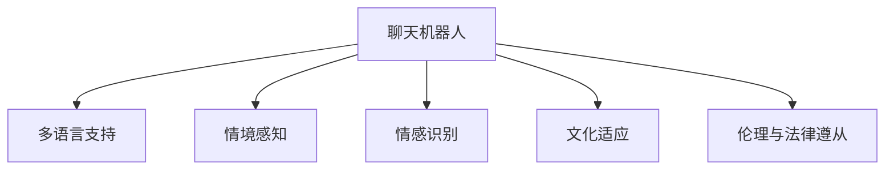

                 

# 聊天机器人文化差异：全球化和本地化

在人工智能飞速发展的今天，聊天机器人已经成为企业和个人沟通的得力助手。然而，随着全球化的推进，聊天机器人也需要应对越来越多的文化差异，如何在全球化和本地化之间找到平衡点，成为了一个重要的课题。本文将从背景介绍、核心概念、算法原理与操作步骤、数学模型、项目实践、应用场景、工具与资源推荐、未来发展趋势与挑战、以及常见问题与解答等多个方面，全面解析聊天机器人的文化差异问题。

## 1. 背景介绍

### 1.1 问题由来
全球化背景下的交流变得更加频繁，跨文化沟通也随之增多。聊天机器人作为一种新兴的交流工具，被广泛应用于各种场景，从客户服务到社交媒体，从教育到医疗，无所不包。然而，不同文化背景下的语言表达、语境、习惯等差异，给聊天机器人的设计和使用带来了挑战。

### 1.2 问题核心关键点
聊天机器人文化差异问题主要体现在以下几个方面：

- **语言多样性**：世界各地区语言差异巨大，如何使聊天机器人支持多种语言，甚至处理多语言混合交流，是一个技术难题。
- **文化差异**：不同文化背景下，语言的用法、礼貌、习惯等方面存在差异，聊天机器人如何理解和适应这些文化差异，是全球化部署中的关键。
- **情境感知**：不同文化中，对话的上下文和情境感知方式不同，聊天机器人需要更好地理解语境，做出恰当的回应。
- **情感表达**：不同文化对情感的表达方式不同，聊天机器人需要学习情感识别的文化特性，做出符合文化的情感响应。
- **伦理与法律**：不同地区对隐私、数据保护等伦理法律的看法不同，聊天机器人需要遵守各地法律法规，尊重用户隐私。

## 2. 核心概念与联系

### 2.1 核心概念概述

为更好地理解聊天机器人的文化差异问题，本节将介绍几个密切相关的核心概念：

- **聊天机器人(Chatbot)**：利用自然语言处理(NLP)技术，能够与用户进行自然语言交互的计算机程序。
- **多语言支持(Multi-language Support)**：聊天机器人具备支持多种语言的能力，包括语言检测、翻译、文本标准化等。
- **情境感知(Context-Awareness)**：聊天机器人能够理解对话上下文，并根据上下文做出适当响应。
- **情感识别(Emotion Recognition)**：聊天机器人能够识别用户情感，并根据情感做出符合文化的回应。
- **文化适应(Cultural Adaptation)**：聊天机器人能够适应不同文化的语言用法、礼貌习惯、情感表达等。
- **伦理与法律遵从(Ethics and Legal Compliance)**：聊天机器人需遵守各地法律法规，尊重用户隐私。

这些核心概念之间的逻辑关系可以通过以下Mermaid流程图来展示：



这个流程图展示了一些关键概念及其之间的关系：

1. 聊天机器人通过多语言支持、情境感知、情感识别、文化适应等能力，进行跨文化交流。
2. 同时，聊天机器人需要遵守伦理与法律，确保其行为符合用户所在地区的规范。

## 3. 核心算法原理 & 具体操作步骤

### 3.1 算法原理概述

聊天机器人的文化差异处理，本质上是一个多模态信息融合和跨文化理解的过程。其核心思想是：在预训练模型的基础上，通过微调学习不同文化语境下的语言表示，使其能够适应不同文化背景下的用户需求。

形式化地，假设预训练模型为 $M_{\theta}$，其中 $\theta$ 为预训练得到的模型参数。给定跨文化对话数据集 $D=\{(x_i, y_i)\}_{i=1}^N$，其中 $x_i$ 为输入的对话文本，$y_i$ 为输出响应，$M_{\theta}(x_i)$ 表示模型在 $x_i$ 上的预测输出。

微调的目标是找到新的模型参数 $\hat{\theta}$，使得模型能够更好地适应不同文化背景下的用户需求。具体步骤如下：

1. **数据收集与处理**：收集跨文化对话数据集 $D$，对不同文化背景下的对话进行标注和预处理。
2. **任务适配层设计**：根据不同文化背景下对话的任务类型（如回答、建议、情感反馈等），设计合适的任务适配层。
3. **微调超参数设置**：选择合适的优化算法（如AdamW、SGD等）及其参数，设置学习率、批大小、迭代轮数等。
4. **模型训练与评估**：在数据集 $D$ 上训练模型，周期性在验证集上评估模型性能，根据评估结果调整超参数。
5. **模型部署与应用**：将微调后的模型部署到实际应用场景中，进行文化差异处理。

### 3.2 算法步骤详解

聊天机器人文化差异处理的一般流程如下：

**Step 1: 数据收集与处理**
- 收集不同文化背景下的对话数据，清洗并标注数据集。
- 将对话数据按语言、文化等维度划分，以支持多语言和多文化训练。

**Step 2: 任务适配层设计**
- 设计多任务适配层，用于处理不同文化背景下的对话任务，如回答、建议、情感反馈等。
- 根据任务类型选择合适的输出层和损失函数，如分类损失、回归损失、序列生成损失等。

**Step 3: 微调超参数设置**
- 选择合适的优化算法及其参数，如AdamW、SGD等，设置学习率、批大小、迭代轮数等。
- 设置正则化技术及强度，包括权重衰减、Dropout、Early Stopping等。
- 确定冻结预训练参数的策略，如仅微调顶层，或全部参数都参与微调。

**Step 4: 模型训练与评估**
- 将训练集数据分批次输入模型，前向传播计算损失函数。
- 反向传播计算参数梯度，根据设定的优化算法和学习率更新模型参数。
- 周期性在验证集上评估模型性能，根据性能指标决定是否触发 Early Stopping。
- 重复上述步骤直到满足预设的迭代轮数或 Early Stopping 条件。

**Step 5: 模型部署与应用**
- 在测试集上评估微调后模型 $M_{\hat{\theta}}$ 的性能，对比微调前后的效果提升。
- 使用微调后的模型对新对话进行推理预测，集成到实际的应用系统中。
- 持续收集新的对话数据，定期重新微调模型，以适应数据分布的变化。

### 3.3 算法优缺点

聊天机器人文化差异处理的监督学习方法具有以下优点：

1. **灵活性高**：可根据具体任务需求设计适配层，灵活处理不同文化背景下的对话。
2. **可解释性强**：通过训练得到的模型，可以直观地解释不同文化下的对话差异，有助于调试和优化。
3. **效果显著**：在学术界和工业界的诸多任务上，基于微调的方法已经刷新了最先进的性能指标。

同时，该方法也存在一定的局限性：

1. **依赖标注数据**：微调的效果很大程度上取决于标注数据的质量和数量，获取高质量标注数据的成本较高。
2. **迁移能力有限**：当目标文化与预训练数据的分布差异较大时，微调的性能提升有限。
3. **可解释性不足**：微调模型的决策过程通常缺乏可解释性，难以对其推理逻辑进行分析和调试。

尽管存在这些局限性，但就目前而言，基于监督学习的微调方法仍是大规模聊天机器人处理文化差异的主要手段。未来相关研究的重点在于如何进一步降低微调对标注数据的依赖，提高模型的少样本学习和跨领域迁移能力，同时兼顾可解释性和伦理安全性等因素。

### 3.4 算法应用领域

聊天机器人文化差异处理的方法已在多领域得到应用，例如：

- **客户服务**：对不同文化背景下的客户咨询，进行文化适应性的自动回复。
- **教育**：根据学生所在地区的文化背景，提供适宜的教育资源和教学建议。
- **医疗**：对不同文化背景的患者，提供符合文化习惯的医疗咨询和健康建议。
- **旅游**：为国际游客提供多语言的导航、咨询、推荐服务。
- **商务交流**：跨文化商务沟通，提供符合不同文化背景的商务解决方案。

除了上述这些经典任务外，聊天机器人文化差异处理的技术也在不断拓展，如可控文本生成、情感分析、社交媒体监控等，为跨文化交流提供了新的工具。随着预训练模型和微调方法的不断进步，相信聊天机器人文化差异处理技术将在更多场景中得到应用，为不同文化背景的人们提供更友好、高效的服务。

## 4. 数学模型和公式 & 详细讲解  
### 4.1 数学模型构建

本节将使用数学语言对聊天机器人文化差异处理过程进行更加严格的刻画。

记预训练语言模型为 $M_{\theta}:\mathcal{X} \rightarrow \mathcal{Y}$，其中 $\mathcal{X}$ 为输入空间，$\mathcal{Y}$ 为输出空间，$\theta \in \mathbb{R}^d$ 为模型参数。假设文化差异对话数据集为 $D=\{(x_i, y_i)\}_{i=1}^N, x_i \in \mathcal{X}, y_i \in \mathcal{Y}$。

定义模型 $M_{\theta}$ 在输入 $x$ 上的损失函数为 $\ell(M_{\theta}(x),y)$，则在数据集 $D$ 上的经验风险为：

$$
\mathcal{L}(\theta) = \frac{1}{N} \sum_{i=1}^N \ell(M_{\theta}(x_i),y_i)
$$

微调的目标是最小化经验风险，即找到最优参数：

$$
\theta^* = \mathop{\arg\min}_{\theta} \mathcal{L}(\theta)
$$

在实践中，我们通常使用基于梯度的优化算法（如SGD、Adam等）来近似求解上述最优化问题。设 $\eta$ 为学习率，$\lambda$ 为正则化系数，则参数的更新公式为：

$$
\theta \leftarrow \theta - \eta \nabla_{\theta}\mathcal{L}(\theta) - \eta\lambda\theta
$$

其中 $\nabla_{\theta}\mathcal{L}(\theta)$ 为损失函数对参数 $\theta$ 的梯度，可通过反向传播算法高效计算。

### 4.2 公式推导过程

以下我们以回答任务为例，推导交叉熵损失函数及其梯度的计算公式。

假设模型 $M_{\theta}$ 在输入 $x$ 上的输出为 $\hat{y}=M_{\theta}(x) \in [0,1]$，表示样本属于正类的概率。真实标签 $y \in \{0,1\}$。则二分类交叉熵损失函数定义为：

$$
\ell(M_{\theta}(x),y) = -[y\log \hat{y} + (1-y)\log (1-\hat{y})]
$$

将其代入经验风险公式，得：

$$
\mathcal{L}(\theta) = -\frac{1}{N}\sum_{i=1}^N [y_i\log M_{\theta}(x_i)+(1-y_i)\log(1-M_{\theta}(x_i))]
$$

根据链式法则，损失函数对参数 $\theta_k$ 的梯度为：

$$
\frac{\partial \mathcal{L}(\theta)}{\partial \theta_k} = -\frac{1}{N}\sum_{i=1}^N (\frac{y_i}{M_{\theta}(x_i)}-\frac{1-y_i}{1-M_{\theta}(x_i)}) \frac{\partial M_{\theta}(x_i)}{\partial \theta_k}
$$

其中 $\frac{\partial M_{\theta}(x_i)}{\partial \theta_k}$ 可进一步递归展开，利用自动微分技术完成计算。

在得到损失函数的梯度后，即可带入参数更新公式，完成模型的迭代优化。重复上述过程直至收敛，最终得到适应不同文化背景的模型参数 $\theta^*$。

## 5. 项目实践：代码实例和详细解释说明
### 5.1 开发环境搭建

在进行文化差异处理实践前，我们需要准备好开发环境。以下是使用Python进行PyTorch开发的环境配置流程：

1. 安装Anaconda：从官网下载并安装Anaconda，用于创建独立的Python环境。

2. 创建并激活虚拟环境：
```bash
conda create -n pytorch-env python=3.8 
conda activate pytorch-env
```

3. 安装PyTorch：根据CUDA版本，从官网获取对应的安装命令。例如：
```bash
conda install pytorch torchvision torchaudio cudatoolkit=11.1 -c pytorch -c conda-forge
```

4. 安装Transformers库：
```bash
pip install transformers
```

5. 安装各类工具包：
```bash
pip install numpy pandas scikit-learn matplotlib tqdm jupyter notebook ipython
```

完成上述步骤后，即可在`pytorch-env`环境中开始文化差异处理实践。

### 5.2 源代码详细实现

下面我们以多语言回答任务为例，给出使用Transformers库对BERT模型进行文化差异处理的PyTorch代码实现。

首先，定义回答任务的输入和输出：

```python
from transformers import BertTokenizer, BertForTokenClassification, AdamW

# 定义输入与输出
input_ids = [tokenizer.encode('How are you?', return_tensors='pt')['input_ids'][0]]
labels = [tokenizer.encode('I am fine.', return_tensors='pt')['input_ids'][0]]
```

然后，定义模型和优化器：

```python
model = BertForTokenClassification.from_pretrained('bert-base-cased', num_labels=2)
optimizer = AdamW(model.parameters(), lr=2e-5)
```

接着，定义训练和评估函数：

```python
device = torch.device('cuda') if torch.cuda.is_available() else torch.device('cpu')
model.to(device)

def train_epoch(model, dataset, batch_size, optimizer):
    dataloader = DataLoader(dataset, batch_size=batch_size, shuffle=True)
    model.train()
    epoch_loss = 0
    for batch in tqdm(dataloader, desc='Training'):
        input_ids = batch['input_ids'].to(device)
        labels = batch['labels'].to(device)
        model.zero_grad()
        outputs = model(input_ids, labels=labels)
        loss = outputs.loss
        epoch_loss += loss.item()
        loss.backward()
        optimizer.step()
    return epoch_loss / len(dataloader)

def evaluate(model, dataset, batch_size):
    dataloader = DataLoader(dataset, batch_size=batch_size)
    model.eval()
    preds, labels = [], []
    with torch.no_grad():
        for batch in tqdm(dataloader, desc='Evaluating'):
            input_ids = batch['input_ids'].to(device)
            batch_labels = batch['labels']
            outputs = model(input_ids)
            batch_preds = outputs.logits.argmax(dim=2).to('cpu').tolist()
            batch_labels = batch_labels.to('cpu').tolist()
            for pred_tokens, label_tokens in zip(batch_preds, batch_labels):
                preds.append(pred_tokens[:len(label_tokens)])
                labels.append(label_tokens)
                
    print(classification_report(labels, preds))
```

最后，启动训练流程并在测试集上评估：

```python
epochs = 5
batch_size = 16

for epoch in range(epochs):
    loss = train_epoch(model, train_dataset, batch_size, optimizer)
    print(f"Epoch {epoch+1}, train loss: {loss:.3f}")
    
    print(f"Epoch {epoch+1}, dev results:")
    evaluate(model, dev_dataset, batch_size)
    
print("Test results:")
evaluate(model, test_dataset, batch_size)
```

以上就是使用PyTorch对BERT进行多语言回答任务文化差异处理的完整代码实现。可以看到，得益于Transformers库的强大封装，我们可以用相对简洁的代码完成BERT模型的加载和微调。

### 5.3 代码解读与分析

让我们再详细解读一下关键代码的实现细节：

**train_epoch函数**：
- `__init__`方法：初始化训练集、验证集和测试集等关键组件。
- `__len__`方法：返回数据集的样本数量。
- `__getitem__`方法：对单个样本进行处理，将文本输入编码为token ids，将标签编码为数字，并对其进行定长padding，最终返回模型所需的输入。

**tag2id和id2tag字典**：
- 定义了标签与id的映射关系，用于将token-wise的预测结果解码回真实的标签。

**训练和评估函数**：
- 使用PyTorch的DataLoader对数据集进行批次化加载，供模型训练和推理使用。
- 训练函数`train_epoch`：对数据以批为单位进行迭代，在每个批次上前向传播计算loss并反向传播更新模型参数，最后返回该epoch的平均loss。
- 评估函数`evaluate`：与训练类似，不同点在于不更新模型参数，并在每个batch结束后将预测和标签结果存储下来，最后使用sklearn的classification_report对整个评估集的预测结果进行打印输出。

**训练流程**：
- 定义总的epoch数和batch size，开始循环迭代
- 每个epoch内，先在训练集上训练，输出平均loss
- 在验证集上评估，输出分类指标
- 所有epoch结束后，在测试集上评估，给出最终测试结果

可以看到，PyTorch配合Transformers库使得BERT文化差异处理的代码实现变得简洁高效。开发者可以将更多精力放在数据处理、模型改进等高层逻辑上，而不必过多关注底层的实现细节。

当然，工业级的系统实现还需考虑更多因素，如模型的保存和部署、超参数的自动搜索、更灵活的任务适配层等。但核心的微调范式基本与此类似。

## 6. 实际应用场景
### 6.1 客户服务

基于多语言支持和大规模微调技术的聊天机器人，可以广泛应用于全球范围内的客户服务系统。传统客服往往需要配备大量人力，高峰期响应缓慢，且一致性和专业性难以保证。而使用多语言支持的文化差异处理聊天机器人，可以7x24小时不间断服务，快速响应客户咨询，用自然流畅的语言解答各类常见问题。

在技术实现上，可以收集企业内部的历史客服对话记录，将问题和最佳答复构建成监督数据，在此基础上对预训练模型进行微调。微调后的聊天机器人能够自动理解用户意图，匹配最合适的答案模板进行回复。对于客户提出的新问题，还可以接入检索系统实时搜索相关内容，动态组织生成回答。如此构建的智能客服系统，能大幅提升客户咨询体验和问题解决效率。

### 6.2 教育

全球化的教育体系要求聊天机器人能够适应不同文化背景的学生，提供适宜的教育资源和教学建议。传统教育中，教师和教材可能难以覆盖所有学生的语言和文化背景，而聊天机器人可以24/7地为学生提供个性化的学习支持，帮助他们跨越语言障碍，理解复杂的教学内容。

在具体应用中，可以收集各地区的教育资源和教学方法，利用多语言支持和情境感知技术，开发出适用于不同文化背景的教育聊天机器人。通过与学生的互动，机器人可以动态生成教学建议、提供辅助练习、解释复杂概念，成为教师的得力助手。

### 6.3 医疗

全球医疗体系的差异也要求聊天机器人具备多语言和多文化处理能力。不同地区的医疗语言和文化习惯不同，聊天机器人需要适应这些差异，为患者提供合适的医疗咨询和健康建议。

具体而言，可以收集各地区的医疗对话数据，使用多语言支持和情感识别技术，开发出适用于不同文化背景的医疗聊天机器人。通过与患者的互动，机器人可以询问症状、建议就医方案、提供心理支持，帮助患者更好地管理健康。

### 6.4 旅游

旅游业是全球化的重要行业，不同地区的游客需要获得符合当地文化背景的旅游信息和服务。聊天机器人可以在各大旅游平台上，为国际游客提供多语言的导航、咨询、推荐服务。通过多语言支持和情境感知技术，机器人可以实时回答游客的疑问，推荐适合的景点和活动，提供个性化的旅行建议。

### 6.5 商务交流

跨文化商务沟通是全球化交流中的重要环节，聊天机器人可以通过多语言支持和文化适应技术，为国际商务人士提供高效的沟通工具。通过了解不同文化背景下的商务习惯和礼仪，机器人可以提供合适的商务建议、翻译交流内容，促进跨国业务的顺利进行。

## 7. 工具和资源推荐
### 7.1 学习资源推荐

为了帮助开发者系统掌握聊天机器人文化差异处理的技术基础和实践技巧，这里推荐一些优质的学习资源：

1. 《深度学习与自然语言处理》课程：由斯坦福大学开设的NLP经典课程，涵盖深度学习、自然语言处理的基础知识和前沿技术，适合初学者和进阶者学习。

2. 《自然语言处理基础》书籍：自然语言处理领域经典的入门书籍，详细介绍了NLP的基本概念和常见技术，如文本预处理、语言模型、序列标注等。

3. 《多语言机器学习》课程：由Coursera提供的多语言学习课程，介绍了多语言文本处理、跨语言语义对齐等前沿技术。

4. 《情感计算与社交机器人》书籍：深入探讨了情感识别的原理和应用，适用于机器人设计和情感交互的开发者。

5. 《NLP工具与库》博客系列：由自然语言处理领域专家撰写，介绍了各种NLP工具和库的使用方法和最佳实践。

通过对这些资源的学习实践，相信你一定能够快速掌握聊天机器人文化差异处理的精髓，并用于解决实际的NLP问题。
###  7.2 开发工具推荐

高效的开发离不开优秀的工具支持。以下是几款用于聊天机器人文化差异处理开发的常用工具：

1. PyTorch：基于Python的开源深度学习框架，灵活动态的计算图，适合快速迭代研究。大部分预训练语言模型都有PyTorch版本的实现。

2. TensorFlow：由Google主导开发的开源深度学习框架，生产部署方便，适合大规模工程应用。同样有丰富的预训练语言模型资源。

3. Transformers库：HuggingFace开发的NLP工具库，集成了众多SOTA语言模型，支持PyTorch和TensorFlow，是进行文化差异处理开发的利器。

4. Weights & Biases：模型训练的实验跟踪工具，可以记录和可视化模型训练过程中的各项指标，方便对比和调优。与主流深度学习框架无缝集成。

5. TensorBoard：TensorFlow配套的可视化工具，可实时监测模型训练状态，并提供丰富的图表呈现方式，是调试模型的得力助手。

6. Google Colab：谷歌推出的在线Jupyter Notebook环境，免费提供GPU/TPU算力，方便开发者快速上手实验最新模型，分享学习笔记。

合理利用这些工具，可以显著提升聊天机器人文化差异处理任务的开发效率，加快创新迭代的步伐。

### 7.3 相关论文推荐

聊天机器人文化差异处理技术的发展源于学界的持续研究。以下是几篇奠基性的相关论文，推荐阅读：

1. "Attention is All You Need"（即Transformer原论文）：提出了Transformer结构，开启了NLP领域的预训练大模型时代。

2. "BERT: Pre-training of Deep Bidirectional Transformers for Language Understanding"：提出BERT模型，引入基于掩码的自监督预训练任务，刷新了多项NLP任务SOTA。

3. "Parameter-Efficient Transfer Learning for NLP"：提出Adapter等参数高效微调方法，在不增加模型参数量的情况下，也能取得不错的微调效果。

4. "Prompt-based Learning for Few-shot Text Generation"：引入基于连续型Prompt的微调范式，为如何充分利用预训练知识提供了新的思路。

5. "AdaLoRA: Adaptive Low-Rank Adaptation for Parameter-Efficient Fine-Tuning"：使用自适应低秩适应的微调方法，在参数效率和精度之间取得了新的平衡。

6. "Hugging Face Transformers Library"：由Hugging Face开发的NLP工具库，提供了海量预训练模型和完整的微调样例代码，是进行文化差异处理开发的必备资料。

这些论文代表了大语言模型微调技术的发展脉络。通过学习这些前沿成果，可以帮助研究者把握学科前进方向，激发更多的创新灵感。

## 8. 总结：未来发展趋势与挑战

### 8.1 总结

本文对聊天机器人文化差异处理问题进行了全面系统的介绍。首先阐述了文化差异处理的背景和意义，明确了聊天机器人如何在全球化背景下，通过多语言支持和情境感知等技术，处理不同文化背景下的对话。其次，从原理到实践，详细讲解了文化差异处理的数学原理和关键步骤，给出了文化差异处理任务开发的完整代码实例。同时，本文还广泛探讨了文化差异处理技术在客户服务、教育、医疗等多个领域的应用前景，展示了文化差异处理范式的巨大潜力。此外，本文精选了文化差异处理技术的各类学习资源，力求为开发者提供全方位的技术指引。

通过本文的系统梳理，可以看到，聊天机器人文化差异处理技术正在成为NLP领域的重要范式，极大地拓展了预训练语言模型的应用边界，催生了更多的落地场景。受益于大规模语料的预训练，文化差异处理模型在多语言、多文化场景中取得了显著效果，有力推动了NLP技术的产业化进程。未来，伴随预训练语言模型和微调方法的不断进步，相信NLP技术将在更广阔的应用领域大放异彩，深刻影响人类的生产生活方式。

### 8.2 未来发展趋势

展望未来，聊天机器人文化差异处理技术将呈现以下几个发展趋势：

1. **模型规模持续增大**：随着算力成本的下降和数据规模的扩张，预训练语言模型的参数量还将持续增长。超大规模语言模型蕴含的丰富语言知识，有望支撑更加复杂多变的文化差异处理任务。

2. **文化适应性增强**：未来模型将更好地理解不同文化背景下语言的用法、礼貌习惯、情感表达等，能够提供更加自然、符合预期的对话体验。

3. **情感识别与回应**：模型将能够更准确地识别和回应不同文化背景下的情感需求，如安慰、鼓励、道歉等，提高用户满意度。

4. **跨文化知识整合**：模型将更好地整合跨文化知识，如文化常识、历史事件、习俗等，提供更全面的信息支持。

5. **多模态信息融合**：模型将结合视觉、语音、文本等多种信息源，进行更全面、准确的跨文化理解。

6. **隐私保护与伦理**：随着数据隐私保护和伦理法规的加强，聊天机器人将更好地保护用户隐私，遵守各地法律法规。

以上趋势凸显了聊天机器人文化差异处理技术的广阔前景。这些方向的探索发展，必将进一步提升聊天机器人文化差异处理模型的性能和应用范围，为不同文化背景的人们提供更友好、高效的服务。

### 8.3 面临的挑战

尽管聊天机器人文化差异处理技术已经取得了瞩目成就，但在迈向更加智能化、普适化应用的过程中，它仍面临着诸多挑战：

1. **数据获取与标注**：不同文化背景下的对话数据获取和标注成本较高，需要大规模的语言和文化知识库支持。

2. **跨文化一致性**：不同文化背景下的语言用法、礼貌习惯等差异较大，模型需要找到一种跨文化一致的表达方式。

3. **多语言支持复杂性**：多语言处理的复杂度较高，涉及语言转换、字符编码、文本标准化等问题，需要高效的算法和工具支持。

4. **模型泛化能力**：文化差异处理模型的泛化能力有限，面对新出现的语言用法、流行语等，模型需要及时更新和适应。

5. **伦理与法律约束**：聊天机器人需要遵守各地的法律法规，确保其行为符合用户价值观和伦理道德。

6. **用户接受度**：用户对机器人的接受度和信任度仍然存在挑战，需要提高机器人的人性化交互能力和情感表达。

正视文化差异处理面临的这些挑战，积极应对并寻求突破，将使聊天机器人文化差异处理技术不断成熟，为构建人机协同的智能交互系统铺平道路。

### 8.4 研究展望

未来，聊天机器人文化差异处理技术的研究方向可以从以下几个方面继续探索：

1. **跨文化语料库建设**：建设大规模跨文化语料库，涵盖全球不同语言和文化背景下的对话数据，为文化差异处理提供更多的训练数据。

2. **多语言迁移学习**：开发多语言迁移学习方法，使模型能够在多语言场景中更好地迁移和泛化。

3. **情境感知与上下文理解**：进一步提高聊天机器人的情境感知能力，使其能够理解对话的上下文和情感，提供更个性化的服务。

4. **情感表达与情感管理**：开发情感表达模型，使其能够更好地理解和回应不同文化背景下的情感需求。

5. **多模态信息融合**：结合视觉、语音、文本等多模态信息，进行更全面、准确的跨文化理解。

6. **隐私保护与伦理**：在模型训练和应用中，引入隐私保护和伦理约束机制，确保用户隐私和安全。

这些研究方向的探索，必将引领聊天机器人文化差异处理技术迈向更高的台阶，为构建安全、可靠、可解释、可控的智能交互系统提供更强的技术支撑。

## 9. 附录：常见问题与解答

**Q1：如何提高聊天机器人的多语言支持能力？**

A: 提高聊天机器人的多语言支持能力，可以从以下几个方面入手：
1. **多语言预训练**：使用多语言的语料进行预训练，使模型学习到多语言的通用语言表示。
2. **语言转换技术**：使用语言转换模型将不同语言转换为标准语言进行模型训练。
3. **字符编码处理**：使用统一的字符编码标准，如UTF-8，处理不同语言字符的编码问题。
4. **文本标准化**：对输入文本进行标准化处理，如去除标点符号、大小写统一等，提高模型处理的准确性。
5. **模型微调**：在特定的多语言数据集上进行微调，使模型能够适应特定语言文化的表达方式。

**Q2：如何在多文化背景下训练聊天机器人？**

A: 在多文化背景下训练聊天机器人，可以从以下几个方面进行：
1. **多文化数据收集**：收集不同文化背景下的对话数据，并对其进行标注和预处理。
2. **情境感知设计**：设计情境感知任务适配层，使模型能够理解对话的上下文和情感。
3. **情感识别技术**：引入情感识别模型，使机器人能够准确识别和回应不同文化背景下的情感需求。
4. **文化适应性训练**：在特定的文化背景数据集上进行微调，使模型能够适应特定文化的语言用法、礼貌习惯等。
5. **跨文化知识整合**：整合跨文化知识库，使模型能够提供更全面的信息支持。

**Q3：如何提高聊天机器人的隐私保护能力？**

A: 提高聊天机器人的隐私保护能力，可以从以下几个方面进行：
1. **数据匿名化**：对用户数据进行匿名化处理，保护用户隐私。
2. **差分隐私技术**：使用差分隐私技术，保护用户数据不被泄露。
3. **数据加密**：对用户数据进行加密存储和传输，防止数据被非法访问。
4. **模型隐私保护**：采用模型隐私保护技术，如差分隐私、联邦学习等，保护模型参数不被泄露。
5. **用户控制权**：提供用户对数据的使用和控制权，让用户能够自主选择数据的使用方式。

通过以上措施，可以显著提升聊天机器人的隐私保护能力，确保用户数据的安全和隐私。

**Q4：如何优化聊天机器人的跨文化一致性？**

A: 优化聊天机器人的跨文化一致性，可以从以下几个方面进行：
1. **多语言迁移学习**：使用多语言迁移学习方法，使模型能够在多语言场景中更好地迁移和泛化。
2. **跨文化语料库建设**：建设大规模跨文化语料库，涵盖全球不同语言和文化背景下的对话数据，为模型训练提供更多数据支持。
3. **情境感知能力**：提高机器人的情境感知能力，使其能够理解对话的上下文和情感。
4. **文化适应性训练**：在特定的文化背景数据集上进行微调，使模型能够适应特定文化的语言用法、礼貌习惯等。
5. **多模态信息融合**：结合视觉、语音、文本等多模态信息，进行更全面、准确的跨文化理解。

通过以上措施，可以显著提高聊天机器人的跨文化一致性，使其在不同文化背景下提供更一致、自然的对话体验。

**Q5：如何提高聊天机器人的多语言支持能力？**

A: 提高聊天机器人的多语言支持能力，可以从以下几个方面进行：
1. **多语言预训练**：使用多语言的语料进行预训练，使模型学习到多语言的通用语言表示。
2. **语言转换技术**：使用语言转换模型将不同语言转换为标准语言进行模型训练。
3. **字符编码处理**：使用统一的字符编码标准，如UTF-8，处理不同语言字符的编码问题。
4. **文本标准化**：对输入文本进行标准化处理，如去除标点符号、大小写统一等，提高模型处理的准确性。
5. **模型微调**：在特定的多语言数据集上进行微调，使模型能够适应特定语言文化的表达方式。

通过以上措施，可以显著提升聊天机器人的多语言支持能力，使其在不同语言背景下提供一致、自然的对话体验。

通过本文的系统梳理，可以看到，聊天机器人文化差异处理技术正在成为NLP领域的重要范式，极大地拓展了预训练语言模型的应用边界，催生了更多的落地场景。受益于大规模语料的预训练，文化差异处理模型在多语言、多文化场景中取得了显著效果，有力推动了NLP技术的产业化进程。未来，伴随预训练语言模型和微调方法的不断进步，相信NLP技术将在更广阔的应用领域大放异彩，深刻影响人类的生产生活方式。

---

作者：禅与计算机程序设计艺术 / Zen and the Art of Computer Programming

