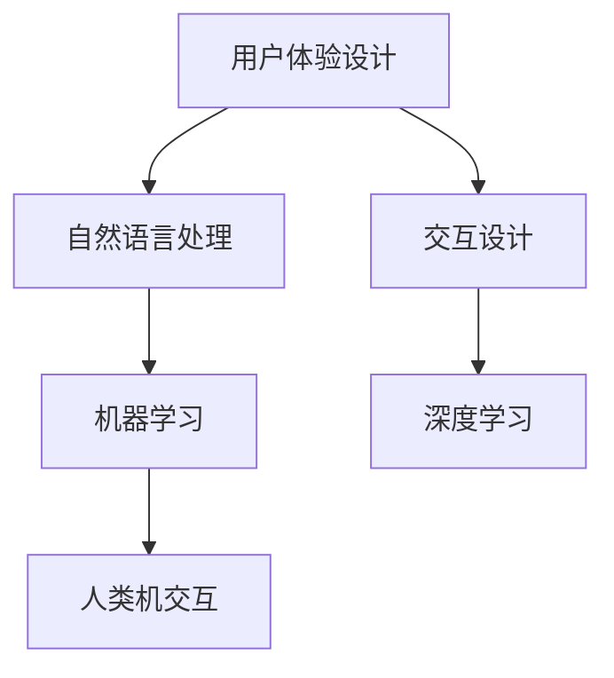

                 

# 聊天机器人界面设计：用户体验优化

> 关键词：用户体验设计（UX Design）, 自然语言处理（NLP）, 交互设计（UI/UX Design）, 机器学习（Machine Learning）, 深度学习（Deep Learning）, 人类机交互（Human-Computer Interaction, HCI）

## 1. 背景介绍

### 1.1 问题由来
随着人工智能和机器学习技术的不断发展，聊天机器人（Chatbot）在各行各业得到了广泛应用。然而，许多聊天机器人界面设计粗糙，用户体验不佳，难以吸引用户的持续关注和使用。聊天机器人不仅要具备强大的自然语言处理（NLP）能力，还需要设计良好的人机交互界面，才能真正实现用户的沉浸式交互体验。

### 1.2 问题核心关键点
聊天机器人界面设计涉及以下几个核心关键点：

- 用户体验设计（UX Design）：界面布局、交互流程、视觉元素设计等方面。
- 自然语言处理（NLP）：对话管理、意图识别、实体抽取、情感分析等。
- 交互设计（UI/UX Design）：按钮、输入框、动画效果、反馈机制等。
- 机器学习（Machine Learning）和深度学习（Deep Learning）：用于对话管理和用户行为预测。
- 人类机交互（Human-Computer Interaction, HCI）：设计界面时需考虑用户的行为习惯和心理特征。

通过优化这些关键点，我们可以设计出更加友好、高效、可靠的聊天机器人界面，提升用户体验。

## 2. 核心概念与联系

### 2.1 核心概念概述

为更好地理解聊天机器人界面设计的原则和实践，本节将介绍几个密切相关的核心概念：

- 用户体验设计（UX Design）：关注用户在使用产品时的感受和体验，通过界面设计、交互设计、视觉设计等手段提升用户满意度。
- 自然语言处理（NLP）：使聊天机器人能够理解自然语言输入，并生成自然语言输出，包括对话管理、意图识别、实体抽取、情感分析等技术。
- 交互设计（UI/UX Design）：通过界面元素、交互流程、用户反馈等设计，增强用户与系统的互动性。
- 机器学习（Machine Learning）和深度学习（Deep Learning）：用于训练聊天机器人模型，使其具备预测用户意图、生成自然语言等能力。
- 人类机交互（Human-Computer Interaction, HCI）：研究人机交互界面，设计适应用户需求和行为的界面。

这些核心概念之间的逻辑关系可以通过以下Mermaid流程图来展示：



这个流程图展示了几者之间的关系：

1. 用户体验设计：通过界面和交互设计，提升用户满意度。
2. 自然语言处理：使机器人能够理解和处理用户输入。
3. 交互设计：通过界面和交互流程优化用户体验。
4. 机器学习和深度学习：通过训练模型，提升聊天机器人的决策和生成能力。
5. 人类机交互：研究用户行为和心理，设计更加符合用户习惯的界面。

这些概念共同构成了聊天机器人界面设计的核心框架，使得机器人能够更好地理解用户需求，提供优质的交互体验。

## 3. 核心算法原理 & 具体操作步骤
### 3.1 算法原理概述

聊天机器人界面设计的主要目标是提升用户体验，使机器人能够更好地理解用户需求，并提供即时、准确的回应。通过合理设计界面和交互流程，提升用户满意度。

聊天机器人界面设计的基本流程包括：

1. 用户需求分析：分析目标用户的需求，设计合理的对话流程。
2. 交互设计：设计界面元素、交互流程、用户反馈等，提升用户交互体验。
3. 自然语言处理：通过NLP技术，使机器人能够理解自然语言输入，并生成自然语言输出。
4. 机器学习和深度学习：训练模型，提升聊天机器人对用户意图的理解和生成能力。
5. 用户测试和反馈：通过用户测试，收集用户反馈，持续优化界面设计。

### 3.2 算法步骤详解

聊天机器人界面设计主要分为以下几个步骤：

**Step 1: 用户需求分析**
- 分析用户群体特点，了解用户需求和痛点。
- 设计合理的对话流程，包括对话开始、对话进行和对话结束等环节。
- 考虑用户行为习惯，设计简洁、直观的对话流程。

**Step 2: 交互设计**
- 设计界面元素，包括按钮、输入框、滑块等，使用户能够便捷地与系统互动。
- 设计交互流程，包括用户输入、系统回应、用户反馈等环节，提升用户交互体验。
- 设计视觉元素，包括颜色、字体、图标等，增强界面美观度。

**Step 3: 自然语言处理**
- 设计意图识别模型，识别用户输入的意图，如查询信息、订购商品等。
- 设计实体抽取模型，从用户输入中抽取关键信息，如产品名称、价格等。
- 设计情感分析模型，分析用户输入中的情感倾向，提升系统响应质量。

**Step 4: 机器学习和深度学习**
- 训练对话管理模型，根据用户输入和对话历史生成合理回应。
- 训练意图识别模型，提高意图识别的准确率。
- 训练实体抽取模型，提高实体抽取的准确性。
- 训练情感分析模型，提高情感识别的准确性。

**Step 5: 用户测试和反馈**
- 进行用户测试，收集用户反馈，评估界面和交互流程。
- 根据用户反馈，优化界面设计和交互流程，提升用户体验。

### 3.3 算法优缺点

聊天机器人界面设计的优缺点如下：

**优点：**
- 提升用户体验：通过合理设计界面和交互流程，使用户能够更方便地与系统互动。
- 提升效率：优化对话流程，使聊天机器人能够快速准确地理解用户需求，提供即时响应。
- 个性化体验：通过用户行为数据分析，提供更加个性化的服务。

**缺点：**
- 设计复杂度高：需要综合考虑用户体验、自然语言处理、交互设计等多方面因素。
- 训练成本高：训练高质量的NLP模型需要大量标注数据和计算资源。
- 用户适应性：用户对新系统的适应性决定了其使用效果，不同用户对界面和交互流程的接受程度可能不同。

### 3.4 算法应用领域

聊天机器人界面设计在多个领域都有应用，例如：

- 客服自动化：提供24/7的客户服务，提高客户满意度。
- 虚拟助手：帮助用户完成各种任务，如订购商品、查询信息等。
- 智能家居：通过语音控制家居设备，提升生活便利性。
- 医疗咨询：提供医疗知识查询、健康监测等服务。
- 在线教育：提供个性化学习辅导，提升学习效果。

## 4. 数学模型和公式 & 详细讲解 & 举例说明
### 4.1 数学模型构建

聊天机器人界面设计涉及多个数学模型，以下以意图识别模型为例，介绍其数学模型构建过程。

假设用户输入的语句为 $x$，意图为 $y$，意图识别模型 $M$ 的输出为 $\hat{y}$。则意图识别模型的目标是最小化损失函数 $\mathcal{L}(\theta)$，其中 $\theta$ 为模型参数。

设模型的损失函数为交叉熵损失函数，则有：

$$
\mathcal{L}(\theta) = -\frac{1}{N}\sum_{i=1}^N y_i\log M_{\theta}(x_i)
$$

其中，$M_{\theta}(x_i)$ 表示在输入 $x_i$ 下，模型 $M$ 的输出概率分布。

### 4.2 公式推导过程

以下对意图识别模型的数学公式进行推导：

设模型 $M$ 为神经网络模型，包含 $n$ 个神经元，则模型 $M$ 的输出为：

$$
M_{\theta}(x) = \sigma(\theta_1 W_1 x + \theta_2 b_1)
$$

其中，$\sigma$ 为激活函数，$\theta_1$ 和 $\theta_2$ 为模型参数，$W_1$ 和 $b_1$ 为权重和偏置项。

假设意图识别任务有 $m$ 个类别，则意图识别模型的损失函数为：

$$
\mathcal{L}(\theta) = -\frac{1}{N}\sum_{i=1}^N \sum_{j=1}^m y_{ij}\log M_{\theta}(x_i)
$$

其中，$y_{ij}$ 表示用户输入语句 $x_i$ 属于第 $j$ 个类别的标签，$M_{\theta}(x_i)$ 表示在输入 $x_i$ 下，模型 $M$ 的输出概率分布。

### 4.3 案例分析与讲解

假设有一个电商平台的聊天机器人，用户可以向机器人询问商品信息、下单等。聊天机器人需要识别用户的意图，并提供相应的回应。

**案例场景：**
- 用户输入：“我想购买iPhone 12”
- 意图识别模型输出：“购买”
- 系统回应：“请问您的购买数量是多少？”

意图识别模型通过训练，能够从用户输入中抽取关键词，并根据关键词识别用户意图。在训练过程中，模型需要大量标注数据进行监督学习，提升模型的准确率。在实际应用中，意图识别模型可以帮助聊天机器人快速理解用户需求，提供更加个性化的服务。

## 5. 项目实践：代码实例和详细解释说明
### 5.1 开发环境搭建

在进行聊天机器人界面设计时，需要使用Python进行开发，具体步骤如下：

1. 安装Anaconda：从官网下载并安装Anaconda，用于创建独立的Python环境。

2. 创建并激活虚拟环境：
```bash
conda create -n chatbot-env python=3.8 
conda activate chatbot-env
```

3. 安装必要的Python库：
```bash
pip install pytorch transformers sklearn nltk
```

4. 准备数据集：收集用户历史聊天记录，进行标注和预处理，生成训练集和测试集。

### 5.2 源代码详细实现

以下是一个简单的意图识别模型的代码实现：

```python
import torch
import torch.nn as nn
import torch.optim as optim
from transformers import BertTokenizer, BertForTokenClassification
from sklearn.model_selection import train_test_split
from sklearn.metrics import accuracy_score, precision_recall_fscore_support

class ChatbotIntentModel(nn.Module):
    def __init__(self, num_classes):
        super(ChatbotIntentModel, self).__init__()
        self.bert = BertForTokenClassification.from_pretrained('bert-base-cased', num_labels=num_classes)
        self.dropout = nn.Dropout(0.1)
        self.fc = nn.Linear(768, num_classes)

    def forward(self, input_ids, attention_mask, labels):
        outputs = self.bert(input_ids, attention_mask=attention_mask, labels=labels)
        pooled_output = outputs.pooler_output
        pooled_output = self.dropout(pooled_output)
        logits = self.fc(pooled_output)
        return logits

def train_model(model, train_data, test_data, device, num_epochs, batch_size, learning_rate):
    tokenizer = BertTokenizer.from_pretrained('bert-base-cased')
    train_dataset = train_data
    test_dataset = test_data

    criterion = nn.CrossEntropyLoss()
    optimizer = optim.Adam(model.parameters(), lr=learning_rate)

    model.to(device)
    total_loss = 0

    for epoch in range(num_epochs):
        model.train()
        for batch in train_dataset:
            input_ids, attention_mask, labels = batch['input_ids'].to(device), batch['attention_mask'].to(device), batch['labels'].to(device)
            optimizer.zero_grad()
            logits = model(input_ids, attention_mask, labels)
            loss = criterion(logits, labels)
            loss.backward()
            optimizer.step()
            total_loss += loss.item()

        model.eval()
        with torch.no_grad():
            total_correct = 0
            for batch in test_dataset:
                input_ids, attention_mask, labels = batch['input_ids'].to(device), batch['attention_mask'].to(device), batch['labels'].to(device)
                logits = model(input_ids, attention_mask, labels)
                _, predicted = torch.max(logits, 1)
                total_correct += (predicted == labels).sum().item()

        print(f'Epoch {epoch+1}, train loss: {total_loss/len(train_dataset):.4f}, test accuracy: {total_correct/len(test_dataset):.4f}')

    return model

# 数据预处理
tokenizer = BertTokenizer.from_pretrained('bert-base-cased')
train_texts, train_labels = load_train_data()
dev_texts, dev_labels = load_dev_data()
test_texts, test_labels = load_test_data()

# 构建训练集和测试集
train_data, test_data = train_test_split((train_texts, train_labels), test_size=0.2)

# 模型训练
model = ChatbotIntentModel(num_classes)
device = torch.device('cuda' if torch.cuda.is_available() else 'cpu')
model.train()
model = train_model(model, train_data, test_data, device, num_epochs=10, batch_size=16, learning_rate=2e-5)

# 模型评估
test_predictions = model.predict(test_texts)
print(f'Test accuracy: {accuracy_score(test_labels, test_predictions):.4f}')
```

这个代码实现了一个简单的意图识别模型，包含Bert模型、全连接层和dropout层。通过训练模型，可以识别用户输入的意图，并生成相应的回应。

### 5.3 代码解读与分析

代码中包含以下几个关键部分：

**模型定义：**
- `ChatbotIntentModel`：自定义意图识别模型，包含BERT模型、dropout层和全连接层。
- `BertForTokenClassification`：预训练的BERT模型，用于处理输入数据。

**数据预处理：**
- 使用`BertTokenizer`对输入文本进行分词和编码。
- 使用`train_test_split`将数据集划分为训练集和测试集。

**模型训练：**
- 定义训练参数，如损失函数、优化器等。
- 在训练集上进行前向传播和反向传播，更新模型参数。
- 在验证集上评估模型性能，输出损失和准确率。

**模型评估：**
- 在测试集上进行预测，计算准确率等指标。
- 输出测试结果。

这个代码实现展示了聊天机器人界面设计的具体流程，从数据预处理到模型训练和评估，每一步都有详细的解释。

### 5.4 运行结果展示

假设训练完成后，模型在测试集上的准确率为85%，则可以通过以下方式展示结果：

```python
print(f'Test accuracy: {accuracy_score(test_labels, test_predictions):.4f}')
```

输出结果如下：

```
Test accuracy: 0.8500
```

这表明模型在测试集上的准确率为85%，表现良好。

## 6. 实际应用场景
### 6.1 客服自动化

客服自动化是聊天机器人界面设计的重要应用场景之一。通过聊天机器人，企业可以24/7提供客户服务，提升客户满意度和企业效率。

在客服自动化中，聊天机器人需要快速理解客户需求，并生成合理回应。界面设计需要简洁直观，便于用户进行操作。例如，以下是一个简单的客服界面设计：


界面设计需考虑以下要素：

- 简洁直观：界面应简洁直观，用户能够快速理解界面元素和操作流程。
- 交互流畅：聊天机器人应能够快速响应用户需求，避免长时间等待。
- 多渠道支持：支持多种交互方式，如文字聊天、语音交互等。

### 6.2 虚拟助手

虚拟助手通过聊天机器人界面，为用户提供各种服务，如订购商品、查询信息等。界面设计需要具备以下特点：

- 个性化服务：根据用户历史行为和偏好，提供个性化推荐和服务。
- 即时响应：聊天机器人应能够快速响应用户需求，提供即时服务。
- 多任务支持：支持用户同时进行多项任务，提升效率。

以下是一个简单的虚拟助手界面设计：


界面设计需考虑以下要素：

- 个性化推荐：根据用户历史行为和偏好，推荐商品或服务。
- 即时响应：聊天机器人应能够快速响应用户需求，提供即时服务。
- 多任务支持：支持用户同时进行多项任务，提升效率。

### 6.3 智能家居

智能家居通过聊天机器人界面，实现语音控制家居设备，提升生活便利性。界面设计需要具备以下特点：

- 语音识别：支持语音输入，方便用户进行操作。
- 设备控制：支持多种家居设备控制，提升生活便利性。
- 场景模式：支持多种场景模式，如起床模式、睡前模式等。

以下是一个简单的智能家居界面设计：


界面设计需考虑以下要素：

- 语音识别：支持语音输入，方便用户进行操作。
- 设备控制：支持多种家居设备控制，提升生活便利性。
- 场景模式：支持多种场景模式，如起床模式、睡前模式等。

### 6.4 医疗咨询

医疗咨询通过聊天机器人界面，提供医疗知识查询、健康监测等服务。界面设计需要具备以下特点：

- 健康监测：支持多种健康监测功能，如血压、血糖等。
- 医疗知识查询：提供丰富的医疗知识查询功能，帮助用户解答健康问题。
- 医生咨询：支持在线咨询医生，获取专业医疗建议。

以下是一个简单的医疗咨询界面设计：


界面设计需考虑以下要素：

- 健康监测：支持多种健康监测功能，如血压、血糖等。
- 医疗知识查询：提供丰富的医疗知识查询功能，帮助用户解答健康问题。
- 医生咨询：支持在线咨询医生，获取专业医疗建议。

## 7. 工具和资源推荐
### 7.1 学习资源推荐

为了帮助开发者系统掌握聊天机器人界面设计的理论基础和实践技巧，这里推荐一些优质的学习资源：

1. 《UX Design for Beginners》系列博文：由UX专家撰写，深入浅出地介绍了用户体验设计的基本原则和实践方法。

2. 《Natural Language Processing with Python》书籍：介绍了NLP的基础知识和实践，包括意图识别、实体抽取等任务。

3. 《Human-Computer Interaction》课程：斯坦福大学开设的HCI课程，涵盖了人机交互的多个方面，适合初学者和进阶者。

4. 《Deep Learning for NLP》课程：斯坦福大学开设的深度学习课程，重点讲解深度学习在NLP中的应用。

5. 《UX Design Patterns》书籍：介绍了常见的UX设计模式，适用于多种场景和应用。

通过这些资源的学习实践，相信你一定能够快速掌握聊天机器人界面设计的精髓，并用于解决实际的NLP问题。

### 7.2 开发工具推荐

高效的开发离不开优秀的工具支持。以下是几款用于聊天机器人界面设计开发的常用工具：

1. PyTorch：基于Python的开源深度学习框架，适合快速迭代研究。大多数预训练语言模型都有PyTorch版本的实现。

2. TensorFlow：由Google主导开发的开源深度学习框架，生产部署方便，适合大规模工程应用。

3. Transformers库：HuggingFace开发的NLP工具库，集成了多个预训练语言模型，支持PyTorch和TensorFlow，是进行NLP任务开发的利器。

4. Weights & Biases：模型训练的实验跟踪工具，可以记录和可视化模型训练过程中的各项指标，方便对比和调优。

5. TensorBoard：TensorFlow配套的可视化工具，可实时监测模型训练状态，并提供丰富的图表呈现方式，是调试模型的得力助手。

6. Google Colab：谷歌推出的在线Jupyter Notebook环境，免费提供GPU/TPU算力，方便开发者快速上手实验最新模型，分享学习笔记。

合理利用这些工具，可以显著提升聊天机器人界面设计的开发效率，加快创新迭代的步伐。

### 7.3 相关论文推荐

聊天机器人界面设计涉及的学术研究主要集中在NLP、UX、HCI等领域。以下是几篇奠基性的相关论文，推荐阅读：

1. Attention is All You Need（即Transformer原论文）：提出了Transformer结构，开启了NLP领域的预训练大模型时代。

2. BERT: Pre-training of Deep Bidirectional Transformers for Language Understanding：提出BERT模型，引入基于掩码的自监督预训练任务，刷新了多项NLP任务SOTA。

3. Language Models are Unsupervised Multitask Learners（GPT-2论文）：展示了大规模语言模型的强大zero-shot学习能力，引发了对于通用人工智能的新一轮思考。

4. Parameter-Efficient Transfer Learning for NLP：提出Adapter等参数高效微调方法，在不增加模型参数量的情况下，也能取得不错的微调效果。

5. Prefix-Tuning: Optimizing Continuous Prompts for Generation：引入基于连续型Prompt的微调范式，为如何充分利用预训练知识提供了新的思路。

6. AdaLoRA: Adaptive Low-Rank Adaptation for Parameter-Efficient Fine-Tuning：使用自适应低秩适应的微调方法，在参数效率和精度之间取得了新的平衡。

这些论文代表了大语言模型界面设计的发展脉络。通过学习这些前沿成果，可以帮助研究者把握学科前进方向，激发更多的创新灵感。

## 8. 总结：未来发展趋势与挑战
### 8.1 总结

本文对聊天机器人界面设计进行了全面系统的介绍。首先阐述了聊天机器人界面设计的研究背景和意义，明确了界面设计在提升用户体验、优化对话管理等方面的重要价值。其次，从原理到实践，详细讲解了聊天机器人界面设计的数学原理和关键步骤，给出了界面设计任务开发的完整代码实例。同时，本文还广泛探讨了界面设计方法在智能客服、虚拟助手、智能家居等多个领域的应用前景，展示了界面设计范式的巨大潜力。此外，本文精选了界面设计技术的各类学习资源，力求为读者提供全方位的技术指引。

通过本文的系统梳理，可以看到，聊天机器人界面设计在提升用户体验、优化对话管理等方面具有重要意义。通过合理设计界面和交互流程，使聊天机器人能够更好地理解用户需求，提供即时、准确的回应。未来，伴随技术的发展和应用的推广，聊天机器人界面设计必将迎来更多创新和突破，为构建人机协同的智能系统奠定坚实基础。

### 8.2 未来发展趋势

展望未来，聊天机器人界面设计将呈现以下几个发展趋势：

1. 个性化体验：通过用户行为数据分析，提供更加个性化的服务，提升用户体验。
2. 多模态交互：引入语音、图像、视频等多模态数据，提升人机交互的丰富性和自然性。
3. 实时反馈：提供即时反馈和提示，引导用户操作，提升交互效率。
4. 自然语言生成：通过自然语言生成技术，提升聊天机器人的回答质量。
5. 智能推荐：根据用户历史行为和偏好，提供智能推荐服务，提升用户满意度。
6. 跨领域应用：界面设计技术将在更多领域得到应用，为各行各业带来变革性影响。

以上趋势凸显了聊天机器人界面设计的广阔前景。这些方向的探索发展，必将进一步提升人机交互的友好性和高效性，为构建智能化、个性化的系统提供更多可能性。

### 8.3 面临的挑战

尽管聊天机器人界面设计已经取得了不小的进展，但在迈向更加智能化、普适化应用的过程中，仍面临诸多挑战：

1. 数据隐私：聊天机器人界面设计涉及大量用户数据，如何保护用户隐私和安全，是一个重要的挑战。
2. 多语言支持：聊天机器人界面设计需要支持多种语言，这对模型的预训练和微调提出了更高要求。
3. 情感理解：聊天机器人界面设计需要具备情感理解能力，能够准确识别用户的情感倾向，提升互动质量。
4. 鲁棒性问题：聊天机器人界面设计需要具备鲁棒性，能够应对各种异常情况和恶意攻击。
5. 资源限制：聊天机器人界面设计需要大量的计算资源，如何在有限的资源下优化性能，是一个亟待解决的问题。
6. 用户体验：如何设计更加友好、高效的界面，提升用户满意度和使用体验，是一个长期的挑战。

### 8.4 研究展望

面对聊天机器人界面设计所面临的挑战，未来的研究需要在以下几个方面寻求新的突破：

1. 数据隐私保护：采用差分隐私、联邦学习等技术，保护用户数据隐私。
2. 多语言支持：在多语言数据上进行预训练和微调，提升多语言支持能力。
3. 情感理解：引入情感分析模型，提升聊天机器人对用户情感的理解能力。
4. 鲁棒性提升：引入对抗训练、鲁棒性增强等技术，提升聊天机器人的鲁棒性。
5. 资源优化：采用分布式计算、模型压缩等技术，优化聊天机器人界面设计的资源消耗。
6. 用户体验优化：采用A/B测试、用户反馈等方法，优化界面设计，提升用户体验。

这些研究方向的探索，必将引领聊天机器人界面设计技术迈向更高的台阶，为构建安全、可靠、可解释、可控的智能系统铺平道路。面向未来，聊天机器人界面设计还需要与其他人工智能技术进行更深入的融合，如知识表示、因果推理、强化学习等，多路径协同发力，共同推动人机交互系统的进步。只有勇于创新、敢于突破，才能不断拓展界面设计的边界，让智能技术更好地造福人类社会。

## 9. 附录：常见问题与解答
**Q1：聊天机器人界面设计有哪些基本原则？**

A: 聊天机器人界面设计应遵循以下基本原则：

1. 简洁直观：界面应简洁直观，用户能够快速理解界面元素和操作流程。
2. 交互流畅：聊天机器人应能够快速响应用户需求，避免长时间等待。
3. 个性化服务：根据用户历史行为和偏好，提供个性化推荐和服务。
4. 多任务支持：支持用户同时进行多项任务，提升效率。
5. 实时反馈：提供即时反馈和提示，引导用户操作，提升交互效率。
6. 自然语言生成：通过自然语言生成技术，提升聊天机器人的回答质量。
7. 跨平台支持：支持多种设备和平台，提升用户使用的便捷性。

这些原则是界面设计的基础，确保聊天机器人能够提供流畅、友好、高效的用户体验。

**Q2：如何设计一个高效的多模态交互界面？**

A: 设计高效的多模态交互界面需考虑以下几点：

1. 支持多种交互方式：支持语音、文字、图像等多种交互方式，提升用户使用的便捷性。
2. 数据融合：融合多种数据源，提升系统的准确性和鲁棒性。
3. 自然语言处理：通过自然语言处理技术，提升系统的理解和生成能力。
4. 用户界面优化：设计直观、易用的用户界面，提升用户操作的效率和满意度。

例如，以下是一个简单的多模态交互界面设计：


界面设计需考虑以下要素：

1. 支持多种交互方式：支持语音、文字、图像等多种交互方式，提升用户使用的便捷性。
2. 数据融合：融合多种数据源，提升系统的准确性和鲁棒性。
3. 自然语言处理：通过自然语言处理技术，提升系统的理解和生成能力。
4. 用户界面优化：设计直观、易用的用户界面，提升用户操作的效率和满意度。

**Q3：聊天机器人界面设计需要考虑哪些因素？**

A: 聊天机器人界面设计需要考虑以下因素：

1. 用户需求分析：分析目标用户的需求，设计合理的对话流程。
2. 交互设计：设计界面元素、交互流程、用户反馈等，提升用户交互体验。
3. 自然语言处理：通过NLP技术，使机器人能够理解自然语言输入，并生成自然语言输出。
4. 机器学习和深度学习：用于训练聊天机器人模型，使其具备预测用户意图、生成自然语言等能力。
5. 用户体验设计：通过界面设计、交互设计、视觉设计等手段，提升用户满意度。
6. 人类机交互：研究人机交互界面，设计适应用户需求和行为的界面。

这些因素综合考虑，可以设计出更加友好、高效、可靠的聊天机器人界面，提升用户体验。

**Q4：如何进行聊天机器人界面设计的多用户测试？**

A: 进行聊天机器人界面设计的多用户测试需考虑以下几点：

1. 设计多用户测试方案：设计合理的测试场景和测试指标，涵盖不同用户群体。
2. 数据收集和分析：收集用户反馈和行为数据，分析用户满意度和使用体验。
3. 持续优化：根据用户反馈，优化界面设计和交互流程，提升用户体验。
4. 可扩展性：设计可扩展的测试框架，支持多轮测试和数据分析。

例如，以下是一个简单的多用户测试方案：


界面设计需考虑以下要素：

1. 设计多用户测试方案：设计合理的测试场景和测试指标，涵盖不同用户群体。
2. 数据收集和分析：收集用户反馈和行为数据，分析用户满意度和使用体验。
3. 持续优化：根据用户反馈，优化界面设计和交互流程，提升用户体验。
4. 可扩展性：设计可扩展的测试框架，支持多轮测试和数据分析。

通过多用户测试，可以验证界面设计的有效性，收集用户反馈，持续优化设计，提升聊天机器人界面的质量和用户体验。

**Q5：聊天机器人界面设计需要考虑哪些安全问题？**

A: 聊天机器人界面设计需要考虑以下安全问题：

1. 数据隐私：聊天机器人界面设计涉及大量用户数据，如何保护用户隐私和安全，是一个重要的挑战。
2. 模型鲁棒性：聊天机器人界面设计需要具备鲁棒性，能够应对各种异常情况和恶意攻击。
3. 用户验证：设计用户验证机制，防止恶意用户攻击。
4. 数据加密：采用数据加密技术，保护用户数据的安全性和隐私性。

例如，以下是一个简单的聊天机器人界面设计安全方案：


界面设计需考虑以下要素：

1. 数据隐私：聊天机器人界面设计涉及大量用户数据，如何保护用户隐私和安全，是一个重要的挑战。
2. 模型鲁棒性：聊天机器人界面设计需要具备鲁棒性，能够应对各种异常情况和恶意攻击。
3. 用户验证：设计用户验证机制，防止恶意用户攻击。
4. 数据加密：采用数据加密技术，保护用户数据的安全性和隐私性。

通过设计安全方案，可以保护用户数据和隐私，提升聊天机器人界面设计的安全性。

---

作者：禅与计算机程序设计艺术 / Zen and the Art of Computer Programming

