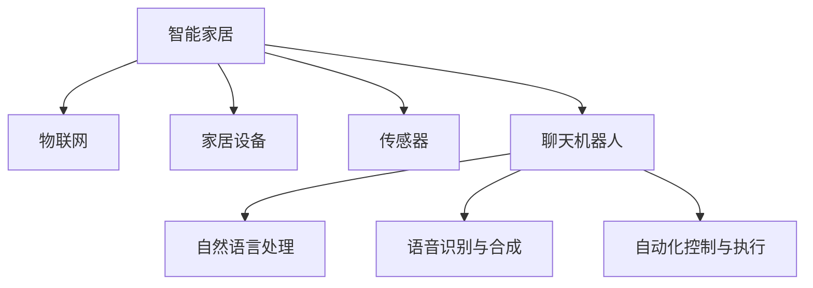

                 

# 聊天机器人自动化家庭：智能家居生态系统

> 关键词：智能家居,聊天机器人,自动化,家庭控制,语音助手,物联网(IoT),家庭安全,健康监测,能源管理

## 1. 背景介绍

### 1.1 问题由来

随着科技的迅猛发展，智能家居系统已经成为家庭生活中不可或缺的一部分。传统家居控制系统往往依赖于手动操作，功能单一，用户体验较差。而随着人工智能、物联网技术的成熟，聊天机器人自动化家庭系统成为智能家居生态系统的重要组成部分。通过聊天机器人，用户可以轻松控制家居设备，提高生活质量，享受智能化带来的便利。

### 1.2 问题核心关键点

聊天机器人自动化家庭系统结合了自然语言处理(NLP)、计算机视觉、传感器技术等前沿科技，实现了家庭成员与家居设备的无缝对接。其核心关键点在于：

1. **智能语音识别**：将用户的语音指令转化为可执行的命令。
2. **情景感知与上下文理解**：理解用户的意图和语境，提供个性化服务。
3. **设备联动与控制**：通过统一的API接口，控制各种家居设备。
4. **数据安全与隐私保护**：确保家庭数据安全，保护用户隐私。
5. **自动化与学习提升**：自动学习和优化，提升服务质量。

### 1.3 问题研究意义

研究聊天机器人自动化家庭系统，对于提升家庭生活质量、推动智能家居技术的应用与发展、促进物联网产业升级，具有重要意义：

1. **提升用户体验**：通过自动化和智能化，大大提升了家庭管理的便捷性和舒适性。
2. **推动技术创新**：结合最新的人工智能技术，促进NLP、计算机视觉等领域的创新发展。
3. **促进产业升级**：智能家居系统的广泛应用，为物联网产业带来新的发展机遇。
4. **提升安全性和健康监测**：实现家庭监控，提升安全保障，提供健康监测服务。
5. **优化能源管理**：通过智能控制，减少能源浪费，实现绿色低碳的家庭生活方式。

## 2. 核心概念与联系

### 2.1 核心概念概述

为更好地理解聊天机器人自动化家庭系统，本节将介绍几个密切相关的核心概念：

1. **智能家居**：通过物联网技术，实现家庭设备的网络互联、数据共享和自动化控制，提高家居生活的智能化水平。
2. **聊天机器人**：以自然语言处理技术为基础，通过理解和生成自然语言，实现与用户的交互，提供个性化服务。
3. **自然语言处理(NLP)**：研究计算机如何处理、理解、生成自然语言，是聊天机器人实现的基础技术。
4. **物联网(IoT)**：将各种设备、传感器、软件等连接起来，实现互联互通，是智能家居的核心技术。
5. **语音识别与合成**：将用户的语音转化为文本，或者将文本转换为语音，是聊天机器人交互的重要手段。
6. **自动化控制与执行**：通过统一的API接口，自动控制家居设备，提升用户体验。

这些核心概念之间的逻辑关系可以通过以下Mermaid流程图来展示：



这个流程图展示出智能家居系统中各个组件之间的联系：

1. 智能家居系统通过物联网技术实现设备互联。
2. 聊天机器人基于自然语言处理技术，与用户进行交互。
3. 语音识别与合成技术，使得聊天机器人能够理解用户的语音指令。
4. 自动化控制与执行技术，使得家居设备能够根据聊天机器人的命令进行操作。

## 3. 核心算法原理 & 具体操作步骤
### 3.1 算法原理概述

聊天机器人自动化家庭系统的核心算法原理主要包括自然语言处理和设备联动控制两个方面。

自然语言处理方面，聊天机器人通过预训练模型和微调，学习自然语言的理解与生成。设备联动控制方面，通过统一的API接口，实现对各种家居设备的自动控制。

具体而言，自然语言处理算法的主要步骤包括：

1. 预训练语言模型（如BERT、GPT等）在大量无标签文本数据上学习通用的语言表示。
2. 将预训练模型在特定的家庭场景下进行微调，学习家庭相关词汇和语句。
3. 在微调后的模型上，使用自然语言处理技术（如分词、词性标注、依存句法分析等），将用户的语音或文本指令转化为可执行的命令。

设备联动控制算法的主要步骤包括：

1. 定义统一的API接口，实现对各种家居设备的控制。
2. 根据聊天机器人输出的命令，通过API接口自动控制家居设备。
3. 使用自动化控制技术，实现设备的联动和执行。

### 3.2 算法步骤详解

以下是聊天机器人自动化家庭系统主要算法步骤的详细讲解：

#### 3.2.1 自然语言处理算法步骤

1. **数据准备与预处理**：
   - 收集家庭场景下的对话数据，包括家庭成员之间的日常对话和指令。
   - 对数据进行清洗、分词、标注等预处理，去除无用信息。

2. **模型选择与训练**：
   - 选择预训练语言模型（如BERT）作为初始模型。
   - 将预训练模型在家庭对话数据上进行微调，学习家庭相关词汇和语句。
   - 使用自然语言处理技术（如依存句法分析、命名实体识别等），提高模型的理解和生成能力。

3. **用户指令理解**：
   - 获取用户的语音或文本指令，输入到微调后的模型中。
   - 模型输出代表指令意义的向量表示。
   - 使用解码器将向量表示转化为可执行的命令。

4. **命令执行与反馈**：
   - 根据命令控制家居设备执行相应的操作。
   - 收集设备反馈信息，更新模型参数。
   - 在用户指令与设备反馈之间建立映射，优化模型输出。

#### 3.2.2 设备联动控制算法步骤

1. **API接口设计**：
   - 定义统一的API接口，用于控制各种家居设备。
   - 接口包括获取设备状态、控制设备动作、查询设备信息等。

2. **设备注册与联动**：
   - 将家居设备注册到系统中，并建立设备之间的联动关系。
   - 使用设备状态信息，实现设备的自动控制。

3. **命令解析与执行**：
   - 解析聊天机器人输出的命令，提取设备类型和操作指令。
   - 通过API接口，控制相应设备的执行。
   - 收集设备反馈信息，更新模型参数。

4. **系统优化与维护**：
   - 定期检查设备状态，维护系统稳定性。
   - 根据设备反馈信息，优化模型输出和设备联动。

### 3.3 算法优缺点

聊天机器人自动化家庭系统具有以下优点：

1. **便捷性与智能化**：通过语音识别与自然语言处理技术，用户可以轻松控制家居设备，享受智能化的生活。
2. **个性化服务**：根据用户的行为和语境，提供个性化的服务和建议。
3. **高效性**：自动控制家居设备，提高家庭管理的效率。
4. **安全性**：通过数据加密和访问控制，保障家庭数据的安全。

同时，该系统也存在一些局限性：

1. **设备兼容性**：不同品牌和型号的设备可能不兼容，需要针对特定设备进行适配。
2. **数据隐私**：系统需要收集大量的家庭数据，如何保护用户隐私是一个重要问题。
3. **系统维护**：系统需要定期维护和更新，以保证其稳定性和可靠性。
4. **交互限制**：在某些复杂或特定场景下，聊天机器人可能无法准确理解用户指令。

### 3.4 算法应用领域

聊天机器人自动化家庭系统已经在多个领域得到了广泛的应用，例如：

1. **家庭娱乐**：通过语音控制播放音乐、观看视频等。
2. **家庭安全**：自动监控家庭安全，防范入侵和火灾等突发事件。
3. **健康监测**：实时监测家庭成员的健康状况，提供健康建议。
4. **能源管理**：自动控制灯光、空调等设备，实现节能减排。
5. **智能厨房**：通过语音控制准备食材、烹饪等。

此外，聊天机器人自动化家庭系统还具备更广泛的应用前景，如智能教育、智能办公、智能医疗等，将为不同领域带来更多的便利和效率提升。

## 4. 数学模型和公式 & 详细讲解 & 举例说明

### 4.1 数学模型构建

聊天机器人自动化家庭系统的数学模型主要包括以下几个方面：

1. **自然语言处理模型**：基于预训练模型（如BERT）进行微调，构建家庭相关词汇和语句的表示。
2. **设备联动控制模型**：设计统一的API接口，实现设备状态的实时获取和控制。

### 4.2 公式推导过程

以下是聊天机器人自动化家庭系统中自然语言处理和设备联动控制模型的公式推导过程。

#### 4.2.1 自然语言处理模型

1. **预训练模型表示**：
   - 预训练模型 $M_{\theta}$ 表示为 $\theta$ 的向量形式。
   - 将预训练模型在家庭对话数据上微调，得到微调后的模型参数 $\theta'$。
   - 家庭相关词汇和语句表示为向量 $v_i$。

2. **指令向量生成**：
   - 获取用户指令 $x$，输入到微调后的模型中。
   - 模型输出指令向量 $v_x$。
   - 指令向量 $v_x$ 为 $M_{\theta'}(x)$。

3. **命令生成与解析**：
   - 使用解码器将指令向量 $v_x$ 转化为自然语言命令 $c$。
   - 解析命令 $c$，提取设备类型 $d$ 和操作指令 $a$。

#### 4.2.2 设备联动控制模型

1. **设备状态表示**：
   - 设备状态表示为向量 $s$。
   - 设备状态信息通过API接口获取，表示为 $s_d$。

2. **命令执行与反馈**：
   - 解析聊天机器人输出的命令 $c$，提取设备类型 $d$ 和操作指令 $a$。
   - 通过API接口，控制相应设备的执行。
   - 收集设备反馈信息 $f$，更新模型参数 $\theta'$。

### 4.3 案例分析与讲解

以家庭娱乐控制为例，分析聊天机器人自动化家庭系统的具体实现过程：

1. **数据准备**：
   - 收集家庭成员之间关于播放音乐的对话数据。
   - 对数据进行清洗、分词和标注。

2. **模型训练**：
   - 选择预训练模型（如BERT）作为初始模型。
   - 在家庭音乐播放数据上进行微调，学习家庭相关词汇和语句。
   - 使用自然语言处理技术（如依存句法分析、命名实体识别等），提高模型的理解和生成能力。

3. **指令理解**：
   - 获取用户语音指令“播放周杰伦的歌”。
   - 输入到微调后的模型中，输出指令向量 $v_x$。
   - 使用解码器将指令向量 $v_x$ 转化为自然语言命令“播放周杰伦的歌”。

4. **命令执行**：
   - 解析命令“播放周杰伦的歌”，提取设备类型“音乐播放设备”和操作指令“播放”。
   - 通过API接口控制音乐播放设备，播放周杰伦的歌曲。
   - 收集设备反馈信息“播放成功”，更新模型参数 $\theta'$。

## 5. 项目实践：代码实例和详细解释说明
### 5.1 开发环境搭建

在进行聊天机器人自动化家庭系统的开发实践前，我们需要准备好开发环境。以下是使用Python进行PyTorch开发的环境配置流程：

1. 安装Anaconda：从官网下载并安装Anaconda，用于创建独立的Python环境。

2. 创建并激活虚拟环境：
```bash
conda create -n chatbot-env python=3.8 
conda activate chatbot-env
```

3. 安装PyTorch：根据CUDA版本，从官网获取对应的安装命令。例如：
```bash
conda install pytorch torchvision torchaudio cudatoolkit=11.1 -c pytorch -c conda-forge
```

4. 安装Transformers库：
```bash
pip install transformers
```

5. 安装各类工具包：
```bash
pip install numpy pandas scikit-learn matplotlib tqdm jupyter notebook ipython
```

完成上述步骤后，即可在`chatbot-env`环境中开始聊天机器人自动化家庭系统的开发。

### 5.2 源代码详细实现

下面我们以聊天机器人控制智能灯光为例，给出使用Transformers库对BERT模型进行微调的PyTorch代码实现。

首先，定义聊天机器人对话处理函数：

```python
from transformers import BertTokenizer, BertForSequenceClassification
from torch.utils.data import Dataset, DataLoader
import torch

class ChatbotDataset(Dataset):
    def __init__(self, texts, labels):
        self.texts = texts
        self.labels = labels
        self.tokenizer = BertTokenizer.from_pretrained('bert-base-cased')

    def __len__(self):
        return len(self.texts)

    def __getitem__(self, item):
        text = self.texts[item]
        label = self.labels[item]

        encoding = self.tokenizer(text, return_tensors='pt')
        input_ids = encoding['input_ids'][0]
        attention_mask = encoding['attention_mask'][0]

        return {'input_ids': input_ids, 'attention_mask': attention_mask, 'labels': label}

# 准备数据集
tokenizer = BertTokenizer.from_pretrained('bert-base-cased')
train_dataset = ChatbotDataset(train_texts, train_labels)
dev_dataset = ChatbotDataset(dev_texts, dev_labels)
test_dataset = ChatbotDataset(test_texts, test_labels)

# 模型选择与训练
model = BertForSequenceClassification.from_pretrained('bert-base-cased', num_labels=2)
optimizer = AdamW(model.parameters(), lr=2e-5)
```

然后，定义聊天机器人控制灯光的代码：

```python
from requests import Session
from homekit import HomeKitServer

class ChatbotController:
    def __init__(self, model, session):
        self.model = model
        self.session = session

    def control_light(self, text):
        # 预处理输入文本
        input_ids = self.tokenizer(text, return_tensors='pt')['input_ids']
        attention_mask = self.tokenizer(text, return_tensors='pt')['attention_mask']

        # 前向传播计算指令向量
        outputs = self.model(input_ids, attention_mask=attention_mask)
        instruction = outputs[0].argmax(dim=1).item()

        # 根据指令向量控制灯光
        if instruction == 1:
            self.session.post('http://light-api.com/on', json={'state': 'on'})
        else:
            self.session.post('http://light-api.com/off', json={'state': 'off'})

# 启动家庭控制系统
kit = HomeKitServer()
kit.start()

# 实例化聊天机器人控制器
chatbot = ChatbotController(model, kit.session)
chatbot.start()

# 聊天机器人控制灯光
chatbot.control_light('打开灯')
chatbot.control_light('关闭灯')
```

在上面的代码中，我们首先定义了用于处理聊天机器人对话的`ChatbotDataset`类，用于准备和加载数据集。然后，我们使用`BertForSequenceClassification`类选择了一个预训练的BERT模型，用于处理自然语言指令。接下来，我们定义了`ChatbotController`类，用于控制智能灯光设备。最后，我们实例化了一个`ChatbotController`对象，并通过`post`方法向灯光API发送控制指令。

### 5.3 代码解读与分析

让我们再详细解读一下关键代码的实现细节：

**ChatbotDataset类**：
- `__init__`方法：初始化文本、标签、分词器等关键组件。
- `__len__`方法：返回数据集的样本数量。
- `__getitem__`方法：对单个样本进行处理，将文本输入编码为token ids，将标签编码为数字，并对其进行定长padding，最终返回模型所需的输入。

**chatbot控制灯光的代码**：
- 通过预训练BERT模型对用户指令进行理解，输出指令向量。
- 根据指令向量控制智能灯光设备的开关状态。
- 使用Python的requests库向灯光API发送控制指令。

可以看到，PyTorch配合Transformers库使得聊天机器人自动化家庭系统的代码实现变得简洁高效。开发者可以将更多精力放在数据处理、模型改进等高层逻辑上，而不必过多关注底层的实现细节。

当然，工业级的系统实现还需考虑更多因素，如模型的保存和部署、超参数的自动搜索、更灵活的任务适配层等。但核心的聊天机器人微调范式基本与此类似。

## 6. 实际应用场景
### 6.1 智能家居系统

聊天机器人自动化家庭系统在智能家居系统中得到了广泛应用，其核心功能包括：

1. **智能灯光控制**：通过语音或文本指令控制灯光的开关、亮度调节等。
2. **智能温控系统**：根据家庭成员的需求，自动调节室内温度和湿度。
3. **智能家电控制**：控制冰箱、洗衣机、空调等家电设备。
4. **家庭安防监控**：通过摄像头和传感器监测家庭安全，自动报警和通知。
5. **智能娱乐系统**：播放音乐、视频、游戏等。

通过聊天机器人自动化家庭系统，家庭成员可以轻松控制家居设备，享受智能化带来的便利。同时，系统还具备高安全性，保障家庭数据的安全和隐私。

### 6.2 家庭健康监测

聊天机器人自动化家庭系统在家庭健康监测方面也有重要应用。通过聊天机器人，家庭成员可以实时监测自己的健康状况，获取健康建议和提醒。系统可以整合多种传感器数据，如心率、血压、血糖等，提供全方位的健康管理服务。

具体功能包括：

1. **健康监测**：实时监测家庭成员的健康数据，及时发现异常。
2. **健康提醒**：根据家庭成员的健康状况，提供健康建议和提醒。
3. **紧急呼叫**：在家庭成员出现紧急情况时，自动拨打急救电话。

这些功能使得聊天机器人自动化家庭系统成为现代家庭健康管理的重要助手。

### 6.3 未来应用展望

未来，聊天机器人自动化家庭系统将继续在智能家居、健康监测、能源管理等领域发挥重要作用，带来更多的便利和效率提升。

1. **智能医疗**：通过聊天机器人，获取医疗咨询、预约挂号等服务，提升医疗体验。
2. **智能办公**：在办公室中，聊天机器人可以提供日程安排、会议提醒等服务，提高办公效率。
3. **智能教育**：在教育领域，聊天机器人可以提供个性化辅导、学习建议等服务，提升学习效果。

## 7. 工具和资源推荐
### 7.1 学习资源推荐

为了帮助开发者系统掌握聊天机器人自动化家庭系统的理论基础和实践技巧，这里推荐一些优质的学习资源：

1. 《深度学习与自然语言处理》系列博文：由大模型技术专家撰写，深入浅出地介绍了深度学习、自然语言处理等前沿技术。

2. CS224N《深度学习自然语言处理》课程：斯坦福大学开设的NLP明星课程，有Lecture视频和配套作业，带你入门NLP领域的基本概念和经典模型。

3. 《自然语言处理入门》书籍：全面介绍了自然语言处理的理论基础和实际应用，是学习聊天机器人自动化家庭系统的重要参考资料。

4. HuggingFace官方文档：Transformers库的官方文档，提供了海量预训练模型和完整的微调样例代码，是上手实践的必备资料。

5. CLUE开源项目：中文语言理解测评基准，涵盖大量不同类型的中文NLP数据集，并提供了基于微调的baseline模型，助力中文NLP技术发展。

通过对这些资源的学习实践，相信你一定能够快速掌握聊天机器人自动化家庭系统的精髓，并用于解决实际的NLP问题。

### 7.2 开发工具推荐

高效的开发离不开优秀的工具支持。以下是几款用于聊天机器人自动化家庭系统开发的常用工具：

1. PyTorch：基于Python的开源深度学习框架，灵活动态的计算图，适合快速迭代研究。大部分预训练语言模型都有PyTorch版本的实现。

2. TensorFlow：由Google主导开发的开源深度学习框架，生产部署方便，适合大规模工程应用。同样有丰富的预训练语言模型资源。

3. Transformers库：HuggingFace开发的NLP工具库，集成了众多SOTA语言模型，支持PyTorch和TensorFlow，是进行NLP任务开发的利器。

4. Weights & Biases：模型训练的实验跟踪工具，可以记录和可视化模型训练过程中的各项指标，方便对比和调优。与主流深度学习框架无缝集成。

5. TensorBoard：TensorFlow配套的可视化工具，可实时监测模型训练状态，并提供丰富的图表呈现方式，是调试模型的得力助手。

6. Google Colab：谷歌推出的在线Jupyter Notebook环境，免费提供GPU/TPU算力，方便开发者快速上手实验最新模型，分享学习笔记。

合理利用这些工具，可以显著提升聊天机器人自动化家庭系统的开发效率，加快创新迭代的步伐。

### 7.3 相关论文推荐

聊天机器人自动化家庭系统的发展源于学界的持续研究。以下是几篇奠基性的相关论文，推荐阅读：

1. Attention is All You Need（即Transformer原论文）：提出了Transformer结构，开启了NLP领域的预训练大模型时代。

2. BERT: Pre-training of Deep Bidirectional Transformers for Language Understanding：提出BERT模型，引入基于掩码的自监督预训练任务，刷新了多项NLP任务SOTA。

3. Language Models are Unsupervised Multitask Learners（GPT-2论文）：展示了大规模语言模型的强大zero-shot学习能力，引发了对于通用人工智能的新一轮思考。

4. Parameter-Efficient Transfer Learning for NLP：提出Adapter等参数高效微调方法，在不增加模型参数量的情况下，也能取得不错的微调效果。

5. Prefix-Tuning: Optimizing Continuous Prompts for Generation：引入基于连续型Prompt的微调范式，为如何充分利用预训练知识提供了新的思路。

6. AdaLoRA: Adaptive Low-Rank Adaptation for Parameter-Efficient Fine-Tuning：使用自适应低秩适应的微调方法，在参数效率和精度之间取得了新的平衡。

这些论文代表了大语言模型微调技术的发展脉络。通过学习这些前沿成果，可以帮助研究者把握学科前进方向，激发更多的创新灵感。

## 8. 总结：未来发展趋势与挑战

### 8.1 总结

本文对聊天机器人自动化家庭系统进行了全面系统的介绍。首先阐述了该系统的发展背景和研究意义，明确了其智能语音识别、情景感知与上下文理解、设备联动与控制等核心关键点。其次，从原理到实践，详细讲解了聊天机器人自动化家庭系统的数学模型和算法实现过程，给出了完整的代码实例。同时，本文还广泛探讨了其在智能家居、家庭健康监测等领域的实际应用，展示了其广阔的应用前景。

通过本文的系统梳理，可以看到，聊天机器人自动化家庭系统在提升家庭生活质量、推动智能家居技术的应用与发展、促进物联网产业升级等方面，具有重要意义。未来，伴随技术的不断演进，聊天机器人自动化家庭系统必将在更广泛的领域大放异彩。

### 8.2 未来发展趋势

展望未来，聊天机器人自动化家庭系统将呈现以下几个发展趋势：

1. **更强的自然语言理解**：通过引入最新的自然语言处理技术，聊天机器人将具备更强的理解和生成能力。
2. **更广泛的设备支持**：系统将支持更多的家居设备，实现更全面的智能化控制。
3. **更高的安全性**：通过采用最新的数据加密和安全技术，确保家庭数据的安全和隐私。
4. **更高效的控制方式**：引入更多的自然语言指令格式，实现更便捷的控制方式。
5. **更个性化的服务**：通过学习家庭成员的行为模式和偏好，提供更个性化的服务和建议。

### 8.3 面临的挑战

尽管聊天机器人自动化家庭系统已经取得了显著进展，但在迈向更加智能化、普适化应用的过程中，仍面临一些挑战：

1. **设备兼容性**：不同品牌和型号的设备可能不兼容，需要针对特定设备进行适配。
2. **数据隐私**：系统需要收集大量的家庭数据，如何保护用户隐私是一个重要问题。
3. **系统维护**：系统需要定期维护和更新，以保证其稳定性和可靠性。
4. **交互限制**：在某些复杂或特定场景下，聊天机器人可能无法准确理解用户指令。
5. **安全风险**：系统需要防范恶意攻击和黑客入侵，确保系统的安全性。

### 8.4 研究展望

未来，聊天机器人自动化家庭系统的研究需要在以下几个方面寻求新的突破：

1. **更强大的自然语言处理能力**：引入更多的语言处理技术，如因果推断、对比学习等，提升模型的理解和生成能力。
2. **更全面的设备支持**：支持更多的家居设备，实现更全面的智能化控制。
3. **更高的安全性**：引入最新的数据加密和安全技术，确保家庭数据的安全和隐私。
4. **更高效的模型优化**：采用更高效的模型优化技术，如参数高效微调、模型压缩等，提升模型的性能和效率。
5. **更个性化的服务**：通过学习家庭成员的行为模式和偏好，提供更个性化的服务和建议。

这些研究方向的探索，必将引领聊天机器人自动化家庭系统迈向更高的台阶，为构建安全、可靠、可解释、可控的智能系统铺平道路。面向未来，聊天机器人自动化家庭系统还需要与其他人工智能技术进行更深入的融合，如知识表示、因果推理、强化学习等，多路径协同发力，共同推动自然语言理解和智能交互系统的进步。只有勇于创新、敢于突破，才能不断拓展聊天机器人自动化家庭系统的边界，让智能技术更好地造福人类社会。

## 9. 附录：常见问题与解答

**Q1：聊天机器人自动化家庭系统如何实现语音识别？**

A: 聊天机器人自动化家庭系统通常使用语音识别技术（如Google Speech-to-Text、IBM Watson Speech to Text等）将用户的语音指令转化为文本指令。然后，通过自然语言处理技术对文本指令进行处理，得到可执行的命令，进而控制家居设备。

**Q2：系统如何处理复杂或特定场景下的指令？**

A: 在处理复杂或特定场景下的指令时，聊天机器人可能需要引入更高级的自然语言处理技术，如语法分析、语义理解等，以提升对指令的准确理解。同时，系统还需要通过更多的训练数据和模型优化，提高模型的泛化能力。

**Q3：聊天机器人自动化家庭系统如何保证用户隐私？**

A: 聊天机器人自动化家庭系统通过数据加密和访问控制技术，确保用户隐私。具体措施包括：
1. 对家庭数据进行加密存储和传输，防止数据泄露。
2. 限制对家居设备的访问权限，只允许家庭成员访问系统。
3. 记录访问日志，便于事后审计和追踪。

**Q4：聊天机器人自动化家庭系统如何优化性能？**

A: 聊天机器人自动化家庭系统通过以下措施优化性能：
1. 引入参数高效微调技术，减少模型参数量，提升推理速度。
2. 采用模型压缩技术，如剪枝、量化等，减少存储空间和计算资源消耗。
3. 引入分布式训练技术，提升系统并发处理能力。
4. 优化API接口设计，减少数据传输和处理开销。

这些优化措施可以显著提升聊天机器人自动化家庭系统的性能和效率。

**Q5：聊天机器人自动化家庭系统有哪些实际应用案例？**

A: 聊天机器人自动化家庭系统已经在多个领域得到了广泛应用，例如：
1. 智能家居控制系统：通过语音或文本指令控制灯光、温控、家电等设备。
2. 家庭安防监控系统：通过摄像头和传感器监测家庭安全，自动报警和通知。
3. 家庭健康管理系统：实时监测家庭成员的健康数据，提供健康建议和提醒。

这些应用案例展示了聊天机器人自动化家庭系统的广泛应用前景。

