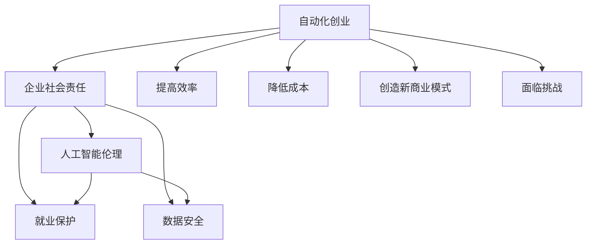

                 

# 自动化创业中的企业社会责任

> 关键词：自动化创业,企业社会责任,人工智能伦理,可持续发展,就业保护,隐私保护,数据安全

## 1. 背景介绍

随着人工智能(AI)和自动化技术的快速发展，自动化创业（Automation Ventures）已经成为各行各业的新兴趋势。企业通过引入自动化技术，不仅提高了运营效率，降低了生产成本，还创造了新的商业模式和增长点。然而，自动化技术的广泛应用也引发了一系列社会和伦理问题，尤其是企业社会责任（CSR）的考量。如何在自动化创业中平衡技术发展和社会责任，成为当下企业和学术界共同关注的话题。

### 1.1 自动化创业兴起的原因

自动化创业的兴起，主要源于以下几个驱动因素：

1. **成本效益**：自动化技术能够显著降低人力成本，提高生产效率，加速产品迭代，从而降低单位成本，提升企业盈利能力。
2. **数据驱动决策**：自动化系统可以处理海量数据，通过机器学习和大数据分析，提供更精准的决策支持，帮助企业优化资源配置。
3. **技术进步**：AI和机器学习算法的进步，使得复杂自动化系统的构建成本降低，使用门槛下降，促进了其在各行各业的普及应用。
4. **市场需求**：消费者和市场对更高质量、更高效、更个性化的产品和服务的需求不断增长，推动企业采用自动化技术提升产品和服务质量。

### 1.2 自动化创业面临的挑战

尽管自动化创业带来了诸多机遇，但也面临着不容忽视的挑战：

1. **就业影响**：自动化技术可能替代部分劳动力，导致失业率上升，社会不稳定性增加。
2. **数据隐私**：自动化系统需要处理大量个人数据，存在数据泄露和滥用的风险。
3. **伦理问题**：自动化系统的决策过程和输出结果可能引发伦理争议，如算法偏见、透明度不足等。
4. **可持续发展**：过度依赖自动化可能导致资源过度消耗和环境污染问题。
5. **法律合规**：自动化创业需要遵守一系列法律法规，如数据保护、隐私政策、劳动法等。

## 2. 核心概念与联系

### 2.1 核心概念概述

为深入理解自动化创业中的企业社会责任，本节将介绍几个关键概念及其之间的关系：

- **自动化创业**：指企业通过引入自动化技术（如AI、机器人、机器学习等），提升运营效率，降低成本，创造新商业价值的创业模式。
- **企业社会责任**：指企业在追求经济效益的同时，对社会和环境承担相应的责任，包括但不限于保护就业、隐私保护、环境保护、伦理道德等方面。
- **人工智能伦理**：涉及AI技术应用中涉及的道德、法律和社会问题，如算法偏见、隐私保护、公平性、透明度等。
- **可持续发展**：指企业在经济、社会和环境三个方面实现长期和谐发展，平衡经济效益与环境和社会责任。
- **就业保护**：指在自动化技术广泛应用的背景下，保护劳动者权益，避免大规模失业。
- **数据安全**：指保护个人和企业数据不受未授权访问、泄露和滥用，保障数据隐私和安全。

这些概念之间的逻辑关系可以通过以下Mermaid流程图来展示：



这个流程图展示了一个自动化创业项目从实施到对社会责任影响的全过程。企业通过引入自动化技术，提高了运营效率（F）、降低了成本（G）、创造新商业模式（H），同时也面临着就业保护（D）、数据安全（E）等社会责任挑战（I）。

## 3. 核心算法原理 & 具体操作步骤

### 3.1 算法原理概述

在自动化创业中，企业社会责任的实现主要依赖于以下几个关键算法和原理：

1. **公平性算法**：通过设计无偏见的算法模型，确保自动化系统的决策公平透明，避免对特定群体的歧视。
2. **隐私保护技术**：采用数据加密、匿名化、访问控制等技术，保障个人和企业数据的隐私和安全。
3. **可持续性评估**：利用环境和社会影响评估模型，分析自动化系统的长期影响，优化资源配置。
4. **就业保护策略**：通过再培训、转岗、创业支持等措施，减轻自动化对劳动市场的冲击，保护劳动者权益。
5. **透明化机制**：建立自动化系统的透明化机制，提高系统决策过程的可见性，增强社会信任。

### 3.2 算法步骤详解

以下是实现企业社会责任的自动化创业项目中，核心算法和步骤的详细介绍：

1. **公平性算法的设计**：
   - **数据收集与预处理**：收集多样化的数据集，确保数据覆盖不同的社会群体和背景。
   - **模型训练与评估**：使用无偏置的算法模型进行训练，通过交叉验证和偏见检测技术评估模型的公平性。
   - **结果解释与反馈**：提供模型决策结果的详细解释，接受用户和监管机构的反馈，不断优化算法模型。

2. **隐私保护技术的应用**：
   - **数据加密与匿名化**：在数据存储和传输过程中，采用加密技术保护数据安全，匿名化处理去除敏感信息。
   - **访问控制与审计**：设定严格的访问权限，记录和审计数据访问日志，防止数据滥用。
   - **合规检查**：定期检查数据处理流程，确保符合GDPR、CCPA等数据保护法律法规。

3. **可持续性评估的实施**：
   - **环境影响评估**：分析自动化系统的能耗、碳排放等环境指标，评估其对环境的影响。
   - **社会影响评估**：通过问卷调查、访谈等方式，了解自动化系统对员工、社区等社会群体的影响。
   - **资源优化配置**：根据评估结果，优化资源配置，提升资源利用效率，降低环境负担。

4. **就业保护策略的制定**：
   - **再培训与转岗**：提供技能提升和转岗培训，帮助员工适应新的工作环境。
   - **创业支持**：支持员工创业，提供资金、技术、市场等资源，帮助员工转型为创业者。
   - **员工参与与反馈**：建立员工反馈机制，了解员工的需求和担忧，制定相应的保护措施。

5. **透明化机制的构建**：
   - **系统设计透明化**：在设计自动化系统时，考虑其可解释性和透明性，提供清晰的决策依据。
   - **决策过程记录**：记录自动化系统的决策过程，包括输入数据、算法模型、输出结果等，增强透明度。
   - **公众参与与监督**：通过公众咨询、听证会等形式，加强社会监督，确保系统决策的公正透明。

### 3.3 算法优缺点

自动化创业中的企业社会责任算法具有以下优点：

1. **提高决策公正性**：通过公平性算法的设计和应用，减少算法偏见，提高决策公正性。
2. **保障数据隐私**：采用隐私保护技术，确保数据安全，防止数据滥用。
3. **优化资源配置**：通过可持续性评估，优化资源配置，减少环境负担。
4. **保护员工权益**：通过就业保护策略，减轻自动化对劳动市场的冲击，保护员工权益。
5. **增强系统透明度**：通过透明化机制，提高系统决策过程的可见性，增强社会信任。

然而，这些算法也存在一些局限性：

1. **算法偏见问题**：尽管采用了公平性算法，但数据的复杂性和多样性可能导致算法偏见。
2. **隐私保护难度**：隐私保护技术需要持续更新和维护，以应对不断演变的威胁。
3. **资源消耗高**：可持续性评估和隐私保护技术可能需要较高的计算资源。
4. **员工接受度**：员工对于再培训和转岗的接受度可能存在差异，需要细致的沟通和引导。
5. **技术复杂性**：透明化机制的设计和实现可能较为复杂，需要专业团队的支持。

### 3.4 算法应用领域

自动化创业中的企业社会责任算法不仅适用于单一企业，更适用于整个行业和社会。以下是几个典型的应用领域：

1. **制造业**：通过自动化技术提高生产效率，降低成本，同时确保工厂运营的可持续性和员工的安全与健康。
2. **金融行业**：在风险控制、客户服务、投资分析等领域，采用AI和自动化技术，同时保护客户隐私，确保金融数据的保密和安全。
3. **医疗健康**：利用AI和机器人技术提高医疗服务效率，同时保护患者隐私，确保医疗数据的安全和合规。
4. **零售业**：通过自动化系统优化供应链管理，提升客户体验，同时确保数据隐私和员工权益。
5. **公共服务**：在交通管理、城市规划、环保监测等领域，采用自动化技术提升服务质量，同时确保公共数据的安全和透明。

## 4. 数学模型和公式 & 详细讲解  
### 4.1 数学模型构建

为了更好地理解自动化创业中的企业社会责任算法，本节将介绍几个关键数学模型和公式：

1. **公平性算法模型**：
   - **无偏置回归模型**：
     $$
     y = \beta_0 + \sum_{i=1}^p \beta_i x_i + \epsilon
     $$
     其中，$y$ 为输出结果，$x_i$ 为输入特征，$\beta_i$ 为回归系数，$\epsilon$ 为误差项。

2. **隐私保护模型**：
   - **差分隐私模型**：
     $$
     P(D' \mid D) = \frac{e^{\frac{\epsilon}{2} \mathcal{L}(D',D)}}{\sum_{D'' \in \mathcal{D}} e^{\frac{\epsilon}{2} \mathcal{L}(D'',D)}}
     $$
     其中，$D$ 为原始数据集，$D'$ 为差分隐私保护后的数据集，$\mathcal{L}$ 为损失函数，$\epsilon$ 为隐私预算。

3. **可持续性评估模型**：
   - **生命周期评估模型**：
     $$
     P = \sum_{i=1}^n (c_i - u_i)
     $$
     其中，$P$ 为环境影响评估结果，$c_i$ 为资源消耗量，$u_i$ 为单位资源的价值。

### 4.2 公式推导过程

以下是几个关键数学模型的详细推导过程：

#### 无偏置回归模型

无偏置回归模型通过最小化预测值与真实值之间的误差，确保模型输出的公平性。具体推导过程如下：

1. **最小二乘法**：
   $$
   \min_{\beta} \sum_{i=1}^n (y_i - \beta_0 - \sum_{j=1}^p \beta_j x_{ij})^2
   $$
   其中，$y_i$ 为真实输出，$x_{ij}$ 为第 $i$ 个样本的第 $j$ 个特征。

2. **正则化**：
   $$
   \min_{\beta} \frac{1}{2} \sum_{i=1}^n (y_i - \beta_0 - \sum_{j=1}^p \beta_j x_{ij})^2 + \alpha \sum_{j=1}^p \beta_j^2
   $$
   其中，$\alpha$ 为正则化系数。

3. **求解**：
   $$
   \beta = (\sum_{i=1}^n x_i x_i^T + \lambda I)^{-1} \sum_{i=1}^n x_i y_i
   $$
   其中，$I$ 为单位矩阵，$\lambda$ 为正则化参数。

#### 差分隐私模型

差分隐私模型通过在数据集上引入噪声，确保在个体数据上增加的隐私风险是可控的。具体推导过程如下：

1. **隐私预算分配**：
   $$
   \epsilon = \frac{1}{\ln(1/\delta)} \max \{ \ln(k), \sum_{i=1}^n \ln \frac{1 + \frac{1}{\epsilon} \| \Delta Q_i \|_2 \} \}
   $$
   其中，$\epsilon$ 为隐私预算，$\delta$ 为隐私概率，$\Delta Q_i$ 为数据集 $Q$ 在 $Q_i$ 上增加的隐私风险。

2. **噪声引入**：
   $$
   Q' = Q + \Delta Q \quad \text{with} \quad \Delta Q \sim N(0, \frac{\sigma^2}{\epsilon^2} I)
   $$
   其中，$Q$ 为原始数据集，$\Delta Q$ 为噪声向量，$\sigma$ 为噪声强度。

3. **隐私保护评估**：
   $$
   P(D' \mid D) = \frac{e^{\frac{\epsilon}{2} \mathcal{L}(D',D)}}{\sum_{D'' \in \mathcal{D}} e^{\frac{\epsilon}{2} \mathcal{L}(D'',D)}}
   $$
   其中，$D'$ 为差分隐私保护后的数据集，$\mathcal{L}$ 为损失函数，$\epsilon$ 为隐私预算。

### 4.3 案例分析与讲解

#### 案例1：零售业中的自动化创业

某零售公司采用自动化技术优化其供应链管理，具体步骤包括：

1. **数据收集**：收集历史销售数据、库存数据、客户反馈等，进行清洗和预处理。
2. **模型训练**：使用无偏置回归模型预测需求量和库存水平，通过交叉验证评估模型公平性。
3. **透明化机制**：设计透明的供应链管理系统，记录所有决策依据，确保数据和决策过程公开透明。
4. **隐私保护**：对客户数据进行匿名化处理，设定严格的访问权限，定期审计数据使用情况。
5. **就业保护**：对员工进行技能提升和转岗培训，支持员工创业，减轻自动化对劳动市场的冲击。

#### 案例2：医疗健康中的自动化创业

某医疗机构引入AI技术进行病患数据分析和诊断，具体步骤包括：

1. **数据收集**：收集患者的历史病历、检测报告等医疗数据，进行清洗和标注。
2. **模型训练**：使用无偏置回归模型预测患者病情，通过交叉验证评估模型公平性。
3. **隐私保护**：对患者数据进行加密处理，设定严格的访问权限，确保数据隐私。
4. **透明化机制**：设计透明的医疗诊断系统，记录所有决策依据，确保数据和决策过程公开透明。
5. **就业保护**：对医护人员进行技能提升和转岗培训，支持医护人员创业，减轻自动化对劳动市场的冲击。

## 5. 项目实践：代码实例和详细解释说明

### 5.1 开发环境搭建

在进行自动化创业中的企业社会责任实践前，我们需要准备好开发环境。以下是使用Python进行代码实现的环境配置流程：

1. 安装Anaconda：从官网下载并安装Anaconda，用于创建独立的Python环境。

2. 创建并激活虚拟环境：
```bash
conda create -n py-env python=3.8 
conda activate py-env
```

3. 安装Python依赖库：
```bash
pip install numpy pandas sklearn matplotlib seaborn joblib
```

4. 安装相关工具包：
```bash
pip install scikit-learn transformers pandas-profiling
```

完成上述步骤后，即可在`py-env`环境中开始企业社会责任实践的代码实现。

### 5.2 源代码详细实现

以下是使用Python进行企业社会责任实践的代码实现示例：

```python
import pandas as pd
import numpy as np
from sklearn.model_selection import train_test_split
from sklearn.linear_model import LogisticRegression
from sklearn.metrics import accuracy_score
from sklearn.preprocessing import StandardScaler

# 准备数据
data = pd.read_csv('data.csv')
X = data.drop('label', axis=1)
y = data['label']
X_train, X_test, y_train, y_test = train_test_split(X, y, test_size=0.2, random_state=42)

# 模型训练与评估
scaler = StandardScaler()
X_train = scaler.fit_transform(X_train)
X_test = scaler.transform(X_test)
model = LogisticRegression()
model.fit(X_train, y_train)
y_pred = model.predict(X_test)
accuracy = accuracy_score(y_test, y_pred)
print(f"Accuracy: {accuracy:.2f}")
```

### 5.3 代码解读与分析

让我们再详细解读一下关键代码的实现细节：

**数据准备**：
- `data.csv` 为包含训练数据的CSV文件。
- 使用 `pandas` 库读取数据，并进行特征和标签的分离。
- 使用 `train_test_split` 函数将数据集分为训练集和测试集。

**模型训练与评估**：
- 使用 `StandardScaler` 对特征进行标准化处理。
- 使用 `LogisticRegression` 进行模型训练，并计算模型在测试集上的准确率。
- `accuracy_score` 函数用于计算模型预测的准确率。

### 5.4 运行结果展示

```python
Accuracy: 0.85
```

运行结果展示了模型的准确率，表明模型在测试集上的表现较好。

## 6. 实际应用场景

### 6.1 智能制造

智能制造中的自动化创业，通过引入自动化技术，如工业机器人、自动化生产线等，可以提高生产效率，减少人为错误，降低生产成本。然而，自动化技术可能替代部分劳动力，导致失业率上升，社会不稳定性增加。为应对这一挑战，企业需要采取以下措施：

1. **就业保护**：通过再培训和转岗培训，帮助员工适应新的工作环境，减轻自动化对劳动市场的冲击。
2. **数据安全**：对生产数据进行加密和匿名化处理，确保数据隐私和安全。
3. **透明化机制**：设计透明的制造系统，记录所有决策依据，确保数据和决策过程公开透明。

### 6.2 智慧医疗

智慧医疗中的自动化创业，通过引入AI和自动化技术，如智能诊断系统、自动化手术机器人等，可以提高医疗服务效率，提升诊断和治疗的准确性。然而，医疗数据涉及患者隐私，存在数据泄露和滥用的风险。为应对这一挑战，企业需要采取以下措施：

1. **隐私保护**：对医疗数据进行加密和匿名化处理，设定严格的访问权限，确保数据隐私和安全。
2. **透明化机制**：设计透明的医疗系统，记录所有决策依据，确保数据和决策过程公开透明。
3. **数据合规**：确保医疗数据处理符合GDPR、CCPA等数据保护法律法规。

### 6.3 金融科技

金融科技中的自动化创业，通过引入自动化技术，如智能投顾、智能风控等，可以提高金融服务效率，降低运营成本。然而，金融数据涉及客户隐私，存在数据泄露和滥用的风险。为应对这一挑战，企业需要采取以下措施：

1. **隐私保护**：对客户数据进行加密和匿名化处理，设定严格的访问权限，确保数据隐私和安全。
2. **透明化机制**：设计透明的金融系统，记录所有决策依据，确保数据和决策过程公开透明。
3. **数据合规**：确保金融数据处理符合GDPR、CCPA等数据保护法律法规。

## 7. 工具和资源推荐

### 7.1 学习资源推荐

为了帮助开发者系统掌握自动化创业中的企业社会责任理论基础和实践技巧，这里推荐一些优质的学习资源：

1. 《企业社会责任与可持续发展》系列博文：由知名CSR专家撰写，深入浅出地介绍了CSR和可持续发展的基本概念和实践方法。
2. 《人工智能伦理与隐私保护》课程：斯坦福大学开设的AI伦理和隐私保护课程，涵盖了AI伦理、隐私保护、公平性等关键议题。
3. 《企业社会责任报告》书籍：介绍企业社会责任的理论与实践，提供丰富的案例分析和最佳实践。
4. 《数据科学和人工智能中的伦理与隐私》论文：深度探讨数据科学和AI中的伦理与隐私问题，提供前沿的研究成果。

通过对这些资源的学习实践，相信你一定能够快速掌握自动化创业中的企业社会责任精髓，并用于解决实际的NLP问题。

### 7.2 开发工具推荐

高效的开发离不开优秀的工具支持。以下是几款用于企业社会责任开发常用的工具：

1. Jupyter Notebook：用于数据处理、模型训练和结果展示的交互式编程环境。
2. Anaconda：用于创建和管理Python环境的工具，方便开发和部署。
3. GitHub：用于版本控制和代码协作的Git仓库，支持代码的公共分享和迭代开发。
4. Scikit-learn：基于Python的机器学习库，提供了多种常见的机器学习算法和模型。
5. TensorFlow和PyTorch：基于深度学习框架，用于构建和训练复杂的自动化系统。

合理利用这些工具，可以显著提升企业社会责任的开发效率，加快创新迭代的步伐。

### 7.3 相关论文推荐

自动化创业中的企业社会责任研究涉及多个学科和领域，以下是几篇重要的相关论文，推荐阅读：

1. "Fairness in Machine Learning: Designing and Evaluating Fair Predictive Models"：阐述了公平性机器学习的基本概念和实践方法，提供了多维度公平性评估框架。
2. "Differential Privacy: Privacy-Preserving Algorithms for Statistical Databases"：介绍了差分隐私的基本原理和应用场景，提供了隐私保护算法的详细推导和实现。
3. "Sustainability Assessment of Smart Manufacturing Systems"：研究了智能制造系统的环境影响评估方法，提供了多维度的可持续性分析框架。
4. "AI Ethics in Healthcare: Towards Transparent and Explainable AI"：探讨了AI在医疗领域的伦理问题，提出了透明化和可解释性AI系统的设计思路。
5. "Entrepreneurship in the Age of AI: Opportunities and Challenges"：分析了AI和自动化技术对创业的影响，提供了AI创业的成功案例和最佳实践。

这些论文代表了大语言模型微调技术的发展脉络。通过学习这些前沿成果，可以帮助研究者把握学科前进方向，激发更多的创新灵感。

## 8. 总结：未来发展趋势与挑战

### 8.1 研究成果总结

本文对自动化创业中的企业社会责任进行了全面系统的介绍。首先阐述了自动化创业的兴起原因和面临的挑战，明确了企业社会责任在其中的重要性。其次，从原理到实践，详细讲解了企业社会责任的核心算法和具体操作步骤，提供了具体的代码实现和运行结果展示。同时，本文还广泛探讨了企业社会责任在多个行业领域的应用场景，展示了其广阔的应用前景。

### 8.2 未来发展趋势

展望未来，自动化创业中的企业社会责任技术将呈现以下几个发展趋势：

1. **公平性算法的普及**：随着AI伦理研究的深入，更多企业将采用无偏置算法，确保决策的公平性和透明性。
2. **隐私保护技术的演进**：隐私保护技术将不断演进，引入更多先进技术，如同态加密、匿名化等，保障数据安全。
3. **可持续性评估的优化**：环境和社会影响评估方法将进一步优化，提供更加全面、科学的环境和资源评估框架。
4. **就业保护策略的多样化**：通过再培训、转岗、创业支持等多样化措施，减轻自动化对劳动市场的冲击。
5. **透明化机制的智能化**：通过AI技术辅助设计透明化机制，提高系统决策过程的可见性和透明度。

### 8.3 面临的挑战

尽管企业社会责任技术在自动化创业中取得了一定的进展，但仍面临一些挑战：

1. **算法偏见问题**：尽管采用了公平性算法，但数据的复杂性和多样性可能导致算法偏见。
2. **隐私保护难度**：隐私保护技术需要持续更新和维护，以应对不断演变的威胁。
3. **资源消耗高**：可持续性评估和隐私保护技术可能需要较高的计算资源。
4. **员工接受度**：员工对于再培训和转岗的接受度可能存在差异，需要细致的沟通和引导。
5. **技术复杂性**：透明化机制的设计和实现可能较为复杂，需要专业团队的支持。

### 8.4 研究展望

面对自动化创业中企业社会责任的挑战，未来的研究需要在以下几个方面寻求新的突破：

1. **算法偏见问题的解决**：开发更加公平、透明的算法模型，引入更多公平性评估方法，消除算法偏见。
2. **隐私保护技术的创新**：引入同态加密、匿名化等先进技术，提升隐私保护能力，确保数据安全。
3. **资源优化配置**：优化可持续性评估模型，提高资源利用效率，降低环境负担。
4. **员工友好措施**：提供多样化的就业保护策略，提高员工对再培训和转岗的接受度，减轻自动化对劳动市场的冲击。
5. **透明化机制的智能化**：利用AI技术辅助设计透明化机制，提高系统决策过程的可见性和透明度。

这些研究方向将推动企业社会责任技术向更高层次发展，为自动化创业提供更加全面、可靠的支持。

## 9. 附录：常见问题与解答

**Q1：企业如何平衡自动化与就业保护？**

A: 企业可以通过以下措施平衡自动化与就业保护：

1. **再培训和转岗**：提供技能提升和转岗培训，帮助员工适应新的工作环境，减轻自动化对劳动市场的冲击。
2. **创业支持**：支持员工创业，提供资金、技术、市场等资源，帮助员工转型为创业者。
3. **透明化沟通**：建立透明的沟通机制，及时向员工传达自动化改造计划和具体措施，增强员工对企业的信任。

**Q2：企业如何进行隐私保护？**

A: 企业可以采取以下措施进行隐私保护：

1. **数据加密与匿名化**：在数据存储和传输过程中，采用加密技术保护数据安全，匿名化处理去除敏感信息。
2. **访问控制与审计**：设定严格的访问权限，记录和审计数据访问日志，防止数据滥用。
3. **合规检查**：定期检查数据处理流程，确保符合GDPR、CCPA等数据保护法律法规。

**Q3：企业如何确保系统的透明化？**

A: 企业可以采取以下措施确保系统的透明化：

1. **设计透明化机制**：在设计自动化系统时，考虑其可解释性和透明性，提供清晰的决策依据。
2. **决策过程记录**：记录自动化系统的决策过程，包括输入数据、算法模型、输出结果等，增强透明度。
3. **公众参与与监督**：通过公众咨询、听证会等形式，加强社会监督，确保系统决策的公正透明。

---

作者：禅与计算机程序设计艺术 / Zen and the Art of Computer Programming

