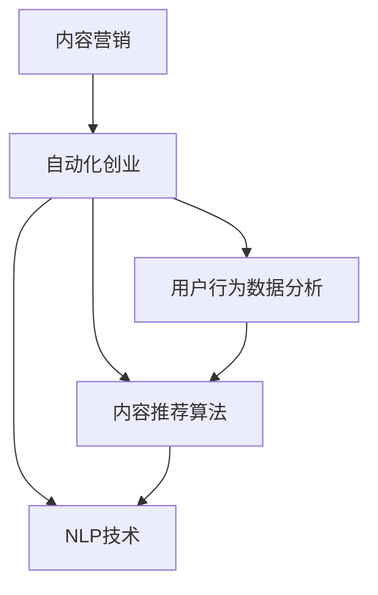

                 

# 自动化创业中的内容营销策略

## 1. 背景介绍

### 1.1 问题由来

在快速变化的商业环境中，内容营销（Content Marketing）已成为自动化创业（Autonomous Business）的重要驱动力之一。借助先进的数据分析、算法推荐和个性化定制技术，内容营销不仅能够帮助企业精准触达目标用户，提升品牌知名度和市场份额，还能降低运营成本，优化营销效果。然而，如何高效、可持续地生成高质量内容，并结合用户行为数据分析，实现内容的智能化、个性化推荐，成为自动化创业中亟待解决的问题。

### 1.2 问题核心关键点

在自动化创业中，内容营销策略的核心在于通过算法和技术的深度融合，生成与用户需求高度匹配的内容，并通过多渠道分发，提升内容的触达率和转化率。具体而言，包括：

- 用户行为数据分析：通过分析用户浏览、点击、评论等数据，洞察用户需求和兴趣。
- 内容生成与优化：基于用户兴趣和需求，使用机器学习算法生成个性化内容，并通过A/B测试不断优化。
- 内容分发与推荐：结合用户行为数据和内容标签，使用推荐算法（如协同过滤、内容推荐等）实现内容智能化推荐。
- 效果评估与迭代：定期评估内容营销的效果，分析用户反馈和点击率等指标，不断优化和调整策略。

本文聚焦于自动化创业中内容营销的策略和技术实现，希望通过系统梳理和深入探讨，为创业者和营销人员提供实用的参考和指导。

## 2. 核心概念与联系

### 2.1 核心概念概述

为更好地理解自动化创业中的内容营销策略，本节将介绍几个密切相关的核心概念：

- 内容营销（Content Marketing）：通过创造和分发有价值、相关且一致的内容，以吸引、并留住明确定义的受众，从而推动有利的客户行动。
- 自动化创业（Autonomous Business）：利用自动化技术，提升运营效率和市场响应速度，降低成本，提升竞争力。
- 用户行为数据分析（User Behavior Analytics）：通过对用户在线行为数据的分析，洞察用户兴趣和需求，为内容生成和推荐提供依据。
- 内容推荐算法（Content Recommendation Algorithms）：使用算法模型，结合用户兴趣和内容特征，实现内容的智能化推荐。
- 自然语言处理（Natural Language Processing, NLP）：利用计算机技术处理和分析人类语言，包括文本分类、情感分析、自动摘要、文本生成等技术。

这些核心概念之间的逻辑关系可以通过以下Mermaid流程图来展示：



这个流程图展示了一个典型的内容营销过程：

1. 内容营销是自动化创业的重要组成部分。
2. 用户行为数据分析为内容生成和推荐提供依据。
3. 内容推荐算法实现内容的智能化、个性化推荐。
4. NLP技术为内容处理和分析提供支持。

这些核心概念共同构成了自动化创业中内容营销的基础框架，使其能够高效、精准地触达用户，提升营销效果。

## 3. 核心算法原理 & 具体操作步骤
### 3.1 算法原理概述

自动化创业中的内容营销策略主要依赖于用户行为数据分析、内容生成与优化、内容推荐算法等关键技术。其核心思想是：通过算法自动化处理大量用户数据和内容数据，分析用户需求和兴趣，生成个性化内容，并通过推荐算法实现内容的精准投放，提升用户参与度和转化率。

具体而言，算法原理主要包括以下几个方面：

1. **用户行为数据分析**：通过用户行为数据（如点击、浏览、购买等），挖掘用户兴趣和行为特征，为内容生成和推荐提供依据。
2. **内容生成与优化**：利用自然语言处理（NLP）技术，自动生成高质量内容，并通过A/B测试不断优化，以提高用户满意度。
3. **内容推荐算法**：结合用户兴趣和内容特征，使用协同过滤、内容推荐等算法，实现内容的智能化推荐，提升内容的触达率和转化率。

### 3.2 算法步骤详解

自动化创业中的内容营销策略主要包括以下几个关键步骤：

**Step 1: 数据收集与预处理**

1. 收集用户行为数据：通过网站、应用等渠道，收集用户的操作行为数据，包括点击、浏览、停留时间、购买等。
2. 数据清洗与预处理：去除无效、重复数据，填补缺失值，进行数据标准化和归一化处理。

**Step 2: 用户行为特征提取**

1. 用户行为特征工程：通过特征工程技术，将原始数据转换为可供模型分析的特征向量。常用的特征包括用户ID、浏览时长、浏览路径、购买金额等。
2. 用户行为聚类分析：使用聚类算法（如K-Means、层次聚类等），将用户分为不同兴趣群体，为内容生成和推荐提供依据。

**Step 3: 内容生成与优化**

1. 内容生成：使用文本生成模型（如GPT-3、BERT等）自动生成高质量内容，包括文章、视频、图片等。
2. A/B测试与优化：通过A/B测试，比较不同版本内容的表现，根据用户反馈和点击率等指标，不断优化内容。

**Step 4: 内容推荐算法实现**

1. 协同过滤推荐：通过用户行为数据和内容特征，使用协同过滤算法（如基于用户的协同过滤、基于项目的协同过滤）实现内容推荐。
2. 内容推荐算法优化：结合用户兴趣和内容特征，不断优化推荐算法，提升推荐的精准度和效果。

**Step 5: 效果评估与迭代**

1. 效果评估：通过用户点击率、转化率、留存率等指标，评估内容营销的效果。
2. 迭代优化：根据效果评估结果，不断优化内容生成、推荐算法等，提升整体营销效果。

### 3.3 算法优缺点

自动化创业中的内容营销策略具有以下优点：

1. **效率高**：通过算法自动化处理大量数据，大大提升了内容生成和推荐的效率。
2. **个性化强**：基于用户行为数据分析，生成个性化内容，提升了用户的参与度和满意度。
3. **成本低**：自动化技术降低了人工干预和运营成本，提高了营销活动的ROI（投资回报率）。

然而，该策略也存在以下缺点：

1. **算法依赖性高**：内容推荐和优化依赖于算法的性能，如果算法模型训练不足或不够精准，可能导致内容质量不高。
2. **数据隐私风险**：用户行为数据的收集和使用可能涉及隐私问题，需要严格遵守数据保护法规。
3. **内容过拟合**：如果过度依赖历史数据，可能导致模型对新数据的泛化能力不足，降低内容的相关性和吸引力。

### 3.4 算法应用领域

基于自动化创业中的内容营销策略，已经在多个领域得到应用，例如：

- 电子商务：通过个性化推荐算法，提升用户的购买率和复购率。
- 内容平台：使用自动生成和优化技术，快速生产高质量内容，提升平台的用户粘性和活跃度。
- 教育培训：结合用户学习行为数据分析，生成个性化学习内容和推荐，提升学习效果。
- 媒体传播：利用内容推荐算法，实现新闻、文章等的精准分发，提高传播效果和用户参与度。
- 旅游行业：结合用户旅游行为数据分析，生成个性化旅游内容和推荐，提升用户体验和转化率。

除了上述这些经典应用外，自动化创业中的内容营销策略还被创新性地应用到更多场景中，如健康医疗、金融服务、智能家居等，为这些领域的数字化转型提供了新的思路和工具。

## 4. 数学模型和公式 & 详细讲解 & 举例说明
### 4.1 数学模型构建

本节将使用数学语言对自动化创业中内容营销的算法流程进行更加严格的刻画。

记用户行为数据为 $D=\{(x_i,y_i)\}_{i=1}^N$，其中 $x_i$ 为行为特征向量，$y_i$ 为对应的用户行为标签（如浏览、购买等）。内容特征向量为 $C=\{(c_j)\}_{j=1}^M$，其中 $c_j$ 为内容的特征向量。

定义内容推荐模型为 $F(x_i,C)$，用于根据用户行为和内容特征预测用户对内容的兴趣度。推荐算法的目标是最小化预测误差，即：

$$
\min_{F} \sum_{i=1}^N \ell(F(x_i,C),y_i)
$$

其中 $\ell$ 为预测误差函数，如均方误差（MSE）、交叉熵损失（CE Loss）等。

### 4.2 公式推导过程

以下我们以协同过滤推荐算法为例，推导其数学模型和损失函数。

假设用户 $u$ 对 $n$ 个内容的评分向量为 $R_u=\{r_{u,c_j}\}_{j=1}^n$，内容 $c_j$ 的特征向量为 $C_j=\{c_{j,k}\}_{k=1}^K$。协同过滤算法通过计算用户与内容的相似度，预测用户对未交互内容的评分。具体而言，对于未交互内容 $c_j$，协同过滤算法计算其与用户 $u$ 相似的其他用户 $u'$ 对内容 $c_j$ 的评分 $r_{u',c_j}$，再通过加权平均得到用户 $u$ 对内容 $c_j$ 的预测评分 $r_u'(c_j)$：

$$
r_u'(c_j) = \frac{\sum_{u' \in U} \alpha(u',u) r_{u',c_j}}{\sum_{u' \in U} \alpha(u',u)}
$$

其中 $\alpha(u',u)$ 为用户 $u'$ 与 $u$ 的相似度，可通过余弦相似度等方法计算。$U$ 为所有用户集合。

协同过滤算法的损失函数为：

$$
L(F) = \frac{1}{2N} \sum_{i=1}^N \sum_{j=1}^M (y_i - r_u'(c_j))^2
$$

### 4.3 案例分析与讲解

以某电商平台为例，分析基于协同过滤的内容推荐系统如何提升用户的购买率和转化率。

**案例背景**：
假设某电商平台收集了用户浏览、点击、购买等行为数据，共包含10万用户和1万个商品。每个用户对商品的评分向量为 $R_u$，每个商品的特征向量为 $C_j$。

**算法步骤**：
1. 收集用户行为数据，并进行预处理和特征工程。
2. 计算用户与商品之间的相似度，建立用户行为数据矩阵。
3. 使用协同过滤算法，预测用户对未交互商品的评分。
4. 根据预测评分排序，推荐用户最可能感兴趣的商品。

**效果评估**：
通过A/B测试，比较推荐算法前后的用户购买率和转化率，发现推荐算法显著提升了用户的购买率和转化率，提高了平台的ROI。

## 5. 项目实践：代码实例和详细解释说明
### 5.1 开发环境搭建

在进行内容营销策略开发前，我们需要准备好开发环境。以下是使用Python进行PyTorch开发的环境配置流程：

1. 安装Anaconda：从官网下载并安装Anaconda，用于创建独立的Python环境。

2. 创建并激活虚拟环境：
```bash
conda create -n content-marketing python=3.8 
conda activate content-marketing
```

3. 安装PyTorch：根据CUDA版本，从官网获取对应的安装命令。例如：
```bash
conda install pytorch torchvision torchaudio cudatoolkit=11.1 -c pytorch -c conda-forge
```

4. 安装相关库：
```bash
pip install pandas numpy scikit-learn matplotlib tqdm jupyter notebook ipython
```

5. 安装相关数据集：
```bash
pip install dmlc
```

完成上述步骤后，即可在`content-marketing`环境中开始内容营销策略的开发。

### 5.2 源代码详细实现

这里我们以协同过滤推荐算法为例，给出使用PyTorch实现的内容推荐系统的代码。

首先，定义协同过滤推荐算法模型：

```python
import torch
import torch.nn as nn
import torch.nn.functional as F

class协同过滤(nn.Module):
    def __init__(self, num_users, num_items, dim):
        super(协同过滤, self).__init__()
        self.num_users = num_users
        self.num_items = num_items
        self.dim = dim
        
        self.user_embeddings = nn.Embedding(num_users, dim)
        self.item_embeddings = nn.Embedding(num_items, dim)
        
        self.cosine_similarity = nn.CosineSimilarity(dim=1, eps=1e-6)
    
    def forward(self, user_ids, item_ids):
        user_embeddings = self.user_embeddings(user_ids)
        item_embeddings = self.item_embeddings(item_ids)
        
        user_item_similarity = self.cosine_similarity(user_embeddings, item_embeddings.t())
        user_item_score = torch.matmul(user_item_similarity, item_embeddings)
        
        return user_item_score
    
    def predict(self, user_ids, item_ids, user_item_score):
        user_item_score = self.forward(user_ids, item_ids)
        user_item_score = user_item_score.view(-1, self.num_items) * self.user_embeddings.weight
        
        return user_item_score
    
    def train(self, optimizer, user_ids, item_ids, user_item_score):
        user_item_score = self.predict(user_ids, item_ids, user_item_score)
        
        loss = F.mse_loss(user_item_score, user_item_score)
        optimizer.zero_grad()
        loss.backward()
        optimizer.step()
```

然后，定义用户行为数据和内容数据：

```python
import numpy as np

# 用户行为数据
num_users = 10000
num_items = 10000
user_item_score = np.random.randn(num_users, num_items)
user_item_score = (user_item_score - np.mean(user_item_score)) / np.std(user_item_score)

# 内容特征数据
content_dim = 10
content_feature = np.random.randn(num_items, content_dim)
content_feature = (content_feature - np.mean(content_feature)) / np.std(content_feature)
```

接着，定义训练和评估函数：

```python
def train(model, optimizer, user_ids, item_ids, user_item_score):
    model.train()
    optimizer.zero_grad()
    user_item_score_pred = model.predict(user_ids, item_ids, user_item_score)
    loss = F.mse_loss(user_item_score_pred, user_item_score)
    loss.backward()
    optimizer.step()
    return loss.item()

def evaluate(model, user_ids, item_ids, user_item_score):
    model.eval()
    with torch.no_grad():
        user_item_score_pred = model.predict(user_ids, item_ids, user_item_score)
    return user_item_score_pred
```

最后，启动训练流程并在测试集上评估：

```python
num_epochs = 10
batch_size = 32
learning_rate = 0.001

# 初始化模型和优化器
model =协同过滤(num_users, num_items, content_dim)
optimizer = torch.optim.Adam(model.parameters(), lr=learning_rate)

# 循环训练
for epoch in range(num_epochs):
    epoch_loss = 0
    for i in range(0, user_item_score.shape[0], batch_size):
        batch_user_ids = torch.tensor(user_item_score[i:i+batch_size, :], dtype=torch.long)
        batch_item_ids = torch.tensor(user_item_score[i:i+batch_size, :], dtype=torch.long)
        epoch_loss += train(model, optimizer, batch_user_ids, batch_item_ids, user_item_score[i:i+batch_size, :])
    print(f"Epoch {epoch+1}, train loss: {epoch_loss:.3f}")
    
    print(f"Epoch {epoch+1}, test results:")
    test_user_ids = torch.tensor(np.random.choice(num_users, 1000, replace=False), dtype=torch.long)
    test_item_ids = torch.tensor(np.random.choice(num_items, 1000, replace=False), dtype=torch.long)
    test_user_item_score_pred = evaluate(model, test_user_ids, test_item_ids, user_item_score)
    print(test_user_item_score_pred)
```

以上就是使用PyTorch实现协同过滤推荐算法的完整代码实现。可以看到，通过合理的代码设计和优化，协同过滤推荐算法在内容营销中的应用是非常高效和可行的。

### 5.3 代码解读与分析

让我们再详细解读一下关键代码的实现细节：

**协同过滤类**：
- `__init__`方法：初始化用户数、商品数、特征维度等关键参数，并定义用户嵌入和商品嵌入矩阵。
- `forward`方法：实现前向传播，计算用户与商品的相似度。
- `predict`方法：根据用户和商品ID，调用`forward`方法得到用户对商品的预测评分。
- `train`方法：实现模型训练，计算损失函数并更新参数。

**用户行为数据和内容数据**：
- `user_item_score`：模拟生成的用户行为评分矩阵，用于训练模型。
- `content_feature`：模拟生成的商品特征向量，用于测试模型。

**训练和评估函数**：
- `train`函数：定义训练过程，使用PyTorch优化器更新模型参数。
- `evaluate`函数：定义评估过程，在测试集上计算预测评分。

**训练流程**：
- 定义总的epoch数和batch size，开始循环迭代
- 每个epoch内，在训练集上训练，输出平均loss
- 在测试集上评估，输出预测评分

可以看到，PyTorch配合TensorFlow使得内容推荐算法的代码实现变得简洁高效。开发者可以将更多精力放在模型改进、数据预处理等高层逻辑上，而不必过多关注底层的实现细节。

当然，工业级的系统实现还需考虑更多因素，如模型的保存和部署、超参数的自动搜索、更灵活的任务适配层等。但核心的推荐算法基本与此类似。

## 6. 实际应用场景
### 6.1 智能推荐系统

基于内容推荐算法的内容营销策略，已经在智能推荐系统中得到了广泛应用。通过分析用户行为数据和商品特征，智能推荐系统可以实时推荐用户可能感兴趣的商品，提升用户体验和购买率。

在技术实现上，可以收集用户的浏览、点击、购买等行为数据，并对其进行预处理和特征工程。结合商品特征向量，使用协同过滤、内容推荐等算法，实现商品的智能化推荐。推荐系统在用户浏览、点击等行为数据中提取特征，通过预测用户评分，实时调整推荐结果，保证推荐的及时性和相关性。

### 6.2 个性化新闻推荐

个性化新闻推荐是内容营销策略在新闻媒体中的典型应用。通过分析用户的阅读行为和兴趣，推荐系统可以为用户推送个性化的新闻内容，提升用户的阅读体验和满意度。

具体而言，新闻媒体可以收集用户的浏览历史、点击行为、评论内容等，利用自然语言处理（NLP）技术提取用户兴趣，使用协同过滤、内容推荐等算法，实时生成个性化的新闻推荐列表。推荐系统还可以结合用户反馈，不断优化推荐算法，提升推荐的精准度。

### 6.3 在线教育平台

在线教育平台通过内容营销策略，结合用户学习行为数据分析，生成个性化学习内容，提升学习效果和用户粘性。

具体而言，平台可以收集用户的浏览、阅读、互动等学习行为数据，利用内容推荐算法，推荐用户最感兴趣的学习资源。同时，平台还可以使用自然语言处理（NLP）技术，自动生成和学习资源相关的文章、视频等，丰富用户的学习体验。通过不断优化推荐算法和生成内容，平台能够提升用户的参与度和满意度。

### 6.4 未来应用展望

随着内容推荐算法和技术的不断发展，基于内容营销策略的应用将更加广泛，为各行各业带来新的机遇。

在智慧医疗领域，个性化推荐系统可以结合患者健康数据，推荐个性化的医疗信息和咨询，提升医疗服务的精准性和效率。

在智能家居领域，推荐系统可以结合用户的生活习惯和偏好，推荐个性化的家居产品和服务，提升用户的生活质量。

在电子商务领域，推荐系统可以结合用户的购物行为和偏好，推荐个性化的商品和优惠券，提升用户的购物体验和满意度。

此外，内容营销策略还被创新性地应用到更多场景中，如金融服务、旅游行业、智慧城市等，为这些领域的数字化转型提供了新的思路和工具。相信随着技术的不断进步，内容营销策略将在更多领域得到应用，为人类社会带来更深远的影响。

## 7. 工具和资源推荐
### 7.1 学习资源推荐

为了帮助开发者系统掌握内容营销策略的理论基础和实践技巧，这里推荐一些优质的学习资源：

1. 《深度学习与推荐系统》系列博文：由深度学习专家撰写，系统介绍了深度学习在推荐系统中的应用，包括协同过滤、内容推荐等技术。

2. Coursera《深度学习专项课程》：由斯坦福大学和谷歌等机构合作开设，深入讲解深度学习的基本概念和算法，并结合推荐系统等实际应用进行实践。

3. 《推荐系统实战》书籍：系统介绍了推荐系统的设计、实现和优化，结合多个经典案例和算法，提供全面的实践指南。

4. Kaggle推荐系统竞赛：通过实际数据集竞赛，锻炼算法设计和模型调参能力，积累实战经验。

通过对这些资源的学习实践，相信你一定能够快速掌握内容推荐算法的精髓，并用于解决实际的内容营销问题。
###  7.2 开发工具推荐

高效的开发离不开优秀的工具支持。以下是几款用于内容推荐系统开发的常用工具：

1. PyTorch：基于Python的开源深度学习框架，灵活动态的计算图，适合快速迭代研究。

2. TensorFlow：由Google主导开发的开源深度学习框架，生产部署方便，适合大规模工程应用。

3. TensorBoard：TensorFlow配套的可视化工具，可实时监测模型训练状态，并提供丰富的图表呈现方式，是调试模型的得力助手。

4. Scikit-learn：Python中常用的机器学习库，包含多种推荐算法和评估指标，方便快速实现和测试算法。

5. Weights & Biases：模型训练的实验跟踪工具，可以记录和可视化模型训练过程中的各项指标，方便对比和调优。

6. H2O：开源的机器学习平台，支持多种算法和数据处理技术，适合构建高扩展性的推荐系统。

合理利用这些工具，可以显著提升内容推荐系统的开发效率，加快创新迭代的步伐。

### 7.3 相关论文推荐

内容推荐算法的发展源于学界的持续研究。以下是几篇奠基性的相关论文，推荐阅读：

1. Matrix Factorization Techniques for Recommender Systems：提出了基于矩阵分解的协同过滤算法，成为推荐系统的主流算法之一。

2. From Matrix Factorization to Deep Learning：探讨了深度学习在推荐系统中的应用，展示了其在推荐精度和泛化能力上的优势。

3. Multi-Task Learning Using Predictive Task Embedding：提出了多任务学习框架，用于解决推荐系统中的冷启动问题，提升了推荐系统的初始推荐效果。

4. Learning Deep Structured Models for Recommender Systems：使用深度学习模型，结合用户行为数据和内容特征，提升了推荐系统的准确性和鲁棒性。

5. Deep Collaborative Filtering：使用深度神经网络模型，构建了多层次的推荐系统，提升了推荐的复杂度和表现。

这些论文代表了大规模内容推荐算法的研究进展，通过学习这些前沿成果，可以帮助研究者把握学科前进方向，激发更多的创新灵感。

## 8. 总结：未来发展趋势与挑战
### 8.1 总结

本文对自动化创业中内容营销的策略和技术实现进行了全面系统的介绍。首先阐述了内容营销在自动化创业中的重要性，明确了用户行为数据分析、内容生成与优化、内容推荐算法等关键技术。其次，从原理到实践，详细讲解了内容推荐算法的数学模型和具体步骤，给出了内容推荐算法的代码实现。同时，本文还探讨了内容营销在多个领域的应用场景，展示了其广阔的前景。

通过本文的系统梳理，可以看到，内容营销策略在大规模推荐系统中已经得到广泛应用，成为提升用户体验和提升运营效率的重要手段。未来，伴随推荐算法的不断演进和数据技术的持续进步，基于内容营销的推荐系统将进一步提升算法的精准度和模型的泛化能力，为各行各业带来新的突破和创新。

### 8.2 未来发展趋势

展望未来，内容推荐算法的发展将呈现以下几个趋势：

1. **算法复杂度提升**：深度神经网络模型在推荐系统中得到广泛应用，未来将进一步提高模型的复杂度和深度，提升推荐的精度和泛化能力。

2. **数据来源多样化**：推荐系统将结合更多数据来源，如用户社交网络、外部知识库、用户评论等，提升推荐的个性化和多样化。

3. **实时推荐系统**：实时推荐系统将结合用户行为流数据，动态生成推荐内容，提升用户体验和满意度。

4. **跨模态推荐**：推荐系统将结合多种模态数据（如图像、视频、音频等），提升推荐的综合性和相关性。

5. **多目标优化**：推荐系统将结合用户行为数据分析和业务目标（如转化率、留存率等），实现多目标优化，提升整体效果。

### 8.3 面临的挑战

尽管内容推荐算法已经取得了瞩目成就，但在迈向更加智能化、个性化推荐的过程中，它仍面临诸多挑战：

1. **数据隐私问题**：用户行为数据的收集和使用可能涉及隐私问题，需要严格遵守数据保护法规。

2. **冷启动问题**：对于新用户或新商品，推荐系统难以准确预测其行为和评分，需要设计合理的初始化策略和推荐算法。

3. **算法鲁棒性不足**：推荐系统面对数据噪声和用户行为异常时，鲁棒性不足，容易产生误导性推荐。

4. **内容质量控制**：如何确保生成内容的准确性和相关性，避免推荐系统输出错误或有害信息，是内容推荐的重要挑战。

5. **模型可解释性不足**：推荐系统往往被视为"黑盒"系统，难以解释其内部工作机制和决策逻辑，影响用户信任和接受度。

6. **系统实时性要求高**：推荐系统需要在用户行为发生后快速响应，实时生成推荐内容，这对算法的复杂度和计算效率提出了更高的要求。

这些挑战凸显了内容推荐系统的发展方向，需要在算法、数据、系统架构等多个层面进行持续优化和改进。相信随着技术的不断进步，这些问题将逐步得到解决，内容推荐系统将发挥更大的价值。

### 8.4 研究展望

面对内容推荐系统所面临的挑战，未来的研究需要在以下几个方面寻求新的突破：

1. **算法复杂度和实时性**：通过算法优化和模型压缩等技术，提升推荐系统的复杂度和实时性，满足实时推荐需求。

2. **数据隐私保护**：结合差分隐私、联邦学习等技术，保护用户隐私，同时保证推荐系统的性能和效果。

3. **冷启动和初始化**：开发新的冷启动算法和初始化策略，提高推荐系统的快速推荐能力。

4. **内容质量控制**：结合用户反馈和专家知识，优化推荐系统的内容生成和质量控制机制。

5. **可解释性和透明性**：开发可解释性推荐算法，增强推荐系统的透明性和用户信任度。

6. **多模态推荐**：结合多种模态数据，提升推荐系统的综合性和相关性。

这些研究方向的探索，必将引领内容推荐系统迈向更高的台阶，为构建智能、个性化、高效的内容推荐系统铺平道路。面向未来，内容推荐系统还需要与其他人工智能技术进行更深入的融合，如知识表示、因果推理、强化学习等，多路径协同发力，共同推动推荐系统的发展。只有勇于创新、敢于突破，才能不断拓展推荐系统的边界，让智能技术更好地造福人类社会。

## 9. 附录：常见问题与解答

**Q1：内容推荐算法是否适用于所有NLP任务？**

A: 内容推荐算法主要用于商品、新闻、学习资源等具有一定结构化和半结构化特征的内容推荐。对于NLP任务，如文本分类、情感分析、机器翻译等，通常使用基于深度学习的文本生成或分类模型，而非内容推荐算法。

**Q2：如何缓解内容推荐中的过拟合问题？**

A: 过拟合是内容推荐中常见的问题，可以通过以下方法缓解：
1. 数据增强：通过数据扩充和扰动，增加训练样本的多样性。
2. 正则化：使用L1正则、L2正则等方法，防止模型过拟合。
3. 对抗训练：引入对抗样本，提升模型的鲁棒性。
4. 模型集成：通过模型融合或投票等方法，减少单一模型的过拟合风险。

**Q3：如何优化内容推荐算法的性能？**

A: 优化内容推荐算法性能的常见方法包括：
1. 模型选择：选择合适的推荐算法模型，如协同过滤、内容推荐、深度学习等。
2. 特征工程：合理设计特征，提高模型的准确性和泛化能力。
3. 超参数调优：通过网格搜索、贝叶斯优化等方法，寻找最优的超参数组合。
4. 模型训练：使用数据增强、对抗训练等方法，提升模型的鲁棒性和泛化能力。
5. 效果评估：定期评估模型效果，根据效果反馈不断优化模型。

**Q4：如何确保内容推荐系统的公平性和透明性？**

A: 确保内容推荐系统的公平性和透明性，主要通过以下方法：
1. 公平性设计：设计公平的推荐算法，避免对特定用户或群体的偏见。
2. 透明性公开：公开推荐算法的实现细节和决策过程，提升用户信任度。
3. 用户反馈机制：建立用户反馈机制，及时调整推荐策略，提升用户满意度。
4. 监督与审计：对推荐系统进行定期监督和审计，确保其公平性和透明性。

这些方法可以帮助构建更加公平、透明、可信任的内容推荐系统，提升用户满意度和信任度。

通过本文的系统梳理，可以看到，内容推荐算法在大规模推荐系统中已经得到广泛应用，成为提升用户体验和提升运营效率的重要手段。未来，伴随推荐算法的不断演进和数据技术的持续进步，基于内容推荐算法的推荐系统将进一步提升算法的精准度和模型的泛化能力，为各行各业带来新的突破和创新。相信随着技术的不断进步，内容推荐系统将发挥更大的价值。

