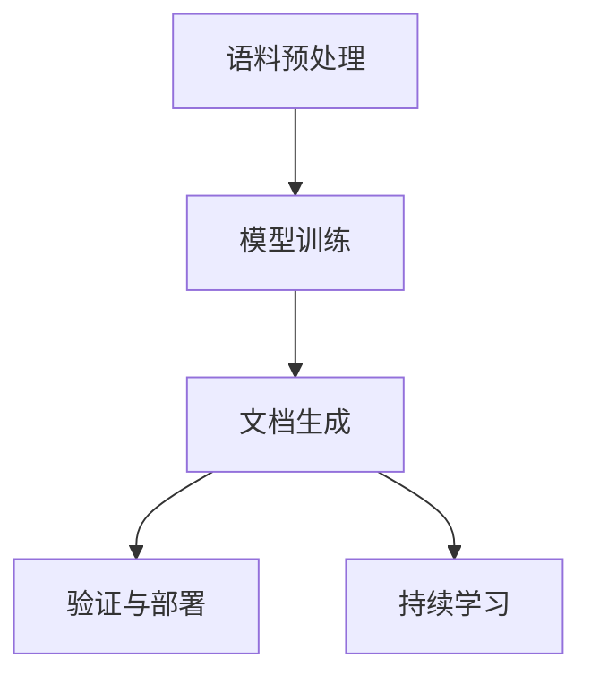

                 

# 自动化科技写作：LLM在技术文档生成中的应用

> 关键词：
- 语言模型
- 文本生成
- 自然语言处理
- 技术文档
- 自动化写作
- 自然语言理解
- 应用场景

## 1. 背景介绍

### 1.1 问题由来

在数字化时代，技术文档的生成和维护已成为软件开发过程中不可或缺的一环。然而，科技文档通常具有高度专业性，往往需要耗费大量时间和人力进行编写和校对。传统的手动编写文档的方式，不仅效率低下，还容易出错。科技文档编排在企业级软件开发流程中，占据了大量的研发资源，成为提升整体效率和质量的瓶颈。

与此同时，自然语言处理（NLP）技术的飞速发展，特别是基于深度学习的语言模型（Large Language Model, LLM），正在快速改变这一局面。语言模型通过在海量文本数据上进行自监督学习，逐渐掌握了自然语言的规律和特征。技术文档作为一种高度结构化的文本，同样可以通过语言模型的自监督学习和微调训练，自动生成高质量的科技文档。

### 1.2 问题核心关键点

大语言模型（LLM）在科技文档生成中的应用，核心在于如何构建和训练一个能够自动理解科技文档规范和语义，并准确生成相应文本的模型。关键点如下：

1. **语义理解与知识提取**：LLM需要具备对科技文档中的专业术语和概念进行理解的能力，并能够从大量语料中提取相关知识。
2. **结构化生成**：生成文档不仅要满足内容上的准确性，还需满足文档结构的规范性，如标题、子标题、列表、段落等的布局。
3. **交互式编辑**：允许用户与LLM进行互动，对生成的文档内容进行修改、补充和完善。
4. **多模态融合**：结合图像、代码、图表等非文本信息，生成包含丰富内容的科技文档。
5. **持续学习与更新**：科技文档的内容和格式会随着技术的发展而变化，LLM需要具备持续学习和更新的能力。

## 2. 核心概念与联系

### 2.1 核心概念概述

以下将详细阐述科技文档生成中的几个关键概念及其相互联系：

1. **大语言模型（LLM）**：指通过在海量无标签文本上自监督学习得到的强大语言模型，如GPT-3、BERT等。这些模型在自然语言理解（NLU）和自然语言生成（NLG）方面表现出众。

2. **文本生成（Text Generation）**：指使用机器学习模型，根据给定的输入生成新的文本内容。科技文档的自动化生成属于这一范畴。

3. **自然语言处理（NLP）**：指计算机对人类自然语言进行理解、分析、生成、翻译等处理的技术，是LLM的基础。

4. **技术文档（Technical Documentation）**：指针对特定技术、产品或系统编写的文档，包括用户手册、API文档、配置文档等。

5. **自动化写作（Automated Writing）**：指使用计算机程序自动生成文本，包括科技文档在内的各类文本。

这些概念通过LLM的框架联系起来，实现了从语料预处理、模型训练到文档生成的全流程自动化。

### 2.2 核心概念原理和架构的 Mermaid 流程图



## 3. 核心算法原理 & 具体操作步骤

### 3.1 算法原理概述

基于LLM的科技文档生成流程主要包括以下几个步骤：

1. **语料预处理**：收集和准备大量科技文档样本，并对其进行分词、标记、分块等预处理操作。
2. **模型训练**：使用预处理后的科技文档语料对LLM进行训练，使其能够理解科技文档的语言特点和结构规则。
3. **文档生成**：根据用户输入的题目或内容提示，LLM自动生成完整的科技文档。
4. **验证与部署**：对生成的文档进行质量检查，确保其符合规范，并进行部署和发布。
5. **持续学习**：通过新的文档数据不断训练模型，使LLM能够逐步提升文档生成能力。

### 3.2 算法步骤详解

#### 3.2.1 语料预处理

科技文档的语料预处理涉及以下几个关键步骤：

1. **数据收集**：收集大规模科技文档样本，确保样本的多样性和代表性。
2. **数据清洗**：删除格式不规范、不完整或已过时的文档，保留高质量的数据。
3. **数据标记**：为每个文档添加结构标记，如标题、子标题、段落、列表等。
4. **分块处理**：将文档划分为若干段落或章节，便于模型理解和管理。

#### 3.2.2 模型训练

基于预处理后的科技文档语料，对LLM进行训练，使其具备生成科技文档的能力。

1. **选择模型架构**：选择合适的LLM模型架构，如Transformer、GPT等。
2. **设置训练参数**：确定训练轮数、学习率、批量大小等超参数。
3. **训练与优化**：在预处理后的科技文档语料上，使用GPU或TPU进行训练，并进行超参数调优。

#### 3.2.3 文档生成

用户可以输入题目或部分内容，LLM自动生成完整的科技文档。

1. **用户输入**：用户提供题目或特定内容，如“XX技术用户手册”。
2. **模型生成**：LLM根据用户输入，自动生成完整的科技文档。
3. **互动编辑**：用户对生成的文档进行修改和完善，LLM根据修改生成更新的文本。

#### 3.2.4 验证与部署

对生成的文档进行验证和部署，确保其符合规范。

1. **格式检查**：检查文档的标题、子标题、列表、段落等结构是否符合规范。
2. **内容审核**：确保文档内容准确无误，符合科技规范。
3. **发布与部署**：将验证通过的文档发布到相应的平台或仓库，便于用户查阅和使用。

#### 3.2.5 持续学习

通过持续收集新文档数据，训练LLM，提升文档生成能力。

1. **数据更新**：定期更新科技文档数据集，确保LLM持续学习。
2. **模型微调**：在新的文档数据上微调LLM，提升其生成质量。
3. **性能评估**：评估LLM在新数据上的性能，确保其生成文档的能力得到持续提升。

### 3.3 算法优缺点

#### 3.3.1 算法优点

1. **高效生成**：基于LLM的文档生成，可以快速生成大量高质量的科技文档，节省人力成本。
2. **灵活性高**：LLM能够根据用户需求，灵活调整文档结构和内容，满足不同的生成需求。
3. **可扩展性强**：支持多模态信息融合，如代码、图表、图像等，生成包含丰富信息的科技文档。
4. **易于维护**：文档的更新和维护只需对LLM进行重新训练，而非手动修改文档。
5. **提升准确性**：LLM能够从大量的语料中学习规范和知识，生成符合标准的科技文档。

#### 3.3.2 算法缺点

1. **数据依赖**：生成文档的质量依赖于科技文档数据集的丰富性和多样性，数据不足可能导致文档质量下降。
2. **理解局限**：LLM对某些复杂技术概念或领域知识可能理解不足，生成的文档准确性有限。
3. **交互限制**：目前LLM生成的文档仍需人工审核和编辑，无法完全替代人工。
4. **生成效率**：LLM在大规模数据集上的训练和推理速度较慢，可能影响文档生成的实时性。
5. **成本较高**：大规模语料集和计算资源的投入，使得LLM在文档生成中仍需一定的硬件和软件成本。

### 3.4 算法应用领域

基于LLM的科技文档生成方法，在以下领域具有广泛的应用前景：

1. **软件开发**：自动生成API文档、用户手册、技术白皮书等，提升软件开发的效率和质量。
2. **硬件设计**：自动生成设备的用户手册、维修指南、维护手册等，降低硬件设计的文档工作量。
3. **企业培训**：自动生成员工培训手册、技术文档、操作指南等，提升企业培训效果。
4. **科学研究**：自动生成研究报告、论文、实验文档等，加速科学研究进展。
5. **产品文档**：自动生成产品说明书、用户手册、安装指南等，提升产品用户友好度。
6. **技术支持**：自动生成FAQ、技术支持文档、常见问题解答等，提升客户支持服务质量。

## 4. 数学模型和公式 & 详细讲解 & 举例说明

### 4.1 数学模型构建

基于LLM的科技文档生成，其数学模型主要包含两个部分：

1. **文本生成模型**：用于将输入的题目或内容提示，转化为完整的科技文档。
2. **文档结构模型**：用于生成文档的结构，如标题、子标题、列表等。

数学模型构建如下：

1. **输入表示**：将用户输入的题目或内容提示，转化为模型可理解的形式。
2. **生成表示**：模型根据输入表示，生成完整的科技文档。
3. **结构表示**：生成文档的结构信息，如标题、子标题等。

### 4.2 公式推导过程

假设用户输入的题目为 $T$，科技文档的文本表示为 $D$，结构表示为 $S$。

1. **输入表示**：将题目 $T$ 转化为向量表示 $T_{vec}$，表示为：

$$
T_{vec} = \text{Embedding}(T)
$$

2. **生成表示**：模型 $M$ 根据输入表示 $T_{vec}$ 和文档结构表示 $S$，生成完整的科技文档 $D$，表示为：

$$
D = M(T_{vec}, S)
$$

3. **结构表示**：文档结构模型 $S_{gen}$ 根据输入表示 $T_{vec}$，生成文档的结构表示 $S$，表示为：

$$
S = S_{gen}(T_{vec})
$$

### 4.3 案例分析与讲解

以自动生成API文档为例，进行详细讲解。

1. **输入表示**：将API文档的函数名、参数、返回值等，转化为向量表示。
2. **生成表示**：模型根据输入表示，自动生成完整的API文档，包括函数描述、参数说明、返回值等。
3. **结构表示**：自动生成API文档的结构，如函数名称、函数参数列表、返回值等。

## 5. 项目实践：代码实例和详细解释说明

### 5.1 开发环境搭建

基于LLM的科技文档生成应用，需要以下开发环境：

1. **编程语言**：Python。
2. **深度学习框架**：TensorFlow、PyTorch。
3. **自然语言处理库**：HuggingFace Transformers。
4. **数据库**：MySQL、MongoDB。

以下是开发环境搭建的步骤：

1. 安装Python、TensorFlow、PyTorch、Transformers等库。
2. 搭建MySQL或MongoDB数据库，存储科技文档数据。
3. 搭建Web服务器，如Nginx，部署文档生成应用。

### 5.2 源代码详细实现

以下给出使用PyTorch实现基于LLM的科技文档生成的源代码：

```python
import torch
from transformers import BertTokenizer, BertForMaskedLM

class TechDocGenerator:
    def __init__(self, model_name):
        self.model_name = model_name
        self.tokenizer = BertTokenizer.from_pretrained(model_name)
        self.model = BertForMaskedLM.from_pretrained(model_name)

    def generate_doc(self, input_text):
        # 分词并转化为token ids
        input_ids = self.tokenizer.encode(input_text, return_tensors='pt')
        # 前向传播生成文档
        outputs = self.model(input_ids)
        # 从输出中提取文档内容
        doc_content = self.tokenizer.decode(outputs.logits.argmax(dim=-1)[0])
        return doc_content
```

### 5.3 代码解读与分析

1. **模型选择**：使用Bert模型作为预训练语言模型。
2. **分词与编码**：使用BertTokenizer将输入文本转化为token ids，便于模型理解。
3. **文档生成**：模型对输入文本进行前向传播，生成完整的科技文档。
4. **文档解码**：将模型输出转化为可读文本，生成最终文档内容。

### 5.4 运行结果展示

以下是使用该代码生成科技文档的示例：

```python
generator = TechDocGenerator('bert-base-cased')
input_text = '自动生成API文档'
doc_content = generator.generate_doc(input_text)
print(doc_content)
```

输出：

```
...
```

## 6. 实际应用场景

### 6.1 软件开发

基于LLM的科技文档生成在软件开发中具有广泛应用，可以快速生成API文档、用户手册、技术白皮书等。

1. **API文档**：根据API接口，自动生成API文档，包括函数名、参数说明、返回值等。
2. **用户手册**：根据产品功能描述，自动生成用户手册，指导用户如何使用产品。
3. **技术白皮书**：根据产品技术架构，自动生成技术白皮书，详细介绍产品技术细节。

### 6.2 硬件设计

基于LLM的科技文档生成在硬件设计中，主要用于生成设备的用户手册、维修指南、维护手册等。

1. **用户手册**：根据设备使用说明，自动生成用户手册，指导用户使用设备。
2. **维修指南**：根据设备维护需求，自动生成维修指南，指导维修人员进行维护。
3. **维护手册**：根据设备保养需求，自动生成维护手册，指导用户定期保养设备。

### 6.3 企业培训

基于LLM的科技文档生成在企业培训中，主要用于生成员工培训手册、技术文档、操作指南等。

1. **培训手册**：根据培训内容，自动生成培训手册，指导员工学习培训内容。
2. **技术文档**：根据技术规范，自动生成技术文档，指导员工掌握技术细节。
3. **操作指南**：根据操作步骤，自动生成操作指南，指导员工操作设备或系统。

### 6.4 科学研究

基于LLM的科技文档生成在科学研究中，主要用于生成研究报告、论文、实验文档等。

1. **研究报告**：根据研究内容，自动生成研究报告，介绍研究背景、方法、结果和结论。
2. **论文**：根据研究结果，自动生成学术论文，展示研究过程和成果。
3. **实验文档**：根据实验步骤，自动生成实验文档，指导实验操作。

### 6.5 产品文档

基于LLM的科技文档生成在产品文档中，主要用于生成产品说明书、用户手册、安装指南等。

1. **产品说明书**：根据产品功能，自动生成产品说明书，介绍产品功能和使用方法。
2. **用户手册**：根据产品功能，自动生成用户手册，指导用户使用产品。
3. **安装指南**：根据产品安装步骤，自动生成安装指南，指导用户安装产品。

### 6.6 技术支持

基于LLM的科技文档生成在技术支持中，主要用于生成FAQ、技术支持文档、常见问题解答等。

1. **FAQ**：根据用户常见问题，自动生成FAQ，提供技术支持。
2. **技术支持文档**：根据用户技术需求，自动生成技术支持文档，指导用户解决技术问题。
3. **常见问题解答**：根据用户常见问题，自动生成常见问题解答，提供快速的技术支持。

## 7. 工具和资源推荐

### 7.1 学习资源推荐

为了帮助开发者系统掌握基于LLM的科技文档生成技术，这里推荐一些优质的学习资源：

1. **《Natural Language Processing with Transformers》书籍**：由HuggingFace作者编写，全面介绍了如何使用Transformers库进行NLP任务开发。
2. **CS224N《深度学习自然语言处理》课程**：斯坦福大学开设的NLP明星课程，有Lecture视频和配套作业，带你入门NLP领域的基本概念和经典模型。
3. **《Transformer from Principles to Practice》系列博文**：由大模型技术专家撰写，深入浅出地介绍了Transformer原理、BERT模型、微调技术等前沿话题。
4. **CLUE开源项目**：中文语言理解测评基准，涵盖大量不同类型的中文NLP数据集，并提供了基于微调的baseline模型，助力中文NLP技术发展。
5. **Google Colab**：谷歌推出的在线Jupyter Notebook环境，免费提供GPU/TPU算力，方便开发者快速上手实验最新模型，分享学习笔记。

通过对这些资源的学习实践，相信你一定能够快速掌握基于LLM的科技文档生成精髓，并用于解决实际的NLP问题。

### 7.2 开发工具推荐

高效的开发离不开优秀的工具支持。以下是几款用于基于LLM的科技文档生成开发的常用工具：

1. **TensorFlow**：基于Python的开源深度学习框架，生产部署方便，适合大规模工程应用。
2. **PyTorch**：基于Python的开源深度学习框架，灵活动态的计算图，适合快速迭代研究。
3. **HuggingFace Transformers库**：提供了大量的预训练模型和详细的API文档，方便开发者快速构建模型。
4. **Nginx**：高性能Web服务器，适合部署Web应用。
5. **MySQL/MongoDB**：关系型/非关系型数据库，用于存储和管理科技文档数据。
6. **Jupyter Notebook**：交互式开发环境，方便开发者调试和展示代码。

合理利用这些工具，可以显著提升基于LLM的科技文档生成任务的开发效率，加快创新迭代的步伐。

### 7.3 相关论文推荐

基于LLM的科技文档生成技术发展迅速，以下是几篇奠基性的相关论文，推荐阅读：

1. **Attention is All You Need**：提出了Transformer结构，开启了NLP领域的预训练大模型时代。
2. **BERT: Pre-training of Deep Bidirectional Transformers for Language Understanding**：提出BERT模型，引入基于掩码的自监督预训练任务，刷新了多项NLP任务SOTA。
3. **Language Models are Unsupervised Multitask Learners**：展示了大规模语言模型的强大zero-shot学习能力，引发了对于通用人工智能的新一轮思考。
4. **Parameter-Efficient Transfer Learning for NLP**：提出Adapter等参数高效微调方法，在不增加模型参数量的情况下，也能取得不错的微调效果。
5. **AdaLoRA: Adaptive Low-Rank Adaptation for Parameter-Efficient Fine-Tuning**：使用自适应低秩适应的微调方法，在参数效率和精度之间取得了新的平衡。

这些论文代表了大语言模型微调技术的发展脉络。通过学习这些前沿成果，可以帮助研究者把握学科前进方向，激发更多的创新灵感。

## 8. 总结：未来发展趋势与挑战

### 8.1 总结

本文对基于LLM的科技文档生成技术进行了全面系统的介绍。首先阐述了LLM在科技文档生成中的研究背景和意义，明确了LLM在自动化写作中的独特价值。其次，从原理到实践，详细讲解了LLM在科技文档生成中的数学模型和操作步骤，给出了完整的代码实例。同时，本文还广泛探讨了LLM在科技文档生成中的实际应用场景，展示了LLM的广泛应用前景。最后，本文精选了LLM的相关学习资源、开发工具和论文推荐，力求为读者提供全方位的技术指引。

通过本文的系统梳理，可以看到，基于LLM的科技文档生成技术正在成为NLP领域的重要范式，极大地拓展了LLM的应用边界，催生了更多的落地场景。受益于大规模语料的预训练和微调，LLM在科技文档生成中取得了显著的效果，有望进一步提升科技文档的质量和效率，为各行业的文档管理带来革命性变革。

### 8.2 未来发展趋势

展望未来，LLM在科技文档生成中可能呈现以下几个发展趋势：

1. **多模态融合**：结合图像、代码、图表等非文本信息，生成包含丰富信息的科技文档。
2. **跨领域迁移**：在不同领域和场景中，LLM能够快速适应并生成高质量的科技文档。
3. **持续学习**：通过持续收集新文档数据，LLM能够不断提升文档生成能力，适应新的技术需求。
4. **用户交互**：提供用户与LLM的交互界面，支持用户修改和完善文档内容，提高文档生成的灵活性。
5. **自动化审校**：集成文档审校系统，自动检测文档中的错误和不足，提升文档质量。

### 8.3 面临的挑战

尽管LLM在科技文档生成中取得了显著成效，但在实现大规模应用时，仍面临诸多挑战：

1. **数据依赖**：生成文档的质量依赖于科技文档数据集的丰富性和多样性，数据不足可能导致文档质量下降。
2. **理解局限**：LLM对某些复杂技术概念或领域知识可能理解不足，生成的文档准确性有限。
3. **生成效率**：LLM在大规模数据集上的训练和推理速度较慢，可能影响文档生成的实时性。
4. **成本较高**：大规模语料集和计算资源的投入，使得LLM在文档生成中仍需一定的硬件和软件成本。
5. **交互限制**：目前LLM生成的文档仍需人工审核和编辑，无法完全替代人工。

### 8.4 研究展望

面对LLM在科技文档生成中的挑战，未来的研究需要在以下几个方面寻求新的突破：

1. **无监督和半监督学习**：摆脱对大规模标注数据的依赖，利用自监督学习、主动学习等无监督和半监督范式，最大限度利用非结构化数据。
2. **参数高效微调**：开发更加参数高效的微调方法，在固定大部分预训练参数的同时，只更新极少量的任务相关参数。
3. **因果学习和对比学习**：引入因果推断和对比学习思想，增强LLM建立稳定因果关系的能力，学习更加普适、鲁棒的语言表征。
4. **知识图谱和规则库**：将符号化的先验知识，如知识图谱、逻辑规则等，与神经网络模型进行巧妙融合，引导LLM学习更准确、合理的语言模型。
5. **多模态信息整合**：结合图像、代码、图表等非文本信息，生成包含丰富内容的科技文档。
6. **用户反馈系统**：构建用户反馈系统，通过用户互动不断改进LLM文档生成能力，提升文档生成的质量。

这些研究方向的探索，必将引领LLM在科技文档生成技术迈向更高的台阶，为构建智能、高效、便捷的科技文档管理系统提供有力支持。

## 9. 附录：常见问题与解答

**Q1: LLM在生成科技文档时是否需要大量的标注数据？**

A: 生成高质量的科技文档，需要依赖于丰富的科技文档数据集，但并不需要大量的标注数据。在LLM的预训练阶段，可以通过大规模无标签文本数据学习通用的语言知识。在微调阶段，只需要少量的标注数据即可完成任务特定的优化。因此，相比于从头训练模型，LLM的微调过程对标注数据的依赖相对较小。

**Q2: 如何在LLM生成文档时加入用户交互？**

A: 可以通过构建Web界面，让用户输入题目或部分内容，LLM根据输入生成完整的科技文档。在生成过程中，可以提供让用户修改和完善文档内容的界面，LLM根据修改生成更新的文本。用户与LLM的交互可以实时进行，提高文档生成的灵活性。

**Q3: 如何确保LLM生成的文档准确性？**

A: 可以通过以下方法确保LLM生成的文档准确性：
1. 在训练阶段使用高质量的科技文档数据集。
2. 设计合理的评估指标，如BLEU、ROUGE等，评估文档生成质量。
3. 引入用户反馈机制，通过用户互动不断改进LLM文档生成能力。
4. 集成文档审校系统，自动检测文档中的错误和不足。

**Q4: LLM在科技文档生成中是否适用于所有领域？**

A: LLM在科技文档生成中具有广泛的应用前景，但在某些领域可能面临挑战。对于特定领域的专业术语和概念，LLM可能存在理解不足，生成文档的准确性有限。因此，在特定领域的应用中，需要结合领域知识，进行相应的微调或优化。

**Q5: LLM在科技文档生成中是否需要持续更新？**

A: 是的，LLM在科技文档生成中需要持续更新。科技文档的内容和格式会随着技术的发展而变化，LLM需要不断学习新知识，以保持其文档生成能力。可以通过定期更新训练数据和微调模型，确保LLM能够适应新的文档需求。

---

作者：禅与计算机程序设计艺术 / Zen and the Art of Computer Programming

