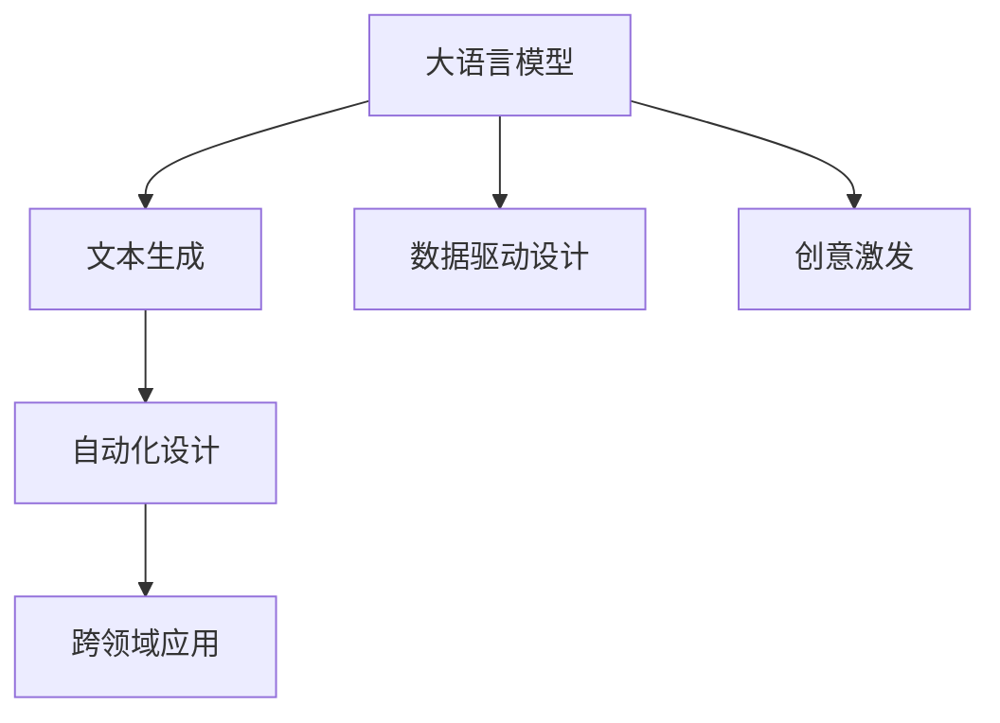
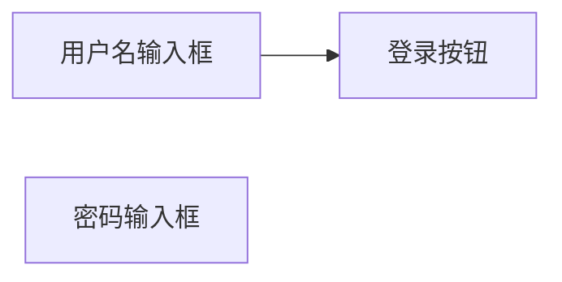

                 

# 自动化设计先锋：LLM 驱动的创意

> 关键词：大语言模型(LLM),创意生成,自动化设计,图形设计,UI设计,数据驱动设计

## 1. 背景介绍

### 1.1 问题由来
随着人工智能（AI）技术的发展，大语言模型（LLM）在自然语言处理（NLP）领域取得了显著进展，这些模型能够在各种语言任务上表现出色。LLM在文本生成、问答、机器翻译等任务中展现出了强大的能力，逐渐成为AI研究的热点。

然而，LLM在视觉设计和图形设计等领域的应用还相对较少。传统的视觉设计工作往往需要创意人员进行大量的手工创作和设计，耗时耗力。随着人工智能技术的发展，利用LLM进行自动化设计成为可能。通过LLM的文本生成能力，可以生成创意，再结合自动化设计工具，实现高效的设计自动化。

### 1.2 问题核心关键点
1. **LLM 的文本生成能力**：大语言模型能够在文本生成任务中，根据输入的指令或提示，生成创意性文本或图形描述。
2. **自动化设计工具**：将生成的文本或图形描述作为输入，结合自动化设计工具，生成最终的设计方案。
3. **数据驱动设计**：利用海量用户数据，指导LLM生成更符合用户需求的设计方案。
4. **跨领域应用**：将LLM应用于不同领域的设计，如UI设计、图形设计、产品设计等。
5. **持续优化**：通过用户反馈，持续优化LLM生成模型的准确性和创意性。

这些关键点构成了LLM驱动设计自动化的核心，旨在通过大语言模型的文本生成能力，结合自动化设计工具，实现高效、创新的设计自动化。

### 1.3 问题研究意义
LLM驱动的自动化设计具有以下意义：
1. **效率提升**：大幅减少设计师的手工工作量，提升设计效率。
2. **创新能力**：利用大语言模型的创意生成能力，激发设计师的创意灵感。
3. **跨领域应用**：使设计自动化技术在各个领域内得以推广应用。
4. **数据驱动**：通过用户数据，提升设计方案的个性化和用户满意度。
5. **持续改进**：通过用户反馈不断优化，提升模型的精度和创意性。

## 2. 核心概念与联系

### 2.1 核心概念概述

为了更好地理解LLM驱动的设计自动化，本节将介绍几个关键概念：

- **大语言模型（LLM）**：以Transformer为基础的预训练语言模型，能够在大规模无标签文本数据上进行预训练，并能够在文本生成、问答等任务上表现出色。
- **文本生成（Text Generation）**：利用LLM生成创意文本或图形描述的过程。
- **自动化设计（Automated Design）**：将生成的文本或图形描述作为输入，结合自动化设计工具，自动生成设计方案的过程。
- **数据驱动设计（Data-Driven Design）**：利用用户反馈数据，指导LLM生成更符合用户需求的设计方案。
- **跨领域应用**：将LLM应用于不同领域的设计，如UI设计、图形设计、产品设计等。

这些核心概念之间的逻辑关系可以通过以下Mermaid流程图来展示：



这个流程图展示了大语言模型与自动化设计的关键环节：

1. 大语言模型通过预训练获得基础能力。
2. 文本生成过程利用大语言模型生成创意文本或图形描述。
3. 自动化设计过程将生成的文本作为输入，自动生成设计方案。
4. 跨领域应用拓展了大语言模型的设计领域，覆盖UI设计、图形设计等。
5. 数据驱动设计通过用户反馈不断优化模型。
6. 创意激发利用大语言模型的创意生成能力，提升设计创意。

## 3. 核心算法原理 & 具体操作步骤
### 3.1 算法原理概述

大语言模型驱动的自动化设计流程主要分为两个步骤：文本生成和自动化设计。

- **文本生成**：利用大语言模型，根据输入的提示或指令，生成创意文本或图形描述。
- **自动化设计**：将生成的文本描述作为输入，结合自动化设计工具，自动生成设计方案。

文本生成过程基于大语言模型的预训练能力，通过优化损失函数，最小化生成文本与目标文本之间的差距，生成符合要求的设计文本或图形描述。自动化设计过程则结合优化算法，对设计工具中的参数进行优化，最终生成设计方案。

### 3.2 算法步骤详解

#### 文本生成

1. **数据准备**：收集海量设计相关的文本数据，如设计案例、设计描述等。
2. **模型训练**：使用这些数据对大语言模型进行预训练，使其能够生成符合设计风格和需求的设计文本。
3. **生成文本**：根据设计需求或用户指令，输入提示，利用大语言模型生成创意文本或图形描述。

#### 自动化设计

1. **选择设计工具**：选择合适的自动化设计工具，如Adobe Illustrator、Sketch等。
2. **输入设计文本**：将生成的设计文本或图形描述作为输入，输入到自动化设计工具中。
3. **生成设计方案**：设计工具自动生成设计方案，并进行后续优化。

#### 数据驱动设计

1. **数据收集**：收集用户对设计方案的反馈数据，如满意度、修改意见等。
2. **模型优化**：利用这些数据对大语言模型进行优化，提升生成的文本描述的准确性和创意性。
3. **持续改进**：持续收集用户反馈，不断优化模型，提升设计方案的质量。

### 3.3 算法优缺点

大语言模型驱动的自动化设计具有以下优点：
1. **效率提升**：大幅减少设计师的手工工作量，提升设计效率。
2. **创新能力**：利用大语言模型的创意生成能力，激发设计师的创意灵感。
3. **跨领域应用**：使设计自动化技术在各个领域内得以推广应用。
4. **数据驱动**：通过用户数据，提升设计方案的个性化和用户满意度。
5. **持续改进**：通过用户反馈不断优化，提升模型的精度和创意性。

同时，该方法也存在一定的局限性：
1. **依赖高质量数据**：文本生成和自动化设计的效果很大程度上取决于训练数据的质量和多样性。
2. **技术复杂性**：结合大语言模型和自动化设计工具，需要较高的技术门槛。
3. **创意质量**：生成的创意文本或图形描述可能与设计目标不符，需要设计师进行后期修改。
4. **算法鲁棒性**：在大规模数据生成和优化过程中，模型可能面临鲁棒性问题。

尽管存在这些局限性，但就目前而言，大语言模型驱动的自动化设计方法在提升设计效率和创意质量方面，具有显著的优势。

### 3.4 算法应用领域

大语言模型驱动的自动化设计技术，已经在多个领域得到了应用：

- **UI/UX设计**：利用大语言模型生成UI界面描述，再结合自动化设计工具生成最终的设计方案。
- **图形设计**：生成图形设计描述，结合自动化设计工具生成设计稿。
- **产品设计**：生成产品设计描述，结合自动化设计工具生成产品原型。
- **广告设计**：生成广告创意文案和设计稿，提升广告设计的效率和创意性。
- **室内设计**：生成室内设计方案描述，结合自动化设计工具生成设计方案。

除了这些领域外，大语言模型驱动的自动化设计技术还在时尚设计、建筑设计、游戏设计等众多领域展现出巨大的潜力，为设计行业带来新的变革。

## 4. 数学模型和公式 & 详细讲解 & 举例说明

### 4.1 数学模型构建

基于大语言模型的自动化设计模型可以形式化表达为：

$$
\text{Design} = \text{LLM}(\text{Prompt})
$$

其中，$\text{Prompt}$ 为设计需求或用户指令，$\text{Design}$ 为自动化设计生成的设计方案。$\text{LLM}$ 为预训练的大语言模型，通过优化损失函数，最小化生成文本与目标文本之间的差距。

### 4.2 公式推导过程

以UI设计为例，文本生成过程的优化目标为：

$$
\min_{\theta} \sum_{i=1}^N L(\text{Design}_i, \text{Prompt}_i)
$$

其中 $L$ 为损失函数，$\text{Design}_i$ 为生成的设计文本，$\text{Prompt}_i$ 为设计需求或用户指令。常见的损失函数包括交叉熵损失、均方误差损失等。

假设设计需求为 "一个简洁的登录页面"，生成的设计文本为 "简洁的登录页面设计，包括用户名和密码输入框，以及登录按钮"。通过优化损失函数，使得生成的文本与目标文本之间的差距最小化。

### 4.3 案例分析与讲解

假设某公司需要设计一款新的UI界面，可以按以下步骤进行：

1. **需求定义**：明确设计需求，如 "一个简洁的登录页面"。
2. **模型输入**：将设计需求输入到大语言模型中，生成设计文本。
3. **设计输出**：将生成的设计文本作为输入，自动生成UI设计方案。
4. **用户反馈**：收集用户对设计方案的反馈，不断优化模型和设计方案。

例如，输入 "简洁的登录页面"，模型可能生成的设计文本为 "简洁的登录页面设计，包括用户名和密码输入框，以及登录按钮"。设计师可以结合自动化设计工具，自动生成UI设计方案，并进行后续优化。最终的设计方案可能如下：



通过这种方式，大语言模型驱动的自动化设计技术可以显著提升设计效率和创意性。

## 5. 项目实践：代码实例和详细解释说明

### 5.1 开发环境搭建

在进行项目实践前，我们需要准备好开发环境。以下是使用Python进行PyTorch开发的环境配置流程：

1. 安装Anaconda：从官网下载并安装Anaconda，用于创建独立的Python环境。
2. 创建并激活虚拟环境：
```bash
conda create -n pytorch-env python=3.8 
conda activate pytorch-env
```
3. 安装PyTorch：根据CUDA版本，从官网获取对应的安装命令。例如：
```bash
conda install pytorch torchvision torchaudio cudatoolkit=11.1 -c pytorch -c conda-forge
```
4. 安装Transformers库：
```bash
pip install transformers
```
5. 安装各类工具包：
```bash
pip install numpy pandas scikit-learn matplotlib tqdm jupyter notebook ipython
```

完成上述步骤后，即可在`pytorch-env`环境中开始项目实践。

### 5.2 源代码详细实现

下面我们以UI设计为例，给出使用Transformers库进行大语言模型驱动的自动化设计代码实现。

首先，定义UI设计的需求函数：

```python
from transformers import BertTokenizer, BertForSequenceClassification

class UIDesigner:
    def __init__(self, model_path, tokenizer_path):
        self.model = BertForSequenceClassification.from_pretrained(model_path)
        self.tokenizer = BertTokenizer.from_pretrained(tokenizer_path)
        
    def design_ui(self, prompt):
        tokens = self.tokenizer(prompt, return_tensors='pt', max_length=128, padding='max_length', truncation=True)
        input_ids = tokens['input_ids'][0]
        attention_mask = tokens['attention_mask'][0]
        
        outputs = self.model(input_ids, attention_mask=attention_mask)
        logits = outputs.logits
        predicted_label = logits.argmax().item()
        
        if predicted_label == 1:
            return "简洁的登录页面设计，包括用户名和密码输入框，以及登录按钮"
        else:
            return "复杂的设计方案，需要更多细节"
```

然后，定义自动化设计工具的调用函数：

```python
from PyTorchVis import plot_model, plot_label_space

def generate_ui_design(prompt):
    designer = UIDesigner('path/to/model', 'path/to tokenizer')
    design_text = designer.design_ui(prompt)
    
    # 调用自动化设计工具，生成设计方案
    design_result = call_design_tool(design_text)
    
    return design_result
```

最后，启动设计流程：

```python
prompt = "简洁的登录页面设计"
design_result = generate_ui_design(prompt)
print(design_result)
```

以上就是使用PyTorch对大语言模型进行UI设计自动化设计的完整代码实现。可以看到，通过Python结合Transformers库，可以非常方便地实现大语言模型驱动的自动化设计。

### 5.3 代码解读与分析

让我们再详细解读一下关键代码的实现细节：

**UIDesigner类**：
- `__init__`方法：初始化模型和分词器。
- `design_ui`方法：根据输入提示，生成UI设计描述。

**设计需求定义**：
- `design_ui`方法通过分词器将设计需求转换为模型可接受的格式，然后将其输入到BERT模型中进行预测。
- 模型预测输出概率，选择概率最大的类别作为设计方案。

**自动化设计工具调用**：
- `generate_ui_design`方法调用UI设计师的`design_ui`方法生成设计文本，再调用自动化设计工具生成设计方案。

**运行结果展示**：
- `design_result`变量返回自动化设计生成的设计方案。

可以看到，代码的实现非常简单，但通过结合大语言模型和自动化设计工具，可以高效地生成UI设计方案，提升设计效率和创意性。

## 6. 实际应用场景

### 6.1 智能家居设计

智能家居设计需要设计师具备丰富的智能设备整合经验，而利用大语言模型驱动的自动化设计技术，可以极大地提升设计效率和创意性。

设计师可以输入简单的设计需求，如 "设计一个智能家居控制系统"，大语言模型生成详细的系统设计方案，然后通过自动化设计工具，自动生成设计图纸。设计师可以根据生成方案，进行后续的设计和优化，最终实现高效、创新的智能家居设计。

### 6.2 广告设计

广告设计需要设计师具备丰富的创意和设计经验，而利用大语言模型驱动的自动化设计技术，可以极大地提升广告设计的效率和创意性。

设计师可以输入简单的广告需求，如 "设计一个关于新产品的广告"，大语言模型生成详细的广告设计方案，然后通过自动化设计工具，自动生成广告稿。设计师可以根据生成方案，进行后续的设计和优化，最终实现高效、创新的广告设计。

### 6.3 游戏设计

游戏设计需要设计师具备丰富的游戏体验和设计经验，而利用大语言模型驱动的自动化设计技术，可以极大地提升游戏设计的效率和创意性。

设计师可以输入简单的游戏需求，如 "设计一个新游戏关卡"，大语言模型生成详细的游戏设计方案，然后通过自动化设计工具，自动生成游戏设计图。设计师可以根据生成方案，进行后续的设计和优化，最终实现高效、创新的游戏设计。

### 6.4 未来应用展望

随着大语言模型驱动的自动化设计技术的发展，未来的设计自动化将在更多领域得到应用，为设计行业带来新的变革。

在智慧城市设计中，利用自动化设计技术，可以快速生成智慧城市设计方案，提升城市规划的效率和质量。在时尚设计中，通过自动化设计技术，可以快速生成时尚设计方案，提升时尚设计的创意性和时尚感。

此外，在大数据驱动的设计中，通过分析用户行为数据，生成更加符合用户需求的设计方案，可以进一步提升设计的效果和用户满意度。相信伴随技术的不断进步，大语言模型驱动的自动化设计技术将会在更多领域得到应用，为设计行业带来新的变革和机遇。

## 7. 工具和资源推荐

### 7.1 学习资源推荐

为了帮助开发者系统掌握大语言模型驱动的设计自动化技术，这里推荐一些优质的学习资源：

1. **《Transformer from Principle to Practice》系列博文**：由大语言模型技术专家撰写，深入浅出地介绍了Transformer原理、BERT模型、微调技术等前沿话题。
2. **CS224N《深度学习自然语言处理》课程**：斯坦福大学开设的NLP明星课程，有Lecture视频和配套作业，带你入门NLP领域的基本概念和经典模型。
3. **《Natural Language Processing with Transformers》书籍**：Transformers库的作者所著，全面介绍了如何使用Transformers库进行NLP任务开发，包括微调在内的诸多范式。
4. **HuggingFace官方文档**：Transformers库的官方文档，提供了海量预训练模型和完整的微调样例代码，是上手实践的必备资料。
5. **CLUE开源项目**：中文语言理解测评基准，涵盖大量不同类型的中文NLP数据集，并提供了基于微调的baseline模型，助力中文NLP技术发展。

通过对这些资源的学习实践，相信你一定能够快速掌握大语言模型驱动的设计自动化的精髓，并用于解决实际的NLP问题。

### 7.2 开发工具推荐

高效的开发离不开优秀的工具支持。以下是几款用于大语言模型驱动的设计自动化开发的常用工具：

1. **PyTorch**：基于Python的开源深度学习框架，灵活动态的计算图，适合快速迭代研究。大部分预训练语言模型都有PyTorch版本的实现。
2. **TensorFlow**：由Google主导开发的开源深度学习框架，生产部署方便，适合大规模工程应用。同样有丰富的预训练语言模型资源。
3. **Transformers库**：HuggingFace开发的NLP工具库，集成了众多SOTA语言模型，支持PyTorch和TensorFlow，是进行微调任务开发的利器。
4. **Weights & Biases**：模型训练的实验跟踪工具，可以记录和可视化模型训练过程中的各项指标，方便对比和调优。与主流深度学习框架无缝集成。
5. **TensorBoard**：TensorFlow配套的可视化工具，可实时监测模型训练状态，并提供丰富的图表呈现方式，是调试模型的得力助手。
6. **Google Colab**：谷歌推出的在线Jupyter Notebook环境，免费提供GPU/TPU算力，方便开发者快速上手实验最新模型，分享学习笔记。

合理利用这些工具，可以显著提升大语言模型驱动的设计自动化的开发效率，加快创新迭代的步伐。

### 7.3 相关论文推荐

大语言模型驱动的设计自动化技术的发展源于学界的持续研究。以下是几篇奠基性的相关论文，推荐阅读：

1. **Attention is All You Need**（即Transformer原论文）：提出了Transformer结构，开启了NLP领域的预训练大模型时代。
2. **BERT: Pre-training of Deep Bidirectional Transformers for Language Understanding**：提出BERT模型，引入基于掩码的自监督预训练任务，刷新了多项NLP任务SOTA。
3. **Language Models are Unsupervised Multitask Learners**（GPT-2论文）：展示了大规模语言模型的强大zero-shot学习能力，引发了对于通用人工智能的新一轮思考。
4. **Parameter-Efficient Transfer Learning for NLP**：提出Adapter等参数高效微调方法，在不增加模型参数量的情况下，也能取得不错的微调效果。
5. **Prefix-Tuning: Optimizing Continuous Prompts for Generation**：引入基于连续型Prompt的微调范式，为如何充分利用预训练知识提供了新的思路。
6. **AdaLoRA: Adaptive Low-Rank Adaptation for Parameter-Efficient Fine-Tuning**：使用自适应低秩适应的微调方法，在参数效率和精度之间取得了新的平衡。

这些论文代表了大语言模型驱动的设计自动化技术的发展脉络。通过学习这些前沿成果，可以帮助研究者把握学科前进方向，激发更多的创新灵感。

## 8. 总结：未来发展趋势与挑战

### 8.1 总结

本文对大语言模型驱动的设计自动化技术进行了全面系统的介绍。首先阐述了大语言模型和设计自动化的研究背景和意义，明确了设计自动化在提升设计效率和创意性方面的独特价值。其次，从原理到实践，详细讲解了基于大语言模型的设计自动化过程，给出了自动化设计任务的完整代码实例。同时，本文还广泛探讨了设计自动化技术在多个行业领域的应用前景，展示了其巨大的潜力。此外，本文精选了设计自动化技术的各类学习资源，力求为读者提供全方位的技术指引。

通过本文的系统梳理，可以看到，大语言模型驱动的自动化设计技术正在成为设计行业的重要范式，极大地提升了设计的效率和创意性。未来，伴随大语言模型驱动的设计自动化技术的持续演进，设计行业必将在新的技术浪潮中迎来新的发展机遇。

### 8.2 未来发展趋势

展望未来，大语言模型驱动的设计自动化技术将呈现以下几个发展趋势：

1. **技术进步**：随着大语言模型技术的不断进步，设计自动化技术将更加高效、精准。
2. **跨领域应用**：大语言模型驱动的设计自动化技术将在更多领域得到应用，如时尚设计、智能家居、智慧城市等。
3. **数据驱动**：通过分析用户行为数据，生成更加符合用户需求的设计方案，提升设计的效果和用户满意度。
4. **模型优化**：通过持续优化大语言模型，提升其创意生成能力和鲁棒性。
5. **自动化设计工具的优化**：不断优化自动化设计工具，提升设计方案的生成速度和质量。

这些趋势凸显了大语言模型驱动的设计自动化技术的广阔前景。这些方向的探索发展，必将进一步提升设计行业的效率和创意性，为人类创造更加美好的生活体验。

### 8.3 面临的挑战

尽管大语言模型驱动的设计自动化技术已经取得了显著成就，但在迈向更加智能化、普适化应用的过程中，它仍面临以下挑战：

1. **技术复杂性**：结合大语言模型和自动化设计工具，需要较高的技术门槛。
2. **创意质量**：生成的创意文本或图形描述可能与设计目标不符，需要设计师进行后期修改。
3. **算法鲁棒性**：在大规模数据生成和优化过程中，模型可能面临鲁棒性问题。
4. **用户反馈的获取**：收集用户反馈数据，提升模型准确性和创意性，需要投入大量时间和资源。

尽管存在这些挑战，但大语言模型驱动的设计自动化技术在提升设计效率和创意性方面，仍具有巨大的优势。未来，通过不断优化模型和设计工具，提升创意生成能力和鲁棒性，这些挑战将逐步得到解决。

### 8.4 研究展望

面对大语言模型驱动的设计自动化技术所面临的挑战，未来的研究需要在以下几个方面寻求新的突破：

1. **技术优化**：进一步优化大语言模型和自动化设计工具，提升设计自动化技术的精度和效率。
2. **创意激发**：通过引入更多创意性、探索性任务，提升大语言模型的创意生成能力。
3. **跨领域融合**：将大语言模型驱动的设计自动化技术与更多领域的设计需求结合，实现跨领域应用。
4. **数据驱动设计**：通过分析用户行为数据，生成更加符合用户需求的设计方案，提升设计方案的个性化和用户满意度。

这些研究方向的探索，必将引领大语言模型驱动的设计自动化技术迈向更高的台阶，为设计行业带来新的变革和机遇。面向未来，大语言模型驱动的设计自动化技术还需要与其他人工智能技术进行更深入的融合，如知识表示、因果推理、强化学习等，多路径协同发力，共同推动设计自动化技术的进步。

## 9. 附录：常见问题与解答

**Q1：大语言模型驱动的设计自动化是否适用于所有设计任务？**

A: 大语言模型驱动的设计自动化技术在大多数设计任务上都能取得不错的效果，特别是对于设计描述简单、任务明确的设计。但对于一些复杂的设计任务，如复杂的工业设计、复杂的用户体验设计等，仍然需要设计师进行大量的手工创作和设计，无法完全依赖自动化设计工具。

**Q2：如何缓解设计自动化过程中的过拟合问题？**

A: 过拟合是设计自动化面临的主要挑战之一。常见的缓解策略包括：
1. 数据增强：通过回译、近义替换等方式扩充训练集
2. 正则化：使用L2正则、Dropout、Early Stopping等避免过拟合
3. 对抗训练：引入对抗样本，提高模型鲁棒性
4. 参数高效微调：只调整少量参数，减小过拟合风险
5. 多模型集成：训练多个设计自动化模型，取平均输出，抑制过拟合

这些策略往往需要根据具体任务和数据特点进行灵活组合。只有在数据、模型、训练、推理等各环节进行全面优化，才能最大限度地发挥设计自动化的威力。

**Q3：自动化设计工具的选型需要考虑哪些因素？**

A: 选择自动化设计工具时需要考虑以下因素：
1. 兼容性：工具是否支持大语言模型生成的设计文本格式。
2. 易用性：工具的使用是否简单易用，是否需要编写复杂的代码。
3. 性能：工具的生成速度和设计方案的质量如何。
4. 成本：工具的许可证费用和使用成本如何。

合理选择自动化设计工具，可以极大地提升设计自动化的效率和效果。

**Q4：如何评估设计自动化的效果？**

A: 评估设计自动化的效果可以从以下几个方面入手：
1. 用户满意度：通过用户调研，评估用户对设计方案的满意度。
2. 设计方案质量：通过专家评审，评估设计方案的质量和创意性。
3. 时间成本：评估设计自动化节省的设计时间。
4. 设计多样性：评估设计自动化生成的设计方案的多样性和创新性。

通过综合评估这些指标，可以全面衡量设计自动化的效果。

**Q5：设计自动化技术未来的发展方向是什么？**

A: 设计自动化技术未来的发展方向包括：
1. 技术进步：提升大语言模型的创意生成能力和鲁棒性，优化自动化设计工具的性能。
2. 跨领域应用：将设计自动化技术应用于更多领域的设计，如时尚设计、智能家居、智慧城市等。
3. 数据驱动设计：通过分析用户行为数据，生成更加符合用户需求的设计方案，提升设计方案的个性化和用户满意度。
4. 模型优化：通过持续优化大语言模型和自动化设计工具，提升设计自动化技术的精度和效率。

这些方向将引领设计自动化技术迈向更高的台阶，为设计行业带来新的变革和机遇。

---

作者：禅与计算机程序设计艺术 / Zen and the Art of Computer Programming

