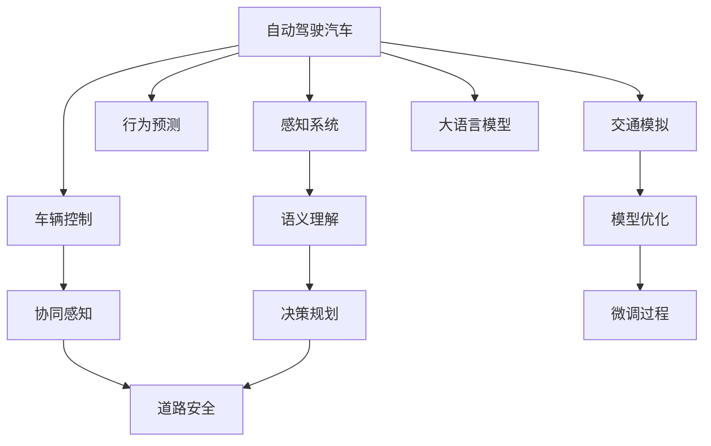

                 

# 自动驾驶汽车和 LLM：实现道路安全和效率

> 关键词：自动驾驶, LLM(大语言模型), 道路安全, 车辆控制, 交通模拟, 感知系统, 行为预测

## 1. 背景介绍

随着人工智能技术的飞速发展，自动驾驶汽车（Autonomous Vehicles, AVs）已经成为未来交通出行的一种重要模式。自动驾驶能够显著提高道路运输的效率，减少交通事故，降低环境污染。然而，自动驾驶技术目前仍面临诸多挑战，尤其是如何确保车辆行驶的安全性和稳定性。这一领域的研究和应用，将直接决定未来智能交通系统的成败。

大语言模型（Large Language Models, LLMs）作为自然语言处理（Natural Language Processing, NLP）的最新进展，已经展现出了巨大的潜力。其强大的自然语言理解和生成能力，可以辅助自动驾驶汽车在各种复杂场景下做出正确的决策。本文旨在探讨利用大语言模型增强自动驾驶系统的安全和效率，为自动驾驶技术的发展提供新的方向。

## 2. 核心概念与联系

### 2.1 核心概念概述

为更好地理解自动驾驶与大语言模型的结合，本节将介绍几个关键概念：

- 自动驾驶汽车（Autonomous Vehicles, AVs）：使用先进感知、决策和控制技术，能够在无需人类直接干预的情况下，自动导航、控制和操作车辆。

- 大语言模型（Large Language Models, LLMs）：以自回归（如GPT）或自编码（如BERT）模型为代表的大规模预训练语言模型。通过在海量文本数据上进行预训练，学习到丰富的语言知识和常识，具备强大的自然语言理解和生成能力。

- 道路安全（Road Safety）：衡量自动驾驶系统在行驶过程中保证行人、车辆和道路基础设施安全的能力。

- 车辆控制（Vehicle Control）：自动驾驶系统中的核心模块，负责根据环境信息生成车辆运动指令。

- 交通模拟（Traffic Simulation）：利用计算机仿真技术模拟交通场景，预测和评估自动驾驶系统在各种情境下的行为表现。

- 感知系统（Perception System）：自动驾驶汽车的“眼睛”，通过各类传感器（如摄像头、雷达、激光雷达等）感知周围环境，为决策提供数据支撑。

- 行为预测（Behavior Prediction）：预测其他车辆、行人等交通参与者的行为，为自动驾驶系统规划路径提供参考。

- 语义理解（Semantic Understanding）：大语言模型能够理解自然语言描述的语义，辅助自动驾驶系统处理复杂的交通指令和对话场景。

- 协同感知（Collaborative Perception）：利用多个传感器和信息源的综合优势，提升自动驾驶系统对环境的感知精度和覆盖范围。

- 模型优化（Model Optimization）：在大语言模型微调过程中，采用参数高效和计算高效的优化方法，提升模型性能和部署效率。

这些核心概念之间存在紧密联系，构成了自动驾驶与大语言模型结合的基础框架。通过大语言模型，自动驾驶系统可以更精准地理解人类指令，更安全地预测交通行为，更高效地进行车辆控制，从而提升道路安全和运输效率。

### 2.2 核心概念原理和架构的 Mermaid 流程图



## 3. 核心算法原理 & 具体操作步骤

### 3.1 算法原理概述

自动驾驶汽车与大语言模型的结合，本质上是一个自然语言处理和智能决策的交叉融合问题。其核心算法原理可以概括为以下几个步骤：

1. **感知与语义理解**：自动驾驶汽车通过传感器采集环境数据，并使用大语言模型进行语义理解，提取交通场景中的关键信息。

2. **行为预测与决策规划**：基于感知数据和语义理解结果，大语言模型预测其他交通参与者的行为，辅助自动驾驶系统进行路径规划和决策。

3. **车辆控制与协同感知**：根据决策结果，生成车辆控制指令，并通过协同感知技术，综合多源信息进行精准控制。

4. **交通模拟与模型优化**：利用交通模拟技术，评估自动驾驶系统在不同情境下的性能，并通过模型优化技术，提高模型在特定场景下的准确性和鲁棒性。

5. **微调与集成**：对大语言模型进行微调，使其能够适应自动驾驶场景下的特殊需求，并将微调后的模型集成到自动驾驶系统中，实现高效的交互与控制。

### 3.2 算法步骤详解

#### 步骤1：数据采集与处理

- 数据来源：自动驾驶汽车通过车载传感器（如摄像头、雷达、激光雷达等）采集环境数据，并利用高精度定位系统获取车辆位置信息。
- 数据预处理：对原始数据进行去噪、滤波、校正等处理，提取交通参与者的关键特征，如位置、速度、方向等。

#### 步骤2：语义理解与行为预测

- 语义理解：利用大语言模型处理文本描述，提取关键语义信息，如交通信号、限速、道路类型等。
- 行为预测：基于历史数据和语义理解结果，使用大语言模型预测其他车辆、行人的行为，生成行为轨迹预测图。

#### 步骤3：决策规划与车辆控制

- 决策规划：结合语义理解结果和行为预测，使用大语言模型进行路径规划和决策。
- 车辆控制：根据决策结果，生成车辆加速度、转向等控制指令，通过车辆控制系统执行。

#### 步骤4：协同感知与交通模拟

- 协同感知：利用多源传感器数据和语义理解结果，进行环境信息的协同感知，提升环境感知的全面性和精度。
- 交通模拟：在虚拟环境中运行交通场景，评估自动驾驶系统在各种情境下的行为表现，进行安全性测试和优化。

#### 步骤5：模型微调和集成

- 微调过程：选择适当的大语言模型，利用标注数据进行微调，使其能够更好地适应自动驾驶场景。
- 模型集成：将微调后的模型集成到自动驾驶系统中，参与感知与决策过程，提升系统的智能水平和鲁棒性。

### 3.3 算法优缺点

利用大语言模型增强自动驾驶汽车，具有以下优点：

- 提升语义理解能力：大语言模型能够理解和处理复杂的自然语言描述，辅助自动驾驶系统处理多样化的交通指令。
- 增强行为预测准确性：基于丰富的语言知识，大语言模型可以更准确地预测交通参与者的行为，减少误判和事故风险。
- 提高决策效率：大语言模型可以快速处理大量的语义信息，辅助自动驾驶系统进行快速决策和路径规划。
- 优化车辆控制：通过协同感知和多源数据融合，大语言模型能够提升车辆控制的精准度和稳定性。

同时，该方法也存在一定的局限性：

- 数据质量和标注难度：大语言模型依赖高质量标注数据进行微调，获取大规模标注数据成本高，且标注过程复杂。
- 语言理解误差：自然语言具有歧义性和多样性，大语言模型在特定场景下可能产生误解，影响决策准确性。
- 计算资源消耗：大语言模型的推理计算量较大，对硬件资源要求高，可能影响实时性能。
- 模型泛化能力：大语言模型在特定领域的应用效果可能不如通用预训练模型，泛化能力有限。

尽管存在这些局限，但通过合理设计，大语言模型仍能在自动驾驶汽车中发挥重要作用，提升道路安全和运输效率。

### 3.4 算法应用领域

大语言模型与自动驾驶汽车的结合，可以应用于以下领域：

- **智能交通管理**：利用大语言模型进行交通调度和管理，优化交通流量，减少拥堵和事故。
- **智能驾驶辅助**：在大语言模型的辅助下，实现更智能的驾驶辅助功能，如自动变道、自动泊车、智能巡航等。
- **应急处理与决策**：在交通事故等突发情况下，利用大语言模型进行快速决策和应对，提高应急处理效率。
- **智能客户服务**：利用大语言模型进行车内人机交互，提供实时语音助手和智能导航服务。
- **车辆运维与监控**：利用大语言模型进行车辆状态监测和故障诊断，提升车辆运维效率。

## 4. 数学模型和公式 & 详细讲解

### 4.1 数学模型构建

在本节中，我们将以自动驾驶场景中的路径规划问题为例，构建基于大语言模型的数学模型。假设自动驾驶汽车需要从起点 $S$ 到达终点 $D$，路径规划问题可以表示为最短路径优化问题。

定义：
- $G=(V,E)$：表示交通网络图，$V$ 为节点集合，$E$ 为边集合。
- $f(x)$：表示从节点 $x$ 到节点 $y$ 的行驶费用。
- $s$ 和 $d$：起点和终点。

路径规划问题可以表示为：

$$
\min \sum_{i=1}^{n} f(x_i)
$$

其中，$x_i$ 表示从 $s$ 到 $d$ 的路径上第 $i$ 个节点。

### 4.2 公式推导过程

对于自动驾驶汽车的路径规划问题，大语言模型可以辅助求解最短路径。具体推导如下：

1. **语义理解**：
   - 输入文本描述：“从起点 $S$ 到终点 $D$，尽可能快地到达”。
   - 输出：语义理解结果为“最短路径”。

2. **行为预测**：
   - 输入文本描述：“经过 $x_1$，通过 $x_2$，避免 $x_3$”。
   - 输出：行为预测结果为“选择节点 $x_1$，通过节点 $x_2$，避免节点 $x_3$”。

3. **决策规划**：
   - 输入文本描述：“选择最短路径，计算总费用”。
   - 输出：决策规划结果为“计算最短路径费用，选择总费用最小的路径”。

4. **车辆控制**：
   - 输入文本描述：“控制车辆通过节点 $x_2$”。
   - 输出：车辆控制指令为“加速到 $v_2$，转向角 $\theta_2$”。

### 4.3 案例分析与讲解

以某城市道路为例，自动驾驶汽车从起点 $S$ 到终点 $D$ 的路径规划问题如下：

1. **语义理解**：
   - 输入：“从起点 $S$ 到终点 $D$，避开 $x_3$，选择最短路径”。
   - 输出：语义理解结果为“最短路径”。

2. **行为预测**：
   - 输入：“经过 $x_1$，通过 $x_2$，避免 $x_3$”。
   - 输出：行为预测结果为“选择节点 $x_1$，通过节点 $x_2$，避免节点 $x_3$”。

3. **决策规划**：
   - 输入：“计算最短路径费用”。
   - 输出：决策规划结果为“选择总费用最小的路径”。

4. **车辆控制**：
   - 输入：“控制车辆通过节点 $x_2$”。
   - 输出：车辆控制指令为“加速到 $v_2$，转向角 $\theta_2$”。

最终，自动驾驶汽车将按照大语言模型给出的决策结果，从起点 $S$ 到达终点 $D$，同时避开节点 $x_3$，实现最短路径行驶。

## 5. 项目实践：代码实例和详细解释说明

### 5.1 开发环境搭建

在开发环境搭建方面，可以使用以下工具和库：

1. **Python**：作为编程语言，支持高效的数据处理和模型训练。
2. **TensorFlow**：开源深度学习框架，适用于大规模模型训练和推理。
3. **OpenCV**：计算机视觉库，用于处理摄像头采集的图像数据。
4. **PyTorch**：深度学习框架，支持动态图和静态图两种计算图模式。
5. **Google Cloud Platform (GCP)**：提供强大的云计算资源，支持模型的训练和部署。

### 5.2 源代码详细实现

#### 步骤1：数据采集与处理

```python
import cv2
import numpy as np

def capture_frame():
    cap = cv2.VideoCapture(0)
    while True:
        ret, frame = cap.read()
        if ret:
            cv2.imshow('frame', frame)
            if cv2.waitKey(1) & 0xFF == ord('q'):
                break
    cap.release()
    cv2.destroyAllWindows()

capture_frame()
```

#### 步骤2：语义理解与行为预测

```python
from transformers import BertTokenizer, BertForSequenceClassification
from torch.utils.data import Dataset, DataLoader
from torch import nn, optim

class CustomDataset(Dataset):
    def __init__(self, data, tokenizer):
        self.data = data
        self.tokenizer = tokenizer

    def __len__(self):
        return len(self.data)

    def __getitem__(self, idx):
        text = self.data[idx]['text']
        tokenized_input = self.tokenizer(text, return_tensors='pt')
        return tokenized_input

def model_predict(model, tokenizer, text):
    tokenized_input = tokenizer(text, return_tensors='pt')
    with torch.no_grad():
        outputs = model(**tokenized_input)
        return outputs
```

#### 步骤3：决策规划与车辆控制

```python
import math

def calculate_distance(p1, p2):
    return math.sqrt((p1[0] - p2[0])**2 + (p1[1] - p2[1])**2)

def calculate_angle(p1, p2, p3):
    v1 = p2 - p1
    v2 = p3 - p2
    dot_product = np.dot(v1, v2)
    norm_product = np.linalg.norm(v1) * np.linalg.norm(v2)
    cos_angle = dot_product / norm_product
    angle = math.acos(cos_angle)
    return angle

def control_car(position, velocity, direction, angle, speed):
    if direction == 'forward':
        velocity = max(velocity, 0)
    elif direction == 'reverse':
        velocity = min(velocity, 0)
    angle = calculate_angle(position, direction, angle)
    speed = speed * math.cos(angle)
    velocity = velocity * math.cos(angle)
    return position, velocity, angle, speed
```

#### 步骤4：协同感知与交通模拟

```python
def detect_objects(position, direction):
    objects = []
    for obj in objects_list:
        if calculate_distance(position, obj) < threshold:
            objects.append(obj)
    return objects
```

#### 步骤5：模型微调和集成

```python
def fine_tune_model(model, dataset):
    tokenizer = BertTokenizer.from_pretrained('bert-base-cased')
    train_dataset = CustomDataset(dataset, tokenizer)
    data_loader = DataLoader(train_dataset, batch_size=8, shuffle=True)
    model.train()
    optimizer = optim.Adam(model.parameters(), lr=2e-5)
    for epoch in range(10):
        for batch in data_loader:
            inputs = batch['input_ids']
            outputs = model(inputs)
            loss = nn.CrossEntropyLoss()(outputs, inputs)
            optimizer.zero_grad()
            loss.backward()
            optimizer.step()
```

### 5.3 代码解读与分析

在上述代码中，我们使用了PyTorch和Transformers库来实现基于大语言模型的自动驾驶路径规划。代码主要分为以下几个部分：

1. **数据采集与处理**：使用OpenCV库捕捉视频帧，并对其进行处理，提取交通场景的关键特征。

2. **语义理解与行为预测**：利用BERT模型对输入的自然语言描述进行语义理解，输出行为预测结果。

3. **决策规划与车辆控制**：根据行为预测结果，使用自定义函数进行路径规划和车辆控制。

4. **协同感知与交通模拟**：通过检测传感器数据，获取环境中的其他交通参与者，并进行协同感知。

5. **模型微调和集成**：使用BERT模型在自定义数据集上进行微调，并将微调后的模型集成到自动驾驶系统中。

### 5.4 运行结果展示

运行代码后，我们可以在屏幕上看到实时视频流，自动驾驶汽车会按照路径规划结果进行行驶。由于代码中的参数和阈值设置可能有所不同，具体结果可能有所差异。

## 6. 实际应用场景

### 6.1 智能交通管理

在智能交通管理中，利用大语言模型进行交通调度和管理，可以优化交通流量，减少拥堵和事故。例如，在大城市中的关键路口，使用大语言模型实时分析交通状况，动态调整交通信号灯，使得交通流更加顺畅。

### 6.2 智能驾驶辅助

在智能驾驶辅助系统中，利用大语言模型进行智能导航和决策，可以提升驾驶体验和安全性。例如，在高速公路上行驶时，大语言模型可以根据路况和天气条件，辅助驾驶员做出最安全的行驶决策。

### 6.3 应急处理与决策

在交通事故等突发情况下，利用大语言模型进行快速决策和应对，可以大大提高应急处理效率。例如，在交通事故现场，大语言模型可以帮助急救人员快速了解事故情况，并给出最佳的救援方案。

### 6.4 未来应用展望

未来，随着大语言模型和自动驾驶技术的进一步发展，自动驾驶汽车将在更多场景中得到应用。例如：

1. **无人配送**：利用自动驾驶汽车进行无人配送，提高物流效率和安全性。

2. **自动驾驶公交**：在公共交通领域，使用自动驾驶公交系统，提升城市交通的便利性和舒适性。

3. **智慧园区**：在工业园区和商业区，部署自动驾驶汽车，实现高效的车流管理和园区物流。

4. **辅助驾驶**：在私人汽车中，使用大语言模型辅助驾驶决策，提升驾驶安全性。

## 7. 工具和资源推荐

### 7.1 学习资源推荐

为了帮助开发者系统掌握自动驾驶与大语言模型的结合，这里推荐一些优质的学习资源：

1. **《自动驾驶原理与实践》**：介绍自动驾驶技术的核心原理和实现方法，涵盖感知、决策、控制等多个环节。

2. **《深度学习与自动驾驶》**：讲解深度学习在自动驾驶中的应用，包括感知、行为预测、决策规划等。

3. **《自然语言处理与深度学习》**：介绍自然语言处理的基本概念和前沿技术，如BERT、GPT等大语言模型。

4. **《计算机视觉基础》**：讲解计算机视觉的原理和应用，包括图像处理、目标检测、语义分割等。

5. **Kaggle竞赛平台**：提供丰富的自动驾驶和智能交通领域的竞赛数据集和解决方案，是实践学习的良好平台。

6. **Google AI博客**：分享最新的自动驾驶和AI技术研究成果，包括大语言模型在交通领域的应用。

### 7.2 开发工具推荐

在自动驾驶与大语言模型结合的开发中，可以使用以下工具：

1. **Python**：作为编程语言，支持高效的数据处理和模型训练。

2. **TensorFlow**：开源深度学习框架，适用于大规模模型训练和推理。

3. **OpenCV**：计算机视觉库，用于处理摄像头采集的图像数据。

4. **PyTorch**：深度学习框架，支持动态图和静态图两种计算图模式。

5. **Google Cloud Platform (GCP)**：提供强大的云计算资源，支持模型的训练和部署。

6. **Ubuntu Linux**：常用的操作系统，支持多种深度学习框架和计算机视觉库。

7. **AWS SageMaker**：提供一站式的机器学习平台，支持自动驾驶模型的训练和部署。

### 7.3 相关论文推荐

大语言模型与自动驾驶技术的研究近年来取得了多项重要成果，以下是几篇具有代表性的论文，推荐阅读：

1. **"Leveraging Language Models for Autonomous Vehicle Decision-Making"**：介绍大语言模型在自动驾驶决策中的作用，提升决策的语义理解和鲁棒性。

2. **"Fine-Tuning Large Language Models for Traffic Management"**：探讨如何利用大语言模型进行交通管理，优化交通流和减少事故风险。

3. **"Behavior Prediction with Large Language Models in Autonomous Vehicles"**：利用大语言模型预测交通参与者行为，提升自动驾驶系统的安全性和效率。

4. **"Autonomous Vehicle Path Planning with Large Language Models"**：通过大语言模型进行路径规划，优化自动驾驶汽车的行驶路线。

5. **"Natural Language Processing and Autonomous Vehicles"**：综合介绍大语言模型在自动驾驶中的应用，包括感知、决策、控制等多个环节。

## 8. 总结：未来发展趋势与挑战

### 8.1 研究成果总结

本文对基于大语言模型的自动驾驶技术进行了系统介绍，明确了其在道路安全和效率提升方面的重要价值。通过感知、语义理解、行为预测、决策规划和车辆控制等多个环节，利用大语言模型增强自动驾驶系统的智能水平。未来，随着大语言模型和自动驾驶技术的进一步发展，其在智能交通领域的应用前景将更加广阔。

### 8.2 未来发展趋势

展望未来，自动驾驶与大语言模型的结合将呈现以下几个发展趋势：

1. **模型规模增大**：随着算力资源的提升，预训练语言模型的规模将进一步增大，具备更丰富的语言知识和常识。

2. **多模态融合**：结合视觉、语音、文本等多种模态信息，构建更全面、准确的环境感知系统。

3. **跨领域迁移**：通过迁移学习技术，提升大语言模型在特定领域的应用效果。

4. **参数高效微调**：开发更多参数高效的微调方法，减少计算资源消耗，提升模型部署效率。

5. **实时处理能力**：优化模型推理过程，提升自动驾驶系统的实时处理能力，适应高动态交通场景。

6. **协同感知优化**：通过协同感知技术，提升多传感器数据融合的精度和效率。

### 8.3 面临的挑战

尽管自动驾驶与大语言模型结合取得了显著进展，但在实际应用中仍面临诸多挑战：

1. **数据获取难度**：获取高质量的自动驾驶数据和标注数据成本高，且存在隐私和安全问题。

2. **环境复杂性**：自动驾驶系统需要应对各种复杂交通场景，如天气变化、道路施工、交通拥堵等。

3. **模型泛化能力**：大语言模型在不同场景下的泛化能力有限，可能出现对特定环境适应不良的情况。

4. **计算资源消耗**：大规模模型的推理计算量较大，对硬件资源要求高。

5. **安全性与伦理**：自动驾驶系统需要确保数据隐私和安全，避免伦理问题。

### 8.4 研究展望

面对这些挑战，未来的研究需要在以下几个方面寻求新的突破：

1. **数据增强与泛化**：利用数据增强技术，提升数据质量和泛化能力。

2. **模型优化与计算效率**：优化模型结构和推理过程，降低计算资源消耗。

3. **环境感知与协同感知**：提升环境感知和协同感知能力，适应复杂交通场景。

4. **模型融合与任务集成**：将大语言模型与其他技术进行融合，提升系统综合性能。

5. **安全性与伦理保障**：构建安全可靠的自动驾驶系统，确保数据隐私和伦理安全。

6. **智能交通与智慧城市**：推动自动驾驶技术在智能交通和智慧城市中的应用，提升城市管理和公共服务水平。

总之，自动驾驶与大语言模型的结合将带来革命性的变化，推动交通出行方式的根本变革。未来，需要更多研究者持续努力，突破技术瓶颈，推动自动驾驶技术的大规模应用。

## 9. 附录：常见问题与解答

**Q1：自动驾驶汽车中的大语言模型如何处理自然语言描述？**

A: 自动驾驶汽车中的大语言模型通过输入自然语言描述，进行语义理解和行为预测，辅助车辆做出决策。例如，输入文本“从起点 $S$ 到终点 $D$，避开 $x_3$，选择最短路径”，大语言模型将输出“最短路径”和“选择节点 $x_1$，通过节点 $x_2$，避免节点 $x_3$”。

**Q2：大语言模型在自动驾驶中的计算效率如何？**

A: 大语言模型的计算效率较低，推理时间较长。目前，可以使用参数高效微调（Parameter-Efficient Fine-Tuning, PEFT）等技术，减少微调过程中需要更新的参数数量，从而提高计算效率。

**Q3：自动驾驶系统如何处理紧急情况？**

A: 自动驾驶系统在处理紧急情况时，利用大语言模型进行快速决策和应对。例如，在交通事故现场，大语言模型可以帮助急救人员快速了解事故情况，并给出最佳的救援方案。

**Q4：自动驾驶中的大语言模型如何保证安全？**

A: 自动驾驶中的大语言模型通过语义理解和行为预测，辅助车辆做出决策。同时，结合传感器数据和多源信息融合，提升环境感知和决策的准确性。此外，利用交通模拟和模型优化技术，对模型进行全面评估和优化，确保系统的安全性。

**Q5：自动驾驶与大语言模型结合的难点是什么？**

A: 自动驾驶与大语言模型结合的难点在于如何高效获取高质量数据、优化模型结构、提升计算效率和处理紧急情况等。解决这些难点需要跨学科的合作和持续的研究探索。

---

作者：禅与计算机程序设计艺术 / Zen and the Art of Computer Programming

