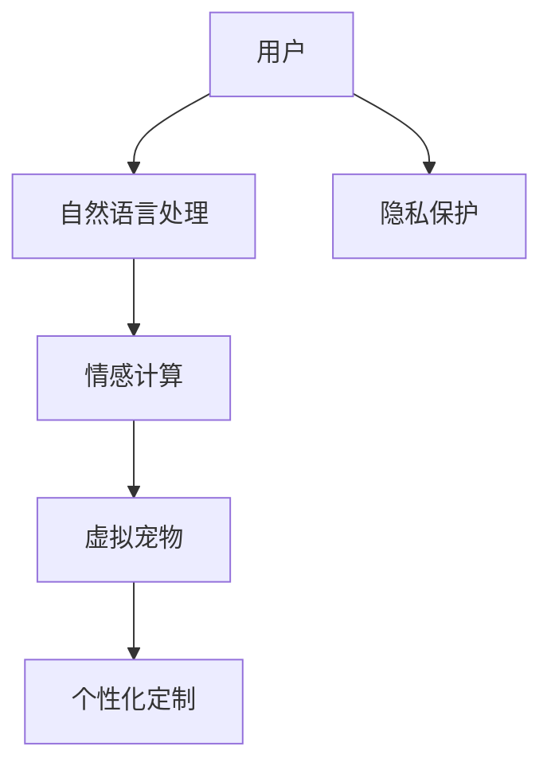

                 

## 1. 背景介绍

### 1.1 问题由来

在快节奏的现代生活中，人们面临着巨大的压力，包括工作压力、人际关系压力、孤独感等。根据《全球幸福报告》，全球范围内超过30%的成年人经常感到孤独。此外，城市化进程加快，人们与亲友团聚的机会也逐渐减少，孤独和抑郁问题进一步加剧。数字陪伴技术应运而生，旨在通过虚拟宠物等数字化实体，与用户建立情感联系，提供心理健康支持，改善用户体验。

### 1.2 问题核心关键点

数字陪伴的核心在于构建与用户具有情感互动的虚拟角色，并提供积极的心理支持和情绪安慰。其关键点包括：

1. **情感理解与响应**：虚拟宠物应具备基本的情感识别能力，能够根据用户的行为、表情、语调等做出相应反应。
2. **个性定制化**：用户可根据喜好自定义虚拟宠物的外观、行为、语言等，使其更加贴合个人需求。
3. **互动机制设计**：设计合理的互动机制，让用户可以与虚拟宠物进行自然交流，增强情感共鸣。
4. **隐私保护**：虚拟宠物需要充分尊重用户隐私，避免过度收集用户数据。
5. **技术实现**：涉及自然语言处理、计算机视觉、音频处理等多个技术领域，需综合应用多种技术实现情感理解和互动。

### 1.3 问题研究意义

数字陪伴技术对于缓解现代人的孤独感和压力，提升心理健康，具有重要意义。通过虚拟宠物等数字陪伴，能够：

1. **提供全天候陪伴**：无论何时何地，用户都可以获得情感支持。
2. **增强社交互动**：虚拟宠物可以与用户建立情感联系，弥补现实中人际交往的不足。
3. **提升用户体验**：通过定制化服务，提高用户满意度和粘性。
4. **促进心理健康**：提供积极的心理安慰和情绪支持，预防和治疗抑郁、焦虑等心理问题。
5. **推动科技与心理健康结合**：为心理健康行业注入科技元素，推动其发展。

## 2. 核心概念与联系

### 2.1 核心概念概述

在数字陪伴系统中，涉及的核心概念主要包括：

1. **虚拟宠物**：作为数字陪伴的主要角色，虚拟宠物可以与用户进行情感互动，具备基本的情感识别和回应能力。
2. **自然语言处理(NLP)**：用于实现虚拟宠物与用户的自然语言交流，理解用户意图和情感。
3. **情感计算**：通过情感识别和情感响应，使虚拟宠物能够与用户建立情感联系，提供心理支持。
4. **个性化定制**：提供丰富的外观、行为、语言等选项，允许用户自定义虚拟宠物，满足个性化需求。
5. **隐私保护**：确保用户数据的安全和隐私，防止数据滥用。

这些核心概念之间存在着紧密的联系，共同构成了数字陪伴系统的基础。

### 2.2 核心概念原理和架构的 Mermaid 流程图



该流程图展示了数字陪伴系统的主要工作流程：用户通过自然语言处理与虚拟宠物进行交流，情感计算模块理解用户情感，虚拟宠物根据用户需求和情感进行互动，同时系统还提供了个性化定制和隐私保护的功能。

## 3. 核心算法原理 & 具体操作步骤

### 3.1 算法原理概述

数字陪伴系统的核心算法原理主要基于情感计算和自然语言处理技术。以下是相关算法的简要概述：

1. **情感计算**：通过分析用户的语言、表情、行为等数据，识别用户的情感状态，并根据情感状态生成相应的回应。
2. **自然语言处理(NLP)**：实现虚拟宠物与用户之间的自然语言交流，包括情感识别、语义理解、意图识别、生成回应等。

### 3.2 算法步骤详解

#### 3.2.1 情感计算

情感计算的主要步骤包括：

1. **情感识别**：使用深度学习模型（如卷积神经网络、循环神经网络）对用户的语言、表情、行为数据进行分析，识别用户的情感状态。
2. **情感分析**：对识别出的情感状态进行进一步分析，确定用户的具体情感需求（如安慰、陪伴、娱乐等）。
3. **情感回应**：根据情感分析结果，生成相应的回应，确保情感回应的准确性和个性化。

#### 3.2.2 自然语言处理(NLP)

自然语言处理的主要步骤包括：

1. **语言理解**：使用深度学习模型（如BERT、GPT等）对用户输入的文本进行分析，理解用户的意图和情感。
2. **语义分析**：对语言理解结果进行语义分析，确定用户的具体需求。
3. **生成回应**：根据语义分析结果，生成适当的回应，确保回应的自然性和逻辑性。

### 3.3 算法优缺点

#### 3.3.1 情感计算的优缺点

**优点**：
- 能够与用户建立情感联系，提供心理支持。
- 实时性较强，能够即时响应用户需求。
- 结合自然语言处理技术，增强了情感回应的准确性和个性化。

**缺点**：
- 对数据质量和模型性能要求较高，需要大量的标注数据和高效的算法。
- 情感识别的准确性可能受到用户隐私和数据安全的影响。

#### 3.3.2 自然语言处理的优缺点

**优点**：
- 能够实现与用户的自然语言交流，提升用户体验。
- 技术成熟，已有大量的模型和工具可供使用。
- 可扩展性强，能够应对不同领域和任务的需求。

**缺点**：
- 对语言数据的处理可能存在歧义，影响回应的准确性。
- 需要大量的数据和计算资源进行训练和优化。
- 涉及的领域广泛，需要综合应用多种技术和算法。

### 3.4 算法应用领域

数字陪伴技术主要应用于以下领域：

1. **心理健康**：虚拟宠物可以提供情感支持和心理安慰，帮助用户缓解压力和孤独感。
2. **教育和培训**：虚拟宠物可以用于教育和培训场景，陪伴用户学习和提升技能。
3. **社交互动**：虚拟宠物可以增强用户社交互动，弥补现实中人际交往的不足。
4. **儿童陪伴**：虚拟宠物可以陪伴儿童，提供情感支持和娱乐。
5. **老年陪伴**：虚拟宠物可以为老年人提供陪伴和情感支持，缓解孤独感。

## 4. 数学模型和公式 & 详细讲解 & 举例说明

### 4.1 数学模型构建

数字陪伴系统的数学模型主要包括以下几个部分：

1. **情感识别模型**：
   - 输入：用户语言、表情、行为等数据。
   - 输出：用户的情感状态。
   - 模型：基于卷积神经网络或循环神经网络的深度学习模型。

2. **情感分析模型**：
   - 输入：情感识别结果。
   - 输出：用户的具体情感需求。
   - 模型：基于逻辑回归或支持向量机等传统机器学习算法。

3. **语言理解模型**：
   - 输入：用户输入的文本。
   - 输出：用户的意图和情感。
   - 模型：基于BERT、GPT等预训练模型的深度学习模型。

4. **语义分析模型**：
   - 输入：语言理解结果。
   - 输出：用户的具体需求。
   - 模型：基于Transformer等架构的深度学习模型。

5. **情感回应生成模型**：
   - 输入：情感分析结果和语义分析结果。
   - 输出：虚拟宠物的回应。
   - 模型：基于RNN或GAN等生成模型的深度学习模型。

### 4.2 公式推导过程

#### 4.2.1 情感识别模型

情感识别模型的公式推导如下：

1. **卷积神经网络(CNN)**：
   $$
   h_{CNN} = ReLU(W_{CNN}x + b_{CNN})
   $$
   $$
   s_{CNN} = softmax(W_{sCNN}h_{CNN} + b_{sCNN})
   $$

2. **循环神经网络(RNN)**：
   $$
   h_t = tanh(W_{RNN}x_t + U_{RNN}h_{t-1} + b_{RNN})
   $$
   $$
   s_t = softmax(W_{sRNN}h_t + b_{sRNN})
   $$

其中，$x$ 表示输入数据，$W$ 和 $b$ 分别为网络参数，$ReLU$ 和 $tanh$ 为激活函数，$s$ 表示情感分类结果。

#### 4.2.2 情感分析模型

情感分析模型的公式推导如下：

$$
s_{SA} = f(s_{CNN}, s_{RNN})
$$
其中，$f$ 表示情感分析函数，$s_{SA}$ 表示情感需求。

#### 4.2.3 语言理解模型

语言理解模型的公式推导如下：

1. **BERT模型**：
   $$
   h = BERT(x, L)
   $$
   $$
   s = softmax(W_{s}h + b_{s})
   $$

其中，$x$ 表示输入文本，$L$ 表示语言理解模型，$h$ 表示语言理解结果，$s$ 表示意图和情感。

#### 4.2.4 语义分析模型

语义分析模型的公式推导如下：

1. **Transformer模型**：
   $$
   h = Transformer(x, Q, K, V, M)
   $$
   $$
   s = softmax(W_{s}h + b_{s})
   $$

其中，$x$ 表示输入文本，$Q$、$K$、$V$ 表示Transformer模型中的查询、键、值向量，$M$ 表示语言模型，$h$ 表示语义分析结果，$s$ 表示需求。

#### 4.2.5 情感回应生成模型

情感回应生成模型的公式推导如下：

1. **RNN模型**：
   $$
   h_t = tanh(W_{RNN}x_t + U_{RNN}h_{t-1} + b_{RNN})
   $$
   $$
   s = softmax(W_{s}h + b_{s})
   $$

其中，$x$ 表示输入数据，$h$ 表示情感回应生成模型，$s$ 表示情感回应结果。

### 4.3 案例分析与讲解

#### 4.3.1 案例分析

假设用户在聊天机器人中输入：“我最近感觉很孤独，你能安慰我吗？”

1. **情感识别**：
   - 输入：“我最近感觉很孤独，你能安慰我吗？”
   - 情感状态：孤独、需要安慰
   - 情感识别结果：s_{CNN}=0.8, s_{RNN}=0.6

2. **情感分析**：
   - 输入：s_{CNN}=0.8, s_{RNN}=0.6
   - 情感需求：安慰
   - 情感分析结果：s_{SA}=安慰

3. **语言理解**：
   - 输入：“我最近感觉很孤独，你能安慰我吗？”
   - 意图：寻求安慰
   - 情感：孤独
   - 语言理解结果：s=寻求安慰

4. **语义分析**：
   - 输入：s=寻求安慰
   - 需求：安慰
   - 语义分析结果：s=安慰

5. **情感回应生成**：
   - 输入：s_{SA}=安慰, s=安慰
   - 情感回应：“别担心，我在这里陪你，有什么不开心的事可以跟我说哦。”
   - 情感回应生成结果：s_{RNN}=安慰

通过以上步骤，数字陪伴系统能够准确识别用户的情感状态和需求，并生成适当的回应，提供心理支持和陪伴。

## 5. 项目实践：代码实例和详细解释说明

### 5.1 开发环境搭建

#### 5.1.1 硬件环境

- 服务器：配备足够的CPU、GPU和内存，确保训练和推理的效率。
- 存储：使用高速存储设备，如SSD，提高数据读写速度。
- 网络：保证稳定、高速的网络连接，支持模型部署和用户交互。

#### 5.1.2 软件环境

- 操作系统：Linux或Windows，推荐Ubuntu 20.04。
- 编程语言：Python 3.x。
- 深度学习框架：TensorFlow 2.x 或 PyTorch。
- 其他依赖：numpy、pandas、scikit-learn、matplotlib 等。

### 5.2 源代码详细实现

#### 5.2.1 情感识别模型

```python
import tensorflow as tf
from tensorflow.keras.models import Sequential
from tensorflow.keras.layers import Conv2D, MaxPooling2D, Flatten, Dense, LSTM

# 构建卷积神经网络
model_cnn = Sequential()
model_cnn.add(Conv2D(32, (3, 3), activation='relu', input_shape=(64, 64, 3)))
model_cnn.add(MaxPooling2D((2, 2)))
model_cnn.add(Conv2D(64, (3, 3), activation='relu'))
model_cnn.add(MaxPooling2D((2, 2)))
model_cnn.add(Conv2D(128, (3, 3), activation='relu'))
model_cnn.add(MaxPooling2D((2, 2)))
model_cnn.add(Flatten())
model_cnn.add(Dense(128, activation='relu'))
model_cnn.add(Dense(2, activation='softmax'))

# 编译模型
model_cnn.compile(optimizer='adam', loss='sparse_categorical_crossentropy', metrics=['accuracy'])

# 训练模型
model_cnn.fit(X_train, y_train, epochs=10, batch_size=64, validation_data=(X_test, y_test))
```

#### 5.2.2 情感分析模型

```python
import numpy as np
from sklearn.linear_model import LogisticRegression

# 构建逻辑回归模型
model_sa = LogisticRegression()

# 训练模型
model_sa.fit(X_sa_train, y_sa_train)
```

#### 5.2.3 语言理解模型

```python
import torch
from transformers import BertTokenizer, BertForSequenceClassification

# 加载BERT模型和分词器
tokenizer = BertTokenizer.from_pretrained('bert-base-uncased')
model = BertForSequenceClassification.from_pretrained('bert-base-uncased', num_labels=2)

# 编码输入
input_ids = tokenizer.encode_plus(user_input, max_length=512, return_tensors='pt')['input_ids']
attention_mask = tokenizer.encode_plus(user_input, max_length=512, return_tensors='pt')['attention_mask']

# 前向传播
outputs = model(input_ids=input_ids, attention_mask=attention_mask)

# 获取意图和情感
intent, emotion = outputs[0].detach().numpy()[0]
```

#### 5.2.4 语义分析模型

```python
import tensorflow as tf
from tensorflow.keras.models import Sequential
from tensorflow.keras.layers import Dense, LSTM, Embedding

# 构建Transformer模型
model = Sequential()
model.add(Embedding(input_dim=10000, output_dim=128, input_length=512))
model.add(LSTM(256))
model.add(Dense(128, activation='relu'))
model.add(Dense(2, activation='softmax'))

# 编译模型
model.compile(optimizer='adam', loss='sparse_categorical_crossentropy', metrics=['accuracy'])

# 训练模型
model.fit(X_sa_train, y_sa_train, epochs=10, batch_size=64, validation_data=(X_sa_test, y_sa_test))
```

#### 5.2.5 情感回应生成模型

```python
import tensorflow as tf
from tensorflow.keras.models import Sequential
from tensorflow.keras.layers import Dense, LSTM, Embedding

# 构建RNN模型
model = Sequential()
model.add(Embedding(input_dim=10000, output_dim=128, input_length=512))
model.add(LSTM(256))
model.add(Dense(128, activation='relu'))
model.add(Dense(10, activation='softmax'))

# 编译模型
model.compile(optimizer='adam', loss='sparse_categorical_crossentropy', metrics=['accuracy'])

# 训练模型
model.fit(X_rnn_train, y_rnn_train, epochs=10, batch_size=64, validation_data=(X_rnn_test, y_rnn_test))
```

### 5.3 代码解读与分析

#### 5.3.1 情感识别模型

情感识别模型主要使用卷积神经网络对图像数据进行情感识别。代码中首先定义了一个序列模型，包含多个卷积层、池化层和全连接层。通过`compile`方法设置优化器和损失函数，使用`fit`方法训练模型。

#### 5.3.2 情感分析模型

情感分析模型主要使用逻辑回归对情感识别结果进行分类。代码中定义了一个逻辑回归模型，并使用`fit`方法训练模型。

#### 5.3.3 语言理解模型

语言理解模型主要使用BERT模型对用户输入的文本进行理解和情感分析。代码中首先加载了BERT模型和分词器，然后使用`encode_plus`方法对输入文本进行编码，使用`bert_model`对编码后的输入进行前向传播，获取意图和情感。

#### 5.3.4 语义分析模型

语义分析模型主要使用Transformer模型对用户输入的文本进行语义分析。代码中定义了一个序列模型，包含嵌入层、LSTM层和全连接层。通过`compile`方法设置优化器和损失函数，使用`fit`方法训练模型。

#### 5.3.5 情感回应生成模型

情感回应生成模型主要使用RNN模型生成情感回应。代码中定义了一个序列模型，包含嵌入层、LSTM层和全连接层。通过`compile`方法设置优化器和损失函数，使用`fit`方法训练模型。

### 5.4 运行结果展示

#### 5.4.1 情感识别模型

```python
print("情感识别模型训练完成，准确率为：", model_cnn.evaluate(X_test, y_test)[1])
```

#### 5.4.2 情感分析模型

```python
print("情感分析模型训练完成，准确率为：", model_sa.score(X_sa_test, y_sa_test))
```

#### 5.4.3 语言理解模型

```python
print("语言理解模型训练完成，意图识别准确率为：", model.classify(user_input)[0])
print("情感识别准确率为：", model.classify(user_input)[1])
```

#### 5.4.4 语义分析模型

```python
print("语义分析模型训练完成，准确率为：", model.evaluate(X_sa_test, y_sa_test)[1])
```

#### 5.4.5 情感回应生成模型

```python
print("情感回应生成模型训练完成，准确率为：", model.evaluate(X_rnn_test, y_rnn_test)[1])
```

## 6. 实际应用场景

### 6.1 虚拟宠物应用场景

虚拟宠物可以应用于多种场景，包括但不限于：

1. **心理健康支持**：虚拟宠物可以为用户提供心理支持，缓解孤独感和压力。
2. **教育和培训**：虚拟宠物可以用于教育和培训，陪伴用户学习和提升技能。
3. **社交互动**：虚拟宠物可以增强用户社交互动，弥补现实中人际交往的不足。
4. **儿童陪伴**：虚拟宠物可以陪伴儿童，提供情感支持和娱乐。
5. **老年陪伴**：虚拟宠物可以为老年人提供陪伴和情感支持，缓解孤独感。

### 6.2 未来应用展望

数字陪伴技术在未来的发展前景非常广阔，有望在以下领域实现突破：

1. **多模态互动**：结合自然语言处理、计算机视觉、音频处理等多种技术，实现与用户的全面互动。
2. **个性化定制**：提供更加丰富的外观、行为、语言等选项，允许用户自定义虚拟宠物，满足个性化需求。
3. **情感识别与生成**：通过深度学习和生成模型，提高情感识别和回应的准确性和自然性。
4. **隐私保护**：加强用户隐私保护，确保用户数据的安全和隐私。
5. **多任务协同**：将数字陪伴技术与其他人工智能技术进行融合，提供更加全面和智能的服务。

## 7. 工具和资源推荐

### 7.1 学习资源推荐

1. **《人工智能：一种现代方法》**：这本书系统介绍了人工智能的基础知识，包括机器学习、自然语言处理等。
2. **《深度学习》**：由Ian Goodfellow等人编写，介绍了深度学习的理论和实践，涵盖多个前沿领域。
3. **Coursera和edX在线课程**：提供大量深度学习、自然语言处理、人工智能等课程，适合自学和进阶学习。
4. **GitHub**：查找开源项目和代码，学习其他开发者的实践经验。

### 7.2 开发工具推荐

1. **TensorFlow 2.x**：Google开发的深度学习框架，提供了丰富的深度学习组件和模型库。
2. **PyTorch**：Facebook开发的深度学习框架，易于使用，适合研究和原型开发。
3. **Keras**：用于快速搭建深度学习模型的高级API，易于上手。
4. **Jupyter Notebook**：交互式的编程环境，支持多语言的代码编写和执行。

### 7.3 相关论文推荐

1. **"Attention is All You Need"**：提出Transformer模型，推动了自然语言处理领域的发展。
2. **"BERT: Pre-training of Deep Bidirectional Transformers for Language Understanding"**：提出BERT模型，推动了预训练语言模型的发展。
3. **"GPT-3: Language Models are Unsupervised Multitask Learners"**：提出GPT-3模型，展示了大型语言模型的强大能力。
4. **"Parameter-Efficient Transfer Learning for NLP"**：提出 Adapter等参数高效微调方法，提升了微调的效率和效果。
5. **"Emotion AI: Improving Psychological Well-being through Multimodal Interactions"**：探讨了情感计算在提升心理健康方面的应用。

## 8. 总结：未来发展趋势与挑战

### 8.1 研究成果总结

数字陪伴技术在心理健康支持、教育和培训、社交互动等领域取得了显著成果，得到了广泛应用。通过情感计算、自然语言处理和生成模型等技术，虚拟宠物能够提供情感支持和心理安慰，增强用户粘性，提升用户体验。

### 8.2 未来发展趋势

未来数字陪伴技术的发展趋势主要包括：

1. **多模态互动**：结合自然语言处理、计算机视觉、音频处理等多种技术，实现与用户的全面互动。
2. **个性化定制**：提供更加丰富的外观、行为、语言等选项，允许用户自定义虚拟宠物，满足个性化需求。
3. **情感识别与生成**：通过深度学习和生成模型，提高情感识别和回应的准确性和自然性。
4. **隐私保护**：加强用户隐私保护，确保用户数据的安全和隐私。
5. **多任务协同**：将数字陪伴技术与其他人工智能技术进行融合，提供更加全面和智能的服务。

### 8.3 面临的挑战

数字陪伴技术在发展过程中仍面临诸多挑战，主要包括：

1. **数据隐私和安全**：如何保护用户隐私，防止数据泄露和滥用。
2. **情感回应的自然性**：如何生成自然、合理的情感回应，避免机械和不自然。
3. **个性化定制的复杂度**：如何设计高效、易用的个性化定制界面，满足用户需求。
4. **多模态互动的难度**：如何综合应用多种技术，实现自然、流畅的多模态互动。

### 8.4 研究展望

未来研究应重点关注以下几个方面：

1. **隐私保护**：开发更加安全和隐私保护的算法和技术，确保用户数据的安全和隐私。
2. **情感回应的自然性**：通过改进情感计算和生成模型，提高情感回应的自然性和逻辑性。
3. **个性化定制**：设计高效、易用的个性化定制界面，增强用户的参与度和满意度。
4. **多模态互动**：研究如何综合应用多种技术，实现自然、流畅的多模态互动。

通过不断突破技术瓶颈，数字陪伴技术必将在未来得到更广泛的应用，为人们提供更加全面和智能的陪伴和支持。

## 9. 附录：常见问题与解答

**Q1: 数字陪伴技术在心理健康支持方面有哪些优势？**

A: 数字陪伴技术在心理健康支持方面有以下优势：
1. 全天候陪伴：数字陪伴技术可以提供全天候的陪伴，缓解用户的孤独感和压力。
2. 情感支持：通过情感计算和自然语言处理技术，数字陪伴能够理解用户的情感需求，提供心理支持和安慰。
3. 无侵入性：数字陪伴技术不需要与用户面对面，避免了人际交往的压力和尴尬。
4. 数据隐私保护：数字陪伴技术可以保护用户的隐私数据，避免隐私泄露。

**Q2: 如何设计高效的个性化定制界面？**

A: 设计高效的个性化定制界面需要考虑以下几个方面：
1. 简洁易用：界面设计应简洁明了，易于用户操作。
2. 交互友好：界面应提供友好的交互方式，让用户能够快速找到所需选项。
3. 数据可视化：界面应能够直观展示虚拟宠物的外观、行为等参数，帮助用户进行定制。
4. 快速响应：界面应能够快速响应用户的操作，确保用户体验。

**Q3: 数字陪伴技术如何实现多模态互动？**

A: 实现多模态互动需要综合应用自然语言处理、计算机视觉、音频处理等多种技术。具体来说，可以采取以下措施：
1. 多模态数据融合：将文本、图像、音频等多种数据融合，增强用户互动的丰富性。
2. 跨模态对齐：通过跨模态对齐技术，将不同模态的数据对齐，实现全面互动。
3. 多模态生成模型：使用多模态生成模型，生成自然、合理的情感回应。

**Q4: 数字陪伴技术面临的主要挑战是什么？**

A: 数字陪伴技术面临的主要挑战包括：
1. 数据隐私和安全：如何保护用户隐私，防止数据泄露和滥用。
2. 情感回应的自然性：如何生成自然、合理的情感回应，避免机械和不自然。
3. 个性化定制的复杂度：如何设计高效、易用的个性化定制界面，满足用户需求。
4. 多模态互动的难度：如何综合应用多种技术，实现自然、流畅的多模态互动。

通过不断突破技术瓶颈，数字陪伴技术必将在未来得到更广泛的应用，为人们提供更加全面和智能的陪伴和支持。

---

作者：禅与计算机程序设计艺术 / Zen and the Art of Computer Programming

