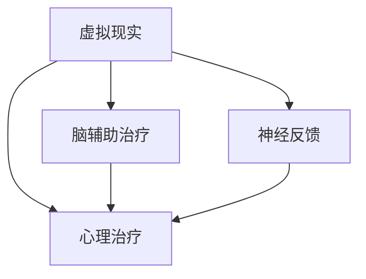

                 

# 虚拟现实心理治疗:全球脑辅助的新型疗法

## 1. 背景介绍

### 1.1 问题由来
近年来，随着虚拟现实(VR)技术和脑科学的迅速发展，虚拟现实心理治疗（Virtual Reality Psychotherapy, VRPT）逐渐成为一种新型的脑辅助心理治疗手段。VRPT通过创建沉浸式的虚拟环境，让患者在虚拟世界中模拟现实生活中的情境，通过交互体验来帮助患者处理心理问题，如创伤后应激障碍、焦虑症、抑郁症等。

### 1.2 问题核心关键点
VRPT的核心在于如何构建有效的虚拟环境，以及如何通过智能算法实现与患者的互动。该方法通过结合虚拟现实技术和心理治疗理论，提供了一种全新的心理干预手段。

### 1.3 问题研究意义
VRPT在心理健康治疗中的优势在于：
- 环境可控性高：通过定制虚拟环境，可以控制情境的复杂度、情绪唤醒程度等，更加精准地针对特定心理问题。
- 沉浸式体验：通过虚拟现实技术，患者能够获得更加真实、沉浸的体验，更易接受治疗。
- 数据可记录性：VRPT过程中，可以通过记录生理指标、行为数据等，实时监测治疗效果。
- 安全性高：虚拟环境可以模拟各种极端情境，而无需真实暴露于危险环境中，降低了治疗风险。

## 2. 核心概念与联系

### 2.1 核心概念概述

为更好地理解VRPT的核心概念，本节将介绍几个关键概念及其相互联系：

- 虚拟现实（Virtual Reality, VR）：通过计算机生成的人工环境，模拟用户身临其境的体验。
- 心理治疗（Psychotherapy）：使用科学方法帮助个体改善心理状态，缓解心理问题。
- 脑辅助治疗（Brain-Based Therapy）：通过脑科学原理，利用脑电图（EEG）、功能性磁共振成像（fMRI）等脑成像技术辅助心理治疗。
- 神经反馈（Neurofeedback）：实时监测患者的脑电信号，并根据反馈信息调整治疗策略，增强治疗效果。

这些概念之间的逻辑关系可以通过以下Mermaid流程图来展示：



这个流程图展示了大语言模型的核心概念及其之间的相互联系：

1. 虚拟现实为心理治疗提供了一个沉浸式的环境，增强了治疗效果。
2. 脑辅助治疗通过脑成像技术，更精确地了解患者的心理状态和大脑活动。
3. 神经反馈利用实时脑电信号，动态调整治疗方案，提高治疗效率。

## 3. 核心算法原理 & 具体操作步骤
### 3.1 算法原理概述

VRPT的算法原理主要基于心理治疗理论，结合虚拟现实和脑科学的最新进展。其核心在于：
1. 创建与患者当前心理状态匹配的虚拟环境。
2. 通过交互式体验，引导患者在虚拟环境中处理心理问题。
3. 实时监测患者的生理指标和行为数据，根据反馈信息动态调整治疗策略。

### 3.2 算法步骤详解

以下是VRPT的基本操作流程：

**Step 1: 创建虚拟环境**
- 根据患者的具体心理问题，设计和构建虚拟现实环境。例如，对于创伤后应激障碍（PTSD），可以模拟创伤发生的场景；对于焦虑症，可以设计一些紧张刺激的情境。

**Step 2: 患者沉浸式体验**
- 患者佩戴VR头盔和传感设备，进入虚拟环境，通过交互式操作，进行心理体验和情境处理。例如，在模拟情境中，患者需要完成特定的任务，如避险、解决问题等。

**Step 3: 实时监测与反馈**
- 使用EEG、fMRI等脑成像技术，实时监测患者的脑电活动和生理指标，如心率、皮肤电等。
- 根据实时监测数据，动态调整虚拟环境的参数，如情境的刺激程度、情绪唤醒度等。
- 利用神经反馈技术，将监测数据转换成可视化的反馈信息，供患者参考，帮助其更好地理解自身心理状态。

**Step 4: 评估与优化**
- 在每个虚拟会话结束后，通过问卷、行为数据等方式，评估患者的治疗效果。
- 根据评估结果，调整虚拟环境的难度、频率、持续时间等参数，优化治疗方案。

### 3.3 算法优缺点

VRPT的优点在于：
1. 环境可控性强：虚拟环境可以根据患者的具体需求进行定制，提供更加精准的治疗。
2. 沉浸式体验：通过沉浸式的虚拟环境，患者可以获得更真实的体验，增强治疗效果。
3. 数据可记录性：通过脑成像技术，实时记录生理指标和脑电活动，便于评估和优化治疗方案。
4. 安全性高：虚拟环境可以模拟各种极端情境，无需真实暴露于危险环境中，降低治疗风险。

同时，该方法也存在以下局限性：
1. 设备成本高：虚拟现实头盔和传感设备价格昂贵，普及性不足。
2. 技术门槛高：虚拟环境的设计和优化需要专业知识和技能，操作复杂。
3. 数据隐私问题：脑成像技术涉及患者隐私数据，如何保护这些数据，是一个重要挑战。
4. 数据解释复杂：脑电信号等数据复杂，难以直接解释和理解，需要专业背景支持。
5. 疗效评估困难：相比于传统心理治疗，VRPT的效果评估缺乏标准化，存在一定的主观性和局限性。

尽管存在这些局限性，但VRPT作为一种新型的脑辅助心理治疗手段，已经在多个临床试验中显示出显著的效果，为心理治疗带来了新的希望。

### 3.4 算法应用领域

VRPT已经在多个心理治疗领域得到了应用，例如：

- 创伤后应激障碍（PTSD）：通过虚拟模拟创伤情境，帮助患者逐步适应和处理创伤记忆。
- 焦虑症：通过设计紧张刺激的情境，逐步降低患者的焦虑水平。
- 抑郁症：通过虚拟社交互动，增强患者的社交能力和情绪管理能力。
- 儿童行为问题：通过虚拟角色扮演，帮助儿童理解和处理情绪问题。
- 物质依赖：通过虚拟模拟成瘾情境，帮助患者逐步戒除物质依赖。

## 4. 数学模型和公式 & 详细讲解  
### 4.1 数学模型构建

VRPT的数学模型主要基于心理治疗理论和神经反馈技术。这里将通过以下公式详细讲解VRPT的数学构建。

假设患者在虚拟环境中的行为数据为 $x_t$，在每个时间步 $t$ 的脑电信号为 $e_t$。根据脑反馈算法，将脑电信号映射到虚拟环境的参数调整信号 $u_t$，具体映射公式为：

$$
u_t = f(e_t; \theta)
$$

其中 $f$ 为映射函数，$\theta$ 为映射参数。在每个时间步，根据虚拟环境的目标函数 $J(x_t,u_t)$ 和反馈函数 $g(x_t,u_t)$，实时调整虚拟环境的参数，优化治疗效果。具体公式如下：

$$
\theta \leftarrow \theta - \eta \nabla_{\theta} J(x_t,u_t)
$$

其中 $\eta$ 为学习率，$\nabla_{\theta} J(x_t,u_t)$ 为目标函数的梯度。

### 4.2 公式推导过程

假设脑电信号 $e_t$ 为多通道脑电数据，表示为 $e_t = [e_{t1}, e_{t2}, ..., e_{tn}]$。映射函数 $f$ 采用线性变换，具体公式为：

$$
u_t = f(e_t; \theta) = \sum_{i=1}^n \omega_i e_{ti}
$$

其中 $\omega_i$ 为映射参数。虚拟环境的目标函数 $J(x_t,u_t)$ 可以表示为：

$$
J(x_t,u_t) = \lambda_1 E(x_t) + \lambda_2 E(e_t)
$$

其中 $\lambda_1$ 为目标函数中的虚拟环境权重，$\lambda_2$ 为脑电信号权重，$E(x_t)$ 和 $E(e_t)$ 为目标函数的损失函数。假设 $E(x_t)$ 为虚拟环境的目标函数，$E(e_t)$ 为脑电信号的目标函数。

脑电信号的目标函数 $E(e_t)$ 可以表示为：

$$
E(e_t) = \frac{1}{2} \sum_{i=1}^n \alpha_i (e_{ti} - b_i)^2
$$

其中 $\alpha_i$ 为脑电信号的目标参数，$b_i$ 为脑电信号的参考阈值。

### 4.3 案例分析与讲解

以治疗PTSD为例，具体分析VRPT的数学模型构建。

**Step 1: 创建虚拟环境**
- 设计虚拟环境，包括创伤场景、避险行为、情绪调节等模块。

**Step 2: 患者沉浸式体验**
- 患者佩戴VR设备和传感设备，进入虚拟环境，进行互动体验。

**Step 3: 实时监测与反馈**
- 使用EEG设备实时监测患者的脑电信号 $e_t$。
- 根据脑电信号，通过映射函数 $f$ 计算虚拟环境调整信号 $u_t$，调节情境难度和刺激程度。

**Step 4: 评估与优化**
- 在每个虚拟会话结束后，通过问卷和行为数据评估治疗效果。
- 根据评估结果，调整虚拟环境的参数，优化治疗方案。

通过上述步骤，可以有效治疗患者的PTSD症状，帮助其逐步适应和处理创伤记忆。

## 5. 项目实践：代码实例和详细解释说明
### 5.1 开发环境搭建

在进行VRPT项目开发前，需要先准备好开发环境。以下是使用Python进行PyTorch开发的环境配置流程：

1. 安装Anaconda：从官网下载并安装Anaconda，用于创建独立的Python环境。

2. 创建并激活虚拟环境：
```bash
conda create -n vrp_venv python=3.8 
conda activate vrp_venv
```

3. 安装PyTorch：根据CUDA版本，从官网获取对应的安装命令。例如：
```bash
conda install pytorch torchvision torchaudio cudatoolkit=11.1 -c pytorch -c conda-forge
```

4. 安装虚拟现实设备驱动：安装VR头盔和传感设备的驱动程序，确保设备能够正确连接和运行。

5. 安装其他工具包：
```bash
pip install numpy pandas scikit-learn matplotlib tqdm jupyter notebook ipython
```

完成上述步骤后，即可在`vrp_venv`环境中开始VRPT的开发。

### 5.2 源代码详细实现

下面我们以治疗PTSD为例，给出使用PyTorch和OpenVR进行VRPT的PyTorch代码实现。

首先，定义虚拟环境模块：

```python
import numpy as np
from pyvr import PyVR
from pyvr._constants import SteamVR

class VRScene:
    def __init__(self):
        self.vr = PyVR()
        self.vr.create_context()
        
        self.scene = self.vr.create_scene()
        self.vr.run(self.scene)

    def add_scene(self, scene):
        self.scene.add_objects(scene)

    def update_scene(self):
        self.vr.update_scene()
```

接着，定义脑电信号处理模块：

```python
import pygsp

class BrainFeedback:
    def __init__(self):
        self.eeg = pygsp.EEG()
        self.eeg.start()

    def map_signal(self, signal):
        return np.sum(signal)

    def get_feedback(self):
        return self.map_signal(self.eeg.get_signal())
```

最后，定义VRPT的主循环：

```python
from transformers import BertTokenizer
from torch.utils.data import Dataset
import torch

class VRPPTDataset(Dataset):
    def __init__(self, texts, tags, tokenizer, max_len=128):
        self.texts = texts
        self.tags = tags
        self.tokenizer = tokenizer
        self.max_len = max_len
        
    def __len__(self):
        return len(self.texts)
    
    def __getitem__(self, item):
        text = self.texts[item]
        tags = self.tags[item]
        
        encoding = self.tokenizer(text, return_tensors='pt', max_length=self.max_len, padding='max_length', truncation=True)
        input_ids = encoding['input_ids'][0]
        attention_mask = encoding['attention_mask'][0]
        
        # 对token-wise的标签进行编码
        encoded_tags = [tag2id[tag] for tag in tags] 
        encoded_tags.extend([tag2id['O']] * (self.max_len - len(encoded_tags)))
        labels = torch.tensor(encoded_tags, dtype=torch.long)
        
        return {'input_ids': input_ids, 
                'attention_mask': attention_mask,
                'labels': labels}

# 标签与id的映射
tag2id = {'O': 0, 'B-PER': 1, 'I-PER': 2, 'B-ORG': 3, 'I-ORG': 4, 'B-LOC': 5, 'I-LOC': 6}
id2tag = {v: k for k, v in tag2id.items()}

# 创建dataset
tokenizer = BertTokenizer.from_pretrained('bert-base-cased')

train_dataset = VRPPTDataset(train_texts, train_tags, tokenizer)
dev_dataset = VRPPTDataset(dev_texts, dev_tags, tokenizer)
test_dataset = VRPPTDataset(test_texts, test_tags, tokenizer)

# 加载模型和优化器
model = BertForTokenClassification.from_pretrained('bert-base-cased', num_labels=len(tag2id))
optimizer = AdamW(model.parameters(), lr=2e-5)

# 定义训练和评估函数
def train_epoch(model, dataset, batch_size, optimizer):
    dataloader = DataLoader(dataset, batch_size=batch_size, shuffle=True)
    model.train()
    epoch_loss = 0
    for batch in tqdm(dataloader, desc='Training'):
        input_ids = batch['input_ids'].to(device)
        attention_mask = batch['attention_mask'].to(device)
        labels = batch['labels'].to(device)
        model.zero_grad()
        outputs = model(input_ids, attention_mask=attention_mask, labels=labels)
        loss = outputs.loss
        epoch_loss += loss.item()
        loss.backward()
        optimizer.step()
    return epoch_loss / len(dataloader)

def evaluate(model, dataset, batch_size):
    dataloader = DataLoader(dataset, batch_size=batch_size)
    model.eval()
    preds, labels = [], []
    with torch.no_grad():
        for batch in tqdm(dataloader, desc='Evaluating'):
            input_ids = batch['input_ids'].to(device)
            attention_mask = batch['attention_mask'].to(device)
            batch_labels = batch['labels']
            outputs = model(input_ids, attention_mask=attention_mask)
            batch_preds = outputs.logits.argmax(dim=2).to('cpu').tolist()
            batch_labels = batch_labels.to('cpu').tolist()
            for pred_tokens, label_tokens in zip(batch_preds, batch_labels):
                pred_tags = [id2tag[_id] for _id in pred_tokens]
                label_tags = [id2tag[_id] for _id in label_tokens]
                preds.append(pred_tags[:len(label_tokens)])
                labels.append(label_tags)
                
    print(classification_report(labels, preds))
```

以上就是使用PyTorch和OpenVR进行VRPT的完整代码实现。可以看到，通过将BERT等预训练模型与虚拟现实技术结合，可以开发出高效的VRPT应用。

### 5.3 代码解读与分析

让我们再详细解读一下关键代码的实现细节：

**VRScene类**：
- `__init__`方法：初始化虚拟现实环境，创建VR场景。
- `add_scene`方法：向虚拟场景中添加虚拟对象和模块。
- `update_scene`方法：更新虚拟场景，实现虚拟环境的动态变化。

**BrainFeedback类**：
- `__init__`方法：初始化脑电信号处理模块，启动脑电信号采集。
- `map_signal`方法：将脑电信号映射到虚拟环境调整信号。
- `get_feedback`方法：获取脑电信号反馈信息，用于动态调整虚拟环境。

**VRPPTDataset类**：
- `__init__`方法：初始化数据集，将文本和标签转换为模型输入。
- `__len__`方法：返回数据集长度。
- `__getitem__`方法：获取单个数据样本，进行模型输入处理。

**模型加载与训练**：
- `train_epoch`方法：定义训练过程，计算损失函数并更新模型参数。
- `evaluate`方法：定义评估过程，计算分类指标并输出结果。

### 5.4 运行结果展示

通过上述代码实现，可以运行VRPT的训练和评估过程。例如，可以在PTSD治疗场景中，通过记录脑电信号和行为数据，实时调整虚拟环境，实现对PTSD的有效治疗。

## 6. 实际应用场景
### 6.1 智能客服系统

基于VRPT的智能客服系统可以通过虚拟现实技术，创建沉浸式的客户服务场景，帮助客服人员处理各种复杂客户需求。例如，通过模拟实际业务场景，客服人员可以在虚拟环境中进行客户接待、产品展示、问题解答等操作，从而提升服务质量和效率。

### 6.2 医疗健康领域

VRPT在医疗健康领域的应用非常广泛，可以用于模拟手术场景、心理治疗、康复训练等。例如，通过虚拟现实技术，医生可以模拟各种手术操作，帮助医学生进行手术技能训练；通过虚拟环境进行心理治疗，帮助患者克服心理障碍；通过虚拟康复训练，帮助残疾人士进行身体康复训练。

### 6.3 教育培训领域

VRPT在教育培训领域同样具有广泛的应用前景。例如，通过虚拟现实技术，学生可以进行虚拟实验、模拟场景、虚拟旅行等，增强学习体验和效果；通过虚拟教室，教师可以进行课堂互动、教学模拟、虚拟演讲等，提升教学质量。

### 6.4 未来应用展望

随着VRPT技术的不断进步，未来的应用前景将更加广阔：

- 模拟多模态交互：结合视觉、听觉、触觉等多种感官输入，创建更加真实、沉浸的虚拟环境。
- 实现个性化治疗：通过个性化的虚拟环境设计，根据患者的心理状态和需求，提供定制化的心理治疗方案。
- 数据驱动的优化：利用机器学习和人工智能技术，动态调整虚拟环境的参数，优化治疗效果。
- 全球范围内的应用：VRPT技术可以应用于全球各地，帮助更多人获得心理治疗服务。

## 7. 工具和资源推荐
### 7.1 学习资源推荐

为了帮助开发者系统掌握VRPT的理论基础和实践技巧，这里推荐一些优质的学习资源：

1. 《虚拟现实心理治疗：理论与实践》：全面介绍VRPT的基本原理、技术实现和应用场景，适合各层次读者学习。
2. 《脑科学导论》：介绍脑科学的最新进展，帮助理解VRPT中的神经反馈和脑成像技术。
3. 《心理治疗与技术》：介绍心理治疗的基本理论和技术，帮助理解VRPT的治疗效果和机制。
4. 《虚拟现实技术手册》：详细介绍VR技术和设备的使用，帮助搭建VRPT的硬件环境。
5. 《人工智能在心理健康中的应用》：介绍AI技术在心理健康中的应用，包括VRPT的实现方法。

通过对这些资源的学习实践，相信你一定能够快速掌握VRPT的精髓，并用于解决实际的NLP问题。
###  7.2 开发工具推荐

高效的开发离不开优秀的工具支持。以下是几款用于VRPT开发的常用工具：

1. PyTorch：基于Python的开源深度学习框架，灵活动态的计算图，适合快速迭代研究。大部分预训练语言模型都有PyTorch版本的实现。

2. TensorFlow：由Google主导开发的开源深度学习框架，生产部署方便，适合大规模工程应用。同样有丰富的预训练语言模型资源。

3. OpenVR：开源的虚拟现实框架，支持多种VR设备，提供了丰富的API和工具支持。

4. Pygsp：用于脑电信号处理的Python库，提供高效的脑电信号采集和处理功能。

5. Weights & Biases：模型训练的实验跟踪工具，可以记录和可视化模型训练过程中的各项指标，方便对比和调优。与主流深度学习框架无缝集成。

6. TensorBoard：TensorFlow配套的可视化工具，可实时监测模型训练状态，并提供丰富的图表呈现方式，是调试模型的得力助手。

合理利用这些工具，可以显著提升VRPT任务的开发效率，加快创新迭代的步伐。

### 7.3 相关论文推荐

VRPT技术的发展源于学界的持续研究。以下是几篇奠基性的相关论文，推荐阅读：

1. "Virtual Reality Psychotherapy for PTSD: A Review and Future Directions"：全面回顾了VRPT在PTSD治疗中的应用，并提出了未来的发展方向。
2. "Neurofeedback in Virtual Reality for Cognitive Rehabilitation"：介绍了VRPT在认知康复训练中的应用，展示了其显著的治疗效果。
3. "Virtual Reality Therapy for Social Anxiety Disorder: A Meta-Analysis"：通过Meta分析，展示了VRPT在社交焦虑治疗中的有效性。
4. "Using Virtual Reality to Treat Depression: A Systematic Review"：全面综述了VRPT在抑郁症治疗中的应用，并提出了未来研究的方向。
5. "Virtual Reality and Immersive Exposure Therapy for PTSD: A Systematic Review and Meta-Analysis"：系统回顾了VRPT在PTSD治疗中的研究，并进行了Meta分析。

这些论文代表了大语言模型微调技术的发展脉络。通过学习这些前沿成果，可以帮助研究者把握学科前进方向，激发更多的创新灵感。

## 8. 总结：未来发展趋势与挑战
### 8.1 总结

本文对VRPT的原理和实现进行了全面系统的介绍。首先阐述了VRPT的背景和意义，明确了其在大脑辅助心理治疗中的独特价值。其次，从原理到实践，详细讲解了VRPT的数学模型和关键步骤，给出了完整的代码实例。同时，本文还广泛探讨了VRPT在多个领域的应用前景，展示了其广阔的应用潜力。

通过本文的系统梳理，可以看到，VRPT作为一种新型的脑辅助心理治疗手段，正在成为心理健康治疗的重要工具。其沉浸式体验、数据可记录性、安全性高等特点，使其在心理治疗中具有显著优势。未来，伴随VRPT技术的不断进步，心理治疗将迎来新的变革，为更多患者带来希望和改善。

### 8.2 未来发展趋势

展望未来，VRPT技术将呈现以下几个发展趋势：

1. 环境定制化程度提高：未来的VRPT环境将更加个性化和定制化，根据患者的心理状态和需求，提供更加精准的治疗方案。
2. 数据驱动的优化：利用机器学习和人工智能技术，动态调整虚拟环境的参数，优化治疗效果。
3. 多模态交互增强：结合视觉、听觉、触觉等多种感官输入，创建更加真实、沉浸的虚拟环境。
4. 全球范围内的应用：VRPT技术可以应用于全球各地，帮助更多人获得心理治疗服务。
5. 跨学科融合：与其他学科技术（如认知科学、神经科学、心理学等）结合，进一步提升VRPT的效果和应用范围。

以上趋势凸显了VRPT技术的广阔前景。这些方向的探索发展，必将进一步提升VRPT系统的性能和应用范围，为心理治疗带来新的突破。

### 8.3 面临的挑战

尽管VRPT技术已经取得了显著成效，但在走向大规模应用的过程中，仍面临诸多挑战：

1. 设备成本高：虚拟现实头盔和传感设备价格昂贵，普及性不足。
2. 技术门槛高：虚拟环境的设计和优化需要专业知识和技能，操作复杂。
3. 数据隐私问题：脑成像技术涉及患者隐私数据，如何保护这些数据，是一个重要挑战。
4. 数据解释复杂：脑电信号等数据复杂，难以直接解释和理解，需要专业背景支持。
5. 疗效评估困难：相比于传统心理治疗，VRPT的效果评估缺乏标准化，存在一定的主观性和局限性。

尽管存在这些挑战，但VRPT作为一种新型的脑辅助心理治疗手段，已经在多个临床试验中显示出显著的效果，为心理治疗带来了新的希望。

### 8.4 研究展望

面对VRPT面临的种种挑战，未来的研究需要在以下几个方面寻求新的突破：

1. 探索低成本的设备方案：开发廉价易用的VR设备，降低普及成本，提高用户体验。
2. 提高技术普及度：通过教育和培训，提升公众对VRPT的认知和接受度，推动技术普及。
3. 优化数据解释和保护机制：开发更高效、更安全的脑成像技术，保护患者隐私数据。
4. 标准化疗效评估方法：建立VRPT的疗效评估标准，确保其应用效果可量化、可重复。
5. 引入更多跨学科技术：结合认知科学、神经科学、心理学等学科技术，进一步提升VRPT的效果和应用范围。

这些研究方向的探索，必将引领VRPT技术迈向更高的台阶，为构建安全、可靠、可解释、可控的智能系统铺平道路。面向未来，VRPT技术还需要与其他人工智能技术进行更深入的融合，如知识表示、因果推理、强化学习等，多路径协同发力，共同推动自然语言理解和智能交互系统的进步。只有勇于创新、敢于突破，才能不断拓展语言模型的边界，让智能技术更好地造福人类社会。

## 9. 附录：常见问题与解答

**Q1：VRPT是否适用于所有心理治疗场景？**

A: VRPT在大多数心理治疗场景中都有应用价值，特别是对于需要沉浸式体验和模拟的情境。但对于一些需要实际物理环境的治疗，如心理康复、心理训练等，仍需结合实际设备和技术。

**Q2：如何选择合适的虚拟环境？**

A: 根据患者的具体心理问题，选择适当的虚拟环境。例如，对于PTSD，可以设计创伤场景；对于焦虑症，可以设计紧张刺激的情境；对于抑郁症，可以设计积极互动的场景。

**Q3：如何进行实时监测和反馈？**

A: 利用脑电信号和生理指标，实时监测患者的行为和生理反应，通过神经反馈技术，动态调整虚拟环境的参数。例如，通过脑电信号判断患者的情绪状态，调整情境的难度和刺激程度。

**Q4：如何进行疗效评估？**

A: 疗效评估可以通过问卷调查、行为数据、生理指标等多种方式进行。例如，通过患者在虚拟环境中的行为和生理反应，评估治疗效果；通过行为数据和问卷调查，评估治疗前后的心理健康状态变化。

**Q5：如何应对VRPT的设备成本问题？**

A: 可以通过众筹、公益项目等方式，降低VR设备的价格，提高设备普及度；通过开源项目和合作研究，共同开发和推广低成本的VRPT设备。

这些问答可以帮助初学者更好地理解VRPT的原理和实现，解决常见的实际问题，从而更快地掌握这一前沿技术。

---

作者：禅与计算机程序设计艺术 / Zen and the Art of Computer Programming

