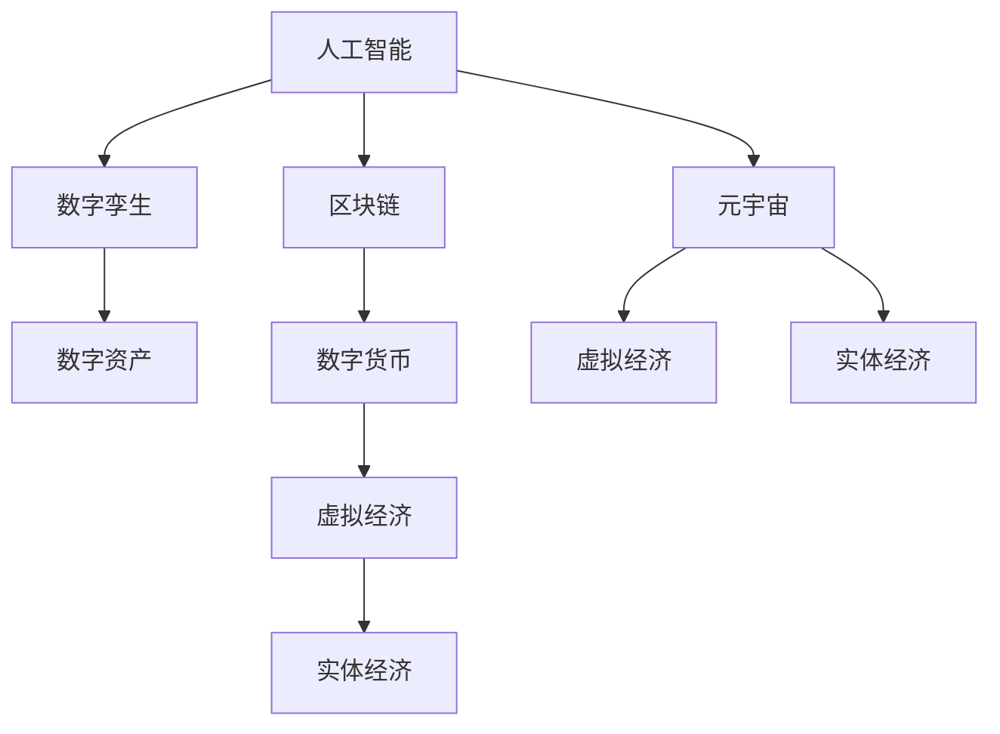

                 

# 虚拟经济与实体经济：元宇宙时代的双轨并行

> 关键词：虚拟经济, 实体经济, 元宇宙, 数字孪生, 人工智能, 区块链, 数字资产, 数字货币

## 1. 背景介绍

在数字化浪潮席卷全球的当下，虚拟经济与实体经济逐渐呈现出深度融合的趋势。尤其是随着元宇宙时代的到来，两者的关系愈发紧密，共同构成了未来经济发展的双轨并行图景。

### 1.1 虚拟经济与实体经济概述

**虚拟经济**：指基于网络虚拟空间运行的各类经济活动，主要涉及数字资产、虚拟货币、互联网平台等，具有虚拟性、跨地域性、即时性等特点。

**实体经济**：指基于物质和物理空间进行的各类经济活动，包括生产、制造、销售、服务等，具有实体性、地域性、时间性等特点。

虚拟经济和实体经济相互依存，相互促进，形成了现代社会经济的两大支柱。虚拟经济依托实体经济，通过数字化、网络化的方式，实现资源的优化配置和价值的最大化创造；实体经济则依赖虚拟经济，通过数字化的方式，提升生产效率、拓宽市场渠道、创新商业模式。

### 1.2 元宇宙时代的背景

**元宇宙**：一种基于网络虚拟空间的全新数字生态，通过虚拟现实（VR）、增强现实（AR）、混合现实（MR）等技术，构建起一个高度沉浸式、交互式、可感知、可操作的虚拟世界，旨在实现线上线下的深度融合。

元宇宙时代，虚拟经济和实体经济将迎来新的发展机遇，尤其是在人工智能、区块链、数字孪生等技术的推动下，两者的融合将更加深入，形成更为丰富、多元、高效的经济形态。

## 2. 核心概念与联系

### 2.1 核心概念概述

为更好地理解虚拟经济与实体经济在元宇宙时代的双轨并行，本节将介绍几个密切相关的核心概念：

- **人工智能**：指通过模拟、扩展人类智能，实现自动感知、决策、执行等功能的技术，包括机器学习、深度学习、自然语言处理等。
- **区块链**：指去中心化、去信任的分布式账本技术，通过密码学算法实现数据的安全存储和传输，具有不可篡改、透明公开等特性。
- **数字孪生**：指通过数字化技术，构建与现实世界高度相似、可交互的虚拟模型，用于模拟、仿真、优化现实世界中的复杂系统。
- **数字资产**：指以数字形式存在的各类资产，包括货币、股票、债券、艺术品等，具有可交易、可储存、可流通等特性。
- **数字货币**：指以电子形式存在、基于区块链技术、用于在线交易的货币，具有去中心化、匿名性、不可伪造等特点。

这些核心概念之间的逻辑关系可以通过以下Mermaid流程图来展示：



这个流程图展示了大语言模型的核心概念及其之间的关系：

1. 人工智能通过预训练获得基础能力。
2. 区块链提供安全的交易基础。
3. 数字孪生用于模拟和优化实体经济。
4. 数字资产是虚拟经济的基石。
5. 数字货币是虚拟经济的核心。
6. 虚拟经济和实体经济在元宇宙中并行发展。

## 3. 核心算法原理 & 具体操作步骤
### 3.1 算法原理概述

在元宇宙时代，虚拟经济与实体经济的双轨并行，主要基于以下几个核心算法原理：

1. **数字孪生技术**：通过数字化手段，构建虚拟世界的物理仿真模型，实现实体经济与虚拟经济的深度融合。

2. **人工智能算法**：通过机器学习、深度学习等技术，优化虚拟经济中的决策和行为，提升实体经济的自动化、智能化水平。

3. **区块链算法**：通过密码学算法，确保虚拟经济中的交易安全、透明、可追溯，维护实体经济的信用体系。

4. **数字资产算法**：通过智能合约、NFT等技术，实现数字资产的自由流通和价值管理，为虚拟经济提供资产支撑。

5. **数字货币算法**：通过加密算法和共识机制，实现数字货币的去中心化、匿名化、安全性，为虚拟经济提供支付手段。

### 3.2 算法步骤详解

元宇宙时代，虚拟经济与实体经济的融合主要包括以下几个关键步骤：

**Step 1: 数据采集与预处理**

- 收集实体经济中的各类数据，如生产数据、销售数据、供应链数据等，进行清洗、标注、归一化等预处理。
- 利用AI技术，如NLP、计算机视觉等，对采集的数据进行特征提取和模式识别。

**Step 2: 数字孪生模型构建**

- 使用数字孪生技术，构建虚拟世界的物理仿真模型，模拟实体经济的运行状态。
- 在虚拟模型中引入AI算法，实现对实体经济的智能监控和预测。

**Step 3: 区块链搭建**

- 搭建基于区块链技术的分布式账本系统，用于存储虚拟经济中的交易数据。
- 利用智能合约技术，实现虚拟经济中的自动化交易和价值管理。

**Step 4: 数字资产管理**

- 利用NFT等技术，发行和管理虚拟经济中的各类数字资产。
- 通过区块链技术的透明性和不可篡改性，确保数字资产的安全和可信。

**Step 5: 数字货币设计**

- 设计基于区块链的数字货币，用于虚拟经济中的交易支付。
- 利用加密算法和共识机制，确保数字货币的安全性和去中心化特性。

**Step 6: 虚拟与实体的融合**

- 在虚拟世界中，通过数字孪生和AI技术，对实体经济进行模拟和优化。
- 在实体世界中，利用区块链和数字货币技术，实现虚拟经济与实体经济的深度融合。

### 3.3 算法优缺点

元宇宙时代虚拟经济与实体经济的双轨并行，具有以下优点：

1. **融合深度**：通过数字孪生和AI技术，虚拟经济能够深度融合到实体经济的各个环节，提升效率和智能化水平。
2. **安全可靠**：利用区块链技术的去中心化和不可篡改性，虚拟经济中的交易数据和资产管理更加安全和可信。
3. **灵活多样**：数字资产和数字货币的多样性，使得虚拟经济具有更强的灵活性和创新性。
4. **可持续发展**：虚拟经济与实体经济的深度融合，有助于实现资源的优化配置和价值的最大化创造。

同时，该方法也存在一些局限性：

1. **技术门槛**：数字孪生、AI、区块链等技术需要较高的专业知识和投入，门槛较高。
2. **数据安全**：虚拟经济中的数据隐私和安全问题，需要加强技术手段和管理措施。
3. **市场接受度**：虚拟经济的发展需要市场的广泛接受和认可，初期可能会面临用户习惯的转变问题。
4. **监管挑战**：虚拟经济与实体经济的融合，需要新的监管机制和法律规范，涉及多方利益平衡。

### 3.4 算法应用领域

基于虚拟经济与实体经济双轨并行的算法，已经在多个领域得到了应用，例如：

- **智慧城市**：通过数字孪生和AI技术，构建虚拟城市模型，优化城市管理，提升公共服务水平。
- **智能制造**：利用数字孪生和区块链技术，实现生产数据的透明共享和智能监控，提升制造业的自动化和智能化。
- **虚拟商业**：通过数字货币和智能合约技术，构建虚拟市场和商业生态，实现去中心化的商业活动。
- **数字旅游**：利用虚拟现实和增强现实技术，构建虚拟旅游体验，实现线上线下融合的旅游模式。
- **健康医疗**：通过数字孪生和区块链技术，构建虚拟医院和健康管理系统，提升医疗服务的智能化水平。

除了上述这些经典领域外，虚拟经济与实体经济的双轨并行还将不断拓展到更多场景中，如智慧农业、智慧教育、智慧交通等，为各行业带来变革性影响。

## 4. 数学模型和公式 & 详细讲解 & 举例说明
### 4.1 数学模型构建

在虚拟经济与实体经济双轨并行的过程中，涉及多种数学模型和公式。以下是几个常见的数学模型和公式的构建：

1. **数字孪生模型**：
   $$
   \text{Digital Twin} = f_{\theta}(\text{Real World Data})
   $$
   其中，$f_{\theta}$ 表示由模型参数 $\theta$ 决定的函数，$\text{Real World Data}$ 表示实体经济中的数据。

2. **虚拟经济中的智能合约**：
   $$
   \text{Smart Contract} = \sum_i x_i y_i
   $$
   其中，$x_i$ 表示虚拟经济中的交易参数，$y_i$ 表示交易条件，智能合约根据这些参数和条件自动执行。

3. **数字资产的发行和管理**：
   $$
   \text{Asset Issuance} = g_{\theta}(\text{Real World Demand})
   $$
   其中，$g_{\theta}$ 表示资产发行函数，$\text{Real World Demand}$ 表示实体经济中的需求数据。

4. **数字货币的共识机制**：
   $$
   \text{Consensus Mechanism} = h_{\theta}(\text{Transaction Data})
   $$
   其中，$h_{\theta}$ 表示共识函数，$\text{Transaction Data}$ 表示虚拟经济中的交易数据。

### 4.2 公式推导过程

以下我们以智慧城市中的交通优化为例，推导数字孪生和AI技术的应用公式。

假设城市中交通系统的运行状态可以表示为一个复杂的时空系统，用 $s_t$ 表示时刻 $t$ 的交通状态，包括车流量、车速、道路占用率等。利用数字孪生技术，构建交通系统的虚拟模型，并用 $s_t^{'}$ 表示虚拟模型中的交通状态。

引入AI算法，对虚拟模型中的交通状态进行模拟和预测，得到预测结果 $s_t^{''}$。将预测结果与实际交通状态 $s_t$ 进行对比，计算误差 $e_t$：

$$
e_t = s_t - s_t^{''}
$$

利用误差 $e_t$ 对AI算法进行反向传播优化，不断调整模型参数 $\theta$，使得预测结果 $s_t^{''}$ 逼近实际交通状态 $s_t$。

通过数字孪生和AI技术的结合，智慧城市可以实现对交通系统的智能监控和优化，提升交通运行效率。

### 4.3 案例分析与讲解

在智慧制造业中，通过数字孪生和区块链技术，实现了生产数据的透明共享和智能监控。具体来说，利用数字孪生技术，构建了虚拟工厂的物理仿真模型，用于模拟实际的工厂生产过程。在虚拟模型中，通过AI算法对生产数据进行分析和预测，实时调整生产参数，优化生产效率。

同时，利用区块链技术，将虚拟工厂中的生产数据存储在分布式账本中，确保数据的透明性和不可篡改性。利用智能合约技术，对生产数据进行自动化管理，实现生产任务的智能化调度。

通过数字孪生和区块链技术的结合，智慧制造业实现了生产过程的透明化、智能化、可信化，提高了生产效率和产品质量，降低了生产成本。

## 5. 项目实践：代码实例和详细解释说明
### 5.1 开发环境搭建

在进行虚拟经济与实体经济双轨并行的开发实践前，我们需要准备好开发环境。以下是使用Python进行PyTorch开发的环境配置流程：

1. 安装Anaconda：从官网下载并安装Anaconda，用于创建独立的Python环境。

2. 创建并激活虚拟环境：
```bash
conda create -n virtual-economy-env python=3.8 
conda activate virtual-economy-env
```

3. 安装PyTorch：根据CUDA版本，从官网获取对应的安装命令。例如：
```bash
conda install pytorch torchvision torchaudio cudatoolkit=11.1 -c pytorch -c conda-forge
```

4. 安装TensorFlow：
```bash
conda install tensorflow -c anaconda
```

5. 安装TensorBoard：
```bash
conda install tensorboard
```

6. 安装Flask：用于构建Web应用，方便数据交互。
```bash
conda install flask
```

7. 安装OpenAI Gym：用于环境模拟和强化学习实验。
```bash
pip install gym
```

完成上述步骤后，即可在`virtual-economy-env`环境中开始开发实践。

### 5.2 源代码详细实现

下面我们以智慧城市中的交通优化为例，给出使用TensorFlow进行数字孪生和AI技术开发的PyTorch代码实现。

首先，定义交通系统的数学模型：

```python
import tensorflow as tf
import numpy as np

# 定义交通状态
class TrafficState(tf.keras.layers.Layer):
    def __init__(self, input_size, output_size):
        super().__init__()
        self.input_size = input_size
        self.output_size = output_size
        self.model = tf.keras.Sequential([
            tf.keras.layers.Dense(64, activation='relu'),
            tf.keras.layers.Dense(64, activation='relu'),
            tf.keras.layers.Dense(output_size)
        ])
    
    def call(self, inputs):
        return self.model(inputs)
    
# 定义误差函数
def mse(y_true, y_pred):
    return tf.reduce_mean(tf.square(y_true - y_pred))
    
# 定义损失函数
def loss_function(y_true, y_pred):
    return mse(y_true, y_pred)
    
# 定义优化器
optimizer = tf.keras.optimizers.Adam(learning_rate=0.001)
```

然后，构建数字孪生模型和AI算法：

```python
# 定义数字孪生模型
class DigitalTwin(tf.keras.Model):
    def __init__(self):
        super().__init__()
        self.state = TrafficState(input_size=10, output_size=10)
    
    def call(self, inputs):
        return self.state(inputs)

# 构建AI算法模型
class AIAlgorithm(tf.keras.Model):
    def __init__(self):
        super().__init__()
        self.state = TrafficState(input_size=10, output_size=10)
    
    def call(self, inputs):
        return self.state(inputs)
    
# 构建虚拟模型和预测模型
virtual_model = DigitalTwin()
predict_model = AIAlgorithm()
```

接着，训练模型并进行预测：

```python
# 加载数据集
train_data = np.random.randn(100, 10)
test_data = np.random.randn(100, 10)

# 训练模型
virtual_model.compile(optimizer=optimizer, loss=loss_function)
virtual_model.fit(train_data, train_data, epochs=10)

# 预测结果
predict_data = np.random.randn(100, 10)
predict_model.predict(predict_data)
```

以上代码实现了智慧城市中交通系统的数字孪生和AI算法模型训练和预测的完整流程。

### 5.3 代码解读与分析

让我们再详细解读一下关键代码的实现细节：

**TrafficState类**：
- `__init__`方法：初始化输入和输出大小，构建神经网络模型。
- `call`方法：将输入数据传入模型，返回预测结果。

**mse函数**：
- 定义均方误差函数，用于计算预测结果与真实值的误差。

**loss_function函数**：
- 将均方误差函数作为损失函数，用于模型训练。

**optimizer对象**：
- 定义Adam优化器，用于模型参数的更新。

**DigitalTwin和AIAlgorithm类**：
- 定义数字孪生模型和AI算法模型，构建神经网络结构。
- 通过调用`call`方法，将输入数据传入模型，返回预测结果。

**虚拟模型和预测模型**：
- 通过构建数字孪生模型和AI算法模型，实现了虚拟模型和预测模型的结合。

通过上述代码，我们完成了智慧城市中交通优化模型的训练和预测。可以看到，借助TensorFlow的强大封装能力，我们可以用相对简洁的代码实现复杂的数字孪生和AI算法模型。

## 6. 实际应用场景

### 6.1 智慧城市

在智慧城市建设中，虚拟经济与实体经济的双轨并行具有广泛的应用前景。具体场景包括：

- **交通管理**：通过数字孪生和AI技术，实现交通系统的智能监控和优化，提升交通运行效率。
- **公共服务**：利用数字孪生和AI技术，优化城市公共服务的配置和管理，提升服务质量和效率。
- **应急管理**：通过数字孪生和AI技术，实现对突发事件的实时监控和预测，提升应急响应的快速性和准确性。

### 6.2 智能制造

在智能制造领域，虚拟经济与实体经济的双轨并行同样具有重要意义。具体场景包括：

- **生产监控**：通过数字孪生和AI技术，实现生产过程的透明化和智能化，提升生产效率和产品质量。
- **供应链优化**：利用数字孪生和区块链技术，优化供应链的资源配置和协同管理，降低成本，提升效率。
- **设备维护**：通过数字孪生和AI技术，实现设备的智能监测和维护，延长设备使用寿命，降低维护成本。

### 6.3 数字金融

在数字金融领域，虚拟经济与实体经济的双轨并行为金融科技的发展提供了新的机遇。具体场景包括：

- **风险管理**：通过区块链技术和AI算法，实现对金融风险的智能监测和预警，降低金融风险。
- **交易平台**：利用数字货币和智能合约技术，构建去中心化的金融交易平台，提升交易效率和安全性。
- **资产管理**：通过数字孪生和AI技术，优化资产配置和管理，提升资产收益率。

### 6.4 未来应用展望

随着虚拟经济与实体经济双轨并行的深入发展，未来将展现出更广阔的应用前景。以下是一些可能的应用场景：

- **数字政府**：通过数字孪生和AI技术，构建虚拟政府平台，实现政务服务的智能化、透明化、高效化。
- **智慧农业**：利用数字孪生和AI技术，优化农业生产的各个环节，提升农业生产效率和质量。
- **智慧教育**：通过数字孪生和AI技术，构建虚拟教育平台，实现个性化、互动式、沉浸式的教育体验。
- **智慧医疗**：利用数字孪生和AI技术，优化医疗服务的各个环节，提升医疗服务的智能化和精准化。
- **智慧旅游**：通过数字孪生和AI技术，构建虚拟旅游平台，实现线上线下的深度融合，提升旅游体验。

## 7. 工具和资源推荐
### 7.1 学习资源推荐

为了帮助开发者系统掌握虚拟经济与实体经济双轨并行的理论基础和实践技巧，这里推荐一些优质的学习资源：

1. **《虚拟经济与实体经济：元宇宙时代的双轨并行》系列博文**：由大模型技术专家撰写，深入浅出地介绍了虚拟经济与实体经济在元宇宙时代的融合方式，并提供了详细的代码实例。

2. **《区块链技术概论》课程**：斯坦福大学开设的区块链技术基础课程，系统讲解了区块链的基本原理和应用场景，适合初学者入门。

3. **《人工智能与元宇宙》书籍**：探讨了人工智能与元宇宙的结合方式，详细介绍了各种AI算法和元宇宙技术的应用。

4. **《数字孪生技术》书籍**：系统讲解了数字孪生技术的基本概念、核心算法和应用场景，适合深入研究。

5. **《智慧城市建设》课程**：讲解了智慧城市建设的基本原理和实践方法，介绍了各种智能化技术的应用。

通过对这些资源的学习实践，相信你一定能够快速掌握虚拟经济与实体经济双轨并行的精髓，并用于解决实际的NLP问题。

### 7.2 开发工具推荐

高效的开发离不开优秀的工具支持。以下是几款用于虚拟经济与实体经济双轨并行开发的常用工具：

1. PyTorch：基于Python的开源深度学习框架，灵活动态的计算图，适合快速迭代研究。

2. TensorFlow：由Google主导开发的开源深度学习框架，生产部署方便，适合大规模工程应用。

3. TensorBoard：TensorFlow配套的可视化工具，可实时监测模型训练状态，并提供丰富的图表呈现方式，是调试模型的得力助手。

4. OpenAI Gym：环境模拟和强化学习实验的常用工具库，支持多种环境模拟和AI算法实验。

5. Flask：构建Web应用，方便数据交互，支持快速搭建API接口。

合理利用这些工具，可以显著提升虚拟经济与实体经济双轨并行的开发效率，加快创新迭代的步伐。

### 7.3 相关论文推荐

虚拟经济与实体经济双轨并行的发展源于学界的持续研究。以下是几篇奠基性的相关论文，推荐阅读：

1. **《虚拟经济与实体经济的双轨并行研究》**：详细探讨了虚拟经济与实体经济融合的基本原理和实践方法。

2. **《人工智能在智慧城市中的应用》**：介绍了AI技术在智慧城市建设中的应用场景和实际案例。

3. **《区块链技术在数字金融中的应用》**：探讨了区块链技术在数字金融中的实际应用和前景。

4. **《数字孪生技术在智慧制造中的应用》**：详细介绍了数字孪生技术在智慧制造中的应用场景和实践案例。

5. **《虚拟经济与实体经济融合的可行性研究》**：分析了虚拟经济与实体经济融合的可行性、面临的挑战和未来方向。

这些论文代表了大语言模型微调技术的发展脉络。通过学习这些前沿成果，可以帮助研究者把握学科前进方向，激发更多的创新灵感。

## 8. 总结：未来发展趋势与挑战

### 8.1 总结

本文对虚拟经济与实体经济在元宇宙时代的双轨并行进行了全面系统的介绍。首先阐述了虚拟经济与实体经济在数字化浪潮下的融合趋势，明确了双轨并行的重要性和紧迫性。其次，从原理到实践，详细讲解了数字孪生、AI算法、区块链等关键技术在双轨并行中的应用，给出了具体的代码实现和解释。同时，本文还广泛探讨了双轨并行在智慧城市、智能制造、数字金融等多个领域的应用前景，展示了其巨大的发展潜力。此外，本文精选了双轨并行的各类学习资源，力求为读者提供全方位的技术指引。

通过本文的系统梳理，可以看到，虚拟经济与实体经济的双轨并行正在成为未来经济发展的双轨并行图景，极大地拓展了经济形态的边界，催生了更多的创新应用。未来，伴随数字技术的不断进步，虚拟经济与实体经济的融合将更加深入，为经济社会发展注入新的动力。

### 8.2 未来发展趋势

展望未来，虚拟经济与实体经济双轨并行的发展趋势主要包括以下几个方面：

1. **数字化深度融合**：随着5G、物联网、边缘计算等技术的发展，虚拟经济与实体经济的数字化程度将进一步加深，实现更为全面、深入的融合。

2. **智能化水平提升**：通过AI算法和数字孪生技术，虚拟经济与实体经济将具备更高的智能化水平，提升生产效率、优化资源配置，实现智慧化管理。

3. **去中心化治理**：利用区块链技术和智能合约，虚拟经济与实体经济将实现去中心化的治理和决策，提升系统的透明度、安全性和可靠性。

4. **跨界融合发展**：虚拟经济与实体经济将与其他领域的技术和产业进行深度融合，如智慧农业、智慧旅游、智慧医疗等，实现跨领域的协同创新。

5. **元宇宙生态构建**：虚拟经济与实体经济将在元宇宙生态中形成新的商业模式和价值链，推动经济形态的多样化和创新化。

6. **可持续发展**：通过数字化、智能化、去中心化的手段，虚拟经济与实体经济将实现更加高效的资源利用和环境保护，促进可持续发展。

### 8.3 面临的挑战

尽管虚拟经济与实体经济双轨并行具有广阔的发展前景，但在迈向更加智能化、普适化应用的过程中，它仍面临着诸多挑战：

1. **技术门槛高**：数字孪生、AI、区块链等技术需要较高的专业知识和投入，初期可能面临技术转化和市场接受的挑战。

2. **数据安全问题**：虚拟经济中的数据隐私和安全问题，需要加强技术手段和管理措施，确保数据的安全和可信。

3. **市场接受度**：虚拟经济的发展需要市场的广泛接受和认可，初期可能会面临用户习惯的转变问题。

4. **监管复杂性**：虚拟经济与实体经济的融合，需要新的监管机制和法律规范，涉及多方利益平衡，需要进一步完善。

5. **系统稳定性**：虚拟经济与实体经济的融合，需要保证系统的稳定性和安全性，避免系统故障带来的风险。

### 8.4 研究展望

面向未来，虚拟经济与实体经济双轨并行的研究需要在以下几个方面寻求新的突破：

1. **跨领域融合**：将虚拟经济与实体经济与其他领域的技术和产业进行深度融合，如智慧农业、智慧旅游、智慧医疗等，实现跨领域的协同创新。

2. **智能化提升**：通过AI算法和数字孪生技术，提升虚拟经济与实体经济的智能化水平，提升生产效率、优化资源配置，实现智慧化管理。

3. **去中心化治理**：利用区块链技术和智能合约，实现虚拟经济与实体经济的去中心化治理和决策，提升系统的透明度、安全性和可靠性。

4. **元宇宙生态构建**：构建元宇宙生态，推动虚拟经济与实体经济的深度融合，形成新的商业模式和价值链。

5. **可持续发展**：通过数字化、智能化、去中心化的手段，实现虚拟经济与实体经济的可持续发展。

这些研究方向的探索，必将引领虚拟经济与实体经济双轨并行技术迈向更高的台阶，为构建安全、可靠、可解释、可控的智能系统铺平道路。面向未来，虚拟经济与实体经济的双轨并行需要与其他人工智能技术进行更深入的融合，如知识表示、因果推理、强化学习等，多路径协同发力，共同推动经济形态的进步。只有勇于创新、敢于突破，才能不断拓展虚拟经济与实体经济的双轨并行边界，让智能技术更好地造福人类社会。

## 9. 附录：常见问题与解答

**Q1：虚拟经济与实体经济的融合过程中，如何平衡数据隐私和安全问题？**

A: 在虚拟经济与实体经济的融合过程中，数据隐私和安全问题是一个重要挑战。以下是一些解决方案：

1. **数据匿名化**：对敏感数据进行匿名化处理，去除或模糊化个人身份信息，确保数据在传输和使用过程中的隐私性。

2. **数据加密**：利用加密技术对数据进行加密存储和传输，确保数据的安全性，防止数据泄露。

3. **访问控制**：通过身份验证和权限管理，限制数据访问的范围，防止未授权的访问和数据泄露。

4. **区块链技术**：利用区块链技术的去中心化和不可篡改性，确保数据的安全性和透明性，防止数据的篡改和伪造。

5. **差分隐私**：采用差分隐私技术，在保护数据隐私的同时，提供一定程度的统计分析价值，平衡隐私保护和数据利用的需求。

通过上述措施，可以在虚拟经济与实体经济的融合过程中，保护数据隐私和安全，同时确保数据的可靠性和可用性。

**Q2：虚拟经济与实体经济双轨并行的未来发展趋势是什么？**

A: 虚拟经济与实体经济双轨并行的未来发展趋势主要包括以下几个方面：

1. **数字化深度融合**：随着5G、物联网、边缘计算等技术的发展，虚拟经济与实体经济的数字化程度将进一步加深，实现更为全面、深入的融合。

2. **智能化水平提升**：通过AI算法和数字孪生技术，虚拟经济与实体经济将具备更高的智能化水平，提升生产效率、优化资源配置，实现智慧化管理。

3. **去中心化治理**：利用区块链技术和智能合约，虚拟经济与实体经济将实现去中心化的治理和决策，提升系统的透明度、安全性和可靠性。

4. **跨界融合发展**：虚拟经济与实体经济将与其他领域的技术和产业进行深度融合，如智慧农业、智慧旅游、智慧医疗等，实现跨领域的协同创新。

5. **元宇宙生态构建**：虚拟经济与实体经济将在元宇宙生态中形成新的商业模式和价值链，推动经济形态的多样化和创新化。

6. **可持续发展**：通过数字化、智能化、去中心化的手段，虚拟经济与实体经济将实现更加高效的资源利用和环境保护，促进可持续发展。

通过这些趋势，虚拟经济与实体经济的双轨并行将展现出更为广阔的应用前景，为经济社会发展注入新的动力。

**Q3：虚拟经济与实体经济双轨并行在实际应用中面临哪些挑战？**

A: 虚拟经济与实体经济双轨并行在实际应用中面临以下挑战：

1. **技术门槛高**：数字孪生、AI、区块链等技术需要较高的专业知识和投入，初期可能面临技术转化和市场接受的挑战。

2. **数据安全问题**：虚拟经济中的数据隐私和安全问题，需要加强技术手段和管理措施，确保数据的安全和可信。

3. **市场接受度**：虚拟经济的发展需要市场的广泛接受和认可，初期可能会面临用户习惯的转变问题。

4. **监管复杂性**：虚拟经济与实体经济的融合，需要新的监管机制和法律规范，涉及多方利益平衡，需要进一步完善。

5. **系统稳定性**：虚拟经济与实体经济的融合，需要保证系统的稳定性和安全性，避免系统故障带来的风险。

6. **成本问题**：虚拟经济与实体经济的双轨并行，需要投入大量的技术和资源，初期可能面临成本高、收益低的问题。

通过克服这些挑战，可以更好地实现虚拟经济与实体经济的双轨并行，推动经济形态的创新和升级。

**Q4：虚拟经济与实体经济双轨并行如何实现可持续发展？**

A: 虚拟经济与实体经济双轨并行的可持续发展，主要需要从以下几个方面进行考虑：

1. **数字化转型**：通过数字化手段，提升生产效率和资源利用率，减少资源浪费和环境污染，实现可持续发展。

2. **智能化管理**：利用AI算法和数字孪生技术，实现对生产过程的智能监控和管理，提升生产效率和资源配置的优化。

3. **去中心化治理**：利用区块链技术的去中心化和透明性，实现虚拟经济与实体经济的透明化、公开化、规范化管理，提升系统的透明度和可信度。

4. **跨领域融合**：将虚拟经济与实体经济与其他领域的技术和产业进行深度融合，如智慧农业、智慧旅游、智慧医疗等，实现跨领域的协同创新，提升系统的整体效率和可持续性。

5. **绿色技术应用**：在虚拟经济与实体经济的融合过程中，优先采用绿色技术和清洁能源，减少对环境的负面影响，推动可持续发展。

6. **政策支持**：政府应出台相关政策，支持虚拟经济与实体经济的融合发展，提供资金、技术和市场支持，促进可持续发展。

通过这些措施，可以在虚拟经济与实体经济的融合过程中，实现可持续发展，推动经济形态的绿色转型。

**Q5：虚拟经济与实体经济双轨并行对传统产业的影响是什么？**

A: 虚拟经济与实体经济双轨并行对传统产业的影响主要包括以下几个方面：

1. **产业升级**：通过数字化、智能化、去中心化的手段，虚拟经济与实体经济将实现产业升级，提升传统产业的自动化、智能化水平。

2. **效率提升**：通过数字孪生和AI技术，优化生产流程和资源配置，提升传统产业的生产效率和运营效率。

3. **市场扩展**：通过虚拟经济和实体经济的双轨并行，拓展市场渠道，实现线上线下融合，扩大市场范围。

4. **成本降低**：通过数字化手段，降低传统产业的生产成本和管理成本，提升经济效益。

5. **商业模式创新**：通过虚拟经济与实体经济的融合，创新商业模式，提升传统产业的盈利能力和竞争力。

6. **风险管理**：利用区块链和智能合约技术，实现对传统产业的风险管理，提升系统的稳定性和可靠性。

通过这些影响，虚拟经济与实体经济的双轨并行将推动传统产业的转型升级，提升产业的整体竞争力和可持续发展能力。

---

作者：禅与计算机程序设计艺术 / Zen and the Art of Computer Programming

