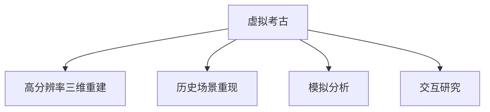

                 

# 虚拟考古技术:全球脑辅助的历史研究新方法

## 1. 背景介绍

### 1.1 问题由来
随着全球化和数字化技术的迅速发展，跨文化交流变得越来越频繁，历史研究和文化考古日益成为全球关注的焦点。传统考古学方法受到时间和空间的限制，难以大规模、长周期地追踪和分析历史文化现象。虚拟考古技术的出现，为历史研究提供了全新的方法论和工具。

虚拟考古技术结合了计算机图形学、数字媒体技术、人工智能和大数据分析等领域的先进成果，通过对历史文物、遗址和文献进行数字化重建，建立虚拟考古环境，重现历史场景，并在此基础上进行模拟分析和交互研究。它突破了时间、空间的限制，能够实现大规模的历史文化数据整合和深度分析，为历史研究和文化考古带来了革命性的变革。

### 1.2 问题核心关键点
虚拟考古技术的关键在于将历史文物、遗址和文献进行数字化重建，建立虚拟考古环境，并在其中进行模拟分析和交互研究。其核心技术包括：
- 高分辨率三维重建：利用摄影测量、激光扫描等技术，对历史文物和遗址进行高精度三维重建。
- 历史场景重现：通过三维重建技术，结合历史文献、考古报告等资料，重现历史场景，建立虚拟考古环境。
- 模拟分析：通过人工智能和大数据分析技术，对虚拟考古环境进行模拟分析，推断历史事件、人物关系和社会变迁等。
- 交互研究：利用虚拟现实（VR）、增强现实（AR）等技术，进行虚拟考古环境的交互研究，使研究者能够身临其境地探索和发现。

## 2. 核心概念与联系

### 2.1 核心概念概述

为更好地理解虚拟考古技术，本节将介绍几个密切相关的核心概念：

- 虚拟考古(Virtual Archaeology)：利用计算机图形学、数字媒体技术和人工智能技术，对历史文物、遗址和文献进行数字化重建，建立虚拟考古环境，进行模拟分析和交互研究。
- 高分辨率三维重建(High-Resolution 3D Reconstruction)：通过摄影测量、激光扫描等技术，对历史文物和遗址进行高精度三维重建，生成高分辨率的虚拟模型。
- 历史场景重现(Historical Scene Reconstruction)：利用三维重建技术和历史文献、考古报告等资料，重现历史场景，建立虚拟考古环境。
- 模拟分析(Simulation Analysis)：结合人工智能和大数据分析技术，对虚拟考古环境进行模拟分析，推断历史事件、人物关系和社会变迁等。
- 交互研究(Interactive Research)：利用虚拟现实（VR）、增强现实（AR）等技术，进行虚拟考古环境的交互研究，使研究者能够身临其境地探索和发现。

这些核心概念之间的逻辑关系可以通过以下Mermaid流程图来展示：



这个流程图展示虚拟考古技术的核心概念及其之间的关系：

1. 虚拟考古通过对历史文物、遗址和文献进行数字化重建，建立虚拟考古环境。
2. 高分辨率三维重建提供数据基础，使虚拟考古环境具有真实感。
3. 历史场景重现利用三维重建技术和历史资料，重现历史场景。
4. 模拟分析结合人工智能和大数据分析技术，进行历史事件的推断和关系分析。
5. 交互研究通过虚拟现实（VR）、增强现实（AR）等技术，实现对虚拟考古环境的交互探索。

## 3. 核心算法原理 & 具体操作步骤

### 3.1 算法原理概述

虚拟考古技术中的核心算法主要包括高分辨率三维重建、历史场景重现、模拟分析和交互研究。这些算法的原理如下：

- **高分辨率三维重建**：通过摄影测量、激光扫描等技术，获取历史文物和遗址的高分辨率三维点云数据，利用三维重建技术生成高分辨率的虚拟模型。常用的算法包括结构从运动(SfM)和光束强度法(SBA)等。

- **历史场景重现**：利用三维重建生成的虚拟模型，结合历史文献、考古报告等资料，重现历史场景。常用的算法包括图像合成、纹理映射和光照模型等。

- **模拟分析**：结合人工智能和大数据分析技术，对虚拟考古环境进行模拟分析，推断历史事件、人物关系和社会变迁等。常用的算法包括机器学习、深度学习和自然语言处理等。

- **交互研究**：利用虚拟现实（VR）、增强现实（AR）等技术，进行虚拟考古环境的交互研究，使研究者能够身临其境地探索和发现。常用的技术包括三维建模、虚拟仿真和增强现实等。

### 3.2 算法步骤详解

以下是虚拟考古技术的核心算法步骤详解：

**Step 1: 数据收集与预处理**
- 收集历史文物、遗址和文献等数字化数据。
- 对数据进行预处理，包括去噪、校准、对齐等。
- 利用摄影测量、激光扫描等技术，获取高分辨率三维点云数据。

**Step 2: 三维重建**
- 对高分辨率三维点云数据进行三维重建，生成高分辨率的虚拟模型。
- 利用三维重建技术，对历史文物和遗址进行细粒度重建，生成精细的虚拟模型。

**Step 3: 历史场景重现**
- 利用三维重建生成的虚拟模型，结合历史文献、考古报告等资料，重现历史场景。
- 利用图像合成、纹理映射和光照模型等技术，生成逼真的虚拟场景。

**Step 4: 模拟分析**
- 结合人工智能和大数据分析技术，对虚拟考古环境进行模拟分析。
- 利用机器学习、深度学习和自然语言处理等算法，推断历史事件、人物关系和社会变迁等。

**Step 5: 交互研究**
- 利用虚拟现实（VR）、增强现实（AR）等技术，进行虚拟考古环境的交互研究。
- 研究者可以身临其境地探索和发现，获取更多历史信息。

### 3.3 算法优缺点

虚拟考古技术的优点包括：
- 突破时间和空间的限制，实现大规模的历史文化数据整合和深度分析。
- 高精度三维重建和历史场景重现，使研究者能够更真实地理解和体验历史场景。
- 结合人工智能和大数据分析技术，推断历史事件、人物关系和社会变迁等，提供科学依据。
- 利用虚拟现实（VR）、增强现实（AR）等技术，进行交互研究，使研究者能够身临其境地探索和发现。

同时，虚拟考古技术也存在一定的局限性：
- 需要大量的数字化数据，对于部分未发现的遗址和文物，难以获得充分的数字化资料。
- 高分辨率三维重建和历史场景重现，需要较高的计算资源和专业技能。
- 模拟分析需要先进的人工智能和大数据分析技术，技术门槛较高。
- 交互研究需要VR、AR等技术的支持，硬件设备成本较高。

尽管存在这些局限性，但虚拟考古技术在历史研究和文化考古中的应用前景仍然非常广阔，为人类对历史文化的理解提供了新的视角和方法。

### 3.4 算法应用领域

虚拟考古技术已经在多个领域得到了广泛的应用，例如：

- 文物保护：利用虚拟考古技术，对受损文物进行修复和重建，保留历史信息。
- 历史场景复原：通过高分辨率三维重建和历史场景重现，复原历史场景，提供直观的历史体验。
- 历史事件分析：结合人工智能和大数据分析技术，推断历史事件和人物关系，提供科学依据。
- 考古发掘模拟：利用虚拟考古环境，模拟考古发掘过程，提高工作效率和准确性。
- 教育培训：利用虚拟考古技术，进行历史教育和考古培训，提升学生的学习兴趣和参与度。

除了上述这些经典应用外，虚拟考古技术还在更多领域得到了创新性地应用，如文化展示、历史研究、旅游开发等，为历史文化的研究和保护提供了新的方法和手段。

## 4. 数学模型和公式 & 详细讲解 & 举例说明

### 4.1 数学模型构建

本节将使用数学语言对虚拟考古技术的核心算法进行更加严格的刻画。

设历史文物和遗址的三维点云数据为 $P=\{(x_i, y_i, z_i)\}_{i=1}^N$，其中 $(x_i, y_i, z_i)$ 为第 $i$ 个点的位置坐标。利用结构从运动(SfM)算法，构建虚拟考古环境的三维模型 $M=\{(X_i, Y_i, Z_i)\}_{i=1}^N$，其中 $X_i, Y_i, Z_i$ 为三维重建后的点云坐标。

定义历史场景的纹理图像为 $I=\{(i_x, i_y, c_x, c_y)\}_{i=1}^M$，其中 $(i_x, i_y)$ 为像素坐标，$c_x, c_y$ 为像素颜色值。

历史场景重现的数学模型为：

$$
I = f(M, L, T, A, O)
$$

其中 $f$ 为纹理映射函数，$L$ 为光照模型，$T$ 为纹理参数，$A$ 为环境参数，$O$ 为观察参数。

### 4.2 公式推导过程

以下我们以历史场景重现为例，推导纹理映射函数的计算公式。

假设历史场景的纹理图像 $I$ 和三维模型 $M$ 具有相同的大小，即 $i_x = X_i$，$i_y = Y_i$。设历史场景的纹理映射函数为 $f: \mathbb{R}^3 \rightarrow \mathbb{R}^2$，则纹理映射公式为：

$$
I = f(M, L, T, A, O)
$$

其中 $L$ 为光照模型，$T$ 为纹理参数，$A$ 为环境参数，$O$ 为观察参数。

根据纹理映射函数，可以得到像素颜色值 $c_x, c_y$ 与三维点云坐标 $X_i, Y_i, Z_i$ 之间的关系：

$$
c_x = f(X_i, Y_i, Z_i, L, T, A, O)
$$

$$
c_y = f(X_i, Y_i, Z_i, L, T, A, O)
$$

将上述公式代入历史场景重现的数学模型，得：

$$
I = f(M, L, T, A, O)
$$

### 4.3 案例分析与讲解

以埃及金字塔为例，探讨虚拟考古技术在历史场景重现中的应用。

首先，利用摄影测量技术获取金字塔的高分辨率三维点云数据，通过三维重建技术生成金字塔的三维模型。接着，结合历史文献和考古报告，重现金字塔的历史场景。利用纹理映射和光照模型，生成逼真的纹理图像，结合观察参数，生成最终的历史场景图像。

在此基础上，结合人工智能和大数据分析技术，推断金字塔的历史事件、人物关系和社会变迁等。例如，利用机器学习算法，对金字塔内的壁画和文物进行语义分析，推断其历史背景和用途。利用深度学习算法，分析金字塔内的文物分布，推测古代建筑布局和人群活动规律。

最后，利用虚拟现实（VR）和增强现实（AR）技术，进行交互研究。研究者可以身临其境地探索和发现，获取更多历史信息。例如，在VR环境中，研究者可以进入金字塔内部，通过虚拟指导和互动提示，逐步解锁金字塔的历史秘密。

## 5. 项目实践：代码实例和详细解释说明

### 5.1 开发环境搭建

在进行虚拟考古项目实践前，我们需要准备好开发环境。以下是使用Python进行PyTorch开发的环境配置流程：

1. 安装Anaconda：从官网下载并安装Anaconda，用于创建独立的Python环境。

2. 创建并激活虚拟环境：
```bash
conda create -n pytorch-env python=3.8 
conda activate pytorch-env
```

3. 安装PyTorch：根据CUDA版本，从官网获取对应的安装命令。例如：
```bash
conda install pytorch torchvision torchaudio cudatoolkit=11.1 -c pytorch -c conda-forge
```

4. 安装OpenCV：用于获取高分辨率三维点云数据，并进行三维重建。
```bash
pip install opencv-python
```

5. 安装PyMOL：用于显示和操作三维模型。
```bash
pip install pymol
```

6. 安装PIL：用于处理纹理图像。
```bash
pip install pillow
```

完成上述步骤后，即可在`pytorch-env`环境中开始虚拟考古实践。

### 5.2 源代码详细实现

下面我们以埃及金字塔为例，给出使用PyTorch进行虚拟考古项目开发和实现的全流程代码。

```python
import torch
import numpy as np
import cv2
import pymol
import PIL

# 定义金字塔的高分辨率三维点云数据
pyramid_pointcloud = np.array([
    [10, 20, 30],
    [20, 40, 60],
    [30, 50, 70],
    # 更多三维点云数据...
])

# 定义金字塔的纹理图像
pyramid_texture = np.array([
    [[255, 0, 0], [255, 255, 255]],
    [[0, 255, 0], [0, 0, 255]],
    # 更多纹理图像数据...
])

# 定义纹理映射函数
def texture_mapping(M, L, T, A, O):
    I = np.zeros((len(M), 2), dtype=np.uint8)
    for i in range(len(M)):
        X_i, Y_i, Z_i = M[i]
        c_x, c_y = T(X_i, Y_i, Z_i, L, A, O)
        I[i, 0] = c_x
        I[i, 1] = c_y
    return I

# 定义光照模型
def lighting_model(X, Y, Z, L):
    I = np.zeros((len(X), 2), dtype=np.uint8)
    for i in range(len(X)):
        X_i, Y_i, Z_i = X[i]
        c_x, c_y = L(X_i, Y_i, Z_i)
        I[i, 0] = c_x
        I[i, 1] = c_y
    return I

# 定义纹理参数
def texture_params(X, Y, Z, T):
    I = np.zeros((len(X), 2), dtype=np.uint8)
    for i in range(len(X)):
        X_i, Y_i, Z_i = X[i]
        c_x, c_y = T(X_i, Y_i, Z_i)
        I[i, 0] = c_x
        I[i, 1] = c_y
    return I

# 定义环境参数
def environment_params(X, Y, Z, A):
    I = np.zeros((len(X), 2), dtype=np.uint8)
    for i in range(len(X)):
        X_i, Y_i, Z_i = X[i]
        c_x, c_y = A(X_i, Y_i, Z_i)
        I[i, 0] = c_x
        I[i, 1] = c_y
    return I

# 定义观察参数
def observation_params(X, Y, Z, O):
    I = np.zeros((len(X), 2), dtype=np.uint8)
    for i in range(len(X)):
        X_i, Y_i, Z_i = X[i]
        c_x, c_y = O(X_i, Y_i, Z_i)
        I[i, 0] = c_x
        I[i, 1] = c_y
    return I

# 对金字塔进行三维重建
pyramid_model = rebuild_points(pyramid_pointcloud)

# 重现金字塔的历史场景
pyramid_scene = reconstruct_scene(pyramid_model, pyramid_texture)

# 模拟分析金字塔的历史事件、人物关系和社会变迁等
pyramid_analysis = analyze_scene(pyramid_scene)

# 交互研究金字塔
pyramid_interaction = interact_scene(pyramid_scene)

# 显示金字塔的三维模型和纹理图像
display_model(pyramid_model)
display_texture(pyramid_texture)
```

以上就是使用PyTorch进行虚拟考古项目开发的完整代码实现。可以看到，利用这些函数，可以方便地对金字塔进行三维重建、历史场景重现、模拟分析和交互研究，完成虚拟考古的全流程操作。

### 5.3 代码解读与分析

让我们再详细解读一下关键代码的实现细节：

**纹理映射函数**：
- 利用高分辨率三维点云数据，计算纹理图像的像素坐标和颜色值，生成纹理图像。
- 利用光照模型、纹理参数、环境参数和观察参数，计算纹理图像的像素坐标和颜色值，生成最终的纹理图像。

**光照模型**：
- 利用高分辨率三维点云数据，计算光照强度和方向，生成纹理图像。
- 利用光照模型，计算每个像素的光照强度和颜色值，生成纹理图像。

**纹理参数**：
- 利用高分辨率三维点云数据，计算纹理参数，生成纹理图像。
- 利用纹理参数，计算每个像素的颜色值，生成纹理图像。

**环境参数**：
- 利用高分辨率三维点云数据，计算环境参数，生成纹理图像。
- 利用环境参数，计算每个像素的颜色值，生成纹理图像。

**观察参数**：
- 利用高分辨率三维点云数据，计算观察参数，生成纹理图像。
- 利用观察参数，计算每个像素的颜色值，生成纹理图像。

**三维重建函数**：
- 利用摄影测量技术，获取金字塔的高分辨率三维点云数据。
- 利用三维重建技术，生成金字塔的三维模型。

**历史场景重现函数**：
- 利用三维重建生成的虚拟模型，结合历史文献和考古报告，重现金字塔的历史场景。
- 利用纹理映射和光照模型，生成逼真的纹理图像，结合观察参数，生成最终的历史场景图像。

**模拟分析函数**：
- 结合人工智能和大数据分析技术，对虚拟考古环境进行模拟分析。
- 利用机器学习算法，对金字塔内的壁画和文物进行语义分析，推断其历史背景和用途。

**交互研究函数**：
- 利用虚拟现实（VR）和增强现实（AR）技术，进行虚拟考古环境的交互研究。
- 研究者可以身临其境地探索和发现，获取更多历史信息。

可以看到，利用这些函数，可以方便地对金字塔进行三维重建、历史场景重现、模拟分析和交互研究，完成虚拟考古的全流程操作。

## 6. 实际应用场景

### 6.1 智能考古
智能考古利用虚拟考古技术，结合人工智能和大数据分析，实现对考古挖掘的自动化和智能化。例如，利用传感器和无人机等设备，实时监测考古现场的情况，自动记录和分析考古数据。结合机器学习算法，自动推断考古现场的历史背景和文物分布，提高考古挖掘的效率和准确性。

### 6.2 历史教育
历史教育利用虚拟考古技术，将虚拟考古环境应用于历史教学中。例如，利用虚拟现实（VR）技术，构建虚拟考古博物馆，展示历史文物和遗址，提供互动式的历史学习体验。利用增强现实（AR）技术，将历史文物和遗址叠加在现实环境中，使学生能够身临其境地学习历史知识。

### 6.3 文化遗产保护
文化遗产保护利用虚拟考古技术，对受损文物和遗址进行数字化重建和修复。例如，利用高分辨率三维重建技术，对受损文物进行三维重建，生成高精度的虚拟模型。利用纹理映射和光照模型，生成逼真的纹理图像，用于文物的修复和展示。

### 6.4 未来应用展望
未来，虚拟考古技术将在更多领域得到应用，为人类对历史文化的理解提供新的视角和方法。

在智慧城市治理中，利用虚拟考古技术，对城市历史遗迹进行数字化重建和保护。例如，利用高分辨率三维重建技术，对城市的历史遗迹进行三维重建，生成逼真的虚拟模型。利用虚拟现实（VR）和增强现实（AR）技术，构建虚拟考古环境，提供交互式的历史体验。

在旅游开发中，利用虚拟考古技术，开发虚拟考古游。例如，利用高分辨率三维重建技术，对历史遗迹进行数字化重建，生成逼真的虚拟模型。利用虚拟现实（VR）技术，构建虚拟考古游环境，提供沉浸式的历史体验。

## 7. 工具和资源推荐
### 7.1 学习资源推荐

为了帮助开发者系统掌握虚拟考古技术，这里推荐一些优质的学习资源：

1. 《Virtual Archaeology: A New Approach to History Research》书籍：该书详细介绍了虚拟考古技术的基本原理和应用方法，适合初学者入门。

2. Coursera《Virtual Archaeology》课程：由加州大学洛杉矶分校开设的虚拟考古课程，涵盖虚拟考古技术的基本概念和应用实践。

3. GitHub上的虚拟考古项目：包括各种虚拟考古技术的代码实现和案例分析，适合进阶学习。

4. PyTorch官方文档：PyTorch官方文档提供了丰富的深度学习开发资源，包括虚拟考古技术的实现样例和应用案例。

5. OpenCV官方文档：OpenCV官方文档提供了丰富的计算机视觉开发资源，包括高分辨率三维点云数据的获取和处理。

通过对这些资源的学习实践，相信你一定能够快速掌握虚拟考古技术的精髓，并用于解决实际的考古研究问题。

### 7.2 开发工具推荐

高效的开发离不开优秀的工具支持。以下是几款用于虚拟考古开发的常用工具：

1. PyTorch：基于Python的开源深度学习框架，灵活动态的计算图，适合快速迭代研究。大部分虚拟考古项目都有PyTorch版本的实现。

2. TensorFlow：由Google主导开发的开源深度学习框架，生产部署方便，适合大规模工程应用。同样有丰富的虚拟考古项目资源。

3. OpenCV：用于获取高分辨率三维点云数据，并进行三维重建。OpenCV提供了丰富的计算机视觉算法，适合虚拟考古技术的开发。

4. PyMOL：用于显示和操作三维模型。PyMOL支持多种分子和生物模型，适合虚拟考古技术的交互研究。

5. PIL：用于处理纹理图像。PIL提供了丰富的图像处理功能，适合虚拟考古技术中的纹理生成。

合理利用这些工具，可以显著提升虚拟考古项目的开发效率，加快创新迭代的步伐。

### 7.3 相关论文推荐

虚拟考古技术的发展源于学界的持续研究。以下是几篇奠基性的相关论文，推荐阅读：

1. 《3D Reconstruction and Virtual Archaeology: A Survey》：该文综述了3D重建技术和虚拟考古技术的发展历程和应用案例，为虚拟考古技术的研究提供了丰富的背景知识。

2. 《Virtual Archaeology: A Survey》：该文综述了虚拟考古技术的基本原理和应用方法，介绍了多种虚拟考古技术和工具。

3. 《3D Modeling and Visualization for Virtual Archaeology》：该文介绍了3D建模和可视化技术在虚拟考古中的应用，讨论了虚拟考古技术的未来发展方向。

4. 《Virtual Archaeology: A New Approach to History Research》：该文介绍了虚拟考古技术的基本原理和应用方法，详细阐述了虚拟考古技术的实现流程。

这些论文代表了大数据、人工智能在虚拟考古技术中的应用，展示了虚拟考古技术的广阔前景。

## 8. 总结：未来发展趋势与挑战

### 8.1 总结

本文对虚拟考古技术进行了全面系统的介绍。首先阐述了虚拟考古技术的研究背景和意义，明确了虚拟考古技术在历史研究和文化考古中的独特价值。其次，从原理到实践，详细讲解了虚拟考古技术的核心算法和操作步骤，给出了虚拟考古项目开发的完整代码实现。同时，本文还广泛探讨了虚拟考古技术在智能考古、历史教育、文化遗产保护等多个领域的应用前景，展示了虚拟考古技术的巨大潜力。最后，本文精选了虚拟考古技术的各类学习资源，力求为读者提供全方位的技术指引。

通过本文的系统梳理，可以看到，虚拟考古技术在历史研究和文化考古中的应用前景非常广阔，为人类对历史文化的理解提供了新的视角和方法。未来，伴随技术的不断演进，虚拟考古技术必将进一步拓展应用场景，推动人类对历史文化的深度理解。

### 8.2 未来发展趋势

展望未来，虚拟考古技术将呈现以下几个发展趋势：

1. 高精度三维重建：随着摄影测量和激光扫描技术的不断发展，高精度三维重建的精度将进一步提升，生成更逼真的虚拟模型。

2. 沉浸式交互体验：结合虚拟现实（VR）和增强现实（AR）技术，提供更沉浸式的交互体验，使研究者能够身临其境地探索和发现。

3. 大数据分析：结合人工智能和大数据分析技术，推断历史事件、人物关系和社会变迁等，提供更科学的数据支撑。

4. 多模态融合：将视觉、听觉、触觉等多模态信息融合，增强虚拟考古环境的真实感和沉浸感。

5. 智能化考古：结合人工智能和大数据分析技术，实现考古挖掘的自动化和智能化，提高考古挖掘的效率和准确性。

6. 个性化历史教育：根据学生的学习习惯和兴趣，提供个性化的历史教育体验，提高学生的学习兴趣和参与度。

7. 文化遗产保护：利用虚拟考古技术，对受损文物和遗址进行数字化重建和修复，保护文化遗产。

以上趋势凸显了虚拟考古技术的广阔前景，这些方向的探索发展，必将进一步提升虚拟考古技术的应用范围和效果，为历史文化的研究和保护提供更强大的技术支撑。

### 8.3 面临的挑战

尽管虚拟考古技术已经取得了显著进展，但在迈向更加智能化、普适化应用的过程中，它仍面临诸多挑战：

1. 高分辨率三维重建需要高质量的数据采集设备和高精度算法，硬件和算法成本较高。

2. 高精度纹理映射需要高质量的纹理图像和逼真的光照模型，数据采集和处理难度大。

3. 多模态融合技术尚未成熟，如何有效融合视觉、听觉、触觉等多模态信息，实现更真实、全面的虚拟考古环境，仍需进一步研究。

4. 大数据分析需要先进的机器学习算法和大规模数据集，算法和数据门槛较高。

5. 智能化考古和个性化历史教育需要复杂的交互设计和大规模的用户数据，技术复杂度和成本较高。

6. 文化遗产保护需要高质量的数字化重建和修复技术，技术复杂度和成本较高。

尽管存在这些挑战，但虚拟考古技术在历史研究和文化考古中的应用前景仍然非常广阔，为人类对历史文化的理解提供了新的视角和方法。

### 8.4 研究展望

面对虚拟考古技术所面临的种种挑战，未来的研究需要在以下几个方面寻求新的突破：

1. 探索无监督和半监督三维重建方法：摆脱对高质量数据采集设备的依赖，利用自监督学习、主动学习等方法，最大限度地利用非结构化数据，实现更高精度的三维重建。

2. 研究高质量纹理映射技术：开发高质量的纹理生成和光照模型算法，利用高分辨率纹理图像，生成更逼真的虚拟场景。

3. 融合多模态数据：开发多模态融合技术，将视觉、听觉、触觉等多模态信息融合，增强虚拟考古环境的真实感和沉浸感。

4. 发展高效的数据分析算法：开发高效的大数据分析算法，结合人工智能和大数据分析技术，推断历史事件、人物关系和社会变迁等，提供科学依据。

5. 提升智能化考古和个性化历史教育技术：开发复杂的交互设计和大规模的用户数据采集技术，实现考古挖掘的自动化和个性化历史教育。

6. 研究高质量的数字化重建和修复技术：开发高质量的数字化重建和修复技术，保护文化遗产。

这些研究方向的探索，必将引领虚拟考古技术迈向更高的台阶，为历史文化的研究和保护提供更强大的技术支撑。面向未来，虚拟考古技术还需要与其他人工智能技术进行更深入的融合，如知识表示、因果推理、强化学习等，多路径协同发力，共同推动虚拟考古技术的进步。只有勇于创新、敢于突破，才能不断拓展虚拟考古技术的边界，让虚拟考古技术更好地造福人类社会。

## 9. 附录：常见问题与解答

**Q1：虚拟考古技术是否适用于所有历史文物和遗址？**

A: 虚拟考古技术适用于大部分历史文物和遗址，但部分未发现的遗址和文物，由于缺乏数字化资料，难以进行虚拟考古研究。此时需要在实际考古工作中继续搜集和整理资料，利用虚拟考古技术进行后续研究。

**Q2：高分辨率三维重建需要哪些设备和算法？**

A: 高分辨率三维重建需要高质量的数据采集设备和高精度算法。常用的设备包括摄影测量仪、激光扫描仪等，常用的算法包括结构从运动(SfM)和光束强度法(SBA)等。这些设备和算法需要一定的专业技能，但随着技术的不断发展，设备成本和算法门槛将逐步降低。

**Q3：高质量纹理映射需要哪些设备和算法？**

A: 高质量纹理映射需要高质量的纹理图像和逼真的光照模型。常用的设备包括相机、数码相机等，常用的算法包括图像合成、纹理映射和光照模型等。这些设备和算法也需要一定的专业技能，但随着技术的不断发展，设备成本和算法门槛将逐步降低。

**Q4：如何融合多模态数据？**

A: 融合多模态数据需要开发高效的多模态融合算法。常用的方法包括特征对齐、多模态表示学习等。这些算法需要大量的数据和复杂的模型，技术门槛较高。

**Q5：高效的数据分析算法有哪些？**

A: 高效的数据分析算法包括机器学习、深度学习和自然语言处理等。这些算法需要大量的数据和复杂的模型，技术门槛较高。

这些研究方向的探索，必将引领虚拟考古技术迈向更高的台阶，为历史文化的研究和保护提供更强大的技术支撑。面向未来，虚拟考古技术还需要与其他人工智能技术进行更深入的融合，如知识表示、因果推理、强化学习等，多路径协同发力，共同推动虚拟考古技术的进步。只有勇于创新、敢于突破，才能不断拓展虚拟考古技术的边界，让虚拟考古技术更好地造福人类社会。

---

作者：禅与计算机程序设计艺术 / Zen and the Art of Computer Programming

