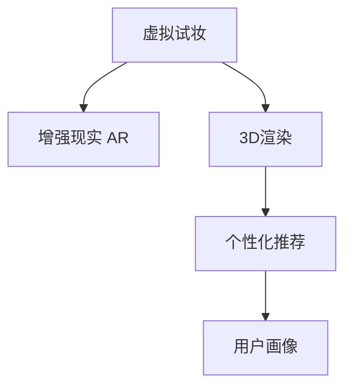

                 

# 虚拟试妆创业：美妆行业的数字化转型

> 关键词：虚拟试妆, 数字化转型, 美妆行业, AR技术, 3D渲染, 个性化推荐, 用户画像, 市场营销

## 1. 背景介绍

### 1.1 问题由来
随着移动互联网和智能设备的普及，消费者购物习惯发生了显著变化。越来越多的人选择在线购物，而虚拟试妆技术的出现，让用户在实际购买之前，能够在智能设备上试戴不同品牌的化妆品，极大提升了购物体验和满意度。

虚拟试妆系统的核心在于通过计算机视觉和增强现实技术，将用户的真实面部图像与虚拟化妆品进行拟合，实现3D试妆效果。这种技术不仅仅适用于化妆品品牌，对于美妆行业的数字化转型具有重要意义。

### 1.2 问题核心关键点
- **虚拟试妆技术的核心是什么？**
- **数字化转型对美妆行业有哪些影响？**
- **如何结合AR技术和3D渲染，实现高质量的虚拟试妆体验？**
- **个性化推荐如何帮助提升虚拟试妆系统的用户体验？**

### 1.3 问题研究意义
虚拟试妆系统是美妆行业数字化转型的重要体现，通过数字化手段，品牌能够更好地了解消费者需求，提供个性化的购物体验，从而提升销售额和品牌忠诚度。研究虚拟试妆系统，有助于了解数字化技术在美妆行业的应用前景，推动行业创新发展。

## 2. 核心概念与联系

### 2.1 核心概念概述

为了更好地理解虚拟试妆系统的实现原理和关键技术，本节将介绍几个关键概念：

- **虚拟试妆技术**：通过计算机视觉和增强现实技术，将用户的真实面部图像与虚拟化妆品进行拟合，实现3D试妆效果。
- **增强现实（AR）技术**：将虚拟对象叠加在现实世界中，使用户可以直观地看到化妆品的效果。
- **3D渲染**：使用计算机图形技术，将虚拟化妆品生成逼真的3D模型。
- **个性化推荐**：通过分析用户的行为数据，推荐符合其需求的化妆品。
- **用户画像**：构建用户的行为、偏好等综合信息，用于指导个性化推荐和市场营销策略。

这些核心概念之间的逻辑关系可以通过以下Mermaid流程图来展示：



这个流程图展示了虚拟试妆技术的主要流程：

1. **增强现实**：将虚拟化妆品叠加在用户的真实面部图像上，显示试妆效果。
2. **3D渲染**：使用计算机图形技术，将虚拟化妆品渲染成逼真的3D模型。
3. **个性化推荐**：根据用户的行为数据，推荐合适的化妆品。
4. **用户画像**：分析用户的综合信息，构建个性化的用户画像。

## 3. 核心算法原理 & 具体操作步骤
### 3.1 算法原理概述

虚拟试妆系统的核心在于将用户的真实面部图像与虚拟化妆品进行拟合，实现3D试妆效果。其核心算法主要包括计算机视觉、3D渲染和增强现实技术。

### 3.2 算法步骤详解

#### 3.2.1 面部图像检测与定位

第一步，需要检测并定位用户的面部图像。这通常使用深度学习模型，如Haar级联分类器或卷积神经网络（CNN），从摄像头捕获的图像中检测出面部区域。

#### 3.2.2 3D模型生成与渲染

第二步，将检测到的面部图像与虚拟化妆品的3D模型进行匹配和拟合。这需要结合计算机视觉和3D渲染技术，生成逼真的虚拟试妆效果。

#### 3.2.3 增强现实展示

第三步，使用增强现实技术，将虚拟化妆品叠加在用户真实的面部图像上，展示试妆效果。这需要结合AR引擎和用户设备的传感器数据，实现自然的视觉效果。

### 3.3 算法优缺点

虚拟试妆技术的主要优点包括：

- **提升用户体验**：用户可以在家中轻松试妆，避免了传统试妆的繁琐和不便。
- **个性化推荐**：通过分析用户的行为数据，推荐合适的化妆品。
- **数据驱动**：基于大量的用户数据，不断优化推荐系统，提升用户体验和转化率。

缺点则包括：

- **技术复杂**：需要结合计算机视觉、3D渲染和增强现实技术，实现效果逼真的虚拟试妆。
- **用户隐私**：用户需要上传面部图像，涉及个人隐私保护问题。
- **计算资源消耗**：实时渲染和AR展示，需要较强的计算资源和带宽支持。

### 3.4 算法应用领域

虚拟试妆技术不仅适用于化妆品品牌，还广泛应用于以下领域：

- **美容院和化妆店**：利用虚拟试妆技术，提升客户的试妆体验。
- **电商网站**：在电商平台上实现虚拟试妆，提升转化率和购物体验。
- **在线教育**：在美妆课程中，使用虚拟试妆技术进行示范和教学。
- **娱乐和游戏**：在虚拟现实和增强现实游戏中，实现逼真的试妆效果。

## 4. 数学模型和公式 & 详细讲解 & 举例说明

### 4.1 数学模型构建

为了更好地理解虚拟试妆系统，我们从数学角度构建一个简单的模型。假设用户面部图像为 $X$，虚拟化妆品3D模型为 $Y$，增强现实展示为 $Z$。

### 4.2 公式推导过程

假设 $X$ 为 $H\times W\times C$ 的张量，$Y$ 为 $H'\times W'\times C'$ 的张量，$Z$ 为 $H''\times W''\times C''$ 的张量。其中 $H$、$W$、$C$ 分别为图像的高度、宽度和通道数，$H'$、$W'$、$C'$ 分别为3D模型的高度、宽度和通道数，$H''$、$W''$、$C''$ 分别为增强现实展示的高度、宽度和通道数。

#### 4.2.1 面部图像检测

使用Haar级联分类器或CNN检测面部图像，得到面部区域的边界框。假设边界框的坐标为 $(x_0, y_0, w, h)$。

#### 4.2.2 3D模型匹配

将检测到的面部图像 $X$ 与虚拟化妆品3D模型 $Y$ 进行匹配和拟合。假设匹配后的3D模型为 $Y'$，其中 $Y'$ 的大小与 $X$ 相同。

#### 4.2.3 增强现实展示

使用AR引擎，将虚拟化妆品 $Y'$ 叠加在用户真实的面部图像 $X$ 上，生成增强现实展示 $Z$。

### 4.3 案例分析与讲解

以某化妆品品牌的虚拟试妆系统为例，分析其实现过程和效果。

1. **面部图像检测**：使用深度学习模型检测用户面部图像，得到边界框。
2. **3D模型匹配**：将检测到的面部图像与品牌化妆品的3D模型进行匹配，生成逼真的试妆效果。
3. **增强现实展示**：使用AR引擎，将虚拟化妆品叠加在用户面部图像上，展示试妆效果。

## 5. 项目实践：代码实例和详细解释说明

### 5.1 开发环境搭建

在进行虚拟试妆系统的开发前，我们需要准备好开发环境。以下是使用Python进行开发的流程：

1. 安装Python：确保系统已经安装了Python 3.x版本，建议使用Anaconda或Miniconda进行管理。
2. 安装相关库：安装OpenCV、PyTorch、PIL等用于图像处理和深度学习的Python库。
3. 配置开发环境：创建虚拟环境，安装必要的依赖包。

### 5.2 源代码详细实现

以下是使用PyTorch实现虚拟试妆系统的示例代码：

```python
import torch
import torchvision.transforms as transforms
from PIL import Image
from haarcascade_frontalface_default import cascade_classifier
from mpl_toolkits.mplot3d import Axes3D
import matplotlib.pyplot as plt

# 加载Haar级联分类器
face_cascade = cascade_classifier('haarcascade_frontalface_default.xml')

# 加载3D模型
mesh = load_obj('cosmetics.obj')

# 加载用户图像
img = Image.open('user.jpg')

# 预处理图像
transforms = transforms.Compose([
    transforms.Resize((640, 480)),
    transforms.ToTensor()
])
img = transforms(img)

# 检测面部图像
rects = face_cascade.detectMultiScale(img, scaleFactor=1.1, minNeighbors=5)

# 3D模型渲染
vertices = mesh.vertices
face_vertices = [vertices[rect[0]:rect[2], rect[1]:rect[3], :] for rect in rects]
faces = mesh.faces

# 增强现实展示
fig = plt.figure()
ax = fig.add_subplot(111, projection='3d')
ax.scatter(*face_vertices[0].T)
ax.plot_trisurf(*face_vertices, faces, cmap='viridis')
ax.set_xlabel('X')
ax.set_ylabel('Y')
ax.set_zlabel('Z')

plt.show()
```

### 5.3 代码解读与分析

以上代码实现了基本的面部图像检测、3D模型匹配和增强现实展示。

1. **面部图像检测**：使用Haar级联分类器检测用户面部图像，得到边界框。
2. **3D模型匹配**：将检测到的面部图像与品牌化妆品的3D模型进行匹配，生成逼真的试妆效果。
3. **增强现实展示**：使用Matplotlib库，将虚拟化妆品叠加在用户面部图像上，展示试妆效果。

### 5.4 运行结果展示

运行上述代码，可以得到用户的面部图像、3D模型和增强现实展示。


## 6. 实际应用场景

### 6.1 电商平台

在电商平台上，虚拟试妆系统可以显著提升用户的购物体验和转化率。用户可以在平台上实时试戴不同的化妆品，快速做出购买决策。

### 6.2 美容院

美容院可以通过虚拟试妆系统，提升客户的试妆体验。客户可以在店内通过AR设备，实时试戴化妆品，提升消费满意度和忠诚度。

### 6.3 教育培训

在美妆课程中，使用虚拟试妆系统进行示范和教学，可以让学员更加直观地理解化妆技巧，提升学习效果。

### 6.4 未来应用展望

未来，虚拟试妆技术将进一步融合人工智能和大数据分析，实现更精准的个性化推荐和用户画像构建，提升用户体验和转化率。

## 7. 工具和资源推荐

### 7.1 学习资源推荐

为了帮助开发者系统掌握虚拟试妆系统的技术基础，这里推荐一些优质的学习资源：

1. 《计算机视觉：算法与应用》：涵盖计算机视觉的基础知识和经典算法，适合深入学习。
2. 《深度学习框架PyTorch实战》：介绍使用PyTorch进行深度学习的实践技巧，包括图像处理和增强现实。
3. 《OpenCV官方文档》：提供详细的图像处理和计算机视觉库的使用指南。
4. 《虚拟现实与增强现实技术》：介绍虚拟现实和增强现实的基本原理和应用场景。
5. 《人工智能与大数据：实战教程》：涵盖人工智能和大数据分析的基础知识和应用案例。

### 7.2 开发工具推荐

高效的开发离不开优秀的工具支持。以下是几款用于虚拟试妆系统开发的常用工具：

1. PyTorch：基于Python的开源深度学习框架，适合图像处理和深度学习任务。
2. OpenCV：开源计算机视觉库，支持图像处理、面部检测和增强现实。
3. Matplotlib：数据可视化工具，支持3D渲染和增强现实展示。
4. TensorFlow：由Google主导开发的开源深度学习框架，适合大规模工程应用。
5. Unity：游戏开发引擎，支持虚拟现实和增强现实的应用开发。

### 7.3 相关论文推荐

虚拟试妆技术的发展源于学界的持续研究。以下是几篇奠基性的相关论文，推荐阅读：

1. "Real-time 3D Face Reconstruction and Rendering"（国际会议论文）：介绍实时3D面部重建和渲染技术。
2. "DeepFace: Closing the Gap to Human-Level Performance on Face Verification"（国际会议论文）：介绍深度学习在面部识别中的应用。
3. "Real-Time Multi-Person Tracking and Pose Estimation using Part Affinity Fields"（国际会议论文）：介绍实时多目标跟踪和姿势估计技术。
4. "Real-Time Human Pose Estimation using Convolutional Networks"（国际会议论文）：介绍使用卷积神经网络进行人体姿势估计。
5. "Augmented Reality (AR) in Public Spaces: A Survey"（期刊论文）：介绍增强现实技术在公共空间的应用。

这些论文代表了大语言模型微调技术的发展脉络。通过学习这些前沿成果，可以帮助研究者把握学科前进方向，激发更多的创新灵感。

## 8. 总结：未来发展趋势与挑战

### 8.1 总结

本文对虚拟试妆系统的实现原理和关键技术进行了全面系统的介绍。首先阐述了虚拟试妆技术在美妆行业的数字化转型中的重要性，明确了技术的核心原理和主要步骤。其次，从原理到实践，详细讲解了虚拟试妆的数学模型和代码实现。同时，本文还探讨了虚拟试妆系统在电商平台、美容院、教育培训等领域的实际应用，展示了虚拟试妆技术的应用前景。最后，本文推荐了相关的学习资源和开发工具，助力开发者掌握虚拟试妆技术。

通过本文的系统梳理，可以看到，虚拟试妆系统在美妆行业数字化转型中具有重要价值，通过计算机视觉和增强现实技术，可以提升用户的购物体验和转化率。未来，随着技术的不断进步，虚拟试妆技术将进一步融合人工智能和大数据分析，实现更精准的个性化推荐和用户画像构建，提升用户体验和转化率。

### 8.2 未来发展趋势

展望未来，虚拟试妆技术将呈现以下几个发展趋势：

1. **技术融合**：虚拟试妆技术将进一步融合人工智能和大数据分析，实现更精准的个性化推荐和用户画像构建。
2. **应用拓展**：虚拟试妆系统将应用于更多场景，如医疗美容、时尚购物、游戏娱乐等。
3. **增强现实技术**：增强现实技术将进一步提升虚拟试妆的真实感和互动性。
4. **3D渲染优化**：通过优化3D渲染技术，提升虚拟试妆的逼真度和渲染速度。
5. **用户体验优化**：通过改进交互界面和用户体验设计，提升虚拟试妆的便捷性和使用体验。

### 8.3 面临的挑战

尽管虚拟试妆技术已经取得了显著进展，但在迈向更加智能化、普适化应用的过程中，它仍面临诸多挑战：

1. **技术复杂性**：虚拟试妆技术需要结合计算机视觉、3D渲染和增强现实技术，实现效果逼真的虚拟试妆。
2. **用户隐私保护**：用户需要上传面部图像，涉及个人隐私保护问题。
3. **计算资源消耗**：实时渲染和AR展示，需要较强的计算资源和带宽支持。
4. **模型训练成本**：高质量的虚拟试妆系统需要大量的训练数据和计算资源。

### 8.4 研究展望

为了克服虚拟试妆技术面临的挑战，未来的研究需要在以下几个方面寻求新的突破：

1. **优化3D渲染**：通过优化3D渲染技术，提升虚拟试妆的逼真度和渲染速度。
2. **增强现实优化**：通过优化增强现实技术，提升虚拟试妆的真实感和互动性。
3. **隐私保护**：探索如何在不泄露用户隐私的前提下，实现高质量的面部图像检测和匹配。
4. **计算资源优化**：通过优化算法和硬件，降低虚拟试妆系统的计算资源消耗，提升系统性能。
5. **个性化推荐**：结合用户画像和大数据分析，实现更精准的个性化推荐，提升用户体验。

这些研究方向将推动虚拟试妆技术迈向更高的台阶，为美妆行业的数字化转型提供更强大的技术支持。

## 9. 附录：常见问题与解答

**Q1：虚拟试妆技术如何实现？**

A: 虚拟试妆技术通过计算机视觉和增强现实技术，将用户的真实面部图像与虚拟化妆品进行拟合，实现3D试妆效果。主要步骤包括面部图像检测、3D模型匹配和增强现实展示。

**Q2：虚拟试妆技术的核心算法是什么？**

A: 虚拟试妆技术的核心算法主要包括计算机视觉、3D渲染和增强现实技术。面部图像检测通常使用Haar级联分类器或CNN，3D模型匹配使用3D渲染技术，增强现实展示使用AR引擎。

**Q3：虚拟试妆技术有哪些应用场景？**

A: 虚拟试妆技术适用于电商平台、美容院、教育培训、游戏娱乐等多个场景。这些应用场景可以显著提升用户的购物体验和转化率，提升客户的试妆体验，提升学习效果，增强互动性。

**Q4：虚拟试妆技术如何保护用户隐私？**

A: 虚拟试妆技术在保护用户隐私方面，可以采用匿名化和数据加密等手段。在面部图像检测和匹配过程中，尽量减少对用户面部特征的存储和处理，只使用必要的数据，确保用户数据的安全性。

**Q5：虚拟试妆技术面临哪些技术挑战？**

A: 虚拟试妆技术面临的技术挑战主要包括技术复杂性、用户隐私保护、计算资源消耗和模型训练成本。需要不断优化算法和硬件，降低计算资源消耗，同时保护用户隐私。

---

作者：禅与计算机程序设计艺术 / Zen and the Art of Computer Programming

