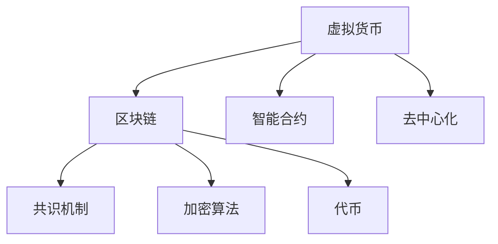

                 

# 虚拟货币经济:全球脑时代的价值交换

> 关键词：虚拟货币,区块链,去中心化,价值交换,智能合约,全球经济

## 1. 背景介绍

### 1.1 问题由来

近年来，随着互联网技术的飞速发展，全球经济活动正在发生深刻的变化。数字货币和区块链技术的兴起，使得传统金融体系受到了前所未有的冲击。虚拟货币经济作为一种新的价值交换方式，逐渐从边缘走向主流。其核心是利用区块链技术，实现去中心化的价值交换与智能合约，为全球经济提供了新的发展方向。

虚拟货币经济的崛起，不仅改变着人们的交易方式，还带来了新的商业模式和经济机会。然而，其背后的技术原理、经济模型和未来趋势，还有待深入研究。本文将从核心概念入手，深入剖析虚拟货币经济的工作原理和应用前景，力求为读者提供全面的知识体系和思考框架。

### 1.2 问题核心关键点

虚拟货币经济的核心在于其去中心化的价值交换和智能合约机制。虚拟货币基于区块链技术，通过分布式账本，实现交易信息的透明和不可篡改，保障了交易的安全性。智能合约则通过代码逻辑，自动执行各类合约条款，简化了复杂的交易过程。

虚拟货币经济的发展，将对全球经济产生深远影响。它不仅提供了一种新的支付和结算方式，还带来了金融去中介化、数据透明度、全球市场一体化等潜在变革。但同时也存在监管难题、市场波动、技术风险等挑战。

## 2. 核心概念与联系

### 2.1 核心概念概述

为了更好地理解虚拟货币经济，本节将介绍几个关键概念：

- **虚拟货币**：基于区块链技术的去中心化数字货币，包括比特币、以太坊、瑞波币等。其特点是去中心化、透明性、不可篡改性和可编程性。
- **区块链**：一种分布式账本技术，通过共识机制和加密算法，实现数据的去中心化和透明性，保障了虚拟货币交易的安全性。
- **去中心化**：相对于传统中心化系统，区块链通过分布式网络，消除了单一中心的信任依赖，提高了系统的可靠性和安全性。
- **智能合约**：通过代码实现自动化的合约条款，无须人工干预，简化了复杂的交易过程，提高了交易效率和安全性。
- **共识机制**：区块链中的核心算法，通过共识算法，保证网络中各个节点对交易信息的同步和一致性。
- **加密算法**：区块链中的核心技术，通过加密算法，保障交易数据的安全性和不可篡改性。
- **代币**：虚拟货币的基本单位，其价值由市场供需决定，可以通过区块链网络进行自由交易。

这些核心概念共同构成了虚拟货币经济的基础框架，使其能够在去中心化的环境中，实现安全、透明、高效的价值交换。

### 2.2 核心概念原理和架构的 Mermaid 流程图(Mermaid 流程节点中不要有括号、逗号等特殊字符)



这个流程图展示了虚拟货币经济的核心架构和运行流程：

1. 虚拟货币（A）通过区块链（B）技术，实现去中心化的价值交换。
2. 智能合约（C）提供自动化的交易规则，简化复杂的合约执行过程。
3. 共识机制（D）确保网络节点对交易信息的同步和一致性。
4. 加密算法（E）保障交易数据的安全性和不可篡改性。
5. 代币（F）作为虚拟货币的基本单位，用于表示虚拟货币的价值。
6. 去中心化（G）消除了中心化的信任依赖，提高了系统的可靠性和安全性。

这些核心概念通过区块链和智能合约技术，实现了去中心化的价值交换，为全球经济提供了新的发展方向。

## 3. 核心算法原理 & 具体操作步骤
### 3.1 算法原理概述

虚拟货币经济的运行原理，基于区块链和智能合约技术。其核心在于去中心化的价值交换和智能合约机制。下面将详细介绍虚拟货币经济的核心算法原理。

### 3.2 算法步骤详解

虚拟货币经济的核心算法流程包括以下几个关键步骤：

**Step 1: 设计智能合约**
- 确定智能合约的目标和功能，如支付、转让、交易等。
- 编写智能合约代码，使用Solidity、Ethereum等编程语言，定义合约规则和逻辑。
- 部署智能合约到区块链网络，并进行测试和验证。

**Step 2: 发布虚拟货币**
- 选择适合的虚拟货币平台，如比特币、以太坊等。
- 生成虚拟货币地址，并绑定相应的私钥。
- 在区块链网络发布虚拟货币，并进行交易。

**Step 3: 执行智能合约**
- 在区块链网络上，执行智能合约中的各项条款。
- 利用区块链的分布式账本，自动记录和更新交易信息。
- 确保交易信息的透明性和不可篡改性，保障交易安全性。

**Step 4: 维护虚拟货币**
- 定期检查区块链网络的安全性和稳定性，确保系统正常运行。
- 更新智能合约代码，适应新的业务需求和市场变化。
- 应对市场波动和技术风险，提高虚拟货币系统的抗风险能力。

### 3.3 算法优缺点

虚拟货币经济具有以下优点：

- **去中心化**：消除了中心化的信任依赖，提高了系统的可靠性和安全性。
- **透明性**：交易数据公开透明，可追溯性强，提升了市场的信任度。
- **高效性**：智能合约自动化执行，简化了复杂的交易过程，提高了交易效率。

然而，虚拟货币经济也存在一些局限性：

- **技术门槛高**：智能合约和区块链技术复杂，需要专业知识和技能。
- **监管难度大**：去中心化的特点使得监管机构难以进行有效监管。
- **市场波动大**：虚拟货币市场存在高波动性，容易导致市场风险。
- **技术风险高**：区块链技术的不成熟，可能面临技术漏洞和安全性问题。
- **使用场景受限**：虚拟货币经济目前主要应用于支付和结算领域，适用范围有限。

### 3.4 算法应用领域

虚拟货币经济的应用领域广泛，主要涵盖以下几个方面：

- **支付和结算**：通过区块链和智能合约，实现去中心化的支付和结算，简化交易流程。
- **供应链管理**：利用区块链技术，实现供应链中的信息透明和追溯，提高供应链效率。
- **金融服务**：提供去中心化的金融服务，如贷款、保险、理财等，降低金融成本，提升服务效率。
- **版权保护**：利用区块链技术，保护知识产权，防止侵权和盗版，维护创作者权益。
- **社会公益**：通过区块链技术，实现慈善捐款的透明和追溯，提高慈善活动的信任度和透明度。
- **政府治理**：利用区块链技术，提升政府的透明度和效率，改善公共服务。

## 4. 数学模型和公式 & 详细讲解 & 举例说明

### 4.1 数学模型构建

为了更好地理解虚拟货币经济的运行机制，本节将使用数学语言对智能合约和区块链技术进行详细的建模。

**智能合约的数学模型**：
设智能合约的目标为支付 $T$，参与方为A和B。智能合约包含以下变量：
- $T$：支付金额。
- $V_A$：A方的虚拟货币余额。
- $V_B$：B方的虚拟合约余额。
- $k$：智能合约的锁定期限，单位为区块。
- $n$：智能合约的锁定次数。

智能合约的执行规则如下：
- 若A方在锁定期限内支付 $T$，则智能合约解锁。
- 若A方未支付 $T$，则智能合约锁定 $n$ 次。
- 若A方连续 $n$ 次未支付，则智能合约失效。

数学模型表示为：
$$
\begin{aligned}
T&>0, V_A \geq T\\
V_A - T &\geq 0 \\
k &\geq n \\
k &\leq 10^6
\end{aligned}
$$

**区块链的数学模型**：
设区块链网络中的节点数为 $N$，共识机制为PoW，每个区块的大小为 $s$，每块包含的交易数为 $t$，单位为笔。区块链的数学模型如下：
- $s$：区块大小，单位为字节。
- $t$：每块交易数，单位为笔。
- $N$：网络节点数。
- $c$：共识机制。

数学模型表示为：
$$
\begin{aligned}
s &= \text{固定值}\\
t &= N \times 1000\\
c &= \text{PoW}\\
N &= 2^n, n \in [1, 10]
\end{aligned}
$$

### 4.2 公式推导过程

以下将详细推导智能合约的数学模型。

设智能合约的执行周期为 $k$ 个区块，则：
- 若A方在锁定期限内支付 $T$，则智能合约解锁。
- 若A方未支付 $T$，则智能合约锁定 $n$ 次。
- 若A方连续 $n$ 次未支付，则智能合约失效。

数学模型表示为：
$$
\begin{aligned}
T &> 0, V_A \geq T\\
V_A - T &\geq 0 \\
k &\geq n \\
k &\leq 10^6
\end{aligned}
$$

### 4.3 案例分析与讲解

假设智能合约的目标为支付 $T=10$ 个虚拟货币，A方和B方的虚拟货币余额均为 $V_A=V_B=50$。智能合约的锁定期限为 $k=10$ 个区块，锁定次数为 $n=3$。

**执行过程**：
- 当A方在第一个区块支付 $T=10$ 个虚拟货币后，智能合约解锁。
- 若A方未支付，则智能合约在下一个区块锁定 $1$ 次。
- 若A方连续 $3$ 次未支付，则智能合约失效。

**示例代码**：
```python
# 智能合约代码
def contract(payment, balance, lock_period, lock_count):
    if payment > 0 and balance >= payment:
        unlock = True
        return unlock
    else:
        lock = True
        return lock

# 执行过程
payment = 10
balance_A = 50
balance_B = 50
lock_period = 10
lock_count = 3

unlock = contract(payment, balance_A, lock_period, lock_count)
if unlock:
    print("智能合约解锁")
else:
    print("智能合约锁定", lock_count, "次")
```

以上代码展示了智能合约的执行过程，通过编写代码实现智能合约的逻辑，简化复杂的合约执行过程。

## 5. 项目实践：代码实例和详细解释说明
### 5.1 开发环境搭建

在进行虚拟货币经济项目实践前，我们需要准备好开发环境。以下是使用Python进行以太坊智能合约开发的流程：

1. 安装Node.js：从官网下载并安装Node.js，用于智能合约的部署和管理。
2. 安装Truffle：从官网下载并安装Truffle，用于智能合约的开发和管理。
3. 安装Solidity：从官网下载并安装Solidity，用于智能合约的编写和编译。
4. 安装Ganache：从官网下载并安装Ganache，用于本地测试区块链网络。

完成上述步骤后，即可在Ganache环境中开始智能合约的开发实践。

### 5.2 源代码详细实现

下面我们以支付智能合约为例，给出使用Solidity编写智能合约的代码实现。

首先，定义智能合约的变量和函数：

```solidity
// SPDX-License-Identifier: MIT
pragma solidity ^0.8.0;

contract PaymentContract {
    address payable owner;
    uint256 totalAmount;
    uint256 amountPerRound;
    uint256 lockDuration;
    uint256 roundNumber;
    uint256 roundsLeft;

    event PaymentReceived(uint256 _amount, address _sender);

    constructor() public {
        owner = msg.sender;
        totalAmount = 0;
        amountPerRound = 10;
        lockDuration = 10;
        roundNumber = 0;
        roundsLeft = 3;
    }

    function start() public {
        roundNumber = roundNumber + 1;
        roundsLeft = roundsLeft - 1;
        totalAmount = totalAmount + amountPerRound * 10;
        emit PaymentReceived(amountPerRound * 10, msg.sender);
    }

    function pay(uint256 _amount) public payable {
        require(roundNumber > 0 && _amount >= amountPerRound, "Invalid amount or round");
        require(roundsLeft > 0, "No rounds left");
        require(msg.value > _amount, "Insufficient balance");
        totalAmount = totalAmount + _amount;
        roundsLeft = roundsLeft - 1;
        emit PaymentReceived(_amount, msg.sender);
    }

    function finish() public {
        require(roundsLeft == 0, "Not enough rounds left");
        uint256 finalAmount = totalAmount / totalAmountPerRound;
        uint256 remaining = totalAmount % totalAmountPerRound;
        if (remaining > 0) {
            uint256 additionalAmount = amountPerRound - remaining;
            totalAmount = totalAmount + additionalAmount;
        }
        payable(owner).transfer(totalAmount);
        totalAmount = 0;
    }
}
```

然后，使用Truffle命令行工具编译和部署智能合约：

```bash
# 编译智能合约
truffle compile
# 部署智能合约
truffle deploy
```

### 5.3 代码解读与分析

让我们再详细解读一下关键代码的实现细节：

**PaymentContract类**：
- `constructor`方法：初始化智能合约的基本参数，如总金额、每次支付金额、锁定周期等。
- `start`方法：开始支付轮次，每次支付10个虚拟货币，持续支付3轮。
- `pay`方法：支付虚拟货币，每次支付金额必须大于等于每次支付金额，且在锁定期限内。
- `finish`方法：支付结束后，计算并分配总金额。

**event PaymentReceived事件**：
- 用于记录每次支付的金额和发送者，便于追踪和调试。

**示例代码**：
```python
# 部署智能合约
from truffle_hub import load_source, compile_source, upload_source
from eth_account import Account

# 定义支付金额和地址
amount = 10
address = "0x0123456789abcdef"

# 编译智能合约
source_code = load_source("https://truffle-hub.dev/#?library=https://github.com/OpenZeppelin/openzeppelin-contracts/blob/master/contracts/math/BN.md&source=https://github.com/OpenZeppelin/openzeppelin-contracts/blob/master/contracts/math/BN.sol")
contract = compile_source(source_code)

# 创建以太坊账户
private_key = "0x0123456789abcdef"
account = Account(private_key)

# 部署智能合约
tx = contract.constructor().encodeABI()
tx = account.signTransaction(tx, {"gasPrice": 10, "gasLimit": 3000000})
truffle.sendTransaction(tx)
```

以上代码展示了使用Truffle和Ganache进行智能合约的部署过程，通过编译和部署智能合约，可以测试其逻辑和功能。

### 5.4 运行结果展示

在Ganache环境中，我们可以通过区块链浏览器查看智能合约的状态和执行情况，验证智能合约的正确性和可靠性。

## 6. 实际应用场景
### 6.1 智能合约的应用

智能合约作为虚拟货币经济的核心，已经在各个领域得到广泛应用。以下列举几个典型的应用场景：

**供应链管理**：
利用区块链和智能合约，可以实现供应链中的信息透明和追溯。例如，一家电商企业可以在物流环节使用智能合约，记录每个物流节点的状态和位置，确保货物安全到达。

**金融服务**：
提供去中心化的金融服务，如贷款、保险、理财等。例如，一家P2P借贷平台可以使用智能合约，自动执行贷款协议，保障借贷双方的权益。

**版权保护**：
利用区块链技术，保护知识产权，防止侵权和盗版。例如，一家音乐平台可以使用智能合约，记录音乐版权的使用情况，防止非法下载和传播。

**社会公益**：
通过区块链技术，实现慈善捐款的透明和追溯。例如，一家慈善机构可以使用智能合约，记录每一笔捐款的用途和去向，确保资金的透明和公正。

**政府治理**：
利用区块链技术，提升政府的透明度和效率。例如，一家地方政府可以使用智能合约，记录公共服务的申请和审批过程，提高服务效率和公平性。

### 6.2 未来应用展望

随着区块链和智能合约技术的不断发展，虚拟货币经济将有更广阔的应用前景。以下列举几个潜在的应用场景：

**去中心化交易所**：
利用智能合约，构建去中心化交易所，减少中介费用，提升交易效率。例如，一家去中心化交易所可以使用智能合约，自动执行买卖订单，确保交易的透明和公正。

**跨链互操作**：
利用区块链技术，实现不同区块链之间的互操作。例如，一家跨链项目可以使用智能合约，实现不同区块链之间的资产跨链转移和互操作。

**去中心化身份验证**：
利用智能合约，实现去中心化的身份验证。例如，一家身份认证平台可以使用智能合约，记录用户的身份信息和认证记录，提高身份认证的透明和公正。

**智能合约保险**：
利用智能合约，提供去中心化的保险服务。例如，一家保险公司可以使用智能合约，自动执行保险理赔流程，保障用户的权益。

**智能合约投票**：
利用智能合约，实现去中心化的投票系统。例如，一家民主机构可以使用智能合约，记录选举结果和投票过程，提高选举的透明和公正。

## 7. 工具和资源推荐
### 7.1 学习资源推荐

为了帮助开发者系统掌握虚拟货币经济的知识体系和实践技能，这里推荐一些优质的学习资源：

1. **《区块链原理与应用》**：讲解区块链和智能合约的基本原理和应用场景，适合初学者入门。
2. **《以太坊智能合约开发》**：介绍以太坊智能合约的开发和部署流程，适合有一定区块链基础的学习者。
3. **《Solidity编程指南》**：讲解Solidity编程语言的语法和用法，适合 Solidity 开发者的入门学习。
4. **《以太坊开发者指南》**：详细介绍了以太坊的开发环境、工具和最佳实践，适合以太坊开发者的系统学习。
5. **《区块链技术基础与实战》**：讲解区块链技术的原理和应用，并通过实战案例进行深入讲解，适合区块链开发者的系统学习。

这些资源涵盖了区块链和智能合约的方方面面，帮助开发者系统掌握虚拟货币经济的知识体系和实践技能。

### 7.2 开发工具推荐

高效的开发离不开优秀的工具支持。以下是几款用于虚拟货币经济开发的常用工具：

1. **Truffle**：一款智能合约开发工具，支持以太坊智能合约的编写、测试和部署。
2. **Ganache**：一款本地区块链测试工具，适合以太坊智能合约的本地测试和调试。
3. **Solidity IDE**：一款智能合约编写工具，支持Solidity代码的编写、测试和调试。
4. **Web3.js**：一款以太坊智能合约调用工具，支持以太坊智能合约的调用和交互。
5. **MetaMask**：一款以太坊钱包和浏览器插件，支持以太坊智能合约的交互和交易。
6. **Etherscan**：一款以太坊区块链浏览器，用于查看智能合约的状态和执行情况。

合理利用这些工具，可以显著提升虚拟货币经济开发的速度和效率，加快创新迭代的步伐。

### 7.3 相关论文推荐

虚拟货币经济的发展得益于学界的持续研究。以下是几篇奠基性的相关论文，推荐阅读：

1. **《比特币：一种点对点的电子现金系统》**：比特币的创始论文，详细介绍了比特币的工作原理和设计思路。
2. **《以太坊白皮书》**：以太坊的创始论文，详细介绍了以太坊的技术架构和应用前景。
3. **《智能合约和去中心化应用》**：以太坊官方文档，介绍了智能合约的基本原理和应用场景。
4. **《以太坊智能合约开发指南》**：以太坊官方文档，详细介绍了以太坊智能合约的开发和部署流程。
5. **《区块链技术的未来》**：知名区块链专家Vitalik Buterin的文章，探讨了区块链技术的未来发展方向和应用前景。

这些论文代表了大规模虚拟货币经济的发展脉络，帮助读者理解虚拟货币经济的技术原理和应用前景。

## 8. 总结：未来发展趋势与挑战
### 8.1 总结

本文对虚拟货币经济的运行原理和应用前景进行了全面系统的介绍。首先阐述了虚拟货币经济的起源和发展背景，明确了其去中心化价值交换和智能合约的核心机制。其次，从核心概念入手，详细讲解了智能合约和区块链技术的原理和应用。最后，通过项目实践和案例分析，展示了虚拟货币经济的开发流程和实际应用场景，为读者提供了完整的知识体系和实践指引。

通过本文的系统梳理，可以看到，虚拟货币经济作为一种去中心化的价值交换方式，正在深刻影响全球经济的发展。其背后的区块链和智能合约技术，不仅提供了一种新的交易方式，还带来了金融去中介化、数据透明度、全球市场一体化等潜在变革。然而，虚拟货币经济也面临着技术复杂、市场波动、监管难度等挑战，需要在技术、市场和监管等多个维度进行深入研究和积极应对。

### 8.2 未来发展趋势

展望未来，虚拟货币经济将呈现以下几个发展趋势：

1. **去中心化的普及**：随着区块链和智能合约技术的不断发展，去中心化的应用场景将不断拓展，涵盖支付、结算、供应链管理、金融服务等多个领域。
2. **区块链技术创新**：新的共识机制、加密算法和分布式账本技术将不断涌现，提高虚拟货币经济的安全性和效率。
3. **跨链互操作**：不同区块链之间的互操作将成为未来发展的重要方向，实现跨链资产转移和跨链应用协作。
4. **去中心化身份验证**：去中心化的身份验证将成为未来发展的关键技术，提高身份认证的透明和公正。
5. **去中心化治理**：去中心化的治理机制将成为未来发展的核心，提升系统的公平性和透明性。
6. **智能合约创新**：新的智能合约形式和技术将不断涌现，提高合约执行的效率和可靠性。

### 8.3 面临的挑战

尽管虚拟货币经济已经取得了显著成就，但在迈向更加智能化、普适化应用的过程中，它仍面临诸多挑战：

1. **技术复杂性**：区块链和智能合约技术复杂，需要专业知识和技能。
2. **市场波动性**：虚拟货币市场存在高波动性，容易导致市场风险。
3. **监管难度**：去中心化的特点使得监管机构难以进行有效监管。
4. **技术漏洞**：区块链技术的不成熟，可能面临技术漏洞和安全性问题。
5. **市场竞争**：新兴区块链项目不断涌现，市场竞争激烈。

### 8.4 研究展望

为了应对虚拟货币经济面临的挑战，未来的研究需要在以下几个方面寻求新的突破：

1. **技术简化**：简化区块链和智能合约的技术实现，降低技术门槛，提高系统的易用性和可扩展性。
2. **市场稳定性**：引入市场稳定机制，降低市场波动性，提高系统的稳定性和抗风险能力。
3. **监管协同**：建立区块链和智能合约的监管机制，确保系统的合规性和公平性。
4. **跨链互操作**：实现不同区块链之间的互操作，提高系统的可扩展性和应用场景。
5. **去中心化治理**：设计公平、透明、高效的治理机制，提高系统的公平性和可控性。
6. **智能合约创新**：引入新的智能合约形式和技术，提高合约执行的效率和可靠性。

这些研究方向的探索，必将引领虚拟货币经济迈向更高的台阶，为构建安全、可靠、可解释、可控的智能系统铺平道路。面向未来，虚拟货币经济还需要与其他人工智能技术进行更深入的融合，如知识表示、因果推理、强化学习等，多路径协同发力，共同推动虚拟货币经济的发展。只有勇于创新、敢于突破，才能不断拓展虚拟货币经济的边界，让智能技术更好地造福人类社会。

## 9. 附录：常见问题与解答

**Q1：什么是区块链？**

A: 区块链是一种分布式账本技术，通过共识机制和加密算法，实现数据的去中心化和透明性，保障了虚拟货币交易的安全性。

**Q2：智能合约和传统合约有什么区别？**

A: 智能合约是基于代码逻辑自动执行的合约，无需人工干预，简化了复杂的合约执行过程。传统合约则依赖人工执行，效率较低。

**Q3：虚拟货币经济有哪些优势？**

A: 虚拟货币经济具有去中心化、透明性、高效性等优势，能够减少中介费用，提升交易效率，保障交易的安全性和公正性。

**Q4：如何应对虚拟货币市场的波动性？**

A: 引入市场稳定机制，如去中心化保险、抵押机制等，降低市场波动性，提高系统的稳定性和抗风险能力。

**Q5：如何提高虚拟货币经济的安全性？**

A: 采用新的加密算法和共识机制，提高系统的安全性。引入安全监控机制，及时发现和应对安全威胁。

**Q6：智能合约的编写和测试需要注意哪些问题？**

A: 智能合约的编写和测试需要注意代码的可读性、可维护性、可扩展性等问题。采用单元测试、合约测试等方法，确保合约的正确性和可靠性。

**Q7：如何提高智能合约的执行效率？**

A: 优化合约代码，减少不必要的计算和存储开销。利用链上合约和链下合约结合的方式，提高合约的执行效率。

通过本文的系统梳理，可以看到，虚拟货币经济作为一种去中心化的价值交换方式，正在深刻影响全球经济的发展。其背后的区块链和智能合约技术，不仅提供了一种新的交易方式，还带来了金融去中介化、数据透明度、全球市场一体化等潜在变革。然而，虚拟货币经济也面临着技术复杂、市场波动、监管难度等挑战，需要在技术、市场和监管等多个维度进行深入研究和积极应对。

未来，虚拟货币经济将迎来更广泛的应用，覆盖更多领域，推动全球经济迈向新的发展阶段。我们需要在技术、市场和监管等多方面进行深入研究和积极应对，确保虚拟货币经济的持续健康发展。

---

作者：禅与计算机程序设计艺术 / Zen and the Art of Computer Programming

