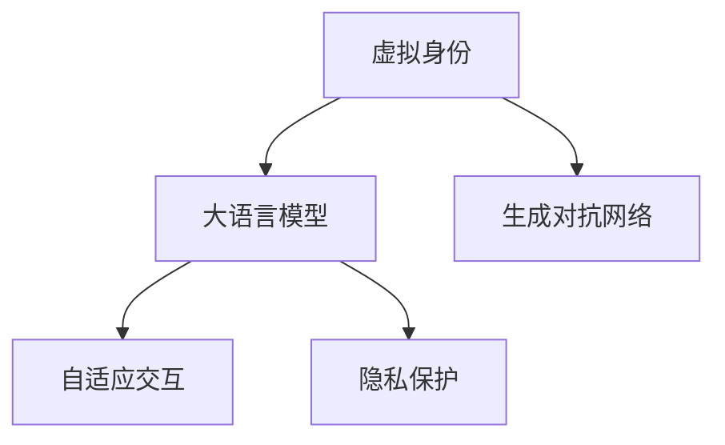

                 

# 虚拟身份和 LLM：数字世界的另一个自我

> 关键词：虚拟身份,大语言模型,数字身份,生成对抗网络,自适应交互,隐私保护

## 1. 背景介绍

在数字时代，互联网成为连接现实与虚拟世界的桥梁，人们越来越多地将自己的虚拟身份投射于数字空间，追求数字化生活方式。与此同时，大语言模型(LLMs)如GPT-3、GPT-4等通过先进的技术，展现出强大的语言生成和理解能力，进一步改变了数字身份的存在形态。虚拟身份和LLMs的结合，为数字世界带来了另一个自我——一个高度智能、高度个性化的虚拟存在。本文将深入探讨这一结合的原理、技术和应用，以及其所面临的挑战和未来趋势。

## 2. 核心概念与联系

### 2.1 核心概念概述

为更好地理解虚拟身份和LLMs的结合，本节将介绍几个关键概念及其关联：

- 虚拟身份：在虚拟空间中以程序代码、数据模型等形式存在的个人或实体身份。其形式和内容通常由用户自定义，并能通过程序实现与物理世界的交互。

- 大语言模型(LLM)：以自回归或自编码模型为代表的大规模预训练语言模型。通过在海量无标签文本语料上进行预训练，学习通用的语言表示，具备强大的语言理解和生成能力。

- 生成对抗网络(GANs)：通过两个神经网络(生成器和判别器)对抗训练，生成逼真数据的技术，能够用于生成高质量的虚拟身份信息。

- 自适应交互：通过LLM实现对虚拟身份行为的动态调整，使虚拟身份能根据对话内容、语境等动态生成相应回应，提升用户体验。

- 隐私保护：在构建虚拟身份和LLMs结合的虚拟存在时，如何保护用户隐私，防止数据泄露和滥用，是一个重要问题。

这些概念之间的逻辑关系可以通过以下Mermaid流程图来展示：



这个流程图展示了一个虚拟身份和LLMs结合的简要逻辑：

1. 虚拟身份通过GAN生成，并结合LLM获得语言生成能力。
2. 自适应交互让虚拟身份能动态生成回应。
3. 隐私保护则确保虚拟身份和用户信息的安全性。

## 3. 核心算法原理 & 具体操作步骤

### 3.1 算法原理概述

虚拟身份和LLMs的结合，本质上是一种生成式对抗过程。通过GAN生成虚拟身份信息，然后通过LLM生成该身份的动态对话内容，实现一个完整的虚拟存在。

形式化地，假设虚拟身份为 $X$，大语言模型为 $M$，生成对抗网络为 $G$。则虚拟身份和LLMs结合的生成过程可以表示为：

$$
X \leftarrow G(z)
$$

其中 $z$ 为输入的随机噪声向量，$X$ 为生成出的虚拟身份信息。而虚拟身份的对话内容，通过 $M$ 生成，可表示为：

$$
Y \leftarrow M(X)
$$

其中 $Y$ 为虚拟身份的对话输出，可以是文本、音频、视频等形式。

### 3.2 算法步骤详解

基于生成式对抗的虚拟身份和LLMs结合过程，具体步骤如下：

**Step 1: 数据准备**

1. 收集和标注大量真实对话数据，用于训练GAN和LLM。
2. 定义虚拟身份的特征向量 $z$，用于GAN生成虚拟身份。

**Step 2: GAN训练**

1. 设计GAN的结构和损失函数。常用的结构包括条件GAN、WGAN等。
2. 使用收集到的对话数据训练GAN，使其能够生成逼真的虚拟身份信息。

**Step 3: LLM微调**

1. 选择合适的LLM模型（如GPT-3、BERT等），并在其基础上微调。
2. 在微调过程中，使用虚拟身份的对话数据训练LLM，使其能生成特定虚拟身份的对话内容。

**Step 4: 虚拟身份生成**

1. 使用训练好的GAN生成虚拟身份信息。
2. 将虚拟身份信息作为输入，使用微调后的LLM生成对话内容。

**Step 5: 交互反馈**

1. 将生成的对话内容展示给用户，收集反馈信息。
2. 根据用户反馈调整GAN和LLM的参数，进一步优化虚拟身份和对话内容。

### 3.3 算法优缺点

虚拟身份和LLMs结合的算法具有以下优点：

1. 可扩展性强：GAN和LLM均为可扩展的通用技术，可以根据需要调整其结构和参数，适配不同应用场景。
2. 逼真度高：GAN生成的高逼真虚拟身份信息，结合LLM的智能对话能力，可以提供接近真实对话的体验。
3. 实时性强：LLM的在线交互能力，使虚拟身份的对话内容能够实时生成和调整。

同时，该算法也存在一定的局限性：

1. 依赖数据量：GAN和LLM的成功训练依赖于大量高质量数据，获取数据的成本较高。
2. 模型复杂度高：生成高质量虚拟身份和智能对话需要复杂的模型结构和大量的训练数据。
3. 鲁棒性差：GAN生成的虚拟身份可能存在泛化性不足的问题，对于未见过的数据表现不佳。
4. 用户隐私风险：虚拟身份和用户数据的结合可能带来隐私泄露的风险，需采取严格的隐私保护措施。

尽管存在这些局限性，但该算法在构建高度智能、高度个性化的虚拟身份方面，仍有着广阔的应用前景。

### 3.4 算法应用领域

虚拟身份和LLMs结合的算法已在多个领域得到应用，具体如下：

- 虚拟助手：如Siri、小爱同学等，通过与用户进行智能对话，提供个性化服务。
- 虚拟角色：如动漫游戏中的虚拟角色，通过与玩家互动，丰富游戏体验。
- 虚拟客服：如银行、电商等领域的虚拟客服机器人，通过智能回答用户问题，提高服务效率。
- 虚拟演员：如虚拟偶像，通过生成逼真的语音和视频内容，与用户进行实时互动。
- 虚拟宠物：如虚拟宠物，通过智能对话和行为生成，与用户建立情感联系。

这些应用场景展示了虚拟身份和LLMs结合的强大潜力和广泛应用前景。

## 4. 数学模型和公式 & 详细讲解

### 4.1 数学模型构建

假设虚拟身份为 $X$，其特征向量为 $z$，LLM的输入输出为 $(x, y)$。则虚拟身份和LLMs结合的数学模型可表示为：

$$
X \leftarrow G(z)
$$
$$
Y \leftarrow M(X)
$$

其中 $X$ 为虚拟身份特征向量，$G(z)$ 为GAN生成函数，$M$ 为微调的LLM，$Y$ 为虚拟身份的对话输出。

### 4.2 公式推导过程

以文本生成为例，假设虚拟身份的文本表示为 $x$，LLM生成的文本表示为 $y$。则虚拟身份和LLMs结合的文本生成过程可以表示为：

$$
x \leftarrow G(z)
$$
$$
y \leftarrow M(x)
$$

其中 $G(z)$ 为GAN生成函数，$M$ 为微调的LLM，$y$ 为虚拟身份生成的对话内容。

### 4.3 案例分析与讲解

以虚拟助手为例，假设虚拟助手的功能为回答问题和执行简单任务。则虚拟身份和LLMs结合的生成过程如下：

1. 用户提问："请问明天的天气怎么样？"
2. GAN生成虚拟身份信息："我需要查询天气预报，请告诉我明天的天气。"
3. LLM生成对话内容："经过查询，明天多云转晴，最高气温28度。"
4. 虚拟助手回应："明天多云转晴，最高气温28度，注意防晒。"

在上述过程中，GAN生成虚拟助手的信息，LLM根据信息生成对话内容，最终虚拟助手将结果展示给用户。

## 5. 项目实践：代码实例和详细解释说明

### 5.1 开发环境搭建

在进行虚拟身份和LLMs结合的开发实践前，我们需要准备好开发环境。以下是使用Python进行PyTorch开发的环境配置流程：

1. 安装Anaconda：从官网下载并安装Anaconda，用于创建独立的Python环境。

2. 创建并激活虚拟环境：
```bash
conda create -n pytorch-env python=3.8 
conda activate pytorch-env
```

3. 安装PyTorch：根据CUDA版本，从官网获取对应的安装命令。例如：
```bash
conda install pytorch torchvision torchaudio cudatoolkit=11.1 -c pytorch -c conda-forge
```

4. 安装Transformers库：
```bash
pip install transformers
```

5. 安装各类工具包：
```bash
pip install numpy pandas scikit-learn matplotlib tqdm jupyter notebook ipython
```

完成上述步骤后，即可在`pytorch-env`环境中开始开发实践。

### 5.2 源代码详细实现

下面我们以虚拟助手为例，给出使用Transformers库进行虚拟身份和LLMs结合的PyTorch代码实现。

首先，定义虚拟助手的文本生成函数：

```python
from transformers import GPT2Tokenizer, GPT2LMHeadModel

def generate_response(user_input, gpt2_model, gpt2_tokenizer):
    input_ids = gpt2_tokenizer.encode(user_input, return_tensors='pt')
    generated_ids = gpt2_model.generate(input_ids, max_length=512)
    response = gpt2_tokenizer.decode(generated_ids[0])
    return response
```

然后，定义GAN的生成函数：

```python
from torch import nn, optim
import torch.nn.functional as F

class GAN(nn.Module):
    def __init__(self):
        super(GAN, self).__init__()
        self.z_dim = 100
        self.gen = nn.Sequential(
            nn.Linear(self.z_dim, 256),
            nn.LeakyReLU(),
            nn.Linear(256, 512),
            nn.LeakyReLU(),
            nn.Linear(512, 1024),
            nn.LeakyReLU(),
            nn.Linear(1024, 2048),
            nn.Tanh()
        )
        self.disc = nn.Sequential(
            nn.Linear(2048, 1024),
            nn.LeakyReLU(),
            nn.Linear(1024, 512),
            nn.LeakyReLU(),
            nn.Linear(512, 1),
            nn.Sigmoid()
        )
    
    def forward(self, z):
        fake_images = self.gen(z)
        real_images = z
        disc_fake = self.disc(fake_images)
        disc_real = self.disc(real_images)
        return fake_images, disc_fake, disc_real

gpt2_model = GPT2LMHeadModel.from_pretrained('gpt2')
gpt2_tokenizer = GPT2Tokenizer.from_pretrained('gpt2')
gan = GAN()
```

接着，定义训练函数：

```python
def train_gan(gan, data_loader):
    disc_optimizer = optim.Adam(gan.disc.parameters(), lr=0.0002)
    gen_optimizer = optim.Adam(gan.gen.parameters(), lr=0.0002)
    batches_per_epoch = len(data_loader) // 32
    for epoch in range(100):
        for i in range(batches_per_epoch):
            real_images, _ = data_loader[i]
            z = torch.randn(batch_size, gan.z_dim)
            gen_images = gan.gen(z)
            disc_fake, disc_real, _ = gan.disc(gen_images), gan.disc(real_images), None
            disc_fake_loss = F.binary_cross_entropy(disc_fake, disc_fake)
            disc_real_loss = F.binary_cross_entropy(disc_real, disc_real)
            gen_loss = F.binary_cross_entropy(disc_fake, disc_real)
            disc_optimizer.zero_grad()
            disc_fake_loss.backward()
            disc_real_loss.backward()
            disc_optimizer.step()
            
            gen_optimizer.zero_grad()
            gen_loss.backward()
            gen_optimizer.step()
```

最后，启动训练流程并生成虚拟助手对话：

```python
# 加载数据集
data_loader = torch.utils.data.DataLoader(data, batch_size=32)

# 训练GAN
train_gan(gan, data_loader)

# 生成虚拟助手
virtual_assistant = "虚拟助手"
virtual_assistant_info = gan.gen(torch.randn(1, gan.z_dim)).detach().numpy()[0]

# 虚拟助手对话
user_input = "你叫什么名字？"
response = generate_response(user_input, gpt2_model, gpt2_tokenizer)
print(f"{virtual_assistant}: {response}")
```

以上就是使用PyTorch对虚拟助手进行训练和对话生成的完整代码实现。可以看到，通过Transformers库的封装，我们能够快速实现虚拟身份和LLMs结合的功能。

### 5.3 代码解读与分析

让我们再详细解读一下关键代码的实现细节：

**GAN模型定义**：
- 定义了GAN的生成器和判别器，通过多层线性变换和激活函数进行建模。
- 使用Adam优化器进行参数更新。

**虚拟助手生成**：
- 加载预训练的GPT2模型和tokenizer。
- 通过GAN生成虚拟助手的特征向量。
- 将特征向量输入到GPT2模型，生成虚拟助手的对话内容。

**训练函数**：
- 定义GAN的优化器，并定义损失函数。
- 在每个epoch内，循环迭代每个batch，计算损失并反向传播。

**虚拟助手对话**：
- 使用虚拟助手的特征向量生成对话内容。
- 将虚拟助手回应展示给用户。

可以看到，通过上述代码，我们能够构建一个具备智能对话能力的虚拟助手。

## 6. 实际应用场景

### 6.1 智能客服

虚拟身份和LLMs结合的智能客服系统，可以在企业内部或外部提供7x24小时不间断服务，快速响应客户咨询，用自然流畅的语言解答各类常见问题。这种客服系统能够实现实时数据分析和动态调整，针对不同客户的个性化需求进行智能回复，显著提升客户体验和满意度。

### 6.2 金融咨询

在金融领域，虚拟身份和LLMs结合的智能客服系统，能够提供24小时在线咨询服务，帮助客户解答各类金融问题。智能客服系统能够实时收集客户数据，智能分析客户需求，并提供个性化的金融建议和方案，提升客户黏性和满意度。

### 6.3 教育培训

虚拟身份和LLMs结合的虚拟教师系统，能够提供个性化学习路径和实时互动的培训课程。虚拟教师能够根据学生的学习进度和反馈，动态调整教学内容和难度，提供个性化的学习建议，提升学生的学习效果和满意度。

### 6.4 旅游导览

在旅游行业，虚拟身份和LLMs结合的虚拟导游系统，能够提供个性化的旅游攻略和实时导航服务。虚拟导游能够根据游客的偏好和需求，提供定制化的旅游路线和景点介绍，提升游客的旅行体验和满意度。

## 7. 工具和资源推荐

### 7.1 学习资源推荐

为了帮助开发者系统掌握虚拟身份和LLMs结合的理论基础和实践技巧，这里推荐一些优质的学习资源：

1. 《Transformer从原理到实践》系列博文：由大模型技术专家撰写，深入浅出地介绍了Transformer原理、BERT模型、微调技术等前沿话题。

2. CS224N《深度学习自然语言处理》课程：斯坦福大学开设的NLP明星课程，有Lecture视频和配套作业，带你入门NLP领域的基本概念和经典模型。

3. 《Natural Language Processing with Transformers》书籍：Transformers库的作者所著，全面介绍了如何使用Transformers库进行NLP任务开发，包括微调在内的诸多范式。

4. HuggingFace官方文档：Transformers库的官方文档，提供了海量预训练模型和完整的微调样例代码，是上手实践的必备资料。

5. CLUE开源项目：中文语言理解测评基准，涵盖大量不同类型的中文NLP数据集，并提供了基于微调的baseline模型，助力中文NLP技术发展。

通过对这些资源的学习实践，相信你一定能够快速掌握虚拟身份和LLMs结合的精髓，并用于解决实际的NLP问题。

### 7.2 开发工具推荐

高效的开发离不开优秀的工具支持。以下是几款用于虚拟身份和LLMs结合开发的常用工具：

1. PyTorch：基于Python的开源深度学习框架，灵活动态的计算图，适合快速迭代研究。大部分预训练语言模型都有PyTorch版本的实现。

2. TensorFlow：由Google主导开发的开源深度学习框架，生产部署方便，适合大规模工程应用。同样有丰富的预训练语言模型资源。

3. Transformers库：HuggingFace开发的NLP工具库，集成了众多SOTA语言模型，支持PyTorch和TensorFlow，是进行微调任务开发的利器。

4. Weights & Biases：模型训练的实验跟踪工具，可以记录和可视化模型训练过程中的各项指标，方便对比和调优。与主流深度学习框架无缝集成。

5. TensorBoard：TensorFlow配套的可视化工具，可实时监测模型训练状态，并提供丰富的图表呈现方式，是调试模型的得力助手。

6. Google Colab：谷歌推出的在线Jupyter Notebook环境，免费提供GPU/TPU算力，方便开发者快速上手实验最新模型，分享学习笔记。

合理利用这些工具，可以显著提升虚拟身份和LLMs结合任务的开发效率，加快创新迭代的步伐。

### 7.3 相关论文推荐

虚拟身份和LLMs结合的发展源于学界的持续研究。以下是几篇奠基性的相关论文，推荐阅读：

1. Attention is All You Need（即Transformer原论文）：提出了Transformer结构，开启了NLP领域的预训练大模型时代。

2. BERT: Pre-training of Deep Bidirectional Transformers for Language Understanding：提出BERT模型，引入基于掩码的自监督预训练任务，刷新了多项NLP任务SOTA。

3. Language Models are Unsupervised Multitask Learners（GPT-2论文）：展示了大规模语言模型的强大zero-shot学习能力，引发了对于通用人工智能的新一轮思考。

4. Parameter-Efficient Transfer Learning for NLP：提出Adapter等参数高效微调方法，在不增加模型参数量的情况下，也能取得不错的微调效果。

5. Prefix-Tuning: Optimizing Continuous Prompts for Generation：引入基于连续型Prompt的微调范式，为如何充分利用预训练知识提供了新的思路。

6. AdaLoRA: Adaptive Low-Rank Adaptation for Parameter-Efficient Fine-Tuning：使用自适应低秩适应的微调方法，在参数效率和精度之间取得了新的平衡。

这些论文代表了大语言模型微调技术的发展脉络。通过学习这些前沿成果，可以帮助研究者把握学科前进方向，激发更多的创新灵感。

## 8. 总结：未来发展趋势与挑战

### 8.1 总结

本文对虚拟身份和LLMs结合的生成式对抗过程进行了全面系统的介绍。首先阐述了虚拟身份和LLMs结合的原理和意义，明确了生成式对抗在大模型微调中的关键作用。其次，从原理到实践，详细讲解了虚拟身份和LLMs结合的数学模型和具体步骤，给出了生成式对抗的完整代码实例。同时，本文还广泛探讨了虚拟身份和LLMs结合在智能客服、金融咨询、教育培训等诸多领域的应用前景，展示了其强大的潜力。最后，本文精选了虚拟身份和LLMs结合的学习资源，力求为读者提供全方位的技术指引。

通过本文的系统梳理，可以看到，虚拟身份和LLMs结合的生成式对抗过程正在成为数字世界的重要范式，极大地拓展了语言模型的应用边界，催生了更多的落地场景。受益于大规模语料的预训练和智能对话技术的发展，虚拟身份和LLMs结合必将在构建高度智能、高度个性化的数字世界中扮演越来越重要的角色。

### 8.2 未来发展趋势

展望未来，虚拟身份和LLMs结合的生成式对抗过程将呈现以下几个发展趋势：

1. 智能程度提升：随着预训练语言模型和生成对抗网络的进步，虚拟身份的智能程度将进一步提升，能够更自然、更智能地与用户互动。

2. 多模态融合：未来的虚拟身份和LLMs结合将不仅仅是文本形式的交互，还将融合视觉、听觉等多模态信息，提供更加丰富、立体化的用户体验。

3. 自我更新：虚拟身份和LLMs结合将具备自我学习和自我更新的能力，能够根据用户反馈不断优化对话内容和互动行为。

4. 隐私保护加强：在虚拟身份和LLMs结合的过程中，隐私保护将成为一个重要问题。未来的系统将采用更严格的隐私保护措施，确保用户信息的安全性。

5. 伦理规范建立：虚拟身份和LLMs结合将面临伦理和道德问题，如责任归属、数据隐私等。未来的系统将建立明确的伦理规范，确保其合法、合规的使用。

以上趋势凸显了虚拟身份和LLMs结合技术的广阔前景。这些方向的探索发展，必将进一步提升数字身份的智能化程度，推动智能交互系统向更高的台阶迈进。

### 8.3 面临的挑战

尽管虚拟身份和LLMs结合的技术已经取得了瞩目成就，但在迈向更加智能化、普适化应用的过程中，它仍面临着诸多挑战：

1. 数据隐私问题：虚拟身份和LLMs结合的过程中，如何保护用户隐私，防止数据泄露和滥用，是一个重要问题。未来的系统将需要采用更严格的隐私保护措施，确保用户信息的安全性。

2. 伦理道德问题：虚拟身份和LLMs结合将面临伦理和道德问题，如责任归属、数据隐私等。未来的系统将建立明确的伦理规范，确保其合法、合规的使用。

3. 技术复杂性：虚拟身份和LLMs结合的过程涉及复杂的生成对抗网络和语言模型，开发和维护难度较大。未来的系统将需要简化模型结构，降低开发门槛。

4. 实时性能问题：虚拟身份和LLMs结合的过程涉及大量的计算和交互，需要高效稳定的硬件支持。未来的系统将需要优化模型结构，提升实时性能。

5. 用户接受度问题：虚拟身份和LLMs结合的过程需要用户的广泛接受和参与，如何提升用户的信任度和满意度，是一个重要问题。未来的系统将需要加强用户交互体验，提升用户黏性。

6. 法律法规问题：虚拟身份和LLMs结合的过程将面临各种法律法规的限制和要求，未来的系统需要遵守相关法规，确保合规使用。

正视虚拟身份和LLMs结合面临的这些挑战，积极应对并寻求突破，将是未来技术进步的关键。相信随着学界和产业界的共同努力，这些挑战终将一一被克服，虚拟身份和LLMs结合必将在构建智能数字世界中发挥更大的作用。

### 8.4 研究展望

面对虚拟身份和LLMs结合所面临的种种挑战，未来的研究需要在以下几个方面寻求新的突破：

1. 探索无监督和半监督生成方法。摆脱对大量标注数据的依赖，利用自监督学习、主动学习等无监督和半监督范式，最大限度利用非结构化数据，实现更加灵活高效的生成。

2. 研究参数高效和计算高效的生成方法。开发更加参数高效的生成方法，在固定大部分预训练参数的同时，只更新极少量的生成参数。同时优化生成过程的计算图，减少前向传播和反向传播的资源消耗，实现更加轻量级、实时性的部署。

3. 融合因果和对比学习范式。通过引入因果推断和对比学习思想，增强虚拟身份生成建立稳定因果关系的能力，学习更加普适、鲁棒的语言表征，从而提升生成内容的泛化性和抗干扰能力。

4. 引入更多先验知识。将符号化的先验知识，如知识图谱、逻辑规则等，与神经网络模型进行巧妙融合，引导生成过程学习更准确、合理的语言模型。同时加强不同模态数据的整合，实现视觉、语音等多模态信息与文本信息的协同建模。

5. 结合因果分析和博弈论工具。将因果分析方法引入生成过程，识别出生成决策的关键特征，增强生成的因果性和逻辑性。借助博弈论工具刻画人机交互过程，主动探索并规避生成脆弱点，提高系统稳定性。

6. 纳入伦理道德约束。在生成目标中引入伦理导向的评估指标，过滤和惩罚有偏见、有害的输出倾向。同时加强人工干预和审核，建立生成行为的监管机制，确保输出的安全性。

这些研究方向的探索，必将引领虚拟身份和LLMs结合技术迈向更高的台阶，为构建安全、可靠、可解释、可控的智能系统铺平道路。面向未来，虚拟身份和LLMs结合技术还需要与其他人工智能技术进行更深入的融合，如知识表示、因果推理、强化学习等，多路径协同发力，共同推动智能交互系统的进步。只有勇于创新、敢于突破，才能不断拓展语言模型的边界，让智能技术更好地造福人类社会。

## 9. 附录：常见问题与解答

**Q1：虚拟身份和LLMs结合的生成过程是否存在过拟合问题？**

A: 虚拟身份和LLMs结合的生成过程确实存在过拟合问题，尤其是在训练数据量较少的情况下。常用的缓解策略包括：

1. 数据增强：通过回译、近义替换等方式扩充训练集。
2. 正则化：使用L2正则、Dropout等避免过拟合。
3. 对抗训练：引入对抗样本，提高模型鲁棒性。
4. 参数高效生成：使用如Adapter等参数高效生成方法，减少生成过程中需要更新的参数量。
5. 多模型集成：训练多个生成模型，取平均输出，抑制过拟合。

这些策略往往需要根据具体任务和数据特点进行灵活组合。只有在数据、模型、训练、推理等各环节进行全面优化，才能最大限度地发挥虚拟身份和LLMs结合的生成潜力。

**Q2：如何评估虚拟身份和LLMs结合生成的对话质量？**

A: 评估虚拟身份和LLMs结合生成的对话质量，通常需要考虑以下几个方面：

1. 内容相关性：虚拟身份生成的对话内容是否与用户提问相关，是否能够提供有用的信息。
2. 语言流畅性：虚拟身份生成的对话内容是否语法正确、语言流畅，是否存在语法错误和拼写错误。
3. 连贯性：虚拟身份生成的对话内容是否连贯，是否能够逻辑清晰地回答用户问题。
4. 一致性：虚拟身份生成的对话内容是否与先前对话一致，是否能够保持对话上下文的一致性。
5. 多样性：虚拟身份生成的对话内容是否丰富多样，是否能够提供不同角度和信息的回答。

评估虚拟身份和LLMs结合生成的对话质量，通常需要结合上述多个方面进行综合评估。可以使用BLEU、ROUGE等评价指标，或通过人工评估的方式，对虚拟身份生成的对话进行打分。

**Q3：虚拟身份和LLMs结合生成的对话内容是否存在偏见和歧视？**

A: 虚拟身份和LLMs结合生成的对话内容，有可能存在偏见和歧视的问题。这通常来源于预训练数据和训练数据中的隐性偏见，或者是虚拟身份模型的设计不当。

为避免生成内容存在偏见和歧视，可以从以下几个方面入手：

1. 数据筛选：对预训练数据和训练数据进行严格筛选，去除含有偏见和歧视的文本。
2. 多模型融合：训练多个虚拟身份模型，取平均输出，抑制单一模型的偏见。
3. 模型正则：在训练过程中，引入模型正则，如公平性约束，防止模型生成偏见性内容。
4. 人工审核：通过人工审核和监督，及时发现和纠正虚拟身份生成的偏见和歧视内容。
5. 用户反馈：通过用户反馈，及时调整虚拟身份模型，避免生成不合适的对话内容。

通过上述方法，可以显著减少虚拟身份和LLMs结合生成的对话内容中的偏见和歧视，提升系统的公平性和可信度。

**Q4：虚拟身份和LLMs结合生成的对话内容是否存在隐私泄露风险？**

A: 虚拟身份和LLMs结合生成的对话内容，确实存在隐私泄露的风险。这通常来源于预训练数据和训练数据中的隐私信息，或者是虚拟身份模型的设计不当。

为避免生成内容泄露用户隐私，可以从以下几个方面入手：

1. 数据隐私保护：对预训练数据和训练数据进行隐私保护，如数据匿名化、差分隐私等。
2. 用户同意：在生成对话前，取得用户的明确同意，告知用户数据的使用方式和目的。
3. 数据存储加密：在生成对话过程中，对用户数据进行加密存储，防止数据泄露。
4. 访问控制：对虚拟身份模型进行访问控制，确保只有授权人员能够访问和生成对话内容。
5. 隐私保护技术：采用如差分隐私、同态加密等隐私保护技术，确保用户数据的安全性。

通过上述方法，可以显著减少虚拟身份和LLMs结合生成的对话内容中的隐私泄露风险，提升系统的安全性。

**Q5：虚拟身份和LLMs结合生成的对话内容是否存在安全问题？**

A: 虚拟身份和LLMs结合生成的对话内容，有可能存在安全问题，如恶意攻击、虚假信息等。这通常来源于虚拟身份模型的设计不当，或者是恶意用户的攻击。

为避免生成内容存在安全问题，可以从以下几个方面入手：

1. 恶意内容过滤：对虚拟身份生成的对话内容进行恶意内容过滤，如色情、暴力、欺诈等。
2. 异常行为检测：在生成对话过程中，实时检测异常行为，如频繁攻击、虚假信息等。
3. 安全模型训练：在虚拟身份模型训练过程中，引入安全训练数据，提高模型对恶意内容的识别能力。
4. 安全监控：对虚拟身份生成对话的过程进行实时监控，及时发现和拦截恶意攻击。
5. 用户安全教育：通过用户安全教育，提高用户的安全意识，减少恶意攻击的风险。

通过上述方法，可以显著减少虚拟身份和LLMs结合生成的对话内容中的安全问题，提升系统的安全性。

---

作者：禅与计算机程序设计艺术 / Zen and the Art of Computer Programming

