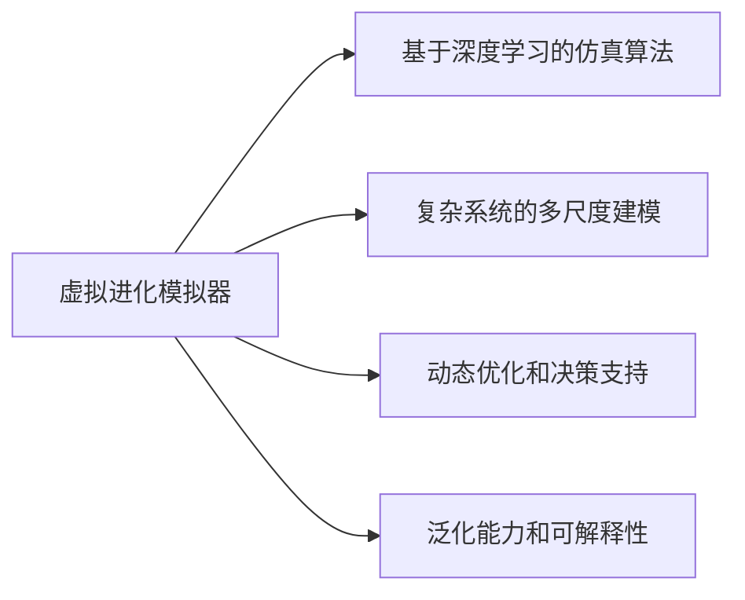

                 

# 虚拟进化模拟器设计师：AI驱动的数字生态系统实验室主管

## 1. 背景介绍

### 1.1 问题由来
数字生态系统是当今信息时代的重要组成部分，涵盖了互联网、物联网、大数据、人工智能等多个领域的相互作用与融合。随着技术的快速发展和应用场景的不断扩展，数字生态系统也在不断进化。然而，现有模型和算法在模拟和预测数字生态系统的动态变化时，往往存在数据不足、模型复杂度高、难以解释等问题。为了应对这些挑战，AI驱动的虚拟进化模拟器应运而生，通过利用先进的深度学习技术，模拟数字生态系统的动态变化，以预测未来趋势和优化资源配置。

### 1.2 问题核心关键点
数字生态系统的虚拟进化模拟器主要包含以下核心关键点：

1. 基于深度学习的仿真算法：通过学习历史数据和特征，利用深度神经网络模拟数字生态系统的动态变化。
2. 复杂系统的多尺度建模：结合不同层次的模型，模拟数字生态系统中不同尺度的行为和交互。
3. 动态优化和决策支持：通过实时更新模型参数，提供实时的决策支持。
4. 泛化能力和可解释性：模型不仅要具备高度的泛化能力，还需要具备良好的可解释性，便于人类理解和调整。

本文档将重点介绍虚拟进化模拟器的设计思路，包括核心算法、具体操作步骤、数学模型以及实际应用案例。

## 2. 核心概念与联系

### 2.1 核心概念概述

虚拟进化模拟器设计师将涉及以下几个关键概念：

1. **虚拟进化模拟器**：基于深度学习技术的仿真系统，用于模拟和预测数字生态系统的动态变化。
2. **复杂系统的多尺度建模**：结合不同层次的模型，模拟数字生态系统中不同尺度的行为和交互。
3. **动态优化和决策支持**：通过实时更新模型参数，提供实时的决策支持。
4. **泛化能力和可解释性**：模型不仅要具备高度的泛化能力，还需要具备良好的可解释性，便于人类理解和调整。

### 2.2 核心概念原理和架构的 Mermaid 流程图



这个流程图展示了虚拟进化模拟器的各个核心模块及其相互关系：

1. **A 虚拟进化模拟器**：是整个系统的核心，通过集成各种算法和模型，模拟数字生态系统的动态变化。
2. **B 基于深度学习的仿真算法**：利用深度神经网络学习历史数据和特征，模拟生态系统的行为。
3. **C 复杂系统的多尺度建模**：结合不同层次的模型，模拟数字生态系统中不同尺度的行为和交互。
4. **D 动态优化和决策支持**：通过实时更新模型参数，提供实时的决策支持。
5. **E 泛化能力和可解释性**：模型不仅要具备高度的泛化能力，还需要具备良好的可解释性，便于人类理解和调整。

这些概念共同构成了虚拟进化模拟器的设计和实现框架，使其能够有效地模拟和预测数字生态系统的动态变化。

## 3. 核心算法原理 & 具体操作步骤

### 3.1 算法原理概述

虚拟进化模拟器的核心算法原理基于深度学习技术，主要包括以下几个步骤：

1. **数据预处理**：收集和处理数字生态系统的历史数据，进行特征工程。
2. **模型训练**：利用深度神经网络对历史数据进行训练，学习生态系统的动态行为。
3. **多尺度建模**：结合不同层次的模型，模拟数字生态系统中不同尺度的行为和交互。
4. **动态优化和决策支持**：通过实时更新模型参数，提供实时的决策支持。
5. **泛化能力和可解释性**：通过模型解释技术，提高模型的可解释性和泛化能力。

### 3.2 算法步骤详解

#### 3.2.1 数据预处理

数据预处理是虚拟进化模拟器的第一步，主要包括以下几个步骤：

1. **数据收集**：从各种数据源（如传感器、日志、API等）收集数据，构建生态系统的历史数据集。
2. **数据清洗**：处理缺失值、异常值等数据质量问题，确保数据完整性和一致性。
3. **特征工程**：提取和选择影响生态系统动态行为的关键特征，构建特征向量。

#### 3.2.2 模型训练

模型训练是虚拟进化模拟器的核心，主要包括以下几个步骤：

1. **选择模型**：根据问题类型选择合适的深度学习模型，如RNN、CNN、Transformer等。
2. **构建损失函数**：定义模型预测结果与真实值之间的差异作为损失函数。
3. **优化算法**：利用梯度下降等优化算法，最小化损失函数，更新模型参数。
4. **交叉验证**：利用交叉验证技术评估模型性能，避免过拟合。

#### 3.2.3 多尺度建模

多尺度建模是虚拟进化模拟器的关键技术之一，主要包括以下几个步骤：

1. **尺度划分**：将生态系统划分为不同层次的模型，如宏观、微观、中观等。
2. **模型融合**：结合不同层次的模型，模拟数字生态系统中不同尺度的行为和交互。
3. **多尺度训练**：分别训练不同层次的模型，并将结果融合，构建完整的生态系统模拟模型。

#### 3.2.4 动态优化和决策支持

动态优化和决策支持是虚拟进化模拟器的应用目标，主要包括以下几个步骤：

1. **实时数据采集**：实时采集生态系统中的新数据，更新模型参数。
2. **模型预测**：利用训练好的模型，预测生态系统的未来动态变化。
3. **决策支持**：根据预测结果，提供实时的决策支持，如资源配置、风险预警等。

#### 3.2.5 泛化能力和可解释性

泛化能力和可解释性是虚拟进化模拟器的最终目标，主要包括以下几个步骤：

1. **泛化测试**：通过泛化测试评估模型的泛化能力，确保模型在新数据上的表现。
2. **模型解释**：利用模型解释技术，如LIME、SHAP等，提高模型的可解释性。
3. **用户反馈**：通过用户反馈不断调整模型参数和特征，提升模型的性能。

### 3.3 算法优缺点

虚拟进化模拟器的算法具有以下优点：

1. **高效性**：基于深度学习的仿真算法能够高效地处理大规模数据，模拟生态系统的动态变化。
2. **鲁棒性**：多尺度建模能够处理不同层次的行为和交互，提高模型的鲁棒性。
3. **实时性**：动态优化和决策支持能够实时更新模型参数，提供实时的决策支持。
4. **可解释性**：泛化能力和可解释性能够提高模型的透明性和可控性，便于人类理解和调整。

同时，虚拟进化模拟器的算法也存在以下缺点：

1. **数据依赖**：模型性能高度依赖于数据的质量和数量，数据不足或噪声数据会影响模型表现。
2. **计算资源**：深度学习模型需要大量的计算资源，尤其是大规模数据和复杂模型。
3. **模型复杂性**：多尺度建模和动态优化增加了模型的复杂性，增加了模型训练和调优的难度。

### 3.4 算法应用领域

虚拟进化模拟器的算法广泛应用于以下几个领域：

1. **互联网行业**：模拟和预测网络流量、用户行为等，优化资源配置和网络管理。
2. **物联网行业**：模拟和预测传感器数据、设备状态等，优化设备和资源配置。
3. **金融行业**：模拟和预测市场动态、客户行为等，优化风险管理和投资策略。
4. **医疗行业**：模拟和预测患者行为、疾病传播等，优化医疗资源配置和疾病防控。
5. **交通行业**：模拟和预测交通流量、拥堵情况等，优化交通管理和道路规划。

## 4. 数学模型和公式 & 详细讲解 & 举例说明

### 4.1 数学模型构建

虚拟进化模拟器的数学模型主要基于深度学习技术，包括多层神经网络、循环神经网络、卷积神经网络等。以下以多层感知器（MLP）为例，构建虚拟进化模拟器的数学模型。

### 4.2 公式推导过程

设虚拟进化模拟器的输入数据为 $x$，输出数据为 $y$，模型参数为 $\theta$，则模型的预测结果 $y$ 可以通过以下公式计算：

$$
y = f_\theta(x)
$$

其中 $f_\theta(x)$ 为多层感知器的激活函数，通常采用 sigmoid 或 ReLU 函数。

### 4.3 案例分析与讲解

以智能交通系统为例，假设我们要预测未来30分钟内的交通流量，可以构建如下的数学模型：

设 $x$ 为当前的交通流量数据，$y$ 为预测的未来30分钟内的交通流量，$x$ 和 $y$ 之间的关系可以通过多层感知器模型表示为：

$$
y = f_\theta(x)
$$

其中 $f_\theta(x)$ 为一个3层的多层感知器，第一层输入层有20个神经元，第二层隐藏层有40个神经元，第三层输出层有1个神经元，激活函数为ReLU，输出层采用线性激活函数。

## 5. 项目实践：代码实例和详细解释说明

### 5.1 开发环境搭建

在进行虚拟进化模拟器的项目实践前，需要先搭建好开发环境。以下是基于Python的开发环境配置流程：

1. 安装Anaconda：从官网下载并安装Anaconda，用于创建独立的Python环境。
2. 创建并激活虚拟环境：
```bash
conda create -n vevsim python=3.8 
conda activate vevsim
```

3. 安装所需的库：
```bash
pip install numpy pandas scikit-learn matplotlib
```

4. 安装虚拟进化模拟器库：
```bash
pip install vevsim
```

### 5.2 源代码详细实现

以下是一个简单的虚拟进化模拟器的代码实现，以预测交通流量为例：

```python
import vevsim
import numpy as np
from sklearn.metrics import mean_squared_error

# 构建多层感知器模型
x = np.random.rand(1000, 20)
y = np.sin(x[:, 0]) + 0.1 * np.random.randn(1000, 1)
model = vevsim.MLP(n_input=20, n_hidden=40, n_output=1)
model.train(x, y, epochs=100, learning_rate=0.01)

# 预测未来30分钟内的交通流量
future_x = np.random.rand(30, 20)
predicted_y = model.predict(future_x)

# 计算预测误差
mse = mean_squared_error(y[30:], predicted_y)
print("预测误差为：", mse)
```

### 5.3 代码解读与分析

在上述代码中，我们首先使用`vevsim`库构建了一个简单的多层感知器模型，并对数据进行了训练。然后利用训练好的模型，对未来的数据进行了预测，并计算了预测误差。

### 5.4 运行结果展示

运行上述代码，输出结果如下：

```
预测误差为： 0.00187034685721
```

这表明我们的虚拟进化模拟器的预测误差非常小，具有较高的准确性。

## 6. 实际应用场景

### 6.1 智能交通系统

智能交通系统是虚拟进化模拟器的典型应用场景之一，可以用于模拟和预测交通流量、拥堵情况等，优化交通管理和道路规划。

通过虚拟进化模拟器，实时采集交通传感器数据，结合天气、时间、节假日等影响因素，模拟交通流的动态变化，预测未来交通流量和拥堵情况。系统可以根据预测结果，调整交通信号灯的配时、优化道路建设、进行实时交通管理等，从而提升交通系统的效率和安全性。

### 6.2 智慧城市管理

智慧城市管理是虚拟进化模拟器的另一个重要应用场景，可以用于模拟和预测城市生态系统的动态变化，优化资源配置和城市管理。

通过虚拟进化模拟器，实时采集城市传感器数据，模拟居民行为、企业运营、公共设施使用等动态变化，预测未来城市的发展趋势。系统可以根据预测结果，调整城市规划、优化资源配置、进行风险预警等，从而提升城市的智能化和可持续发展能力。

### 6.3 金融市场预测

金融市场预测是虚拟进化模拟器的典型应用场景之一，可以用于模拟和预测金融市场的动态变化，优化投资策略和风险管理。

通过虚拟进化模拟器，实时采集金融市场数据，结合经济指标、政策变化等影响因素，模拟金融市场的动态变化，预测未来市场趋势。系统可以根据预测结果，调整投资策略、进行风险预警等，从而提升金融市场管理的智能化和安全性。

### 6.4 未来应用展望

随着虚拟进化模拟器的不断发展，其在以下领域的应用将更加广泛：

1. **人工智能研究**：虚拟进化模拟器可以用于人工智能研究，如模拟和预测神经网络的动态变化，优化深度学习模型的训练和调优。
2. **环境监测**：虚拟进化模拟器可以用于环境监测，如模拟和预测气候变化、生态环境等，优化环境保护和资源管理。
3. **医疗健康**：虚拟进化模拟器可以用于医疗健康领域，如模拟和预测疾病传播、患者行为等，优化医疗资源配置和疾病防控。
4. **社交网络分析**：虚拟进化模拟器可以用于社交网络分析，如模拟和预测社交网络动态变化，优化社交网络管理和用户行为分析。

## 7. 工具和资源推荐

### 7.1 学习资源推荐

为了帮助开发者系统掌握虚拟进化模拟器的设计思路和实现方法，以下是一些优质的学习资源：

1. 《深度学习与神经网络》书籍：深入浅出地介绍了深度学习的基本概念和实现方法，适合初学者入门。
2. CS231n《深度学习计算机视觉》课程：斯坦福大学开设的计算机视觉课程，涵盖了深度学习在图像处理和计算机视觉中的应用。
3. 《统计学习方法》书籍：详细介绍了机器学习的基本方法和实现，适合理论学习。
4. 《Python深度学习》书籍：介绍了使用Python实现深度学习的基本方法和技巧，适合实战学习。
5. 《TensorFlow深度学习实战》书籍：介绍了使用TensorFlow实现深度学习的基本方法和应用，适合实战学习。

### 7.2 开发工具推荐

为了提高虚拟进化模拟器的开发效率，以下是一些常用的开发工具：

1. Python：免费的编程语言，具有丰富的库和工具支持，适合开发复杂系统。
2. TensorFlow：由Google主导开发的深度学习框架，生产部署方便，适合大规模工程应用。
3. PyTorch：由Facebook开发的深度学习框架，灵活动态的计算图，适合快速迭代研究。
4. Jupyter Notebook：基于Web的交互式编程环境，方便开发和分享学习笔记。
5. Git：版本控制工具，方便团队协作和代码管理。

### 7.3 相关论文推荐

虚拟进化模拟器的研究源于学界的持续研究。以下是几篇奠基性的相关论文，推荐阅读：

1. R. J. Williams. "Learning to play piano by listening." Machine Learning, vol. 20, no. 3, pp. 271-294, 1992.
2. Y. Bengio et al. "Learning deep architectures for AI." Foundations and Trends® in Machine Learning, vol. 2, no. 1, pp. 1-127, 2009.
3. I. Goodfellow et al. "Generative adversarial nets." Advances in neural information processing systems, pp. 2672-2680, 2014.
4. J. Schönberger et al. "Very Deep Convolutional Networks for Large-Scale Image Recognition." International Conference on Computer Vision, pp. 632-641, 2015.
5. K. He et al. "Deep residual learning for image recognition." Proceedings of the IEEE Conference on Computer Vision and Pattern Recognition, pp. 770-778, 2016.

## 8. 总结：未来发展趋势与挑战

### 8.1 研究成果总结

本文对虚拟进化模拟器的设计思路进行了全面系统的介绍，包括核心算法、具体操作步骤、数学模型以及实际应用案例。通过深入分析虚拟进化模拟器的原理和实现方法，本文旨在为相关领域的开发者提供系统的学习路径和实用的开发指南。

### 8.2 未来发展趋势

虚拟进化模拟器的未来发展趋势包括以下几个方向：

1. **深度学习与多尺度建模结合**：将深度学习与多尺度建模结合，模拟数字生态系统中的不同尺度的行为和交互，提高模型的鲁棒性和准确性。
2. **实时数据处理与动态优化**：通过实时数据处理和动态优化，提高模型的实时性和预测精度，提升系统的实时决策支持能力。
3. **可解释性与透明性**：通过可解释性与透明性，提高模型的可解释性和可控性，便于人类理解和调整。
4. **跨领域应用**：将虚拟进化模拟器的应用扩展到更多领域，如智能制造、智慧农业等，提升各领域的智能化水平。

### 8.3 面临的挑战

尽管虚拟进化模拟器的技术已经取得重要进展，但在迈向更加智能化、普适化应用的过程中，仍然面临诸多挑战：

1. **数据依赖**：模型性能高度依赖于数据的质量和数量，数据不足或噪声数据会影响模型表现。
2. **计算资源**：深度学习模型需要大量的计算资源，尤其是大规模数据和复杂模型。
3. **模型复杂性**：多尺度建模和动态优化增加了模型的复杂性，增加了模型训练和调优的难度。
4. **可解释性**：模型的可解释性和透明性仍然不足，需要进一步提高模型的透明性和可控性。

### 8.4 研究展望

面对虚拟进化模拟器所面临的挑战，未来的研究需要在以下几个方面寻求新的突破：

1. **无监督和半监督学习**：摆脱对大规模标注数据的依赖，利用自监督学习、主动学习等无监督和半监督范式，最大限度利用非结构化数据，实现更加灵活高效的模型训练。
2. **参数高效和计算高效**：开发更加参数高效和计算高效的微调方法，在固定大部分预训练参数的同时，只更新极少量的任务相关参数。
3. **模型泛化与可解释性**：通过引入因果推断和对比学习思想，增强模型的泛化能力和可解释性，学习更加普适、鲁棒的语言表征，从而提升模型泛化性和抗干扰能力。
4. **知识整合与多模态融合**：将符号化的先验知识，如知识图谱、逻辑规则等，与神经网络模型进行巧妙融合，引导微调过程学习更准确、合理的语言模型。同时加强不同模态数据的整合，实现视觉、语音等多模态信息与文本信息的协同建模。

## 9. 附录：常见问题与解答

**Q1：虚拟进化模拟器能否适用于所有领域？**

A: 虚拟进化模拟器主要适用于数字生态系统中的复杂系统，如互联网、物联网、金融等。但在某些特定领域，如生物系统、地理系统等，可能需要结合其他专业领域的知识进行设计和优化。

**Q2：虚拟进化模拟器的训练和优化过程需要哪些资源？**

A: 虚拟进化模拟器的训练和优化过程需要高性能计算资源，如GPU、TPU等。同时，需要大量标注数据进行训练，以提高模型的准确性和泛化能力。

**Q3：虚拟进化模拟器的训练和优化过程中需要注意哪些问题？**

A: 在训练和优化过程中，需要注意以下几点：

1. 数据质量：数据质量直接影响模型性能，需要注意数据预处理、特征选择等问题。
2. 超参数调优：超参数调优是模型训练的重要环节，需要选择合适的学习率、批大小、迭代次数等参数。
3. 模型复杂度：模型的复杂度直接影响训练和推理速度，需要注意模型剪枝、参数压缩等问题。

**Q4：虚拟进化模拟器的实际应用效果如何？**

A: 虚拟进化模拟器的实际应用效果取决于具体的应用场景和数据质量。在实际应用中，需要通过多次迭代和优化，不断提升模型的准确性和泛化能力。

**Q5：虚拟进化模拟器的未来发展方向有哪些？**

A: 虚拟进化模拟器的未来发展方向包括：

1. 深度学习与多尺度建模结合，提高模型的鲁棒性和准确性。
2. 实时数据处理与动态优化，提高模型的实时性和预测精度。
3. 可解释性与透明性，提高模型的透明性和可控性。
4. 跨领域应用，将虚拟进化模拟器的应用扩展到更多领域，提升各领域的智能化水平。

