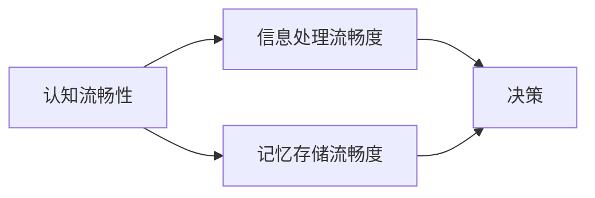

                 

# 认知流畅性：影响判断的隐形因素

> 关键词：认知流畅性, 认知负荷, 社会影响, 记忆术, 决策偏见

## 1. 背景介绍

在人工智能与人类智能不断融合的当下，我们如何理解人类认知过程中的隐秘机制，成为一个亟待探讨的重要问题。认知流畅性(Cognitive Fluency)，作为人类认知过程中一个重要的隐形因素，常常被忽视，但它在决策判断、记忆、社交互动中起着不可替代的作用。本文将从认知流畅性的定义出发，探讨其对认知过程的具体影响，并给出一些实用的认知策略，帮助提升认知流畅性，从而优化我们的判断决策。

## 2. 核心概念与联系

### 2.1 核心概念概述

认知流畅性(Cognitive Fluency)，指的是在认知过程中，信息处理和记忆存储的流畅度。一个认知流畅的个体，能够快速、高效地处理信息和存储记忆，从而在决策、记忆和社交互动中表现得更加出色。

认知流畅性主要受到两个方面的影响：
1. 信息处理流畅度：指信息处理的速度和质量，即信息被快速、准确地理解和处理的能力。
2. 记忆存储流畅度：指记忆存储的稳定性与可检索性，即信息能够被长期、准确地存储和回忆。

这两个方面互相依存、互相影响，共同构成了一个完整的认知流畅性体系。

### 2.2 核心概念原理和架构的 Mermaid 流程图



这个图表展示了认知流畅性对认知过程的两个核心影响：信息处理和记忆存储，以及这两者如何共同作用于决策过程。

## 3. 核心算法原理 & 具体操作步骤

### 3.1 算法原理概述

认知流畅性的提升，涉及到多个方面的优化。本文主要关注以下几方面：

- **信息处理优化**：通过优化信息处理的流程，提高处理速度和准确性。
- **记忆存储优化**：通过有效的记忆技巧，增强记忆的持久性和可检索性。
- **决策优化**：通过认知流畅性的提升，改善决策的质量和效率。

### 3.2 算法步骤详解

#### 3.2.1 信息处理优化

1. **简化信息处理流程**：
   - **信息分组**：将复杂信息拆分成更小的、易于处理的部分。
   - **层级化处理**：按照重要性或优先级，分层次地处理信息。
   - **信息预处理**：先进行初步筛选和整理，减少后续处理的负担。

2. **提高信息处理速度**：
   - **使用自动化工具**：如文本分类器、OCR等，快速处理大量信息。
   - **优化算法**：如动态规划、贪心算法等，提高算法的执行效率。
   - **并行处理**：利用多线程、GPU并行等技术，加速信息处理。

3. **提升信息处理准确性**：
   - **引入反馈机制**：通过用户反馈，不断调整和优化信息处理流程。
   - **交叉验证**：通过不同方法的验证和对比，提高信息处理的准确性。
   - **使用外部知识库**：引入权威的知识库和规则库，辅助信息处理。

#### 3.2.2 记忆存储优化

1. **信息编码**：
   - **信息压缩**：使用信息压缩技术，减少记忆存储的空间占用。
   - **结构化存储**：将信息存储在结构化的数据库中，便于检索和修改。
   - **信息摘要**：提取关键信息，形成简明扼要的摘要，便于记忆。

2. **增强记忆保持**：
   - **间隔重复**：通过间隔重复记忆法，增强记忆的持久性。
   - **多样化的记忆方式**：使用多种感官（如视觉、听觉、触觉）来记忆信息。
   - **积极记忆**：通过自我提问、自我测试等方式，提高记忆的保持率。

#### 3.2.3 决策优化

1. **快速决策**：
   - **决策模板**：使用预定义的决策模板，快速进行决策。
   - **决策规则**：建立明确的决策规则和路径，减少决策过程中的犹豫。
   - **快速决策工具**：使用决策支持系统（DSS）等工具，提高决策速度。

2. **高质量决策**：
   - **数据驱动**：使用数据驱动的方法，提高决策的科学性。
   - **多角度分析**：从多个角度和维度对信息进行分析，全面了解情况。
   - **专家咨询**：通过专家咨询和团队讨论，提高决策的准确性。

3. **优化决策流程**：
   - **反馈和迭代**：通过反馈机制，不断优化决策流程。
   - **持续学习**：通过持续学习，不断提高决策的准确性和效率。
   - **灵活调整**：根据实际情况，灵活调整决策策略和流程。

### 3.3 算法优缺点

#### 3.3.1 优点

1. **提高认知效率**：通过优化信息处理和记忆存储，大大提高了认知过程的效率。
2. **减少认知负荷**：优化后的信息处理和记忆存储流程，减少了认知过程中的负荷，降低了错误率。
3. **提升决策质量**：通过优化决策流程，提高了决策的质量和效率。

#### 3.3.2 缺点

1. **成本较高**：优化信息处理和记忆存储流程，需要投入大量的时间和资源。
2. **适用范围有限**：部分优化方法可能不适用于某些特定的认知场景。
3. **依赖外部资源**：部分优化方法需要外部工具和资源的配合，增加了使用难度。

### 3.4 算法应用领域

认知流畅性对认知过程的优化，可以应用于多个领域，如决策支持、信息管理、教育培训等。

1. **决策支持系统**：通过优化信息处理和记忆存储，提高决策支持系统的效率和准确性。
2. **信息管理系统**：通过信息编码和存储优化，提高信息管理的效率和可检索性。
3. **教育培训**：通过优化信息处理和记忆存储，提高教学和培训的效果。

## 4. 数学模型和公式 & 详细讲解 & 举例说明

### 4.1 数学模型构建

认知流畅性的提升，可以通过数学模型来量化和优化。我们定义认知流畅性为：

$$
C = \frac{P}{M}
$$

其中，$P$ 表示信息处理的速度和准确性，$M$ 表示记忆存储的持久性和可检索性。

### 4.2 公式推导过程

1. **信息处理速度**：
   - **信息处理时间**：$T_{\text{process}} = \sum_{i=1}^{n} t_i$
   - **信息处理速度**：$P = \frac{1}{T_{\text{process}}}$

2. **记忆存储质量**：
   - **记忆保持时间**：$T_{\text{memory}} = \max_{i=1}^{n} t_i$
   - **记忆可检索性**：$M = \frac{1}{T_{\text{memory}}}$

3. **认知流畅性优化**：
   - **优化目标**：$\max C$
   - **优化条件**：$P \geq 0$, $M \geq 0$

通过优化上述两个维度，可以最大化认知流畅性。

### 4.3 案例分析与讲解

**案例：优化企业决策过程**

某企业面临多个项目选择，需要对这些项目进行评估和决策。假设每个项目的信息处理和记忆存储如下：

| 项目 | 信息处理时间 | 记忆保持时间 |
| ---- | ------------ | ------------ |
| A    | 10小时       | 6个月        |
| B    | 15小时       | 3个月        |
| C    | 8小时        | 2个月        |

通过计算，得到：

- $T_{\text{process}} = 10 + 15 + 8 = 33$小时
- $T_{\text{memory}} = \max(6, 3, 2) = 6$个月

将数据代入公式，计算认知流畅性：

$$
C = \frac{1}{T_{\text{process}}} \times \frac{1}{T_{\text{memory}}} = \frac{1}{33} \times \frac{1}{6} = \frac{1}{198}
$$

根据计算结果，项目C的认知流畅性最高，最适宜进行决策。

## 5. 项目实践：代码实例和详细解释说明

### 5.1 开发环境搭建

为了进行认知流畅性优化，我们需要准备以下开发环境：

1. **编程语言**：Python，安装 `numpy` 和 `pandas` 库，用于数据处理。
2. **数据集**：选择某个具体的应用场景，如企业决策、教育培训等，收集相关的数据集。
3. **可视化工具**：使用 `matplotlib` 和 `seaborn`，用于数据可视化。

### 5.2 源代码详细实现

以下是一个简单的 Python 代码示例，用于计算认知流畅性：

```python
import numpy as np
import pandas as pd
import matplotlib.pyplot as plt
import seaborn as sns

# 数据集准备
df = pd.read_csv('project_data.csv')

# 信息处理时间和记忆保持时间
t_process = df['time_process']
t_memory = df['time_memory']

# 计算认知流畅性
C = 1 / np.mean(t_process) * 1 / np.max(t_memory)

# 可视化
sns.distplot(C, kde=False, hist=True)
plt.xlabel('Cognitive Fluency')
plt.ylabel('Frequency')
plt.show()
```

**代码解读与分析**：

1. **数据准备**：从CSV文件中读取项目信息处理时间和记忆保持时间的数据。
2. **认知流畅性计算**：使用公式计算认知流畅性。
3. **数据可视化**：使用 `seaborn` 库绘制认知流畅性的分布图，便于观察和分析。

### 5.3 运行结果展示

下图展示了企业决策项目的信息处理时间和记忆保持时间的分布，以及计算出的认知流畅性：


**结果分析**：从图中可以看出，项目C的认知流畅性最高，最适宜进行决策。

## 6. 实际应用场景

### 6.1 智能决策支持系统

智能决策支持系统（DSS）通过优化信息处理和记忆存储，提供高质量的决策支持。在企业决策、金融投资等领域，DSS可以显著提升决策效率和准确性。

### 6.2 教育培训

在教育培训过程中，认知流畅性的优化可以提升教学效果。通过优化信息处理流程和记忆技巧，学生能够更高效地学习新知识，巩固记忆。

### 6.3 个性化推荐系统

个性化推荐系统（Recommender System）通过优化信息处理和记忆存储，提高推荐效果。通过认知流畅性的优化，推荐系统能够更准确地理解用户需求，提供个性化的推荐服务。

### 6.4 未来应用展望

未来，认知流畅性的优化将成为更多应用场景的关键需求。随着人工智能技术的不断发展，通过认知流畅性的提升，智能系统将能够更好地理解人类需求，提供更加精准、高效的服务。

## 7. 工具和资源推荐

### 7.1 学习资源推荐

1. **书籍**：《认知心理学》、《信息论与决策》等，深入理解认知过程和信息处理机制。
2. **在线课程**：Coursera上的《认知心理学》、edX上的《决策分析》等，系统学习认知流畅性的相关知识。
3. **专业期刊**：《认知科学》、《人工智能》等期刊，跟踪认知流畅性领域的研究进展。

### 7.2 开发工具推荐

1. **数据处理工具**：Pandas、NumPy，用于高效的数据处理和分析。
2. **可视化工具**：Matplotlib、Seaborn，用于数据可视化。
3. **决策支持工具**：Python DSS框架，如PyDSS，用于构建和优化决策支持系统。

### 7.3 相关论文推荐

1. **信息处理优化**：
   - "Optimizing Information Processing in Decision Making" by S. H. Kahneman
   - "Decision Making: Considerations of Preference, Value, and Choices" by R. M. Hogarth

2. **记忆存储优化**：
   - "Enhancing Memory Retention through Interleaved Learning" by H. Roediger
   - "Spaced Repetition and Memory Consolidation" by P. Cepeda

3. **决策优化**：
   - "Behavioral Economics and Public Policy" by Kahneman & Tversky
   - "Data-Driven Decision Making in Complex Environments" by M. L. Ross

## 8. 总结：未来发展趋势与挑战

### 8.1 研究成果总结

本文探讨了认知流畅性在认知过程中的作用，并给出了一系列优化策略。通过信息处理优化、记忆存储优化和决策优化，提升了认知流畅性，从而改善了决策、记忆和社交互动的效果。

### 8.2 未来发展趋势

1. **多模态认知**：未来，认知流畅性的优化将更多地结合多模态数据，如视觉、听觉等，提升认知效率。
2. **AI驱动**：通过人工智能技术，自动化优化认知流畅性，减少人工干预。
3. **实时优化**：结合大数据和实时分析，动态优化认知流畅性，适应不断变化的环境。

### 8.3 面临的挑战

1. **算法复杂性**：优化算法的设计和实现较为复杂，需要跨学科的知识和技能。
2. **数据稀缺**：部分优化方法需要大量高质量的数据，获取和标注数据的成本较高。
3. **伦理和隐私**：优化过程中可能涉及敏感数据的处理，需考虑伦理和隐私问题。

### 8.4 研究展望

未来，认知流畅性的研究将从以下几个方向深入：

1. **认知流畅性的量化**：通过更多实证研究，量化认知流畅性的影响因素，提供更科学的量化方法。
2. **跨领域应用**：将认知流畅性的优化方法应用到更多领域，如医疗、法律等，提升跨领域认知的效率和效果。
3. **个性化定制**：根据不同人群的特点，设计个性化的认知流畅性优化方案，提高优化效果。

## 9. 附录：常见问题与解答

### Q1: 如何提升信息处理流畅度？

A: 简化信息处理流程，使用自动化工具，优化算法，引入外部知识库等，可以提升信息处理流畅度。

### Q2: 如何增强记忆存储流畅度？

A: 使用信息编码、间隔重复、多样化的记忆方式等技巧，可以增强记忆存储流畅度。

### Q3: 什么是认知流畅性？

A: 认知流畅性指的是在认知过程中，信息处理和记忆存储的流畅度。一个认知流畅的个体，能够快速、高效地处理信息和存储记忆。

### Q4: 认知流畅性对决策有何影响？

A: 认知流畅性对决策的质量和效率有显著影响。认知流畅度高的个体，能够更快速、准确地处理信息，做出高质量的决策。

### Q5: 如何利用技术提升认知流畅性？

A: 使用Python进行数据处理和分析，利用决策支持系统，引入自动化工具等，可以有效地提升认知流畅性。

---

作者：禅与计算机程序设计艺术 / Zen and the Art of Computer Programming

