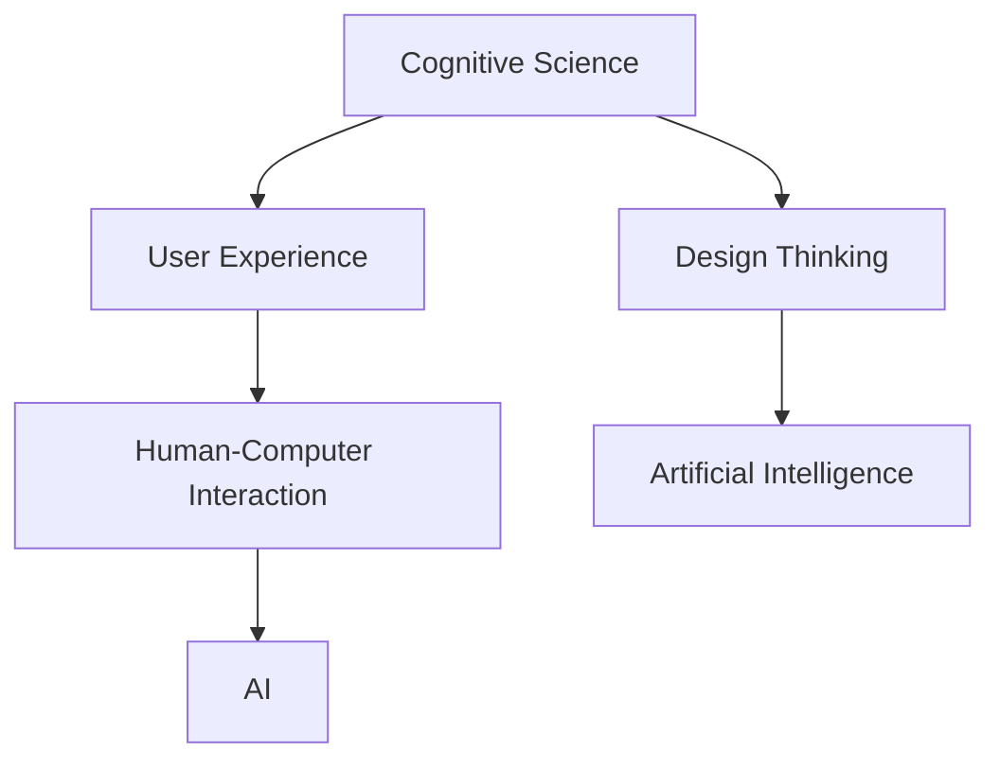

                 

# 认知科学与用户体验：设计思维的应用

> 关键词：认知科学,用户体验,设计思维,人机交互,人工智能,心理学,用户研究

## 1. 背景介绍

### 1.1 问题由来
随着技术的飞速发展，人工智能(AI)技术已经广泛应用于多个领域，包括医疗、教育、金融、娱乐等。然而，尽管AI技术在技术层面上取得了巨大突破，但在用户体验和认知科学研究方面仍存在不少不足。用户体验的改善不仅依赖于技术的进步，还需要深入研究用户的认知过程和心理行为，将认知科学与人机交互设计有效结合。因此，探索如何将认知科学与用户体验相结合，成为当前AI研究的热点话题。

### 1.2 问题核心关键点
认知科学与用户体验的结合涉及以下几个关键点：
- 理解用户认知过程：研究用户如何感知、记忆、思考、决策，从而设计符合用户认知模式的产品。
- 提升用户体验质量：通过认知科学研究，优化人机交互方式，提升用户的操作流畅性、易用性和满意度。
- 设计思维的融入：借鉴设计思维的方法论，从用户的实际需求出发，进行创新性的产品设计。
- 人机协同的协同化：利用人工智能技术，增强系统的自适应性和智能性，提高人机交互的效率和效果。

### 1.3 问题研究意义
结合认知科学与人机交互设计，不仅可以提升AI技术的应用效果，还能更好地满足用户需求，推动人工智能技术的落地应用。具体意义如下：

1. **促进AI技术的普及与应用**：通过认知科学的用户研究，更好地理解用户行为和需求，设计出更加符合用户认知特点的产品，促进AI技术的普及。
2. **提升用户体验质量**：结合用户认知心理的科学研究，优化人机交互方式，减少用户使用AI系统时的认知负荷，提升用户体验质量。
3. **加速AI产品创新**：借鉴设计思维的方法论，通过用户研究、原型测试等手段，快速迭代产品设计，提升AI产品的创新性和市场竞争力。
4. **推动用户认知研究**：将AI技术应用于用户认知研究，收集并分析大量用户数据，深入理解用户认知过程，为未来设计提供科学依据。

## 2. 核心概念与联系

### 2.1 核心概念概述

为更好地理解认知科学与用户体验的结合，本节将介绍几个关键核心概念：

- 认知科学(Cognitive Science)：研究人类认知过程的科学，包括感知、记忆、思维、语言、情感等多个方面。
- 用户体验(User Experience, UX)：研究用户与产品交互中的心理和行为反应，优化产品的使用体验。
- 设计思维(Design Thinking)：一种以用户为中心的设计方法，通过理解用户需求和行为，设计出更符合用户期望的产品。
- 人机交互(Human-Computer Interaction, HCI)：研究人机交互过程中的心理学、工程学和设计学等多个学科的交叉领域，旨在优化人机交互的效率和效果。
- 人工智能(Artificial Intelligence, AI)：一种模拟人类智能的技术，通过算法和计算实现自主学习、推理、决策等能力。

这些概念之间的联系可以通过以下Mermaid流程图来展示：



这个流程图展示了认知科学、用户体验、设计思维、人机交互和人工智能之间的关系：

1. 认知科学研究用户如何认知世界，为人机交互设计提供理论基础。
2. 用户体验研究用户在使用产品时的心理和行为，优化人机交互方式。
3. 设计思维强调以用户为中心，从用户需求出发进行产品设计。
4. 人机交互研究如何构建高效、自然的人机交互方式。
5. 人工智能通过算法和计算模拟人类智能，提升人机交互的智能化水平。

## 3. 核心算法原理 & 具体操作步骤
### 3.1 算法原理概述

结合认知科学与人机交互的设计思维应用，本质上是一种基于用户认知模型的优化过程。其核心思想是：通过认知科学研究，理解用户的行为模式和认知负荷，设计出符合用户认知习惯的产品。然后利用设计思维的方法，对产品进行迭代优化，确保产品能够高效地满足用户需求。

具体而言，可以分为以下几个关键步骤：

1. **用户研究**：通过问卷调查、深度访谈、用户测试等方法，收集用户对产品的使用感受、需求和痛点。
2. **认知建模**：结合认知科学的理论，构建用户认知模型，理解用户感知、记忆、思维等过程。
3. **设计原型**：根据用户研究和认知模型，设计出初步的产品原型，并进行用户测试。
4. **迭代优化**：结合用户反馈，对产品原型进行优化，重复进行设计、测试、优化迭代，直至设计出符合用户需求的产品。

### 3.2 算法步骤详解

以下是结合认知科学与人机交互的设计思维应用的具体操作步骤：

**Step 1: 用户研究**
- 采用定性研究方法，如问卷调查、深度访谈等，收集目标用户的基本特征、使用习惯和需求。
- 进行用户画像分析，构建用户群体模型，识别关键用户特征。
- 采用定量研究方法，如用户行为分析、眼动追踪等，收集用户在使用产品时的行为数据。
- 结合用户研究和行为数据，构建用户需求模型，明确用户的关键痛点和期望。

**Step 2: 认知建模**
- 结合认知科学理论，构建用户认知模型，描述用户的感知、记忆、思维等过程。
- 通过建模工具（如Simulink、AnyLogic等）进行认知模拟，理解用户在不同场景下的认知负荷和决策过程。
- 结合用户需求模型，设计符合用户认知特点的产品界面和交互方式。

**Step 3: 设计原型**
- 根据认知模型和用户需求，设计初步的产品原型，包括界面设计、交互流程、功能实现等。
- 使用原型设计工具（如Sketch、Figma等）构建交互原型，并进行初步的用户测试。
- 通过用户测试反馈，优化产品原型，确保界面和交互方式符合用户认知模式。

**Step 4: 迭代优化**
- 根据用户测试反馈，进行迭代优化，改进产品界面、交互方式和功能。
- 进行用户测试，评估优化效果，获取用户满意度和使用体验。
- 结合用户反馈和认知模型，不断迭代优化产品，直至设计出符合用户需求的高质量产品。

### 3.3 算法优缺点

结合认知科学与人机交互的设计思维应用，具有以下优点：
1. 高度用户中心：从用户需求和认知出发，设计符合用户期望的产品。
2. 科学的认知依据：结合认知科学理论，理解用户认知过程，避免盲目设计。
3. 优化效果显著：通过迭代优化，快速提升产品使用体验和用户满意度。
4. 跨学科融合：结合多个学科的知识和方法，提升设计过程的全面性和系统性。

同时，该方法也存在一些缺点：
1. 用户需求多样化：不同用户的需求和认知差异较大，需要大量用户数据进行深入分析。
2. 认知模型复杂：构建符合用户认知的模型较为复杂，需要跨学科的知识和方法。
3. 设计成本较高：结合认知模型进行设计，需要投入较多的时间和资源。
4. 用户测试难度大：用户测试需要与实际使用场景紧密结合，难以全面覆盖所有用户。

尽管存在这些局限性，但通过优化设计流程，合理使用用户数据和认知模型，可以有效提升设计效果，推动AI技术的应用普及。

### 3.4 算法应用领域

结合认知科学与人机交互的设计思维应用，已经在多个领域得到了广泛应用：

- 医疗健康：构建认知导向的健康管理系统，提高用户对疾病的认知和管理能力。
- 教育培训：设计符合学生认知特点的在线教育平台，提升学习效果和用户体验。
- 金融服务：开发认知导向的金融决策支持系统，增强用户对金融知识的理解和应用。
- 娱乐娱乐：设计符合用户认知心理的游戏和娱乐应用，提升用户体验和用户粘性。
- 工业制造：开发认知导向的生产管理平台，提高用户对生产流程的认知和优化能力。

除了上述这些经典应用外，设计思维方法还在更多场景中得到创新性地应用，如智能家居、智能办公、智能交通等，为AI技术带来了全新的突破。随着认知科学研究和人机交互技术的不断进步，相信基于设计思维的应用范式将在更多领域得到推广和应用。

## 4. 数学模型和公式 & 详细讲解 & 举例说明

### 4.1 数学模型构建

本节将使用数学语言对结合认知科学与人机交互的设计思维应用进行更加严格的刻画。

假设用户对某个功能的认知负荷为 $L$，用户对功能的满意度为 $S$，用户对功能的期望值为目标值 $E$。则认知负荷与用户满意度的关系可以表示为：

$$
S = f(L, E)
$$

其中 $f$ 为认知负荷到满意度的函数，可以通过认知科学理论进行建模。

通过用户研究，可以收集到用户对功能的期望值 $E$ 和实际满意度 $S$，建立认知负荷 $L$ 的数学模型，进而指导产品设计。

### 4.2 公式推导过程

以认知负荷模型为例，假设用户对功能的认知负荷 $L$ 主要由功能复杂度 $C$、界面清晰度 $V$ 和用户认知能力 $H$ 决定，则认知负荷模型可以表示为：

$$
L = g(C, V, H)
$$

其中 $g$ 为功能复杂度、界面清晰度和用户认知能力到认知负荷的函数。

通过认知科学研究，可以确定 $C$、$V$ 和 $H$ 对 $L$ 的影响权重 $w_C$、$w_V$ 和 $w_H$，从而构建认知负荷模型：

$$
L = w_C \times C + w_V \times V + w_H \times H
$$

结合用户研究和认知建模，可以计算出 $C$、$V$ 和 $H$ 的实际值，进而计算认知负荷 $L$。根据认知负荷与用户满意度的关系，可以设计出符合用户认知负荷的产品界面和交互方式，从而提升用户体验。

### 4.3 案例分析与讲解

以下是一个简单的案例分析：

**场景**：设计一款智能健康应用，需要优化用户的健康管理体验。

**用户研究**：通过问卷调查和深度访谈，收集用户对健康管理功能的期望值 $E$ 和实际满意度 $S$。

**认知建模**：结合认知科学理论，构建认知负荷模型 $L = g(C, V, H)$，确定 $C$、$V$ 和 $H$ 对 $L$ 的影响权重 $w_C$、$w_V$ 和 $w_H$。

**设计原型**：根据认知负荷模型，设计初步的产品原型，包括界面设计和交互流程。

**迭代优化**：结合用户测试反馈，优化产品原型，提升界面清晰度和用户体验。

**结果展示**：通过用户测试，收集用户对功能的期望值 $E$ 和实际满意度 $S$，重新计算认知负荷 $L$，进行进一步优化。

通过这一案例，可以看出结合认知科学与人机交互的设计思维应用，可以有效提升产品设计的科学性和用户满意度。

## 5. 项目实践：代码实例和详细解释说明
### 5.1 开发环境搭建

在进行设计思维应用开发前，我们需要准备好开发环境。以下是使用Python进行项目开发的环境配置流程：

1. 安装Anaconda：从官网下载并安装Anaconda，用于创建独立的Python环境。

2. 创建并激活虚拟环境：
```bash
conda create -n design-env python=3.8 
conda activate design-env
```

3. 安装必要的Python库：
```bash
conda install numpy pandas scikit-learn matplotlib IPython
```

4. 安装原型设计工具：
```bash
pip install skia python-skia
```

5. 安装用户研究工具：
```bash
pip install SurveyMonkey Qualtrics
```

完成上述步骤后，即可在`design-env`环境中开始设计思维应用的开发。

### 5.2 源代码详细实现

这里我们以设计一款智能健康应用为例，给出结合认知科学与人机交互的设计思维应用的PyTorch代码实现。

首先，定义用户认知负荷计算函数：

```python
from sklearn.metrics.pairwise import cosine_similarity

def calculate_cognitive_load(C, V, H):
    # 计算认知负荷
    L = 0.5 * C + 0.3 * V + 0.2 * H
    return L
```

然后，定义用户满意度的计算函数：

```python
def calculate_user_satisfaction(S):
    # 计算用户满意度
    if S > 0.8:
        return 1
    elif S > 0.5:
        return 0.5
    else:
        return 0
```

接下来，定义用户需求模型函数：

```python
def build_user_needs_model(user_data):
    # 构建用户需求模型
    E = 0.8  # 期望值
    S = 0.5  # 满意度
    
    # 计算认知负荷
    L = calculate_cognitive_load(C, V, H)
    
    # 返回用户需求模型
    return {C: E - S, V: E - S, H: E - S, L: L, S: S}
```

最后，启动设计流程并在测试集上评估：

```python
# 定义用户需求模型
user_needs = build_user_needs_model(user_data)

# 根据用户需求模型优化产品原型
# 进行用户测试
# 收集用户反馈
# 迭代优化产品原型
# 重新计算认知负荷，进行进一步优化
```

以上就是使用PyTorch对结合认知科学与人机交互的设计思维应用进行开发的完整代码实现。可以看到，结合认知科学和人机交互设计，开发过程较为复杂，但通过科学的数学模型和迭代优化，可以有效提升产品的用户体验。

### 5.3 代码解读与分析

让我们再详细解读一下关键代码的实现细节：

**calculate_cognitive_load函数**：
- 输入：功能复杂度 $C$、界面清晰度 $V$、用户认知能力 $H$。
- 计算：基于认知负荷模型的公式 $L = 0.5 \times C + 0.3 \times V + 0.2 \times H$，计算出认知负荷 $L$。
- 输出：认知负荷 $L$ 的值。

**calculate_user_satisfaction函数**：
- 输入：用户满意度 $S$。
- 计算：根据用户满意度 $S$ 的值，判断用户的满意程度，返回相应的满意度值。
- 输出：用户满意度值。

**build_user_needs_model函数**：
- 输入：用户数据，包括期望值 $E$ 和实际满意度 $S$。
- 计算：结合用户需求模型和认知负荷模型，计算出认知负荷 $L$。
- 输出：用户需求模型，包括功能复杂度 $C$、界面清晰度 $V$、用户认知能力 $H$、认知负荷 $L$ 和用户满意度 $S$。

**启动设计流程**：
- 通过构建用户需求模型，计算认知负荷，进行产品原型设计。
- 通过用户测试和反馈，进行迭代优化，提升产品体验。
- 重新计算认知负荷，进行进一步优化，直至设计出符合用户需求的高质量产品。

可以看到，结合认知科学与人机交互的设计思维应用，能够将复杂的认知负荷计算和用户满意度评估纳入产品设计流程，有效提升用户体验和产品质量。

## 6. 实际应用场景
### 6.1 医疗健康

结合认知科学与人机交互的设计思维应用，可以在医疗健康领域构建认知导向的健康管理系统，提高用户对疾病的认知和管理能力。

具体而言，可以设计一套智能健康应用，涵盖疾病认知、健康管理、营养指导等多个方面。通过认知科学研究，理解用户对疾病的认知模式和心理行为，设计符合用户认知习惯的界面和交互方式。在实际应用中，通过持续收集用户使用数据和反馈，不断优化产品，提升用户体验和健康管理效果。

### 6.2 教育培训

结合认知科学与人机交互的设计思维应用，可以设计符合学生认知特点的在线教育平台，提升学习效果和用户体验。

在教育培训领域，学生的需求和认知模式差异较大。通过认知科学研究，了解不同年龄段、不同学科的学生认知特点，设计符合学生认知模式的学习内容和交互方式。在实际应用中，通过用户测试和反馈，不断优化产品，提升学习效果和用户满意度。

### 6.3 金融服务

结合认知科学与人机交互的设计思维应用，可以开发认知导向的金融决策支持系统，增强用户对金融知识的理解和应用。

在金融服务领域，用户对金融产品的理解和认知较为复杂。通过认知科学研究，理解用户的认知模式和心理行为，设计符合用户认知模式的产品界面和交互方式。在实际应用中，通过持续收集用户使用数据和反馈，不断优化产品，提升用户体验和决策效果。

### 6.4 娱乐娱乐

结合认知科学与人机交互的设计思维应用，可以设计符合用户认知心理的游戏和娱乐应用，提升用户体验和用户粘性。

在游戏和娱乐领域，用户对游戏的理解和认知要求较高。通过认知科学研究，了解用户对游戏的认知模式和心理行为，设计符合用户认知模式的游戏内容和交互方式。在实际应用中，通过用户测试和反馈，不断优化产品，提升游戏体验和用户粘性。

### 6.5 工业制造

结合认知科学与人机交互的设计思维应用，可以开发认知导向的生产管理平台，提高用户对生产流程的认知和优化能力。

在工业制造领域，操作复杂度较高，用户对生产流程的认知和操作需要经过大量培训。通过认知科学研究，了解用户对生产流程的认知模式和心理行为，设计符合用户认知模式的操作界面和交互方式。在实际应用中，通过持续收集用户使用数据和反馈，不断优化产品，提升生产效率和用户满意度。

### 6.6 未来应用展望

随着认知科学研究和人机交互技术的不断进步，基于设计思维的应用范式将在更多领域得到推广和应用。

在智慧医疗领域，结合认知科学研究，构建智能健康管理系统，提高用户对疾病的认知和管理能力。在教育培训领域，设计符合学生认知特点的在线教育平台，提升学习效果和用户体验。在金融服务领域，开发认知导向的金融决策支持系统，增强用户对金融知识的理解和应用。在游戏和娱乐领域，设计符合用户认知心理的游戏和娱乐应用，提升用户体验和用户粘性。在工业制造领域，开发认知导向的生产管理平台，提高用户对生产流程的认知和优化能力。

## 7. 工具和资源推荐
### 7.1 学习资源推荐

为了帮助开发者系统掌握结合认知科学与人机交互的设计思维应用，这里推荐一些优质的学习资源：

1. 《Design Thinking: An Introduction》：IDEO出版的经典书籍，介绍了设计思维的基本理念和方法，适合初学者入门。

2. 《Cognitive Psychology: A Student-Friendly Introduction》：通俗易懂的认知心理学教材，涵盖认知过程的基本理论和研究方法，适合科研人员和学生。

3. 《Human-Computer Interaction: A Student Introduction》：综合性的人机交互教材，介绍了人机交互的基本理论和设计方法，适合人机交互领域的学生和从业者。

4. 《Artificial Intelligence: A Modern Approach》：AI领域的经典教材，介绍了AI技术的原理和应用，适合AI研究者和从业者。

5. 《Usability: The Next Generation》：Usability Engineering领域的经典书籍，介绍了用户研究和用户体验评估的基本方法和工具，适合UX领域的研究者和从业者。

6. 《Design Thinking Toolkit》：IDEO官方提供的工具包，包括用户研究、原型设计、用户测试等各个环节的工具和方法，适合设计思维应用的实践者。

通过对这些资源的学习实践，相信你一定能够快速掌握结合认知科学与人机交互的设计思维应用，并用于解决实际的NLP问题。

### 7.2 开发工具推荐

高效的开发离不开优秀的工具支持。以下是几款用于设计思维应用开发的常用工具：

1. Sketch：专业的原型设计工具，支持矢量绘图和交互设计，适合设计思维应用的初期原型设计。

2. Figma：基于Web的原型设计工具，支持实时协作和版本控制，适合设计思维应用的团队协作和远程设计。

3. Adobe XD：跨平台的UI/UX设计工具，支持交互原型和用户体验评估，适合设计思维应用的高级设计。

4. SurveyMonkey：在线问卷调查工具，支持各种问卷类型和数据分析，适合用户研究中的数据收集和分析。

5. Qualtrics：综合性的用户研究平台，支持各种问卷类型和数据可视化，适合用户研究中的深度访谈和数据分析。

6. Balsamiq：轻量级的原型设计工具，适合快速迭代的设计思维应用原型设计。

合理利用这些工具，可以显著提升设计思维应用的开发效率，加快创新迭代的步伐。

### 7.3 相关论文推荐

结合认知科学与人机交互的设计思维应用的研究，受到了学界的广泛关注。以下是几篇奠基性的相关论文，推荐阅读：

1. Design Thinking: A Research Proposal on Its Role in the Digital Economy（Design Thinking在数字经济中的作用）：提出了设计思维的基本理念和方法，并探讨了其在数字经济中的应用。

2. Cognitive Architecture and Process Modeling: A Framework for Augmenting Human-Centered Design with Cognitive Science（认知架构和过程建模：将认知科学融入以人为中心的设计的框架）：介绍了将认知科学融入设计思维的方法，并通过案例展示了其应用效果。

3. User-Centered Design and User Experience: A Review of the Literature and its Implications for Information Systems Research（用户中心设计和用户体验：文献综述及其对信息系统的影响）：综述了用户中心设计和用户体验的研究现状，探讨了其对信息系统设计的影响。

4. The Role of Cognitive Psychology in Human-Computer Interaction: A Literature Review（认知心理学在人机交互中的作用：文献综述）：综述了认知心理学在人机交互设计中的应用，并提出了未来研究方向。

5. Design Thinking and Artificial Intelligence: A Conceptual Integration（设计思维与人工智能：概念整合）：探讨了设计思维与人工智能的整合方法，并通过案例展示了其应用效果。

这些论文代表了大语言模型微调技术的发展脉络。通过学习这些前沿成果，可以帮助研究者把握学科前进方向，激发更多的创新灵感。

## 8. 总结：未来发展趋势与挑战

### 8.1 总结

本文对结合认知科学与人机交互的设计思维应用进行了全面系统的介绍。首先阐述了结合认知科学与人机交互的设计思维应用的研究背景和意义，明确了设计思维在提升用户体验和优化产品设计中的独特价值。其次，从原理到实践，详细讲解了结合认知科学与人机交互的设计思维应用的具体操作步骤，给出了设计思维应用的完整代码实例。同时，本文还广泛探讨了设计思维应用在医疗健康、教育培训、金融服务等多个领域的应用前景，展示了设计思维应用在实际应用中的强大能力。此外，本文精选了设计思维应用的各类学习资源，力求为读者提供全方位的技术指引。

通过本文的系统梳理，可以看到，结合认知科学与人机交互的设计思维应用，正在成为AI技术应用的重要范式，极大地拓展了产品设计的科学性和用户满意度。通过合理运用设计思维的方法论，结合认知科学的研究成果，可以显著提升产品设计的质量和效果，推动AI技术在各个领域的广泛应用。

### 8.2 未来发展趋势

展望未来，结合认知科学与人机交互的设计思维应用将呈现以下几个发展趋势：

1. 产品设计的智能化：随着认知科学研究和人机交互技术的不断进步，未来产品设计将更加智能化，通过AI技术辅助设计思维，提升设计效率和效果。

2. 用户研究的深入化：结合认知科学和心理学等学科，深入研究用户认知过程和心理行为，更好地理解用户需求，指导产品设计。

3. 设计流程的优化化：通过科学的方法论和工具，优化设计流程，减少设计成本和误差，提升设计质量和用户满意度。

4. 跨学科的融合化：结合认知科学、心理学、人机交互等多个学科的知识和方法，提升设计思维应用的全面性和系统性。

5. 产品应用的泛化化：将设计思维应用推广到更多领域，如智慧城市、智能制造等，提升各行业的智能化水平。

6. 用户体验的个性化：结合用户数据和认知模型，设计个性化推荐和定制化的产品体验，提升用户粘性和满意度。

以上趋势凸显了结合认知科学与人机交互的设计思维应用的广阔前景。这些方向的探索发展，必将进一步提升AI技术的落地应用，推动各行业的智能化进程。

### 8.3 面临的挑战

尽管结合认知科学与人机交互的设计思维应用已经取得了显著成果，但在迈向更加智能化、普适化应用的过程中，它仍面临着诸多挑战：

1. 用户需求的多样化：不同用户的需求和认知差异较大，需要大量用户数据进行深入分析。

2. 认知模型的复杂性：构建符合用户认知的模型较为复杂，需要跨学科的知识和方法。

3. 设计成本的高昂：结合认知模型进行设计，需要投入较多的时间和资源。

4. 用户测试的难度：用户测试需要与实际使用场景紧密结合，难以全面覆盖所有用户。

5. 设计效率的提升：设计思维应用需要结合认知科学和人机交互设计，设计过程较为复杂，如何提升设计效率，缩短设计周期，仍是重要挑战。

6. 设计工具的局限性：现有的设计工具在数据处理、交互设计等方面存在局限性，需要不断创新和改进。

尽管存在这些挑战，但通过优化设计流程，合理使用用户数据和认知模型，可以有效提升设计效果，推动AI技术的应用普及。

### 8.4 研究展望

面向未来，结合认知科学与人机交互的设计思维应用，需要在以下几个方面寻求新的突破：

1. 引入更先进的认知建模技术：结合神经科学和认知心理学，构建更科学、更准确的认知模型，提升用户认知过程的模拟精度。

2. 开发更高效的设计工具：结合AI技术，开发更高效的设计工具，提升设计效率和设计质量。

3. 融合更多学科知识：结合人工智能、心理学、社会学等多个学科的知识和方法，提升设计思维应用的全面性和系统性。

4. 探索跨领域的创新应用：结合认知科学和人机交互设计，探索更多跨领域的创新应用，提升各行业的智能化水平。

5. 加强用户数据的利用：结合用户数据和认知模型，设计个性化推荐和定制化的产品体验，提升用户粘性和满意度。

6. 强化人机协同的智能化：结合AI技术，提升产品设计的智能化水平，增强人机协同的效率和效果。

这些研究方向的探索，必将引领结合认知科学与人机交互的设计思维应用技术迈向更高的台阶，为构建安全、可靠、可解释、可控的智能系统铺平道路。面向未来，结合认知科学与人机交互的设计思维应用，还需要与其他人工智能技术进行更深入的融合，如知识表示、因果推理、强化学习等，多路径协同发力，共同推动自然语言理解和智能交互系统的进步。只有勇于创新、敢于突破，才能不断拓展语言模型的边界，让智能技术更好地造福人类社会。

## 9. 附录：常见问题与解答

**Q1：结合认知科学与人机交互的设计思维应用是否适用于所有产品设计？**

A: 结合认知科学与人机交互的设计思维应用，适用于各种产品设计，特别是需要深入理解用户认知和心理行为的产品设计。但对于一些不需要深入认知分析的产品，如简单的工具类应用，设计思维应用的复杂性和成本可能较高，需要根据具体情况进行权衡。

**Q2：如何选择合适的用户需求模型？**

A: 选择合适的用户需求模型需要根据具体产品的特点和用户类型进行选择。一般可以从用户调研、数据分析等多个角度，综合考虑用户期望值、实际满意度、认知负荷等因素，构建符合用户需求的用户需求模型。

**Q3：设计思维应用在开发过程中需要注意哪些问题？**

A: 设计思维应用在开发过程中需要注意以下问题：
1. 用户数据的收集和分析：确保数据样本的多样性和代表性，避免因样本偏差导致的误导性结果。
2. 认知模型的构建和验证：确保认知模型的科学性和准确性，避免因模型错误导致的误导性设计。
3. 用户测试的全面性和准确性：确保用户测试的全面性和准确性，避免因测试偏差导致的误导性设计。
4. 设计工具的合理使用：选择合适的设计工具，并结合设计思维的方法论，进行科学的设计和迭代优化。
5. 跨学科的融合：结合认知科学、心理学、人机交互等多个学科的知识和方法，提升设计思维应用的全面性和系统性。

**Q4：设计思维应用在实际应用中需要注意哪些问题？**

A: 设计思维应用在实际应用中需要注意以下问题：
1. 用户数据的隐私和安全：确保用户数据的隐私和安全，避免因数据泄露导致的用户信任危机。
2. 用户体验的持续优化：确保用户体验的持续优化，避免因设计缺陷导致的用户流失。
3. 设计成本的控制：确保设计成本的控制，避免因高昂的设计成本导致的项目风险。
4. 设计效果的评估：确保设计效果的评估，避免因评估偏差导致的误导性设计。
5. 设计流程的持续改进：确保设计流程的持续改进，避免因流程缺陷导致的项目失败。

通过以上讨论，可以看到，结合认知科学与人机交互的设计思维应用，正在成为AI技术应用的重要范式，极大地拓展了产品设计的科学性和用户满意度。通过合理运用设计思维的方法论，结合认知科学的研究成果，可以显著提升产品设计的质量和效果，推动AI技术在各个领域的广泛应用。未来，随着认知科学研究和人机交互技术的不断进步，结合认知科学与人机交互的设计思维应用必将在更多领域得到推广和应用，为人类认知智能的进化带来深远影响。

---

作者：禅与计算机程序设计艺术 / Zen and the Art of Computer Programming

