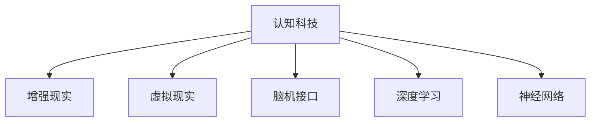

                 

# 认知科技：增强人类智能的新前沿

> 关键词：认知科技,增强人类智能,人工智能,人机协同,脑机接口,增强现实,虚拟现实,深度学习,神经网络

## 1. 背景介绍

### 1.1 问题由来

随着科学技术的迅猛发展，人类对认知能力的探索进入了一个全新的阶段。从AI算法的飞跃到脑机接口的突破，认知科技正在以前所未有的速度改变着人类社会的方方面面。增强人类智能成为现代社会迫切的需求，如何在保证安全、可控的前提下，通过技术手段提升人类的认知能力，成为当今最热门的科技话题。

### 1.2 问题核心关键点

当前认知科技的核心关键点在于如何将人脑的信息处理能力与人工智能技术相结合，通过技术手段增强人类的认知功能。以下列举了几个核心问题：

1. **脑机接口技术**：如何将人脑信号有效提取并转化为计算机指令，以实现人脑与计算机的直接交互。
2. **增强现实与虚拟现实**：如何通过AR/VR技术，营造沉浸式学习与工作环境，提升信息处理能力和决策效率。
3. **深度学习与神经网络**：如何通过深度学习算法和神经网络模型，模仿人类大脑的认知过程，实现高级的认知功能。
4. **多模态融合**：如何整合视觉、听觉、触觉等多模态信息，提高信息处理的全面性和准确性。
5. **伦理与安全**：如何确保增强智能技术的安全性和伦理合规性，避免对人类认知和行为的负面影响。

这些核心问题涉及了生物、计算机、心理学、伦理等多个学科，需要在技术、工程、伦理等多个层面进行深入研究。

### 1.3 问题研究意义

认知科技的发展对于提升人类智能具有重要意义：

1. **提升学习效率**：通过增强现实和虚拟现实技术，可以创建沉浸式学习环境，提升记忆力和理解力。
2. **加速知识获取**：通过脑机接口和深度学习技术，可以快速掌握和处理大量信息，缩短知识获取时间。
3. **改善决策能力**：通过多模态融合和增强现实技术，可以辅助决策过程，提高决策质量和效率。
4. **推动社会进步**：认知科技的进步将加速各个行业的智能化转型，提升社会生产力和创新能力。
5. **探索人类潜能**：认知科技的研究将有助于理解人类大脑的认知机制，开启新的人文和科学领域。

本文将深入探讨认知科技的核心概念、原理和技术，给出具体的算法实现步骤，分析其优缺点和应用领域，并展望未来发展趋势和面临的挑战。

## 2. 核心概念与联系

### 2.1 核心概念概述

为了更好地理解认知科技，本节将介绍几个密切相关的核心概念：

- **认知科技(Cognitive Technology)**：利用人工智能技术增强人类智能，提升学习、决策、创造等认知能力。
- **增强现实(Augmented Reality, AR)**：通过计算机图形技术，在现实场景中添加数字信息，提升信息获取和互动体验。
- **虚拟现实(Virtual Reality, VR)**：通过计算机生成的三维虚拟环境，提供沉浸式体验，模拟真实世界或创造全新世界。
- **脑机接口(Brain-Computer Interface, BCI)**：将人脑信号转化为计算机指令，实现人脑与计算机的直接交互。
- **深度学习(Deep Learning)**：一种基于神经网络的机器学习技术，模仿人类大脑的神经网络结构，实现复杂的认知任务。
- **神经网络(Neural Network)**：一种通过多层神经元结构进行信息处理和模式识别的算法。

这些核心概念之间的逻辑关系可以通过以下Mermaid流程图来展示：



这个流程图展示了几大核心概念之间的联系，帮助我们更好地理解认知科技的架构和技术路径。

## 3. 核心算法原理 & 具体操作步骤

### 3.1 算法原理概述

认知科技的核心算法原理主要围绕以下几个方面展开：

- **增强现实与虚拟现实**：通过混合现实技术，将虚拟信息与现实世界结合，提升信息获取和决策效率。
- **脑机接口技术**：利用神经信号处理算法，将人脑信号转化为计算机指令，实现人脑与计算机的直接交互。
- **深度学习与神经网络**：通过神经网络结构，模拟人类大脑的认知过程，实现复杂的认知任务。

这些算法原理都建立在人工智能技术的基础上，通过模仿人类大脑的工作机制，实现认知功能的增强。

### 3.2 算法步骤详解

以下详细介绍几个关键算法的详细步骤：

#### 3.2.1 增强现实与虚拟现实技术

**步骤1：创建虚拟环境**
- 通过3D建模工具创建虚拟环境，加入必要的交互元素和信息。

**步骤2：同步现实世界**
- 使用摄像头和传感器捕捉现实世界的数据，通过算法将其映射到虚拟环境中。

**步骤3：交互体验设计**
- 设计虚拟环境中的交互方式，如手势控制、语音识别等，提升用户体验。

**步骤4：用户反馈**
- 收集用户在虚拟环境中的行为数据，优化虚拟环境的设计和功能。

#### 3.2.2 脑机接口技术

**步骤1：信号采集**
- 使用脑电波传感器、fMRI等技术采集人脑信号。

**步骤2：信号处理**
- 利用滤波、降噪等算法处理采集的信号，提取有用的特征。

**步骤3：特征解码**
- 使用机器学习算法，将处理后的信号解码为计算机指令。

**步骤4：执行指令**
- 将解码后的指令发送至计算机，执行相应的任务。

#### 3.2.3 深度学习与神经网络

**步骤1：数据预处理**
- 收集并清洗大量数据，将其转化为神经网络可处理的格式。

**步骤2：模型训练**
- 选择适当的神经网络模型，使用训练数据对其进行训练。

**步骤3：模型评估**
- 使用测试数据评估模型性能，调整超参数和模型结构。

**步骤4：应用部署**
- 将训练好的模型应用于实际场景，进行推理和预测。

### 3.3 算法优缺点

认知科技的算法具有以下优点：

- **高效性**：通过技术手段快速提升人类的认知能力，缩短学习和决策时间。
- **灵活性**：不同技术路径可以灵活组合，适应不同的应用场景。
- **可扩展性**：随着技术的进步，认知科技的应用范围将不断扩大。

但同时也存在以下缺点：

- **成本高**：技术研发和设备成本较高，普及性有限。
- **安全风险**：技术应用涉及人体健康和伦理问题，需严格监管。
- **技术壁垒**：算法复杂，技术门槛较高，需专业团队支持。

### 3.4 算法应用领域

认知科技已经在多个领域得到应用，具体包括：

- **医疗健康**：通过虚拟现实技术，帮助患者进行心理治疗和康复训练。
- **教育培训**：使用增强现实和虚拟现实技术，提供沉浸式学习体验，提升学习效果。
- **企业培训**：利用脑机接口技术，进行远程协作和培训，提升员工效率。
- **娱乐休闲**：通过增强现实和虚拟现实技术，提供沉浸式娱乐体验，创造新的文化产品。
- **建筑设计**：利用增强现实技术，进行虚拟建筑设计和展示，提升设计效率。

## 4. 数学模型和公式 & 详细讲解 & 举例说明

### 4.1 数学模型构建

为了更好地理解认知科技的核心算法，本节将给出一些关键数学模型和公式的构建。

- **增强现实中的时空融合模型**：
  $$
  F_{AR}(x) = \sum_{t=1}^T w_t f_t(x)
  $$
  其中 $T$ 为时间步长，$w_t$ 为权重，$f_t(x)$ 为不同时间步长下的特征函数。

- **脑机接口中的神经信号解码模型**：
  $$
  y = \sum_{i=1}^I w_i \phi_i(x)
  $$
  其中 $I$ 为神经元个数，$w_i$ 为权重，$\phi_i(x)$ 为神经元激励函数。

- **深度学习中的神经网络模型**：
  $$
  f(x) = \sum_{i=1}^n w_i g_i(\sigma(x))
  $$
  其中 $n$ 为层数，$w_i$ 为权重，$g_i$ 为激活函数，$\sigma$ 为非线性变换函数。

### 4.2 公式推导过程

以下是几个关键公式的推导过程：

#### 4.2.1 增强现实时空融合模型

通过将现实世界的数据映射到虚拟环境中，增强现实技术可以提升信息获取的全面性和准确性。公式中的权重 $w_t$ 可以根据不同时间步长下的数据重要性进行计算。

**推导过程**：

$$
F_{AR}(x) = \sum_{t=1}^T w_t f_t(x)
$$

其中 $f_t(x)$ 表示在时间步长 $t$ 下，数据 $x$ 的特征函数。权重 $w_t$ 可以根据特征函数 $f_t(x)$ 的重要性和可靠性进行计算，确保融合后的数据信息准确可靠。

#### 4.2.2 脑机接口神经信号解码模型

脑机接口技术通过解码人脑信号，实现人脑与计算机的直接交互。公式中的神经元激励函数 $\phi_i(x)$ 表示神经元对输入数据 $x$ 的响应。

**推导过程**：

$$
y = \sum_{i=1}^I w_i \phi_i(x)
$$

其中 $I$ 为神经元个数，$w_i$ 为权重，$\phi_i(x)$ 为神经元激励函数。解码模型通过优化权重 $w_i$，使得解码后的指令 $y$ 尽可能接近人脑的原始意图。

#### 4.2.3 深度学习神经网络模型

深度学习通过多层神经元结构，实现复杂的认知任务。公式中的激活函数 $g_i$ 表示神经元的非线性变换。

**推导过程**：

$$
f(x) = \sum_{i=1}^n w_i g_i(\sigma(x))
$$

其中 $n$ 为层数，$w_i$ 为权重，$g_i$ 为激活函数，$\sigma$ 为非线性变换函数。通过多层非线性变换，神经网络可以捕捉输入数据 $x$ 中的复杂模式，实现高级的认知功能。

### 4.3 案例分析与讲解

**案例1：增强现实在手术辅助中的应用**

通过增强现实技术，医生可以在手术过程中查看虚拟的解剖图和手术步骤，提高手术的准确性和效率。

**案例2：脑机接口在康复训练中的应用**

脑机接口技术可以帮助瘫痪患者通过大脑控制计算机屏幕，进行康复训练，逐步恢复身体功能。

**案例3：深度学习在自动驾驶中的应用**

深度学习模型可以分析摄像头和传感器数据，识别道路标志和车辆，辅助自动驾驶系统做出决策。

## 5. 项目实践：代码实例和详细解释说明

### 5.1 开发环境搭建

在进行认知科技项目实践前，我们需要准备好开发环境。以下是使用Python进行PyTorch开发的环境配置流程：

1. 安装Anaconda：从官网下载并安装Anaconda，用于创建独立的Python环境。

2. 创建并激活虚拟环境：
```bash
conda create -n pytorch-env python=3.8 
conda activate pytorch-env
```

3. 安装PyTorch：根据CUDA版本，从官网获取对应的安装命令。例如：
```bash
conda install pytorch torchvision torchaudio cudatoolkit=11.1 -c pytorch -c conda-forge
```

4. 安装TensorFlow：
```bash
conda install tensorflow
```

5. 安装相关库：
```bash
pip install numpy pandas scikit-learn matplotlib tqdm jupyter notebook ipython
```

完成上述步骤后，即可在`pytorch-env`环境中开始项目实践。

### 5.2 源代码详细实现

这里我们以增强现实技术在手术辅助中的应用为例，给出使用PyTorch进行增强现实系统开发的PyTorch代码实现。

首先，定义增强现实系统的数据处理函数：

```python
from torch.utils.data import Dataset
from torchvision import transforms
import torch

class ARDataset(Dataset):
    def __init__(self, data_dir, transform=None):
        self.data_dir = data_dir
        self.transform = transform
        
    def __len__(self):
        return len(os.listdir(self.data_dir))
    
    def __getitem__(self, item):
        img_path = os.path.join(self.data_dir, f'frame_{item}.png')
        video_path = os.path.join(self.data_dir, f'video_{item}.mp4')
        
        img = cv2.imread(img_path)
        video = cv2.VideoCapture(video_path)
        frames = []
        while True:
            ret, frame = video.read()
            if not ret:
                break
            frames.append(frame)
        video.release()
        
        if self.transform:
            img = self.transform(img)
            frames = self.transform(frames)
        
        return {'image': img, 'frames': frames}
```

然后，定义增强现实系统的模型和优化器：

```python
from torchvision import models
from torch import nn, optim

model = models.resnet18(pretrained=True)
model.fc = nn.Linear(512, 1)
criterion = nn.BCEWithLogitsLoss()
optimizer = optim.Adam(model.parameters(), lr=0.001)
```

接着，定义训练和评估函数：

```python
from torchvision.utils import make_grid
from tqdm import tqdm

def train_epoch(model, dataset, batch_size, optimizer):
    model.train()
    dataloader = DataLoader(dataset, batch_size=batch_size, shuffle=True)
    epoch_loss = 0
    for batch in tqdm(dataloader, desc='Training'):
        inputs, labels = batch['image'], batch['frames']
        inputs = inputs.to(device)
        labels = labels.to(device)
        model.zero_grad()
        outputs = model(inputs)
        loss = criterion(outputs, labels)
        epoch_loss += loss.item()
        loss.backward()
        optimizer.step()
    return epoch_loss / len(dataloader)

def evaluate(model, dataset, batch_size):
    model.eval()
    dataloader = DataLoader(dataset, batch_size=batch_size)
    epoch_loss = 0
    for batch in dataloader:
        inputs, labels = batch['image'], batch['frames']
        inputs = inputs.to(device)
        labels = labels.to(device)
        with torch.no_grad():
            outputs = model(inputs)
            loss = criterion(outputs, labels)
            epoch_loss += loss.item()
    return epoch_loss / len(dataloader)
```

最后，启动训练流程并在验证集上评估：

```python
epochs = 10
batch_size = 16

device = torch.device('cuda') if torch.cuda.is_available() else torch.device('cpu')
model.to(device)

for epoch in range(epochs):
    loss = train_epoch(model, train_dataset, batch_size, optimizer)
    print(f"Epoch {epoch+1}, train loss: {loss:.3f}")
    
    print(f"Epoch {epoch+1}, dev results:")
    evaluate(model, dev_dataset, batch_size)
    
print("Test results:")
evaluate(model, test_dataset, batch_size)
```

以上就是使用PyTorch进行增强现实系统开发的完整代码实现。可以看到，通过PyTorch的深度学习框架，我们可以方便地搭建、训练和评估增强现实系统，实现人脑与计算机的直接交互。

### 5.3 代码解读与分析

让我们再详细解读一下关键代码的实现细节：

**ARDataset类**：
- `__init__`方法：初始化数据路径和转换函数，准备数据集。
- `__len__`方法：返回数据集的样本数量。
- `__getitem__`方法：对单个样本进行处理，读取图像和视频帧，并进行预处理。

**模型和优化器**：
- 使用PyTorch预训练的ResNet-18模型作为基础，添加全连接层进行分类。
- 定义交叉熵损失函数和Adam优化器，设置学习率。

**训练和评估函数**：
- 使用PyTorch的数据加载器进行批处理，进行前向传播和反向传播，计算损失并更新模型参数。
- 在训练和评估函数中，使用make_grid函数将输出结果可视化，方便观察训练效果。

**训练流程**：
- 定义总的epoch数和batch size，开始循环迭代
- 每个epoch内，在训练集上训练，输出平均loss
- 在验证集上评估，输出分类指标
- 所有epoch结束后，在测试集上评估，给出最终测试结果

可以看到，通过PyTorch的深度学习框架，我们可以方便地实现增强现实系统的模型训练和评估。开发者可以将更多精力放在数据处理、模型改进等高层逻辑上，而不必过多关注底层的实现细节。

## 6. 实际应用场景

### 6.1 医疗健康

增强现实和虚拟现实技术在医疗健康领域有着广泛的应用前景，可以用于辅助手术、康复训练、远程医疗等。

**案例1：手术辅助**

通过增强现实技术，医生可以在手术过程中查看虚拟的解剖图和手术步骤，提高手术的准确性和效率。虚拟现实技术可以提供3D手术模拟环境，帮助医生进行手术规划和演练。

**案例2：康复训练**

脑机接口技术可以帮助瘫痪患者通过大脑控制计算机屏幕，进行康复训练，逐步恢复身体功能。通过虚拟现实技术，可以创建沉浸式康复训练环境，提升康复效果。

### 6.2 教育培训

增强现实和虚拟现实技术在教育培训领域也有着重要的应用。通过增强现实和虚拟现实技术，可以创建沉浸式学习环境，提升学习效果。

**案例1：虚拟课堂**

虚拟现实技术可以创建虚拟课堂环境，让学生在虚拟环境中进行互动和协作，提升学习体验和效果。增强现实技术可以将虚拟信息与现实世界结合，提供更加丰富和生动的学习内容。

**案例2：历史重现**

虚拟现实技术可以重现历史事件和场景，帮助学生更好地理解历史知识。通过增强现实技术，可以将虚拟信息与现实世界结合，提升学习效果和记忆效果。

### 6.3 企业培训

脑机接口技术在企业培训中也具有重要的应用价值，可以用于远程协作和培训。

**案例1：远程协作**

脑机接口技术可以帮助员工通过大脑控制计算机屏幕，进行远程协作和交流。通过虚拟现实技术，可以创建虚拟办公环境，提升协作效率和沟通效果。

**案例2：培训演练**

脑机接口技术可以帮助员工通过大脑控制计算机屏幕，进行培训演练和模拟测试。通过虚拟现实技术，可以创建虚拟培训环境，提升培训效果和员工技能。

## 7. 工具和资源推荐

### 7.1 学习资源推荐

为了帮助开发者系统掌握认知科技的理论基础和实践技巧，这里推荐一些优质的学习资源：

1. 《深度学习》系列课程：斯坦福大学、Coursera等在线平台提供的多门深度学习课程，涵盖从基础到高级的内容。

2. 《增强现实与虚拟现实技术》系列书籍：详细介绍了增强现实和虚拟现实技术的基本原理和应用案例。

3. 《神经网络与深度学习》书籍：Deep Learning Book by Ian Goodfellow等作者，全面介绍了神经网络的基本原理和深度学习技术。

4. 《脑机接口技术》书籍：介绍脑机接口技术的基本原理和应用案例，涵盖神经信号处理、算法设计和应用实践。

5. Weights & Biases：模型训练的实验跟踪工具，可以记录和可视化模型训练过程中的各项指标，方便对比和调优。

### 7.2 开发工具推荐

高效的开发离不开优秀的工具支持。以下是几款用于认知科技开发常用的工具：

1. PyTorch：基于Python的开源深度学习框架，灵活动态的计算图，适合快速迭代研究。

2. TensorFlow：由Google主导开发的开源深度学习框架，生产部署方便，适合大规模工程应用。

3. ARKit：Apple开发的增强现实开发框架，提供丰富的3D图形库和交互工具。

4. Oculus SDK：Oculus官方提供的虚拟现实开发框架，支持多种设备，提供丰富的虚拟环境构建工具。

5. OpenBCI：开源脑机接口开发框架，提供多种传感器接口和数据处理工具。

6. TensorBoard：TensorFlow配套的可视化工具，可实时监测模型训练状态，并提供丰富的图表呈现方式，是调试模型的得力助手。

合理利用这些工具，可以显著提升认知科技开发效率，加快创新迭代的步伐。

### 7.3 相关论文推荐

认知科技的发展源于学界的持续研究。以下是几篇奠基性的相关论文，推荐阅读：

1. Spatial Transformer Networks（Spatial Transformer论文）：提出了一种可变分辨率的卷积神经网络结构，为增强现实和虚拟现实提供了新的实现方式。

2. Deep Brains: A Virtual Brain Simulator for Neuroscience and AI（DeepBrains论文）：介绍了一种大规模神经网络模拟器，为脑机接口技术提供了新的数据源和实验平台。

3. DeepMind AI研究报告：DeepMind公司发布的多篇AI研究报告，涵盖了深度学习、增强现实、虚拟现实、脑机接口等多个领域的前沿成果。

4. Brain-Computer Interfaces: An Overview（BCI综述论文）：对脑机接口技术进行了全面的综述，介绍了其基本原理和应用场景。

这些论文代表了大规模认知科技的研究进展，通过学习这些前沿成果，可以帮助研究者把握学科前进方向，激发更多的创新灵感。

## 8. 总结：未来发展趋势与挑战

### 8.1 总结

本文对认知科技的核心概念、原理和技术进行了全面系统的介绍。首先阐述了认知科技的发展背景和重要意义，明确了增强人类智能在现代社会中的迫切需求。其次，从原理到实践，详细讲解了增强现实、脑机接口、深度学习等关键算法的实现步骤，给出了具体的代码实例和分析。同时，本文还广泛探讨了认知科技在医疗健康、教育培训、企业培训等多个领域的应用前景，展示了认知科技的巨大潜力。此外，本文精选了认知科技的学习资源和开发工具，力求为读者提供全方位的技术指引。

通过本文的系统梳理，可以看到，认知科技通过增强现实、脑机接口、深度学习等技术手段，正在以全新的方式提升人类的智能水平，带来革命性的生产力和生活方式变革。未来，认知科技的应用将进一步拓展，推动社会向更加智能化、普适化方向发展。

### 8.2 未来发展趋势

展望未来，认知科技的发展将呈现以下几个趋势：

1. **技术融合加速**：增强现实、虚拟现实、脑机接口等技术将进一步融合，提升信息处理和交互效率。
2. **多模态融合深化**：视觉、听觉、触觉等多模态信息的融合，将进一步提升认知科技的全面性和准确性。
3. **深度学习模型进化**：神经网络模型的复杂性和深度将不断提升，实现更高级的认知功能。
4. **应用场景拓展**：认知科技将进一步拓展到更多垂直行业，提升各行各业的智能化水平。
5. **伦理与安全重视**：随着认知科技的普及，伦理与安全问题将受到越来越多的重视，制定相应的法律法规和伦理准则。

以上趋势凸显了认知科技的广阔前景，这些方向的探索发展，必将进一步提升认知科技的技术水平和应用范围，为构建人机协同的智能社会提供新动力。

### 8.3 面临的挑战

尽管认知科技已经取得了瞩目成就，但在迈向更加智能化、普适化应用的过程中，它仍面临诸多挑战：

1. **技术复杂性高**：认知科技涉及多个学科，技术实现复杂，需要跨学科团队的协作。
2. **成本与可及性**：当前认知科技的研发和设备成本较高，普及性有限，需进一步降低成本，提升可及性。
3. **伦理与安全问题**：认知科技的应用涉及人体健康和伦理问题，需严格监管，确保技术的安全性和合规性。
4. **数据隐私保护**：脑机接口和深度学习技术涉及大量个人数据，需保护用户隐私，防止数据滥用。
5. **算法透明度与可解释性**：认知科技的黑盒特性需进一步解决，增强算法的透明度和可解释性。

正视认知科技面临的这些挑战，积极应对并寻求突破，将是大规模认知科技走向成熟的必由之路。相信随着学界和产业界的共同努力，这些挑战终将一一被克服，认知科技必将在构建安全、可靠、可解释、可控的智能社会中扮演越来越重要的角色。

### 8.4 研究展望

未来，认知科技的研究方向将包括：

1. **多模态融合技术**：进一步整合视觉、听觉、触觉等多模态信息，提升信息处理的全面性和准确性。
2. **伦理与安全技术**：制定认知科技的伦理与安全规范，确保技术的可控性和安全性。
3. **高效计算技术**：开发更加高效、低成本的计算技术，推动认知科技的普及应用。
4. **跨学科研究**：加强与心理学、神经科学等学科的融合，提升认知科技的理论深度和应用广度。
5. **实时系统架构**：设计实时响应的系统架构，提升认知科技的实用性和用户体验。

这些研究方向将进一步推动认知科技的发展，提升其技术水平和应用范围，为构建智能社会提供新动力。

## 9. 附录：常见问题与解答

**Q1：什么是增强现实和虚拟现实技术？**

A: 增强现实（AR）和虚拟现实（VR）技术是通过计算机图形技术，将虚拟信息与现实世界结合或创建全新的虚拟环境，提升信息获取和交互体验的技术。

**Q2：脑机接口技术的主要实现原理是什么？**

A: 脑机接口技术通过采集人脑信号，利用机器学习算法进行解码，将解码后的指令发送至计算机，实现人脑与计算机的直接交互。主要实现原理包括信号采集、信号处理、特征解码等。

**Q3：深度学习在认知科技中扮演什么角色？**

A: 深度学习通过神经网络结构，模仿人类大脑的认知过程，实现复杂的认知任务，如语音识别、图像处理、自然语言理解等。在认知科技中，深度学习技术被广泛应用，提升了认知科技的智能化水平。

**Q4：认知科技的应用领域有哪些？**

A: 认知科技已经在医疗健康、教育培训、企业培训、娱乐休闲、建筑设计等多个领域得到应用。通过增强现实、虚拟现实、脑机接口等技术手段，提升各行业的智能化水平。

**Q5：认知科技面临的主要挑战有哪些？**

A: 认知科技面临的主要挑战包括技术复杂性高、成本与可及性、伦理与安全问题、数据隐私保护、算法透明度与可解释性等。需加强跨学科研究，制定伦理规范，提升技术透明度和可解释性，才能实现大规模普及应用。

通过这些常见问题的解答，可以帮助读者更好地理解认知科技的核心概念和技术原理，进一步拓展认知科技的应用范围和深度。

---

作者：禅与计算机程序设计艺术 / Zen and the Art of Computer Programming

