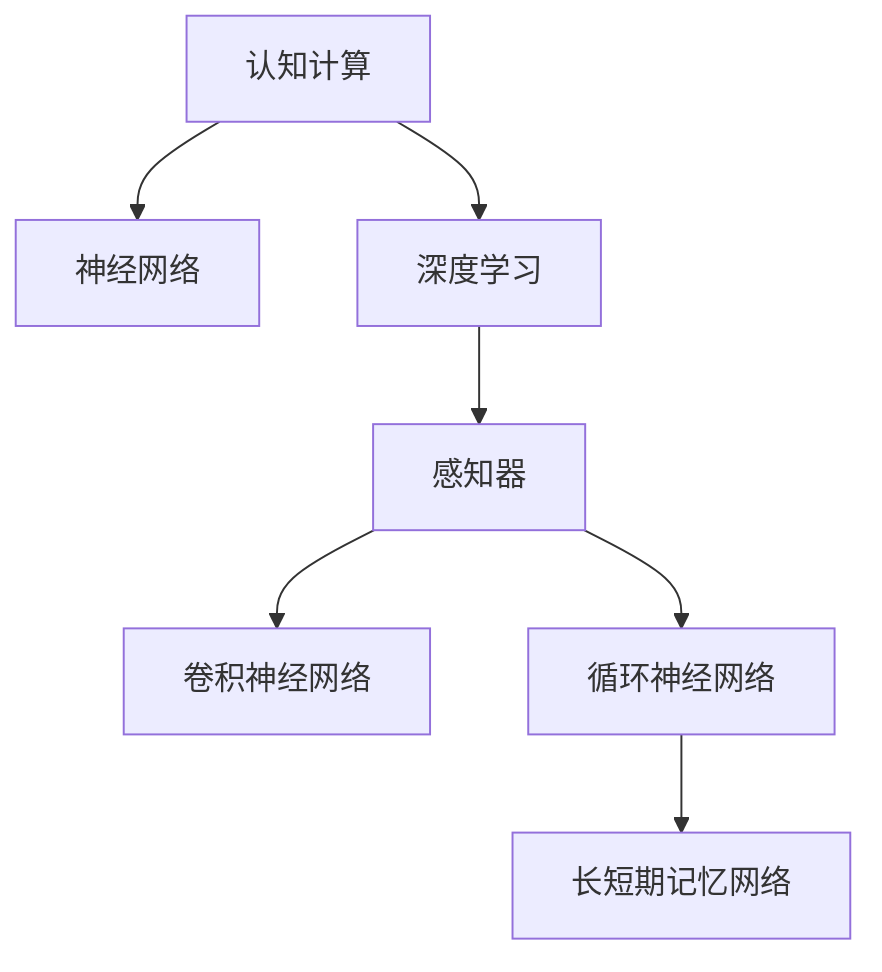

                 

# 认知计算：模拟人脑的新尝试

## 1. 背景介绍

### 1.1 问题由来

在过去的几十年中，人工智能（AI）和计算领域取得了巨大的进展，从最初的逻辑规则到复杂的机器学习算法，再到今天的人工神经网络。然而，尽管我们已经在处理和解析信息方面取得了显著进展，但在模拟人脑的认知能力方面仍面临巨大挑战。

### 1.2 问题核心关键点

认知计算旨在通过计算模拟人类大脑的认知功能，包括感知、记忆、学习、推理和决策等。这一领域的核心在于理解人类认知过程的底层机制，并将其转化为计算模型。近年来，随着计算能力的提升和数据的丰富，认知计算正在从概念走向实践，成为人工智能发展的重要方向。

### 1.3 问题研究意义

研究认知计算对于理解人类认知的本质、提升机器智能的水平，以及开发更高效、更灵活的AI系统具有重要意义：

1. **深化对认知机制的理解**：认知计算有助于揭示人类认知过程的复杂性和多样性，为人工智能的发展提供理论基础。
2. **提升机器智能水平**：通过模拟人脑的认知机制，AI系统能够更好地理解自然语言、图像、声音等多种模态的信息，提升处理复杂任务的能力。
3. **开发灵活的AI系统**：认知计算能够支持动态学习、自适应推理等功能，使AI系统能够更加灵活地应对变化多端的环境。
4. **推动人机协同**：通过理解人脑的认知过程，设计更加人性化、智能化的交互界面，增强人机协同的效果。

## 2. 核心概念与联系

### 2.1 核心概念概述

为更好地理解认知计算的核心原理，本节将介绍几个关键概念：

- **认知计算**：模拟人类大脑的认知过程，包括感知、记忆、学习、推理和决策等。通过计算模型来处理复杂的信息，实现人工智能系统的智能化。
- **神经网络**：由多个神经元（或节点）和连接（或边）组成的计算模型，用于模拟人脑的神经网络结构。
- **深度学习**：一种基于神经网络的机器学习方法，通过多层神经网络的组合，实现对复杂模式的识别和学习。
- **感知器**：最基本的神经网络单元，用于处理单个输入并输出一个简单的输出。
- **卷积神经网络（CNN）**：一种常用于图像识别和处理的神经网络模型，通过卷积操作提取图像特征。
- **循环神经网络（RNN）**：一种能够处理序列数据的神经网络模型，常用于自然语言处理和时间序列预测。
- **长短期记忆网络（LSTM）**：一种特殊的RNN，能够有效处理长序列数据，避免梯度消失问题。

这些概念之间的逻辑关系可以通过以下Mermaid流程图来展示：



这个流程图展示了几大核心概念之间的联系：

1. 认知计算依赖神经网络模型进行计算模拟。
2. 深度学习基于神经网络，通过多层组合实现复杂模式的识别。
3. 感知器是神经网络的基本单元，用于处理单个输入。
4. CNN常用于图像识别和处理，通过卷积操作提取特征。
5. RNN能够处理序列数据，常用于自然语言处理。
6. LSTM是RNN的一种，适合处理长序列数据。

## 3. 核心算法原理 & 具体操作步骤

### 3.1 算法原理概述

认知计算的核心算法原理可以概括为以下几个步骤：

1. **数据获取**：通过传感器、摄像头、麦克风等设备，获取人类大脑感知的输入信息，如声音、图像、文本等。
2. **特征提取**：使用感知器和神经网络，对输入信息进行特征提取，识别出有意义的特征。
3. **信息处理**：通过深度学习模型，对提取出的特征进行进一步处理，实现信息的识别、分类、推理等。
4. **决策与响应**：基于处理后的信息，使用决策模型进行决策，并生成响应输出。

### 3.2 算法步骤详解

1. **数据预处理**：将原始数据转换为神经网络可以处理的格式，包括数据清洗、归一化、标记化等。
2. **模型构建**：根据任务需求，选择合适的神经网络架构（如CNN、RNN、LSTM等），并定义模型参数和损失函数。
3. **模型训练**：使用标注数据对模型进行训练，通过反向传播算法更新模型参数，最小化损失函数。
4. **模型评估与优化**：在验证集上评估模型性能，根据评估结果调整模型结构和参数，优化模型效果。
5. **模型部署与监控**：将训练好的模型部署到实际应用中，并持续监控模型性能，确保系统稳定运行。

### 3.3 算法优缺点

认知计算的优点包括：

- **复杂模式识别**：深度学习模型能够处理复杂的模式，实现对语音、图像、文本等多种信息的高效识别。
- **自适应学习**：通过调整模型参数，认知计算系统能够自适应学习新信息，适应不断变化的环境。
- **灵活性高**：认知计算模型可以根据任务需求灵活调整，适用于多种场景。

然而，认知计算也存在一些局限性：

- **数据依赖性高**：认知计算依赖大量标注数据进行训练，标注数据的获取和质量直接影响模型的性能。
- **计算资源需求大**：深度学习模型需要大量的计算资源进行训练和推理，对硬件设备要求较高。
- **可解释性不足**：复杂的神经网络结构使得认知计算模型的决策过程难以解释，缺乏透明度。

### 3.4 算法应用领域

认知计算在多个领域中具有广泛的应用前景：

- **自然语言处理**：通过模拟人脑的感知和理解能力，实现文本分类、情感分析、机器翻译等功能。
- **计算机视觉**：使用CNN模型处理图像和视频数据，实现目标检测、图像分割、人脸识别等。
- **语音识别**：通过RNN和LSTM模型处理音频数据，实现语音识别、语音合成等。
- **机器人控制**：通过认知计算模型实现机器人的环境感知、路径规划、行为决策等功能。
- **自动驾驶**：结合计算机视觉和深度学习技术，实现自动驾驶系统的环境感知、路径规划、行为决策等功能。

## 4. 数学模型和公式 & 详细讲解 & 举例说明

### 4.1 数学模型构建

认知计算的数学模型通常包括：

- **感知器模型**：
  $$
  y = f(\sum_{i=1}^n w_i x_i + b)
  $$
  其中，$y$ 为输出，$x_i$ 为输入，$w_i$ 为权重，$b$ 为偏置，$f$ 为激活函数。

- **卷积神经网络（CNN）**：
  $$
  y = f(\sum_{i=1}^n (\sum_{j=1}^m w_{ij} * x_{ij} + b_i) + b)
  $$
  其中，$x_{ij}$ 为卷积核，$w_{ij}$ 为卷积核权重，$b_i$ 为卷积核偏置。

- **循环神经网络（RNN）**：
  $$
  h_{t+1} = \tanh(\sum_{i=1}^n w_i h_t + b) + \sum_{i=1}^n w_i x_i + b
  $$
  其中，$h_t$ 为隐藏状态，$w_i$ 为权重，$x_i$ 为输入。

### 4.2 公式推导过程

以感知器模型为例，推导其数学模型：

1. **输入信号的加权和**：
  $$
  z = \sum_{i=1}^n w_i x_i + b
  $$

2. **激活函数**：
  $$
  y = f(z)
  $$

3. **输出信号**：
  $$
  y = f(\sum_{i=1}^n w_i x_i + b)
  $$

通过这些公式，我们可以理解感知器模型的工作原理，即输入信号经过加权和后，通过激活函数得到输出。

### 4.3 案例分析与讲解

以图像识别为例，CNN模型处理图像数据的过程如下：

1. **数据预处理**：将图像数据进行归一化、标准化等处理，转换为神经网络可以处理的格式。
2. **卷积操作**：使用卷积核对图像数据进行卷积操作，提取图像特征。
3. **池化操作**：对卷积结果进行池化操作，减少特征图尺寸。
4. **全连接层**：将池化后的特征图输入全连接层，进行分类。
5. **输出层**：输出层通过Softmax函数，生成类别的概率分布。

CNN模型通过多层卷积和池化操作，逐步提取图像特征，并通过全连接层进行分类。这一过程可以看作是对图像信息的逐层处理，最终得到类别的概率分布。

## 5. 项目实践：代码实例和详细解释说明

### 5.1 开发环境搭建

在进行认知计算项目实践前，我们需要准备好开发环境。以下是使用Python进行PyTorch开发的环境配置流程：

1. 安装Anaconda：从官网下载并安装Anaconda，用于创建独立的Python环境。

2. 创建并激活虚拟环境：
```bash
conda create -n pytorch-env python=3.8 
conda activate pytorch-env
```

3. 安装PyTorch：根据CUDA版本，从官网获取对应的安装命令。例如：
```bash
conda install pytorch torchvision torchaudio cudatoolkit=11.1 -c pytorch -c conda-forge
```

4. 安装Transformers库：
```bash
pip install transformers
```

5. 安装各类工具包：
```bash
pip install numpy pandas scikit-learn matplotlib tqdm jupyter notebook ipython
```

完成上述步骤后，即可在`pytorch-env`环境中开始认知计算项目实践。

### 5.2 源代码详细实现

这里我们以图像分类任务为例，给出使用Transformers库对ResNet模型进行认知计算的PyTorch代码实现。

首先，定义数据预处理函数：

```python
from torchvision import transforms

transform = transforms.Compose([
    transforms.ToTensor(),
    transforms.Normalize(mean=[0.485, 0.456, 0.406], std=[0.229, 0.224, 0.225])
])
```

然后，定义模型和优化器：

```python
from torchvision.models import resnet50

model = resnet50(pretrained=True)

criterion = torch.nn.CrossEntropyLoss()
optimizer = torch.optim.Adam(model.parameters(), lr=0.001)
```

接着，定义训练和评估函数：

```python
import torch
from torch.utils.data import DataLoader

device = torch.device('cuda' if torch.cuda.is_available() else 'cpu')
model.to(device)

def train_epoch(model, dataset, batch_size, optimizer):
    model.train()
    for data, target in dataset:
        data, target = data.to(device), target.to(device)
        optimizer.zero_grad()
        output = model(data)
        loss = criterion(output, target)
        loss.backward()
        optimizer.step()
        yield loss.item()

def evaluate(model, dataset, batch_size):
    model.eval()
    correct = 0
    total = 0
    with torch.no_grad():
        for data, target in dataset:
            data, target = data.to(device), target.to(device)
            output = model(data)
            _, predicted = torch.max(output.data, 1)
            total += target.size(0)
            correct += (predicted == target).sum().item()
    print('Accuracy: %.2f %%' % (100 * correct / total))

train_dataset = ...
dev_dataset = ...
test_dataset = ...

batch_size = 32

train_loader = DataLoader(train_dataset, batch_size=batch_size, shuffle=True)
dev_loader = DataLoader(dev_dataset, batch_size=batch_size, shuffle=False)
test_loader = DataLoader(test_dataset, batch_size=batch_size, shuffle=False)

epochs = 10

for epoch in range(epochs):
    train_loss = 0
    for batch_idx, (data, target) in enumerate(train_loader):
        loss = train_epoch(model, dataset, batch_size, optimizer)
        train_loss += loss
    train_loss /= len(train_loader.dataset)
    print('Train Epoch: {} \t Loss: {:.6f}'.format(epoch+1, train_loss))

    evaluate(model, dev_loader, batch_size)
```

最后，启动训练流程并在测试集上评估：

```python
evaluate(model, test_loader, batch_size)
```

以上就是使用PyTorch对ResNet模型进行图像分类任务认知计算的完整代码实现。可以看到，得益于Transformers库的强大封装，我们可以用相对简洁的代码完成模型的加载和认知计算。

### 5.3 代码解读与分析

让我们再详细解读一下关键代码的实现细节：

**数据预处理函数**：
- `transform.Compose`：定义多个数据预处理步骤，包括将图像数据转换为Tensor格式，并进行标准化处理。

**模型和优化器**：
- `resnet50(pretrained=True)`：加载预训练的ResNet50模型。
- `torch.nn.CrossEntropyLoss()`：定义交叉熵损失函数，用于训练分类任务。
- `torch.optim.Adam()`：定义Adam优化器，用于更新模型参数。

**训练和评估函数**：
- `model.train()`：将模型设置为训练模式。
- `optimizer.zero_grad()`：清除梯度缓存。
- `output = model(data)`：前向传播，通过模型对输入数据进行处理。
- `loss = criterion(output, target)`：计算损失函数。
- `loss.backward()`：反向传播，计算梯度。
- `optimizer.step()`：更新模型参数。

**训练流程**：
- `for data, target in dataset`：遍历训练集。
- `data, target = data.to(device), target.to(device)`：将数据和标签转换为GPU上的Tensor。
- `optimizer.zero_grad()`：清除梯度缓存。
- `output = model(data)`：前向传播。
- `loss = criterion(output, target)`：计算损失。
- `loss.backward()`：反向传播。
- `optimizer.step()`：更新模型参数。

通过以上代码，我们可以看到，使用PyTorch和Transformers库进行认知计算任务非常便捷高效。开发者可以将更多精力放在数据处理、模型改进等高层逻辑上，而不必过多关注底层的实现细节。

当然，工业级的系统实现还需考虑更多因素，如模型的保存和部署、超参数的自动搜索、更灵活的任务适配层等。但核心的认知计算过程基本与此类似。

## 6. 实际应用场景

### 6.1 机器人导航

认知计算在机器人导航中的应用，主要体现在环境感知和路径规划方面。通过模拟人脑的感知能力，机器人能够识别和理解周围环境，实现自主导航。

在技术实现上，可以收集机器人所处环境的图像、声音和传感器数据，使用卷积神经网络（CNN）和循环神经网络（RNN）进行处理。CNN用于提取图像特征，RNN用于处理时间序列数据，如里程计、陀螺仪等传感器数据。通过这些网络模型的组合，机器人可以实时感知环境并规划路径。

### 6.2 医疗影像诊断

医疗影像诊断是认知计算在医疗领域的重要应用之一。通过模拟人脑的视觉和认知功能，认知计算系统能够自动分析医学影像，识别出病变区域和类型。

在实践中，可以将医学影像数据作为输入，使用卷积神经网络（CNN）进行特征提取，再通过全连接层进行分类。微调后的模型能够自动对影像进行标注，提高诊断的准确性和效率。同时，结合先验知识和专家经验，进一步提升诊断系统的智能水平。

### 6.3 自动驾驶

自动驾驶系统需要同时处理图像、声音、雷达等多种信息，实现对环境的感知、路径规划和决策。认知计算在这一领域具有广阔的应用前景。

在技术实现上，可以使用卷积神经网络（CNN）处理图像和视频数据，使用循环神经网络（RNN）处理雷达和声音数据。通过组合这些网络模型，系统能够实时感知环境并做出决策，实现自动驾驶。

### 6.4 未来应用展望

随着认知计算技术的不断发展，未来其在更多领域的应用将不断拓展，为人类认知智能的进化带来深远影响：

- **智慧医疗**：结合认知计算与医疗影像分析，构建智能诊断系统，提高医疗诊断的准确性和效率。
- **智能教育**：通过认知计算系统，实现个性化教学，因材施教，提升教育质量。
- **智慧城市**：构建智能交通、智能安防等系统，提升城市管理水平，创造更加安全、高效的城市环境。
- **虚拟助手**：通过认知计算技术，实现更加智能、自然的对话系统，提升人机交互体验。

## 7. 工具和资源推荐

### 7.1 学习资源推荐

为了帮助开发者系统掌握认知计算的理论基础和实践技巧，这里推荐一些优质的学习资源：

1. **《深度学习》课程**：由斯坦福大学开设的深度学习课程，全面介绍了深度学习的基本概念和常用模型。

2. **《认知计算导论》书籍**：全面介绍了认知计算的基本原理和实际应用，适合入门学习。

3. **Transformers官方文档**：提供了大量的预训练模型和认知计算示例代码，是实践学习的好资源。

4. **Coursera认知计算课程**：由世界顶尖大学和机构提供的认知计算课程，深入浅出地讲解认知计算技术。

5. **arXiv预印本**：收录了大量认知计算领域的最新研究论文，是了解前沿技术的好去处。

通过对这些资源的学习实践，相信你一定能够快速掌握认知计算的精髓，并用于解决实际的认知计算问题。

### 7.2 开发工具推荐

高效的开发离不开优秀的工具支持。以下是几款用于认知计算开发的常用工具：

1. **PyTorch**：基于Python的开源深度学习框架，灵活的计算图，适合快速迭代研究。

2. **TensorFlow**：由Google主导开发的开源深度学习框架，生产部署方便，适合大规模工程应用。

3. **Transformers库**：HuggingFace开发的NLP工具库，集成了众多SOTA认知计算模型，支持PyTorch和TensorFlow。

4. **TensorBoard**：TensorFlow配套的可视化工具，可实时监测模型训练状态，提供丰富的图表呈现方式。

5. **Weights & Biases**：模型训练的实验跟踪工具，可以记录和可视化模型训练过程中的各项指标。

合理利用这些工具，可以显著提升认知计算的开发效率，加快创新迭代的步伐。

### 7.3 相关论文推荐

认知计算领域的研究方兴未艾，以下是几篇奠基性的相关论文，推荐阅读：

1. **《深度学习》论文**：由Yann LeCun等人发表的深度学习领域奠基性论文，介绍了深度学习的概念和应用。

2. **《卷积神经网络》论文**：由LeNet-5论文，引入了卷积神经网络，广泛应用于图像识别和处理。

3. **《循环神经网络》论文**：由Hochreiter和Schmidhuber等人发表的循环神经网络论文，介绍了RNN的基本原理和应用。

4. **《长短期记忆网络》论文**：由Hochreiter和Schmidhuber等人发表的长短期记忆网络论文，解决了RNN在长序列处理中的梯度消失问题。

5. **《认知计算导论》书籍**：全面介绍了认知计算的基本原理和实际应用，适合深入学习。

这些论文代表了大认知计算的发展脉络。通过学习这些前沿成果，可以帮助研究者把握学科前进方向，激发更多的创新灵感。

## 8. 总结：未来发展趋势与挑战

### 8.1 总结

本文对认知计算的基本原理和实践进行了全面系统的介绍。首先阐述了认知计算的研究背景和意义，明确了认知计算在模拟人脑认知过程方面的独特价值。其次，从原理到实践，详细讲解了认知计算的数学模型和算法流程，给出了认知计算任务开发的完整代码实例。同时，本文还广泛探讨了认知计算在机器人导航、医疗影像诊断、自动驾驶等领域的实际应用前景，展示了认知计算技术的广阔应用空间。

通过本文的系统梳理，可以看到，认知计算正成为人工智能发展的重要方向，极大地拓展了人工智能系统的认知能力和智能化水平，为人类认知智能的进化提供了新的路径。未来，伴随认知计算技术的不断进步，相信人工智能系统将能够更好地理解自然语言、图像、声音等多种模态的信息，实现更加智能化、个性化的应用。

### 8.2 未来发展趋势

展望未来，认知计算技术将呈现以下几个发展趋势：

1. **多模态融合**：结合视觉、听觉、触觉等多种模态信息，实现更为全面和复杂的认知模拟。
2. **分布式计算**：通过分布式计算技术，提高认知计算系统的计算能力和处理效率。
3. **自适应学习**：通过引入自适应学习算法，实现认知计算系统的动态调整和优化。
4. **跨领域应用**：将认知计算技术应用于更多领域，如教育、医疗、城市管理等，提升各领域的智能化水平。
5. **人机协同**：通过认知计算技术与自然语言处理、计算机视觉等技术的结合，实现更加智能、自然的交互界面。

以上趋势凸显了认知计算技术的广阔前景。这些方向的探索发展，必将进一步提升人工智能系统的认知能力和应用范围，为人类认知智能的进化带来深远影响。

### 8.3 面临的挑战

尽管认知计算技术已经取得了显著进展，但在迈向更加智能化、普适化应用的过程中，它仍面临着诸多挑战：

1. **数据依赖性高**：认知计算依赖大量标注数据进行训练，标注数据的获取和质量直接影响模型的性能。
2. **计算资源需求大**：深度学习模型需要大量的计算资源进行训练和推理，对硬件设备要求较高。
3. **可解释性不足**：复杂的神经网络结构使得认知计算模型的决策过程难以解释，缺乏透明度。
4. **模型鲁棒性不足**：当前认知计算模型面对域外数据时，泛化性能往往大打折扣。
5. **安全性有待保障**：预训练模型难免会学习到有偏见、有害的信息，通过认知计算传递到下游任务，产生误导性、歧视性的输出。

解决这些挑战需要多方面的努力，包括数据标注、模型优化、硬件改进、伦理审查等。

### 8.4 研究展望

面向未来，认知计算技术需要在以下几个方面寻求新的突破：

1. **无监督学习**：探索无监督和半监督学习算法，降低对标注数据的依赖，提高模型泛化性。
2. **参数高效学习**：开发更加参数高效的认知计算方法，减少计算资源消耗，提高系统效率。
3. **多模态融合**：结合视觉、听觉、触觉等多种模态信息，实现更为全面和复杂的认知模拟。
4. **人机协同**：通过认知计算技术与自然语言处理、计算机视觉等技术的结合，实现更加智能、自然的交互界面。

这些研究方向将进一步拓展认知计算技术的应用空间，提升人工智能系统的智能化水平，为人类认知智能的进化带来深远影响。

## 9. 附录：常见问题与解答

**Q1：认知计算是否适用于所有NLP任务？**

A: 认知计算在自然语言处理（NLP）领域具有广泛的应用前景，特别是对于需要理解复杂语言结构和逻辑的任务，如文本分类、情感分析、机器翻译等。但对于一些特定领域的任务，如医学、法律等，需要结合领域知识进行更深入的处理。

**Q2：认知计算模型如何处理长序列数据？**

A: 长序列数据的处理是认知计算中的一个难点。循环神经网络（RNN）和长短期记忆网络（LSTM）是常用的模型，能够处理长序列数据，并避免梯度消失问题。通过多层RNN或LSTM的组合，可以有效地处理大规模序列数据。

**Q3：认知计算模型的可解释性如何提升？**

A: 提升认知计算模型的可解释性是一个重要的研究方向。可以通过引入符号化知识图谱、逻辑规则等，引导认知计算模型进行推理，提高决策过程的透明度和可解释性。同时，使用可视化工具如TensorBoard等，也可以帮助理解模型的内部工作机制。

**Q4：认知计算模型在实际应用中面临哪些挑战？**

A: 认知计算模型在实际应用中面临以下挑战：
1. **数据依赖性高**：依赖大量标注数据进行训练，标注数据的获取和质量直接影响模型的性能。
2. **计算资源需求大**：深度学习模型需要大量的计算资源进行训练和推理，对硬件设备要求较高。
3. **可解释性不足**：复杂的神经网络结构使得认知计算模型的决策过程难以解释，缺乏透明度。
4. **模型鲁棒性不足**：当前认知计算模型面对域外数据时，泛化性能往往大打折扣。
5. **安全性有待保障**：预训练模型难免会学习到有偏见、有害的信息，通过认知计算传递到下游任务，产生误导性、歧视性的输出。

**Q5：认知计算模型如何应用于智慧医疗？**

A: 认知计算模型在智慧医疗中的应用，主要体现在医学影像分析和医疗知识推理两个方面。通过模拟人脑的视觉和认知功能，认知计算系统能够自动分析医学影像，识别出病变区域和类型。同时，结合先验知识和专家经验，进一步提升诊断系统的智能水平。

---

作者：禅与计算机程序设计艺术 / Zen and the Art of Computer Programming

