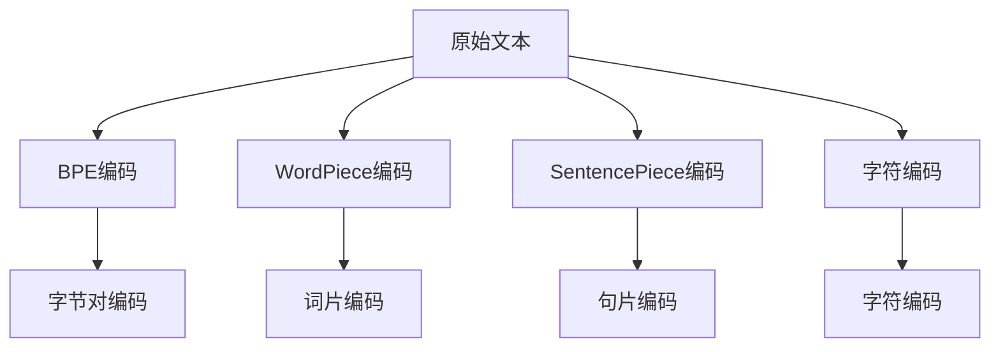

                 

# 词元化策略：BPE、WordPiece和SentencePiece比较

> 关键词：词元化，BPE, WordPiece, SentencePiece, 文本处理, 自然语言处理(NLP)

## 1. 背景介绍

在自然语言处理(Natural Language Processing, NLP)领域，词元化（Wordpiece Tokenization）技术是将原始文本转化为机器学习模型可处理的序列，为NLP任务提供了重要的预处理步骤。其中，Byte Pair Encoding（BPE, 字节对编码）、WordPiece（词片）和SentencePiece（句片）是当前最流行的三种词元化策略。它们各自有着不同的设计理念和特点，适用于不同的应用场景。本文将系统介绍这三种词元化策略，并对它们进行比较，以帮助开发者选择合适的词元化工具。

## 2. 核心概念与联系

### 2.1 核心概念概述

- **词元化（Wordpiece Tokenization）**：将连续的原始文本转换为分词序列的过程，是机器学习模型处理文本数据的前提。

- **Byte Pair Encoding (BPE)**：一种基于字节的编码方法，将文本划分为字节对，并用字节对编码。BPE通常用于处理低资源语言和字符集多样化的文本。

- **WordPiece**：一种基于词的编码方法，将文本分割为最长的未定义词和剩余的字符，并用前缀和后缀组合成词。WordPiece通常用于处理通用语言和字符集较少的文本。

- **SentencePiece**：一种基于子词的编码方法，将文本切分为子词序列，并用子词编码。SentencePiece支持更高效的编码和解码，适用于大规模语言模型和任务。

- **字符编码（Character Encoding）**：将字符序列直接转换为编码序列，适用于字符集固定且不复杂的情况。

### 2.2 核心概念原理和架构的 Mermaid 流程图



该图表展示了四种不同的编码方法，从左至右依次为BPE、WordPiece、SentencePiece和字符编码。箭头表示数据流的方向，从原始文本开始，依次通过这四种编码方法。

## 3. 核心算法原理 & 具体操作步骤

### 3.1 算法原理概述

词元化策略的核心目标是将文本序列划分为一个个有意义的单元，以便机器学习模型能够处理和理解。不同的词元化方法在实现这一目标时有着不同的策略和实现方式。

- **BPE**：BPE通过将文本序列中相邻的字节对视为一个编码单元，从而实现子词划分。BPE使用统计模型训练出最常见的字节对，并根据出现频率将它们合并为更高级的编码单元。

- **WordPiece**：WordPiece通过将文本序列分割为最长的未定义词和剩余的字符，并用前缀和后缀组合成词。WordPiece支持不同长度的未定义词，但可能会增加额外的噪声。

- **SentencePiece**：SentencePiece采用动态子词划分策略，根据统计模型训练出最有效的子词集合。SentencePiece不仅支持高效的编码和解码，还能够在训练过程中动态调整编码单元。

### 3.2 算法步骤详解

以BPE为例，其具体实现步骤如下：

1. **训练数据预处理**：收集大量的文本数据，并进行清理和预处理，如去除停用词、标点符号等。

2. **字节对训练**：使用统计模型训练出最常见的字节对，并进行合并。合并规则通常基于字符频率和相邻字符出现的频率。

3. **编码应用**：将训练得到的编码表应用于原始文本，将其转换为字节对编码序列。

4. **解码转换**：在需要时，将字节对编码序列解码回原始文本。

WordPiece和SentencePiece的实现步骤类似，但WordPiece在合并编码单元时，会考虑更多前缀和后缀的组合，而SentencePiece则采用动态子词划分策略，能够根据文本序列动态生成最有效的子词集合。

### 3.3 算法优缺点

- **BPE**：
  - **优点**：
    - 能够处理低资源语言和字符集多样化的文本。
    - 支持高效的编码和解码，编码单元稳定。
    - 可以通过合并字节对的方式减少噪声。
  - **缺点**：
    - 对于长文本，编码单元可能较长，导致解码效率降低。
    - 需要额外的合并步骤，增加了训练和实现的复杂度。

- **WordPiece**：
  - **优点**：
    - 支持不同长度的未定义词，能够处理多种字符集和语言。
    - 可以灵活控制编码单元的长度。
    - 对长文本的编码效率较高。
  - **缺点**：
    - 合并前缀和后缀可能导致噪声增加，影响模型的性能。
    - 对于低资源语言，可能需要额外的训练数据。

- **SentencePiece**：
  - **优点**：
    - 支持高效的编码和解码，编码单元稳定。
    - 支持动态子词划分，能够根据文本序列生成最有效的编码单元。
    - 适用于大规模语言模型和任务。
  - **缺点**：
    - 训练过程中需要大量的文本数据，训练时间较长。
    - 编码单元较复杂，增加了模型的复杂度。

### 3.4 算法应用领域

- **BPE**：适用于低资源语言和字符集多样化的文本处理，如中文分词、低资源语言的机器翻译等。

- **WordPiece**：适用于通用语言和字符集较少的文本处理，如英文分词、通用语言的机器翻译等。

- **SentencePiece**：适用于大规模语言模型和任务，如通用语言的预训练、机器翻译等。

## 4. 数学模型和公式 & 详细讲解 & 举例说明

### 4.1 数学模型构建

词元化策略的数学模型主要涉及两个部分：编码和解码。

1. **编码**：将原始文本序列 $X$ 转换为编码序列 $X'$。
2. **解码**：将编码序列 $X'$ 解码回原始文本序列 $X$。

以BPE为例，编码模型可以表示为：

$$
X' = f_{\text{BPE}}(X)
$$

其中，$f_{\text{BPE}}$ 表示BPE编码函数。解码模型可以表示为：

$$
X = g_{\text{BPE}}(X')
$$

其中，$g_{\text{BPE}}$ 表示BPE解码函数。

### 4.2 公式推导过程

以BPE为例，其编码公式可以表示为：

$$
X' = \bigcup_{i=1}^{n} x_i
$$

其中，$x_i$ 表示BPE编码后的第 $i$ 个编码单元。解码公式可以表示为：

$$
X = \bigcup_{i=1}^{m} y_i
$$

其中，$y_i$ 表示BPE解码后的第 $i$ 个解码单元。

### 4.3 案例分析与讲解

假设原始文本为 "Hello world"，BPE训练得到的编码表为 {"H", "e", "l", "o", "w", "or", "ld", "lo"}。

- **编码**：
  - "Hello world" 转换为编码序列为 "Helo world"。
- **解码**：
  - 编码序列 "Helo world" 解码回原始文本 "Hello world"。

WordPiece和SentencePiece的编码和解码公式类似，但WordPiece在合并编码单元时，会考虑更多的前缀和后缀组合，而SentencePiece则根据文本序列动态生成最有效的编码单元。

## 5. 项目实践：代码实例和详细解释说明

### 5.1 开发环境搭建

在进行词元化实践前，我们需要准备好开发环境。以下是使用Python进行spaCy开发的Python环境配置流程：

1. 安装Anaconda：从官网下载并安装Anaconda，用于创建独立的Python环境。

2. 创建并激活虚拟环境：
```bash
conda create -n spaCy-env python=3.8 
conda activate spaCy-env
```

3. 安装spaCy：从官网获取安装命令。例如：
```bash
conda install spacy -c conda-forge
```

4. 下载和安装预训练模型：
```bash
python -m spacy download en_core_web_sm
```

5. 安装SentencePiece：
```bash
pip install sentencepiece
```

完成上述步骤后，即可在`spaCy-env`环境中开始词元化实践。

### 5.2 源代码详细实现

下面我们以SentencePiece为例，给出使用spaCy进行词元化的PyTorch代码实现。

```python
import spacy
import sentencepiece as spm

# 加载英文模型
nlp = spacy.load('en_core_web_sm')

# 加载SentencePiece模型
sp_model = spm.SentencePieceProcessor()
sp_model.Load('m.model')

# 定义输入文本
text = "Hello world"

# 将原始文本转换为编码序列
encoded_text = sp_model.EncodeAsPieces(text)

# 解码编码序列
decoded_text = sp_model.DecodePieces(encoded_text)
```

### 5.3 代码解读与分析

让我们再详细解读一下关键代码的实现细节：

**spacy加载模型**：
- `spacy.load('en_core_web_sm')`：加载英文小模型，用于分词和词元化。

**SentencePiece模型加载**：
- `spm.SentencePieceProcessor().Load('m.model')`：加载预训练的SentencePiece模型，用于词元化。

**输入文本处理**：
- `text = "Hello world"`：定义输入的原始文本。

**编码**：
- `sp_model.EncodeAsPieces(text)`：使用SentencePiece模型将原始文本转换为编码序列。

**解码**：
- `sp_model.DecodePieces(encoded_text)`：将编码序列解码回原始文本。

可以看到，使用spaCy和SentencePiece进行词元化，代码实现相对简洁高效。开发者可以更加专注于数据处理和算法优化。

## 6. 实际应用场景

### 6.1 机器翻译

词元化技术在机器翻译（Machine Translation, MT）中起着关键作用。机器翻译模型通常需要将源语言文本转换为编码序列，然后再解码为目标语言文本。不同的词元化策略会影响编码和解码的效率和效果。

- **BPE**：适用于低资源语言的机器翻译，能够处理字符集多样化的文本。
- **WordPiece**：适用于通用语言的机器翻译，支持不同长度的未定义词。
- **SentencePiece**：适用于大规模语言模型和机器翻译，支持高效的编码和解码。

### 6.2 文本分类

词元化技术在文本分类（Text Classification）中也具有重要作用。文本分类模型通常需要将原始文本转换为编码序列，并输入模型进行分类。不同的词元化策略会影响模型的训练效果和推理速度。

- **BPE**：适用于字符集多样化的文本分类任务。
- **WordPiece**：适用于通用语言和字符集较少的文本分类任务。
- **SentencePiece**：适用于大规模语言模型和文本分类任务。

### 6.3 命名实体识别

词元化技术在命名实体识别（Named Entity Recognition, NER）中也起到重要作用。命名实体识别模型通常需要将原始文本转换为编码序列，并标注出其中的命名实体。不同的词元化策略会影响编码的效率和实体的识别精度。

- **BPE**：适用于低资源语言的命名实体识别任务。
- **WordPiece**：适用于通用语言和字符集较少的命名实体识别任务。
- **SentencePiece**：适用于大规模语言模型和命名实体识别任务。

### 6.4 未来应用展望

随着词元化技术的发展，未来将在更多领域得到应用，为自然语言处理带来新的突破。

- **多语言处理**：词元化技术将支持更多语言的处理，为跨语言的文本处理和翻译提供更高效的方法。
- **跨模态处理**：词元化技术将支持跨模态数据的处理，如文本-图像联合学习，提升跨模态模型的效果。
- **嵌入式词元化**：词元化技术将嵌入到模型训练过程中，实现更紧密的模型和词元化融合，提升模型的训练效果。
- **自适应词元化**：词元化技术将根据文本数据的特征，自适应生成最优的编码单元，提升模型的泛化能力。

## 7. 工具和资源推荐

### 7.1 学习资源推荐

为了帮助开发者系统掌握词元化技术，这里推荐一些优质的学习资源：

1. **spaCy官方文档**：spaCy官方文档详细介绍了词元化、分词和标注等核心功能，是学习和使用的必备资源。

2. **《自然语言处理综论》**：自然语言处理领域的经典教材，涵盖了词元化、分词、标注等多种技术，适合系统学习。

3. **《深度学习实战》**：深度学习领域的实战指南，介绍了机器翻译、文本分类、命名实体识别等多种NLP任务，并展示了词元化技术的应用。

4. **《Python深度学习》**：深度学习领域的权威指南，详细介绍了机器学习、深度学习、自然语言处理等技术，并展示了多种词元化方法。

5. **arXiv.org**：自然语言处理领域的顶级论文库，定期发布最新的研究成果和算法，适合跟踪最新技术动态。

### 7.2 开发工具推荐

高效的开发离不开优秀的工具支持。以下是几款用于词元化开发的常用工具：

1. spaCy：自然语言处理领域的主流工具，提供了分词、词元化、标注等多种功能，支持多种语言和预训练模型。

2. SentencePiece：Facebook开源的词元化工具，支持高效的编码和解码，适用于大规模语言模型和任务。

3. BPE：开源的BPE实现，支持高效的编码和解码，适用于低资源语言和字符集多样化的文本处理。

4. Tokenizer：HuggingFace开发的词元化工具，支持多种语言和词元化方法，适合开发和研究。

5. NLTK：自然语言处理领域的经典库，提供了分词、词元化、标注等多种功能，适合学习和研究。

6. Stanford CoreNLP：斯坦福大学开发的自然语言处理工具，支持分词、词元化、标注等多种功能，适合研究和开发。

### 7.3 相关论文推荐

词元化技术的发展源于学界的持续研究。以下是几篇奠基性的相关论文，推荐阅读：

1. **WordPiece Tokenization**：由Google开发的WordPiece词元化方法，适用于通用语言和字符集较少的文本处理。

2. **SentencePiece**：由Facebook开发的SentencePiece词元化方法，适用于大规模语言模型和任务。

3. **Byte Pair Encoding**：由Hubert Li和Erich Elsen提出的BPE词元化方法，适用于低资源语言和字符集多样化的文本处理。

4. **FastText**：由Facebook开发的FastText词元化方法，适用于字符集多样化的文本处理。

5. **NLPIR**：自然语言处理研究院（NLPIR）开发的中文分词和词元化方法，适用于中文分词和词元化。

这些论文代表了大词元化技术的发展脉络，通过学习这些前沿成果，可以帮助研究者把握学科前进方向，激发更多的创新灵感。

## 8. 总结：未来发展趋势与挑战

### 8.1 总结

本文对词元化技术进行了全面系统的介绍。首先阐述了词元化技术的基本概念和核心方法，包括BPE、WordPiece和SentencePiece三种词元化策略。然后通过比较这三种策略，给出了不同应用场景下的选择建议。最后，本文展望了词元化技术的未来发展方向，并指出了当前面临的挑战。

通过本文的系统梳理，可以看到，词元化技术在自然语言处理中具有重要的地位，是处理文本数据的前提。BPE、WordPiece和SentencePiece三种策略各有优缺点，适用于不同的应用场景。未来，随着技术的不断进步，词元化技术将进一步提高自然语言处理的效率和效果，为自然语言处理带来新的突破。

### 8.2 未来发展趋势

展望未来，词元化技术将呈现以下几个发展趋势：

1. **多语言支持**：随着语言模型的多样化，词元化技术将支持更多语言的处理，提升跨语言文本处理的能力。

2. **跨模态融合**：词元化技术将支持跨模态数据的处理，如文本-图像联合学习，提升跨模态模型的效果。

3. **自适应调整**：词元化技术将根据文本数据的特征，自适应生成最优的编码单元，提升模型的泛化能力。

4. **嵌入式优化**：词元化技术将嵌入到模型训练过程中，实现更紧密的模型和词元化融合，提升模型的训练效果。

5. **自动化生成**：词元化技术将通过自动化生成方式，提高生成效率和模型性能。

### 8.3 面临的挑战

尽管词元化技术已经取得了显著成就，但在迈向更加智能化、普适化应用的过程中，仍面临以下挑战：

1. **资源消耗**：词元化技术需要大量的计算资源和内存，对于大规模数据集的处理，可能带来资源消耗过大的问题。

2. **模型复杂度**：不同的词元化策略带来了不同的模型复杂度，需要在性能和复杂度之间进行权衡。

3. **数据标注**：词元化技术需要大量的标注数据，数据标注成本较高，可能限制其在大规模数据集上的应用。

4. **算法复杂性**：词元化算法的实现复杂度较高，需要进行大量的试验和调参。

5. **模型泛化能力**：词元化技术需要在不同数据集上具有较好的泛化能力，避免过拟合现象。

6. **可解释性**：词元化技术的内部机制和实现方式复杂，难以解释其推理过程和决策逻辑。

### 8.4 研究展望

面对词元化技术所面临的挑战，未来的研究需要在以下几个方面寻求新的突破：

1. **资源优化**：开发更高效的词元化算法，降低计算资源和内存消耗。

2. **模型简化**：简化词元化算法的实现方式，降低模型复杂度。

3. **自动化生成**：探索自动化生成词元化策略，提高生成效率和模型性能。

4. **数据增强**：通过数据增强技术，提高词元化模型的泛化能力。

5. **模型可解释性**：研究词元化技术的可解释性，提高模型的透明度和可解释性。

6. **多语言支持**：研究多语言词元化方法，支持更多语言的处理和融合。

这些研究方向将引领词元化技术迈向更高的台阶，为自然语言处理带来新的突破。只有勇于创新、敢于突破，才能不断拓展自然语言处理的边界，让智能技术更好地造福人类社会。

## 9. 附录：常见问题与解答

**Q1: 什么是词元化（Wordpiece Tokenization）技术？**

A: 词元化是将连续的原始文本转换为机器学习模型可处理的序列，是自然语言处理的重要预处理步骤。它将原始文本序列分割成一个个有意义的单元，以便机器学习模型能够处理和理解。

**Q2: 什么是BPE、WordPiece和SentencePiece？**

A: BPE、WordPiece和SentencePiece是当前最流行的三种词元化策略，它们各自有着不同的设计理念和特点，适用于不同的应用场景。

- BPE：基于字节的编码方法，将文本划分为字节对，并用字节对编码。
- WordPiece：基于词的编码方法，将文本分割为最长的未定义词和剩余的字符，并用前缀和后缀组合成词。
- SentencePiece：基于子词的编码方法，将文本切分为子词序列，并用子词编码。

**Q3: 三种词元化策略的优缺点是什么？**

A: BPE、WordPiece和SentencePiece各有优缺点，适用于不同的应用场景。

- BPE：优点：能够处理低资源语言和字符集多样化的文本；支持高效的编码和解码；编码单元稳定。缺点：对于长文本，编码单元可能较长，导致解码效率降低；需要额外的合并步骤，增加了训练和实现的复杂度。
- WordPiece：优点：支持不同长度的未定义词；能够处理多种字符集和语言；对长文本的编码效率较高。缺点：合并前缀和后缀可能导致噪声增加，影响模型的性能；对于低资源语言，可能需要额外的训练数据。
- SentencePiece：优点：支持高效的编码和解码；支持动态子词划分，能够根据文本序列生成最有效的编码单元；适用于大规模语言模型和任务。缺点：训练过程中需要大量的文本数据，训练时间较长；编码单元较复杂，增加了模型的复杂度。

**Q4: 词元化技术在机器翻译中起什么作用？**

A: 词元化技术在机器翻译中起着关键作用。机器翻译模型通常需要将源语言文本转换为编码序列，然后再解码为目标语言文本。不同的词元化策略会影响编码和解码的效率和效果。

**Q5: 如何选择合适的词元化策略？**

A: 选择合适的词元化策略需要考虑多个因素，包括数据集大小、文本长度、语言特点等。

- 对于字符集多样的低资源语言，可以选择BPE词元化策略。
- 对于通用语言和字符集较少的文本，可以选择WordPiece词元化策略。
- 对于大规模语言模型和任务，可以选择SentencePiece词元化策略。

总之，选择合适的词元化策略需要根据具体应用场景和需求进行权衡。

---

作者：禅与计算机程序设计艺术 / Zen and the Art of Computer Programming

