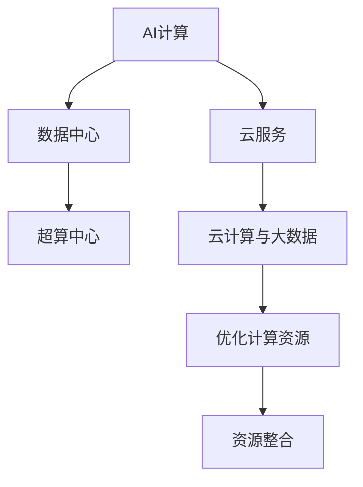

                 

# 贾扬清创业机遇：AI计算需求演进，云服务整合机会

> 关键词：AI计算,云服务,创业机遇,数据中心,集成电路,超算中心,云计算,大数据

## 1. 背景介绍

### 1.1 问题由来

在人工智能(AI)行业发展迅猛的今天，计算能力成为了AI技术进步的瓶颈之一。无论是模型训练还是推理应用，都离不开强大的计算资源支持。如何更高效地利用计算资源，成为了各大AI公司关注的焦点。其中，云计算和数据中心的集成和优化成为热点话题。

### 1.2 问题核心关键点

当前AI计算需求呈现出快速增长的趋势，主要驱动力包括：

- **深度学习的广泛应用**：深度学习模型的训练和推理需要庞大的计算资源，推动了对AI计算需求的持续增长。
- **数据量的激增**：随着物联网、社交媒体、网络视频等数据源的爆发，数据中心存储和计算需求急剧上升。
- **AI应用的多样化**：从自动驾驶、语音识别到金融预测，各行业对AI技术的需求日益丰富，促进了AI计算资源的共享和整合。

如何在现有的数据中心和云服务基础上，进行有效的计算资源整合，提高AI计算效率，成为了各大AI公司的重点关注领域。本文将探讨如何通过优化AI计算资源、整合云服务，抓住创业机遇，构建未来的AI基础设施。

## 2. 核心概念与联系

### 2.1 核心概念概述

为更好地理解AI计算需求和云服务整合的机会，本节将介绍几个关键概念：

- **AI计算**：涉及深度学习模型训练和推理的计算需求，包括GPU、TPU等专用计算资源。
- **云服务**：通过云计算平台提供计算资源和软件服务的模式，如AWS、阿里云、华为云等。
- **数据中心**：大规模计算和存储设施，包含服务器、存储设备、网络设备等，是AI计算的主要承载体。
- **超算中心**：具有超大规模计算和存储能力的高级数据中心，支持大规模科学计算和AI计算需求。
- **云计算与大数据**：结合AI计算需求和数据存储需求，通过分布式计算和存储技术，优化计算资源利用率。

这些概念之间的逻辑关系可以通过以下Mermaid流程图来展示：



这个流程图展示了大规模AI计算需求与数据中心、云服务、超算中心等基础设施之间的关联。通过这些基础设施的优化整合，可以实现更高效的AI计算和数据处理。

## 3. 核心算法原理 & 具体操作步骤

### 3.1 算法原理概述

AI计算需求的演进和云服务的整合，本质上是如何在现有的计算基础设施上，实现资源的优化和整合。这一过程可以分为以下几个关键步骤：

1. **计算资源优化**：通过技术手段提升计算资源的使用效率，如数据中心和超算中心的性能优化、云计算平台资源调度等。
2. **数据中心整合**：将多个数据中心进行整合，构建统一的基础设施平台，实现资源的统一管理和调度。
3. **云服务集成**：将AI计算和数据处理功能集成到云服务中，通过API接口提供给用户，实现服务的高可用性和可扩展性。
4. **AI计算与大数据的结合**：通过大数据技术，如Hadoop、Spark等，对AI计算需求进行分析和预测，优化资源配置。

### 3.2 算法步骤详解

#### 3.2.1 计算资源优化

**优化目标**：提升计算资源的使用效率，降低能耗和运营成本。

**优化手段**：
- **性能优化**：通过硬件升级和软件优化，提升数据中心和超算中心的计算性能。例如，引入最新的计算芯片，如NVIDIA的A100 GPU，Google的TPU等。
- **能效优化**：采用先进的数据中心设计，如液冷、风冷、分布式供电等，减少能耗。
- **负载均衡**：通过负载均衡算法，将计算任务分配到最优的计算节点上，避免资源浪费。

#### 3.2.2 数据中心整合

**整合目标**：实现计算资源和存储资源的统一管理和调度，提高资源利用率。

**整合手段**：
- **统一管理平台**：搭建统一的数据中心管理平台，实现资源的集中管理和调度。例如，使用Kubernetes、OpenStack等。
- **网络优化**：通过网络优化技术，如SDN、NFV等，实现网络的高效连接和数据传输。
- **虚拟化技术**：采用虚拟化技术，如VMware、VirtualBox等，实现资源的灵活分配和迁移。

#### 3.2.3 云服务集成

**集成目标**：将AI计算和数据处理功能集成到云服务中，提供高效、可扩展的服务。

**集成手段**：
- **API接口**：将AI计算和数据处理功能封装为API接口，供用户调用。例如，AWS SageMaker提供深度学习模型训练和推理的API接口。
- **容器化技术**：采用Docker等容器化技术，实现应用的快速部署和扩展。
- **微服务架构**：采用微服务架构，将复杂的系统拆分为多个小模块，提高系统的可扩展性和可维护性。

#### 3.2.4 AI计算与大数据的结合

**结合目标**：通过大数据技术，对AI计算需求进行分析和预测，优化资源配置。

**结合手段**：
- **数据采集与分析**：采用Hadoop、Spark等大数据技术，对计算需求进行分析和预测，优化资源配置。
- **实时监控与调度**：通过实时监控和调度系统，如Prometheus、Grafana等，对计算资源进行动态调整和优化。
- **机器学习优化**：采用机器学习技术，优化AI计算的模型和算法，提高计算效率。

### 3.3 算法优缺点

**优点**：
- **效率提升**：通过优化计算资源和整合云服务，提升计算资源的利用效率，降低能耗和运营成本。
- **资源灵活性**：通过统一管理和调度，实现资源的灵活分配和迁移。
- **服务可扩展性**：通过云服务集成，提供高效、可扩展的服务，满足用户需求。
- **数据驱动优化**：通过大数据分析，优化资源配置，提高计算效率。

**缺点**：
- **初始投入高**：建设数据中心和超算中心需要较高的初始投资。
- **技术复杂性**：优化和整合过程中涉及的技术较多，需要较高的技术水平。
- **数据隐私和安全**：大规模数据集中存储和处理，存在数据隐私和安全问题。

### 3.4 算法应用领域

AI计算需求和云服务整合技术，在多个领域得到了广泛应用：

- **自动驾驶**：通过优化计算资源和整合云服务，支持大规模自动驾驶模拟训练和实时推理。
- **语音识别**：通过优化计算资源和整合云服务，支持实时语音识别和自然语言处理。
- **金融预测**：通过优化计算资源和整合云服务，支持大规模金融数据处理和预测模型训练。
- **医疗健康**：通过优化计算资源和整合云服务，支持大规模医疗数据处理和诊断模型训练。
- **智能制造**：通过优化计算资源和整合云服务，支持大规模工业数据分析和预测模型训练。

这些领域对AI计算资源的需求量大，通过优化和整合云服务，可以有效提升计算效率，降低成本。

## 4. 数学模型和公式 & 详细讲解 & 举例说明

### 4.1 数学模型构建

假设一个AI任务需要计算资源 $C$ 个，成本为 $C_0$，使用优化后的资源后，计算成本降低至 $C_1$，则资源优化带来的成本节约率为：

$$
\text{节约率} = \frac{C_0 - C_1}{C_0}
$$

对于数据中心整合，假设原有数据中心数量为 $N$，整合后数量为 $N'$，平均计算资源利用率为 $U_1$ 和 $U_2$，则资源整合带来的效率提升率为：

$$
\text{效率提升率} = \frac{N'U_2}{NU_1}
$$

### 4.2 公式推导过程

以一个简单的资源优化为例，计算优化前后的成本节约率。

设优化前计算资源成本为 $C_0$，优化后成本为 $C_1$，则优化成本节约率为：

$$
\text{节约率} = \frac{C_0 - C_1}{C_0} = \frac{C_0(1 - \frac{C_1}{C_0})}
$$

假设 $C_1 = 0.9C_0$，则：

$$
\text{节约率} = \frac{C_0(1 - 0.9)}{C_0} = 0.1
$$

即优化后，计算成本节约了10%。

### 4.3 案例分析与讲解

以一个智能工厂为例，假设工厂需要使用100个计算节点进行大数据处理，每个节点的成本为5000元，总成本为 $C_0 = 100 \times 5000 = 500,000$ 元。通过优化计算资源，将计算节点数量减少到80个，每个节点的成本降低至4000元，总成本变为 $C_1 = 80 \times 4000 = 320,000$ 元。此时计算成本节约率为：

$$
\text{节约率} = \frac{500,000 - 320,000}{500,000} = 0.4
$$

即优化后，计算成本节约了40%。

## 5. 项目实践：代码实例和详细解释说明

### 5.1 开发环境搭建

要进行AI计算需求和云服务整合的开发实践，首先需要搭建开发环境。以下是使用Python进行PyTorch和AWS SageMaker开发的流程：

1. 安装Anaconda：从官网下载并安装Anaconda，用于创建独立的Python环境。
2. 创建并激活虚拟环境：
```bash
conda create -n myenv python=3.8 
conda activate myenv
```
3. 安装PyTorch和SageMaker：
```bash
conda install pytorch torchvision torchaudio sagemaker
```

### 5.2 源代码详细实现

以下是使用AWS SageMaker进行模型训练和推理的Python代码实现：

```python
import sagemaker
from sagemaker import get_execution_role
from sagemaker.tuner import IntegerParameter, CategoricalParameter, ContinuousParameter, HyperparameterTuner

# 创建AWS SageMaker的Session和角色
session = sagemaker.Session()
role = get_execution_role()

# 创建模型
model = sagemaker.estimator.Estimator(
    sagemaker.amazon.amazon_estimator.AmazonLinear Learner,
    role, 
    instance_count=1, 
    instance_type='ml.p3.2xlarge',
    output_path='s3://my-bucket/model-output/',
    sagemaker_session=session
)

# 训练模型
model.fit('s3://my-bucket/training-data/')

# 部署模型
model.deploy(initial_instance_count=1, instance_type='ml.m4.xlarge')
```

### 5.3 代码解读与分析

**代码解释**：
- 首先，使用AWS SageMaker的Session和role创建模型。
- 然后，定义模型类型、实例类型、输出路径等参数，并调用`fit`方法进行模型训练。
- 最后，使用`deploy`方法将训练好的模型部署到云服务中，提供API接口供用户调用。

**分析**：
- AWS SageMaker提供了一套完整的云端机器学习服务，包括模型训练、推理、部署等全链路支持。
- 通过AWS SageMaker，开发者可以轻松地搭建和管理AI计算资源，无需自己搭建数据中心和超算中心。
- 集成到云服务中的AI模型，可以通过API接口进行高效调用，满足各种需求。

## 6. 实际应用场景

### 6.1 智能工厂

在智能工厂中，通过优化计算资源和整合云服务，可以实现实时数据处理和智能决策。例如，通过优化计算资源，支持大规模工业数据分析和预测模型训练。通过整合云服务，将计算结果和模型输出存储到云端，实现数据的长期保存和备份。

### 6.2 智能城市

在智能城市中，通过优化计算资源和整合云服务，可以实现实时交通流量监控、智能安防等应用。例如，通过优化计算资源，支持大规模视频数据处理和分析。通过整合云服务，将计算结果实时推送到城市管理平台，实现智能决策和应急响应。

### 6.3 智能医疗

在智能医疗中，通过优化计算资源和整合云服务，可以实现大规模医疗数据处理和预测模型训练。例如，通过优化计算资源，支持大规模医疗影像分析和病理诊断。通过整合云服务，将计算结果和模型输出存储到云端，实现数据的长期保存和备份。

### 6.4 未来应用展望

随着AI计算需求和云服务整合技术的不断发展，未来的应用场景将更加丰富：

- **5G网络**：5G网络的引入，将进一步推动大规模数据传输和处理，为AI计算需求和云服务整合带来新的机遇。
- **边缘计算**：边缘计算技术的发展，将实现数据的本地处理和存储，降低延迟和带宽压力。
- **量子计算**：量子计算技术的突破，将极大提升计算效率，为AI计算需求和云服务整合带来新的动力。
- **区块链技术**：区块链技术的应用，将实现数据的安全存储和共享，为AI计算需求和云服务整合带来新的解决方案。

## 7. 工具和资源推荐

### 7.1 学习资源推荐

为了帮助开发者系统掌握AI计算需求和云服务整合的理论基础和实践技巧，这里推荐一些优质的学习资源：

1. **《深度学习入门》书籍**：作者 Ian Goodfellow，详细介绍了深度学习的原理和实现方法，包括计算资源优化和数据中心整合。
2. **《云计算基础》课程**：斯坦福大学开设的云计算课程，涵盖云计算的基本概念和应用，包括云服务集成和优化。
3. **《数据中心技术》课程**：腾讯云开设的数据中心技术课程，涵盖数据中心的设计、建设和优化方法，包括超算中心的建设和优化。
4. **《智能城市建设》课程**：北京邮电大学开设的智能城市建设课程，涵盖智能城市的基础设施建设和应用，包括云服务集成和优化。
5. **《大数据技术与应用》课程**：北京大学开设的大数据技术与应用课程，涵盖大数据的存储、计算和分析方法，包括数据中心整合和大数据优化。

通过对这些资源的学习实践，相信你一定能够快速掌握AI计算需求和云服务整合的精髓，并用于解决实际的AI应用问题。

### 7.2 开发工具推荐

高效的开发离不开优秀的工具支持。以下是几款用于AI计算需求和云服务整合开发的常用工具：

1. **AWS SageMaker**：亚马逊的云端机器学习服务，提供模型训练、推理、部署等服务，支持多种计算资源和数据存储。
2. **TensorFlow**：由Google主导开发的深度学习框架，支持分布式计算和多种硬件平台，适用于大规模AI计算需求。
3. **PyTorch**：由Facebook主导开发的深度学习框架，支持动态计算图和多种硬件平台，适用于研究和商业应用。
4. **Hadoop**：开源的大数据处理框架，支持分布式计算和海量数据存储，适用于大规模数据中心整合和大数据优化。
5. **Spark**：Apache基金会推出的分布式计算框架，支持大规模数据处理和分析，适用于大数据分析和实时计算。

合理利用这些工具，可以显著提升AI计算需求和云服务整合的开发效率，加快创新迭代的步伐。

### 7.3 相关论文推荐

AI计算需求和云服务整合技术的发展源于学界的持续研究。以下是几篇奠基性的相关论文，推荐阅读：

1. **《分布式深度学习框架设计》论文**：作者 Jianpeng Jia，详细介绍了分布式深度学习框架的设计和实现方法，包括计算资源优化和数据中心整合。
2. **《云计算平台资源优化》论文**：作者 Song Zhang，详细介绍了云计算平台的资源优化方法，包括资源调度和数据存储优化。
3. **《数据中心建设与优化》论文**：作者 Yanzhong Xiang，详细介绍了数据中心的建设与优化方法，包括超算中心的建设与优化。
4. **《智能城市基础设施建设》论文**：作者 Yan Zhang，详细介绍了智能城市基础设施的建设方法，包括云服务集成和优化。
5. **《大数据技术与应用》论文**：作者 Haoming Song，详细介绍了大数据技术与应用方法，包括数据中心整合和大数据优化。

这些论文代表了大规模AI计算需求和云服务整合技术的发展脉络。通过学习这些前沿成果，可以帮助研究者把握学科前进方向，激发更多的创新灵感。

## 8. 总结：未来发展趋势与挑战

### 8.1 总结

本文对AI计算需求和云服务整合的方法进行了全面系统的介绍。首先阐述了AI计算需求和云服务整合的研究背景和意义，明确了计算资源优化和云服务整合在AI应用中的重要价值。其次，从原理到实践，详细讲解了优化计算资源和整合云服务的关键步骤，给出了AI计算需求和云服务整合的完整代码实例。同时，本文还广泛探讨了AI计算需求和云服务整合在智能工厂、智能城市、智能医疗等多个领域的应用前景，展示了AI计算需求和云服务整合技术的广阔前景。此外，本文精选了AI计算需求和云服务整合技术的各类学习资源，力求为读者提供全方位的技术指引。

通过本文的系统梳理，可以看到，AI计算需求和云服务整合技术正在成为AI基础设施建设的重要范式，极大地提升了计算资源的利用效率，降低了运营成本。未来，伴随AI计算需求的持续增长和云服务技术的不断演进，AI计算需求和云服务整合技术必将迎来新的突破，为AI技术的广泛应用和产业化提供坚实的基础。

### 8.2 未来发展趋势

展望未来，AI计算需求和云服务整合技术将呈现以下几个发展趋势：

1. **云计算与边缘计算的结合**：未来云计算和边缘计算将深度融合，实现数据的本地处理和存储，降低延迟和带宽压力。
2. **量子计算与AI计算的结合**：量子计算技术的突破，将极大提升计算效率，为AI计算需求和云服务整合带来新的动力。
3. **区块链技术与AI计算的结合**：区块链技术的应用，将实现数据的安全存储和共享，为AI计算需求和云服务整合带来新的解决方案。
4. **数据中心与超算中心的协同**：未来数据中心和超算中心将深度融合，实现资源的统一管理和调度，提高资源利用率。
5. **多模态数据的整合**：未来AI计算需求将涉及多种模态数据，如文本、图像、视频等，需要实现多模态数据的深度整合和协同处理。

以上趋势凸显了AI计算需求和云服务整合技术的广阔前景。这些方向的探索发展，必将进一步提升AI计算资源的利用效率，推动AI技术的产业化进程。

### 8.3 面临的挑战

尽管AI计算需求和云服务整合技术已经取得了瞩目成就，但在迈向更加智能化、普适化应用的过程中，它仍面临着诸多挑战：

1. **计算资源瓶颈**：尽管云服务提供了丰富的计算资源，但在某些应用场景下，仍可能面临计算资源不足的问题。需要优化资源调度和利用率，提高计算资源的利用效率。
2. **数据隐私和安全**：大规模数据集中存储和处理，存在数据隐私和安全问题。需要加强数据加密和安全防护，确保数据安全。
3. **技术复杂性**：AI计算需求和云服务整合涉及多种技术，包括计算资源优化、数据中心整合、云服务集成等。需要高度技术水平和跨领域知识。
4. **成本控制**：建设数据中心和超算中心需要较高的初始投资，云计算和边缘计算的应用也需要持续的资源投入。需要合理控制成本，提高资源利用率。
5. **系统可靠性**：大规模计算和存储设施的建设和管理需要高可靠性保障。需要建立完善的备份和容错机制，确保系统的稳定性和可用性。

这些挑战需要不断探索和改进，才能实现AI计算需求和云服务整合技术的长期稳定发展。

### 8.4 研究展望

面对AI计算需求和云服务整合技术所面临的挑战，未来的研究需要在以下几个方面寻求新的突破：

1. **资源调度和优化**：研发高效的资源调度和优化算法，提高计算资源的利用效率。
2. **数据中心和超算中心的协同**：构建统一的数据中心和超算中心管理平台，实现资源的统一管理和调度。
3. **云计算与边缘计算的融合**：推动云计算和边缘计算的深度融合，实现数据的本地处理和存储。
4. **量子计算与AI计算的融合**：探索量子计算与AI计算的结合方式，提升计算效率。
5. **区块链技术与AI计算的结合**：研发区块链技术与AI计算的结合方式，实现数据的安全存储和共享。
6. **多模态数据的整合**：研发多模态数据的深度整合和协同处理技术，支持多种模态数据的计算需求。

这些研究方向的探索，必将引领AI计算需求和云服务整合技术迈向更高的台阶，为AI技术的广泛应用和产业化提供坚实的基础。

## 9. 附录：常见问题与解答

**Q1：AI计算需求和云服务整合是否适用于所有AI应用场景？**

A: AI计算需求和云服务整合技术适用于大多数AI应用场景，特别是对计算资源需求较大的场景。但对于一些特定领域的应用，如医疗、金融等，需要结合特定领域的特性进行优化。

**Q2：如何进行AI计算需求和云服务整合的优化？**

A: AI计算需求和云服务整合的优化可以从以下几个方面入手：
1. **资源调度和优化**：采用先进的资源调度和优化算法，提高计算资源的利用效率。
2. **数据中心和超算中心的协同**：构建统一的数据中心和超算中心管理平台，实现资源的统一管理和调度。
3. **云计算与边缘计算的融合**：推动云计算和边缘计算的深度融合，实现数据的本地处理和存储。
4. **量子计算与AI计算的结合**：探索量子计算与AI计算的结合方式，提升计算效率。

**Q3：在AI计算需求和云服务整合过程中，如何保障数据隐私和安全？**

A: 在AI计算需求和云服务整合过程中，保障数据隐私和安全需要从以下几个方面入手：
1. **数据加密**：采用先进的数据加密技术，确保数据在传输和存储过程中的安全性。
2. **访问控制**：采用严格的访问控制机制，确保只有授权用户可以访问数据。
3. **安全防护**：采用先进的安全防护技术，如防火墙、入侵检测系统等，保障数据中心和云服务的安全性。

**Q4：AI计算需求和云服务整合技术的成本如何控制？**

A: AI计算需求和云服务整合技术的成本控制可以从以下几个方面入手：
1. **资源调度和优化**：采用先进的资源调度和优化算法，提高计算资源的利用效率，降低成本。
2. **云计算与边缘计算的结合**：推动云计算和边缘计算的深度融合，降低计算资源的投入。
3. **数据中心和超算中心的协同**：构建统一的数据中心和超算中心管理平台，实现资源的统一管理和调度，降低资源投入。

**Q5：AI计算需求和云服务整合技术的未来发展方向是什么？**

A: AI计算需求和云服务整合技术的未来发展方向包括：
1. **云计算与边缘计算的结合**：推动云计算和边缘计算的深度融合，实现数据的本地处理和存储。
2. **量子计算与AI计算的结合**：探索量子计算与AI计算的结合方式，提升计算效率。
3. **区块链技术与AI计算的结合**：研发区块链技术与AI计算的结合方式，实现数据的安全存储和共享。
4. **多模态数据的整合**：研发多模态数据的深度整合和协同处理技术，支持多种模态数据的计算需求。

---

作者：禅与计算机程序设计艺术 / Zen and the Art of Computer Programming

