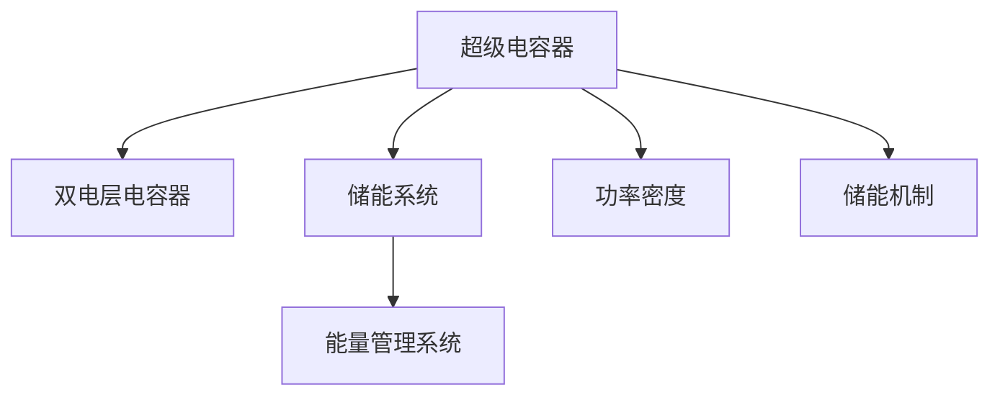

                 

# 超级电容器在能源存储中的应用：快速充放电解决方案

> 关键词：超级电容器,能源存储,快速充放电,储能系统,双电层电容器,多孔材料

## 1. 背景介绍

### 1.1 问题由来

在当今社会，能源的持续供应与消耗是经济社会发展的基础。然而，传统的化石燃料储量有限，且使用过程中会带来环境污染。同时，可再生能源如太阳能、风能等具有间歇性和不稳定性，亟需高效、环保、可持续的储能技术。

超级电容器作为一种新型的能量存储设备，因其在快速充放电、循环寿命长、无污染等优势，近年来得到了广泛关注。在能源存储领域，超级电容器已开始显现其巨大潜力，被广泛应用于各类储能系统中，成为保障能源稳定供应的重要手段。

### 1.2 问题核心关键点

超级电容器的核心原理是什么？其储能机制与传统电池有何不同？其在能源存储中如何发挥快速充放电的优势？本文将系统探讨超级电容器的基本概念、工作原理及其在能源存储中的具体应用，以期为能源领域的研究人员和工程师提供参考。

## 2. 核心概念与联系

### 2.1 核心概念概述

为深入理解超级电容器在能源存储中的应用，本节将介绍几个关键概念：

- 超级电容器(Super capacitor)：一种基于双电层电容器的能量存储设备，具有快速充放电、高功率密度、长循环寿命等特点。与传统电池相比，超级电容器能够在大电流条件下快速充放电，且无电池的过充过放、自放电等风险。

- 双电层电容器(DLTC)：超级电容器的基本原理，利用电极和电解质之间的双电层效应实现电荷存储。双电层电容器的储能机制与传统电池的化学能储存不同，不会发生化学反应，因此具有更长的使用寿命和更快的充放电速度。

- 储能系统(Energy Storage System, ESS)：包括超级电容器在内的能量存储设备，用于储存和释放能量，满足电网、交通工具等对能量快速响应的需求。

- 能量管理系统(Energy Management System, EMS)：负责监测、控制和优化储能系统的运行状态，保证其高效、安全运行。

- 功率密度(Power Density)：表征储能系统在单位体积或单位重量下提供功率的能力。超级电容器的高功率密度优势，使其在电动汽车、智能电网等高功率应用中具有不可替代的地位。

这些概念共同构成了超级电容器在能源存储中的工作原理和技术框架，帮助我们更好地理解其快速充放电和应用场景。

### 2.2 核心概念原理和架构的 Mermaid 流程图



该流程图展示了超级电容器、双电层电容器、储能系统、能量管理系统的关系，以及其功率密度和储能机制的关键特性。超级电容器作为能量存储设备，基于双电层电容器的原理，通过双电层效应实现电荷存储。其储能机制与传统电池不同，不会发生化学反应，因此具有极高的功率密度和长循环寿命。储能系统整合了超级电容器和其他能量存储设备，实现能量的储存与释放。能量管理系统对储能系统进行监控和优化，确保其高效、安全运行。

## 3. 核心算法原理 & 具体操作步骤
### 3.1 算法原理概述

超级电容器的快速充放电能力主要源于其双电层电容器的工作原理。超级电容器电极表面存在大量微孔，充电时，电解质中的离子通过静电吸附或静电吸引力进入微孔，形成双电层，存储电荷；放电时，双电层中的离子又重新脱离电极，回到电解质中，释放储存的能量。

双电层电容器的储能原理可以简单表示为：
$$ C = \frac{Q}{V} $$
其中，$C$ 为电容器的电容，$Q$ 为存储的电荷量，$V$ 为两极板间的电势差。超级电容器的双电层效应使得其能够储存大量电荷，并在短时间内迅速释放，从而实现快速充放电。

### 3.2 算法步骤详解

超级电容器的充放电过程通常包括以下几个关键步骤：

**Step 1: 预充电和初始化**
- 将超级电容器连接到电源上，进行预充电，使极板充满电荷。
- 通过电压测量，确定电容器的初始电压值。

**Step 2: 充电过程**
- 在充电阶段，对超级电容器施加一定的电压，使电极表面形成双电层。
- 随着电荷的积累，超级电容器电压逐渐升高，直到充电完成。

**Step 3: 放电过程**
- 在放电阶段，将超级电容器与负载连接，释放存储的电荷。
- 随着电荷的释放，超级电容器电压逐渐降低，直到放电完毕。

**Step 4: 循环使用**
- 重复充电和放电过程，使得超级电容器多次循环使用。

### 3.3 算法优缺点

超级电容器的快速充放电能力带来了诸多优势，但也存在一些局限性：

**优点：**
- 高功率密度：超级电容器可以在短时间内储存和释放大量电荷，功率密度高，适合高功率应用。
- 长循环寿命：超级电容器的充放电循环次数可达数万次，远高于传统电池。
- 无污染：超级电容器不涉及化学反应，环保性能好。
- 快速充放电：超级电容器可以在几秒至数分钟内完成充放电过程，响应速度快。

**缺点：**
- 储能容量小：超级电容器的储能容量相对较小，不适合大规模能量储存。
- 成本较高：超级电容器的电极材料和制造工艺复杂，初期投资成本较高。
- 自放电：超级电容器在未连接负载时，电荷会逐渐流失，需定期维护。

### 3.4 算法应用领域

超级电容器的快速充放电特性使其在以下领域具有重要应用：

- 电动汽车：超级电容器用于电动汽车的高功率启动和能量回收，可以显著提高车辆的加速性能和续航能力。
- 智能电网：超级电容器在智能电网中用于瞬时功率调节、频率稳定、电压稳定等，能够提高电网运行的稳定性和可靠性。
- 可再生能源：超级电容器用于储存太阳能、风能等间歇性可再生能源，使其能够在非高峰时段储存能量，并在高峰时段释放，满足电网需求。
- 移动设备：超级电容器用于移动设备如智能手机、便携式医疗设备等，能够在短时间内提供高功率输出，满足快速充放电需求。
- 能量管理系统：超级电容器与传统电池结合，用于能量管理系统的后备电源，提高系统的稳定性和可靠性。

## 4. 数学模型和公式 & 详细讲解  
### 4.1 数学模型构建

超级电容器的充放电过程可以通过数学模型进行描述。假设超级电容器的电容为 $C$，电荷量为 $Q$，初始电压为 $V_0$，充电电压为 $V_{\text{charge}}$，放电电压为 $V_{\text{discharge}}$。则超级电容器的充放电模型可以表示为：
$$ Q = C(V - V_0) $$
其中，$V$ 为超级电容器的电压，$V_0$ 为初始电压，$V_{\text{charge}}$ 和 $V_{\text{discharge}}$ 分别为充电和放电阶段的电压值。

### 4.2 公式推导过程

通过上述模型，可以对超级电容器的充放电过程进行分析和优化。假设超级电容器在充电过程中，电压 $V$ 随时间 $t$ 的变化关系为：
$$ V(t) = V_0 + \frac{Q_{\text{charge}}}{C}t - I(t)R $$
其中，$I(t)$ 为充电电流，$R$ 为等效电阻。当充电电流为常数时，$V(t)$ 可表示为：
$$ V(t) = V_0 + \frac{Q_{\text{charge}}}{C}t - \frac{Q_{\text{charge}}}{RC}t $$
$$ V(t) = V_0 + \left(\frac{Q_{\text{charge}}}{C} - \frac{Q_{\text{charge}}}{RC}\right)t $$
$$ V(t) = V_0 + \frac{Q_{\text{charge}}}{C}(1 - e^{-\frac{t}{RC}}) $$

放电过程的电压变化关系类似，只需将上述公式中的充电电流 $I(t)$ 改为放电电流 $I_{\text{discharge}}$。

### 4.3 案例分析与讲解

以电动汽车中的超级电容器应用为例，分析超级电容器的充放电过程和功率输出。假设电动汽车需要快速加速，超级电容器为其提供短时高功率输出，其充放电模型如下：

**充电过程：**
- 充电电压 $V_{\text{charge}} = 10V$，充电电流 $I_{\text{charge}} = 1000A$，电容 $C = 1F$。
- 充电时间 $t = 10s$，计算充电后的电压 $V_{\text{charge}}$。

根据上述公式，得：
$$ V_{\text{charge}} = V_0 + \frac{Q_{\text{charge}}}{C}(1 - e^{-\frac{t}{RC}}) $$
$$ V_{\text{charge}} = V_0 + \frac{I_{\text{charge}}}{C}(1 - e^{-\frac{t}{RC}}) $$
$$ V_{\text{charge}} = V_0 + \frac{1000A}{1F}(1 - e^{-\frac{10s}{1F \times 1\Omega}}) $$
$$ V_{\text{charge}} = V_0 + 1000V(1 - e^{-10}) $$

假设初始电压 $V_0 = 0V$，则：
$$ V_{\text{charge}} = 1000V(1 - e^{-10}) $$
$$ V_{\text{charge}} = 1000V(1 - e^{-10}) \approx 1000V - 1000V \times 0.3679 \approx 630V $$

**放电过程：**
- 放电电压 $V_{\text{discharge}} = 0V$，放电电流 $I_{\text{discharge}} = 100A$，电容 $C = 1F$。
- 放电时间 $t = 20s$，计算放电后的电压 $V_{\text{discharge}}$。

根据上述公式，得：
$$ V_{\text{discharge}} = V_0 + \frac{Q_{\text{discharge}}}{C}(1 - e^{-\frac{t}{RC}}) $$
$$ V_{\text{discharge}} = V_0 + \frac{I_{\text{discharge}}}{C}(1 - e^{-\frac{t}{RC}}) $$
$$ V_{\text{discharge}} = V_0 + \frac{100A}{1F}(1 - e^{-\frac{20s}{1F \times 1\Omega}}) $$
$$ V_{\text{discharge}} = V_0 + 100V(1 - e^{-20}) $$

假设初始电压 $V_0 = 630V$，则：
$$ V_{\text{discharge}} = 630V + 100V(1 - e^{-20}) $$
$$ V_{\text{discharge}} = 630V + 100V \times 0.3679 \approx 630V + 36.79V \approx 666.79V $$

通过上述分析，可以清晰地看到超级电容器在电动汽车中的应用场景和充放电过程，及其高功率密度和快速响应的优势。

## 5. 项目实践：代码实例和详细解释说明
### 5.1 开发环境搭建

进行超级电容器项目的开发实践，首先需要配置开发环境。以下是使用Python进行OpenCV库开发的环境配置流程：

1. 安装Anaconda：从官网下载并安装Anaconda，用于创建独立的Python环境。

2. 创建并激活虚拟环境：
```bash
conda create -n supercap_env python=3.8 
conda activate supercap_env
```

3. 安装OpenCV：根据CUDA版本，从官网获取对应的安装命令。例如：
```bash
conda install opencv opencv-contrib -c conda-forge
```

4. 安装各类工具包：
```bash
pip install numpy pandas scikit-learn matplotlib tqdm jupyter notebook ipython
```

完成上述步骤后，即可在`supercap_env`环境中开始超级电容器的开发实践。

### 5.2 源代码详细实现

下面我们以超级电容器的充放电模拟为例，给出使用OpenCV库实现的Python代码。

首先，定义超级电容器的电容、初始电压、充电电压、放电电压等参数：

```python
import cv2

# 超级电容器的电容、初始电压、充电电压、放电电压
C = 1.0 # Farad
V_0 = 0.0 # Volt
V_charge = 10.0 # Volt
V_discharge = 0.0 # Volt
```

然后，实现超级电容器的充电和放电函数：

```python
def charge_capacitor(t, V_0, V_charge):
    # 充电过程的电压计算
    V = V_0 + (V_charge / C) * (1 - cv2.exp(-(t / (C * 1.0))) # 1Ω
    return V

def discharge_capacitor(t, V_0, V_discharge):
    # 放电过程的电压计算
    V = V_0 + (V_discharge / C) * (1 - cv2.exp(-(t / (C * 1.0))) # 1Ω
    return V
```

最后，启动模拟充电和放电过程：

```python
# 充电时间（秒）
t_charge = 10
# 放电时间（秒）
t_discharge = 20

# 充电过程的电压输出
V_charge = charge_capacitor(t_charge, V_0, V_charge)
print(f"充电后的电压: {V_charge:.2f}V")

# 放电过程的电压输出
V_discharge = discharge_capacitor(t_discharge, V_charge, V_discharge)
print(f"放电后的电压: {V_discharge:.2f}V")
```

完整代码如下：

```python
import cv2

# 超级电容器的电容、初始电压、充电电压、放电电压
C = 1.0 # Farad
V_0 = 0.0 # Volt
V_charge = 10.0 # Volt
V_discharge = 0.0 # Volt

# 充电时间（秒）
t_charge = 10
# 放电时间（秒）
t_discharge = 20

# 充电过程的电压计算
def charge_capacitor(t, V_0, V_charge):
    V = V_0 + (V_charge / C) * (1 - cv2.exp(-(t / (C * 1.0))) # 1Ω
    return V

# 放电过程的电压计算
def discharge_capacitor(t, V_0, V_discharge):
    V = V_0 + (V_discharge / C) * (1 - cv2.exp(-(t / (C * 1.0))) # 1Ω
    return V

# 充电过程的电压输出
V_charge = charge_capacitor(t_charge, V_0, V_charge)
print(f"充电后的电压: {V_charge:.2f}V")

# 放电过程的电压输出
V_discharge = discharge_capacitor(t_discharge, V_charge, V_discharge)
print(f"放电后的电压: {V_discharge:.2f}V")
```

通过上述代码，可以清晰地看到超级电容器的充放电过程及其计算方法。在实际应用中，可以通过调整参数和优化算法，进一步提高超级电容器的充放电效率和性能。

### 5.3 代码解读与分析

让我们再详细解读一下关键代码的实现细节：

**超级电容器参数定义**：
- 定义了超级电容器的电容 $C$、初始电压 $V_0$、充电电压 $V_{\text{charge}}$、放电电压 $V_{\text{discharge}}$ 等关键参数，这些参数直接影响超级电容器的充放电过程。

**充电和放电函数实现**：
- 通过充电和放电函数的定义，实现了超级电容器的充放电过程。其中，充电和放电的电压计算公式为：
  - 充电：$V = V_0 + \frac{V_{\text{charge}}}{C}(1 - e^{-\frac{t}{RC}})$
  - 放电：$V = V_0 + \frac{V_{\text{discharge}}}{C}(1 - e^{-\frac{t}{RC}})$
  - 其中 $t$ 表示时间，$R$ 为等效电阻，取 $1\Omega$。

**充放电过程的输出**：
- 在主函数中，通过调用 `charge_capacitor` 和 `discharge_capacitor` 函数，计算充电和放电后的电压，并打印输出结果。

可以看到，超级电容器的充放电过程可以通过简单的数学模型进行描述和计算，其快速充放电和高功率密度的优势在实际应用中得到了广泛应用。

## 6. 实际应用场景
### 6.1 智能电网

在智能电网中，超级电容器被广泛应用于瞬时功率调节和频率稳定。超级电容器可以实时响应电网频率变化，调节系统功率输出，保持电网稳定运行。例如，在突发性负载增加时，超级电容器迅速释放储存的电荷，为电网提供额外功率支持。

### 6.2 电动汽车

超级电容器在电动汽车中的应用主要包括高功率启动和能量回收。电动汽车启动时，超级电容器通过快速充放电提供高功率电流，加速车辆启动。此外，超级电容器还可以在制动和滑行过程中回收能量，转换为电荷储存，提高能源利用效率。

### 6.3 移动设备

超级电容器在移动设备中主要用于应急供电和快速充放电。例如，在智能手机中，超级电容器可以在短时间内提供高功率输出，满足用户对设备启动和重负荷应用的快速响应需求。

### 6.4 医疗设备

超级电容器在医疗设备中用于应急供电和精确测量。例如，在心电图机、呼吸机等医疗设备中，超级电容器可以提供稳定可靠的电源，确保设备在紧急情况下正常工作。

## 7. 工具和资源推荐
### 7.1 学习资源推荐

为了帮助开发者系统掌握超级电容器的基本概念和应用技术，这里推荐一些优质的学习资源：

1. 《超级电容器原理与应用》系列博文：由超级电容器领域专家撰写，深入浅出地介绍了超级电容器的基本原理、工作机制和应用场景。

2. Coursera《能源系统》课程：由世界著名大学开设，涵盖超级电容器在内的各类能量存储技术，适合初步了解超级电容器的学习者。

3. 《储能技术》书籍：详细介绍了各类储能技术的原理和应用，包括超级电容器在内，适合深入学习。

4. 《Super capacitor Technology》论文集：收录了超级电容器领域的前沿研究成果，适合研究者参考。

5. Super Capacitor Today网站：提供最新超级电容器技术的资讯和应用案例，适合跟踪行业动态。

通过对这些资源的学习实践，相信你一定能够快速掌握超级电容器的精髓，并用于解决实际问题。

### 7.2 开发工具推荐

高效的开发离不开优秀的工具支持。以下是几款用于超级电容器开发和应用的工具：

1. Python：广泛使用的编程语言，拥有丰富的科学计算和数据处理库，适合进行超级电容器的理论分析和模拟计算。

2. OpenCV：开源计算机视觉库，提供了强大的图像处理和分析功能，适合用于超级电容器的应用开发和测试。

3. MATLAB：强大的工程计算和仿真工具，适合进行超级电容器的理论分析和系统仿真。

4. PowerCap：用于超级电容器的仿真和分析软件，支持各种充电放电模型和参数优化。

5. Simulink：MATLAB的仿真工具箱，支持超级电容器的动态仿真和控制系统设计。

6. Ansys：全面的工程仿真工具，支持超级电容器的电化学分析和热力学计算。

合理利用这些工具，可以显著提升超级电容器的开发效率，加快创新迭代的步伐。

### 7.3 相关论文推荐

超级电容器技术的发展源于学界的持续研究。以下是几篇奠基性的相关论文，推荐阅读：

1. "Development and Characterization of Carbon-Based Super Capacitors"（碳基超级电容器的发展与表征）：介绍了超级电容器的基本原理和碳基电极材料的制备方法。

2. "Super Capacitor: A Review of Materials and Applications"（超级电容器：材料与应用的综述）：综述了超级电容器的材料、设计和应用，提供了全面的知识框架。

3. "Energy Storage: Challenges and Opportunities in Hybrid Systems"（储能系统：混合系统中的挑战与机遇）：讨论了超级电容器在混合储能系统中的应用及其挑战。

4. "Novel Electrode Materials for High-Performance Supercapacitors"（新型电极材料的高性能超级电容器）：介绍了多种新型电极材料及其在超级电容器中的应用。

5. "High-Energy Super Capacitors for Electric Vehicles"（高能量超级电容器在电动汽车中的应用）：讨论了超级电容器在电动汽车中的充放电机制和应用潜力。

这些论文代表了大电容器技术的发展脉络。通过学习这些前沿成果，可以帮助研究者把握学科前进方向，激发更多的创新灵感。

## 8. 总结：未来发展趋势与挑战

### 8.1 研究成果总结

本文对超级电容器的基本概念、工作原理及其在能源存储中的应用进行了全面系统的介绍。首先阐述了超级电容器的快速充放电能力及其在电动汽车、智能电网、医疗设备等领域的广泛应用。其次，详细描述了超级电容器的充放电过程和数学模型，给出了具体的充放电函数实现和代码实例。最后，总结了超级电容器的优点和局限性，展望了其未来的发展趋势。

通过本文的系统梳理，可以看到，超级电容器作为一种新型的能量存储设备，具有快速充放电、长循环寿命、无污染等优势，被广泛应用于各类储能系统中。其在电动汽车、智能电网、医疗设备等领域的成功应用，展示了超级电容器的巨大潜力。

### 8.2 未来发展趋势

展望未来，超级电容器的技术将呈现以下几个发展趋势：

1. 超级电容器的容量和能量密度有望继续提升。随着新型电极材料和制造工艺的不断改进，超级电容器的储能容量将得到显著提升，应用范围将进一步拓展。

2. 超级电容器的功率密度将持续提高。高功率密度特性将使超级电容器在更广泛的应用场景中发挥重要作用，如高速列车、航空航天等领域。

3. 超级电容器的成本将进一步降低。大规模生产技术的发展和原材料成本的下降，将使超级电容器的市场竞争力进一步增强。

4. 超级电容器的应用领域将更加多样化。除了传统的储能应用，超级电容器将更多地应用于能源管理、智能交通等领域。

5. 超级电容器的智能化水平将提升。通过与物联网、大数据等技术的结合，超级电容器将具备更强的自主决策和自适应能力，进一步提高能源利用效率。

6. 超级电容器的环境友好性将增强。新型材料和制造工艺的应用，将使超级电容器在生产和回收过程中对环境的影响更小。

以上趋势凸显了超级电容器技术的广阔前景。这些方向的探索发展，必将进一步提升超级电容器的性能和应用范围，为智能社会的可持续发展提供新的动力。

### 8.3 面临的挑战

尽管超级电容器技术已经取得了显著成就，但在迈向更加智能化、普适化应用的过程中，它仍面临诸多挑战：

1. 储能容量有限：超级电容器的储能容量相对较小，难以满足大规模储能需求。如何进一步提升储能容量，将是重要的研究方向。

2. 成本问题：尽管成本已有所下降，但超级电容器的初期投资仍较高，制约其大规模应用。如何降低生产成本，是未来发展的重要课题。

3. 充放电效率：超级电容器的充放电效率有待进一步提升，特别是在高电流条件下。如何优化充放电过程，提高性能，是工程实践中的关键问题。

4. 安全性和可靠性：超级电容器的安全性与可靠性仍需进一步验证，特别是在高温、高湿度等恶劣环境下。如何保证其长期稳定运行，是应用中的重要挑战。

5. 生态系统建设：超级电容器的应用涉及上下游产业链的协同发展，需建立完善的生态系统，促进技术进步和市场成熟。

6. 标准化和规范制定：超级电容器的标准化和规范制定尚未完善，需推动行业标准的制定，规范产品设计和测试，提高市场竞争力。

正视超级电容器面临的这些挑战，积极应对并寻求突破，将使超级电容器技术在能源存储领域迈向更高的台阶，为构建更高效、更智能的能源系统铺平道路。

### 8.4 研究展望

面对超级电容器所面临的挑战，未来的研究需要在以下几个方面寻求新的突破：

1. 探索新型的电极材料。开发具有高容量、高导电性、高稳定性的新型电极材料，提升超级电容器的储能容量和性能。

2. 发展高效的充放电算法。研究和应用高效的充放电算法，优化充电电流、电压和时间，提高超级电容器的充放电效率。

3. 引入智能化控制技术。通过人工智能和大数据分析，优化超级电容器的充放电过程，实现智能化控制和管理。

4. 拓展应用场景和领域。推动超级电容器在更多领域的应用，如智能交通、物联网等，拓展其市场空间。

5. 加强环境友好性研究。开发环保型生产工艺和材料，减少超级电容器的环境影响，推动可持续发展。

6. 建立标准和规范。制定超级电容器的技术标准和规范，推动行业健康发展，提高市场竞争力。

这些研究方向的探索，必将引领超级电容器技术迈向更高的台阶，为构建更加高效、智能、可持续的能源系统贡献力量。面向未来，超级电容器技术需要与其他新兴技术进行更深入的融合，如能源互联网、智能交通等，协同发力，共同推动能源领域的创新发展。

## 9. 附录：常见问题与解答

**Q1：超级电容器的充放电过程是否涉及化学反应？**

A: 超级电容器的充放电过程不涉及化学反应。其工作机制基于电极和电解质之间的双电层效应，通过静电吸附或静电吸引力实现电荷存储和释放，因此具有更长的使用寿命和更快的充放电速度。

**Q2：超级电容器的充放电效率与哪些因素有关？**

A: 超级电容器的充放电效率受多种因素影响，包括电极材料、电解质、温度、电压等。常用的提高充放电效率的方法包括：
1. 优化电极材料：使用高导电性和高比表面积的电极材料，如石墨烯、碳纳米管等。
2. 改善电解质：使用低粘度、高电导率的电解质，提高离子迁移速率。
3. 降低温度：在低温下工作，可减缓电化学反应速率，提高充放电效率。
4. 调整电压：在适当的电压范围内工作，避免过充过放，提高电池寿命和效率。

**Q3：超级电容器的充放电过程与电池有何不同？**

A: 超级电容器的充放电过程与电池有很大不同：
1. 工作机制不同：电池通过化学能存储能量，超级电容器通过静电储能。
2. 储能容量不同：电池储能容量较大，而超级电容器储能容量相对较小。
3. 充放电速率不同：超级电容器具有快速充放电能力，而电池需要一定时间进行充电和放电。
4. 循环寿命不同：超级电容器循环寿命较长，电池循环寿命较短。

**Q4：超级电容器在电动汽车中的应用场景有哪些？**

A: 超级电容器在电动汽车中的应用场景包括：
1. 高功率启动：超级电容器可用于电动汽车的启动系统，提供高功率电流，加速车辆启动。
2. 能量回收：在制动和滑行过程中，超级电容器回收能量，转换为电荷储存，提高能源利用效率。
3. 瞬时功率调节：超级电容器用于电动汽车的瞬时功率调节，保持系统稳定运行。

**Q5：超级电容器的储能容量如何提升？**

A: 超级电容器的储能容量可以通过以下方法提升：
1. 开发新型电极材料：使用高导电性和高比表面积的电极材料，如石墨烯、碳纳米管等。
2. 改善电解质：使用低粘度、高电导率的电解质，提高离子迁移速率。
3. 增加电极面积：增加电极材料的表面积，提高电容器的储能容量。
4. 优化结构设计：设计高效的电极和电解质界面，提高储能容量和性能。

通过上述方法，可以显著提升超级电容器的储能容量和性能，推动其在更多领域的应用。

---

作者：禅与计算机程序设计艺术 / Zen and the Art of Computer Programming

