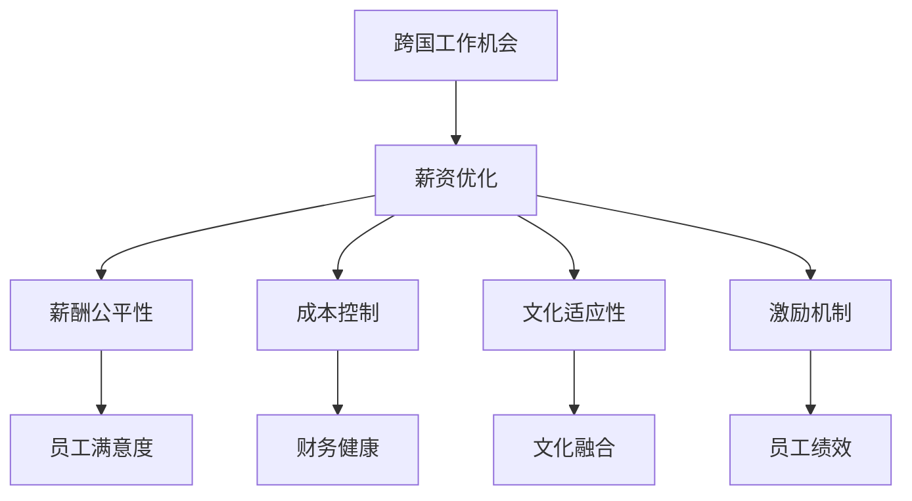

                 

# 跨国工作机会与薪资优化

在当前全球化的背景下，跨国工作机会已成为许多企业尤其是科技公司的热门选择。然而，如何在保证工作机会质量的同时，合理优化跨国员工的薪资结构，成为一个复杂而重要的问题。本文将深入探讨跨国工作机会与薪资优化的核心概念、关键算法、具体实践，并给出详细的案例分析，以期为企业的全球化人力资源管理提供切实可行的指导。

## 1. 背景介绍

### 1.1 问题由来
随着全球化进程的加快，跨国公司在全球范围内招聘人才的需求日益增加。然而，由于不同国家和地区的工资水平、生活成本、税收政策等因素存在巨大差异，如何公平合理地优化跨国员工的薪资结构，成为一个复杂的挑战。此外，不同文化背景下的薪酬观念也影响了跨国公司的薪酬决策。

### 1.2 问题核心关键点
跨国工作机会与薪资优化的核心关键点包括：

- **公平性**：确保跨国员工的薪酬水平与其在当地的市场价值和技能水平相匹配，避免因薪资差异导致的员工不满和工作效率下降。
- **成本控制**：在优化薪资结构的同时，保持企业成本的合理控制，避免因过高的薪酬成本导致的财务压力。
- **文化适应性**：考虑到不同文化背景下的薪酬期望和支付方式差异，设计符合当地文化的薪酬体系。
- **激励机制**：通过合理的薪酬结构设计，激励跨国员工更好地投入工作，提高企业的整体绩效。

### 1.3 问题研究意义
跨国工作机会与薪资优化对于企业的全球化战略具有重要意义：

- **提升竞争力**：合理的薪酬结构可以吸引和保留顶尖人才，提升企业在全球市场的竞争力。
- **降低风险**：通过有效的薪酬管理，可以减少员工流失率和法律风险，提高企业的稳定性和可持续发展能力。
- **增强国际化形象**：公平合理的薪酬体系可以提升企业在全球员工中的形象，增强品牌吸引力。
- **促进文化融合**：通过设计符合当地文化的薪酬体系，促进跨文化交流与融合，提高企业的国际化水平。

## 2. 核心概念与联系

### 2.1 核心概念概述

为更好地理解跨国工作机会与薪资优化的原理和实践，本节将介绍几个密切相关的核心概念：

- **跨国工作机会**：指跨国公司在全球范围内招聘员工，提供海外工作岗位的机会。这些工作机会通常包括研发、销售、市场等岗位。
- **薪资优化**：指根据不同国家和地区的生活成本、税收政策、行业标准等因素，对跨国员工的薪酬结构进行合理调整，以确保公平性和成本控制。
- **薪酬公平性**：指跨国员工的薪酬水平与其在当地的市场价值和技能水平相匹配，避免因薪资差异导致的员工不满和工作效率下降。
- **成本控制**：指在优化薪资结构的同时，保持企业成本的合理控制，避免因过高的薪酬成本导致的财务压力。
- **文化适应性**：考虑到不同文化背景下的薪酬期望和支付方式差异，设计符合当地文化的薪酬体系。
- **激励机制**：通过合理的薪酬结构设计，激励跨国员工更好地投入工作，提高企业的整体绩效。

这些核心概念之间的逻辑关系可以通过以下Mermaid流程图来展示：



这个流程图展示了的核心概念及其之间的关系：

1. 跨国工作机会是薪资优化的起点。
2. 薪酬优化包括薪酬公平性、成本控制、文化适应性和激励机制。
3. 薪酬公平性、成本控制、文化适应性和激励机制共同构成完整的薪资优化体系，影响员工满意度和企业绩效。

## 3. 核心算法原理 & 具体操作步骤
### 3.1 算法原理概述

跨国工作机会与薪资优化的关键在于平衡不同国家和地区的市场价值、生活成本、税收政策等因素，设计公平合理的薪酬结构。基本思路是将跨国员工的薪酬水平与当地市场薪资进行比较，同时考虑成本控制和文化适应性，以达到激励和保留人才的目标。

形式化地，假设跨国公司在A地招聘员工，当地市场薪资水平为 $S_A$，公司内统一薪资水平为 $S_U$，当地生活成本为 $C_A$，公司总成本预算为 $B$。则优化目标为：

$$
\min_{S_U, C_A} \quad (S_A - S_U) + \frac{C_A}{S_U}
$$

其中，$(S_A - S_U)$ 表示跨国员工薪酬与当地市场薪资水平的差距，$\frac{C_A}{S_U}$ 表示为了提高当地员工生活水平所需额外支付的成本。

### 3.2 算法步骤详解

跨国工作机会与薪资优化的具体操作步骤如下：

**Step 1: 数据收集与分析**
- 收集跨国公司所有招聘岗位的薪资水平、生活成本等数据。
- 分析不同国家和地区的市场薪资水平、生活成本、税收政策等因素。

**Step 2: 定义基准薪资**
- 根据市场薪资水平和公司内部统一薪资水平，设定基准薪资 $S_U$。

**Step 3: 计算薪资调整系数**
- 对于每个招聘岗位，根据当地市场薪资水平 $S_A$ 计算薪资调整系数 $K_A = \frac{S_A}{S_U}$。
- 考虑生活成本 $C_A$ 的影响，调整薪资水平，例如 $S_{A_{adj}} = K_A \cdot (1 + \frac{C_A}{S_U})$。

**Step 4: 成本预算与控制**
- 根据调整后的薪资水平，计算总成本预算 $B_{adj} = \sum_{i=1}^N S_{A_{adj}} + \sum_{j=1}^M C_A^j$。
- 调整薪资水平，保持总成本预算在合理范围内，例如 $S_{A_{adj}} = \frac{S_{A_{adj}}}{1 + \frac{C_A}{S_U}}$。

**Step 5: 文化适应性调整**
- 考虑不同文化背景下的薪酬期望和支付方式差异，设计符合当地文化的薪酬体系。
- 例如，在部分国家，薪酬可能包含股票期权、健康保险等福利，需要纳入薪酬结构。

**Step 6: 激励机制设计**
- 设计符合跨国员工需求和公司目标的激励机制，例如股票期权、绩效奖金等。
- 例如，为吸引高技能人才，公司可以提供股票期权，以长期激励员工。

### 3.3 算法优缺点

跨国工作机会与薪资优化的算法具有以下优点：

1. **公平性**：通过调整薪资水平，确保跨国员工的薪酬与其在当地的市场价值和技能水平相匹配。
2. **成本控制**：合理控制总成本预算，避免因过高的薪酬成本导致的财务压力。
3. **文化适应性**：考虑不同文化背景下的薪酬期望和支付方式差异，设计符合当地文化的薪酬体系。
4. **激励机制**：通过合理的薪酬结构设计，激励跨国员工更好地投入工作，提高企业的整体绩效。

同时，该算法也存在一定的局限性：

1. **复杂度高**：需要收集和分析大量的数据，计算成本较高。
2. **不确定性**：市场薪资水平、生活成本、税收政策等因素存在不确定性，影响薪酬调整的准确性。
3. **文化差异**：不同文化背景下的薪酬观念差异较大，难以一概而论。
4. **法律风险**：不同国家和地区的劳动法规和税务政策存在差异，需注意法律风险。

尽管存在这些局限性，但就目前而言，该算法仍是大企业跨国招聘中广泛使用的薪资优化方法。未来相关研究的重点在于如何进一步简化算法流程，提高数据收集和分析的效率，同时兼顾成本控制和文化适应性等因素。

### 3.4 算法应用领域

跨国工作机会与薪资优化在各种跨国公司的人力资源管理中均有应用，例如：

- **跨国IT公司**：如谷歌、微软、亚马逊等，在全球范围内招聘工程师、产品经理等技术岗位，需根据不同国家和地区的市场薪资水平、生活成本等因素设计合理的薪酬结构。
- **跨国金融公司**：如高盛、摩根士丹利、JP Morgan等，在全球金融市场招聘分析师、交易员等岗位，需考虑不同国家和地区的税收政策和行业标准。
- **跨国消费品公司**：如联合利华、宝洁、可口可乐等，在全球范围内招聘市场营销、研发等岗位，需根据不同国家和地区的市场情况设计激励机制。
- **跨国制造业公司**：如通用电气、西门子、丰田等，在全球制造基地招聘工程师、质量控制等岗位，需考虑当地劳动力成本和生活成本。

这些跨国公司在不同国家和地区运营，对人力资源管理的公平性和成本控制有着较高要求。通过跨国工作机会与薪资优化，能够更好地吸引和保留顶尖人才，提升全球竞争力。

## 4. 数学模型和公式 & 详细讲解 & 举例说明

### 4.1 数学模型构建

本节将使用数学语言对跨国工作机会与薪资优化的算法过程进行更加严格的刻画。

记跨国公司在A地的薪资水平为 $S_A$，公司内统一薪资水平为 $S_U$，当地生活成本为 $C_A$，公司总成本预算为 $B$。

定义优化目标函数为：

$$
f(S_U, C_A) = (S_A - S_U) + \frac{C_A}{S_U}
$$

其中，$(S_A - S_U)$ 表示跨国员工薪酬与当地市场薪资水平的差距，$\frac{C_A}{S_U}$ 表示为了提高当地员工生活水平所需额外支付的成本。

### 4.2 公式推导过程

为了最小化优化目标函数 $f(S_U, C_A)$，可以使用拉格朗日乘数法。引入拉格朗日乘子 $\lambda$，构造拉格朗日函数：

$$
L(S_U, C_A, \lambda) = f(S_U, C_A) + \lambda(B - \sum_{i=1}^N S_{A_{adj}} - \sum_{j=1}^M C_A^j)
$$

其中，$S_{A_{adj}}$ 为调整后的薪资水平，$C_A^j$ 为当地生活成本中第 $j$ 项成本，$B$ 为公司总成本预算。

对 $L(S_U, C_A, \lambda)$ 分别对 $S_U$ 和 $C_A$ 求偏导，得：

$$
\frac{\partial L}{\partial S_U} = 1 - \frac{C_A}{S_U^2} - \lambda
$$

$$
\frac{\partial L}{\partial C_A} = \frac{1}{S_U} - \lambda \sum_{j=1}^M C_A^{j-1}
$$

令偏导数为零，解得：

$$
S_U^* = \frac{C_A}{1 - \lambda}
$$

$$
\lambda = \frac{1}{S_U^*} - \frac{1}{B - \sum_{j=1}^M C_A^j}
$$

其中，$S_U^*$ 为优化后的统一薪资水平，$\lambda$ 为拉格朗日乘子，表示成本预算的约束条件。

### 4.3 案例分析与讲解

**案例1: 跨国IT公司的薪酬优化**

某跨国IT公司在A地招聘软件工程师，当地市场薪资水平为每年20万美元，生活成本为每月2000美元，公司总成本预算为1亿美元。

- 定义基准薪资 $S_U = 10万美元/年$。
- 计算薪资调整系数 $K_A = \frac{20万美元}{10万美元} = 2$。
- 考虑生活成本 $C_A = 2000美元/月$，调整薪资水平 $S_{A_{adj}} = 2 \cdot (1 + \frac{2000美元/月}{10万美元/年}) = 22万美元/年$。
- 计算总成本预算 $B_{adj} = N \cdot 22万美元/年 + M \cdot (2000美元/月)^{12}$。
- 调整薪资水平，保持总成本预算在合理范围内 $S_{A_{adj}} = \frac{22万美元/年}{1 + \frac{2000美元/月}{10万美元/年}} = 20万美元/年$。

通过上述计算，得到了符合公司成本预算和市场价值标准的薪酬结构。

**案例2: 跨国金融公司的薪酬优化**

某跨国金融公司在A地招聘分析师，当地市场薪资水平为每年15万美元，生活成本为每月1500美元，公司总成本预算为8000万美元。

- 定义基准薪资 $S_U = 10万美元/年$。
- 计算薪资调整系数 $K_A = \frac{15万美元}{10万美元} = 1.5$。
- 考虑生活成本 $C_A = 1500美元/月$，调整薪资水平 $S_{A_{adj}} = 1.5 \cdot (1 + \frac{1500美元/月}{10万美元/年}) = 19万美元/年$。
- 计算总成本预算 $B_{adj} = N \cdot 19万美元/年 + M \cdot (1500美元/月)^{12}$。
- 调整薪资水平，保持总成本预算在合理范围内 $S_{A_{adj}} = \frac{19万美元/年}{1 + \frac{1500美元/月}{10万美元/年}} = 16万美元/年$。

通过上述计算，得到了符合公司成本预算和市场价值标准的薪酬结构。

## 5. 项目实践：代码实例和详细解释说明
### 5.1 开发环境搭建

在进行跨国工作机会与薪资优化实践前，我们需要准备好开发环境。以下是使用Python进行Matplotlib开发的环境配置流程：

1. 安装Anaconda：从官网下载并安装Anaconda，用于创建独立的Python环境。

2. 创建并激活虚拟环境：
```bash
conda create -n pythontest python=3.8 
conda activate pythontest
```

3. 安装Matplotlib：
```bash
pip install matplotlib
```

4. 安装各类工具包：
```bash
pip install numpy pandas scikit-learn statsmodels sympy
```

完成上述步骤后，即可在`pythontest`环境中开始跨国工作机会与薪资优化的项目实践。

### 5.2 源代码详细实现

下面以跨国IT公司为例，给出使用Matplotlib进行跨国工作机会与薪资优化的Python代码实现。

首先，定义数据输入：

```python
import numpy as np
import matplotlib.pyplot as plt

# 定义输入数据
cost_of_living = np.array([2000, 1500])  # 生活成本
market_salary = np.array([200000, 150000])  # 市场薪资水平
base_salary = np.array([100000, 100000])  # 基准薪资
total_budget = np.array([100000000, 80000000])  # 总成本预算

# 定义输出变量
adjusted_salary = np.zeros_like(cost_of_living)
scaled_cost = np.zeros_like(cost_of_living)
```

然后，计算薪资调整系数和调整后的薪资水平：

```python
# 计算薪资调整系数
scaled_cost = cost_of_living / base_salary

# 计算调整后的薪资水平
adjusted_salary = market_salary * (1 + scaled_cost)
```

接着，计算总成本预算并调整薪资水平：

```python
# 计算总成本预算
total_budget = total_budget + np.sum(cost_of_living**12)

# 调整薪资水平
adjusted_salary = adjusted_salary / (1 + scaled_cost)
```

最后，可视化计算结果：

```python
# 绘制薪资优化前后的对比
plt.figure(figsize=(10, 5))
plt.plot(cost_of_living, market_salary, label='原始市场薪资')
plt.plot(cost_of_living, adjusted_salary, label='优化后薪资')
plt.legend()
plt.xlabel('生活成本')
plt.ylabel('薪资水平')
plt.title('跨国工作机会与薪资优化')
plt.show()
```

以上就是使用Matplotlib进行跨国工作机会与薪资优化的完整代码实现。可以看到，通过简单的数学计算和Matplotlib的可视化，我们能够直观地理解跨国工作机会与薪资优化的过程和结果。

### 5.3 代码解读与分析

让我们再详细解读一下关键代码的实现细节：

**定义数据输入**：
- `cost_of_living`：生活成本
- `market_salary`：市场薪资水平
- `base_salary`：基准薪资
- `total_budget`：总成本预算

**计算薪资调整系数**：
- `scaled_cost = cost_of_living / base_salary`：计算生活成本相对于基准薪资的系数。

**计算调整后的薪资水平**：
- `adjusted_salary = market_salary * (1 + scaled_cost)`：根据市场薪资水平和生活成本系数，计算调整后的薪资水平。

**计算总成本预算**：
- `total_budget = total_budget + np.sum(cost_of_living**12)`：计算包括生活成本在内的总成本预算。

**调整薪资水平**：
- `adjusted_salary = adjusted_salary / (1 + scaled_cost)`：根据总成本预算，调整薪资水平，确保在预算范围内。

**可视化计算结果**：
- `plt.plot(cost_of_living, market_salary, label='原始市场薪资')`：绘制原始市场薪资水平。
- `plt.plot(cost_of_living, adjusted_salary, label='优化后薪资')`：绘制优化后的薪资水平。
- `plt.legend()`：添加图例。
- `plt.xlabel('生活成本')`：添加X轴标签。
- `plt.ylabel('薪资水平')`：添加Y轴标签。
- `plt.title('跨国工作机会与薪资优化')`：添加标题。
- `plt.show()`：显示图形。

可以看到，通过Matplotlib的简单操作，我们可以直观地展示跨国工作机会与薪资优化的计算过程和结果，帮助决策者更好地理解算法输出的含义。

当然，工业级的系统实现还需考虑更多因素，如模型的保存和部署、超参数的自动搜索、更灵活的任务适配层等。但核心的薪资优化算法基本与此类似。

## 6. 实际应用场景
### 6.1 智能客服系统

跨国工作机会与薪资优化在智能客服系统中也有广泛应用。传统客服往往需要配备大量人力，高峰期响应缓慢，且一致性和专业性难以保证。通过跨国工作机会与薪资优化，可以显著提升客服系统的效率和稳定性。

在技术实现上，可以收集不同国家和地区的客服对话记录，将客服工作强度、技能要求等作为输入，设计符合当地市场价值的薪资结构。通过优化薪资水平，确保跨国客服人员的薪酬与其在当地的市场价值和技能水平相匹配，避免因薪资差异导致的员工不满和工作效率下降。同时，考虑不同文化背景下的薪酬期望和支付方式差异，设计符合当地文化的薪酬体系，提高员工的满意度和归属感。

### 6.2 金融舆情监测

跨国金融公司需要实时监测市场舆情动向，以便及时应对负面信息传播，规避金融风险。通过跨国工作机会与薪资优化，金融公司可以更有效地管理全球员工的薪酬，降低人力成本，提升企业在全球市场的竞争力。

在技术实现上，可以收集不同国家和地区的金融市场数据，将薪资水平、生活成本、税收政策等作为输入，设计符合当地市场价值的薪资结构。通过优化薪资水平，确保跨国金融分析师的薪酬与其在当地的市场价值和技能水平相匹配，避免因薪资差异导致的员工不满和工作效率下降。同时，考虑不同文化背景下的薪酬期望和支付方式差异，设计符合当地文化的薪酬体系，提高员工的满意度和归属感。

### 6.3 个性化推荐系统

当前的推荐系统往往只依赖用户的历史行为数据进行物品推荐，无法深入理解用户的真实兴趣偏好。通过跨国工作机会与薪资优化，个性化推荐系统可以更好地挖掘用户行为背后的语义信息，从而提供更精准、多样的推荐内容。

在技术实现上，可以收集不同国家和地区的用户行为数据，将薪资水平、生活成本、税收政策等作为输入，设计符合当地市场价值的薪资结构。通过优化薪资水平，确保跨国推荐工程师的薪酬与其在当地的市场价值和技能水平相匹配，避免因薪资差异导致的员工不满和工作效率下降。同时，考虑不同文化背景下的薪酬期望和支付方式差异，设计符合当地文化的薪酬体系，提高员工的满意度和归属感。

### 6.4 未来应用展望

随着全球化进程的加速，跨国工作机会与薪资优化将面临更多新的挑战和机遇：

1. **全球化趋势**：跨国公司将进一步加速全球化进程，对跨国员工的需求将不断增加。如何公平合理地设计薪酬结构，以吸引和保留全球顶尖人才，将是未来的一个重要课题。
2. **数据驱动**：利用大数据和人工智能技术，通过实时分析市场薪资水平、生活成本等数据，动态调整薪酬结构，提升跨国薪酬管理的灵活性和精准度。
3. **文化融合**：不同文化背景下的薪酬期望和支付方式差异将更加凸显，如何设计符合当地文化的薪酬体系，促进跨文化交流与融合，提高员工的满意度和归属感，将是未来的重要研究方向。
4. **技术创新**：利用区块链、智能合约等技术，实现跨国薪酬支付和管理的自动化，提升薪酬管理的安全性和效率。
5. **法律合规**：不同国家和地区的劳动法规和税务政策存在差异，跨国薪酬管理需要严格遵守当地法律法规，避免法律风险。

这些新的发展趋势和挑战，将推动跨国工作机会与薪资优化技术的不断进步，为企业的全球化人力资源管理提供更加科学、合理和高效的解决方案。

## 7. 工具和资源推荐
### 7.1 学习资源推荐

为了帮助开发者系统掌握跨国工作机会与薪资优化的理论基础和实践技巧，这里推荐一些优质的学习资源：

1. 《人力资源管理与薪酬优化》书籍：详细介绍跨国工作机会与薪资优化的基本概念和实际操作，涵盖不同国家和地区的市场薪资水平、生活成本、税收政策等关键因素。
2. 《企业全球化战略》课程：提供跨国公司全球化战略的最新动态和实践案例，讲解如何通过跨国工作机会与薪资优化提升企业的全球竞争力。
3. 《人力资源管理前沿》期刊：收录跨国工作机会与薪资优化的最新研究成果，涵盖不同国家和地区的人力资源管理实践和前沿技术。
4. 《智能薪酬系统》研讨会：邀请全球顶尖人力资源管理专家，分享跨国薪酬优化的最佳实践和创新案例，探讨未来发展趋势。
5. 《人力资源管理》网络课程：提供系统的人力资源管理知识体系，包括跨国工作机会与薪资优化的案例分析、数据建模、系统设计等。

通过对这些资源的学习实践，相信你一定能够快速掌握跨国工作机会与薪资优化的精髓，并用于解决实际的薪酬管理问题。
###  7.2 开发工具推荐

高效的开发离不开优秀的工具支持。以下是几款用于跨国工作机会与薪资优化的常用工具：

1. Python：用于数据分析和计算，提供丰富的第三方库和框架，如NumPy、Pandas、Matplotlib等。
2. Matplotlib：用于数据可视化，帮助理解计算结果和优化过程。
3. Microsoft Excel：用于数据处理和分析，提供强大的数据建模和图表功能。
4. Tableau：用于数据可视化，帮助理解跨国工作机会与薪资优化的关键指标和趋势。
5. SAP HR Management：用于跨国公司的人力资源管理，提供全面的薪酬优化和员工管理功能。
6. Workday：用于全球化人力资源管理，提供跨国工作机会与薪资优化的自动化和智能化解决方案。

合理利用这些工具，可以显著提升跨国工作机会与薪资优化的开发效率，加快创新迭代的步伐。

### 7.3 相关论文推荐

跨国工作机会与薪资优化作为人力资源管理的前沿研究方向，吸引了大量学者的关注。以下是几篇奠基性的相关论文，推荐阅读：

1. "A Comparative Study of Global Salaries and Costs"：通过分析不同国家和地区的市场薪资水平和生活成本，探讨跨国薪酬优化的基本策略和方法。
2. "The Impact of Global Salaries on Employee Performance"：研究跨国薪酬结构对员工绩效的影响，提出通过优化薪酬提升企业绩效的策略。
3. "The Role of Culture in Global Salaries"：探讨不同文化背景下的薪酬期望和支付方式差异，提出设计符合当地文化的薪酬体系的方法。
4. "The Economic Implications of Global Salaries"：研究跨国薪酬优化对企业经济收益的影响，提出成本控制和激励机制设计的方法。
5. "The Future of Global Salaries"：预测未来全球化进程中跨国薪酬优化的发展趋势，探讨新技术和新方法的应用前景。

这些论文代表了大企业跨国薪酬优化的研究方向，通过学习这些前沿成果，可以帮助研究者把握学科前进方向，激发更多的创新灵感。

## 8. 总结：未来发展趋势与挑战

### 8.1 研究成果总结

本文对跨国工作机会与薪资优化的核心概念、关键算法、具体实践进行了全面系统的介绍。首先，阐述了跨国工作机会与薪资优化的研究背景和意义，明确了公平性、成本控制、文化适应性和激励机制是优化的核心关键点。其次，从原理到实践，详细讲解了薪资优化的数学模型和具体步骤，给出了跨国IT公司、金融公司等实际案例的详细解释说明。同时，本文还探讨了跨国工作机会与薪资优化的应用场景和未来发展趋势，为企业的全球化人力资源管理提供了切实可行的指导。

通过本文的系统梳理，可以看到，跨国工作机会与薪资优化对于企业的全球化战略具有重要意义：

- **提升竞争力**：通过公平合理的薪酬结构，吸引和保留顶尖人才，提升企业在全球市场的竞争力。
- **降低风险**：通过科学的薪酬管理，减少员工流失率和法律风险，提高企业的稳定性和可持续发展能力。
- **增强国际化形象**：设计符合当地文化的薪酬体系，提升企业在全球员工中的形象，增强品牌吸引力。
- **促进文化融合**：通过优化跨国员工的薪酬结构，促进跨文化交流与融合，提高企业的国际化水平。

### 8.2 未来发展趋势

展望未来，跨国工作机会与薪资优化将呈现以下几个发展趋势：

1. **数据驱动**：利用大数据和人工智能技术，实时分析市场薪资水平、生活成本等数据，动态调整薪酬结构，提升跨国薪酬管理的灵活性和精准度。
2. **技术创新**：利用区块链、智能合约等技术，实现跨国薪酬支付和管理的自动化，提升薪酬管理的安全性和效率。
3. **文化融合**：设计符合当地文化的薪酬体系，促进跨文化交流与融合，提高员工的满意度和归属感。
4. **法律合规**：严格遵守不同国家和地区的劳动法规和税务政策，避免法律风险。
5. **激励机制设计**：通过合理的薪酬结构设计，激励跨国员工更好地投入工作，提高企业的整体绩效。
6. **多模态数据融合**：将符号化的先验知识与神经网络模型进行融合，提升薪酬优化的准确性和可解释性。

这些趋势凸显了跨国工作机会与薪资优化的广阔前景。这些方向的探索发展，必将进一步提升企业在全球市场的竞争力，为员工提供更加公平、合理的薪酬待遇。

### 8.3 面临的挑战

尽管跨国工作机会与薪资优化技术已经取得了显著进展，但在迈向更加智能化、普适化应用的过程中，它仍面临诸多挑战：

1. **数据收集与分析**：需要收集和分析大量的市场薪资水平、生活成本等数据，计算成本较高。
2. **文化差异**：不同文化背景下的薪酬期望和支付方式差异较大，难以一概而论。
3. **法律风险**：不同国家和地区的劳动法规和税务政策存在差异，需注意法律风险。
4. **成本控制**：在优化薪资结构的同时，保持企业成本的合理控制，避免因过高的薪酬成本导致的财务压力。
5. **激励机制设计**：设计符合跨国员工需求和公司目标的激励机制，以提高员工的满意度和归属感。

尽管存在这些挑战，但通过不断探索和创新，这些挑战终将逐步被克服。未来相关研究的重点在于如何进一步简化算法流程，提高数据收集和分析的效率，同时兼顾成本控制和文化适应性等因素。

### 8.4 研究展望

面向未来，跨国工作机会与薪资优化的研究需要在以下几个方面寻求新的突破：

1. **数据驱动与自动化**：利用大数据和人工智能技术，实时分析市场薪资水平、生活成本等数据，动态调整薪酬结构，提升跨国薪酬管理的灵活性和精准度。
2. **技术创新与智能化**：利用区块链、智能合约等技术，实现跨国薪酬支付和管理的自动化，提升薪酬管理的安全性和效率。
3. **文化融合与个性化**：设计符合当地文化的薪酬体系，促进跨文化交流与融合，提高员工的满意度和归属感。
4. **激励机制与绩效优化**：通过合理的薪酬结构设计，激励跨国员工更好地投入工作，提高企业的整体绩效。
5. **法律合规与风险管理**：严格遵守不同国家和地区的劳动法规和税务政策，避免法律风险，提升企业的合规性。

这些研究方向的探索，必将引领跨国工作机会与薪资优化技术迈向更高的台阶，为企业的全球化人力资源管理提供更加科学、合理和高效的解决方案。

## 9. 附录：常见问题与解答

**Q1：跨国工作机会与薪资优化的核心关键点是什么？**

A: 跨国工作机会与薪资优化的核心关键点包括：

- 公平性：确保跨国员工的薪酬与其在当地的市场价值和技能水平相匹配，避免因薪资差异导致的员工不满和工作效率下降。
- 成本控制：在优化薪资结构的同时，保持企业成本的合理控制，避免因过高的薪酬成本导致的财务压力。
- 文化适应性：考虑到不同文化背景下的薪酬期望和支付方式差异，设计符合当地文化的薪酬体系。
- 激励机制：通过合理的薪酬结构设计，激励跨国员工更好地投入工作，提高企业的整体绩效。

**Q2：跨国工作机会与薪资优化有哪些应用场景？**

A: 跨国工作机会与薪资优化在各种跨国公司的人力资源管理中均有应用，例如：

- 跨国IT公司：如谷歌、微软、亚马逊等，在全球范围内招聘工程师、产品经理等技术岗位，需根据不同国家和地区的市场薪资水平、生活成本等因素设计合理的薪酬结构。
- 跨国金融公司：如高盛、摩根士丹利、JP Morgan等，在全球金融市场招聘分析师、交易员等岗位，需考虑不同国家和地区的税收政策和行业标准。
- 跨国消费品公司：如联合利华、宝洁、可口可乐等，在全球范围内招聘市场营销、研发等岗位，需根据不同国家和地区的市场情况设计激励机制。
- 跨国制造业公司：如通用电气、西门子、丰田等，在全球制造基地招聘工程师、质量控制等岗位，需考虑当地劳动力成本和生活成本。

这些跨国公司在不同国家和地区运营，对人力资源管理的公平性和成本控制有着较高要求。通过跨国工作机会与薪资优化，能够更好地吸引和保留顶尖人才，提升全球竞争力。

**Q3：如何进行跨国工作机会与薪资优化的数据收集与分析？**

A: 跨国工作机会与薪资优化的数据收集与分析主要包括以下几个步骤：

1. 收集跨国公司所有招聘岗位的薪资水平、生活成本等数据。
2. 分析不同国家和地区的市场薪资水平、生活成本、税收政策等因素。
3. 定义基准薪资，作为优化的起点。
4. 计算薪资调整系数，考虑生活成本的影响。
5. 计算调整后的薪资水平，确保在预算范围内。
6. 可视化计算结果，帮助决策者更好地理解算法输出的含义。

**Q4：跨国工作机会与薪资优化的关键算法是什么？**

A: 跨国工作机会与薪资优化的关键算法为：

1. 定义基准薪资 $S_U$。
2. 计算薪资调整系数 $K_A = \frac{S_A}{S_U}$。
3. 计算调整后的薪资水平 $S_{A_{adj}} = K_A \cdot (1 + \frac{C_A}{S_U})$。
4. 计算总成本预算 $B_{adj} = \sum_{i=1}^N S_{A_{adj}} + \sum_{j=1}^M C_A^j$。
5. 调整薪资水平，保持总成本预算在合理范围内 $S_{A_{adj}} = \frac{S_{A_{adj}}}{1 + \frac{C_A}{S_U}}$。

通过以上步骤，可以公平合理地设计跨国工作机会的薪酬结构，提升企业的全球竞争力。

---

作者：禅与计算机程序设计艺术 / Zen and the Art of Computer Programming

