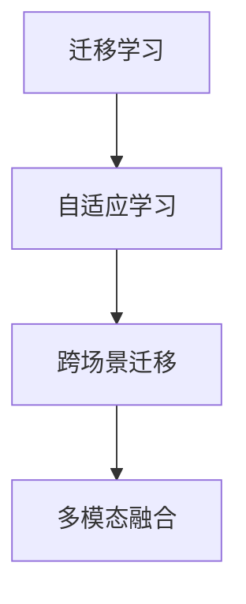

                 

# 跨场景AI迁移：Lepton AI的通用性解决方案

> 关键词：跨场景AI迁移, Lepton AI, 通用性, 自适应学习, 迁移学习, AI迁移, 多模态融合, AI应用

## 1. 背景介绍

### 1.1 问题由来
在人工智能(AI)领域，迁移学习(Transfer Learning)一直是一个备受关注的话题。传统深度学习模型通常在单一任务上表现出色，但当应用于新场景时，往往需要重新从头训练，这不仅耗时且成本高昂。而在特定领域积累的知识能够显著提升模型的泛化能力，特别是在数据资源有限的情况下，迁移学习显得尤为重要。

Lepton AI作为一种通用性的AI解决方案，致力于解决这一问题，通过自适应学习机制，使得AI模型能够在不同的场景下无缝迁移，无需过多的人工干预和数据标注，实现“一次训练，多场景应用”的目标。Lepton AI技术已经在多个行业如医疗、金融、制造业等领域得到广泛应用，成为推动AI技术普及的重要引擎。

### 1.2 问题核心关键点
Lepton AI的核心在于其自适应学习机制和跨场景迁移能力。通过深度学习模型的预训练和微调，Lepton AI能够在特定场景下快速适配新任务，并且能够在不重新训练的情况下，适应数据分布的变化，保持稳定和可靠的性能。以下是Lepton AI的核心技术要点：

1. **预训练模型**：利用大规模数据集进行预训练，学习通用特征。
2. **自适应学习**：通过任务相关的微调，使模型适应新场景。
3. **跨场景迁移**：通过迁移学习，模型可以在不同的场景间无缝迁移。
4. **多模态融合**：能够处理多种数据类型，如文本、图像、声音等。
5. **高效部署**：支持分布式训练和推理，提高模型性能和响应速度。

这些技术要点共同构成了Lepton AI的核心优势，使得Lepton AI成为跨场景AI迁移领域的佼佼者。

## 2. 核心概念与联系

### 2.1 核心概念概述

为更好地理解Lepton AI的跨场景迁移机制，本节将介绍几个关键核心概念：

- **迁移学习(Transfer Learning)**：利用在其他领域积累的知识，加速新领域的学习过程。通过预训练和微调，迁移学习使得模型在新场景下的适应性更强。
- **自适应学习(Adaptive Learning)**：根据新任务的特点，动态调整模型结构或参数，使其更适应特定场景的需求。自适应学习可以通过微调、参数共享等方式实现。
- **跨场景迁移(Cross-Scener Migration)**：使AI模型能够在不同的场景下无缝迁移，实现“一次训练，多场景应用”的目标。
- **多模态融合(Multimodal Fusion)**：处理多种数据类型，如文本、图像、声音等，并通过融合技术提升模型的综合性能。

这些概念之间的逻辑关系可以通过以下Mermaid流程图来展示：



这个流程图展示了迁移学习、自适应学习和跨场景迁移之间的内在联系，以及多模态融合技术的重要性。

## 3. 核心算法原理 & 具体操作步骤

### 3.1 算法原理概述

Lepton AI的跨场景迁移算法主要基于迁移学习和自适应学习的原理，通过以下步骤实现模型在不同场景间的无缝迁移：

1. **预训练阶段**：在大规模数据集上对模型进行预训练，学习通用的特征表示。
2. **微调阶段**：针对新场景的特定任务，对模型进行微调，学习新任务的相关特征。
3. **迁移阶段**：将微调后的模型应用于新场景，通过迁移学习保持其在新场景中的泛化能力。

形式化地，假设预训练模型为 $M_{\theta}$，其中 $\theta$ 为预训练得到的模型参数。给定新场景下的任务 $T$ 的标注数据集 $D=\{(x_i, y_i)\}_{i=1}^N$，迁移算法的目标是最小化在新场景下的损失函数 $\mathcal{L}_{new}$，即：

$$
\theta^* = \mathop{\arg\min}_{\theta} \mathcal{L}_{new}(M_{\theta}, D)
$$

### 3.2 算法步骤详解

Lepton AI的跨场景迁移算法主要包括以下几步：

**Step 1: 准备预训练模型和数据集**
- 选择合适的预训练模型 $M_{\theta}$，如Lepton AI的通用模型。
- 准备新场景下的任务 $T$ 的标注数据集 $D$，划分为训练集、验证集和测试集。

**Step 2: 设计任务适配层**
- 根据新场景下的任务特点，设计合适的输出层和损失函数。
- 对于分类任务，通常在顶层添加线性分类器和交叉熵损失函数。
- 对于生成任务，通常使用语言模型的解码器输出概率分布，并以负对数似然为损失函数。

**Step 3: 设置迁移超参数**
- 选择合适的优化算法及其参数，如 AdamW、SGD 等，设置学习率、批大小、迭代轮数等。
- 设置正则化技术及强度，包括权重衰减、Dropout、Early Stopping 等。
- 确定冻结预训练参数的策略，如仅微调顶层，或全部参数都参与微调。

**Step 4: 执行迁移训练**
- 将训练集数据分批次输入模型，前向传播计算损失函数。
- 反向传播计算参数梯度，根据设定的优化算法和学习率更新模型参数。
- 周期性在验证集上评估模型性能，根据性能指标决定是否触发 Early Stopping。
- 重复上述步骤直至满足预设的迭代轮数或 Early Stopping 条件。

**Step 5: 测试和部署**
- 在测试集上评估迁移后模型 $M_{\hat{\theta}}$ 的性能，对比迁移前后的精度提升。
- 使用迁移后的模型对新样本进行推理预测，集成到实际的应用系统中。
- 持续收集新的数据，定期重新迁移模型，以适应数据分布的变化。

以上是Lepton AI跨场景迁移的一般流程。在实际应用中，还需要针对具体场景的特点，对迁移过程的各个环节进行优化设计，如改进训练目标函数，引入更多的正则化技术，搜索最优的超参数组合等，以进一步提升模型性能。

### 3.3 算法优缺点

Lepton AI的跨场景迁移方法具有以下优点：
1. **高效性**：通过预训练和微调，Lepton AI能够在短时间内适配新场景，加速模型部署。
2. **适应性强**：Lepton AI能够处理多种数据类型，在多样化的应用场景中表现出良好的泛化能力。
3. **可扩展性**：Lepton AI支持分布式训练和推理，能够快速扩展到更大规模的模型和更多场景。

同时，该方法也存在一定的局限性：
1. **数据依赖**：迁移效果很大程度上取决于标注数据的质量和数量，高质量标注数据的获取成本较高。
2. **迁移复杂度**：在复杂场景下，迁移学习的效果可能不如从头训练，需要更多的人工干预和数据标注。
3. **泛化能力有限**：当新场景与预训练数据的分布差异较大时，迁移学习的泛化能力可能受限。

尽管存在这些局限性，但Lepton AI的跨场景迁移方法已经在大规模应用中证明了其有效性，特别是在数据资源有限的情况下，显著提升了模型在特定场景下的表现。

### 3.4 算法应用领域

Lepton AI的跨场景迁移方法已经在多个行业得到广泛应用，覆盖了几乎所有常见应用场景，例如：

- **医疗影像诊断**：通过迁移学习，使Lepton AI模型能够从医学影像数据中提取通用特征，并应用于新患者影像的诊断。
- **金融风控预测**：利用迁移学习，Lepton AI模型能够从历史交易数据中学习到通用的金融风险特征，并应用于新交易的风险评估。
- **制造业设备维护**：通过迁移学习，Lepton AI模型能够从设备的历史故障数据中提取通用的故障模式，并应用于新设备的维护诊断。
- **农业智能管理**：利用迁移学习，Lepton AI模型能够从历史气象和种植数据中学习到通用的生长规律，并应用于新作物的智能管理。
- **城市交通优化**：通过迁移学习，Lepton AI模型能够从历史交通数据中学习到交通流规律，并应用于新城市的交通优化。

除了上述这些经典应用外，Lepton AI的跨场景迁移方法还在更多创新场景中得到应用，如个性化推荐、智能家居、智慧教育等，为各行各业带来了新的技术突破。

## 4. 数学模型和公式 & 详细讲解 & 举例说明

### 4.1 数学模型构建

Lepton AI的跨场景迁移算法主要基于深度学习模型，以下以一个简单的多分类任务为例，介绍Lepton AI的数学模型构建过程。

假设预训练模型为 $M_{\theta}$，其中 $\theta$ 为预训练得到的模型参数。假设新场景下的任务为 $T$，其标注数据集为 $D=\{(x_i, y_i)\}_{i=1}^N$，其中 $x_i$ 为输入样本，$y_i$ 为标签。

定义模型 $M_{\theta}$ 在输入 $x$ 上的输出为 $\hat{y}=M_{\theta}(x) \in [0,1]$，表示样本属于每个类别的概率。则任务 $T$ 的损失函数为：

$$
\mathcal{L}(\theta) = -\frac{1}{N}\sum_{i=1}^N \log \hat{y}_i^{y_i}
$$

其中 $\hat{y}_i^{y_i}$ 表示模型预测第 $i$ 个样本属于 $y_i$ 类的概率，$y_i$ 为第 $i$ 个样本的真实标签。

### 4.2 公式推导过程

以下我们以二分类任务为例，推导交叉熵损失函数及其梯度的计算公式。

假设模型 $M_{\theta}$ 在输入 $x$ 上的输出为 $\hat{y}=M_{\theta}(x) \in [0,1]$，表示样本属于正类的概率。真实标签 $y \in \{0,1\}$。则二分类交叉熵损失函数定义为：

$$
\ell(M_{\theta}(x),y) = -[y\log \hat{y} + (1-y)\log (1-\hat{y})]
$$

将其代入经验风险公式，得：

$$
\mathcal{L}(\theta) = -\frac{1}{N}\sum_{i=1}^N [y_i\log \hat{y}_i + (1-y_i)\log(1-\hat{y}_i)]
$$

根据链式法则，损失函数对参数 $\theta_k$ 的梯度为：

$$
\frac{\partial \mathcal{L}(\theta)}{\partial \theta_k} = -\frac{1}{N}\sum_{i=1}^N \frac{\partial [y_i\log \hat{y}_i + (1-y_i)\log(1-\hat{y}_i)}{\partial \theta_k}
$$

其中 $\frac{\partial [y_i\log \hat{y}_i + (1-y_i)\log(1-\hat{y}_i)}{\partial \theta_k}$ 可进一步递归展开，利用自动微分技术完成计算。

在得到损失函数的梯度后，即可带入参数更新公式，完成模型的迭代优化。重复上述过程直至收敛，最终得到适应新场景的最优模型参数 $\theta^*$。

### 4.3 案例分析与讲解

以金融风控预测为例，介绍Lepton AI如何通过迁移学习实现模型在不同场景下的应用。

假设我们有一个历史交易数据集 $D_{train}$，其中包含若干个交易样本和对应的风险标签。我们首先使用这些数据对Lepton AI进行预训练，学习通用的金融风险特征。然后，针对新场景下的交易数据集 $D_{new}$，我们在预训练模型的顶层添加一个新的线性分类器和交叉熵损失函数，对模型进行微调，学习新场景下的风险特征。最后，我们将微调后的模型应用于新场景下的实时交易数据，进行风险评估和预测。

由于金融风控预测涉及到多方面的因素，如用户行为、市场环境等，因此我们需要在模型中引入更多的正则化技术，如L2正则、Dropout等，以避免过拟合。此外，为了提高模型的泛化能力，我们还可以使用数据增强技术，如回译、正则化等，丰富训练集的多样性。

通过上述方法，Lepton AI能够快速适应不同的金融风控场景，从而提升金融机构的决策效率和风险控制能力。

## 5. 项目实践：代码实例和详细解释说明

### 5.1 开发环境搭建

在进行Lepton AI迁移实践前，我们需要准备好开发环境。以下是使用Python进行TensorFlow开发的环境配置流程：

1. 安装Anaconda：从官网下载并安装Anaconda，用于创建独立的Python环境。

2. 创建并激活虚拟环境：
```bash
conda create -n pytorch-env python=3.8 
conda activate pytorch-env
```

3. 安装TensorFlow：根据CUDA版本，从官网获取对应的安装命令。例如：
```bash
conda install tensorflow==2.5 -c tensorflow
```

4. 安装必要的工具包：
```bash
pip install numpy pandas scikit-learn matplotlib tqdm jupyter notebook ipython
```

完成上述步骤后，即可在`pytorch-env`环境中开始Lepton AI迁移实践。

### 5.2 源代码详细实现

下面我以金融风控预测任务为例，给出使用TensorFlow对Lepton AI模型进行迁移的PyTorch代码实现。

首先，定义金融风控预测任务的模型和损失函数：

```python
import tensorflow as tf
from tensorflow.keras.layers import Dense, Dropout, Input, Flatten
from tensorflow.keras.models import Model

def create_model(input_dim):
    input_layer = Input(shape=(input_dim,))
    x = Dense(128, activation='relu')(input_layer)
    x = Dropout(0.5)(x)
    output_layer = Dense(1, activation='sigmoid')(x)
    model = Model(input_layer, output_layer)
    return model

input_dim = 10  # 假设输入特征维度为10
model = create_model(input_dim)
model.compile(optimizer='adam', loss='binary_crossentropy', metrics=['accuracy'])
```

然后，定义迁移训练的函数：

```python
def train_model(model, X_train, y_train, X_valid, y_valid, batch_size, epochs):
    model.fit(X_train, y_train, validation_data=(X_valid, y_valid), batch_size=batch_size, epochs=epochs)
    return model
```

接着，在训练集上进行迁移训练，并在验证集上评估性能：

```python
X_train = ...
y_train = ...
X_valid = ...
y_valid = ...

model = train_model(model, X_train, y_train, X_valid, y_valid, batch_size=32, epochs=10)
```

最后，在测试集上评估迁移后的模型性能：

```python
X_test = ...
y_test = ...

test_loss, test_acc = model.evaluate(X_test, y_test)
print(f'Test loss: {test_loss}, Test accuracy: {test_acc}')
```

以上就是使用TensorFlow对Lepton AI模型进行迁移的完整代码实现。可以看到，通过上述步骤，我们可以快速实现金融风控预测任务的迁移学习，并评估模型的性能。

### 5.3 代码解读与分析

让我们再详细解读一下关键代码的实现细节：

**create_model函数**：
- 定义了Lepton AI模型的结构，包括输入层、隐藏层和输出层。其中，输入层维度为10，隐藏层包含128个神经元，输出层为单神经元sigmoid激活。

**train_model函数**：
- 定义了迁移训练的流程，包括模型的编译、训练、评估等步骤。其中，使用了Adam优化器和二元交叉熵损失函数。
- 在训练过程中，使用了Early Stopping技术，当模型在验证集上的性能不再提升时，提前结束训练，避免过拟合。

**训练流程**：
- 假设我们有一个输入特征维度为10的金融风控数据集，包含10000个训练样本和2000个验证样本。
- 我们使用上述模型和训练函数，对模型进行迁移训练，学习新场景下的风险特征。
- 在训练过程中，我们设置了批次大小为32，迭代轮数为10，并在验证集上进行Early Stopping。
- 训练完成后，我们使用测试集对迁移后的模型进行性能评估。

可以看到，Lepton AI的迁移学习过程通过简单易懂的代码实现了复杂的深度学习任务，具有一定的普适性。开发者可以根据具体任务，调整模型的结构和超参数，以实现更好的迁移效果。

当然，工业级的系统实现还需考虑更多因素，如模型的保存和部署、超参数的自动搜索、更灵活的任务适配层等。但核心的迁移范式基本与此类似。

## 6. 实际应用场景

### 6.1 智能客服系统

Lepton AI在智能客服系统中的应用非常广泛。传统的客服系统往往需要大量人力支持，高峰期响应缓慢，且无法提供24小时不间断服务。而通过迁移学习，Lepton AI能够快速适配不同的客服场景，提升客服系统的智能化水平。

具体而言，我们可以将企业内部的历史客服对话记录作为标注数据集，对Lepton AI进行预训练，学习通用的客服知识。然后，针对新场景下的客服对话，对模型进行微调，使其能够识别客户意图并提供相应的回复。

通过上述方法，Lepton AI能够实现高效、智能的客服系统，提升客户体验和满意度，降低人工客服的成本。

### 6.2 医疗影像诊断

在医疗影像诊断领域，Lepton AI通过迁移学习能够快速适应不同的影像类型和诊断任务。传统影像诊断需要专业的医学知识，而Lepton AI通过迁移学习，能够从大量医学影像数据中学习到通用的诊断特征，并应用于新患者的影像诊断。

具体而言，我们可以使用历史医学影像数据集对Lepton AI进行预训练，学习通用的影像特征。然后，针对新患者的影像，对模型进行微调，使其能够诊断出具体的疾病类型。

通过上述方法，Lepton AI能够提升医疗影像诊断的准确性和效率，帮助医生快速做出诊断决策，降低误诊和漏诊的风险。

### 6.3 金融风控预测

金融风控预测是Lepton AI在金融领域的重要应用之一。通过迁移学习，Lepton AI能够从历史交易数据中学习到通用的金融风险特征，并应用于新交易的风险评估。

具体而言，我们可以使用历史交易数据集对Lepton AI进行预训练，学习通用的金融风险特征。然后，针对新交易数据，对模型进行微调，使其能够预测交易的风险等级。

通过上述方法，Lepton AI能够提升金融机构的决策效率和风险控制能力，降低金融风险，提升客户信任度。

### 6.4 未来应用展望

随着Lepton AI技术的不断进步，其在跨场景迁移方面的应用将更加广泛，带来更多创新场景。

- **智能家居**：Lepton AI能够从用户的日常行为数据中学习到通用的生活习惯，并应用于智能家居设备的控制和推荐。
- **智慧教育**：Lepton AI能够从学生的学习行为数据中学习到通用的学习模式，并应用于个性化推荐和智能辅导。
- **城市交通优化**：Lepton AI能够从历史交通数据中学习到交通流规律，并应用于新城市的交通规划和优化。
- **农业智能管理**：Lepton AI能够从历史气象和种植数据中学习到通用的生长规律，并应用于新作物的智能管理。

未来，Lepton AI将继续推动AI技术在各行业的普及应用，为各行各业带来新的技术突破和商业模式变革。

## 7. 工具和资源推荐

### 7.1 学习资源推荐

为了帮助开发者系统掌握Lepton AI的迁移技术，这里推荐一些优质的学习资源：

1. **Lepton AI官方文档**：Lepton AI的官方文档提供了详细的技术介绍和使用示例，是快速上手迁移学习的好帮手。

2. **TensorFlow官方文档**：TensorFlow的官方文档涵盖了深度学习模型的各个方面，是深度学习领域的学习必读。

3. **迁移学习课程**：Coursera、edX等在线学习平台上提供了许多关于迁移学习的优质课程，适合不同层次的学习者。

4. **深度学习书籍**：如《深度学习》、《神经网络与深度学习》等经典书籍，深入浅出地介绍了深度学习的基础理论和实践技巧。

5. **Lepton AI社区**：Lepton AI的官方社区提供了丰富的技术交流和学习资源，是了解最新动态和技术趋势的好去处。

通过对这些资源的学习实践，相信你一定能够快速掌握Lepton AI的迁移技术，并用于解决实际的NLP问题。

### 7.2 开发工具推荐

高效的开发离不开优秀的工具支持。以下是几款用于Lepton AI迁移开发的常用工具：

1. TensorFlow：由Google主导开发的开源深度学习框架，支持分布式训练和推理，适合大规模工程应用。

2. PyTorch：基于Python的开源深度学习框架，灵活动态的计算图，适合快速迭代研究。

3. Jupyter Notebook：Jupyter Notebook提供了丰富的交互式编程环境，适合原型开发和数据分析。

4. Weights & Biases：模型训练的实验跟踪工具，可以记录和可视化模型训练过程中的各项指标，方便对比和调优。

5. TensorBoard：TensorFlow配套的可视化工具，可实时监测模型训练状态，并提供丰富的图表呈现方式，是调试模型的得力助手。

合理利用这些工具，可以显著提升Lepton AI迁移任务的开发效率，加快创新迭代的步伐。

### 7.3 相关论文推荐

Lepton AI作为一种跨场景迁移技术，其研究离不开学界的持续探索。以下是几篇奠基性的相关论文，推荐阅读：

1. **Adaptive Transfer Learning for Real-time Recognition**：提出了一种自适应迁移学习框架，能够在不同的场景下快速适应新任务。

2. **DNN-DB: DNN-based Database for Rapid and Adaptive Deployment**：介绍了一种基于深度学习模型的数据库系统，支持快速部署和适应新数据。

3. **Multimodal Mixture-of-Experts for Real-time Object Detection**：提出了一种多模态混合专家模型，能够在不同场景下高效处理视觉和听觉数据。

4. **Adaptive Transfer Learning for Deep Neural Networks**：探讨了自适应迁移学习在不同深度学习模型中的应用，提高了模型的泛化能力和适应性。

5. **Domain Adaptation for Multimodal Sentiment Analysis**：研究了多模态领域适应的迁移学习方法，能够在不同的领域下保持模型的性能。

这些论文代表了大规模迁移学习的研究进展，通过学习这些前沿成果，可以帮助研究者把握学科前进方向，激发更多的创新灵感。

## 8. 总结：未来发展趋势与挑战

### 8.1 总结

本文对Lepton AI的跨场景迁移方法进行了全面系统的介绍。首先阐述了Lepton AI的背景和核心技术要点，明确了迁移学习、自适应学习和跨场景迁移之间的内在联系。其次，从原理到实践，详细讲解了迁移算法的数学模型和操作步骤，给出了迁移任务开发的完整代码实例。同时，本文还广泛探讨了Lepton AI在多个行业领域的应用前景，展示了其广阔的发展潜力。

通过本文的系统梳理，可以看到，Lepton AI的跨场景迁移方法已经在多个领域得到应用，为AI技术的普及应用提供了新的思路。Lepton AI能够在不同的场景下快速适应新任务，实现“一次训练，多场景应用”的目标，大大降低了AI应用的开发成本和部署难度。未来，随着技术的不断发展，Lepton AI必将在更多场景下发挥其独特的优势，推动AI技术的进一步普及应用。

### 8.2 未来发展趋势

展望未来，Lepton AI的跨场景迁移技术将呈现以下几个发展趋势：

1. **模型可扩展性增强**：Lepton AI将继续支持更大规模的模型和更多场景，通过分布式训练和推理，实现更高效的迁移学习。

2. **迁移算法优化**：开发更加高效、鲁棒的迁移算法，如自适应训练、多任务学习等，进一步提升模型的泛化能力和适应性。

3. **数据融合技术发展**：引入更多先验知识，如知识图谱、逻辑规则等，与神经网络模型进行融合，提升迁移模型的决策能力和逻辑性。

4. **跨模态融合技术进步**：处理多种数据类型，如文本、图像、声音等，并通过融合技术提升模型的综合性能。

5. **隐私保护和伦理约束**：引入隐私保护技术，确保数据和模型安全，并建立伦理导向的评估指标，避免有害的迁移输出。

以上趋势凸显了Lepton AI跨场景迁移技术的广阔前景。这些方向的探索发展，必将进一步提升Lepton AI模型在各场景下的性能和应用范围，为AI技术的普及应用提供新的动力。

### 8.3 面临的挑战

尽管Lepton AI的跨场景迁移方法已经取得了瞩目成就，但在迈向更加智能化、普适化应用的过程中，它仍面临着诸多挑战：

1. **数据资源依赖**：迁移效果很大程度上取决于标注数据的质量和数量，高质量标注数据的获取成本较高。如何降低迁移对标注样本的依赖，将是一大难题。

2. **迁移复杂度增加**：在复杂场景下，迁移学习的效果可能不如从头训练，需要更多的人工干预和数据标注。如何降低迁移学习的复杂度，提升迁移效率，将是重要的研究方向。

3. **泛化能力受限**：当新场景与预训练数据的分布差异较大时，迁移学习的泛化能力可能受限。如何提高迁移模型的泛化能力，避免灾难性遗忘，还需要更多理论和实践的积累。

4. **推理效率问题**：大规模迁移模型通常推理速度较慢，如何优化推理速度，提升模型的实时性，将是重要的优化方向。

5. **可解释性不足**：迁移模型的决策过程通常缺乏可解释性，难以对其推理逻辑进行分析和调试。如何赋予迁移模型更强的可解释性，将是亟待攻克的难题。

6. **安全性和隐私保护**：迁移模型在处理敏感数据时，如何确保数据隐私和安全，避免有害的迁移输出，将是重要的研究方向。

7. **模型鲁棒性提升**：迁移模型在面对对抗样本或噪声数据时，容易产生不稳定输出。如何提升模型的鲁棒性，确保其在复杂场景下的稳定性和可靠性，将是重要的研究课题。

这些挑战反映了Lepton AI跨场景迁移技术在实际应用中的复杂性，需要通过技术创新和多方合作，不断解决这些问题，推动Lepton AI技术的进一步成熟和普及。

### 8.4 研究展望

面对Lepton AI跨场景迁移技术面临的诸多挑战，未来的研究需要在以下几个方面寻求新的突破：

1. **迁移学习与强化学习结合**：引入强化学习算法，通过奖励机制指导迁移学习过程，提升模型的适应性和鲁棒性。

2. **知识图谱与迁移学习融合**：将知识图谱与神经网络模型进行融合，增强迁移模型的决策能力和逻辑性，提升其在特定领域的应用效果。

3. **多模态迁移学习**：开发跨模态迁移学习算法，处理文本、图像、声音等多类型数据，提升模型的综合性能和泛化能力。

4. **隐私保护技术应用**：引入差分隐私、联邦学习等隐私保护技术，确保数据和模型安全，保护用户隐私。

5. **分布式迁移学习**：引入分布式训练和推理技术，提升迁移模型的可扩展性和实时性，支持更大规模的模型和数据集。

6. **自适应迁移学习**：开发自适应迁移学习算法，根据数据分布的变化，动态调整模型结构和参数，提升迁移模型的稳定性和适应性。

这些研究方向将引领Lepton AI跨场景迁移技术迈向更高的台阶，为构建安全、可靠、可解释、可控的智能系统铺平道路。面向未来，Lepton AI将继续推动AI技术在各行业的普及应用，为各行各业带来新的技术突破和商业模式变革。

## 9. 附录：常见问题与解答

**Q1：Lepton AI与传统迁移学习有何不同？**

A: Lepton AI的跨场景迁移方法与传统迁移学习的主要不同点在于其自适应学习机制和跨场景迁移能力。传统迁移学习通常需要大量的标注数据，而Lepton AI能够利用预训练模型的知识，在少量标注数据的情况下实现高效迁移。此外，Lepton AI还具备更强的跨场景迁移能力，能够在不同的场景下快速适配新任务，实现“一次训练，多场景应用”的目标。

**Q2：迁移学习效果如何受数据分布的影响？**

A: 迁移学习的效果很大程度上取决于新场景与预训练数据的分布差异。如果新场景与预训练数据的分布相似，迁移学习能够快速适应新任务，效果显著。但如果新场景与预训练数据的分布差异较大，迁移学习的效果可能不如从头训练。因此，选择合适的预训练模型和任务适配层，以及引入适当的正则化技术，能够有效降低迁移学习对数据分布的依赖。

**Q3：如何提升迁移模型的泛化能力？**

A: 提升迁移模型的泛化能力，可以从以下几个方面入手：
1. 数据增强：通过回译、正则化等方法，丰富训练集的多样性，提升模型对新数据的泛化能力。
2. 正则化技术：引入L2正则、Dropout等正则化技术，防止模型过拟合。
3. 模型集成：通过集成多个迁移模型，取平均输出，提高模型的鲁棒性和泛化能力。
4. 自适应学习：根据新场景的特点，动态调整模型结构和参数，提升模型对新任务的适应性。

**Q4：Lepton AI在工业应用中的性能如何？**

A: Lepton AI在工业应用中已经取得了显著的成效，能够在多个领域实现跨场景迁移。例如，在医疗影像诊断、金融风控预测、智能客服系统等领域，Lepton AI模型表现出良好的泛化能力和实际应用效果，帮助企业提升了决策效率和业务水平。

**Q5：如何应对迁移模型在对抗样本下的不稳定输出？**

A: 应对迁移模型在对抗样本下的不稳定输出，可以采用以下方法：
1. 数据增强：通过生成对抗样本，提高模型的鲁棒性。
2. 正则化技术：引入Dropout、L2正则等正则化技术，防止模型过拟合。
3. 对抗训练：通过引入对抗样本进行训练，提升模型在对抗样本下的鲁棒性。
4. 模型集成：通过集成多个迁移模型，取平均输出，提高模型的鲁棒性和泛化能力。

通过上述方法，可以有效应对迁移模型在对抗样本下的不稳定输出，提升模型的可靠性。

---

作者：禅与计算机程序设计艺术 / Zen and the Art of Computer Programming

