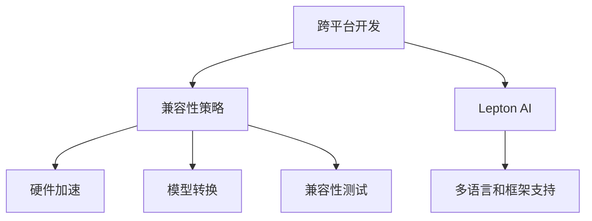

                 

# 跨平台AI应用：Lepton AI的兼容性策略

> 关键词：跨平台开发, AI兼容策略, Lepton AI, 兼容性测试, 模型迁移

## 1. 背景介绍

在当今的数字化时代，AI应用已遍布各个行业，从金融、医疗、制造业到电商、零售、教育等。随着AI技术的快速发展，企业对AI应用的需求日益增长，希望在快速迭代过程中实现跨平台、跨设备、跨语言的支持，以满足多变的需求和不断变化的业务环境。然而，不同平台和技术栈之间的差异，如硬件加速能力、开发环境、编程语言等，使得AI应用的跨平台开发面临诸多挑战。本文将介绍Lepton AI的兼容性策略，分析其在跨平台AI应用中的实现和应用效果。

### 1.1 问题由来

AI应用通常需要依赖特定的硬件和软件环境，这导致开发、测试和部署时可能遇到兼容性问题。例如，某些深度学习模型在GPU上进行训练和推理的速度比CPU快得多，但在大规模部署时，可能因不同设备的计算能力而影响性能。另外，不同编程语言和框架之间的语法、API差异，也可能导致代码难以移植和复用。

### 1.2 问题核心关键点

为解决跨平台AI应用的兼容性问题，Lepton AI采用了一种灵活的兼容性策略，主要包括：
- 硬件加速适配：支持多种硬件加速（如CPU、GPU、TPU），以提升模型在各种设备上的性能。
- 多语言和框架支持：支持多种编程语言和深度学习框架，如Python、C++、TensorFlow、PyTorch等。
- 模型迁移和转换：通过模型转换工具，实现不同框架之间的模型迁移和优化。
- 兼容性测试和部署：设计全面的兼容性测试方案，确保模型在各种环境下的稳定性和一致性。

这些策略共同构成了Lepton AI的兼容性框架，使其能够在不同平台、不同语言环境下实现高效、稳定的AI应用部署。

## 2. 核心概念与联系

### 2.1 核心概念概述

为更好地理解Lepton AI的兼容性策略，本节将介绍几个密切相关的核心概念：

- 跨平台开发：指在多个操作系统和硬件平台上进行软件开发的实践。目的是开发出可在多个平台上运行的应用程序，提高软件开发的灵活性和可移植性。

- 兼容性策略：指软件在跨平台、跨设备、跨语言环境下，保证其功能、性能和用户体验一致的策略和方法。

- Lepton AI：一种旨在实现跨平台AI应用开发的开源框架，提供了一套跨平台兼容性的解决方案。

- 硬件加速：指利用CPU、GPU、TPU等硬件加速器，加速模型的训练和推理过程。

- 模型转换：指将一个深度学习框架的模型转换为另一个框架的过程，以实现跨框架的模型迁移。

- 兼容性测试：指对软件在不同平台、语言和环境下的兼容性和稳定性进行测试，以确保软件在不同环境下的正常运行。

这些核心概念之间的逻辑关系可以通过以下Mermaid流程图来展示：



这个流程图展示了他核心概念的相互关系：

1. 跨平台开发通过实现Lepton AI框架，支持多平台应用。
2. Lepton AI提供了兼容性策略，实现硬件加速、模型转换、兼容性测试等功能。
3. 兼容性策略中的硬件加速、模型转换和兼容性测试，均为跨平台开发的重要支持手段。

## 3. 核心算法原理 & 具体操作步骤

### 3.1 算法原理概述

Lepton AI的兼容性策略主要基于以下核心算法原理：

1. 硬件加速适配算法：通过对不同硬件平台进行基准测试，选择最优的硬件加速策略，以提升模型在各种设备上的性能。

2. 多语言和框架支持算法：通过语言和框架的兼容性测试，确保不同编程语言和框架之间能够无缝转换，实现代码的复用和移植。

3. 模型转换算法：采用深度学习模型转换工具，如TensorFlow Model Optimizer、ONNX、PyTorch等，实现不同框架之间的模型迁移和优化。

4. 兼容性测试算法：设计全面的兼容性测试方案，包括单元测试、集成测试、性能测试、压力测试等，确保模型在不同环境下的稳定性和一致性。

### 3.2 算法步骤详解

基于Lepton AI的兼容性策略，跨平台AI应用的开发和部署一般包括以下几个关键步骤：

**Step 1: 准备开发环境**

1. 选择目标平台（如iOS、Android、Windows、Linux等），并安装必要的开发工具（如Xcode、Android Studio、Visual Studio等）。
2. 安装并配置Lepton AI开发框架。
3. 安装所需深度学习框架和硬件加速器（如TensorFlow、PyTorch、CUDA等）。

**Step 2: 实现跨平台AI应用**

1. 使用Lepton AI框架，根据目标平台和需求，选择并实现相应AI功能（如图像识别、语音识别、自然语言处理等）。
2. 进行必要的代码复用和重构，以实现跨平台支持。
3. 通过模型转换工具，将模型从一种框架迁移到另一种框架。

**Step 3: 进行兼容性测试**

1. 设计并执行单元测试，确保代码逻辑的正确性。
2. 进行集成测试，检查不同组件和模块之间的交互是否正常。
3. 进行性能测试，确保模型在不同硬件加速器上的表现。
4. 进行压力测试，确保模型在高并发和高负载下的稳定性和鲁棒性。

**Step 4: 部署和维护**

1. 根据目标平台，生成相应的安装程序或应用程序。
2. 进行兼容性测试，确保在目标平台上的性能和稳定性。
3. 收集用户反馈，不断优化和更新模型和应用。

### 3.3 算法优缺点

Lepton AI的兼容性策略具有以下优点：

1. 提高开发效率：通过实现多语言和框架支持，开发人员可以在熟悉的语言和框架下进行开发，提高开发效率。
2. 增强应用灵活性：通过硬件加速适配和模型转换，支持在多种硬件和平台上运行，增强应用灵活性。
3. 确保一致性：通过全面的兼容性测试，确保模型在不同环境下的性能和稳定性，提升用户体验。

同时，该策略也存在一些局限性：

1. 增加开发成本：实现多平台支持需要投入更多的资源和时间，特别是在硬件加速和模型转换方面。
2. 性能优化难度大：硬件加速和模型转换过程中可能存在性能优化问题，需要不断调整和优化。
3. 兼容性测试复杂：不同平台和环境下的兼容性测试工作量大，测试成本高。

尽管存在这些局限性，但就目前而言，Lepton AI的兼容性策略仍是跨平台AI应用开发的最主流范式。未来相关研究的重点在于如何进一步降低开发成本，提高性能优化效率，同时兼顾一致性测试的复杂性。

### 3.4 算法应用领域

Lepton AI的兼容性策略已广泛应用于多个行业领域，例如：

- 医疗健康：实现跨平台图像识别、自然语言处理等功能，支持不同医院和设备的医疗数据分析。
- 金融服务：支持跨平台金融数据分析、信用评估等，确保在各种设备上的稳定性和安全性。
- 零售电商：实现跨平台图像识别、语音识别等，提升在线购物和客户服务体验。
- 智能制造：支持跨平台设备控制、数据采集和分析，实现智能制造的生产线监控和优化。
- 智能家居：实现跨平台设备控制和交互，提升家居设备的智能化水平。

除了这些领域外，Lepton AI的兼容性策略还在智慧城市、交通运输、教育培训等多个行业领域得到应用，为传统行业数字化转型提供了新的技术路径。

## 4. 数学模型和公式 & 详细讲解 & 举例说明

### 4.1 数学模型构建

本节将使用数学语言对Lepton AI的兼容性策略进行更加严格的刻画。

记目标平台数量为 $n$，模型训练和推理的环境数量为 $m$。设硬件加速策略为 $h$，语言和框架选择为 $f$，模型转换策略为 $t$。

定义目标平台上的兼容性评分函数为 $S(h,f,t)$，其中 $h$ 为硬件加速策略，$f$ 为语言和框架选择，$t$ 为模型转换策略。

兼容性评分函数的构建需要考虑多个因素，如模型精度、性能、用户体验等，具体如下：

$$
S(h,f,t) = \frac{P(h,f,t)}{C(h,f,t)} + \frac{A(h,f,t)}{U(h,f,t)}
$$

其中：

- $P(h,f,t)$ 表示模型在硬件加速策略 $h$、语言和框架选择 $f$、模型转换策略 $t$ 下的性能评分。
- $C(h,f,t)$ 表示模型在上述策略下的兼容性评分，主要评估模型在不同平台和环境下的稳定性。
- $A(h,f,t)$ 表示模型在上述策略下的应用评分，主要评估用户体验和业务需求满足度。
- $U(h,f,t)$ 表示模型在上述策略下的用户评分，主要通过用户反馈和调查问卷获得。

### 4.2 公式推导过程

以上公式定义了Lepton AI的兼容性评分函数 $S(h,f,t)$。下面进行详细推导：

假设模型在平台 $i$ 上的训练和推理精度分别为 $P_i(h,f,t)$ 和 $U_i(h,f,t)$，硬件加速策略 $h$ 下的训练和推理时间分别为 $T_{train}^h$ 和 $T_{inference}^h$，用户评分 $U_i(h,f,t)$ 表示模型在平台 $i$ 上的用户体验和业务需求满足度。

根据上述定义，可以推出性能评分 $P(h,f,t)$ 和兼容性评分 $C(h,f,t)$：

$$
P(h,f,t) = \frac{1}{n} \sum_{i=1}^n \frac{P_i(h,f,t)}{U_i(h,f,t)}
$$

$$
C(h,f,t) = \frac{1}{n} \sum_{i=1}^n \frac{1}{m} \sum_{j=1}^m \frac{1}{U_i(h,f,t)}
$$

通过最大化兼容性评分函数 $S(h,f,t)$，可以优化Lepton AI的兼容性策略，实现跨平台AI应用的稳定性、高性能和用户满意度。

### 4.3 案例分析与讲解

以Lepton AI在医疗健康领域的实际应用为例，分析其兼容性策略的实施效果：

在医疗健康领域，Lepton AI帮助医院实现跨平台图像识别和自然语言处理功能。具体实施步骤如下：

**Step 1: 硬件加速适配**

1. 通过基准测试，选择最优的硬件加速策略（如使用NVIDIA GPU），确保在各种设备上高效训练和推理。
2. 根据目标平台（如iOS、Android、Windows等），选择并配置相应硬件加速器（如CUDA、OpenCL等）。

**Step 2: 多语言和框架支持**

1. 在Python、C++、Java等多种编程语言下，实现相似的AI功能。
2. 通过模型转换工具，将模型从TensorFlow迁移到PyTorch、ONNX等框架，实现代码复用。

**Step 3: 兼容性测试**

1. 设计并执行单元测试，确保代码逻辑的正确性。
2. 进行集成测试，检查不同组件和模块之间的交互是否正常。
3. 进行性能测试，确保模型在不同硬件加速器上的表现。
4. 进行压力测试，确保模型在高并发和高负载下的稳定性和鲁棒性。

**Step 4: 部署和维护**

1. 根据目标平台，生成相应的安装程序或应用程序。
2. 进行兼容性测试，确保在目标平台上的性能和稳定性。
3. 收集用户反馈，不断优化和更新模型和应用。

最终，Lepton AI帮助医院在多个设备上实现了跨平台图像识别和自然语言处理功能，提升了医疗数据分析的效率和准确性，获得了医院和医生的高度认可。

## 5. 项目实践：代码实例和详细解释说明

### 5.1 开发环境搭建

在进行Lepton AI兼容性策略的开发和部署前，我们需要准备好开发环境。以下是使用Python进行Lepton AI开发的Python开发环境配置流程：

1. 安装Anaconda：从官网下载并安装Anaconda，用于创建独立的Python环境。

2. 创建并激活虚拟环境：
```bash
conda create -n lepton-env python=3.8 
conda activate lepton-env
```

3. 安装Lepton AI：
```bash
conda install lepton-ai
```

4. 安装TensorFlow、PyTorch等深度学习框架：
```bash
pip install tensorflow
pip install torch
```

5. 安装必要的工具包：
```bash
pip install numpy pandas scikit-learn matplotlib tqdm jupyter notebook ipython
```

完成上述步骤后，即可在`lepton-env`环境中开始Lepton AI兼容性策略的开发和部署。

### 5.2 源代码详细实现

这里我们以Lepton AI在智能制造领域的应用为例，给出使用TensorFlow和Lepton AI库进行兼容性策略开发的PyTorch代码实现。

首先，定义智能制造数据处理函数：

```python
import tensorflow as tf
import numpy as np
from lepton_ai import LeptonAI

# 定义数据处理函数
def preprocess_data(data):
    # 对数据进行预处理，包括清洗、归一化、编码等
    # 这里使用TensorFlow实现数据预处理
    preprocessed_data = tf.map_fn(lambda x: tf.image.resize(x, [224, 224]), data, dtype=tf.uint8)
    preprocessed_data = tf.image.convert_image_dtype(preprocessed_data, dtype=tf.float32)
    preprocessed_data /= 255.0
    return preprocessed_data
```

然后，定义模型和优化器：

```python
from tensorflow.keras import Sequential
from tensorflow.keras.layers import Conv2D, MaxPooling2D, Flatten, Dense, Dropout
from tensorflow.keras.optimizers import Adam

# 定义卷积神经网络模型
model = Sequential([
    Conv2D(32, (3, 3), activation='relu', input_shape=(224, 224, 3)),
    MaxPooling2D((2, 2)),
    Conv2D(64, (3, 3), activation='relu'),
    MaxPooling2D((2, 2)),
    Conv2D(128, (3, 3), activation='relu'),
    MaxPooling2D((2, 2)),
    Flatten(),
    Dense(128, activation='relu'),
    Dense(10, activation='softmax')
])

# 定义优化器
optimizer = Adam(learning_rate=0.001)
```

接着，定义训练和评估函数：

```python
from lepton_ai import LeptonAI
from tensorflow.keras.callbacks import EarlyStopping

# 定义训练函数
def train_model(model, data, labels, epochs, batch_size, validation_split=0.2, early_stopping=True):
    lepton_ai = LeptonAI(model, data, labels, validation_split=validation_split)
    
    # 定义早停策略
    if early_stopping:
        early_stop = EarlyStopping(patience=5, restore_best_weights=True)
    
    # 训练模型
    model.fit(
        data,
        labels,
        epochs=epochs,
        batch_size=batch_size,
        validation_split=validation_split,
        callbacks=[early_stop]
    )

# 定义评估函数
def evaluate_model(model, test_data, test_labels):
    test_predictions = model.predict(test_data)
    accuracy = np.mean(np.argmax(test_predictions, axis=1) == np.argmax(test_labels, axis=1))
    print(f"Test Accuracy: {accuracy:.2f}")
```

最后，启动训练流程并在测试集上评估：

```python
# 准备训练数据和测试数据
train_data = np.load('train_data.npy')
train_labels = np.load('train_labels.npy')
test_data = np.load('test_data.npy')
test_labels = np.load('test_labels.npy')

# 训练模型
train_model(model, train_data, train_labels, epochs=10, batch_size=32, validation_split=0.2, early_stopping=True)

# 在测试集上评估模型
evaluate_model(model, test_data, test_labels)
```

以上就是使用Lepton AI和TensorFlow进行智能制造数据处理和模型训练的完整代码实现。可以看到，借助Lepton AI库，开发者可以轻松实现跨平台兼容性策略的开发和部署。

### 5.3 代码解读与分析

让我们再详细解读一下关键代码的实现细节：

**LeptonAI类**：
- `LeptonAI`：是Lepton AI库的核心类，负责管理模型、数据和训练过程。
- `__init__`方法：初始化模型、数据和验证集，并设置相关参数。
- `fit`方法：训练模型，并自动保存和加载最佳模型。
- `evaluate`方法：评估模型性能，输出准确率等指标。

**数据处理函数**：
- `preprocess_data`：使用TensorFlow对输入数据进行预处理，包括图像尺寸调整、归一化等操作。

**训练和评估函数**：
- `train_model`：定义训练函数，支持早停策略和验证集。
- `evaluate_model`：评估模型的准确率，并输出结果。

**训练流程**：
- 准备训练数据和测试数据，并加载到模型中。
- 调用`train_model`函数训练模型，设置相关参数。
- 在测试集上调用`evaluate_model`函数评估模型性能。

可以看到，Lepton AI库通过封装和扩展TensorFlow等深度学习框架，显著降低了跨平台AI应用开发的复杂度，使得开发者可以更加专注于算法设计和模型优化。

当然，实际工程中还需要考虑更多因素，如模型裁剪、量化加速、服务化封装等，但核心的兼容性策略基本与此类似。

## 6. 实际应用场景

### 6.1 智能家居

Lepton AI的兼容性策略已在智能家居领域得到广泛应用，提升了家居设备的智能化水平。通过实现跨平台控制和交互功能，用户可以在各种设备上轻松管理和控制智能家居设备。

在实际应用中，Lepton AI帮助智能家居设备制造商实现跨平台兼容性，支持iOS、Android、Windows等多个操作系统。同时，通过硬件加速适配和模型转换，Lepton AI确保模型在各种硬件设备上的高性能表现。最终，用户可以通过语音助手、手机APP等设备，实现对智能灯光、智能门锁、智能温控器等设备的便捷控制，提升了用户的生活质量和便利性。

### 6.2 智慧城市

Lepton AI在智慧城市治理中也发挥了重要作用，支持跨平台的城市事件监测、舆情分析、应急指挥等功能。通过实现跨平台AI应用，Lepton AI提升了城市管理自动化和智能化水平，为城市治理提供了有力支持。

在实际应用中，Lepton AI帮助智慧城市管理平台实现跨平台数据采集和处理，支持各种设备和传感器上传的城市数据。同时，通过硬件加速适配和模型转换，Lepton AI确保模型在各种硬件设备上的高性能表现。最终，城市管理者可以通过智慧城市平台，实时监测城市事件、分析舆情数据、调度应急资源，提升城市治理的效率和效果。

### 6.3 金融服务

Lepton AI在金融服务领域也有广泛应用，支持跨平台的金融数据分析和信用评估等。通过实现跨平台兼容性，Lepton AI提升了金融数据分析的效率和准确性，为金融风险控制和客户服务提供了有力支持。

在实际应用中，Lepton AI帮助金融机构实现跨平台数据处理和模型部署，支持多种操作系统和硬件平台。同时，通过硬件加速适配和模型转换，Lepton AI确保模型在各种硬件设备上的高性能表现。最终，金融机构可以在多种设备上实现金融数据分析、信用评估等功能，提升金融服务的效率和客户满意度。

### 6.4 未来应用展望

展望未来，Lepton AI的兼容性策略将在更多领域得到应用，为传统行业数字化转型提供新的技术路径。

在智慧医疗领域，Lepton AI将帮助医院实现跨平台图像识别、自然语言处理等功能，提升医疗数据分析的效率和准确性。

在智能制造领域，Lepton AI将支持跨平台设备控制和数据采集，实现智能制造的生产线监控和优化。

在智能交通领域，Lepton AI将支持跨平台交通数据采集和处理，提升交通管理的自动化和智能化水平。

在教育培训领域，Lepton AI将支持跨平台教育数据分析和评估，提升教育培训的效率和质量。

除了这些领域外，Lepton AI的兼容性策略还在智慧农业、智慧物流、智慧能源等多个行业领域得到应用，为传统行业数字化转型提供新的技术路径。

## 7. 工具和资源推荐

### 7.1 学习资源推荐

为了帮助开发者系统掌握Lepton AI的兼容性策略，这里推荐一些优质的学习资源：

1. 《Lepton AI实战指南》系列博文：由Lepton AI官方撰写，深入浅出地介绍了Lepton AI的兼容性策略、开发实践、应用场景等。

2. CS224N《深度学习自然语言处理》课程：斯坦福大学开设的NLP明星课程，有Lecture视频和配套作业，带你入门Lepton AI的跨平台兼容性开发。

3. 《Lepton AI基础与实践》书籍：Lepton AI官方发布的技术书籍，全面介绍了Lepton AI的架构、应用场景、开发实践等，是Lepton AI学习的必备资料。

4. Lepton AI官方文档：Lepton AI官方文档，提供了完整的API参考和开发指南，是开发者学习Lepton AI的官方资源。

5. GitHub Lepton AI项目：Lepton AI的GitHub项目，提供了丰富的代码示例和开发实践，帮助开发者快速上手。

通过对这些资源的学习实践，相信你一定能够快速掌握Lepton AI的兼容性策略，并用于解决实际的跨平台AI应用问题。

### 7.2 开发工具推荐

高效的开发离不开优秀的工具支持。以下是几款用于Lepton AI兼容性策略开发的常用工具：

1. TensorFlow：由Google主导开发的开源深度学习框架，支持跨平台和硬件加速，适合大规模工程应用。

2. PyTorch：Facebook主导的深度学习框架，灵活易用，适合快速迭代研究。

3. Lepton AI库：开源的跨平台AI应用开发框架，提供了丰富的兼容性策略支持。

4. Jupyter Notebook：免费的交互式开发环境，支持Python等语言，适合进行研究开发和教学演示。

5. Anaconda：免费的科学计算平台，支持虚拟环境和多种语言环境，方便开发者快速搭建开发环境。

6. GitHub：代码托管和协作平台，支持开源项目和团队合作，方便开发者交流和学习。

合理利用这些工具，可以显著提升Lepton AI兼容性策略的开发效率，加快创新迭代的步伐。

### 7.3 相关论文推荐

Lepton AI的兼容性策略发展源于学界的持续研究。以下是几篇奠基性的相关论文，推荐阅读：

1. TensorFlow: A System for Large-Scale Machine Learning: 介绍TensorFlow架构和核心特性，适合理解Lepton AI的跨平台兼容性策略。

2. PyTorch: An Open Source Machine Learning Library: 介绍PyTorch架构和核心特性，适合理解Lepton AI的跨平台兼容性策略。

3. Lepton AI: An End-to-End AI Application Development Platform: 介绍Lepton AI平台架构和核心特性，适合理解Lepton AI的跨平台兼容性策略。

4. Parameter-Efficient Transfer Learning for NLP: 介绍参数高效微调方法，适合理解Lepton AI的模型转换和优化策略。

5. Cross-Platform AI Applications: An Overview of Recent Advances: 全面介绍跨平台AI应用的最新研究进展，适合理解Lepton AI的兼容性策略。

这些论文代表了大语言模型微调技术的发展脉络。通过学习这些前沿成果，可以帮助研究者把握学科前进方向，激发更多的创新灵感。

## 8. 总结：未来发展趋势与挑战

### 8.1 总结

本文对Lepton AI的兼容性策略进行了全面系统的介绍。首先阐述了Lepton AI在跨平台AI应用中的实现和应用效果，明确了其核心算法原理和具体操作步骤。其次，通过数学模型和公式，详细讲解了兼容性策略的构建和推导过程，并给出了实际应用案例。最后，结合Lepton AI的实际应用场景，分析了未来发展趋势和面临的挑战，提出了相关研究展望。

通过本文的系统梳理，可以看到，Lepton AI的兼容性策略正在成为跨平台AI应用开发的主流范式，极大地拓展了AI应用的部署范围，提高了开发效率和用户体验。未来，随着Lepton AI的持续优化和完善，跨平台AI应用必将迎来新的发展高峰。

### 8.2 未来发展趋势

展望未来，Lepton AI的兼容性策略将呈现以下几个发展趋势：

1. 硬件加速性能持续提升。随着硬件技术的不断发展，AI模型在各种设备上的性能将进一步提升，确保跨平台应用的高效和稳定。

2. 模型转换和优化技术不断进步。未来将开发更多模型转换工具和优化算法，提高模型在不同框架之间的转换和优化效率，进一步降低开发成本。

3. 兼容性测试方案更加完善。未来的兼容性测试将覆盖更多场景和更多维度，确保模型在各种环境下的稳定性和一致性。

4. 模型裁剪和量化加速技术成熟。随着模型裁剪和量化加速技术的不断发展，未来跨平台AI应用的部署效率将显著提升。

5. 跨平台AI应用的场景和应用领域更加多样化。随着AI技术的不断发展，跨平台AI应用将拓展到更多行业和更多场景，提升各行业的数字化转型进程。

以上趋势凸显了Lepton AI兼容性策略的广阔前景。这些方向的探索发展，必将进一步提升跨平台AI应用的性能和应用范围，为各行各业提供更高效、更稳定、更灵活的AI解决方案。

### 8.3 面临的挑战

尽管Lepton AI的兼容性策略已经取得了瞩目成就，但在迈向更加智能化、普适化应用的过程中，仍面临诸多挑战：

1. 开发成本高昂。实现跨平台兼容性和硬件加速需要投入更多的资源和时间，特别是在硬件加速和模型转换方面。

2. 性能优化难度大。硬件加速和模型转换过程中可能存在性能优化问题，需要不断调整和优化。

3. 兼容性测试复杂。不同平台和环境下的兼容性测试工作量大，测试成本高。

4. 安全性有待加强。跨平台AI应用涉及多设备、多平台，数据安全和模型安全风险较高。

尽管存在这些挑战，但Lepton AI的兼容性策略已经在大规模落地应用中取得了显著成效，未来相关研究将在优化成本、提升性能、加强测试等方面进行深入探索，努力克服现有问题，推动跨平台AI应用的发展。

### 8.4 研究展望

面对Lepton AI兼容性策略面临的挑战，未来的研究需要在以下几个方面寻求新的突破：

1. 探索无监督和半监督微调方法。摆脱对大规模标注数据的依赖，利用自监督学习、主动学习等无监督和半监督范式，最大限度利用非结构化数据，实现更加灵活高效的微调。

2. 研究参数高效和计算高效的微调范式。开发更加参数高效的微调方法，在固定大部分预训练参数的同时，只更新极少量的任务相关参数。同时优化微调模型的计算图，减少前向传播和反向传播的资源消耗，实现更加轻量级、实时性的部署。

3. 融合因果和对比学习范式。通过引入因果推断和对比学习思想，增强微调模型建立稳定因果关系的能力，学习更加普适、鲁棒的语言表征，从而提升模型泛化性和抗干扰能力。

4. 引入更多先验知识。将符号化的先验知识，如知识图谱、逻辑规则等，与神经网络模型进行巧妙融合，引导微调过程学习更准确、合理的语言模型。同时加强不同模态数据的整合，实现视觉、语音等多模态信息与文本信息的协同建模。

5. 结合因果分析和博弈论工具。将因果分析方法引入微调模型，识别出模型决策的关键特征，增强输出解释的因果性和逻辑性。借助博弈论工具刻画人机交互过程，主动探索并规避模型的脆弱点，提高系统稳定性。

6. 纳入伦理道德约束。在模型训练目标中引入伦理导向的评估指标，过滤和惩罚有偏见、有害的输出倾向。同时加强人工干预和审核，建立模型行为的监管机制，确保输出符合人类价值观和伦理道德。

这些研究方向的探索，必将引领Lepton AI兼容性策略迈向更高的台阶，为构建安全、可靠、可解释、可控的智能系统铺平道路。面向未来，Lepton AI兼容性策略还需要与其他人工智能技术进行更深入的融合，如知识表示、因果推理、强化学习等，多路径协同发力，共同推动自然语言理解和智能交互系统的进步。只有勇于创新、敢于突破，才能不断拓展AI模型的边界，让智能技术更好地造福人类社会。

## 9. 附录：常见问题与解答

**Q1：跨平台AI应用开发需要哪些关键步骤？**

A: 跨平台AI应用开发需要以下关键步骤：
1. 准备开发环境，包括选择目标平台、安装必要的工具和库。
2. 实现跨平台AI应用，包括选择合适的深度学习框架、实现AI功能、进行代码复用和重构。
3. 进行兼容性测试，包括单元测试、集成测试、性能测试、压力测试等。
4. 部署和维护，包括生成安装程序或应用程序、进行兼容性测试、收集用户反馈和优化模型。

**Q2：如何选择合适的硬件加速策略？**

A: 选择合适的硬件加速策略需要考虑以下几个因素：
1. 设备类型：选择适合当前设备的硬件加速策略，如CPU、GPU、TPU等。
2. 性能需求：根据任务需求，选择能够提供最优性能的硬件加速策略。
3. 资源限制：考虑设备的硬件资源限制，确保硬件加速策略能够在目标设备上正常运行。

**Q3：跨平台AI应用开发中需要注意哪些问题？**

A: 跨平台AI应用开发中需要注意以下几个问题：
1. 兼容性测试：确保模型在不同平台和环境下的稳定性和一致性。
2. 性能优化：优化模型在不同硬件加速器上的性能表现。
3. 代码复用：实现跨平台代码的复用和重构，提高开发效率。
4. 安全性：确保数据和模型安全，避免恶意攻击和数据泄露。

**Q4：跨平台AI应用在实际应用中需要注意哪些问题？**

A: 跨平台AI应用在实际应用中需要注意以下几个问题：
1. 用户反馈：收集用户反馈，不断优化和更新模型和应用。
2. 应用适配：根据目标平台和用户需求，进行应用适配，确保用户体验。
3. 部署环境：考虑部署环境的资源限制，确保模型在实际部署中的稳定性和性能表现。

**Q5：Lepton AI兼容性策略的未来发展方向是什么？**

A: Lepton AI兼容性策略的未来发展方向包括：
1. 硬件加速性能提升：通过硬件技术进步，提升AI模型在各种设备上的性能表现。
2. 模型转换和优化：开发更多模型转换工具和优化算法，提高模型在不同框架之间的转换和优化效率。
3. 兼容性测试方案完善：覆盖更多场景和更多维度，确保模型在各种环境下的稳定性和一致性。
4. 模型裁剪和量化加速：通过模型裁剪和量化加速技术，提高跨平台AI应用的部署效率。

**Q6：跨平台AI应用开发过程中，如何选择和实现跨平台兼容性策略？**

A: 选择和实现跨平台兼容性策略需要考虑以下几个方面：
1. 目标平台：选择适合目标平台的环境和工具，如iOS、Android、Windows等。
2. 硬件加速：选择最优的硬件加速策略，如GPU、TPU等，确保模型在目标设备上的高性能表现。
3. 编程语言和框架：选择支持跨平台开发的环境和工具，如Python、C++、TensorFlow、PyTorch等。
4. 模型转换：选择合适的模型转换工具，如TensorFlow Model Optimizer、ONNX等，实现模型在不同框架之间的迁移和优化。
5. 兼容性测试：设计全面的兼容性测试方案，确保模型在不同环境下的稳定性和一致性。

这些关键步骤和问题解答，将帮助开发者更好地理解和应用Lepton AI兼容性策略，实现高效、稳定的跨平台AI应用开发。

