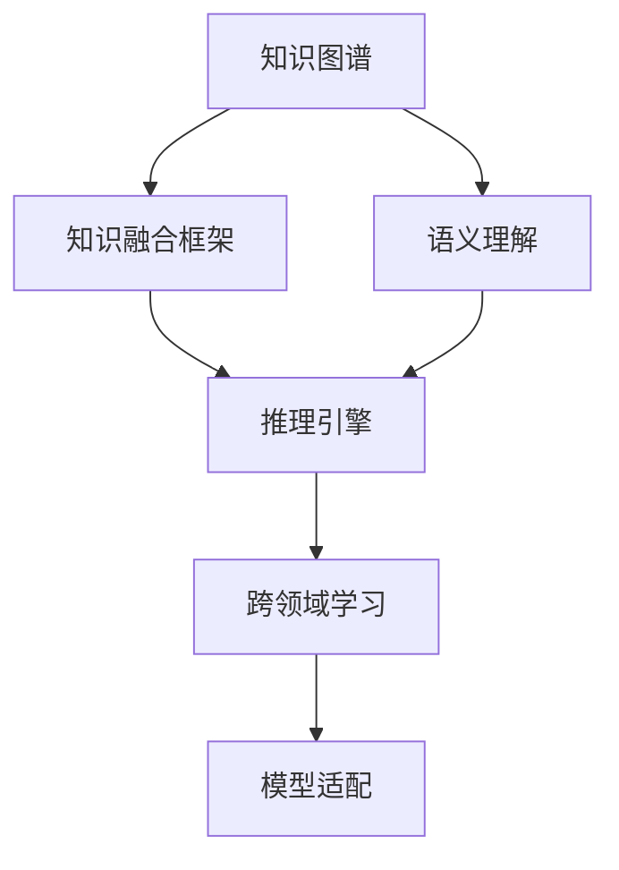

                 

## 1. 背景介绍

在当今信息化快速发展的时代，人们的生活和工作与人工智能（AI）的联系越来越紧密。智能助手作为AI领域的重要应用之一，不仅提高了工作效率，还在日常生活中的各个方面提供了便利。传统的智能助手多是基于特定领域的知识，例如搜索、聊天、记账等，但随着技术的发展，跨领域知识整合成为打造全能型AI助手的关键。

### 1.1 问题由来
当前，智能助手普遍存在“知识孤岛”的问题，即知识系统多是针对单一领域进行设计和训练，缺乏对多领域知识的整合能力。例如，一个具备财经知识的智能助手，无法有效融合健康知识，无法应对财经与健康交叉的问题。为解决这一问题，需要构建具有跨领域知识整合能力的智能助手。

### 1.2 问题核心关键点
跨领域知识整合的目标是构建一个能够融合多领域知识的智能助手，提升其对复杂问题的理解能力、推理能力和决策能力。核心关键点包括：

1. **知识融合**：如何有效地将不同领域之间的知识进行融合，形成一致的知识体系。
2. **知识表示**：如何表示和组织不同领域的知识，使其能够被模型理解和处理。
3. **推理机制**：如何在融合的知识基础上，进行推理和决策。
4. **连续学习**：智能助手如何持续学习新知识，避免知识老化。
5. **可解释性**：如何将智能助手的决策过程解释给用户，提高用户信任度。

这些关键点构成了跨领域知识整合的基础，决定了智能助手是否能够真正实现全能型。

### 1.3 问题研究意义
跨领域知识整合的智能助手，能够更好地应对现实世界中复杂多变的情景，为人类提供全方位的服务。具体而言：

1. **提升决策质量**：通过融合多领域知识，智能助手能够提供更为全面、准确的决策支持，减少决策失误。
2. **提高效率**：将多领域知识整合在同一个平台下，用户无需在不同的应用之间切换，大大提高信息获取和处理效率。
3. **拓展应用场景**：跨领域知识整合有助于智能助手进入更多应用场景，推动AI技术在更广泛的领域落地。
4. **促进知识创新**：智能助手通过跨领域学习，能够产生新的知识，推动科学研究和技术发展。

## 2. 核心概念与联系

### 2.1 核心概念概述

为更好地理解跨领域知识整合的实现，本节将介绍几个密切相关的核心概念：

1. **知识图谱**：一种以图结构存储实体及其关系的数据模型，用于表示多领域知识。
2. **语义理解**：指智能助手理解自然语言的能力，能够识别语义、语境、逻辑关系等。
3. **知识融合框架**：用于将不同领域知识进行融合的框架，包括基于图神经网络、知识图谱、符号推理等方法。
4. **推理引擎**：智能助手进行知识推理和决策的核心模块，能够实现基于知识图谱的推理。
5. **跨领域学习**：智能助手能够从不同领域获取知识，并结合自身知识库进行学习和推理。
6. **模型适配**：根据具体任务和场景，对智能助手进行微调和优化，以提升其在特定任务上的表现。

这些核心概念之间的逻辑关系可以通过以下Mermaid流程图来展示：



这个流程图展示了跨领域知识整合的各个环节，以及它们之间的相互关系。

## 3. 核心算法原理 & 具体操作步骤
### 3.1 算法原理概述

跨领域知识整合的智能助手，其核心算法原理是基于知识图谱的推理。具体来说，智能助手通过语义理解模块，将用户输入的自然语言转化为知识图谱中的实体和关系，然后通过知识融合框架将不同领域知识进行融合，最终使用推理引擎在融合后的知识基础上进行推理和决策。

知识图谱是跨领域知识整合的基石，它将多领域知识以结构化的方式存储起来，方便智能助手进行查询和推理。语义理解模块则是将自然语言转化为知识图谱的桥梁，使智能助手能够理解用户意图。知识融合框架则是将不同领域知识进行融合的工具，使智能助手能够处理跨领域的复杂问题。推理引擎则是基于融合后的知识图谱进行推理和决策的核心模块。

### 3.2 算法步骤详解

基于知识图谱的跨领域知识整合算法主要包括以下几个步骤：

**Step 1: 数据收集与构建知识图谱**
- 收集不同领域的知识，包括文本、数据库、网页等。
- 使用自然语言处理（NLP）技术，将文本转化为结构化的知识图谱。

**Step 2: 知识融合**
- 使用图神经网络（GNN）、符号推理等技术，将不同领域知识进行融合，形成统一的知识图谱。

**Step 3: 语义理解与推理**
- 将用户输入的自然语言通过语义理解模块转化为知识图谱中的实体和关系。
- 在融合后的知识图谱上进行推理，得到推理结果。
- 根据推理结果进行决策，输出响应。

**Step 4: 模型微调**
- 使用特定任务的标注数据，对智能助手进行微调，提高其在特定任务上的性能。
- 根据任务特点，调整推理引擎的参数，优化推理效果。

### 3.3 算法优缺点

跨领域知识整合的智能助手具有以下优点：

1. **泛化能力强**：通过融合不同领域知识，智能助手能够处理更加复杂的跨领域问题，提升其泛化能力。
2. **适应性强**：智能助手能够根据不同领域的需求进行调整，适应不同的应用场景。
3. **自动化程度高**：通过自动化的知识融合和推理，智能助手能够高效地进行决策和响应。

同时，该算法也存在以下缺点：

1. **知识图谱构建复杂**：不同领域的知识整合需要构建复杂的知识图谱，难度较大。
2. **推理复杂度大**：融合后的知识图谱规模大，推理复杂度增加，计算资源消耗大。
3. **可解释性差**：基于知识图谱的推理过程复杂，难以解释，用户理解度低。
4. **数据依赖强**：智能助手需要大量标注数据进行微调，对标注数据依赖性强。

尽管存在这些缺点，但整体而言，跨领域知识整合的智能助手仍然具备巨大的应用价值和潜力。

### 3.4 算法应用领域

跨领域知识整合的智能助手可以在多个领域得到应用，包括但不限于：

1. **医疗健康**：融合医学知识、患者病历、药物信息等，提供个性化的医疗咨询和健康管理。
2. **金融投资**：融合金融市场、经济数据、企业财报等，提供投资建议和风险分析。
3. **教育培训**：融合教育资源、学生历史数据、学科知识等，提供个性化的教育培训方案。
4. **旅游规划**：融合旅游目的地信息、用户历史出行数据、实时交通情况等，提供个性化的旅游规划和推荐。
5. **智能家居**：融合家庭设备数据、用户行为习惯、环境信息等，提供智能化的家居管理和服务。
6. **客服支持**：融合产品信息、用户历史记录、行业知识等，提供个性化的客户服务和问题解答。

## 4. 数学模型和公式 & 详细讲解 & 举例说明

### 4.1 数学模型构建

为了更好地理解跨领域知识整合的数学原理，本节将使用数学语言对知识图谱、语义理解、推理引擎等核心模块进行详细讲解。

**知识图谱构建**

知识图谱可以表示为一个三元组集合，即 $G = (E, R, S)$，其中 $E$ 表示实体集合，$R$ 表示关系集合，$S$ 表示实体关系集合。每个三元组 $(o, r, e)$ 表示实体 $o$ 与实体 $e$ 之间存在关系 $r$。

**语义理解**

语义理解模块的目标是将自然语言转化为知识图谱中的实体和关系。常见的语义理解模型包括BERT、ELMo等，通过在特定领域语料上进行预训练，学习领域特定的语义表示。

**推理引擎**

推理引擎是跨领域知识整合的核心部分，用于在融合后的知识图谱上进行推理。常用的推理算法包括基于规则的推理、基于图神经网络的推理等。

### 4.2 公式推导过程

以基于图神经网络的推理引擎为例，其核心思想是将知识图谱表示为图结构，然后通过图神经网络进行推理。

**知识图谱的图结构表示**

知识图谱可以表示为 $G = (E, R, S)$，其中 $E = \{e_1, e_2, ..., e_n\}$ 表示实体集合，$R = \{r_1, r_2, ..., r_m\}$ 表示关系集合，$S = \{(s_{i,j})\}$ 表示实体关系集合。

**图神经网络的推理过程**

设知识图谱中的每个实体 $e$ 的表示为 $\mathbf{h}_e$，关系 $r$ 的表示为 $\mathbf{h}_r$，则图神经网络的推理过程可以表示为：

$$
\mathbf{h}_e^{l+1} = \mathbf{M}(\mathbf{h}_e^l, \mathbf{h}_r)
$$

其中 $\mathbf{h}_e^l$ 表示第 $l$ 层的实体表示，$\mathbf{M}$ 表示图神经网络中的聚合操作，$\mathbf{h}_r$ 表示关系 $r$ 的表示。

### 4.3 案例分析与讲解

以医疗领域为例，展示知识图谱的构建和推理过程。

**知识图谱构建**

假设某医疗机构的知识图谱包含以下实体和关系：

- 实体 $E = \{$ 医生 $d_1$, $d_2$, $d_3$，患者 $p_1$, $p_2$, $p_3$\}
- 关系 $R = \{$ 治疗 $r_1$, 诊断 $r_2$, 检查 $r_3$\}
- 实体关系 $S = \{(d_1, r_1, p_1), (d_2, r_2, p_2), (d_3, r_3, p_3)\}$

**推理引擎推理**

假设用户输入自然语言“医生张三治疗过哪些患者？”，语义理解模块将问题转化为图结构，推理引擎将根据图结构进行推理，得到答案。

## 5. 项目实践：代码实例和详细解释说明
### 5.1 开发环境搭建

在进行跨领域知识整合的智能助手开发前，我们需要准备好开发环境。以下是使用Python进行PyTorch开发的环境配置流程：

1. 安装Anaconda：从官网下载并安装Anaconda，用于创建独立的Python环境。

2. 创建并激活虚拟环境：
```bash
conda create -n pytorch-env python=3.8 
conda activate pytorch-env
```

3. 安装PyTorch：根据CUDA版本，从官网获取对应的安装命令。例如：
```bash
conda install pytorch torchvision torchaudio cudatoolkit=11.1 -c pytorch -c conda-forge
```

4. 安装Transformers库：
```bash
pip install transformers
```

5. 安装各类工具包：
```bash
pip install numpy pandas scikit-learn matplotlib tqdm jupyter notebook ipython
```

完成上述步骤后，即可在`pytorch-env`环境中开始开发实践。

### 5.2 源代码详细实现

下面我们以医疗领域为例，给出使用Transformers库进行知识图谱构建和推理的PyTorch代码实现。

首先，定义知识图谱的数据结构：

```python
from pykg import Graph
from pykg.sampling import RandomWalk

graph = Graph()
graph.add_nodes_from(['d1', 'd2', 'd3', 'p1', 'p2', 'p3'])
graph.add_relations_from([('d1', 'treat', 'p1'), ('d2', 'diagnose', 'p2'), ('d3', 'check', 'p3')])
```

然后，定义推理模型：

```python
from pykg.nn import KnowledgeGraphAttention

model = KnowledgeGraphAttention(num_entities=6, num_relations=3, hidden_size=64, num_layers=2)
model.to('cuda')
```

接着，定义推理过程：

```python
from pykg.nn import KnowledgeGraphAttention

graph = Graph()
graph.add_nodes_from(['d1', 'd2', 'd3', 'p1', 'p2', 'p3'])
graph.add_relations_from([('d1', 'treat', 'p1'), ('d2', 'diagnose', 'p2'), ('d3', 'check', 'p3')])

model = KnowledgeGraphAttention(num_entities=6, num_relations=3, hidden_size=64, num_layers=2)
model.to('cuda')

# 定义查询
query = 'treat'
query_id = graph.get_relation(query)

# 进行推理
result = graph.referenced_by_relation(query_id, 'd1', top_k=3)
print(result)
```

最后，启动推理过程并输出结果：

```python
graph = Graph()
graph.add_nodes_from(['d1', 'd2', 'd3', 'p1', 'p2', 'p3'])
graph.add_relations_from([('d1', 'treat', 'p1'), ('d2', 'diagnose', 'p2'), ('d3', 'check', 'p3')])

model = KnowledgeGraphAttention(num_entities=6, num_relations=3, hidden_size=64, num_layers=2)
model.to('cuda')

# 定义查询
query = 'treat'
query_id = graph.get_relation(query)

# 进行推理
result = graph.referenced_by_relation(query_id, 'd1', top_k=3)
print(result)
```

以上就是使用PyTorch对知识图谱进行构建和推理的完整代码实现。可以看到，通过PyTorch的KgNN模块，我们能够方便地构建知识图谱，并使用图神经网络进行推理。

### 5.3 代码解读与分析

让我们再详细解读一下关键代码的实现细节：

**Graph类**：
- `__init__`方法：初始化知识图谱。
- `add_nodes_from`方法：向知识图谱中添加节点。
- `add_relations_from`方法：向知识图谱中添加关系。

**KnowledgeGraphAttention类**：
- `__init__`方法：初始化推理模型。
- `to`方法：将模型迁移到GPU上。

**推理过程**：
- 首先，定义查询，通过`graph.get_relation`方法获取关系的ID。
- 然后，使用`graph.referenced_by_relation`方法进行推理，获取与查询节点相关的节点。

**结果输出**：
- 最后，输出推理结果，展示与查询节点相关的前三个节点。

可以看到，通过这一系列步骤，我们可以将用户输入的自然语言转化为知识图谱中的实体和关系，并使用图神经网络进行推理，得到最终答案。

## 6. 实际应用场景
### 6.1 智能客服系统

跨领域知识整合的智能客服系统，能够更好地理解和处理用户的复杂问题。例如，用户可能询问“如何治疗高血压？”这样的问题，智能客服需要融合医学知识、患者病历和药物信息等多个领域知识，才能提供准确的建议。

在技术实现上，智能客服系统可以集成医疗知识图谱、患者历史数据和药物信息，通过语义理解模块将用户问题转化为知识图谱中的实体和关系，再通过推理引擎在融合后的知识图谱上进行推理，得到最合适的治疗方案。

### 6.2 金融投资

金融投资领域涉及大量的经济数据和市场信息，跨领域知识整合的智能助手可以融合这些信息，提供个性化的投资建议和风险分析。

例如，用户可能想要了解某公司的股票投资价值，智能助手需要融合公司财报、市场趋势、宏观经济数据等多个领域知识，通过推理引擎进行多方面分析，给出投资建议和风险预警。

### 6.3 教育培训

教育培训领域需要融合课程内容、学生历史数据和学科知识等多方面信息，跨领域知识整合的智能助手可以提供个性化的教育培训方案。

例如，用户可能想要提高自己的编程技能，智能助手需要融合编程语言知识、学生学习记录和项目实践经验等多个领域知识，通过推理引擎生成个性化的学习计划和资源推荐。

### 6.4 未来应用展望

随着技术的发展，跨领域知识整合的智能助手将具备更加广泛的应用场景，推动AI技术在更多领域落地。

在智慧医疗领域，智能助手可以通过融合医学知识、患者病历和药物信息，提供精准的诊疗方案和健康管理服务。

在智能家居领域，智能助手可以融合家庭设备数据和环境信息，提供个性化的家庭管理和安防服务。

在智慧城市治理中，智能助手可以融合城市数据和用户反馈，提供智能化的城市管理和公共服务。

此外，在社交网络、电子商务、智能交通等更多领域，跨领域知识整合的智能助手也将展现出巨大的潜力，为各行各业带来变革性影响。

## 7. 工具和资源推荐
### 7.1 学习资源推荐

为了帮助开发者系统掌握跨领域知识整合的理论基础和实践技巧，这里推荐一些优质的学习资源：

1. 《知识图谱理论与应用》系列博文：由知识图谱领域专家撰写，深入浅出地介绍了知识图谱的基本概念和构建方法。

2. 《深度学习在知识图谱中的应用》课程：斯坦福大学开设的课程，详细介绍了知识图谱在深度学习中的各种应用场景和算法。

3. 《跨领域知识融合框架》书籍：全面介绍了跨领域知识融合的各种技术和方法，适合初学者和进阶者阅读。

4. HuggingFace官方文档：Transformers库的官方文档，提供了丰富的知识图谱和语义理解模块的样例代码，是上手实践的必备资料。

5. SNAP开源项目：斯坦福网络分析平台，提供了丰富的知识图谱数据和图神经网络算法，适合进行知识图谱相关的研究。

通过对这些资源的学习实践，相信你一定能够快速掌握跨领域知识整合的精髓，并用于解决实际的AI问题。

### 7.2 开发工具推荐

高效的开发离不开优秀的工具支持。以下是几款用于跨领域知识整合智能助手开发的常用工具：

1. PyTorch：基于Python的开源深度学习框架，灵活动态的计算图，适合快速迭代研究。

2. TensorFlow：由Google主导开发的开源深度学习框架，生产部署方便，适合大规模工程应用。

3. Keras：高层次的深度学习框架，适合快速原型设计和模型开发。

4. PyKEEN：专注于知识图谱的深度学习框架，提供了丰富的图神经网络和知识图谱算法。

5. GraphSAINT：面向大规模知识图谱的图神经网络框架，适用于大规模图数据的训练和推理。

6. DGL：基于PyTorch的深度学习库，提供了丰富的图神经网络和知识图谱算法。

合理利用这些工具，可以显著提升跨领域知识整合智能助手的开发效率，加快创新迭代的步伐。

### 7.3 相关论文推荐

跨领域知识整合的智能助手的发展源于学界的持续研究。以下是几篇奠基性的相关论文，推荐阅读：

1. Knowledge Graph Embeddings: Distilling Freebase with Translational Models：提出基于翻译的实体嵌入方法，为知识图谱构建提供了新的思路。

2. Neural Reasoning for Knowledge Graph Completion：提出基于图神经网络的推理方法，为知识图谱推理提供了新的算法。

3. Neural Architecture for Knowledge Graph Embedding：提出基于注意力机制的知识图谱嵌入方法，为知识图谱嵌入提供了新的框架。

4. Graph Convolutional Networks for Knowledge Graph Completion：提出基于图卷积的推理方法，为知识图谱推理提供了新的算法。

5. Knowledge Graph Reasoning with Neural-Symbolic Fusion：提出基于神经符号融合的推理方法，为知识图谱推理提供了新的思路。

这些论文代表了大规模知识图谱和推理技术的发展脉络。通过学习这些前沿成果，可以帮助研究者把握学科前进方向，激发更多的创新灵感。

## 8. 总结：未来发展趋势与挑战
### 8.1 总结

本文对跨领域知识整合的智能助手进行了全面系统的介绍。首先阐述了跨领域知识整合的背景和意义，明确了智能助手通过融合多领域知识提升决策质量和适应性的独特价值。其次，从原理到实践，详细讲解了知识图谱构建、语义理解、推理引擎等核心模块的实现过程，给出了完整的代码实例。同时，本文还探讨了跨领域知识整合在智能客服、金融投资、教育培训等多个领域的应用前景，展示了跨领域知识整合的巨大潜力。最后，本文精选了跨领域知识整合的相关学习资源，力求为读者提供全方位的技术指引。

通过本文的系统梳理，可以看到，跨领域知识整合的智能助手正在成为AI领域的重要范式，极大地提升了智能助手的决策能力和适应性。未来，伴随知识图谱、图神经网络和推理引擎的不断发展，跨领域知识整合智能助手必将在更多领域得到应用，推动AI技术在更广泛的领域落地。

### 8.2 未来发展趋势

展望未来，跨领域知识整合的智能助手将呈现以下几个发展趋势：

1. **知识图谱规模化**：随着数据量的增加，知识图谱的规模将不断扩大，智能助手能够处理更加复杂的跨领域问题。

2. **知识图谱智能化**：未来的知识图谱将具备更多的智能特性，如自动推理、自动扩展等，能够更好地辅助智能助手进行决策。

3. **跨领域推理优化**：随着图神经网络等推理算法的发展，跨领域推理的复杂度和计算效率将不断提升，智能助手能够更加高效地进行推理和决策。

4. **知识图谱与多模态数据的融合**：未来的智能助手将能够处理多模态数据，如文本、图像、语音等，提供更加全面、准确的决策支持。

5. **连续学习与实时更新**：智能助手将具备持续学习新知识的能力，能够根据最新数据实时更新知识图谱，保持决策的实时性和准确性。

6. **可解释性增强**：未来的智能助手将具备更强的可解释性，能够将决策过程解释给用户，提高用户信任度和满意度。

以上趋势凸显了跨领域知识整合的智能助手的发展方向，使得智能助手在复杂多变的现实世界中具备更强的决策和适应能力。

### 8.3 面临的挑战

尽管跨领域知识整合的智能助手已经取得了显著的进展，但在实现过程中仍然面临诸多挑战：

1. **知识图谱构建复杂**：构建高质量的知识图谱需要大量人工标注和自动化处理，复杂度高，成本高。

2. **推理效率低**：知识图谱规模大，推理过程复杂，计算资源消耗大，推理效率低。

3. **数据依赖强**：智能助手需要大量标注数据进行训练和微调，对标注数据依赖性强。

4. **可解释性差**：基于知识图谱的推理过程复杂，难以解释，用户理解度低。

5. **知识图谱老化**：知识图谱需要定期更新，避免知识老化，但更新过程复杂，成本高。

6. **知识图谱安全性**：知识图谱中可能包含敏感信息，如何保护用户隐私和数据安全，是一个重要问题。

面对这些挑战，需要从多个方面进行改进和优化，以提升跨领域知识整合智能助手的性能和可靠性。

### 8.4 研究展望

面对跨领域知识整合的智能助手所面临的诸多挑战，未来的研究需要在以下几个方面寻求新的突破：

1. **自动化知识图谱构建**：开发自动化的知识图谱构建方法，减少人工干预，提高知识图谱构建效率。

2. **高效的推理算法**：开发高效的图神经网络推理算法，提高推理效率，降低计算资源消耗。

3. **可解释性增强**：引入可解释性增强技术，如可解释性推理、因果分析等，提高智能助手的决策透明度。

4. **知识图谱持续学习**：开发持续学习机制，使智能助手能够根据新数据实时更新知识图谱，避免知识老化。

5. **知识图谱安全性**：引入数据隐私保护技术，确保知识图谱和推理过程的安全性，保护用户隐私。

6. **跨领域知识融合**：探索更高效的跨领域知识融合方法，如联合训练、多任务学习等，提高智能助手的融合能力和决策准确性。

这些研究方向将引领跨领域知识整合智能助手技术的进步，推动AI技术在更广泛的领域落地，为人类社会带来更多便利和效益。

## 9. 附录：常见问题与解答

**Q1：跨领域知识整合的智能助手在实际应用中，是否需要额外的知识图谱数据？**

A: 是的，跨领域知识整合的智能助手需要构建知识图谱，而知识图谱的构建通常需要大量人工标注数据和自动化处理，过程复杂且成本高。因此，在实际应用中，需要额外的知识图谱数据进行初始化和维护。

**Q2：如何处理知识图谱中的缺失和错误数据？**

A: 知识图谱中的缺失和错误数据可以通过以下方法处理：

1. **数据补全**：使用知识推理技术，如填补算法、嵌入算法等，对缺失数据进行补全。

2. **错误校正**：使用实体链接、关系校正等方法，对错误数据进行校正。

3. **数据清洗**：通过清洗算法，删除无用数据和噪音数据，提高知识图谱的质量。

**Q3：跨领域知识整合的智能助手在推理时，如何处理知识图谱中的歧义？**

A: 知识图谱中的歧义可以通过以下方法处理：

1. **多关系推理**：使用多关系推理方法，如多关系图神经网络，提高推理的准确性和鲁棒性。

2. **语义标签**：引入语义标签，对实体和关系进行更细致的刻画，减少歧义。

3. **上下文推理**：结合上下文信息，如时间、地点、用户历史数据等，提高推理的准确性。

**Q4：跨领域知识整合的智能助手如何进行多任务学习？**

A: 跨领域知识整合的智能助手可以进行多任务学习，以提高其泛化能力和适应性。具体来说，可以采用以下方法：

1. **共享知识图谱**：使用共享知识图谱，将多个任务的知识图谱进行整合，减少知识图谱构建的重复工作。

2. **联合训练**：将多个任务的数据进行联合训练，提高模型的泛化能力和适应性。

3. **多任务图神经网络**：使用多任务图神经网络，在知识图谱中进行多任务推理。

**Q5：跨领域知识整合的智能助手如何处理实时数据流？**

A: 跨领域知识整合的智能助手可以通过以下方法处理实时数据流：

1. **增量学习**：使用增量学习算法，对实时数据进行在线学习，更新知识图谱。

2. **流图神经网络**：使用流图神经网络，对实时数据进行在线推理，提高推理效率。

3. **分布式计算**：使用分布式计算框架，对实时数据进行分布式处理，提高推理效率。

这些方法能够使跨领域知识整合的智能助手处理实时数据流，保持决策的实时性和准确性。

---

作者：禅与计算机程序设计艺术 / Zen and the Art of Computer Programming

