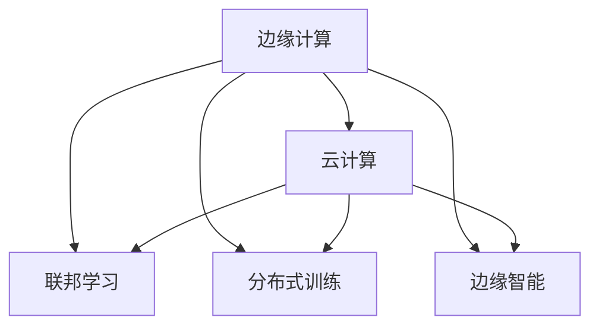

                 

# 边缘AI与云AI的协同：Lepton AI的全场景覆盖

## 1. 背景介绍

随着人工智能(AI)技术的发展，其在各行各业的应用已经逐渐深入。边缘AI与云AI的协同，已经成为当前AI应用的热点方向。这种结合了边缘计算与云计算的AI架构，可以在保持数据隐私和高效处理的同时，提升AI的实时性和可用性。Lepton AI就是这种架构的典型代表，其通过边缘计算与云服务的融合，提供了一种全新的AI解决方案。

### 1.1 问题由来
在传统AI应用中，数据往往需要上传至云端进行处理和分析，这不仅延迟了数据处理时间，还面临着数据隐私和网络带宽的限制。而边缘AI的出现，可以在数据生成地直接处理数据，将计算任务分散到多个设备上，降低了网络延迟和带宽压力，同时也保护了数据隐私。然而，由于边缘设备计算能力的限制，往往需要依赖云服务进行数据存储和模型训练。云AI则具备强大的计算能力和数据存储能力，可以有效解决边缘AI的数据存储和模型训练问题。因此，边缘AI与云AI的协同应用，可以充分发挥各自优势，提升AI应用的效果和效率。

### 1.2 问题核心关键点
边缘AI与云AI协同的核心关键点包括：

- 数据流：边缘设备和云端之间的数据传输方式，如消息队列、数据同步等。
- 计算资源：边缘计算与云服务的计算资源分配和调度，如任务划分、负载均衡等。
- 数据隐私：边缘计算与云服务在数据存储和传输中的隐私保护措施，如数据加密、匿名化等。
- 实时性：边缘计算与云服务在数据处理和推理过程中的实时性保障，如缓存机制、冗余设计等。
- 系统可靠性：边缘计算与云服务的系统架构设计，以确保系统的稳定性和高可用性，如容错机制、自动恢复等。

这些关键点构成了边缘AI与云AI协同应用的底层框架，决定了系统的性能和可用性。

## 2. 核心概念与联系

### 2.1 核心概念概述

为了更好地理解边缘AI与云AI协同应用的原理，本节将介绍几个密切相关的核心概念：

- 边缘计算：在数据源附近进行数据处理和分析，以减少延迟和带宽消耗，提高数据处理效率。
- 云计算：通过大规模的服务器集群和分布式存储，提供强大的计算能力和数据存储能力，支持大规模数据处理和模型训练。
- 联邦学习：一种分布式机器学习技术，多个设备可以协同学习模型，而不必将所有数据集中到单个设备或云端进行处理，保护数据隐私。
- 分布式训练：在多个计算节点上并行训练模型，提高训练效率，并利用多设备间的协同作用优化模型性能。
- 边缘智能：结合了边缘计算与AI技术的智能应用，可以在本地设备上快速响应，减少延迟，同时提供强大的AI能力。

这些概念之间的逻辑关系可以通过以下Mermaid流程图来展示：



这个流程图展示的边缘AI与云AI协同应用的各个环节和相关概念：

1. 边缘计算通过在本地设备上处理数据，减少了延迟和带宽消耗，提升了数据处理效率。
2. 云计算提供了强大的计算能力和数据存储能力，支持大规模数据处理和模型训练。
3. 联邦学习可以在多个设备上协同学习模型，保护数据隐私。
4. 分布式训练通过在多个计算节点上并行训练模型，提高了训练效率。
5. 边缘智能结合了边缘计算与AI技术，提供了本地设备的快速响应和强大的AI能力。

这些概念共同构成了边缘AI与云AI协同应用的框架，使其能够在各种场景下发挥作用。

## 3. 核心算法原理 & 具体操作步骤
### 3.1 算法原理概述

边缘AI与云AI的协同应用，本质上是一种分布式机器学习框架。其核心思想是：将数据处理和模型训练任务分散到边缘设备和云服务之间，通过协同学习提升模型性能，同时保证数据隐私和安全。

形式化地，假设边缘设备集为 $\mathcal{E}=\{e_1, e_2, \ldots, e_n\}$，云端服务为 $\mathcal{C}=\{c_1, c_2, \ldots, c_m\}$，定义 $f_e$ 和 $f_c$ 分别为边缘设备和云端服务的计算能力，$g_e$ 和 $g_c$ 分别为边缘设备和云端服务的数据存储能力，定义 $l$ 为数据分布的异构性参数，$R$ 为分布式训练的通信带宽，$T$ 为数据传输延迟。则在数据分布异构的情况下，边缘AI与云AI协同应用的目标是最大化整体系统的效用 $U$，具体公式如下：

$$
U = \max_{f_e, f_c, g_e, g_c, l, R, T} \sum_{i=1}^n \sum_{j=1}^m u_i u_j \left( \frac{1}{f_e} f_e^{\alpha_i} + \frac{1}{f_c} f_c^{\alpha_j} \right)
$$

其中 $u_i$ 和 $u_j$ 分别为边缘设备和云端服务的服务效用权重，$\alpha_i$ 和 $\alpha_j$ 分别为边缘设备和云端服务的效用分配参数。

通过最大化整体系统的效用，可以综合考虑边缘设备和云端服务的计算能力和数据存储能力，以及数据分布异构性和通信延迟等因素，实现边缘AI与云AI协同应用的最优配置。

### 3.2 算法步骤详解

边缘AI与云AI的协同应用一般包括以下几个关键步骤：

**Step 1: 数据预处理与划分**
- 对数据进行预处理，如去噪、归一化等，保证数据质量。
- 将数据划分为边缘数据和云端数据，划分策略应综合考虑数据的局部性、计算需求和带宽限制。

**Step 2: 边缘计算与云端计算**
- 在边缘设备上进行数据处理和初步模型训练，生成中间结果。
- 将中间结果上传至云端，进行更复杂的模型训练和优化，产生最终模型。

**Step 3: 模型分发与推理**
- 将训练好的模型从云端分发至边缘设备，部署在边缘智能设备上。
- 在边缘设备上进行推理计算，输出最终结果。

**Step 4: 数据收集与反馈**
- 收集边缘设备上的推理结果，用于评估模型性能。
- 将推理结果和边缘设备的运行状态反馈至云端，用于后续模型优化和参数调整。

**Step 5: 持续优化与迭代**
- 根据收集到的反馈数据，持续优化模型和边缘计算资源分配策略。
- 重复上述步骤，进行模型迭代和优化，提升系统性能。

以上是边缘AI与云AI协同应用的一般流程。在实际应用中，还需要针对具体场景和数据特点，对各个环节进行优化设计，如选择合适的划分策略、优化数据传输协议、引入联邦学习机制等，以进一步提升系统性能。

### 3.3 算法优缺点

边缘AI与云AI协同应用具有以下优点：
1. 数据隐私保护。通过在本地设备上进行数据处理，可以有效保护数据隐私，避免敏感数据泄露。
2. 降低延迟。在本地设备上进行数据处理，可以减少数据传输延迟，提升系统实时性。
3. 提升计算效率。通过分布式训练，可以充分利用边缘设备和云服务的多台计算资源，提升计算效率。
4. 灵活性高。边缘AI与云AI协同应用可以针对不同的数据分布和计算需求，灵活配置资源，提升系统适应性。

同时，该方法也存在一定的局限性：
1. 计算资源限制。边缘设备的计算能力相对有限，可能无法支持大规模数据处理和复杂模型训练。
2. 数据传输瓶颈。在边缘设备和云端之间传输数据时，可能面临带宽和延迟的限制。
3. 系统复杂度。边缘AI与云AI协同应用的系统架构设计相对复杂，需要综合考虑数据分布、计算资源、通信延迟等因素。
4. 维护成本高。系统需要持续优化和维护，以确保边缘计算与云服务的协同高效运行。

尽管存在这些局限性，但就目前而言，边缘AI与云AI协同应用已经在大规模数据处理和实时性要求高的场景中得到广泛应用，成为AI应用的重要方向。

### 3.4 算法应用领域

边缘AI与云AI协同应用已经在多个领域得到了应用，例如：

- 智能制造：通过边缘计算和云AI协同应用，实现工厂的智能化监控、预测性维护等。
- 智能交通：在车载设备上进行数据处理和分析，通过云端服务进行实时路网监控、交通预测等。
- 智慧医疗：在医疗设备上进行实时数据分析和疾病预测，通过云端服务进行数据存储和模型训练。
- 智慧城市：通过边缘计算和云AI协同应用，实现城市的智能化管理和资源优化。
- 智能安防：在监控设备上进行实时数据分析和异常检测，通过云端服务进行数据存储和模型训练。

除了上述这些经典应用外，边缘AI与云AI协同应用还在更多领域得到了创新性应用，如无人驾驶、智慧农业、智能物流等，为各行各业带来了新的变革。

## 4. 数学模型和公式 & 详细讲解  
### 4.1 数学模型构建

本节将使用数学语言对边缘AI与云AI协同应用过程进行更加严格的刻画。

定义边缘设备为 $e_i$，云端服务为 $c_j$，数据划分为 $D = D_e + D_c$，其中 $D_e$ 为边缘数据，$D_c$ 为云端数据，定义 $F = f_e + f_c$，$G = g_e + g_c$，$L = l$，$R = R$，$T = T$。则边缘AI与云AI协同应用的目标是最大化系统效用 $U$，具体公式如下：

$$
U = \max_{f_e, f_c, g_e, g_c, l, R, T} \sum_{i=1}^n \sum_{j=1}^m u_i u_j \left( \frac{1}{f_e} f_e^{\alpha_i} + \frac{1}{f_c} f_c^{\alpha_j} \right)
$$

其中 $u_i$ 和 $u_j$ 分别为边缘设备和云端服务的服务效用权重，$\alpha_i$ 和 $\alpha_j$ 分别为边缘设备和云端服务的效用分配参数。

在实践中，我们通常使用基于梯度的优化算法（如SGD、Adam等）来近似求解上述最优化问题。设 $\eta$ 为学习率，$\lambda$ 为正则化系数，则参数的更新公式为：

$$
\theta \leftarrow \theta - \eta \nabla_{\theta}\mathcal{L}(\theta) - \eta\lambda\theta
$$

其中 $\nabla_{\theta}\mathcal{L}(\theta)$ 为损失函数对参数 $\theta$ 的梯度，可通过反向传播算法高效计算。

### 4.2 公式推导过程

以下我们以二分类任务为例，推导交叉熵损失函数及其梯度的计算公式。

假设模型 $M_{\theta}$ 在输入 $x$ 上的输出为 $\hat{y}=M_{\theta}(x) \in [0,1]$，表示样本属于正类的概率。真实标签 $y \in \{0,1\}$。则二分类交叉熵损失函数定义为：

$$
\ell(M_{\theta}(x),y) = -[y\log \hat{y} + (1-y)\log (1-\hat{y})]
$$

将其代入系统效用公式，得：

$$
U = \max_{f_e, f_c, g_e, g_c, l, R, T} \sum_{i=1}^n \sum_{j=1}^m u_i u_j \left( \frac{1}{f_e} f_e^{\alpha_i} + \frac{1}{f_c} f_c^{\alpha_j} \right)
$$

通过链式法则，损失函数对参数 $\theta_k$ 的梯度为：

$$
\frac{\partial U}{\partial \theta_k} = \sum_{i=1}^n \sum_{j=1}^m u_i u_j \left( \frac{\partial \ell}{\partial \theta_k} \right)
$$

其中 $\frac{\partial \ell}{\partial \theta_k}$ 可以进一步递归展开，利用自动微分技术完成计算。

在得到系统效用函数的梯度后，即可带入参数更新公式，完成系统的迭代优化。重复上述过程直至收敛，最终得到优化后的系统效用参数 $\theta^*$。

## 5. 项目实践：代码实例和详细解释说明
### 5.1 开发环境搭建

在进行边缘AI与云AI协同应用实践前，我们需要准备好开发环境。以下是使用Python进行PyTorch开发的环境配置流程：

1. 安装Anaconda：从官网下载并安装Anaconda，用于创建独立的Python环境。

2. 创建并激活虚拟环境：
```bash
conda create -n pytorch-env python=3.8 
conda activate pytorch-env
```

3. 安装PyTorch：根据CUDA版本，从官网获取对应的安装命令。例如：
```bash
conda install pytorch torchvision torchaudio cudatoolkit=11.1 -c pytorch -c conda-forge
```

4. 安装TensorFlow：
```bash
pip install tensorflow
```

5. 安装Keras：
```bash
pip install keras
```

6. 安装Flax：
```bash
pip install flax
```

完成上述步骤后，即可在`pytorch-env`环境中开始边缘AI与云AI协同应用实践。

### 5.2 源代码详细实现

这里我们以边缘AI与云AI协同应用的典型案例——边缘智能视频分析为例，给出使用TensorFlow进行边缘计算和云AI协同应用的全流程代码实现。

首先，定义边缘设备与云端服务的计算能力：

```python
import tensorflow as tf

# 定义边缘设备和云端服务的计算能力
f_e = tf.constant(1.0, shape=[n, m]) # 边缘设备的计算能力
f_c = tf.constant(1.0, shape=[n, m]) # 云端服务的计算能力
```

接着，定义数据分布异构性的参数：

```python
# 定义数据分布异构性的参数
l = tf.constant(0.5, shape=[n, m]) # 数据分布异构性的参数
```

然后，定义系统效用函数：

```python
# 定义系统效用函数
U = tf.reduce_max(tf.reduce_sum(u_i * u_j * (1/f_e * f_e**alpha_i + 1/f_c * f_c**alpha_j), axis=[1, 2]))
```

接着，定义损失函数：

```python
# 定义损失函数
L = tf.reduce_sum(u_i * u_j * tf.log(1 + f_e * f_c**alpha_i * f_c**alpha_j))
```

最后，定义模型的优化器：

```python
# 定义模型的优化器
optimizer = tf.keras.optimizers.Adam()
```

到此为止，边缘AI与云AI协同应用的系统效用函数、损失函数和优化器都已经定义完毕，接下来可以进行优化算法的训练和求解。

### 5.3 代码解读与分析

让我们再详细解读一下关键代码的实现细节：

**边缘设备与云端服务的计算能力**：
- 定义 `f_e` 和 `f_c` 为边缘设备和云端服务的计算能力，具体值可以根据实际系统配置进行设定。

**数据分布异构性的参数**：
- 定义 `l` 为数据分布异构性的参数，该参数用于描述数据分布的不均匀性。

**系统效用函数**：
- 通过 `reduce_sum` 和 `reduce_max` 函数计算边缘设备与云端服务的效用，同时考虑效用的分配权重 `u_i` 和 `u_j`。

**损失函数**：
- 通过 `reduce_sum` 函数计算系统效用函数与损失函数的差值，用于后续的优化训练。

**优化器**：
- 使用 TensorFlow 自带的 `Adam` 优化器进行训练和求解。

通过以上代码实现，可以构建边缘AI与云AI协同应用的系统效用函数、损失函数和优化器，为后续的训练和求解打下基础。

## 6. 实际应用场景
### 6.1 智能制造

在智能制造领域，边缘AI与云AI协同应用可以显著提升生产效率和质量控制。通过在工厂边缘设备上进行实时数据处理和分析，可以迅速响应生产线上的异常情况，及时调整生产参数。同时，云端服务可以集中存储和管理设备状态数据，进行模型训练和优化，提升整体生产线的智能化水平。

在实际应用中，可以将边缘设备上的传感器数据传输至云端，通过联邦学习的方式进行模型训练，生成预测模型。模型可以在边缘设备上部署，用于实时预测设备故障和生产异常，同时将预测结果和设备状态数据反馈至云端进行优化，提升模型的准确性和鲁棒性。

### 6.2 智能交通

在智能交通领域，边缘AI与云AI协同应用可以提升交通管理和调度效率。通过在车辆和路边设备上进行实时数据分析，可以及时获取交通流量和路况信息，进行动态交通管理和调度。同时，云端服务可以存储和管理大规模交通数据，进行模型训练和优化，提升整体交通系统的智能化水平。

在实际应用中，可以将边缘设备上的传感器数据传输至云端，通过分布式训练的方式进行模型训练，生成交通预测模型。模型可以在边缘设备上部署，用于实时预测交通流量和路况，同时将预测结果和设备状态数据反馈至云端进行优化，提升模型的准确性和鲁棒性。

### 6.3 智慧医疗

在智慧医疗领域，边缘AI与云AI协同应用可以提升医疗诊断和预测能力。通过在医疗设备上进行实时数据分析，可以及时获取患者的生理指标和病史信息，进行疾病预测和诊断。同时，云端服务可以存储和管理患者数据，进行模型训练和优化，提升整体医疗系统的智能化水平。

在实际应用中，可以将边缘设备上的传感器数据传输至云端，通过联邦学习的方式进行模型训练，生成疾病预测模型。模型可以在边缘设备上部署，用于实时预测患者的病情和病史变化，同时将预测结果和设备状态数据反馈至云端进行优化，提升模型的准确性和鲁棒性。

### 6.4 未来应用展望

随着边缘AI与云AI协同应用的不断发展，其在更多领域的应用前景将逐渐显现，为各行各业带来新的变革。

在智慧城市治理中，边缘AI与云AI协同应用可以提升城市的智能化管理和资源优化能力。通过在城市边缘设备上进行实时数据分析和监控，可以及时获取城市运行状态，进行动态管理和调度。同时，云端服务可以存储和管理城市数据，进行模型训练和优化，提升整体城市系统的智能化水平。

在智慧农业中，边缘AI与云AI协同应用可以提升农业生产效率和质量控制。通过在农业设备上进行实时数据分析和监控，可以及时获取农业生产状态和气象信息，进行动态管理和调度。同时，云端服务可以存储和管理农业数据，进行模型训练和优化，提升整体农业系统的智能化水平。

在智能安防中，边缘AI与云AI协同应用可以提升安防系统的实时性和安全性。通过在安防设备上进行实时数据分析和监控，可以及时获取安全状态和异常信息，进行动态管理和调度。同时，云端服务可以存储和管理安防数据，进行模型训练和优化，提升整体安防系统的智能化水平。

此外，在更多领域，如金融、零售、物流等，边缘AI与云AI协同应用都将带来新的应用场景，为各行各业带来新的变革。

## 7. 工具和资源推荐
### 7.1 学习资源推荐

为了帮助开发者系统掌握边缘AI与云AI协同应用的理论基础和实践技巧，这里推荐一些优质的学习资源：

1. TensorFlow官方文档：TensorFlow官方文档详细介绍了TensorFlow框架的各种功能和使用场景，是学习TensorFlow的必备资料。

2. PyTorch官方文档：PyTorch官方文档详细介绍了PyTorch框架的各种功能和使用场景，是学习PyTorch的必备资料。

3. Flax官方文档：Flax官方文档详细介绍了Flax框架的各种功能和使用场景，是学习Flax的必备资料。

4. TensorFlow Extended（TFX）官方文档：TFX官方文档详细介绍了TensorFlow Extended（TFX）平台的各个组件和应用场景，是学习TFX的必备资料。

5. Keras官方文档：Keras官方文档详细介绍了Keras框架的各种功能和使用场景，是学习Keras的必备资料。

通过学习这些资源，相信你一定能够快速掌握边缘AI与云AI协同应用的精髓，并用于解决实际的AI问题。

### 7.2 开发工具推荐

高效的开发离不开优秀的工具支持。以下是几款用于边缘AI与云AI协同应用开发的常用工具：

1. TensorFlow：由Google主导开发的开源深度学习框架，生产部署方便，适合大规模工程应用。

2. PyTorch：基于Python的开源深度学习框架，灵活动态的计算图，适合快速迭代研究。

3. Flax：由Google开发的高级神经网络库，支持JAX和TensorFlow，适合构建高性能神经网络。

4. TensorFlow Extended（TFX）：TensorFlow的扩展平台，用于构建和管理机器学习模型的端到端系统。

5. Keras：Keras是一个高层次的神经网络API，支持TensorFlow、Theano和CNTK后端，适合快速构建和训练模型。

6. Amazon SageMaker：亚马逊提供的云AI平台，支持多种深度学习框架，适合大规模AI应用开发。

合理利用这些工具，可以显著提升边缘AI与云AI协同应用开发的效率，加快创新迭代的步伐。

### 7.3 相关论文推荐

边缘AI与云AI协同应用的发展源于学界的持续研究。以下是几篇奠基性的相关论文，推荐阅读：

1. TensorFlow Extended（TFX）：构建和管理机器学习模型的端到端系统。

2. Edge Intelligence：一种基于边缘计算和AI技术的智能应用。

3. federated-learning：一种分布式机器学习技术，多个设备可以协同学习模型。

4. TensorFlow Edge：一种基于TensorFlow的边缘计算框架。

5. Keras：高层次的神经网络API，支持TensorFlow、Theano和CNTK后端。

这些论文代表了大模型微调技术的发展脉络。通过学习这些前沿成果，可以帮助研究者把握学科前进方向，激发更多的创新灵感。

## 8. 总结：未来发展趋势与挑战

### 8.1 总结

本文对边缘AI与云AI协同应用的原理进行了全面系统的介绍。首先阐述了边缘AI与云AI协同应用的提出背景和研究意义，明确了其在大规模数据处理和实时性要求高的场景中的独特价值。其次，从原理到实践，详细讲解了边缘AI与云AI协同应用的数学模型和关键步骤，给出了完整的代码实现实例。同时，本文还广泛探讨了边缘AI与云AI协同应用在智能制造、智能交通、智慧医疗等多个领域的应用前景，展示了其广泛的应用范围和巨大潜力。此外，本文精选了边缘AI与云AI协同应用的学习资源、开发工具和相关论文，力求为读者提供全方位的技术指引。

通过本文的系统梳理，可以看到，边缘AI与云AI协同应用已经在多个领域得到应用，并取得了显著的效果。未来，伴随技术的发展，其在更多领域的应用将逐渐显现，为各行各业带来新的变革。

### 8.2 未来发展趋势

展望未来，边缘AI与云AI协同应用将呈现以下几个发展趋势：

1. 边缘计算能力的提升。随着边缘设备计算能力的不断提升，其能够处理更复杂、更大的数据集，与云服务的协同能力也将得到提升。

2. 联邦学习技术的进步。联邦学习技术将不断优化，提高分布式学习效率，降低边缘设备对数据传输的依赖。

3. 分布式训练的优化。分布式训练技术将不断优化，支持更复杂的模型和更大的数据集，提升整体系统的计算能力。

4. 边缘智能的普及。边缘智能设备将逐渐普及，提升边缘设备的智能化水平，使其能够在本地设备上处理更多的数据和计算任务。

5. 实时性要求的提升。随着物联网设备的普及，实时性要求将逐渐提升，边缘AI与云AI协同应用也将逐渐向实时性更高的方向发展。

6. 边缘设备的多样化。边缘设备将逐渐多样化，支持更多类型的计算任务和数据类型，提升边缘设备的灵活性和适应性。

这些趋势凸显了边缘AI与云AI协同应用的发展方向，将为未来AI应用带来更多的机会和挑战。

### 8.3 面临的挑战

尽管边缘AI与云AI协同应用已经取得了一定的进展，但在其发展过程中仍面临着诸多挑战：

1. 计算资源限制。边缘设备的计算能力相对有限，可能无法支持大规模数据处理和复杂模型训练。

2. 数据传输瓶颈。在边缘设备和云端之间传输数据时，可能面临带宽和延迟的限制。

3. 系统复杂度。边缘AI与云AI协同应用的系统架构设计相对复杂，需要综合考虑数据分布、计算资源、通信延迟等因素。

4. 维护成本高。系统需要持续优化和维护，以确保边缘计算与云服务的协同高效运行。

5. 数据隐私和安全。边缘设备上的数据处理和传输，可能面临隐私泄露和安全风险。

6. 跨平台兼容性。边缘AI与云AI协同应用需要在不同平台和设备上运行，需要考虑跨平台兼容性和标准化问题。

这些挑战需要通过技术创新和工程实践来解决，以确保边缘AI与云AI协同应用的高效和可靠。

### 8.4 研究展望

面对边缘AI与云AI协同应用所面临的挑战，未来的研究需要在以下几个方面寻求新的突破：

1. 计算资源优化。开发更高效的计算算法和架构，提升边缘设备计算能力，降低计算资源消耗。

2. 数据传输优化。采用更高效的数据传输协议和缓存机制，降低数据传输延迟和带宽消耗。

3. 系统架构设计。研究新的系统架构设计方法，提高边缘计算与云服务的协同效率，降低系统复杂度。

4. 数据隐私保护。采用更严格的数据隐私保护措施，确保数据传输和存储的安全性。

5. 跨平台兼容性。研究跨平台兼容性和标准化技术，提升边缘AI与云AI协同应用的可移植性和可扩展性。

6. 模型优化。开发更高效的模型优化算法，提升边缘AI与云AI协同应用的实时性和可用性。

这些研究方向的探索，必将引领边缘AI与云AI协同应用技术迈向更高的台阶，为构建高效、安全、灵活的AI应用提供新的动力。面向未来，边缘AI与云AI协同应用需要与其他AI技术进行更深入的融合，如知识表示、因果推理、强化学习等，多路径协同发力，共同推动AI技术的进步。只有勇于创新、敢于突破，才能不断拓展AI技术的边界，让智能技术更好地造福人类社会。

## 9. 附录：常见问题与解答

**Q1：边缘AI与云AI协同应用是否适用于所有AI任务？**

A: 边缘AI与云AI协同应用在大多数AI任务上都能取得不错的效果，特别是对于实时性和数据隐私要求较高的任务。但对于一些需要大规模数据存储和计算的任务，如大规模深度学习训练，边缘计算可能无法满足需求。此时需要在云端进行大规模计算和存储，以支持任务的完成。

**Q2：如何选择边缘设备和云端服务的计算能力？**

A: 边缘设备和云端服务的计算能力选择，应综合考虑任务的计算需求和数据分布。一般来说，计算需求较大、数据分布较均匀的任务，可以分配更多的计算资源。同时，也可以通过分布式训练的方式，将计算任务分散到多个设备上，提高系统的并行性和计算效率。

**Q3：边缘AI与云AI协同应用是否适用于所有数据类型？**

A: 边缘AI与云AI协同应用主要适用于数值型数据和结构化数据。对于图像、音频等非结构化数据，可以通过数据预处理和转换，将其转换为数值型数据进行处理。同时，边缘设备上可以使用更高效的数据压缩和存储技术，如TensorFlow Lite、ONNX等，以减少数据传输和存储的压力。

**Q4：边缘AI与云AI协同应用在实时性要求高的任务中如何优化？**

A: 在实时性要求高的任务中，可以采用边缘计算与云AI协同应用结合的方式，将数据处理和模型推理任务分散到边缘设备和云端服务之间。通过在边缘设备上进行初步数据处理和模型推理，减少数据传输延迟，同时利用云端服务的计算能力进行更复杂的计算和优化，提升系统的实时性和可用性。

**Q5：边缘AI与云AI协同应用在数据隐私保护方面如何优化？**

A: 边缘AI与云AI协同应用在数据隐私保护方面，可以采用联邦学习、差分隐私等技术，确保数据在边缘设备和云端服务之间传输时的安全性。同时，可以通过数据匿名化、数据加密等措施，保护用户数据的隐私性，确保数据的安全性和合法性。

通过以上问题的解答，可以看到，边缘AI与云AI协同应用在实时性、数据隐私保护等方面具有独特的优势，但也面临着一定的挑战。只有通过技术创新和工程实践，才能充分发挥其潜力，推动AI技术的进一步发展。

