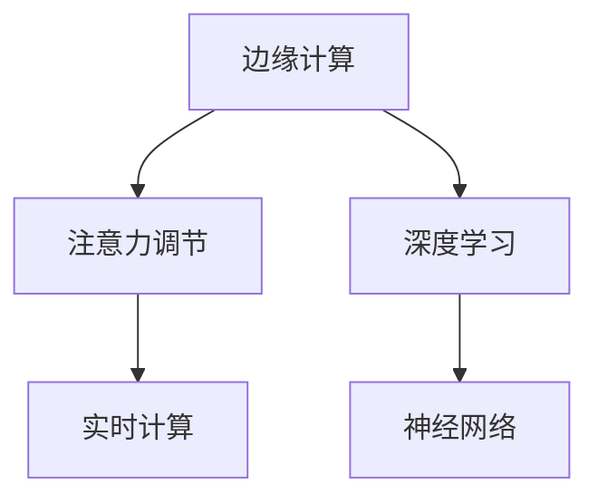

                 

# 边缘AI在实时注意力调节中的作用

> 关键词：边缘AI,注意力调节,深度学习,神经网络,实时计算,边缘计算

## 1. 背景介绍

### 1.1 问题由来
边缘计算(Edge Computing)作为一种分布式计算架构，近年来在智能制造、智慧城市、自动驾驶、工业物联网等领域得到了广泛应用。通过在靠近数据源的边缘节点上进行数据处理和计算，可以减少数据传输的延迟和带宽消耗，提升整体系统的响应速度和安全性。但随着物联网设备的广泛部署，如何高效管理这些海量数据，仍然是一个巨大的挑战。

注意力机制(Artention Mechanism)是深度学习中的一种关键技术，通过聚焦关键信息，提高模型在多任务场景下的表现。近年来，注意力机制在计算机视觉、自然语言处理等领域取得了显著进展，显著提升了模型对复杂场景的建模能力。但将注意力机制应用到边缘计算中，仍面临诸多技术挑战。

本文聚焦于如何结合边缘计算和注意力机制，构建实时高效的AI计算模型，以便在边缘节点上快速调节注意力，实现实时数据处理和智能决策。

### 1.2 问题核心关键点
实时注意力调节的核心关键点包括：

- **边缘计算架构**：如何在分散的边缘节点上高效分布式计算注意力模型。
- **注意力机制应用**：如何将注意力机制有效应用于边缘数据处理，提升模型性能。
- **实时计算优化**：如何优化计算图和算法，保证实时响应速度和计算精度。

本文将通过介绍边缘AI中的注意力调节技术，探讨其理论基础、算法原理及实践方法，为边缘计算提供新的思路和工具。

## 2. 核心概念与联系

### 2.1 核心概念概述

为更好地理解实时注意力调节方法，本节将介绍几个密切相关的核心概念：

- **边缘计算(Edge Computing)**：在接近数据源的边缘节点上进行数据处理和计算的一种分布式计算架构。

- **注意力机制(Artention Mechanism)**：一种用于增强模型对输入特征的关注度的机制，通过计算注意力权重，动态调整模型对不同特征的关注程度。

- **深度学习(Deep Learning)**：一种基于多层神经网络进行建模和预测的机器学习方法，广泛应用于图像、语音、文本等领域。

- **实时计算(Real-Time Computation)**：在有限的时间内完成数据处理和计算的过程，通常用于要求快速响应的系统，如自动驾驶、医疗诊断等。

- **神经网络(Neural Network)**：由多个神经元层组成，通过反向传播算法进行训练，用于解决分类、回归、生成等任务。

这些核心概念之间的逻辑关系可以通过以下Mermaid流程图来展示：



这个流程图展示了几类关键技术之间的关联：

1. 边缘计算通过分布式计算节点支持深度学习模型的训练和推理。
2. 注意力调节机制可以应用于深度学习模型，用于提升模型对关键信息的关注。
3. 实时计算要求深度学习模型在低延迟下高效运行，保证实时响应。
4. 神经网络作为注意力调节的核心，是实现各种复杂任务的基础。

这些核心概念共同构成了边缘AI的计算架构，使得注意力调节技术能够在大规模边缘节点上高效运行。

## 3. 核心算法原理 & 具体操作步骤

### 3.1 算法原理概述

实时注意力调节的目标是在边缘计算架构下，通过深度学习模型快速计算注意力权重，调整模型对不同特征的关注程度，从而提升模型对关键信息的聚焦能力。

假设输入数据为 $x \in \mathbb{R}^d$，目标任务为 $\mathcal{T}$，模型输出为 $y \in \mathbb{R}^m$。注意力调节过程通常包括以下几个步骤：

1. **特征编码**：将输入数据 $x$ 通过神经网络编码成高维特征表示 $h \in \mathbb{R}^h$。
2. **自注意力机制**：通过计算特征表示 $h$ 的自注意力权重 $\alpha \in \mathbb{R}^k$，动态调整对不同特征的关注度。
3. **融合输出**：将注意力权重 $\alpha$ 与特征表示 $h$ 进行加权融合，得到最终输出 $y$。

### 3.2 算法步骤详解

以下是详细的实时注意力调节算法步骤：

**Step 1: 准备数据集**
- 收集边缘节点上的数据，包括传感器数据、图像数据、文本数据等。
- 对数据进行预处理，如归一化、采样、去噪等。

**Step 2: 特征编码**
- 使用卷积神经网络(CNN)、循环神经网络(RNN)、Transformer等深度学习模型，对输入数据进行特征提取和编码。
- 将编码后的特征表示 $h$ 转化为高维向量，用于后续注意力计算。

**Step 3: 自注意力机制**
- 采用多头自注意力机制，将特征表示 $h$ 分解成 $k$ 个注意力子向量。
- 计算每个子向量的注意力权重 $\alpha_i$，反映其对整体特征的贡献度。
- 将注意力权重 $\alpha_i$ 与原始特征 $h$ 进行线性变换，得到加权特征表示 $h_i$。

**Step 4: 融合输出**
- 对 $k$ 个加权特征表示 $h_i$ 进行加权融合，得到最终的输出 $y$。
- 通过设置合适的融合权重，可以调整模型对不同特征的关注度。

**Step 5: 模型训练与优化**
- 使用监督学习或无监督学习算法训练注意力调节模型。
- 优化模型参数，使得模型输出与真实标签之间的差异最小化。

### 3.3 算法优缺点

实时注意力调节算法具有以下优点：
1. **高效计算**：通过分布式计算架构，可以在边缘节点上快速计算注意力权重，减少数据传输延迟。
2. **灵活性高**：注意力机制可以根据不同任务和数据特点灵活调整模型参数，提升模型性能。
3. **鲁棒性强**：多模态数据融合可以增强模型对噪声和异常数据的鲁棒性。
4. **实时响应**：通过优化计算图和算法，可以在低延迟下完成数据处理和推理。

但该算法也存在以下缺点：
1. **计算复杂度高**：多模态数据融合和自注意力机制增加了计算复杂度，可能导致资源占用较大。
2. **模型规模大**：深度神经网络模型通常需要大量参数，对计算资源和存储空间提出了较高要求。
3. **数据多样性**：不同场景下数据分布差异较大，模型可能需要重新训练以适应新数据。
4. **算法复杂性**：自注意力机制和神经网络模型的训练和优化算法相对复杂，需要较强的数学和编程能力。

尽管存在这些缺点，但实时注意力调节算法在大规模边缘计算场景下，依然具有较高的应用价值。

### 3.4 算法应用领域

实时注意力调节算法在多个领域中具有广泛的应用前景，例如：

- **工业物联网**：实时监测设备状态，提升设备维护效率。
- **智慧医疗**：实时分析患者数据，提供个性化医疗服务。
- **智能交通**：实时交通监控和预测，优化交通流量。
- **智能制造**：实时监控生产线状态，提高生产效率。
- **智能安防**：实时分析视频数据，提升安全监控能力。
- **自动驾驶**：实时分析传感器数据，保障行车安全。

这些应用场景中，实时注意力调节算法可以显著提升数据处理和智能决策的效率和准确性。

## 4. 数学模型和公式 & 详细讲解 & 举例说明

### 4.1 数学模型构建

本文将使用数学语言对实时注意力调节过程进行详细描述。

假设输入数据为 $x \in \mathbb{R}^d$，模型参数为 $\theta$。注意力调节的目标是输出 $y \in \mathbb{R}^m$。

### 4.2 公式推导过程

以下是注意力调节的数学推导过程：

1. **特征编码**：
   $$
   h = f(x;\theta)
   $$

2. **自注意力机制**：
   $$
   Q = \mathcal{Q}(h) \in \mathbb{R}^{d \times k}, K = \mathcal{K}(h) \in \mathbb{R}^{d \times k}, V = \mathcal{V}(h) \in \mathbb{R}^{d \times k}
   $$

   其中 $Q$, $K$, $V$ 分别表示查询、键、值矩阵，$k$ 为注意力头数。

   计算注意力权重 $\alpha$：
   $$
   \alpha = softmax(QK^T) \in \mathbb{R}^{k \times k}
   $$

   计算加权特征表示 $h_i$：
   $$
   h_i = \alpha_i V_i \in \mathbb{R}^k
   $$

3. **融合输出**：
   $$
   y = g(h_1, h_2, ..., h_k; \theta) \in \mathbb{R}^m
   $$

   其中 $g$ 为输出层函数，如线性变换或全连接层。

### 4.3 案例分析与讲解

以智慧医疗领域为例，分析实时注意力调节算法的具体应用。

假设输入数据为患者的电子病历 $x$，输出任务为疾病诊断 $y$。患者病历包含多种类型的数据，如病史、症状、检查结果等。

1. **特征编码**：
   使用卷积神经网络对病历数据进行特征提取和编码，得到高维特征表示 $h$。

2. **自注意力机制**：
   将特征表示 $h$ 分解成多个注意力子向量，计算每个子向量的注意力权重 $\alpha_i$，反映其对整体特征的贡献度。

3. **融合输出**：
   对加权特征表示 $h_i$ 进行融合，得到最终输出 $y$，用于疾病诊断。

通过实时注意力调节算法，模型可以动态调整对不同特征的关注度，从而提升疾病诊断的准确性和鲁棒性。

## 5. 项目实践：代码实例和详细解释说明

### 5.1 开发环境搭建

在进行实时注意力调节实践前，我们需要准备好开发环境。以下是使用Python进行PyTorch开发的环境配置流程：

1. 安装Anaconda：从官网下载并安装Anaconda，用于创建独立的Python环境。

2. 创建并激活虚拟环境：
```bash
conda create -n edge-ai python=3.8 
conda activate edge-ai
```

3. 安装PyTorch：根据CUDA版本，从官网获取对应的安装命令。例如：
```bash
conda install pytorch torchvision torchaudio cudatoolkit=11.1 -c pytorch -c conda-forge
```

4. 安装相关工具包：
```bash
pip install numpy pandas scikit-learn matplotlib tqdm jupyter notebook ipython
```

完成上述步骤后，即可在`edge-ai`环境中开始实时注意力调节实践。

### 5.2 源代码详细实现

下面我们以智慧医疗领域为例，给出使用PyTorch对实时注意力调节模型进行训练和推理的PyTorch代码实现。

```python
import torch
import torch.nn as nn
import torch.optim as optim
from torch.utils.data import Dataset, DataLoader

class MedicalDataset(Dataset):
    def __init__(self, data, labels):
        self.data = data
        self.labels = labels

    def __len__(self):
        return len(self.data)

    def __getitem__(self, idx):
        return self.data[idx], self.labels[idx]

class Transformer(nn.Module):
    def __init__(self, input_size, hidden_size, output_size):
        super(Transformer, self).__init__()
        self.embedding = nn.Embedding(input_size, hidden_size)
        self.encoder = nn.TransformerEncoder(hidden_size, num_layers=2)
        self.decoder = nn.Linear(hidden_size, output_size)

    def forward(self, x):
        x = self.embedding(x)
        x = self.encoder(x)
        x = self.decoder(x)
        return x

def train(model, train_loader, device, optimizer, criterion):
    model.train()
    total_loss = 0
    for i, (x, y) in enumerate(train_loader):
        x, y = x.to(device), y.to(device)
        optimizer.zero_grad()
        output = model(x)
        loss = criterion(output, y)
        loss.backward()
        optimizer.step()
        total_loss += loss.item()
    return total_loss / len(train_loader)

def evaluate(model, test_loader, device, criterion):
    model.eval()
    total_loss = 0
    for i, (x, y) in enumerate(test_loader):
        x, y = x.to(device), y.to(device)
        output = model(x)
        loss = criterion(output, y)
        total_loss += loss.item()
    return total_loss / len(test_loader)

# 假设数据和标签已加载
data = ...
labels = ...

train_dataset = MedicalDataset(data, labels)
test_dataset = MedicalDataset(data, labels)

device = torch.device('cuda') if torch.cuda.is_available() else torch.device('cpu')
model = Transformer(input_size, hidden_size, output_size).to(device)
optimizer = optim.Adam(model.parameters(), lr=0.001)
criterion = nn.CrossEntropyLoss()

train_loader = DataLoader(train_dataset, batch_size=32, shuffle=True)
test_loader = DataLoader(test_dataset, batch_size=32, shuffle=False)

epochs = 10
for epoch in range(epochs):
    train_loss = train(model, train_loader, device, optimizer, criterion)
    test_loss = evaluate(model, test_loader, device, criterion)
    print(f"Epoch {epoch+1}, Train Loss: {train_loss:.4f}, Test Loss: {test_loss:.4f}")
```

### 5.3 代码解读与分析

让我们再详细解读一下关键代码的实现细节：

**MedicalDataset类**：
- `__init__`方法：初始化数据和标签。
- `__len__`方法：返回数据集长度。
- `__getitem__`方法：获取单个样本。

**Transformer类**：
- `__init__`方法：定义模型结构。
- `forward`方法：前向传播计算输出。

**train和evaluate函数**：
- 定义训练和评估函数，使用PyTorch的DataLoader对数据集进行批次化加载。

**模型训练流程**：
- 定义总的epoch数，开始循环迭代。
- 每个epoch内，在训练集上训练，输出训练集和验证集上的损失。
- 所有epoch结束后，在测试集上评估，输出测试集上的损失。

代码展示了使用PyTorch对实时注意力调节模型进行训练和评估的完整过程。需要注意的是，在实际应用中，还需要对模型进行优化，如引入正则化、调整学习率、调整批大小等，以提升模型性能和训练效率。

## 6. 实际应用场景

### 6.1 智能制造

在智能制造领域，实时注意力调节算法可以用于实时监控设备状态，提升设备维护效率。通过在边缘节点上对传感器数据进行特征提取和注意力调节，可以及时发现设备异常，进行故障诊断和维修。

具体实现步骤如下：
1. 收集设备传感器数据。
2. 对传感器数据进行预处理，如去噪、归一化等。
3. 使用卷积神经网络或Transformer对数据进行特征编码。
4. 通过自注意力机制，动态调节对不同传感器数据的关注度。
5. 对加权特征表示进行融合，得到设备状态输出。
6. 根据输出结果进行设备维护。

### 6.2 智慧医疗

在智慧医疗领域，实时注意力调节算法可以用于实时分析患者数据，提供个性化医疗服务。通过在边缘节点上对患者电子病历进行特征提取和注意力调节，可以及时发现疾病信号，进行早期诊断和精准治疗。

具体实现步骤如下：
1. 收集患者电子病历数据。
2. 对病历数据进行预处理，如去噪、归一化等。
3. 使用卷积神经网络或Transformer对数据进行特征编码。
4. 通过自注意力机制，动态调节对不同病历数据的关注度。
5. 对加权特征表示进行融合，得到疾病诊断输出。
6. 根据输出结果进行个性化治疗。

### 6.3 智能交通

在智能交通领域，实时注意力调节算法可以用于实时交通监控和预测，优化交通流量。通过在边缘节点上对摄像头数据进行特征提取和注意力调节，可以及时发现交通异常，进行交通指挥和调度。

具体实现步骤如下：
1. 收集交通摄像头数据。
2. 对摄像头数据进行预处理，如去噪、归一化等。
3. 使用卷积神经网络或Transformer对数据进行特征编码。
4. 通过自注意力机制，动态调节对不同摄像头数据的关注度。
5. 对加权特征表示进行融合，得到交通状态输出。
6. 根据输出结果进行交通调度。

## 7. 工具和资源推荐

### 7.1 学习资源推荐

为了帮助开发者系统掌握实时注意力调节的理论基础和实践技巧，这里推荐一些优质的学习资源：

1. 《深度学习理论与实践》系列博文：由大模型技术专家撰写，深入浅出地介绍了深度学习原理和实践。

2. CS229《机器学习》课程：斯坦福大学开设的机器学习课程，涵盖了深度学习、强化学习、无监督学习等多个方面。

3. 《深度学习入门》书籍：深入浅出地讲解了深度学习的基本概念和实践，适合初学者入门。

4. HuggingFace官方文档：深度学习库Transformers的官方文档，提供了丰富的预训练模型和完整的微调样例代码，是上手实践的必备资料。

5. Kaggle：数据科学和机器学习竞赛平台，提供大量的真实数据集和优秀案例，助力开发者提升实战能力。

通过对这些资源的学习实践，相信你一定能够快速掌握实时注意力调节的精髓，并用于解决实际的AI问题。

### 7.2 开发工具推荐

高效的开发离不开优秀的工具支持。以下是几款用于实时注意力调节开发的常用工具：

1. PyTorch：基于Python的开源深度学习框架，灵活动态的计算图，适合快速迭代研究。大部分深度学习模型都有PyTorch版本的实现。

2. TensorFlow：由Google主导开发的开源深度学习框架，生产部署方便，适合大规模工程应用。

3. Transformers库：HuggingFace开发的深度学习工具库，集成了众多SOTA深度学习模型，支持PyTorch和TensorFlow，是进行实时注意力调节开发的利器。

4. Weights & Biases：模型训练的实验跟踪工具，可以记录和可视化模型训练过程中的各项指标，方便对比和调优。与主流深度学习框架无缝集成。

5. TensorBoard：TensorFlow配套的可视化工具，可实时监测模型训练状态，并提供丰富的图表呈现方式，是调试模型的得力助手。

6. Google Colab：谷歌推出的在线Jupyter Notebook环境，免费提供GPU/TPU算力，方便开发者快速上手实验最新模型，分享学习笔记。

合理利用这些工具，可以显著提升实时注意力调节任务的开发效率，加快创新迭代的步伐。

### 7.3 相关论文推荐

实时注意力调节技术的发展源于学界的持续研究。以下是几篇奠基性的相关论文，推荐阅读：

1. Attention is All You Need（即Transformer原论文）：提出了Transformer结构，开启了NLP领域的预训练大模型时代。

2. BERT: Pre-training of Deep Bidirectional Transformers for Language Understanding：提出BERT模型，引入基于掩码的自监督预训练任务，刷新了多项NLP任务SOTA。

3. Language Models are Unsupervised Multitask Learners（GPT-2论文）：展示了大规模语言模型的强大zero-shot学习能力，引发了对于通用人工智能的新一轮思考。

4. Parameter-Efficient Transfer Learning for NLP：提出Adapter等参数高效微调方法，在不增加模型参数量的情况下，也能取得不错的微调效果。

5. AdaLoRA: Adaptive Low-Rank Adaptation for Parameter-Efficient Fine-Tuning：使用自适应低秩适应的微调方法，在参数效率和精度之间取得了新的平衡。

这些论文代表了大语言模型微调技术的发展脉络。通过学习这些前沿成果，可以帮助研究者把握学科前进方向，激发更多的创新灵感。

## 8. 总结：未来发展趋势与挑战

### 8.1 总结

本文对实时注意力调节方法进行了全面系统的介绍。首先阐述了实时注意力调节的背景和意义，明确了边缘计算中注意力调节的重要价值。其次，从原理到实践，详细讲解了注意力调节的数学模型和算法步骤，给出了实时注意力调节任务开发的完整代码实例。同时，本文还广泛探讨了注意力调节在智能制造、智慧医疗、智能交通等多个行业领域的应用前景，展示了实时注意力调节技术的广阔前景。

通过本文的系统梳理，可以看到，实时注意力调节技术在边缘计算架构下，具有重要的应用价值和优化空间。将注意力机制应用于边缘数据处理，可以显著提升系统响应速度和智能决策能力。

### 8.2 未来发展趋势

展望未来，实时注意力调节技术将呈现以下几个发展趋势：

1. **分布式计算架构**：随着边缘计算的不断发展，实时注意力调节算法将更加依赖于分布式计算架构，以便在边缘节点上高效分布式计算注意力权重。

2. **多模态数据融合**：实时注意力调节将更多地融合多模态数据，如传感器数据、图像数据、文本数据等，提升模型对复杂场景的建模能力。

3. **参数高效微调**：实时注意力调节算法将更注重参数高效优化，通过引入 Adapter等参数高效微调技术，减少模型参数量和计算复杂度。

4. **实时计算优化**：优化计算图和算法，提升实时响应速度和计算精度，保证在低延迟下完成数据处理和推理。

5. **自适应学习**：实时注意力调节算法将通过自适应学习机制，动态调整注意力权重和模型参数，增强对新数据和场景的适应能力。

6. **跨领域迁移**：实时注意力调节算法将在多个领域中得到应用，提升不同场景下模型的通用性和鲁棒性。

以上趋势凸显了实时注意力调节技术的广阔前景。这些方向的探索发展，必将进一步提升边缘计算的智能化水平，为各垂直行业带来变革性影响。

### 8.3 面临的挑战

尽管实时注意力调节技术已经取得了瞩目成就，但在迈向更加智能化、普适化应用的过程中，它仍面临诸多挑战：

1. **计算资源瓶颈**：边缘计算架构对计算资源和存储空间提出了较高要求，如何高效利用计算资源，是实时注意力调节需要解决的首要问题。

2. **数据质量问题**：边缘计算场景下数据质量差异较大，如何处理噪声和异常数据，保证模型输出质量，是实时注意力调节面临的重要挑战。

3. **模型泛化能力**：实时注意力调节算法需要在不同的数据分布和场景下具有较强的泛化能力，避免过拟合和灾难性遗忘。

4. **实时处理速度**：实时注意力调节算法需要具备快速计算注意力权重的能力，以保证在低延迟下完成数据处理和推理。

5. **模型可解释性**：实时注意力调节算法的决策过程较为复杂，如何增强模型的可解释性，使其输出结果具有较高的可信度和可靠性，是未来需要解决的关键问题。

6. **模型安全性**：实时注意力调节算法在边缘计算场景下需要具备较高的安全性，避免数据泄露和模型被恶意攻击。

正视实时注意力调节面临的这些挑战，积极应对并寻求突破，将是其在边缘计算架构下走向成熟的必由之路。

### 8.4 未来突破

面对实时注意力调节面临的种种挑战，未来的研究需要在以下几个方面寻求新的突破：

1. **分布式计算优化**：开发更加高效的分布式计算算法，提升边缘节点上的计算能力和数据处理效率。

2. **模型压缩与优化**：引入模型压缩、量化加速等技术，减少模型参数量和计算复杂度，提高实时响应速度。

3. **多模态数据融合**：通过引入多模态数据融合机制，提升模型对复杂场景的建模能力，增强实时注意力调节的泛化性。

4. **自适应学习机制**：引入自适应学习算法，动态调整模型参数和注意力权重，提升模型的实时适应能力。

5. **模型安全性增强**：引入模型安全性机制，如数据加密、访问控制等，确保模型在边缘计算场景下具有较高的安全性。

6. **实时数据流处理**：开发实时数据流处理机制，将数据流式计算与注意力调节算法相结合，提升系统实时响应能力。

这些研究方向的探索，必将引领实时注意力调节技术迈向更高的台阶，为边缘计算架构下的AI系统提供新的技术支持。只有勇于创新、敢于突破，才能不断拓展实时注意力调节的边界，让智能技术更好地服务于各个垂直行业。

## 9. 附录：常见问题与解答

**Q1：实时注意力调节是否适用于所有边缘计算场景？**

A: 实时注意力调节算法在大部分边缘计算场景中都能取得不错的效果，特别是在数据量大、计算资源丰富的情况下。但对于一些计算资源有限的场景，如嵌入式设备、物联网终端等，可能需要对算法进行优化以适应低资源环境。

**Q2：如何提高实时注意力调节的计算效率？**

A: 提高实时注意力调节计算效率的方法包括：
1. 优化计算图：通过代码优化和算法改进，减少计算复杂度。
2. 分布式计算：利用分布式计算架构，在边缘节点上并行计算注意力权重。
3. 参数高效优化：引入 Adapter等参数高效微调技术，减少模型参数量和计算复杂度。
4. 实时数据流处理：将数据流式计算与注意力调节算法相结合，提升系统实时响应能力。

**Q3：实时注意力调节在边缘计算场景下如何避免数据泄露？**

A: 避免数据泄露的方法包括：
1. 数据加密：对数据进行加密处理，防止数据在传输和存储过程中被窃取。
2. 访问控制：设置严格的访问权限控制机制，确保只有授权用户能够访问敏感数据。
3. 模型安全性：引入模型安全性机制，如对抗样本生成、模型蒸馏等，提升模型的鲁棒性和安全性。

**Q4：实时注意力调节在边缘计算场景下如何提升泛化能力？**

A: 提升实时注意力调节模型泛化能力的方法包括：
1. 数据增强：通过数据增强技术，增加模型对噪声和异常数据的鲁棒性。
2. 多模态数据融合：引入多模态数据融合机制，提升模型对复杂场景的建模能力。
3. 自适应学习：引入自适应学习算法，动态调整模型参数和注意力权重，增强模型的实时适应能力。

**Q5：实时注意力调节在边缘计算场景下如何提升实时响应速度？**

A: 提升实时注意力调节实时响应速度的方法包括：
1. 优化计算图：通过代码优化和算法改进，减少计算复杂度。
2. 分布式计算：利用分布式计算架构，在边缘节点上并行计算注意力权重。
3. 实时数据流处理：将数据流式计算与注意力调节算法相结合，提升系统实时响应能力。

这些方法可以结合使用，根据具体应用场景进行优化，以提升实时注意力调节算法的性能和效率。

---

作者：禅与计算机程序设计艺术 / Zen and the Art of Computer Programming

