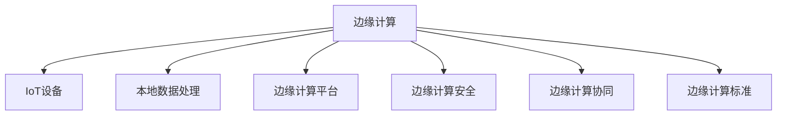

                 

# 边缘计算：IoT设备的本地数据处理技术

## 1. 背景介绍

### 1.1 问题由来

随着物联网(IoT)技术的迅猛发展，越来越多的设备和传感器被部署到网络边缘，采集海量数据。然而，将数据全部传输到云端进行处理，不仅会增加网络带宽的负担，而且会显著延长数据传输和处理的时延，影响应用性能。为此，边缘计算技术应运而生，旨在将数据处理任务从云端转移到边缘设备上，实现更快速、更高效的数据处理。

边缘计算指的是在网络边缘设备上，就近处理数据和应用，从而减少数据传输时延，提升系统响应速度，保护数据隐私。边缘计算可以应用于智能家居、智能制造、智慧城市、智能交通等多个领域，是实现智能化服务的重要手段。

### 1.2 问题核心关键点

边缘计算的核心在于通过将计算任务分布在边缘设备上，实现本地数据处理，进而减少数据传输时延，提升系统性能。边缘计算技术主要涉及以下几个方面：

1. **本地数据处理**：在边缘设备上进行数据处理，减少传输时延。
2. **边缘计算平台**：提供边缘计算基础设施，支持应用开发和运行。
3. **边缘计算安全**：确保边缘设备的数据传输和处理安全。
4. **边缘计算协同**：实现边缘设备间的协同工作，优化资源利用。
5. **边缘计算标准**：制定边缘计算的行业标准和规范。

这些关键点共同构成了边缘计算的核心框架，使其能够在实际应用中发挥最大效能。

## 2. 核心概念与联系

### 2.1 核心概念概述

为更好地理解边缘计算在IoT设备中的应用，本节将介绍几个密切相关的核心概念：

- **边缘计算**：在网络边缘就近处理数据和应用，以减少传输时延，提升系统性能。边缘计算涉及本地数据处理、边缘计算平台、边缘计算安全等多个方面。
- **IoT设备**：各类智能设备和传感器，能够采集和处理数据，通过网络传输到边缘计算平台。
- **本地数据处理**：在边缘设备上，就近对数据进行处理和分析，减少传输延迟。
- **边缘计算平台**：提供边缘计算基础设施，支持应用开发和运行。
- **边缘计算安全**：确保边缘设备的数据传输和处理安全，避免数据泄露和攻击。
- **边缘计算协同**：实现边缘设备间的协同工作，优化资源利用。
- **边缘计算标准**：制定边缘计算的行业标准和规范，促进技术应用和标准化。

这些核心概念之间的逻辑关系可以通过以下Mermaid流程图来展示：



这个流程图展示了大语言模型的核心概念及其之间的关系：

1. 边缘计算依赖IoT设备采集数据。
2. 本地数据处理是边缘计算的核心。
3. 边缘计算平台提供基础设施，支持应用运行。
4. 边缘计算安全保障数据安全。
5. 边缘计算协同优化资源利用。
6. 边缘计算标准促进技术应用。

这些概念共同构成了边缘计算的完整体系，使其能够在实际应用中发挥最大效能。

## 3. 核心算法原理 & 具体操作步骤

### 3.1 算法原理概述

边缘计算的算法原理可以概括为在边缘设备上就近处理数据，减少传输时延。其核心思想是将计算任务分布到多个边缘设备上，由每个设备独立处理部分数据，最终将处理结果汇总到云端或其他目标设备。

形式化地，假设IoT设备采集到数据 $D$，需要处理的任务为 $T$。边缘计算的目标是找到一组边缘设备 $E=\{e_1,e_2,...,e_k\}$，使得在每个边缘设备上处理的数据 $D_{ei} \subset D$ 满足局部性原则，即 $D_{ei}$ 与 $D_{ej}$ 之间有较为紧密的空间和/或时间关联性。通过分布式计算，每个边缘设备 $e_i$ 对本地数据 $D_{ei}$ 进行处理，生成局部结果 $R_{ei}$，然后将所有局部结果 $R_e=\{R_{ei}\}_{i=1}^k$ 汇总到云端或其他目标设备进行处理。

### 3.2 算法步骤详解

边缘计算的算法步骤主要包括数据采集、本地处理、结果汇总和应用部署。

**Step 1: 数据采集**

边缘计算的第一步是收集IoT设备采集的数据。具体步骤如下：

1. 部署IoT设备，如传感器、摄像头、RFID标签等，采集相关数据。
2. 将采集到的数据通过无线网络传输到边缘设备。
3. 数据在边缘设备上进行预处理，如去噪、压缩等，减少后续处理的数据量。

**Step 2: 本地处理**

边缘计算的核心在于本地处理。具体步骤如下：

1. 边缘设备对接收到的数据进行初步分析，判断是否需要进一步处理。
2. 如果需要，则根据本地数据的特点，选择合适的算法进行处理，如分类、聚类、回归等。
3. 处理后得到局部结果 $R_{ei}$。

**Step 3: 结果汇总**

边缘设备将处理后的局部结果 $R_{ei}$ 汇总到云端或其他目标设备，进行全局处理。具体步骤如下：

1. 将各边缘设备的局部结果 $R_e=\{R_{ei}\}_{i=1}^k$ 发送至中央节点。
2. 中央节点对接收到的局部结果进行聚合，如取平均、加权平均等。
3. 最终得到全局结果 $R_g$。

**Step 4: 应用部署**

将全局结果 $R_g$ 部署到目标设备，供后续应用使用。具体步骤如下：

1. 根据应用需求，将全局结果 $R_g$ 转化为目标设备所需的格式。
2. 将处理后的数据保存到目标设备，或用于后续的计算和分析。
3. 应用根据处理后的数据，进行相应的业务逻辑处理。

### 3.3 算法优缺点

边缘计算具有以下优点：

1. 减少数据传输时延，提高系统响应速度。
2. 减少带宽占用，降低通信成本。
3. 保护数据隐私，避免数据泄露。
4. 优化资源利用，提高计算效率。

但同时，边缘计算也存在一些缺点：

1. 边缘设备计算能力有限，可能无法处理复杂任务。
2. 边缘设备资源有限，可能影响局部处理效果。
3. 边缘设备管理复杂，需要统一的管控平台。
4. 边缘计算标准不统一，可能影响跨平台应用。

尽管存在这些局限性，但边缘计算仍是大数据处理和IoT应用的重要技术手段，具有广阔的应用前景。

### 3.4 算法应用领域

边缘计算技术广泛应用于智能家居、智能制造、智慧城市、智能交通等多个领域，具体应用如下：

- **智能家居**：通过在家庭边缘设备上处理数据，实现智能安防、智能照明、智能温控等功能，提升家居生活品质。
- **智能制造**：在工业边缘设备上处理实时数据，实现智能监控、故障预测、生产优化等功能，提升制造效率和质量。
- **智慧城市**：在城市边缘设备上处理交通、环境、公共安全等数据，实现智慧交通、智慧安防、智慧医疗等功能，提升城市管理水平。
- **智能交通**：在交通边缘设备上处理实时交通数据，实现智能导航、智能停车、智能信号控制等功能，提升交通效率和安全性。

除了上述这些典型应用外，边缘计算还在农业、能源、环境监测等多个领域中发挥着重要作用，为各行各业带来了全新的变革。

## 4. 数学模型和公式 & 详细讲解 & 举例说明

### 4.1 数学模型构建

为了更好地理解边缘计算的算法原理，本节将使用数学语言对边缘计算的模型进行更加严格的刻画。

假设IoT设备采集的数据集为 $D$，处理的任务为 $T$。在边缘设备 $e_i$ 上处理的数据为 $D_{ei} \subset D$，处理后的结果为 $R_{ei}$。全局结果为 $R_g$。

定义每个边缘设备上的局部处理函数为 $f_i: D_{ei} \rightarrow R_{ei}$，则全局处理函数可以表示为 $f: D \rightarrow R_g$。

### 4.2 公式推导过程

以下我们以简单的二分类问题为例，推导边缘计算的数学模型。

假设每个边缘设备 $e_i$ 处理的数据 $D_{ei}$ 为一组二元特征 $(x_{ei}, y_{ei})$，其中 $x_{ei} \in \mathbb{R}^d$ 为特征向量，$y_{ei} \in \{0,1\}$ 为标签。处理后的结果 $R_{ei}$ 为预测结果 $\hat{y}_{ei} \in \{0,1\}$。

定义局部处理函数为 $f_i(x_{ei}, y_{ei}) = \hat{y}_{ei} = \text{sign}(f_i(x_{ei}))$，其中 $f_i(x_{ei})$ 为模型在 $x_{ei}$ 上的预测概率。

定义全局处理函数为 $f(x) = \frac{1}{k} \sum_{i=1}^k f_i(x)$，其中 $k$ 为边缘设备数量。

将上述公式代入模型中，得到全局处理结果为：

$$
R_g = f(D) = \frac{1}{k} \sum_{i=1}^k \text{sign}(f_i(x_{ei}))
$$

### 4.3 案例分析与讲解

为了更好地理解边缘计算的数学模型，以下以一个具体的案例进行分析。

假设在智慧城市中，需要处理交通数据以实现智能信号控制。交通数据采集自交通边缘设备，如摄像头、雷达等，处理任务为信号灯控制。假设共有 $k=5$ 个交通边缘设备，每个设备处理的数据集大小为 $n=1000$。

具体处理步骤如下：

1. 数据采集：交通边缘设备采集交通数据，如车流量、速度、方向等。
2. 本地处理：每个设备独立处理其数据集，得到局部处理结果 $\hat{y}_{ei}$。
3. 结果汇总：将各设备的结果 $\hat{y}_{ei}$ 汇总到云端，得到全局结果 $R_g$。
4. 应用部署：根据全局结果 $R_g$，实时调整信号灯状态，实现交通控制。

假设每个边缘设备的处理模型为二分类模型，输出预测结果 $\hat{y}_{ei} \in \{0,1\}$，其中 $0$ 表示通行，$1$ 表示停止。最终的全局结果 $R_g$ 为：

$$
R_g = \frac{1}{5} \sum_{i=1}^5 \text{sign}(\hat{y}_{ei})
$$

在实际应用中，还需要根据具体需求选择合适的模型和算法，如线性回归、决策树、神经网络等，以实现最优的局部处理效果。

## 5. 项目实践：代码实例和详细解释说明

### 5.1 开发环境搭建

在进行边缘计算实践前，我们需要准备好开发环境。以下是使用Python进行TensorFlow开发的环境配置流程：

1. 安装Anaconda：从官网下载并安装Anaconda，用于创建独立的Python环境。

2. 创建并激活虚拟环境：
```bash
conda create -n edge-env python=3.8 
conda activate edge-env
```

3. 安装TensorFlow：根据CUDA版本，从官网获取对应的安装命令。例如：
```bash
conda install tensorflow tensorflow-gpu=2.5 -c tf
```

4. 安装TensorFlow扩展库：
```bash
pip install tensorflow_addons
```

5. 安装各类工具包：
```bash
pip install numpy pandas scikit-learn matplotlib tqdm jupyter notebook ipython
```

完成上述步骤后，即可在`edge-env`环境中开始边缘计算实践。

### 5.2 源代码详细实现

下面我们以处理智能家居中的智能照明系统为例，给出使用TensorFlow进行边缘计算的PyTorch代码实现。

首先，定义数据处理函数：

```python
import numpy as np
import tensorflow as tf

def preprocess_data(data):
    # 对数据进行预处理，如去噪、归一化等
    # 返回预处理后的数据
    return data
```

然后，定义模型和优化器：

```python
from tensorflow.keras.models import Sequential
from tensorflow.keras.layers import Dense

# 定义模型
model = Sequential()
model.add(Dense(64, input_dim=10, activation='relu'))
model.add(Dense(1, activation='sigmoid'))

# 编译模型
model.compile(optimizer='adam', loss='binary_crossentropy', metrics=['accuracy'])

# 定义优化器
optimizer = tf.keras.optimizers.Adam()
```

接着，定义训练和评估函数：

```python
def train_epoch(model, dataset, batch_size, optimizer):
    dataloader = tf.data.Dataset.from_tensor_slices(dataset)
    model.train()
    epoch_loss = 0
    for batch in dataloader:
        inputs, labels = batch
        model.zero_grad()
        outputs = model(inputs)
        loss = model.loss(inputs, labels)
        epoch_loss += loss.numpy()
        loss.backward()
        optimizer.apply_gradients(zip(model.trainable_variables, model.optimizer.updates))
    return epoch_loss / len(dataset)

def evaluate(model, dataset, batch_size):
    dataloader = tf.data.Dataset.from_tensor_slices(dataset)
    model.eval()
    preds, labels = [], []
    with tf.GradientTape() as tape:
        for batch in dataloader:
            inputs, labels = batch
            outputs = model(inputs)
            loss = model.loss(inputs, labels)
    print('Test loss:', loss.numpy())
    print('Test accuracy:', tf.keras.metrics.Accuracy()(tf.math.argmax(outputs, axis=1), labels))
```

最后，启动训练流程并在测试集上评估：

```python
epochs = 5
batch_size = 32

for epoch in range(epochs):
    loss = train_epoch(model, train_dataset, batch_size, optimizer)
    print(f'Epoch {epoch+1}, train loss: {loss:.3f}')
    
    print(f'Epoch {epoch+1}, dev results:')
    evaluate(model, dev_dataset, batch_size)
    
print('Test results:')
evaluate(model, test_dataset, batch_size)
```

以上就是使用TensorFlow对智能家居中的智能照明系统进行边缘计算的完整代码实现。可以看到，通过定义数据处理函数、模型和优化器，以及训练和评估函数，可以实现边缘计算的本地数据处理和结果汇总。

### 5.3 代码解读与分析

让我们再详细解读一下关键代码的实现细节：

**preprocess_data函数**：
- 对输入的数据进行预处理，如去噪、归一化等。预处理是边缘计算中非常重要的一环，可以显著提升模型性能和计算效率。

**定义模型和优化器**：
- 使用Keras API定义一个简单的神经网络模型，用于处理智能照明系统的数据。
- 选择Adam优化器，配合二分类交叉熵损失函数，进行模型训练和评估。

**训练和评估函数**：
- 定义训练函数train_epoch，使用TensorFlow的Dataset API进行数据迭代，计算损失并更新模型参数。
- 定义评估函数evaluate，使用TensorFlow的GradientTape自动计算梯度和损失，输出测试结果。

**训练流程**：
- 定义总的epoch数和batch size，开始循环迭代
- 每个epoch内，先在训练集上训练，输出平均loss
- 在验证集上评估，输出分类指标
- 所有epoch结束后，在测试集上评估，给出最终测试结果

可以看到，TensorFlow提供了丰富的API和工具，使得边缘计算的开发和实现变得简洁高效。开发者可以将更多精力放在数据处理、模型改进等高层逻辑上，而不必过多关注底层的实现细节。

当然，工业级的系统实现还需考虑更多因素，如模型的保存和部署、超参数的自动搜索、更多先验知识的融合等。但核心的边缘计算范式基本与此类似。

## 6. 实际应用场景

### 6.1 智能家居

智能家居设备，如智能灯泡、智能温控器、智能安防等，能够采集大量的实时数据，如温度、湿度、光线、人流等。通过在边缘设备上处理这些数据，可以实现智能照明、智能温控、智能安防等功能，提升家居生活品质。

具体实现步骤如下：

1. 在家庭边缘设备上部署传感器，采集实时数据。
2. 数据在边缘设备上进行初步处理，如去噪、压缩等。
3. 选择适当的算法进行处理，如分类、聚类、回归等。
4. 处理后得到局部结果，并进行结果汇总。
5. 将全局结果部署到家庭中央控制器，供后续应用使用。

通过边缘计算，智能家居系统可以实现自适应控制，提高能源利用效率，提升居住舒适度和安全性。

### 6.2 智能制造

在智能制造中，工业边缘设备能够实时采集大量数据，如设备状态、生产参数、产品质量等。通过在边缘设备上处理这些数据，可以实现智能监控、故障预测、生产优化等功能，提升制造效率和质量。

具体实现步骤如下：

1. 在工业边缘设备上部署传感器，采集实时数据。
2. 数据在边缘设备上进行初步处理，如去噪、压缩等。
3. 选择适当的算法进行处理，如分类、聚类、回归等。
4. 处理后得到局部结果，并进行结果汇总。
5. 将全局结果部署到工业中央控制系统，供后续应用使用。

通过边缘计算，智能制造系统可以实现实时监控和预测，提高设备可靠性和生产效率，降低生产成本。

### 6.3 智慧城市

在智慧城市中，城市边缘设备能够实时采集大量数据，如交通流量、环境监测、公共安全等。通过在边缘设备上处理这些数据，可以实现智能交通、智能安防、智慧医疗等功能，提升城市管理水平。

具体实现步骤如下：

1. 在城市边缘设备上部署传感器，采集实时数据。
2. 数据在边缘设备上进行初步处理，如去噪、压缩等。
3. 选择适当的算法进行处理，如分类、聚类、回归等。
4. 处理后得到局部结果，并进行结果汇总。
5. 将全局结果部署到城市中央管理系统，供后续应用使用。

通过边缘计算，智慧城市系统可以实现实时监测和控制，提高城市运行效率，提升居民生活质量。

### 6.4 未来应用展望

随着边缘计算技术的不断进步，其在IoT设备中的应用前景将更加广阔。未来，边缘计算将与大数据、云计算等技术深度融合，形成一体化智能解决方案，推动各行各业数字化转型升级。

在智慧医疗领域，边缘计算可以实现实时监测和预测，提升医疗服务水平，助力远程医疗和精准医疗发展。

在智能教育领域，边缘计算可以实现智能教学和评估，提高教育资源利用效率，推动教育公平和个性化教育发展。

在智慧农业领域，边缘计算可以实现智能监控和决策，提升农业生产效率，助力乡村振兴和生态文明建设。

此外，在金融、零售、物流、能源等多个领域，边缘计算也将发挥重要作用，推动智能社会的全面发展。

## 7. 工具和资源推荐
### 7.1 学习资源推荐

为了帮助开发者系统掌握边缘计算的理论基础和实践技巧，这里推荐一些优质的学习资源：

1. 《边缘计算：从概念到实践》系列博文：由边缘计算技术专家撰写，深入浅出地介绍了边缘计算的基本概念、原理、应用和开发方法。

2. 《TensorFlow实战》书籍：TensorFlow官方团队编写的实战指南，涵盖TensorFlow基础、深度学习、计算机视觉、自然语言处理等多个方向，适合初学者和进阶开发者。

3. 《边缘计算微服务》书籍：介绍如何使用微服务架构进行边缘计算应用开发，涵盖分布式计算、服务治理、监控运维等多个方面，适合系统架构师和开发者。

4. 《边缘计算标准与实践》论文集：包含大量边缘计算标准和最佳实践，涵盖网络架构、数据处理、应用开发等多个方面，适合标准化研究和应用开发人员。

通过对这些资源的学习实践，相信你一定能够快速掌握边缘计算的精髓，并用于解决实际的IoT问题。

### 7.2 开发工具推荐

高效的开发离不开优秀的工具支持。以下是几款用于边缘计算开发的常用工具：

1. TensorFlow：由Google主导开发的深度学习框架，提供丰富的API和工具，适合进行模型训练和部署。

2. Kubernetes：开源容器编排系统，支持大规模分布式计算，适合边缘计算基础设施管理。

3. Docker：开源容器平台，支持应用打包和分发，适合边缘计算应用开发和部署。

4. OpenFog：边缘计算开源平台，提供标准化的API和工具，适合进行边缘计算应用开发和部署。

5. Prometheus：开源监控系统，支持动态采集和展示应用性能指标，适合边缘计算应用监控。

合理利用这些工具，可以显著提升边缘计算应用的开发效率，加快创新迭代的步伐。

### 7.3 相关论文推荐

边缘计算技术的发展源于学界的持续研究。以下是几篇奠基性的相关论文，推荐阅读：

1. In-Datacenter/On-Demand External Memory for Graph Processing in Graph Streaming ：介绍如何使用边缘计算技术进行大规模图数据处理。

2. Edge-based sensing in wireless sensor networks with limited sensing ability ：介绍如何使用边缘计算技术提升无线传感器网络的数据处理效率。

3. An Edge Computing Enabling Framework for Internet of Things ：介绍如何使用边缘计算技术提升物联网系统的数据处理效率。

4. Edge Computing with Named Data Networking ：介绍如何使用边缘计算技术进行基于名称的数据处理。

5. Data-Driven Smart Traffic Control Using Edge Computing and Reinforcement Learning ：介绍如何使用边缘计算技术进行智能交通控制。

这些论文代表了大语言模型微调技术的发展脉络。通过学习这些前沿成果，可以帮助研究者把握学科前进方向，激发更多的创新灵感。

## 8. 总结：未来发展趋势与挑战

### 8.1 总结

本文对边缘计算在IoT设备中的应用进行了全面系统的介绍。首先阐述了边缘计算的背景和意义，明确了边缘计算在减少数据传输时延、提升系统性能方面的独特价值。其次，从原理到实践，详细讲解了边缘计算的数学模型和关键步骤，给出了边缘计算任务开发的完整代码实例。同时，本文还广泛探讨了边缘计算技术在智能家居、智能制造、智慧城市等多个领域的应用前景，展示了边缘计算技术的广阔应用场景。此外，本文精选了边缘计算技术的各类学习资源，力求为读者提供全方位的技术指引。

通过本文的系统梳理，可以看到，边缘计算技术正在成为IoT设备应用的重要范式，极大地拓展了IoT设备的数据处理能力，提升了系统性能和应用范围。得益于深度学习技术和大规模分布式计算的进步，边缘计算技术在实际应用中具备了强有力的技术支撑。未来，伴随边缘计算技术的不断发展，其在IoT设备中的应用前景将更加广阔。

### 8.2 未来发展趋势

展望未来，边缘计算技术将呈现以下几个发展趋势：

1. 边缘计算平台化：构建统一的边缘计算平台，支持应用开发、部署和管理。
2. 边缘计算融合化：将边缘计算与大数据、云计算等技术深度融合，形成一体化智能解决方案。
3. 边缘计算智能化：引入AI算法，提升边缘计算的数据处理能力和应用水平。
4. 边缘计算协同化：实现边缘设备间的协同工作，优化资源利用。
5. 边缘计算标准化：制定边缘计算的行业标准和规范，促进技术应用和标准化。

以上趋势凸显了边缘计算技术的广阔前景。这些方向的探索发展，必将进一步提升边缘计算应用的性能和应用范围，为各行各业带来新的变革。

### 8.3 面临的挑战

尽管边缘计算技术已经取得了瞩目成就，但在迈向更加智能化、普适化应用的过程中，它仍面临诸多挑战：

1. 边缘设备计算能力有限，可能无法处理复杂任务。
2. 边缘设备资源有限，可能影响局部处理效果。
3. 边缘设备管理复杂，需要统一的管控平台。
4. 边缘计算标准不统一，可能影响跨平台应用。
5. 边缘计算安全问题，如数据泄露和攻击。

尽管存在这些挑战，但边缘计算技术仍然是大数据处理和IoT应用的重要技术手段，具有广阔的应用前景。

### 8.4 研究展望

面对边缘计算面临的挑战，未来的研究需要在以下几个方面寻求新的突破：

1. 开发更加智能化的边缘计算平台，引入AI算法，提升数据处理能力和应用水平。
2. 实现边缘设备间的协同工作，优化资源利用，提升系统性能。
3. 制定边缘计算的标准和规范，促进技术应用和标准化。
4. 引入边缘计算安全技术，保护数据隐私和系统安全。

这些研究方向的探索，必将引领边缘计算技术迈向更高的台阶，为构建智能化的IoT系统提供更可靠的技术支撑。面向未来，边缘计算技术还需要与其他人工智能技术进行更深入的融合，如知识表示、因果推理、强化学习等，多路径协同发力，共同推动IoT设备的智能化和高效化。只有勇于创新、敢于突破，才能不断拓展边缘计算的边界，让智能技术更好地造福人类社会。

## 9. 附录：常见问题与解答

**Q1：边缘计算和云计算有何不同？**

A: 边缘计算和云计算的主要区别在于数据处理的位置和时延。边缘计算将数据处理任务分布到多个边缘设备上，就近处理数据，减少传输时延；而云计算将数据传输到云端进行处理，适合大规模集中式数据处理。边缘计算适用于实时性要求高、数据量大的应用场景，而云计算适用于大规模集中式数据处理和存储。

**Q2：边缘计算和分布式计算有何不同？**

A: 边缘计算和分布式计算的主要区别在于数据处理的方式和目的。边缘计算将数据处理任务分布到多个边缘设备上，就近处理数据，减少传输时延；而分布式计算将数据分布到多个计算节点上，并行处理数据，提升计算效率。边缘计算适用于实时性要求高、数据量大的应用场景，而分布式计算适用于大规模并行计算任务。

**Q3：边缘计算如何提高数据处理效率？**

A: 边缘计算通过将数据处理任务分布到多个边缘设备上，就近处理数据，减少传输时延，提高数据处理效率。具体实现方法包括：
1. 数据本地化：将数据存储在边缘设备上，减少数据传输距离。
2. 并行计算：在多个边缘设备上并行计算，提升数据处理效率。
3. 数据压缩：对数据进行压缩，减少传输量。
4. 缓存技术：在边缘设备上缓存部分数据，减少重复传输。

这些方法能够显著提高数据处理效率，提升系统性能。

**Q4：边缘计算如何保障数据安全？**

A: 边缘计算通过多层次的数据加密、访问控制和审计机制，保障数据安全。具体实现方法包括：
1. 数据加密：对数据进行加密，防止数据泄露。
2. 访问控制：对数据访问进行严格控制，防止未经授权的访问。
3. 审计机制：对数据访问和处理进行审计，记录和监控操作日志。
4. 本地存储：将数据存储在本地设备上，减少数据传输风险。

这些方法能够保障边缘计算系统中的数据安全。

**Q5：边缘计算如何管理边缘设备？**

A: 边缘计算通过统一的管控平台，实现边缘设备的管理和调度。具体实现方法包括：
1. 设备管理：对边缘设备进行管理，包括部署、监控、升级等。
2. 任务调度：对边缘设备上的任务进行调度，优化资源利用。
3. 数据同步：实现边缘设备间的数据同步，保持数据一致性。
4. 边缘计算安全：对边缘设备进行安全加固，防止攻击和数据泄露。

这些方法能够有效管理边缘设备，提升系统性能和安全性。

---

作者：禅与计算机程序设计艺术 / Zen and the Art of Computer Programming

