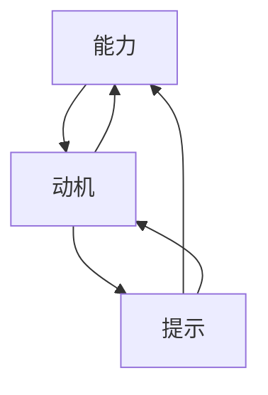

                 

# 运用福格模型培养团队良习惯

## 1. 背景介绍

在当今快速变化的技术环境中，团队管理已成为一个组织成功的关键因素。然而，技术团队的日常工作常常充满压力，包括不稳定的需求变化、复杂的技术堆栈、不断更新的小工具等。在这样的背景下，如何培养团队的良习惯以提高工作效率和质量，就成为了管理者必须面对的挑战。福格行为模型（Fogg's Behavior Model）提供了一种行为科学框架，通过理解行为背后的心理机制，来设计促进团队形成良好习惯的策略。

## 2. 核心概念与联系

### 2.1 核心概念概述

福格行为模型由斯坦福大学教授布莱恩·福格提出，主要基于三个关键要素来分析人类行为：**能力**（Ability）、**动机**（Motivation）、**提示**（Prompts）。

- **能力**：执行某一行为所需的物理、心理和情感能力。
- **动机**：执行某一行为的内在需求、奖励或逃避压力的欲望。
- **提示**：触发执行某一行为的线索或信号。

这三个要素之间的关系可以用以下公式表示：

$$
\text{行为} = \text{能力} \times \text{动机} \times \text{提示}
$$

### 2.2 核心概念原理和架构的 Mermaid 流程图



这个图展示了能力、动机和提示如何相互影响，最终促成行为的产生。

### 2.3 核心概念原理和架构的 Mermaid 流程图说明

- **能力**：能力是执行行为所需的基本条件。这包括物理能力、心理状态和情感稳定度。当能力不足时，行为难以发生。
- **动机**：动机是驱动行为的内在驱动力。它可以是想要获得奖励，或是避免惩罚的欲望。
- **提示**：提示是触发行为的关键线索。无论是环境中的物理信号（如时间、地点）还是心理上的触发（如记忆），提示都是行为发生的重要因素。

## 3. 核心算法原理 & 具体操作步骤

### 3.1 算法原理概述

福格模型在团队管理中的应用，就是通过调整这三个要素来促成团队形成良好的习惯。具体步骤如下：

1. **识别关键行为**：确定需要培养的团队行为，比如日常代码评审、定期技术分享、团队协作沟通等。
2. **评估能力**：分析团队成员执行该行为的能力，包括技术水平、时间安排、心理状态等。
3. **激发动机**：设计激励机制，以增强执行该行为的动机。这可以是物质奖励、晋升机会、公开表扬等。
4. **设计提示**：设计明确且易行的提示，如每日代码评审的固定时间、技术分享的固定日期、协作工具的使用规范等。
5. **实施与调整**：逐步实施策略，并根据团队反馈不断调整，以确保行为能够持续并优化。

### 3.2 算法步骤详解

#### 3.2.1 识别关键行为

首先，团队管理者需要明确要培养的行为。例如，“每周至少进行一次代码评审”、“每月进行一次技术分享”等。关键行为应该具体、可量化，以确保后续评估和激励机制的有效性。

#### 3.2.2 评估能力

在确定行为后，需要评估团队成员执行该行为的能力。这包括：

- **技术能力**：评估团队成员是否具备执行该行为所需的技术知识。
- **时间安排**：评估团队成员的日常工作负荷，确定是否有足够的时间进行额外活动。
- **心理状态**：评估团队成员的心理压力和情绪状态，以确保他们愿意并有能力执行该行为。

#### 3.2.3 激发动机

设计激励机制以增强执行关键行为的动力。这包括：

- **物质奖励**：如奖金、免费午餐等。
- **晋升机会**：如晋升为高级工程师、项目管理等。
- **公共认可**：如在公司内部表扬、公开表扬等。

#### 3.2.4 设计提示

设计易于执行的提示，以确保行为能顺利发生。这包括：

- **时间提示**：如每周二下午3点进行代码评审。
- **地点提示**：如在公司固定的会议室进行技术分享。
- **工具提示**：如使用Slack进行即时沟通。

#### 3.2.5 实施与调整

实施策略并根据反馈不断调整。这包括：

- **初期跟踪**：在策略实施初期，定期跟踪行为的发生情况。
- **反馈收集**：收集团队成员对行为提示的反馈，进行优化。
- **持续激励**：不断提供激励，确保行为持续发生。

### 3.3 算法优缺点

#### 3.3.1 算法优点

- **科学依据**：基于行为科学，有充分的理论依据。
- **灵活性高**：可以根据团队特点和需求调整提示和激励机制。
- **易于实施**：策略简单，易于团队成员理解和执行。

#### 3.3.2 算法缺点

- **依赖个人意愿**：动机和能力可能受个人意愿和心理状态影响，有时难以预测和控制。
- **需要持续跟踪**：持续的跟踪和反馈调整需要一定的时间和精力。

### 3.4 算法应用领域

福格模型在团队管理中的应用非常广泛，适用于以下场景：

- **代码评审**：提升代码质量，减少技术债务。
- **技术分享**：促进知识共享，提升团队技术水平。
- **协作沟通**：增强团队合作，提升工作效率。
- **项目管理**：规范项目管理流程，提升项目交付质量。
- **用户故事编写**：提升用户故事质量，减少产品迭代风险。

## 4. 数学模型和公式 & 详细讲解 & 举例说明

### 4.1 数学模型构建

福格模型本身不需要复杂的数学模型，其核心在于理解行为背后的心理机制，并通过设计合理的提示和激励来促成行为。

### 4.2 公式推导过程

在公式 $$
行为 = 能力 \times 动机 \times 提示
$$ 的基础上，可以进一步细化，例如：

$$
行为 = (技术能力 \times 心理状态 \times 时间安排) \times (奖励动机 \times 晋升动机 \times 公共认可) \times (时间提示 \times 地点提示 \times 工具提示)
$$

这个公式展示了如何将行为分解为更具体的要素，并应用于团队管理中。

### 4.3 案例分析与讲解

#### 案例一：代码评审习惯培养

- **关键行为**：每周至少进行一次代码评审。
- **评估能力**：团队成员技术能力普遍较高，时间安排合理，心理状态需要进一步观察。
- **激发动机**：提供“代码评审之星”称号，每月评选最佳代码评审员，给予公共表扬。
- **设计提示**：每周二下午3点进行代码评审，使用Slack进行即时反馈。
- **实施与调整**：初期每周跟踪代码评审数量，收集反馈，调整时间和方式，持续提供公共表扬和奖励。

#### 案例二：技术分享习惯培养

- **关键行为**：每月进行一次技术分享。
- **评估能力**：团队成员技术水平较高，时间安排有冲突，心理状态需要进一步激发。
- **激发动机**：给予技术分享之星称号，提供公司技术发展基金支持分享活动。
- **设计提示**：每月最后一个周五下午3点进行技术分享，使用Zoom进行远程分享。
- **实施与调整**：初期每月跟踪技术分享数量，收集反馈，调整时间和方式，持续提供技术支持和公共表扬。

## 5. 项目实践：代码实例和详细解释说明

### 5.1 开发环境搭建

在进行福格模型应用实践前，我们需要准备好开发环境。以下是使用Python进行代码实现的环境配置流程：

1. 安装Python：从官网下载并安装Python。
2. 安装相关库：安装numpy、pandas、matplotlib等库，用于数据分析和可视化。
3. 配置开发环境：使用虚拟环境（如venv）配置Python开发环境，确保各个依赖库的隔离和统一。

### 5.2 源代码详细实现

以下是一个简单的代码实现，用于跟踪和分析团队行为：

```python
import numpy as np
import pandas as pd
import matplotlib.pyplot as plt

# 初始化数据
def initialize_data():
    # 假设团队成员数
    num_members = 10
    # 假设每周代码评审次数
    code_reviews = np.random.randint(0, 5, num_members)
    # 假设每月技术分享次数
    tech_shares = np.random.randint(0, 3, num_members)
    
    # 创建数据表
    data = pd.DataFrame({'Member': np.arange(num_members), 'Code Reviews': code_reviews, 'Tech Shares': tech_shares})
    return data

# 分析数据
def analyze_data(data):
    # 计算每周代码评审平均次数
    avg_code_reviews = data['Code Reviews'].mean()
    # 计算每月技术分享平均次数
    avg_tech_shares = data['Tech Shares'].mean()
    
    # 绘制柱状图
    plt.bar(['Code Reviews', 'Tech Shares'], [avg_code_reviews, avg_tech_shares])
    plt.title('Team Performance Analysis')
    plt.xlabel('Performance Indicator')
    plt.ylabel('Average Value')
    plt.show()
    
# 主函数
def main():
    data = initialize_data()
    analyze_data(data)

if __name__ == '__main__':
    main()
```

### 5.3 代码解读与分析

在上述代码中，我们通过简单的数据模拟，展示了如何跟踪和分析团队成员的代码评审和技术分享行为。代码的关键部分包括：

- **数据初始化**：使用numpy生成随机数据，模拟团队成员的代码评审和技术分享次数。
- **数据分析**：计算每周代码评审和每月技术分享的平均值，使用matplotlib绘制柱状图，展示团队的整体表现。
- **主函数**：调用数据初始化和分析函数，展示分析结果。

这个简单的示例说明了如何通过数据跟踪和可视化，来评估团队行为的效果。

### 5.4 运行结果展示

运行上述代码后，将生成一个简单的柱状图，展示团队成员每周代码评审和每月技术分享的平均次数。这个结果可以用于管理者对团队表现进行跟踪和评估。

## 6. 实际应用场景

### 6.1 智能客服系统

在智能客服系统中，福格模型可以用于培养团队成员的客户服务习惯。例如，规定客服团队每日进行用户问题分类和响应速度统计，并根据统计结果给予表扬和奖励。通过这种方式，客服团队将养成高质量响应用户咨询的习惯，提高客户满意度。

### 6.2 金融舆情监测

金融舆情监测团队需要实时监测市场舆情，快速响应负面信息传播。团队管理者可以通过设计每日舆情分析报告，并定期对分析结果进行分享和讨论，以激发团队成员的积极性，形成每天监测舆情、快速应对的良好习惯。

### 6.3 个性化推荐系统

推荐系统团队需要不断收集用户反馈，并持续优化推荐算法。通过设定每月一次的团队总结会议，并分享成功案例和问题分析，可以增强团队成员对用户体验的重视，形成持续优化和迭代的良好习惯。

### 6.4 未来应用展望

福格模型在培养团队良好习惯方面的应用前景广阔，未来可能的应用方向包括：

- **跨团队协作**：在不同团队之间培养协同工作习惯，如跨部门合作项目。
- **远程团队管理**：在远程团队中，通过设计合理的工作提示和奖励机制，增强团队成员的在线协作习惯。
- **创新思维培养**：通过设定创新项目和创新奖，鼓励团队成员提出新想法，形成持续创新的良好习惯。

## 7. 工具和资源推荐

### 7.1 学习资源推荐

为了帮助团队成员掌握福格模型的应用方法，推荐以下学习资源：

1. **Fogg's Behavior Model**：布莱恩·福格的行为科学专著，详细介绍了行为背后的心理机制和模型应用方法。
2. **Habit-Breaking Habits**：布莱恩·福格的TED演讲视频，通俗易懂地解释了如何打破不良习惯和养成良好习惯。
3. **The Behavior Change Toolkit**：由福格行为科学研究中心发布的工具包，提供了详细的行为改变方法和案例分析。
4. **Coursera上的行为科学课程**：斯坦福大学和耶鲁大学等高校开设的行为科学课程，提供了系统化的学习路径和实践机会。
5. **Project Habit**：由福格行为科学研究中心发起的公益项目，旨在通过简单的行为改变，提升社会福祉。

### 7.2 开发工具推荐

福格模型的应用通常不需要复杂的开发工具，但以下是一些常用的辅助工具：

1. **Trello**：项目管理工具，可以用于跟踪和记录团队行为。
2. **Google Calendar**：时间管理工具，可以帮助设计合理的时间提示。
3. **Slack**：即时通讯工具，可以用于团队沟通和协作。
4. **Zoom**：视频会议工具，可以用于远程团队的协作和分享。
5. **GitHub**：代码托管工具，可以用于跟踪代码评审和技术分享的结果。

### 7.3 相关论文推荐

福格模型已经得到广泛研究，以下是几篇经典论文，推荐阅读：

1. **Behavior Change: Theory, Research, and Practice**：布莱恩·福格的经典著作，系统介绍了行为科学和行为改变的方法。
2. **Behavioral Design for Nonprofits**：福格行为科学研究中心发布的白皮书，提供了非营利组织应用行为科学的实践案例。
3. **A Course in the Fogg Method**：斯坦福大学开设的在线课程，系统讲解了福格模型的原理和应用。

## 8. 总结：未来发展趋势与挑战

### 8.1 研究成果总结

福格模型为团队管理提供了一种行为科学框架，通过理解行为背后的心理机制，设计合理的提示和激励，促成团队形成良好习惯。经过实践验证，福格模型在代码评审、技术分享、协作沟通等团队管理中的应用效果显著。

### 8.2 未来发展趋势

福格模型在团队管理中的应用将随着行为科学的不断发展而持续演进，未来可能的发展趋势包括：

- **数字化转型**：借助人工智能和大数据分析工具，自动化行为跟踪和分析，提升团队管理效率。
- **跨学科应用**：福格模型与其他行为科学理论和方法（如认知心理学、社会学）的融合，形成更加系统化的团队管理方法。
- **国际化推广**：在全球范围内推广福格模型的应用，帮助不同文化背景的团队形成良好的习惯。

### 8.3 面临的挑战

尽管福格模型在团队管理中具有显著优势，但在使用过程中也面临一些挑战：

- **文化差异**：不同文化背景的团队可能对行为激励的响应不同，需要设计更具本地化的激励机制。
- **动态变化**：团队成员的能力和心理状态可能随时间变化，需要持续跟踪和调整激励策略。
- **技术依赖**：福格模型需要借助一定的技术工具实现自动化跟踪和分析，需要确保工具的稳定性和易用性。

### 8.4 研究展望

未来的研究需要在以下几个方面寻求新的突破：

- **行为模型融合**：将福格模型与其他行为科学模型（如期望理论、自我决定理论）结合，形成更全面的行为改变策略。
- **技术工具优化**：开发更加智能化的行为跟踪和分析工具，提升团队管理的自动化水平。
- **长期效果评估**：通过长期跟踪和评估，验证福格模型在团队管理中的效果，不断优化和调整策略。

## 9. 附录：常见问题与解答

### Q1: 什么是福格行为模型？

**A:** 福格行为模型由斯坦福大学教授布莱恩·福格提出，基于行为科学的原理，通过理解行为背后的心理机制，设计合理的提示和激励，促成团队形成良好习惯。其核心公式为：

$$
行为 = 能力 \times 动机 \times 提示
$$

### Q2: 福格模型如何应用于团队管理？

**A:** 福格模型通过识别关键行为、评估能力、激发动机、设计提示和实施调整五个步骤，来培养团队的良好习惯。具体应用包括代码评审、技术分享、协作沟通等。

### Q3: 如何设计合理的提示和激励？

**A:** 提示和激励的设计需要结合团队特点和需求。提示应易于执行，激励应充分考虑团队成员的内在需求和外部奖励。

### Q4: 福格模型在远程团队中的应用有哪些挑战？

**A:** 远程团队面临文化差异和技术依赖等问题，需要设计更具本地化的激励机制，并利用数字化工具实现行为跟踪和分析。

### Q5: 如何持续跟踪和调整团队行为？

**A:** 持续跟踪和调整需要定期收集团队反馈，并根据反馈不断优化提示和激励策略。

---

作者：禅与计算机程序设计艺术 / Zen and the Art of Computer Programming

