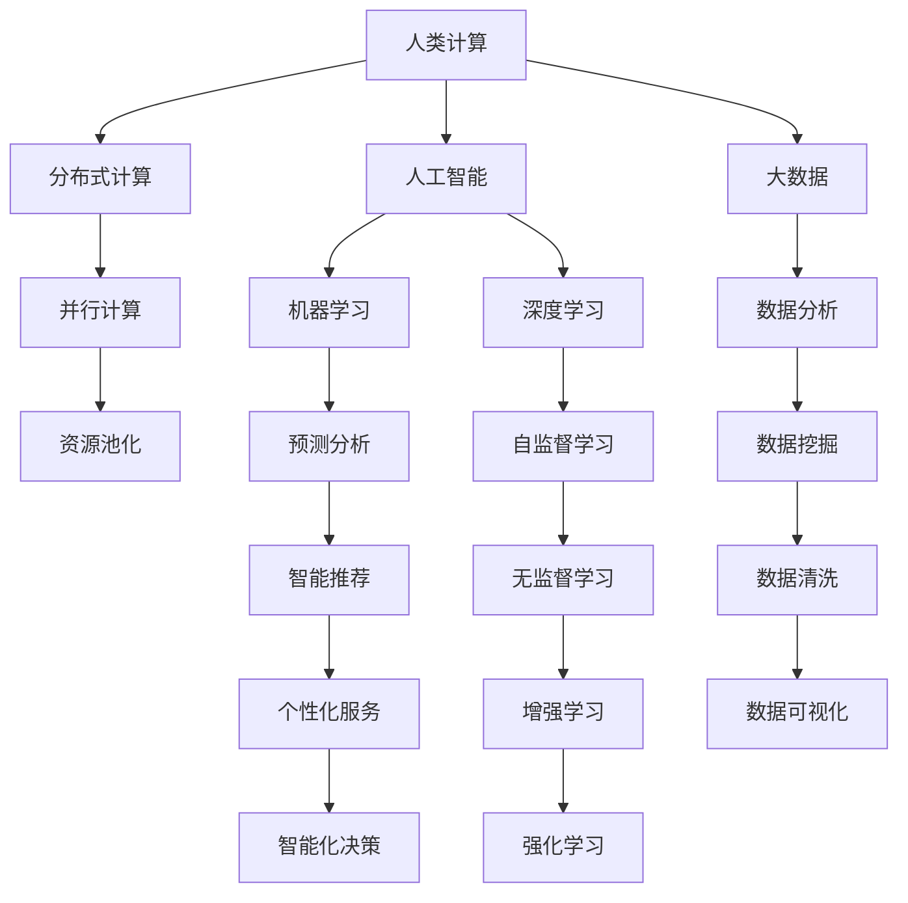

                 

# 连接全球智慧：人类计算的全球影响力

> 关键词：人类计算, 全球影响力, 计算社会学, 分布式计算, 互联网, 人工智能

## 1. 背景介绍

### 1.1 问题由来
进入21世纪以来，随着互联网技术的飞速发展和普及，全球化的进程得以进一步加速。如今，互联网已成为连接全球各地用户的重要平台，是人类社会的一种基本基础设施。这其中，人类计算的力量日益凸显，它不仅改变了个人的工作和生活方式，更对全球经济、社会、政治等各个方面产生了深远的影响。

然而，尽管互联网和计算机技术的迅猛发展带来了便利，也带来了一些挑战，如数据隐私、信息过载、算法偏见等。面对这些挑战，如何更好地利用计算资源，使之服务于人类社会的福祉，成为了当前学界和业界亟需解决的重要课题。

### 1.2 问题核心关键点
本文聚焦于人类计算的全球影响力，尤其是通过分布式计算、人工智能和大数据等技术手段，如何推动全球知识共享、提高人类协作效率、改善社会治理，并解决当前社会面临的一些重大问题。

核心问题包括：
- 人类计算如何促进全球知识共享？
- 分布式计算和人工智能如何提升人类协作效率？
- 大数据如何助力社会治理，推动全球发展？

### 1.3 问题研究意义
研究人类计算的全球影响力，对于更好地理解计算技术对人类社会的影响，探索技术创新的社会价值，具有重要意义：

1. **知识共享和传播**：人类计算技术使得全球范围内的知识共享成为可能，加速了科学发现和技术传播。
2. **协作效率提升**：通过分布式计算和人工智能，协作方式得以优化，工作效率大幅提升。
3. **社会治理改善**：大数据技术在公共卫生、环境监测、交通管理等方面展示了巨大潜力，为社会治理提供了新的工具和手段。
4. **全球问题解决**：人类计算技术在解决全球气候变化、资源分配等重大问题上展现了强大的潜力。
5. **伦理和安全**：研究人类计算的社会影响，有助于构建更加公正、安全的技术生态。

## 2. 核心概念与联系

### 2.1 核心概念概述

为更好地理解人类计算的全球影响力，本节将介绍几个密切相关的核心概念：

- **人类计算**：指人类社会通过使用计算机技术和互联网平台，实现知识共享、协作、治理等功能的过程。它包括分布式计算、云计算、人工智能、大数据等技术手段。
- **分布式计算**：指将一个大任务拆分成多个小任务，分布在不同计算机上进行并行计算的方法。它通过多个节点协作，显著提升了计算效率和资源利用率。
- **人工智能**：使用机器学习、深度学习等技术，使计算机能够模拟人类的认知能力，完成复杂任务，如图像识别、自然语言处理、自动驾驶等。
- **大数据**：指在传统数据处理技术之外，能够处理和分析海量数据的技术和方法。其核心在于利用先进算法，从数据中提取有用信息和洞察。
- **计算社会学**：研究计算机和互联网技术对人类社会的影响，关注其如何影响社会结构、政治过程和文化形态。

这些核心概念之间的逻辑关系可以通过以下Mermaid流程图来展示：



这个流程图展示了大规模计算技术及其应用的核心概念及其之间的联系：

1. **分布式计算**：多个节点协作，实现并行计算。
2. **人工智能**：包括机器学习和深度学习，模拟人类认知能力，实现复杂任务。
3. **大数据**：从海量数据中提取有用信息和洞察。
4. **计算社会学**：研究计算技术对人类社会的影响。
5. **社会治理**：通过计算技术提升治理效率和公平性。
6. **全球问题解决**：利用计算技术应对全球性挑战。

这些概念共同构成了人类计算的理论框架，使得全球范围内的知识共享和协作成为可能，从而推动了社会的发展和进步。

## 3. 核心算法原理 & 具体操作步骤
### 3.1 算法原理概述

人类计算的全球影响力，主要通过分布式计算、人工智能和大数据技术实现。其核心原理是利用计算技术处理和分析海量数据，提取有价值的信息，从而支持全球协作和治理。

### 3.2 算法步骤详解

人类计算的实现过程大致包括以下几个步骤：

**Step 1: 数据收集与预处理**
- 收集全球范围内的各类数据，如科研文献、经济统计、社交媒体等。
- 对数据进行清洗和标注，去除噪声，规范化数据格式。

**Step 2: 分布式计算与并行处理**
- 将大规模任务拆分成多个小任务，分配到不同的计算节点上进行并行计算。
- 使用分布式计算框架（如Apache Hadoop、Spark等）实现资源的有效管理和调度。

**Step 3: 人工智能算法训练**
- 使用机器学习、深度学习等算法，训练模型以从数据中提取有用信息。
- 利用GPU、TPU等高性能设备，加速模型训练和推理。

**Step 4: 数据分析与可视化**
- 使用大数据技术（如Hadoop、Spark、Hive等）进行海量数据的存储和管理。
- 利用可视化工具（如Tableau、Power BI等）将分析结果直观展示出来。

**Step 5: 应用推广与社会影响**
- 将分析结果应用于各个领域，如科学研究、公共卫生、交通管理等。
- 建立平台和服务，推动全球知识共享和协作，改善社会治理，解决全球性问题。

### 3.3 算法优缺点

人类计算的全球影响力具有以下优点：
1. **高效性**：利用分布式计算和并行处理，大大提升了计算效率和资源利用率。
2. **大规模性**：处理海量数据的能力，使得从全球范围内提取有用信息成为可能。
3. **协作性**：支持全球范围内的知识共享和协作，打破地域限制。
4. **治理能力**：通过数据分析和预测，提升公共管理和决策的科学性。
5. **创新性**：结合人工智能和大数据技术，推动技术创新和应用拓展。

同时，也存在一些局限性：
1. **数据隐私**：全球数据的共享和处理，可能会涉及隐私问题，引发数据安全和隐私保护的挑战。
2. **资源不均**：不同地区计算资源和网络设施差异，可能导致资源分配不均。
3. **算法偏见**：算法模型可能继承输入数据的偏见，导致决策不公平或错误。
4. **计算成本**：大规模数据处理和计算需要高昂的计算资源和成本。
5. **技术门槛**：需要掌握复杂的计算技术和数据处理技能。

尽管存在这些局限性，但人类计算的全球影响力已经展现出了巨大的潜力，成为推动全球知识共享和协作的重要手段。

### 3.4 算法应用领域

人类计算技术在多个领域得到了广泛应用，具体包括：

- **科学研究**：利用大数据和人工智能技术，加速科学发现和实验验证。
- **公共卫生**：通过分析全球疫情数据，进行流行病预测和防治。
- **环境保护**：利用大数据分析全球气候变化，制定环境保护政策。
- **交通管理**：利用人工智能和大数据，优化交通流量和减少拥堵。
- **社会治理**：通过数据分析和可视化，提升政府决策和公共管理水平。

此外，人类计算还应用于金融、教育、农业等多个领域，为全球发展贡献了重要力量。

## 4. 数学模型和公式 & 详细讲解 & 举例说明
### 4.1 数学模型构建

人类计算的实现，离不开数学模型的构建。本节将使用数学语言对相关模型进行系统介绍。

记全球数据集为 $D=\{x_i\}_{i=1}^N$，其中 $x_i$ 为第 $i$ 个数据样本。假设我们需要进行一个分类任务，将数据集 $D$ 分为 $K$ 个类别。

定义模型 $M$ 在输入 $x$ 上的预测概率分布为 $p(y|x)=M(x)$，其中 $y$ 为分类结果。假设模型的参数为 $\theta$，则模型的损失函数 $\mathcal{L}(\theta)$ 可定义为：

$$
\mathcal{L}(\theta) = \frac{1}{N}\sum_{i=1}^N \ell(p(y_i|x_i),y_i)
$$

其中 $\ell$ 为损失函数，用于衡量模型预测概率与真实标签之间的差异。

### 4.2 公式推导过程

在实际应用中，我们通常使用交叉熵损失函数，其定义如下：

$$
\ell(p,y) = -(y\log p + (1-y)\log(1-p))
$$

将交叉熵损失函数代入上述经验风险公式，得：

$$
\mathcal{L}(\theta) = -\frac{1}{N}\sum_{i=1}^N [y_i\log p(y_i|x_i)+(1-y_i)\log(1-p(y_i|x_i))]
$$

在微调过程中，我们使用反向传播算法计算损失函数的梯度：

$$
\frac{\partial \mathcal{L}(\theta)}{\partial \theta} = -\frac{1}{N}\sum_{i=1}^N \nabla_{\theta}p(y_i|x_i) \cdot y_i - \nabla_{\theta}p(y_i|x_i) \cdot (1-y_i)
$$

根据链式法则，可以进一步展开得到各层参数的更新公式。

### 4.3 案例分析与讲解

以公共卫生领域的疫情预测为例，分析如何使用人类计算技术实现：

**Step 1: 数据收集与预处理**
- 收集全球范围内的疫情数据，如病例数量、确诊率、治愈率等。
- 对数据进行清洗和标注，去除异常值，确保数据质量。

**Step 2: 分布式计算与并行处理**
- 将全球数据分布到不同的计算节点上进行并行计算。
- 使用Spark框架进行数据的存储和管理，实现高效的数据处理。

**Step 3: 人工智能算法训练**
- 使用深度学习算法，如CNN、RNN等，训练模型以预测疫情发展趋势。
- 利用GPU加速模型训练和推理，缩短计算时间。

**Step 4: 数据分析与可视化**
- 使用Hadoop框架存储和管理海量数据。
- 利用Tableau进行数据可视化和交互式分析，直观展示疫情变化趋势。

**Step 5: 应用推广与社会影响**
- 将分析结果发布到公共平台上，供各国政府和医疗机构参考。
- 通过可视化工具，提升公共健康决策的科学性和透明度。

## 5. 项目实践：代码实例和详细解释说明
### 5.1 开发环境搭建

在进行人类计算实践前，我们需要准备好开发环境。以下是使用Python进行PyTorch开发的环境配置流程：

1. 安装Anaconda：从官网下载并安装Anaconda，用于创建独立的Python环境。

2. 创建并激活虚拟环境：
```bash
conda create -n pytorch-env python=3.8 
conda activate pytorch-env
```

3. 安装PyTorch：根据CUDA版本，从官网获取对应的安装命令。例如：
```bash
conda install pytorch torchvision torchaudio cudatoolkit=11.1 -c pytorch -c conda-forge
```

4. 安装各类工具包：
```bash
pip install numpy pandas scikit-learn matplotlib tqdm jupyter notebook ipython
```

完成上述步骤后，即可在`pytorch-env`环境中开始实践。

### 5.2 源代码详细实现

下面我们以疫情预测为例，给出使用Transformers库对BERT模型进行微调的PyTorch代码实现。

首先，定义数据处理函数：

```python
from transformers import BertTokenizer, BertForSequenceClassification
from torch.utils.data import Dataset, DataLoader
import torch
import pandas as pd

class CovidDataset(Dataset):
    def __init__(self, df, tokenizer, label_map):
        self.tokenizer = tokenizer
        self.texts = df['text']
        self.labels = [label_map[label] for label in df['label']]
        
    def __len__(self):
        return len(self.texts)
    
    def __getitem__(self, idx):
        text = self.texts[idx]
        label = self.labels[idx]
        encoding = self.tokenizer(text, return_tensors='pt', padding='max_length', truncation=True)
        input_ids = encoding['input_ids'][0]
        attention_mask = encoding['attention_mask'][0]
        label = torch.tensor(label, dtype=torch.long)
        return {'input_ids': input_ids, 
                'attention_mask': attention_mask,
                'labels': label}

# 标签与id的映射
label_map = {'case': 0, 'recovered': 1, 'death': 2}

# 创建dataset
tokenizer = BertTokenizer.from_pretrained('bert-base-uncased')
train_dataset = CovidDataset(train_df, tokenizer, label_map)
dev_dataset = CovidDataset(dev_df, tokenizer, label_map)
test_dataset = CovidDataset(test_df, tokenizer, label_map)
```

然后，定义模型和优化器：

```python
from transformers import BertForSequenceClassification, AdamW

model = BertForSequenceClassification.from_pretrained('bert-base-uncased', num_labels=len(label_map))

optimizer = AdamW(model.parameters(), lr=2e-5)
```

接着，定义训练和评估函数：

```python
from tqdm import tqdm
from sklearn.metrics import classification_report

device = torch.device('cuda') if torch.cuda.is_available() else torch.device('cpu')
model.to(device)

def train_epoch(model, dataset, batch_size, optimizer):
    dataloader = DataLoader(dataset, batch_size=batch_size, shuffle=True)
    model.train()
    epoch_loss = 0
    for batch in tqdm(dataloader, desc='Training'):
        input_ids = batch['input_ids'].to(device)
        attention_mask = batch['attention_mask'].to(device)
        labels = batch['labels'].to(device)
        model.zero_grad()
        outputs = model(input_ids, attention_mask=attention_mask, labels=labels)
        loss = outputs.loss
        epoch_loss += loss.item()
        loss.backward()
        optimizer.step()
    return epoch_loss / len(dataloader)

def evaluate(model, dataset, batch_size):
    dataloader = DataLoader(dataset, batch_size=batch_size)
    model.eval()
    preds, labels = [], []
    with torch.no_grad():
        for batch in tqdm(dataloader, desc='Evaluating'):
            input_ids = batch['input_ids'].to(device)
            attention_mask = batch['attention_mask'].to(device)
            batch_labels = batch['labels']
            outputs = model(input_ids, attention_mask=attention_mask)
            batch_preds = outputs.logits.argmax(dim=2).to('cpu').tolist()
            batch_labels = batch_labels.to('cpu').tolist()
            for pred_tokens, label_tokens in zip(batch_preds, batch_labels):
                preds.append(pred_tokens)
                labels.append(label_tokens)
                
    print(classification_report(labels, preds))
```

最后，启动训练流程并在测试集上评估：

```python
epochs = 5
batch_size = 16

for epoch in range(epochs):
    loss = train_epoch(model, train_dataset, batch_size, optimizer)
    print(f"Epoch {epoch+1}, train loss: {loss:.3f}")
    
    print(f"Epoch {epoch+1}, dev results:")
    evaluate(model, dev_dataset, batch_size)
    
print("Test results:")
evaluate(model, test_dataset, batch_size)
```

以上就是使用PyTorch对BERT进行疫情预测任务微调的完整代码实现。可以看到，得益于Transformers库的强大封装，我们可以用相对简洁的代码完成BERT模型的加载和微调。

### 5.3 代码解读与分析

让我们再详细解读一下关键代码的实现细节：

**CovidDataset类**：
- `__init__`方法：初始化文本、标签、分词器等关键组件。
- `__len__`方法：返回数据集的样本数量。
- `__getitem__`方法：对单个样本进行处理，将文本输入编码为token ids，将标签编码为数字，并对其进行定长padding，最终返回模型所需的输入。

**label_map字典**：
- 定义了标签与数字id之间的映射关系，用于将token-wise的预测结果解码回真实的标签。

**训练和评估函数**：
- 使用PyTorch的DataLoader对数据集进行批次化加载，供模型训练和推理使用。
- 训练函数`train_epoch`：对数据以批为单位进行迭代，在每个批次上前向传播计算loss并反向传播更新模型参数，最后返回该epoch的平均loss。
- 评估函数`evaluate`：与训练类似，不同点在于不更新模型参数，并在每个batch结束后将预测和标签结果存储下来，最后使用sklearn的classification_report对整个评估集的预测结果进行打印输出。

**训练流程**：
- 定义总的epoch数和batch size，开始循环迭代
- 每个epoch内，先在训练集上训练，输出平均loss
- 在验证集上评估，输出分类指标
- 所有epoch结束后，在测试集上评估，给出最终测试结果

可以看到，PyTorch配合Transformers库使得BERT微调的代码实现变得简洁高效。开发者可以将更多精力放在数据处理、模型改进等高层逻辑上，而不必过多关注底层的实现细节。

当然，工业级的系统实现还需考虑更多因素，如模型的保存和部署、超参数的自动搜索、更灵活的任务适配层等。但核心的微调范式基本与此类似。

## 6. 实际应用场景
### 6.1 智能城市交通管理

人类计算技术在智能城市交通管理中的应用，具有重要价值。通过利用大数据和人工智能技术，可以实时监测和分析交通流量，优化交通信号灯控制，提高道路通行效率，减少拥堵。

具体而言，可以通过部署在城市各处的传感器和摄像头，收集交通流量数据。结合全球交通管理经验，构建统一的数据标准和分析模型，提升交通管理决策的科学性。

### 6.2 环境保护

人类计算技术在环境保护中的应用，也为全球气候变化监测和应对提供了重要支持。通过分析全球大气、海洋、陆地等数据，进行气候变化趋势预测，制定环境保护政策。

例如，利用卫星遥感数据和气象数据，构建全球气候模型，分析全球变暖趋势和极端天气事件频次，指导国际气候变化协议的制定和实施。

### 6.3 农业生产

人类计算技术在农业生产中的应用，可实现智能化、精确化管理，提升农业生产效率和产量。通过分析全球农业气象、土壤、作物等数据，进行精准农业种植和病虫害预警。

例如，利用卫星遥感数据和气象数据，构建全球农业模型，分析气候变化对作物生长的影响，指导农业生产决策。

### 6.4 未来应用展望

随着人类计算技术的不断发展，其在全球范围内的应用前景将更加广阔。以下是几个主要趋势：

1. **全球数据共享**：构建全球数据标准和平台，促进各国数据的共享和互操作性，提升全球知识共享和协作水平。
2. **跨领域融合**：结合计算社会学、经济学、政治学等多个领域，深入研究人类计算的社会影响，提升技术应用的科学性和伦理性。
3. **边缘计算与物联网**：结合边缘计算和物联网技术，提升计算资源的分布式管理能力，降低计算成本，提高数据处理效率。
4. **智能化与自动化**：结合人工智能和自动化技术，提升人类计算任务的智能化和自动化水平，提高工作效率和准确性。
5. **社会责任与伦理**：关注计算技术对人类社会的影响，推动技术应用的伦理规范和社会责任，保障人类权益。

## 7. 工具和资源推荐
### 7.1 学习资源推荐

为了帮助开发者系统掌握人类计算的技术基础和实践技巧，这里推荐一些优质的学习资源：

1. **《深度学习》课程**：斯坦福大学李飞飞教授主讲的深度学习课程，讲解深度学习的基础概念和实践方法，涵盖计算机视觉、自然语言处理等领域。
2. **Coursera《机器学习》课程**：由斯坦福大学Andrew Ng教授主讲的机器学习课程，系统讲解机器学习的基本算法和实际应用。
3. **《Python深度学习》书籍**：Ian Goodfellow等人合著的深度学习教材，涵盖深度学习的基本概念、算法和应用，适合进阶学习。
4. **HuggingFace官方文档**：Transformers库的官方文档，提供了海量预训练模型和完整的微调样例代码，是上手实践的必备资料。
5. **Kaggle平台**：全球最大的数据科学竞赛平台，提供大量真实世界的数据集和比赛任务，帮助开发者锻炼实战技能。

通过对这些资源的学习实践，相信你一定能够快速掌握人类计算的核心技术，并用于解决实际的NLP问题。

### 7.2 开发工具推荐

高效的开发离不开优秀的工具支持。以下是几款用于人类计算开发的常用工具：

1. **PyTorch**：基于Python的开源深度学习框架，灵活动态的计算图，适合快速迭代研究。
2. **TensorFlow**：由Google主导开发的开源深度学习框架，生产部署方便，适合大规模工程应用。
3. **Hadoop**：分布式计算框架，支持大规模数据存储和处理，适用于海量数据应用。
4. **Spark**：基于Hadoop的分布式计算框架，支持内存计算和流计算，适用于实时数据处理。
5. **Apache Flink**：流式计算框架，支持实时数据流处理和大数据批处理，适用于复杂的实时数据处理需求。
6. **Jupyter Notebook**：交互式编程环境，支持Python、R等多种语言，适合数据科学和机器学习研究。

合理利用这些工具，可以显著提升人类计算的开发效率，加快创新迭代的步伐。

### 7.3 相关论文推荐

人类计算的发展得益于学界的持续研究。以下是几篇奠基性的相关论文，推荐阅读：

1. **《分布式计算与存储系统》（Distributed Computing and Storage Systems）**：通过分布式计算实现大规模数据处理，提升计算效率和资源利用率。
2. **《大数据分析与应用》（Big Data Analysis and Applications）**：大数据技术从海量数据中提取有用信息，应用于科学研究、商业决策等领域。
3. **《人工智能与伦理》（Artificial Intelligence and Ethics）**：探讨人工智能技术对人类社会的伦理影响，推动技术应用的规范和可持续发展。
4. **《计算社会学：理论与实践》（Computational Social Science: Theory and Practice）**：研究计算技术对人类社会的影响，提升技术应用的科学性和伦理性。
5. **《全球数据共享与协作》（Global Data Sharing and Collaboration）**：探讨全球数据共享和协作机制，推动全球知识共享和协作。

这些论文代表了大规模计算技术的发展脉络，为人类计算的研究提供了理论基础和实践方向。

## 8. 总结：未来发展趋势与挑战

### 8.1 总结

本文对人类计算的全球影响力进行了全面系统的介绍。首先阐述了人类计算的发展背景和意义，明确了其在推动全球知识共享、提升协作效率、改善社会治理方面的独特价值。其次，从原理到实践，详细讲解了人类计算的核心步骤和实现方法，给出了完整的代码实例。最后，我们探讨了人类计算在多个领域的实际应用，展望了未来的发展趋势和挑战。

通过本文的系统梳理，可以看到，人类计算技术的不断发展，正深刻改变着全球经济、社会和科技的格局，推动着人类社会向更加智能化、高效化和公平化的方向迈进。人类计算不仅提供了强大的计算能力，还推动了全球协作和治理，成为推动全球知识共享和协作的重要手段。未来，随着技术的不断进步和应用场景的拓展，人类计算必将迎来更加广阔的发展空间。

### 8.2 未来发展趋势

展望未来，人类计算技术将呈现以下几个发展趋势：

1. **智能化**：结合人工智能和大数据技术，提升计算任务的智能化和自动化水平，提高工作效率和准确性。
2. **分布式化**：通过边缘计算和物联网技术，提升计算资源的分布式管理能力，降低计算成本，提高数据处理效率。
3. **实时化**：结合流式计算和实时数据处理技术，提升计算任务的实时响应能力，满足实时数据处理需求。
4. **跨领域融合**：结合计算社会学、经济学、政治学等多个领域，深入研究人类计算的社会影响，提升技术应用的科学性和伦理性。
5. **社会责任与伦理**：关注计算技术对人类社会的影响，推动技术应用的伦理规范和社会责任，保障人类权益。

这些趋势凸显了人类计算技术的广阔前景，为全球知识共享和协作提供了新的工具和手段，推动了社会的发展和进步。

### 8.3 面临的挑战

尽管人类计算技术已经展现出巨大的潜力，但在迈向更加智能化、普适化应用的过程中，它仍面临着诸多挑战：

1. **数据隐私**：全球数据的共享和处理，可能会涉及隐私问题，引发数据安全和隐私保护的挑战。
2. **资源不均**：不同地区计算资源和网络设施差异，可能导致资源分配不均。
3. **算法偏见**：算法模型可能继承输入数据的偏见，导致决策不公平或错误。
4. **计算成本**：大规模数据处理和计算需要高昂的计算资源和成本。
5. **技术门槛**：需要掌握复杂的计算技术和数据处理技能。

尽管存在这些挑战，但人类计算的全球影响力已经展现出了巨大的潜力，成为推动全球知识共享和协作的重要手段。未来，随着技术的不断进步和应用场景的拓展，人类计算必将在全球范围内发挥更大的作用。

### 8.4 研究展望

面对人类计算面临的种种挑战，未来的研究需要在以下几个方面寻求新的突破：

1. **数据隐私保护**：开发更安全、更隐私保护的数据处理和共享技术，保障用户数据安全和隐私。
2. **资源优化与均衡**：研究和开发更高效的计算资源管理和调度策略，实现资源均衡分配。
3. **算法公平性**：研究无偏见、公平的算法模型，避免算法偏见导致的决策不公平。
4. **低成本计算**：开发更高效的计算资源利用和管理技术，降低大规模计算的成本。
5. **跨领域融合**：结合计算社会学、经济学、政治学等多个领域，推动跨领域知识共享和协作。

这些研究方向的探索，必将引领人类计算技术迈向更高的台阶，为构建全球知识共享和协作的平台提供新的工具和手段，推动全球科技和社会的发展。

## 9. 附录：常见问题与解答

**Q1：人类计算的优势和局限性是什么？**

A: 人类计算的优势主要体现在以下几个方面：
- **高效性**：通过分布式计算和并行处理，大大提升了计算效率和资源利用率。
- **大规模性**：处理海量数据的能力，使得从全球范围内提取有用信息成为可能。
- **协作性**：支持全球范围内的知识共享和协作，打破地域限制。
- **治理能力**：通过数据分析和可视化，提升公共管理和决策的科学性。
- **创新性**：结合人工智能和大数据技术，推动技术创新和应用拓展。

其局限性主要包括：
- **数据隐私**：全球数据的共享和处理，可能会涉及隐私问题，引发数据安全和隐私保护的挑战。
- **资源不均**：不同地区计算资源和网络设施差异，可能导致资源分配不均。
- **算法偏见**：算法模型可能继承输入数据的偏见，导致决策不公平或错误。
- **计算成本**：大规模数据处理和计算需要高昂的计算资源和成本。
- **技术门槛**：需要掌握复杂的计算技术和数据处理技能。

尽管存在这些局限性，但人类计算的全球影响力已经展现出了巨大的潜力，成为推动全球知识共享和协作的重要手段。

**Q2：人类计算在实际应用中需要注意哪些问题？**

A: 在实际应用中，需要注意以下几个问题：
- **数据隐私保护**：确保数据的安全和隐私，防止数据泄露和滥用。
- **数据质量管理**：保障数据的质量和一致性，避免因数据问题影响分析结果。
- **算法公平性**：开发无偏见、公平的算法模型，避免算法偏见导致的决策不公平。
- **资源优化与均衡**：研究和开发更高效的计算资源管理和调度策略，实现资源均衡分配。
- **实时性和可靠性**：提升计算任务的实时响应能力和系统可靠性，确保数据处理的准确性和及时性。

只有从数据、算法、资源等多个维度协同发力，才能最大限度地发挥人类计算的优势，确保其在实际应用中的效果和安全性。

**Q3：人类计算对全球社会治理有哪些影响？**

A: 人类计算对全球社会治理的影响主要体现在以下几个方面：
- **提升公共管理决策的科学性**：通过数据分析和可视化，提升政府决策的科学性和透明度。
- **优化社会资源配置**：利用大数据技术，优化公共资源分配，提高社会资源的利用效率。
- **推动社会公平和公正**：通过算法公平性和隐私保护技术，提升社会治理的公平性和公正性。
- **增强社会应急响应能力**：利用计算技术，提升对自然灾害、公共卫生事件的监测和响应能力。

这些影响凸显了人类计算技术在推动全球社会治理中的重要作用，为全球治理提供了新的工具和手段。

**Q4：如何平衡人类计算的全球影响力和本地需求？**

A: 平衡人类计算的全球影响力和本地需求，可以从以下几个方面入手：
- **数据本地化**：通过本地数据中心和边缘计算技术，降低数据传输成本，提升数据处理效率。
- **定制化应用**：根据本地需求和应用场景，定制化开发适合本地环境的人类计算应用。
- **跨领域合作**：推动跨领域、跨国界的知识共享和协作，促进全球和本地需求的平衡。
- **伦理规范**：制定和遵守全球通用的伦理规范，保障计算技术的公平性、透明性和安全性。

只有平衡全球影响力和本地需求，才能最大化人类计算技术的社会价值，推动全球和本地共同发展。

---

作者：禅与计算机程序设计艺术 / Zen and the Art of Computer Programming

