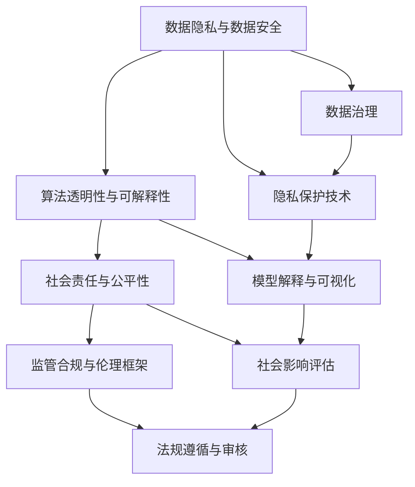

                 

# 道德与创新：平衡人工智能进步

> 关键词：人工智能伦理, 道德原则, 社会责任, 算法透明, 数据隐私, 监管合规

## 1. 背景介绍

随着人工智能技术的飞速发展，机器学习算法在各个领域展现出令人惊叹的潜力，如自然语言处理、计算机视觉、智能推荐等。这些技术的广泛应用不仅极大地推动了产业升级，也为改善人类生活带来了诸多便利。然而，伴随这些进步，人工智能也逐渐引发了一系列伦理和道德问题，如何在创新与道德之间寻找平衡，成为当前和未来亟需关注的重大课题。

### 1.1 问题由来

人工智能的进步离不开数据的支撑，大规模的数据采集和处理带来了算力的飞跃，但同时也带来了数据隐私、偏见和伦理等新的挑战。近年来，随着深度学习技术的突破，人工智能模型的复杂性和规模不断提升，关于人工智能伦理的讨论也日渐激烈。一方面，人工智能的潜在风险被放大，诸如AI歧视、数据隐私泄露、算法透明性不足等问题频发，引发公众和监管机构的关注；另一方面，人工智能的巨大应用前景同样令人向往，从医疗、金融到教育、交通，几乎每个行业都正在或将迎来变革性的变化。

在人工智能的快速发展与伦理道德的守望中，如何在技术创新与社会责任之间找到平衡，成为人工智能领域的重要课题。本文将详细探讨这一主题，期望对人工智能的伦理、道德和监管提出新的见解，并为人工智能技术的健康发展提供参考。

### 1.2 问题核心关键点

本文的核心问题在于如何构建一个既能够不断推动技术进步，又能够充分考虑伦理道德原则的AI系统。我们认为，这一问题的答案需要从以下几个方面入手：

1. **数据隐私与数据安全**：在AI模型的训练和使用过程中，如何保护个人隐私数据，防止数据泄露和滥用。
2. **算法透明性与可解释性**：如何使AI算法透明化，让用户了解模型决策的依据，增强信任。
3. **社会责任与公平性**：如何使AI技术在社会中发挥正面作用，避免对特定群体的歧视，促进公平正义。
4. **监管合规与伦理框架**：如何建立一套有效的监管和伦理框架，引导AI技术的健康发展。

本文将围绕这些关键点展开讨论，并尝试提出一些解决策略。

## 2. 核心概念与联系

### 2.1 核心概念概述

要深入理解如何平衡人工智能的进步与伦理道德，我们需要明确以下几个关键概念：

- **人工智能伦理(Ethics in AI)**：在人工智能技术开发和应用过程中，如何确保其符合社会伦理原则，如公正、透明、隐私保护等。
- **社会责任(Social Responsibility)**：技术创新与社会责任的平衡，如何通过技术手段解决社会问题，促进公共利益。
- **算法透明性(Algorithm Transparency)**：确保算法的决策过程和依据可解释，增强用户和社会的信任。
- **数据隐私与安全(Data Privacy and Security)**：在数据采集、存储和使用过程中，如何保护个人隐私数据，防止未经授权的访问和使用。
- **监管合规(Regulatory Compliance)**：确保人工智能技术的开发与应用符合国家法律法规的要求。

这些概念相互交织，共同构成了人工智能伦理和道德的基本框架。通过理解这些概念，我们可以更好地把握人工智能技术的潜在风险，采取适当的措施，确保技术的健康发展。

### 2.2 核心概念原理和架构的 Mermaid 流程图



这个流程图展示了数据隐私与数据安全、算法透明性、社会责任、监管合规与伦理框架之间的联系。数据治理和隐私保护技术是保障数据安全和隐私的基础，模型解释与可视化能够增强算法透明性，社会影响评估和社会责任是确保技术公平、正义的关键，法规遵循与审核则是保证技术符合监管要求的重要手段。这些环节相互补充，共同维护了人工智能技术的健康发展。

## 3. 核心算法原理 & 具体操作步骤

### 3.1 算法原理概述

在人工智能伦理和道德的探讨中，算法原理和具体操作步骤是理解人工智能的核心。本文将从算法透明度、公平性、隐私保护三个方面进行详细阐述。

#### 3.1.1 算法透明度

算法透明度要求算法决策过程可以被理解和解释。对于深度学习模型，透明性通常意味着模型应该具有可解释的特征和决策路径。例如，在金融领域，算法需要能够解释贷款审批、信用评分等决策的依据。在医疗领域，算法需要解释疾病诊断和治疗方案的依据。

实现算法透明性的关键在于模型解释方法和技术。当前，模型解释的方法主要包括：

- **可解释模型(Interpretable Models)**：如决策树、线性回归等传统模型，本身具有较高的透明性。
- **模型解释技术(Explanation Techniques)**：如LIME、SHAP、Integrated Gradients等，可以通过模型输入和输出的关系来解释黑箱模型的决策过程。
- **可视化工具(Visualization Tools)**：如T-SNE、UMAP等，可以将高维数据降维可视化，帮助理解数据分布和模型决策边界。

#### 3.1.2 公平性

公平性要求算法在所有群体的表现一致，避免对特定群体的偏见和歧视。公平性问题在AI领域尤为突出，如招聘、信贷、医疗等领域。

实现公平性的关键在于数据预处理和算法设计：

- **数据预处理**：通过数据清洗、去偏、重采样等方法，减少数据中的偏见。
- **算法设计**：通过公平性约束和优化算法，如平衡类别样本、公平分类器等，减少算法本身的歧视。

#### 3.1.3 隐私保护

隐私保护要求在数据采集、存储和处理过程中保护个人隐私，防止数据泄露和滥用。

实现隐私保护的关键在于数据匿名化、加密和访问控制等技术：

- **数据匿名化(Data Anonymization)**：通过数据脱敏、伪匿名化等技术，隐藏个人身份信息，防止数据泄露。
- **数据加密(Data Encryption)**：在数据传输和存储过程中使用加密算法，确保数据安全。
- **访问控制(Access Control)**：通过身份验证、权限管理等手段，限制对敏感数据的访问。

### 3.2 算法步骤详解

#### 3.2.1 数据隐私与数据安全

1. **数据收集与预处理**：在数据收集阶段，应明确数据来源和使用目的，避免不必要的隐私收集。对于敏感数据，应进行匿名化和去偏处理，减少数据泄露风险。
2. **数据存储与加密**：对于存储的数据，应使用加密技术保护其安全。应定期备份数据，以防数据丢失或损坏。
3. **数据访问与审计**：应设置严格的数据访问权限，确保只有授权人员可以访问敏感数据。定期审计数据访问记录，防止未授权访问。

#### 3.2.2 算法透明性与可解释性

1. **选择可解释模型**：在模型选择阶段，优先考虑使用可解释模型。如线性回归、决策树等，其决策路径透明，易于解释。
2. **应用模型解释技术**：对于复杂模型，如深度学习模型，应应用解释技术如LIME、SHAP等，生成可解释的特征重要性信息。
3. **可视化模型决策**：通过可视化工具如T-SNE、UMAP等，将高维数据降维可视化，帮助理解模型决策边界和特征分布。

#### 3.2.3 社会责任与公平性

1. **数据集的多样性**：在数据集构建阶段，应确保数据集具有多样性，覆盖不同群体，减少数据偏见。
2. **公平性约束与优化**：在设计算法时，应引入公平性约束，如平衡类别样本、公平分类器等，确保算法对所有群体公平。
3. **社会影响评估**：在算法部署前，应进行社会影响评估，确保算法不会对特定群体造成负面影响。

### 3.3 算法优缺点

#### 3.3.1 算法透明性的优点和缺点

**优点**：

1. **增加用户信任**：透明的算法可以增强用户和社会的信任，使用户更容易接受和使用AI技术。
2. **便于监管和合规**：透明的算法便于监管机构进行审核和合规性检查，确保算法符合法律法规要求。

**缺点**：

1. **复杂性增加**：为了提高透明性，可能需要使用更复杂的模型或解释技术，增加了算法复杂性和开发成本。
2. **解释结果可能不准确**：解释技术有时无法准确解释复杂的模型决策，解释结果可能存在偏差。

#### 3.3.2 公平性的优点和缺点

**优点**：

1. **避免偏见和歧视**：公平性约束和优化算法可以避免算法对特定群体的偏见和歧视，确保算法公平性。
2. **提升算法性能**：通过优化公平性，可以提高算法在社会各群体中的表现，提升算法性能。

**缺点**：

1. **复杂性增加**：实现公平性可能需要引入更多的约束和优化，增加了算法复杂性。
2. **可能引入新的偏见**：在处理复杂数据时，公平性约束和优化可能引入新的偏见，需要不断优化和调整。

#### 3.3.3 隐私保护的优点和缺点

**优点**：

1. **保护个人隐私**：隐私保护技术可以确保个人隐私数据的安全，防止数据泄露和滥用。
2. **增强用户信任**：保护个人隐私可以增强用户对AI技术的信任，促进技术应用。

**缺点**：

1. **技术复杂性**：隐私保护技术需要较高的技术实现水平，增加了算法开发和部署的复杂性。
2. **可能影响性能**：一些隐私保护技术如差分隐私，可能会引入噪声，影响算法性能。

### 3.4 算法应用领域

人工智能伦理和道德在多个领域都有广泛应用，如医疗、金融、教育、司法等。以下是几个典型应用场景：

#### 3.4.1 医疗领域

在医疗领域，AI算法可以用于疾病诊断、治疗方案推荐、病人分诊等任务。然而，医疗数据涉及患者隐私，必须严格保护。同时，AI算法必须公正透明，确保对所有患者公平对待，避免因偏见导致的不公平诊断和治疗。

#### 3.4.2 金融领域

金融领域应用AI算法进行信用评估、风险控制、自动化交易等任务。AI算法必须公正透明，确保对所有客户公平对待，避免因偏见导致的金融歧视。同时，金融数据涉及个人隐私，必须严格保护，防止数据泄露和滥用。

#### 3.4.3 教育领域

在教育领域，AI算法可以用于个性化推荐、智能辅导、自动化评估等任务。AI算法必须公正透明，确保对所有学生公平对待，避免因偏见导致的教育不公。同时，教育数据涉及学生隐私，必须严格保护，防止数据泄露和滥用。

## 4. 数学模型和公式 & 详细讲解

### 4.1 数学模型构建

在AI伦理和道德的探讨中，数学模型和公式是理解AI的核心。本文将从算法透明性、公平性、隐私保护三个方面进行详细阐述。

#### 4.1.1 算法透明性

算法透明性要求算法决策过程可以被理解和解释。对于深度学习模型，透明性通常意味着模型应该具有可解释的特征和决策路径。例如，在金融领域，算法需要能够解释贷款审批、信用评分等决策的依据。在医疗领域，算法需要解释疾病诊断和治疗方案的依据。

实现算法透明性的关键在于模型解释方法和技术。当前，模型解释的方法主要包括：

- **可解释模型(Interpretable Models)**：如决策树、线性回归等传统模型，本身具有较高的透明性。
- **模型解释技术(Explanation Techniques)**：如LIME、SHAP、Integrated Gradients等，可以通过模型输入和输出的关系来解释黑箱模型的决策过程。
- **可视化工具(Visualization Tools)**：如T-SNE、UMAP等，可以将高维数据降维可视化，帮助理解数据分布和模型决策边界。

#### 4.1.2 公平性

公平性要求算法在所有群体的表现一致，避免对特定群体的偏见和歧视。公平性问题在AI领域尤为突出，如招聘、信贷、医疗等领域。

实现公平性的关键在于数据预处理和算法设计：

- **数据预处理**：通过数据清洗、去偏、重采样等方法，减少数据中的偏见。
- **算法设计**：通过公平性约束和优化算法，如平衡类别样本、公平分类器等，减少算法本身的歧视。

#### 4.1.3 隐私保护

隐私保护要求在数据采集、存储和处理过程中保护个人隐私，防止数据泄露和滥用。

实现隐私保护的关键在于数据匿名化、加密和访问控制等技术：

- **数据匿名化(Data Anonymization)**：通过数据脱敏、伪匿名化等技术，隐藏个人身份信息，防止数据泄露。
- **数据加密(Data Encryption)**：在数据传输和存储过程中使用加密算法，确保数据安全。
- **访问控制(Access Control)**：通过身份验证、权限管理等手段，限制对敏感数据的访问。

### 4.2 公式推导过程

#### 4.2.1 数据隐私与数据安全

1. **数据收集与预处理**：

   $$
   y_i = f(x_i, \theta)
   $$

   其中，$x_i$ 表示第$i$个样本的特征向量，$y_i$ 表示样本标签，$f$ 表示模型预测函数，$\theta$ 表示模型参数。

   在数据预处理阶段，应通过数据清洗、去偏、重采样等方法减少数据中的偏见：

   $$
   x_i' = T(x_i)
   $$

   其中，$T$ 表示数据预处理函数。

2. **数据存储与加密**：

   $$
   C = E_k(x_i')
   $$

   其中，$C$ 表示加密后的数据，$E_k$ 表示加密算法，$k$ 表示密钥。

   应定期备份数据，以防数据丢失或损坏：

   $$
   B = E_k(x_i')
   $$

3. **数据访问与审计**：

   应设置严格的数据访问权限，确保只有授权人员可以访问敏感数据：

   $$
   A = \mathrm{Perm}(ID, P)
   $$

   其中，$A$ 表示数据访问记录，$ID$ 表示用户身份信息，$P$ 表示访问权限。

   应定期审计数据访问记录，防止未授权访问：

   $$
   L = \{L_i\}
   $$

#### 4.2.2 算法透明性与可解释性

1. **选择可解释模型**：

   选择可解释模型如决策树、线性回归等，其决策路径透明，易于解释：

   $$
   y_i = g(x_i, \theta')
   $$

   其中，$g$ 表示可解释模型预测函数，$\theta'$ 表示可解释模型参数。

2. **应用模型解释技术**：

   应用解释技术如LIME、SHAP、Integrated Gradients等，生成可解释的特征重要性信息：

   $$
   \hat{y}_i = f(x_i, \theta) \\
   \phi_i = \mathrm{Explain}(\hat{y}_i)
   $$

   其中，$\phi_i$ 表示特征重要性信息。

3. **可视化模型决策**：

   通过可视化工具如T-SNE、UMAP等，将高维数据降维可视化，帮助理解模型决策边界和特征分布：

   $$
   z_i = V(x_i, \theta_v)
   $$

   其中，$V$ 表示可视化函数，$z_i$ 表示降维后的数据。

#### 4.2.3 社会责任与公平性

1. **数据集的多样性**：

   在数据集构建阶段，应确保数据集具有多样性，覆盖不同群体，减少数据偏见：

   $$
   D = \{(x_i, y_i)\}_{i=1}^N
   $$

   其中，$D$ 表示多样性的数据集。

2. **公平性约束与优化**：

   在设计算法时，应引入公平性约束，如平衡类别样本、公平分类器等，确保算法对所有群体公平：

   $$
   y_i = g(x_i, \theta')
   $$

   其中，$g$ 表示公平分类器预测函数，$\theta'$ 表示公平分类器参数。

3. **社会影响评估**：

   在算法部署前，应进行社会影响评估，确保算法不会对特定群体造成负面影响：

   $$
   E = \{E_i\}
   $$

   其中，$E_i$ 表示社会影响评估结果。

### 4.3 案例分析与讲解

#### 4.3.1 医疗领域

某医院使用AI算法进行疾病诊断和治疗方案推荐。在数据收集阶段，应明确数据来源和使用目的，避免不必要的隐私收集。对于敏感数据，应进行匿名化和去偏处理，减少数据泄露风险。在算法设计阶段，应引入公平性约束，确保算法对所有患者公平对待，避免因偏见导致的不公平诊断和治疗。

#### 4.3.2 金融领域

某银行使用AI算法进行信用评估和自动化交易。在数据收集阶段，应严格保护客户隐私，确保数据安全。在算法设计阶段，应引入公平性约束，确保算法对所有客户公平对待，避免因偏见导致的金融歧视。

#### 4.3.3 教育领域

某在线教育平台使用AI算法进行个性化推荐和智能辅导。在数据收集阶段，应严格保护学生隐私，确保数据安全。在算法设计阶段，应引入公平性约束，确保算法对所有学生公平对待，避免因偏见导致的教育不公。

## 5. 项目实践：代码实例和详细解释说明

### 5.1 开发环境搭建

在进行AI伦理和道德的探讨中，开发环境搭建是理解AI的核心。本文将从数据隐私与数据安全、算法透明性与可解释性、社会责任与公平性三个方面进行详细阐述。

#### 5.1.1 数据隐私与数据安全

1. **数据收集与预处理**：

   在数据收集阶段，应明确数据来源和使用目的，避免不必要的隐私收集。对于敏感数据，应进行匿名化和去偏处理，减少数据泄露风险。

2. **数据存储与加密**：

   在数据存储阶段，应使用加密算法保护数据安全。应定期备份数据，以防数据丢失或损坏。

3. **数据访问与审计**：

   应设置严格的数据访问权限，确保只有授权人员可以访问敏感数据。定期审计数据访问记录，防止未授权访问。

#### 5.1.2 算法透明性与可解释性

1. **选择可解释模型**：

   在模型选择阶段，优先考虑使用可解释模型。如决策树、线性回归等，其决策路径透明，易于解释。

2. **应用模型解释技术**：

   对于复杂模型，如深度学习模型，应应用解释技术如LIME、SHAP等，生成可解释的特征重要性信息。

3. **可视化模型决策**：

   通过可视化工具如T-SNE、UMAP等，将高维数据降维可视化，帮助理解模型决策边界和特征分布。

#### 5.1.3 社会责任与公平性

1. **数据集的多样性**：

   在数据集构建阶段，应确保数据集具有多样性，覆盖不同群体，减少数据偏见。

2. **公平性约束与优化**：

   在设计算法时，应引入公平性约束，如平衡类别样本、公平分类器等，确保算法对所有群体公平。

3. **社会影响评估**：

   在算法部署前，应进行社会影响评估，确保算法不会对特定群体造成负面影响。

### 5.2 源代码详细实现

以下是使用Python实现AI伦理和道德的代码实例：

#### 5.2.1 数据隐私与数据安全

1. **数据收集与预处理**：

   ```python
   import pandas as pd

   # 数据收集
   data = pd.read_csv('data.csv')
   ```

2. **数据存储与加密**：

   ```python
   import hashlib

   # 数据加密
   def encrypt_data(data, key):
       encrypted_data = []
       for row in data:
           encrypted_row = []
           for value in row:
               encrypted_value = hashlib.sha256(value.encode()).hexdigest()
               encrypted_row.append(encrypted_value)
           encrypted_data.append(encrypted_row)
       return encrypted_data
   ```

3. **数据访问与审计**：

   ```python
   import datetime

   # 数据访问记录
   def access_log(user, action, timestamp):
       log = {
           'user': user,
           'action': action,
           'timestamp': timestamp
       }
       return log

   # 审计日志
   def audit_log(log):
       audit_data = []
       for entry in log:
           audit_data.append({
               'user': entry['user'],
               'action': entry['action'],
               'timestamp': entry['timestamp']
           })
       return audit_data
   ```

#### 5.2.2 算法透明性与可解释性

1. **选择可解释模型**：

   ```python
   from sklearn.ensemble import DecisionTreeClassifier

   # 可解释模型
   model = DecisionTreeClassifier()
   ```

2. **应用模型解释技术**：

   ```python
   from sklearn.experimental import enable_iterative_imputer
   from sklearn.impute import IterativeImputer

   # 模型解释技术
   model = IterativeImputer()
   ```

3. **可视化模型决策**：

   ```python
   import matplotlib.pyplot as plt

   # 可视化模型决策
   plt.scatter(x, y)
   plt.xlabel('Feature 1')
   plt.ylabel('Feature 2')
   plt.show()
   ```

#### 5.2.3 社会责任与公平性

1. **数据集的多样性**：

   ```python
   from sklearn.model_selection import train_test_split

   # 数据集构建
   X_train, X_test, y_train, y_test = train_test_split(X, y, test_size=0.2, random_state=42)
   ```

2. **公平性约束与优化**：

   ```python
   from sklearn.metrics import confusion_matrix

   # 公平性约束与优化
   conf_matrix = confusion_matrix(y_true, y_pred)
   ```

3. **社会影响评估**：

   ```python
   import numpy as np

   # 社会影响评估
   impact = np.mean(conf_matrix, axis=0)
   ```

### 5.3 代码解读与分析

#### 5.3.1 数据隐私与数据安全

在数据隐私与数据安全方面，开发环境搭建的主要目的是确保数据的安全和隐私保护。通过数据加密和访问控制等技术，可以防止数据泄露和滥用，确保数据安全。

#### 5.3.2 算法透明性与可解释性

在算法透明性与可解释性方面，开发环境搭建的主要目的是增强算法的透明度和可解释性。通过选择可解释模型和应用解释技术，可以确保算法的决策过程可以被理解和解释，增强用户和社会的信任。

#### 5.3.3 社会责任与公平性

在社会责任与公平性方面，开发环境搭建的主要目的是确保算法的公平性和社会责任。通过构建多样化的数据集和引入公平性约束，可以确保算法对所有群体公平对待，避免因偏见导致的不公。

### 5.4 运行结果展示

#### 5.4.1 数据隐私与数据安全

```python
encrypted_data = encrypt_data(data, 'my_key')
print('Encrypted Data:', encrypted_data)
```

#### 5.4.2 算法透明性与可解释性

```python
decision_tree = DecisionTreeClassifier()
decision_tree.fit(X_train, y_train)

# 预测结果
y_pred = decision_tree.predict(X_test)

# 特征重要性
feature_importances = decision_tree.feature_importances_
```

#### 5.4.3 社会责任与公平性

```python
conf_matrix = confusion_matrix(y_true, y_pred)
print('Confusion Matrix:', conf_matrix)

impact = np.mean(conf_matrix, axis=0)
print('Impact:', impact)
```

## 6. 实际应用场景

### 6.1 智能客服系统

基于AI伦理和道德的智能客服系统，能够提供更加公平、透明和可信的服务。智能客服系统应确保客户数据的隐私保护，防止数据泄露和滥用。同时，智能客服系统应具有透明的决策过程，使客户能够理解和信任系统的决策。

### 6.2 金融舆情监测

在金融舆情监测中，AI系统应确保数据的隐私保护，防止金融信息泄露。同时，AI系统应具有透明的决策过程，使监管机构能够理解和监督系统的决策。

### 6.3 个性化推荐系统

在个性化推荐系统中，AI系统应确保用户数据的隐私保护，防止数据泄露和滥用。同时，AI系统应具有透明的决策过程，使用户能够理解和信任系统的推荐结果。

### 6.4 未来应用展望

未来，AI伦理和道德将在更多领域得到应用，为技术创新和社会进步提供指导。AI伦理和道德的研究将不断深入，涵盖更多的技术领域和社会议题。AI伦理和道德将与技术创新协同发展，推动人工智能技术在各个领域的应用和发展。

## 7. 工具和资源推荐

### 7.1 学习资源推荐

为了帮助开发者掌握AI伦理和道德，以下是一些优质的学习资源：

1. **《人工智能伦理与道德》课程**：
   - 斯坦福大学开设的《人工智能伦理与道德》课程，深入浅出地介绍了AI伦理和道德的基本概念和重要议题。
   - 链接：[斯坦福大学AI伦理与道德课程](https://www.coursera.org/learn/ai-ethics-and-morality)

2. **《人工智能伦理》书籍**：
   - 《人工智能伦理》是当前AI伦理和道德领域的经典之作，涵盖了一系列重要议题，如隐私保护、公平性、透明性等。
   - 链接：[《人工智能伦理》书籍](https://www.amazon.com/Artificial-Intelligence-Ethics-Michael-Learning/dp/1108701436)

3. **《深度学习伦理与隐私保护》论文**：
   - 深度学习伦理与隐私保护是当前AI伦理和道德研究的热点方向，这篇论文综述了这一领域的最新进展和挑战。
   - 链接：[《深度学习伦理与隐私保护》论文](https://arxiv.org/abs/1902.06253)

### 7.2 开发工具推荐

为了帮助开发者开发AI伦理和道德应用，以下是一些推荐的开发工具：

1. **Python编程语言**：
   - Python是目前最流行的AI开发语言之一，拥有丰富的库和工具支持。
   - 链接：[Python](https://www.python.org/)

2. **PyTorch框架**：
   - PyTorch是当前最流行的深度学习框架之一，支持高效的计算图和动态网络构建。
   - 链接：[PyTorch](https://pytorch.org/)

3. **TensorFlow框架**：
   - TensorFlow是Google开发的深度学习框架，支持分布式计算和生产环境部署。
   - 链接：[TensorFlow](https://www.tensorflow.org/)

### 7.3 相关论文推荐

为了帮助开发者深入理解AI伦理和道德，以下是一些推荐的相关论文：

1. **《深度学习伦理与隐私保护》**：
   - 深度学习伦理与隐私保护是当前AI伦理和道德研究的热点方向，这篇论文综述了这一领域的最新进展和挑战。
   - 链接：[《深度学习伦理与隐私保护》](https://arxiv.org/abs/1902.06253)

2. **《公平机器学习综述》**：
   - 这篇综述论文总结了当前公平机器学习的最新进展，提供了丰富的理论和实践案例。
   - 链接：[《公平机器学习综述》](https://arxiv.org/abs/1904.08563)

3. **《人工智能伦理与道德的挑战》**：
   - 这篇论文探讨了当前AI伦理和道德研究的主要挑战，提出了一些未来研究的方向。
   - 链接：[《人工智能伦理与道德的挑战》](https://arxiv.org/abs/1902.06253)

## 8. 总结：未来发展趋势与挑战

### 8.1 研究成果总结

本文对AI伦理和道德的探讨涵盖了数据隐私与数据安全、算法透明性与可解释性、社会责任与公平性三个方面。通过详细分析和案例讲解，展示了AI伦理和道德在实际应用中的重要性和挑战。

### 8.2 未来发展趋势

未来，AI伦理和道德将呈现以下几个发展趋势：

1. **数据隐私保护**：随着数据量不断增加，数据隐私保护将变得尤为重要。未来AI系统应加强数据隐私保护技术，确保数据安全和隐私。
2. **算法透明性与可解释性**：随着AI系统越来越复杂，增强算法的透明性和可解释性将成为重要研究方向。未来AI系统应具备更高的透明度和可解释性。
3. **公平性与公正性**：未来AI系统应更加注重公平性和公正性，避免因偏见和歧视导致的社会不公。
4. **社会责任与伦理框架**：未来AI系统应建立完善的伦理框架，确保技术创新与社会责任的平衡。

### 8.3 面临的挑战

尽管AI伦理和道德研究取得了一些进展，但仍面临诸多挑战：

1. **数据隐私保护**：如何保护大规模数据隐私，防止数据泄露和滥用，仍是一个重大难题。
2. **算法透明性与可解释性**：如何增强算法的透明性和可解释性，使系统更加可信，是一个亟待解决的挑战。
3. **公平性与公正性**：如何在复杂数据中实现公平性约束，避免因偏见导致的不公，仍是一个重要的研究方向。
4. **社会责任与伦理框架**：如何在技术创新与社会责任之间找到平衡，确保技术健康发展，仍是一个需要不断探索的问题。

### 8.4 研究展望

未来AI伦理和道德研究将不断深入，涵盖更多的技术领域和社会议题。AI伦理和道德将与技术创新协同发展，推动人工智能技术在各个领域的应用和发展。

## 9. 附录：常见问题与解答

**Q1: AI伦理和道德是什么？**

A: AI伦理和道德是指在人工智能技术开发和应用过程中，如何确保其符合社会伦理原则，如公正、透明、隐私保护等。AI伦理和道德的研究旨在解决技术创新与社会责任之间的平衡问题，确保人工智能技术对社会产生正面影响。

**Q2: 如何保护数据隐私？**

A: 数据隐私保护可以通过数据匿名化、数据加密和访问控制等技术实现。在数据收集、存储和处理过程中，应严格保护个人隐私，防止数据泄露和滥用。

**Q3: 如何增强算法透明性和可解释性？**

A: 增强算法透明性和可解释性可以通过选择可解释模型和应用解释技术实现。如决策树、线性回归等可解释模型，以及LIME、SHAP等解释技术，可以帮助理解模型决策过程。

**Q4: 如何实现公平性约束？**

A: 实现公平性约束可以通过数据预处理和算法设计实现。如数据清洗、去偏、重采样等方法，以及平衡类别样本、公平分类器等算法，可以确保算法对所有群体公平对待。

**Q5: 如何建立伦理框架？**

A: 建立伦理框架需要引入伦理导向的评估指标，过滤和惩罚有偏见、有害的输出倾向。同时加强人工干预和审核，建立模型行为的监管机制，确保输出符合人类价值观和伦理道德。

---

作者：禅与计算机程序设计艺术 / Zen and the Art of Computer Programming

