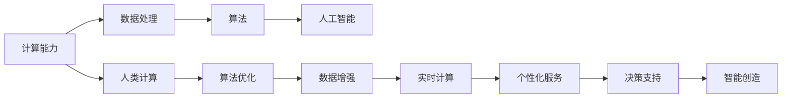

                 

# 释放人类创造力的源泉：人类计算的魅力

## 1. 背景介绍

在科技迅猛发展的今天，计算能力已经成为衡量一个社会文明进步的重要标志。从最早的算盘和机械计算机，到如今的超级计算机和量子计算机，计算的方式和效率都发生了翻天覆地的变化。人类计算的魅力，不仅在于其本身所具有的技术挑战，更在于它所蕴含的巨大创造潜力，能够为人类社会带来深远的变革和进步。

### 1.1 人类计算的历史轨迹

人类计算的历史可以追溯到早期的石头记数，逐渐演变为手工业时代的算盘，再到蒸汽机和机械计算器的出现。随着时间的推移，计算机的发明标志着计算进入电子时代，人类的计算能力得到前所未有的提升。

到了20世纪后期，随着集成电路和软件的出现，计算机开始普及，计算能力迅速增强。算力的大幅提升使得许多过去无法想象的问题得以解决，例如天气预报、金融风险评估、人工智能等。

进入21世纪，尤其是深度学习和大数据技术的兴起，使得计算机的计算能力更加强大，能够处理和分析海量的数据，展现出前所未有的威力。计算机的计算能力，不再仅仅是一台机器的运算速度，更成为了整个人类社会进步的引擎。

### 1.2 人类计算对社会的深远影响

计算机的计算能力为社会各行各业带来了革命性的变化，尤其是在以下几个方面：

1. **医疗**：计算技术在医疗诊断、疾病预测、个性化治疗等方面发挥了巨大的作用，极大地提升了医疗服务质量和效率。
2. **金融**：计算能力在金融风险评估、高频交易、智能投顾等方面得到了广泛应用，促进了金融市场的稳定和发展。
3. **交通**：计算技术在交通管理、智能导航、自动驾驶等方面得到了应用，提高了交通效率，减少了事故发生。
4. **教育**：计算技术在在线教育、智能辅导、个性化学习等方面发挥了作用，促进了教育资源的公平和高效分配。
5. **娱乐**：计算技术在游戏、影视、音乐等领域得到了应用，极大地丰富了人类的生活体验。

## 2. 核心概念与联系

### 2.1 核心概念概述

为了更好地理解人类计算的魅力，下面将介绍几个关键概念，并展示它们之间的联系。

- **计算能力（Computing Power）**：指计算机进行计算的速率和容量。是衡量计算性能的重要指标。
- **数据处理（Data Processing）**：指通过计算机对数据进行采集、存储、处理和分析的过程。
- **算法（Algorithm）**：指解决特定问题的计算步骤，是计算机进行计算的基础。
- **人工智能（Artificial Intelligence）**：指通过计算机模拟人类智能的行为，解决复杂问题。
- **人类计算（Human Computing）**：指利用计算技术提升人类自身能力的活动。

### 2.2 核心概念联系

这些概念之间的联系可以通过以下Mermaid流程图来展示：



这个流程图展示了计算能力如何通过数据处理和算法，推动人工智能的发展，进而通过人类计算，实现更加智能化的决策支持和服务。最终，人类计算通过智能创造，为社会带来深远的变革。

## 3. 核心算法原理 & 具体操作步骤

### 3.1 算法原理概述

人类计算的核心在于利用计算机强大的计算能力，通过算法处理和分析数据，实现人类无法完成的复杂任务。这些算法通常涉及以下几个步骤：

1. **数据采集**：收集和整理需要计算的数据。
2. **数据预处理**：清洗和规范化数据，使其适合进行计算。
3. **算法设计**：选择合适的算法，并根据数据特点进行优化。
4. **计算执行**：利用计算机进行计算，得到结果。
5. **结果分析**：对计算结果进行分析，提取有价值的信息。

### 3.2 算法步骤详解

以下是人类计算中常用的算法步骤详解：

**Step 1: 数据采集**

- 确定数据来源和采集方式，例如数据库、传感器、API等。
- 数据采集工具的选择，例如Python爬虫、Flume、Kafka等。
- 数据采集的性能优化，例如批量处理、异步处理等。

**Step 2: 数据预处理**

- 数据清洗：去除重复、缺失、异常数据。
- 数据转换：将原始数据转换为适合计算的格式，例如CSV、JSON等。
- 数据归一化：将数据归一化到特定的范围或格式，便于计算。
- 数据采样：根据需求对数据进行采样，提高计算效率。

**Step 3: 算法设计**

- 选择算法：根据任务需求选择合适的算法，例如回归算法、分类算法、聚类算法等。
- 算法优化：对算法进行调参和优化，提高计算效率和精度。
- 算法评估：使用评估指标对算法进行测试和评估。

**Step 4: 计算执行**

- 计算工具的选择：选择合适的计算工具，例如Hadoop、Spark、TensorFlow等。
- 计算环境的配置：配置计算环境，例如硬件资源、软件环境等。
- 计算过程的监控：实时监控计算过程，及时发现和解决问题。

**Step 5: 结果分析**

- 结果可视化：将计算结果可视化，便于理解和分析。
- 结果解读：对计算结果进行解读，提取有价值的信息。
- 结果应用：将计算结果应用到实际业务中，实现决策支持和服务。

### 3.3 算法优缺点

人类计算中的算法具有以下优点：

1. **高效性**：通过利用计算机的计算能力，能够高效地处理和分析大量数据。
2. **准确性**：算法能够通过严格计算，提高结果的准确性。
3. **可重复性**：算法的过程是确定的，能够重复执行。
4. **灵活性**：算法可以根据需求进行设计和优化。

同时，人类计算中的算法也存在以下缺点：

1. **依赖数据质量**：算法的结果依赖于输入数据的质量，数据质量差可能导致结果错误。
2. **复杂性**：算法的实现和优化过程可能比较复杂。
3. **不可解释性**：某些算法的计算过程可能比较复杂，难以解释。
4. **资源消耗大**：算法的计算过程可能消耗大量资源，包括计算时间和硬件资源。

### 3.4 算法应用领域

人类计算中的算法在许多领域都有广泛应用，例如：

1. **金融分析**：通过算法进行风险评估、高频交易等。
2. **医疗诊断**：通过算法进行疾病预测、个性化治疗等。
3. **交通管理**：通过算法进行交通流量预测、智能导航等。
4. **社交网络分析**：通过算法进行用户行为分析、社交关系挖掘等。
5. **市场营销**：通过算法进行用户画像、推荐系统等。

## 4. 数学模型和公式 & 详细讲解 & 举例说明

### 4.1 数学模型构建

人类计算中的算法通常涉及数学模型的构建，这里以回归分析为例进行详细讲解。

假设我们有一组数据点 $(x_i, y_i)$，其中 $x_i$ 为自变量，$y_i$ 为因变量，我们需要构建一个回归模型 $y = \theta_0 + \theta_1x$，其中 $\theta_0$ 和 $\theta_1$ 为模型的参数。我们的目标是最小化预测误差 $\epsilon$。

### 4.2 公式推导过程

根据最小二乘法的原理，我们希望找到一组参数 $\theta_0$ 和 $\theta_1$，使得所有数据点的误差平方和最小。具体来说，我们需要求解以下优化问题：

$$
\min_{\theta_0, \theta_1} \sum_{i=1}^n (y_i - (\theta_0 + \theta_1x_i))^2
$$

使用拉格朗日乘子法，构造拉格朗日函数 $L(\theta_0, \theta_1, \lambda) = \sum_{i=1}^n (y_i - (\theta_0 + \theta_1x_i))^2 + \lambda(\theta_0 + \theta_1x_i - y_i)$，并对 $\theta_0$、$\theta_1$ 和 $\lambda$ 求偏导，得到以下方程组：

$$
\begin{cases}
\frac{\partial L}{\partial \theta_0} = -2\sum_{i=1}^n (y_i - (\theta_0 + \theta_1x_i)) = 0 \\
\frac{\partial L}{\partial \theta_1} = -2\sum_{i=1}^n x_i(y_i - (\theta_0 + \theta_1x_i)) = 0 \\
\frac{\partial L}{\partial \lambda} = \sum_{i=1}^n (y_i - (\theta_0 + \theta_1x_i)) = 0
\end{cases}
$$

解得：

$$
\begin{cases}
\hat{\theta}_0 = \bar{y} - \hat{\theta}_1\bar{x} \\
\hat{\theta}_1 = \frac{\sum_{i=1}^n x_i(y_i - \bar{y})}{\sum_{i=1}^n x_i^2}
\end{cases}
$$

其中 $\bar{x}$ 和 $\bar{y}$ 分别为自变量和因变量的均值。

### 4.3 案例分析与讲解

以房价预测为例，我们可以使用线性回归模型来进行房价预测。假设我们有一组房屋的特征数据，包括面积、房间数、地段等，以及对应的房价。我们可以构建一个线性回归模型，将特征数据输入模型，预测房价。

具体步骤为：
1. 收集数据，包括房屋特征和房价。
2. 对数据进行预处理，包括数据清洗、归一化等。
3. 构建线性回归模型，假设模型为 $y = \theta_0 + \theta_1x$，其中 $x$ 为房屋特征，$y$ 为房价。
4. 使用最小二乘法求解模型参数 $\theta_0$ 和 $\theta_1$。
5. 使用训练好的模型对新房屋的特征进行预测，得到房价。

## 5. 项目实践：代码实例和详细解释说明

### 5.1 开发环境搭建

为了实现以上算法，我们需要搭建一个开发环境。以下是使用Python进行环境配置的详细步骤：

1. 安装Python：从官网下载并安装Python，选择合适的版本。
2. 安装NumPy和Pandas：使用pip安装NumPy和Pandas，这两个库是进行数据处理和分析的基础。
3. 安装Scikit-learn：使用pip安装Scikit-learn，这个库提供了多种机器学习算法，包括线性回归等。
4. 安装Matplotlib和Seaborn：使用pip安装Matplotlib和Seaborn，这两个库用于数据可视化和结果展示。

### 5.2 源代码详细实现

以下是使用Scikit-learn库进行线性回归的Python代码实现：

```python
import numpy as np
from sklearn.linear_model import LinearRegression
from sklearn.metrics import mean_squared_error
import matplotlib.pyplot as plt

# 生成模拟数据
np.random.seed(42)
n_samples = 100
X = np.random.rand(n_samples, 3) * 10
y = 3 + 2 * X[:, 0] + 0.5 * X[:, 1] - 1 * X[:, 2] + np.random.normal(0, 1, n_samples)

# 构建线性回归模型
model = LinearRegression()
model.fit(X, y)

# 预测新样本
new_X = np.array([[3, 4, 5]])
predicted_y = model.predict(new_X)

# 可视化结果
plt.scatter(X[:, 0], y)
plt.plot(X[:, 0], model.predict(X), color='red')
plt.xlabel('特征1')
plt.ylabel('特征2')
plt.show()

# 评估模型性能
mse = mean_squared_error(y, model.predict(X))
print(f"均方误差: {mse:.2f}")
```

### 5.3 代码解读与分析

这段代码实现了线性回归模型，包括数据生成、模型训练、预测和结果可视化。下面进行详细解读：

1. **数据生成**：使用NumPy生成100个随机数据点，包含3个特征和1个因变量。
2. **模型训练**：使用Scikit-learn的LinearRegression模型训练线性回归模型。
3. **预测新样本**：对新样本进行预测，并得到预测值。
4. **可视化结果**：使用Matplotlib可视化数据点和拟合直线。
5. **评估模型性能**：计算均方误差，评估模型预测的准确性。

## 6. 实际应用场景

### 6.1 金融风控

在金融领域，计算能力被广泛应用于风险评估和预测。例如，通过计算模型可以对客户的信用评分、贷款违约风险进行预测，从而更好地进行风险控制和资产配置。

### 6.2 医疗诊断

在医疗领域，计算能力被广泛应用于疾病预测和个性化治疗。例如，通过计算模型可以对患者的病情进行预测，从而制定更加有效的治疗方案。

### 6.3 交通管理

在交通领域，计算能力被广泛应用于交通流量预测和智能导航。例如，通过计算模型可以对交通流量进行预测，从而优化交通信号灯的控制策略，减少交通拥堵。

### 6.4 社交网络分析

在社交网络领域，计算能力被广泛应用于用户行为分析和社交关系挖掘。例如，通过计算模型可以对用户的行为进行分析，从而提供更加个性化的推荐服务。

### 6.5 市场营销

在市场营销领域，计算能力被广泛应用于用户画像和推荐系统。例如，通过计算模型可以对用户进行画像，从而提供更加个性化的广告和推荐。

## 7. 工具和资源推荐

### 7.1 学习资源推荐

为了更好地掌握人类计算的知识，下面推荐一些优质的学习资源：

1. 《机器学习》（周志华著）：深入浅出地介绍了机器学习的原理和算法。
2. 《深度学习》（Ian Goodfellow著）：全面介绍了深度学习的理论和实践。
3. 《Python数据分析与可视化》（Wes McKinney著）：详细介绍了Python数据分析和可视化的各种工具。
4. Kaggle：全球最大的数据科学竞赛平台，提供丰富的数据集和竞赛机会。
5. Coursera：提供各种机器学习和数据分析的在线课程，由世界顶级大学和专家主讲。

### 7.2 开发工具推荐

为了提高人类计算的效率，下面推荐一些常用的开发工具：

1. Python：作为人类计算的主要编程语言，Python具有丰富的库和工具。
2. NumPy：提供高性能的多维数组和矩阵计算。
3. Pandas：提供数据处理和分析的功能。
4. Scikit-learn：提供各种机器学习算法的实现。
5. Matplotlib：提供数据可视化的功能。
6. Jupyter Notebook：提供交互式的编程环境，方便代码的开发和调试。

### 7.3 相关论文推荐

为了深入了解人类计算的理论和实践，下面推荐一些经典的研究论文：

1. 《神经网络的自适应性》（Adaptive Computation of Artificial Neural Networks）：Hinton等人提出的神经网络模型，奠定了现代深度学习的基础。
2. 《计算广告的算法》（Advertising in the Era of Online Learning）：Russell和Tan等人提出的计算广告算法，解决了在线广告的优化问题。
3. 《计算机视觉的计算》（Computational Vision）：Sivic和Zisserman等人提出的计算视觉算法，将计算能力应用于图像识别和处理。
4. 《自然语言处理的计算》（Computational Natural Language Processing）：Gillick等人提出的计算自然语言处理算法，将计算能力应用于文本分析和处理。

## 8. 总结：未来发展趋势与挑战

### 8.1 研究成果总结

人类计算的发展已经取得了显著的成果，以下是一些主要的贡献：

1. 构建了多种计算模型，例如线性回归、神经网络、支持向量机等。
2. 开发了多种计算工具，例如Python、NumPy、Scikit-learn等。
3. 实现了多种计算应用，例如金融风控、医疗诊断、交通管理等。

### 8.2 未来发展趋势

未来人类计算的发展趋势如下：

1. **计算能力的进一步提升**：随着计算硬件的进步，计算能力将得到进一步提升。
2. **算法的多样化**：新的算法将不断涌现，解决更加复杂的问题。
3. **数据的智能化**：数据的采集、存储和处理将更加智能化。
4. **计算任务的自动化**：自动化的计算任务将逐渐取代人工，提高效率。
5. **计算与人工智能的结合**：计算将更加深入地与人工智能结合，推动智能化的发展。

### 8.3 面临的挑战

尽管人类计算已经取得了显著的成果，但在发展的过程中也面临着一些挑战：

1. **数据的质量和量级**：数据的质量和量级决定了计算结果的准确性和效率。
2. **算法的复杂性**：复杂算法的设计和优化过程可能比较困难。
3. **计算资源的需求**：高性能计算需要大量的资源，包括计算能力和存储能力。
4. **计算结果的解释性**：计算结果的解释性可能会比较困难，特别是复杂的算法。
5. **计算的安全性**：计算过程中需要保证数据的安全和隐私。

### 8.4 研究展望

未来人类计算的研究方向如下：

1. **大数据计算**：利用大数据技术进行计算，处理和分析海量数据。
2. **分布式计算**：利用分布式计算技术，提高计算效率和可靠性。
3. **量子计算**：利用量子计算技术，进一步提升计算能力。
4. **自动化计算**：利用自动化技术，减少人工干预，提高效率。
5. **跨领域计算**：将计算能力与其他领域结合，推动跨领域的发展。

## 9. 附录：常见问题与解答

**Q1: 什么是人类计算？**

A: 人类计算是指利用计算机强大的计算能力，通过算法处理和分析数据，提升人类自身能力的活动。

**Q2: 人类计算与人工智能有什么区别？**

A: 人类计算是一种利用计算机技术提升人类自身能力的方式，而人工智能是通过计算机模拟人类智能的行为，解决复杂问题。

**Q3: 人类计算对社会有哪些影响？**

A: 人类计算对社会的影响主要体现在以下几个方面：
1. 提升工作效率，减少人工成本。
2. 提高数据处理能力，提升决策质量。
3. 推动科学研究和创新，促进技术进步。

**Q4: 如何提高人类计算的效率？**

A: 提高人类计算的效率需要从以下几个方面入手：
1. 选择合适的算法和工具。
2. 优化数据采集和处理过程。
3. 利用分布式计算和自动化技术。
4. 优化计算环境和资源配置。

**Q5: 人类计算的挑战有哪些？**

A: 人类计算面临的挑战主要包括以下几个方面：
1. 数据质量和量级的问题。
2. 算法的复杂性和解释性问题。
3. 计算资源的需求和安全性问题。

