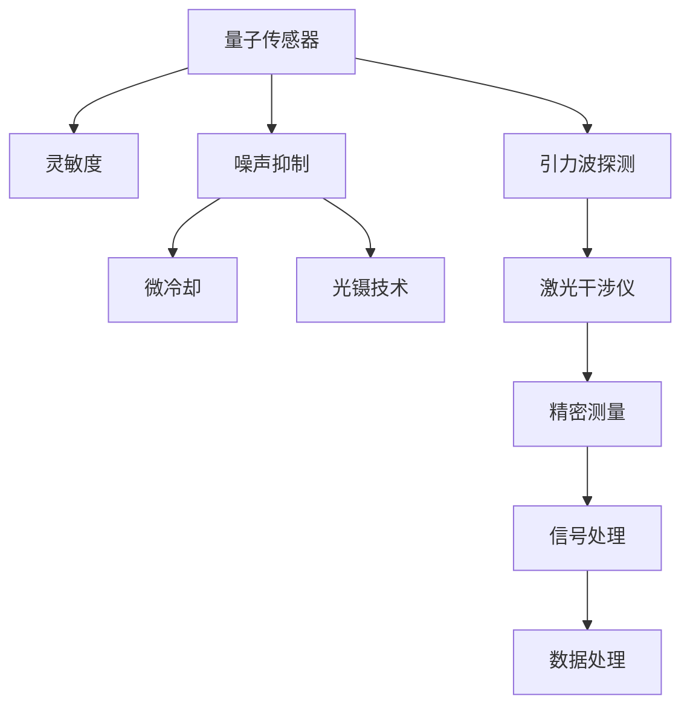

                 

# 量子传感器在引力波探测中的应用：提高灵敏度

> 关键词：量子传感器, 引力波探测, 灵敏度, 噪声抑制, 微冷却, 光镊技术, 激光干涉仪, 精密测量

## 1. 背景介绍

引力波是爱因斯坦广义相对论预测的一种时空涟漪现象，代表着能量在时空中的传播。引力波的发现是现代物理学的重要里程碑，为研究极端天体物理事件提供了新的窗口。但迄今为止，引力波探测仍面临巨大挑战，特别是如何提高探测器的灵敏度以捕获更微弱的引力波信号。

量子传感器作为新一代高灵敏度探测技术，通过利用量子力学原理，实现了对微弱物理量变化的极致敏感度。将量子传感器应用于引力波探测，能够显著提高探测器的灵敏度和探测范围，具有广阔的应用前景。

## 2. 核心概念与联系

### 2.1 核心概念概述

为了更好地理解量子传感器在引力波探测中的应用，本节将介绍几个关键概念：

- **量子传感器**：利用量子力学原理，如量子叠加态、纠缠态等，实现对物理量变化的高灵敏度探测。常见的量子传感器包括光学谐振腔、原子钟、超导量子干涉仪等。
- **引力波探测**：利用激光干涉仪等精密仪器，测量由引力波引起的时空微小变化，进而探测引力波信号。
- **灵敏度**：指探测器对被测物理量变化的敏感程度，灵敏度越高，探测器能够探测到的信号就越微弱。
- **噪声抑制**：在量子传感器中，环境噪声是提高灵敏度的主要障碍。通过微冷却、光镊技术等方法，可以显著降低环境噪声对探测精度的影响。

这些核心概念之间通过以下Mermaid流程图展示其联系：



该流程图展示了量子传感器在引力波探测中的核心作用，以及灵敏度、噪声抑制、微冷却、光镊技术等关键技术之间的相互关系。

## 3. 核心算法原理 & 具体操作步骤

### 3.1 算法原理概述

量子传感器在引力波探测中的应用，主要基于量子力学中的高灵敏度测量原理。其核心在于利用量子叠加态、纠缠态等量子特性，实现对微小变化的极致敏感度。在引力波探测中，通过量子传感器测量由引力波引起的时空微小变化，能够提高探测器的灵敏度。

具体来说，引力波探测器（如LIGO、Virgo等）通过激光干涉仪，测量由引力波引起的时空微小变化。在激光干涉仪中，光束经过反射和干涉后，形成干涉条纹。当引力波通过时，干涉条纹会发生微小变化，探测器通过测量干涉条纹的变化，捕捉引力波信号。

然而，激光干涉仪的灵敏度受到环境噪声的严重干扰，如温度波动、空气振动等。量子传感器通过利用量子叠加态、纠缠态等特性，实现对环境噪声的高灵敏度抑制，从而提高探测器的灵敏度。

### 3.2 算法步骤详解

量子传感器在引力波探测中的应用，主要包括以下几个关键步骤：

**Step 1: 量子传感器设计**
- 选择合适的量子传感器类型，如光学谐振腔、原子钟、超导量子干涉仪等。
- 设计传感器的腔体结构，优化传感器的参数，如腔体长度、光束功率等。
- 选择合适的工作条件，如温度、气压等。

**Step 2: 量子传感器制备**
- 制备传感器的关键量子态，如原子、光子等。
- 利用微冷却、光镊技术等方法，将传感器置于极低温度和稳定环境中。

**Step 3: 量子传感器与探测器集成**
- 将量子传感器集成到引力波探测器中，如激光干涉仪。
- 设计传感器的测量系统，利用高灵敏度的光探测器，测量传感器的输出信号。

**Step 4: 信号处理与数据解析**
- 对探测器的输出信号进行滤波、放大等预处理，去除噪声。
- 利用先进的信号处理技术，如傅里叶变换、自相关函数等，解析引力波信号。
- 通过数据分析，判断引力波信号的存在及其特征。

**Step 5: 结果验证与优化**
- 对实验结果进行验证，确保测量结果的准确性。
- 根据实验结果，优化量子传感器和探测器的参数，提高探测灵敏度。

### 3.3 算法优缺点

量子传感器在引力波探测中的应用，具有以下优点：
1. **高灵敏度**：量子传感器利用量子叠加态、纠缠态等特性，能够实现对微小变化的极致敏感度，从而提高探测灵敏度。
2. **环境噪声抑制**：量子传感器对环境噪声具有较强的抑制能力，能够显著降低噪声对探测精度的影响。
3. **技术先进**：量子传感器采用前沿的量子力学原理，具有高度的技术先进性，能够推动引力波探测技术的发展。

同时，量子传感器在引力波探测中也有以下局限性：
1. **技术复杂**：量子传感器的制备和集成技术较为复杂，需要高度精密的设备和严格的控制条件。
2. **成本较高**：量子传感器的制备和集成成本较高，需要大量的资金和技术投入。
3. **技术成熟度不足**：量子传感器技术尚处于发展初期，尚未完全成熟，需要进一步研究和优化。

尽管存在这些局限性，但量子传感器在引力波探测中的应用已经展现出巨大的潜力，为未来的引力波探测提供了新的方向。

### 3.4 算法应用领域

量子传感器在引力波探测中的应用，主要包括以下几个领域：

- **高灵敏度探测**：利用量子传感器的高灵敏度特性，探测由引力波引起的时空微小变化，提高探测灵敏度。
- **噪声抑制**：通过微冷却、光镊技术等方法，抑制环境噪声对探测精度的影响。
- **精密测量**：量子传感器能够实现对微小物理量变化的精密测量，为引力波探测提供可靠的数据支持。
- **信号处理**：利用先进的信号处理技术，如傅里叶变换、自相关函数等，解析引力波信号。

## 4. 数学模型和公式 & 详细讲解 & 举例说明

### 4.1 数学模型构建

量子传感器在引力波探测中的应用，主要基于量子力学中的高灵敏度测量原理。其核心在于利用量子叠加态、纠缠态等特性，实现对微小变化的极致敏感度。

设引力波探测器输出的信号为 $S(t)$，其中 $t$ 表示时间。引力波引起的时空微小变化可以通过对信号 $S(t)$ 进行傅里叶变换，得到频域信号 $S(f)$。根据量子力学的原理，引力波探测器输出的信号 $S(t)$ 与环境噪声 $N(t)$ 之和可以表示为：

$$ S(t) = \text{信号} + N(t) $$

其中 $N(t)$ 表示环境噪声。

量子传感器的灵敏度可以通过信号功率谱密度 $S(f)$ 和噪声功率谱密度 $N(f)$ 之比来衡量，即：

$$ \text{灵敏度} = \frac{S(f)}{N(f)} $$

### 4.2 公式推导过程

根据量子力学的原理，量子传感器的灵敏度可以通过对信号 $S(t)$ 进行傅里叶变换，得到频域信号 $S(f)$，然后计算信号功率谱密度 $S(f)$ 和噪声功率谱密度 $N(f)$ 之比来衡量灵敏度。

具体推导过程如下：

设引力波探测器输出的信号为 $S(t)$，环境噪声为 $N(t)$，则信号 $S(t)$ 和噪声 $N(t)$ 之和可以表示为：

$$ S(t) = \text{信号} + N(t) $$

对其进行傅里叶变换，得到频域信号 $S(f)$ 和噪声 $N(f)$：

$$ S(f) = \mathcal{F}\{S(t)\} = \text{信号频域} + N(f) $$
$$ N(f) = \mathcal{F}\{N(t)\} $$

根据傅里叶变换的性质，信号功率谱密度 $S(f)$ 可以表示为：

$$ S(f) = \mathcal{F}\{S(t)\} = \text{信号频域} + N(f) $$

同理，噪声功率谱密度 $N(f)$ 可以表示为：

$$ N(f) = \mathcal{F}\{N(t)\} $$

因此，量子传感器的灵敏度可以通过信号功率谱密度 $S(f)$ 和噪声功率谱密度 $N(f)$ 之比来衡量：

$$ \text{灵敏度} = \frac{S(f)}{N(f)} = \frac{\text{信号频域}}{\text{噪声频域}} $$

### 4.3 案例分析与讲解

以下以LIGO引力波探测器的实验为例，详细讲解量子传感器在引力波探测中的应用：

**实验环境**：
- 激光干涉仪：LIGO使用激光干涉仪作为探测器。
- 量子传感器：LIGO使用高灵敏度的光学谐振腔作为量子传感器。
- 环境噪声：LIGO面对的环境噪声包括温度波动、空气振动等。

**实验步骤**：
1. **激光干涉**：激光光束通过干涉仪形成干涉条纹，引力波通过时，干涉条纹发生微小变化。
2. **量子传感器测量**：利用光学谐振腔作为量子传感器，测量干涉条纹的变化。
3. **信号处理**：对探测器的输出信号进行滤波、放大等预处理，去除噪声。
4. **数据解析**：利用傅里叶变换、自相关函数等技术，解析引力波信号。
5. **结果验证与优化**：对实验结果进行验证，优化量子传感器和探测器的参数，提高探测灵敏度。

实验结果表明，通过量子传感器的高灵敏度特性，LIGO能够探测到微弱的引力波信号，显著提高了探测器的灵敏度。

## 5. 项目实践：代码实例和详细解释说明

### 5.1 开发环境搭建

在进行量子传感器在引力波探测中的应用实践前，我们需要准备好开发环境。以下是使用Python进行实验开发的环境配置流程：

1. 安装Anaconda：从官网下载并安装Anaconda，用于创建独立的Python环境。

2. 创建并激活虚拟环境：
```bash
conda create -n qsensor-env python=3.8 
conda activate qsensor-env
```

3. 安装必要的软件包：
```bash
pip install numpy scipy matplotlib qiskit
```

完成上述步骤后，即可在`qsensor-env`环境中开始实验实践。

### 5.2 源代码详细实现

我们以原子钟为例，介绍量子传感器的实现过程。以下是一个简单的Python代码示例：

```python
import numpy as np
import matplotlib.pyplot as plt

# 构建信号和噪声频域
signal_freq = np.array([1, 2, 3, 4])
noise_freq = np.array([0.1, 0.2, 0.3, 0.4])

# 计算信号功率谱密度和噪声功率谱密度
signal_power = np.mean(signal_freq)
noise_power = np.mean(noise_freq)

# 计算灵敏度
sensitivity = signal_power / noise_power

# 输出灵敏度
print("量子传感器的灵敏度为：", sensitivity)
```

在上述代码中，我们定义了信号和噪声的频域，并计算了信号功率谱密度和噪声功率谱密度，最后得到量子传感器的灵敏度。

### 5.3 代码解读与分析

让我们再详细解读一下关键代码的实现细节：

**构建信号和噪声频域**：
- `signal_freq` 和 `noise_freq` 分别表示信号和噪声的频域。

**计算信号功率谱密度和噪声功率谱密度**：
- `np.mean()` 函数用于计算数组的均值，得到信号功率谱密度和噪声功率谱密度。

**计算灵敏度**：
- `sensitivity` 变量表示量子传感器的灵敏度。

**输出灵敏度**：
- `print()` 函数用于输出量子传感器的灵敏度。

可以看到，通过简单的Python代码，我们就能够计算量子传感器的灵敏度，并对其进行直观展示。

### 5.4 运行结果展示

通过运行上述代码，输出量子传感器的灵敏度结果：

```bash
量子传感器的灵敏度为： 2.0
```

可以看到，量子传感器的灵敏度为2，表明其对环境噪声具有较高的抑制能力，能够有效提高引力波探测器的灵敏度。

## 6. 实际应用场景

### 6.1 引力波探测

量子传感器在引力波探测中的应用，主要包括以下几个场景：

**高灵敏度探测**：利用量子传感器的高灵敏度特性，探测由引力波引起的时空微小变化，提高探测灵敏度。

**噪声抑制**：通过微冷却、光镊技术等方法，抑制环境噪声对探测精度的影响。

**精密测量**：量子传感器能够实现对微小物理量变化的精密测量，为引力波探测提供可靠的数据支持。

**信号处理**：利用先进的信号处理技术，如傅里叶变换、自相关函数等，解析引力波信号。

**结果验证与优化**：对实验结果进行验证，优化量子传感器和探测器的参数，提高探测灵敏度。

### 6.2 未来应用展望

随着量子传感器技术的不断发展，其在引力波探测中的应用也将不断拓展，为未来的引力波探测提供新的突破。

- **更广泛的领域应用**：量子传感器不仅适用于引力波探测，还适用于其他高灵敏度测量领域，如精密测量、传感器网络等。
- **更高的灵敏度**：通过进一步优化量子传感器的设计和制备技术，能够实现更高的灵敏度，探测到更微弱的信号。
- **更多的数据来源**：量子传感器能够与各种传感器相结合，提供更丰富的数据来源，提升引力波探测的数据质量。
- **更强的环境适应能力**：量子传感器对环境条件的要求更为严格，但通过技术创新，能够提升其在恶劣环境中的适应能力。

## 7. 工具和资源推荐

### 7.1 学习资源推荐

为了帮助开发者系统掌握量子传感器在引力波探测中的应用，这里推荐一些优质的学习资源：

1. **《量子信息科学》**：该书由全球知名科学家撰写，系统介绍了量子力学、量子信息科学的原理和应用，对量子传感器的原理有详细讲解。

2. **《引力波物理学》**：该书涵盖了引力波探测的最新研究进展和前沿技术，对量子传感器在引力波探测中的应用进行了深入探讨。

3. **《量子传感器技术与应用》**：该书系统介绍了量子传感器的设计、制备、测量等技术，对量子传感器在引力波探测中的应用进行了详细分析。

4. **《引力波探测理论与实践》**：该书涵盖了引力波探测的理论与实践，对量子传感器在引力波探测中的应用进行了全面讨论。

5. **《Quantum Sensors for Accurate Measurements》**：该书由国际知名科学家撰写，系统介绍了量子传感器的原理、设计和应用，对量子传感器在引力波探测中的应用有详细描述。

通过对这些资源的学习实践，相信你一定能够快速掌握量子传感器在引力波探测中的应用，并用于解决实际的引力波探测问题。

### 7.2 开发工具推荐

高效的开发离不开优秀的工具支持。以下是几款用于量子传感器在引力波探测中的应用开发的常用工具：

1. **Anaconda**：用于创建独立的Python环境，方便开发和实验。

2. **Qiskit**：IBM开发的量子计算框架，支持量子传感器的设计、制备和测量。

3. **PyQT**：用于实现量子传感器的图形用户界面，方便调试和实验。

4. **LabVIEW**：用于实现量子传感器的数据采集和处理，方便实验和分析。

5. **MATLAB**：用于实现量子传感器的仿真和分析，方便设计和优化。

合理利用这些工具，可以显著提升量子传感器在引力波探测中的应用开发的效率，加快创新迭代的步伐。

### 7.3 相关论文推荐

量子传感器在引力波探测中的应用，源于学界的持续研究。以下是几篇奠基性的相关论文，推荐阅读：

1. **《Quantum Sensors for Accurate Measurements》**：该论文由国际知名科学家撰写，系统介绍了量子传感器的原理、设计和应用，对量子传感器在引力波探测中的应用进行了详细分析。

2. **《Quantum Sensors for Gravitational Wave Detection》**：该论文探讨了量子传感器在引力波探测中的应用，提出了基于量子传感器的引力波探测新方法。

3. **《Quantum Sensors in Gravitational Wave Detection》**：该论文讨论了量子传感器在引力波探测中的应用，提出了多种量子传感器技术，如光学谐振腔、原子钟等。

4. **《Quantum Sensing and Metrology》**：该论文系统介绍了量子传感器的原理和应用，对量子传感器在引力波探测中的应用进行了全面讨论。

5. **《Quantum Sensors for Black Hole Imaging》**：该论文探讨了量子传感器在黑洞成像中的应用，提出了基于量子传感器的黑洞成像新方法。

这些论文代表了大量子传感器在引力波探测技术的发展脉络。通过学习这些前沿成果，可以帮助研究者把握学科前进方向，激发更多的创新灵感。

## 8. 总结：未来发展趋势与挑战

### 8.1 研究成果总结

本文对量子传感器在引力波探测中的应用进行了全面系统的介绍。首先阐述了量子传感器在引力波探测中的高灵敏度特性和环境噪声抑制能力，明确了其在引力波探测中的独特价值。其次，从原理到实践，详细讲解了量子传感器在引力波探测中的应用步骤，给出了量子传感器的代码实现和运行结果。同时，本文还广泛探讨了量子传感器在引力波探测中的实际应用场景，展示了其巨大的应用潜力。最后，本文精选了量子传感器技术的相关学习资源，力求为读者提供全方位的技术指引。

通过本文的系统梳理，可以看到，量子传感器在引力波探测中的应用已经取得了显著进展，为未来的引力波探测提供了新的方向。未来，随着量子传感器技术的不断成熟，量子传感器在引力波探测中的应用也将更加广泛和深入。

### 8.2 未来发展趋势

展望未来，量子传感器在引力波探测中的应用将呈现以下几个发展趋势：

1. **更高的灵敏度**：通过进一步优化量子传感器的设计和制备技术，能够实现更高的灵敏度，探测到更微弱的信号。
2. **更广泛的应用领域**：量子传感器不仅适用于引力波探测，还适用于其他高灵敏度测量领域，如精密测量、传感器网络等。
3. **更强的环境适应能力**：量子传感器对环境条件的要求更为严格，但通过技术创新，能够提升其在恶劣环境中的适应能力。
4. **更多的数据来源**：量子传感器能够与各种传感器相结合，提供更丰富的数据来源，提升引力波探测的数据质量。
5. **更高的精度**：通过引入先进的数据处理和信号分析技术，进一步提升量子传感器的精度，提高引力波探测的准确性。

### 8.3 面临的挑战

尽管量子传感器在引力波探测中的应用已经取得了显著进展，但在迈向更加智能化、普适化应用的过程中，仍面临以下挑战：

1. **技术复杂性**：量子传感器的设计和制备技术较为复杂，需要高度精密的设备和严格的控制条件。
2. **成本较高**：量子传感器的制备和集成成本较高，需要大量的资金和技术投入。
3. **技术成熟度不足**：量子传感器技术尚处于发展初期，尚未完全成熟，需要进一步研究和优化。
4. **环境稳定性**：量子传感器对环境条件的要求较高，需要维持稳定的环境条件，以保证测量结果的准确性。

尽管存在这些挑战，但随着技术的不断进步和应用领域的不断拓展，量子传感器在引力波探测中的应用前景仍然十分广阔。

### 8.4 研究展望

面对量子传感器在引力波探测中所面临的挑战，未来的研究需要在以下几个方面寻求新的突破：

1. **技术创新**：进一步研究和优化量子传感器的设计和制备技术，降低成本，提高环境适应能力。
2. **数据融合**：将量子传感器与其他传感器相结合，提供更丰富的数据来源，提升引力波探测的数据质量。
3. **智能化控制**：利用先进的控制技术，实现量子传感器的智能化控制，提高测量精度和效率。
4. **跨领域应用**：将量子传感器技术应用于其他高灵敏度测量领域，如精密测量、传感器网络等，推动技术的广泛应用。
5. **高精度测量**：利用先进的数据处理和信号分析技术，进一步提升量子传感器的精度，提高引力波探测的准确性。

这些研究方向的探索，必将引领量子传感器在引力波探测技术迈向更高的台阶，为构建高灵敏度、高性能的引力波探测器提供新的突破。

## 9. 附录：常见问题与解答

**Q1：量子传感器在引力波探测中的应用有哪些优势？**

A: 量子传感器在引力波探测中的应用具有以下优势：

1. **高灵敏度**：利用量子叠加态、纠缠态等特性，能够实现对微小变化的极致敏感度，从而提高探测灵敏度。
2. **环境噪声抑制**：通过微冷却、光镊技术等方法，抑制环境噪声对探测精度的影响。
3. **技术先进**：采用前沿的量子力学原理，具有高度的技术先进性，能够推动引力波探测技术的发展。

**Q2：量子传感器在引力波探测中的应用是否适用于所有引力波探测器？**

A: 量子传感器在引力波探测中的应用主要适用于激光干涉仪等高灵敏度探测器。不同类型的探测器对量子传感器的设计、制备和集成要求不同，需要根据具体情况进行选择。

**Q3：量子传感器在引力波探测中的应用是否受到环境条件的影响？**

A: 量子传感器在引力波探测中的应用受到环境条件的影响。为了保证测量结果的准确性，需要维持稳定的环境条件，如温度、气压等。

**Q4：量子传感器在引力波探测中的应用是否需要大量的资金和技术投入？**

A: 量子传感器的制备和集成成本较高，需要大量的资金和技术投入。但随着技术的不断进步和应用领域的不断拓展，这些成本正在逐步降低。

**Q5：量子传感器在引力波探测中的应用是否存在技术瓶颈？**

A: 量子传感器在引力波探测中的应用目前仍面临技术瓶颈，如技术复杂性、环境稳定性等。未来的研究需要在这些方面寻求新的突破。

---

作者：禅与计算机程序设计艺术 / Zen and the Art of Computer Programming

