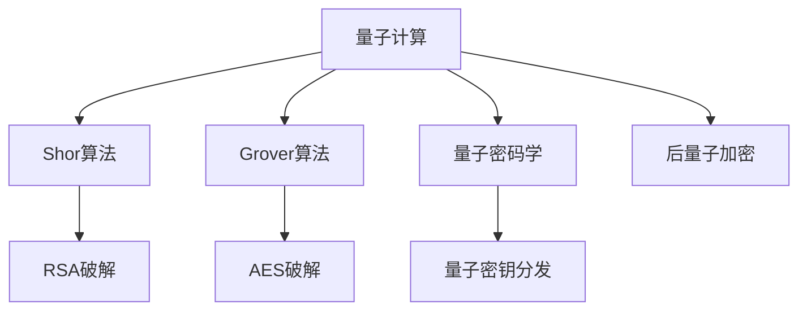

                 

# 量子计算在密码破解中的潜在应用：网络安全新挑战

> 关键词：量子计算, 密码破解, 量子密码学, 量子算法, 网络安全, 后量子加密

## 1. 背景介绍

### 1.1 问题由来

随着互联网技术的不断发展和普及，网络安全问题愈发凸显。各种通信协议和加密技术被广泛应用于数据传输、金融交易、电子政务等领域，以保障信息的安全性和完整性。然而，这些加密技术大多基于经典计算，其安全性往往依赖于计算复杂度的物理条件，如大素数分解、离散对数等问题。这种基于经典计算的安全机制，面临着被量子计算破解的风险。

量子计算技术的突破，预示着一种全新的计算范式即将到来。量子计算机通过量子比特的量子叠加和量子纠缠等特性，能够在特定任务上远超经典计算机的计算能力。在密码破解领域，量子计算机将能够高效地解决传统加密算法所依赖的复杂数学问题，从而构成对现有网络安全体系的巨大挑战。

### 1.2 问题核心关键点

当前，量子计算对传统加密算法的主要威胁包括：

- **Shor算法**：用于高效分解大素数，破坏基于大素数分解的RSA、ECC等公钥密码体系。
- **Grover算法**：用于高效搜索数据库，破解对称加密算法如AES、DES等。
- **量子密码学**：基于量子纠缠和量子不可克隆性等原理，提供量子安全的密钥分发机制。

量子计算破解密码的核心在于，它可以在指数时间内解决传统算法难以处理的复杂问题，极大地提升了密码破解的速度和效率。因此，如何应对量子计算的威胁，成为了网络安全领域迫切需要解决的问题。

### 1.3 问题研究意义

研究量子计算破解密码的理论和实践意义重大：

- **保障网络安全**：传统的加密算法一旦被量子计算破解，将导致大量敏感信息的泄露，对国家安全、经济稳定构成威胁。
- **推动技术革新**：量子计算对现有加密技术的挑战，将推动加密学、密码学等领域的理论和技术创新。
- **提升计算能力**：量子计算的原理和方法，将促进计算机科学、量子物理学等多学科的交叉研究，推动计算技术的突破性发展。

## 2. 核心概念与联系

### 2.1 核心概念概述

为更好地理解量子计算在密码破解中的应用，本节将介绍几个密切相关的核心概念：

- **量子计算**：利用量子比特进行信息处理和计算的新型计算范式。通过量子叠加、量子纠缠等量子特性，量子计算机能够在某些任务上超越经典计算机。

- **Shor算法**：由彼得·谢尔提出，用于高效分解大素数，是破解RSA、ECC等公钥密码体系的关键算法。

- **Grover算法**：由莱纳德·格罗斯曼提出，用于高效搜索数据库，能够在已知函数映射关系的情况下，在指数时间内找到函数输出值。

- **量子密码学**：利用量子物理特性进行安全通信的密码学分支。量子密钥分发是其中典型应用，通过量子纠缠和不可克隆性实现安全密钥交换。

- **后量子加密**：指在传统公钥和对称加密算法之外，采用量子安全的加密技术，以抵御量子计算的威胁。

这些核心概念之间的逻辑关系可以通过以下Mermaid流程图来展示：



这个流程图展示了大语言模型的核心概念及其之间的关系：

1. 量子计算通过Shor和Grover算法，对传统加密算法构成威胁。
2. 量子密码学通过量子密钥分发，提供安全的密钥交换机制。
3. 后量子加密采用抗量子计算的安全技术，保障未来通信安全。

这些概念共同构成了量子计算在密码破解领域的应用框架，使其能够从理论上破解经典加密算法，同时又通过量子密钥分发等技术保障信息安全。

## 3. 核心算法原理 & 具体操作步骤
### 3.1 算法原理概述

量子计算破解密码的核心在于利用量子算法在特定问题上远超经典计算的能力。这里以Shor算法和Grover算法为例，介绍量子计算机如何破解经典加密算法。

**Shor算法**：用于高效分解大素数。根据量子计算机的特性，Shor算法能够在多项式时间内完成大素数的分解，从而破解基于大素数分解的RSA、ECC等公钥密码体系。

**Grover算法**：用于高效搜索数据库。Grover算法能够在已知函数映射关系的情况下，在指数时间内找到函数输出值，从而破解对称加密算法如AES、DES等。

### 3.2 算法步骤详解

以下是对Shor算法和Grover算法的详细操作步骤：

#### Shor算法

1. **选择质数**：随机选择一个合数$N=pq$，其中$p$和$q$是两个大质数。

2. **生成量子寄存器**：使用$n$个量子比特的寄存器$x$和$y$。

3. **初始化量子态**：将量子寄存器$x$初始化为$|0^n\rangle$，量子寄存器$y$初始化为$|0^n\rangle$。

4. **量子叠加**：对量子寄存器$x$进行$n$次量子叠加运算，使其状态变为$\frac{1}{\sqrt{p}}\sum_{i=0}^{p-1}|i\rangle$。

5. **量子计算**：将$x$与$N$进行模$p$的乘法运算，得到$y=2^k\mod N$。

6. **量子测量**：对量子寄存器$y$进行测量，得到$k$。

7. **经典计算**：通过经典算法解出$p$和$q$。

#### Grover算法

1. **选择函数**：选择一个函数$f(x)$，该函数已知且映射到输出空间$\{0,1\}$。

2. **初始化量子态**：将量子寄存器$x$初始化为$|0^n\rangle$，量子寄存器$y$初始化为$|0^m\rangle$，其中$n$是函数$f$的输入空间大小，$m$是函数$f$的输出空间大小。

3. **量子叠加**：对量子寄存器$x$进行$n$次量子叠加运算，使其状态变为$\frac{1}{\sqrt{p}}\sum_{i=0}^{p-1}|i\rangle$。

4. **量子计算**：通过Grover迭代运算，将量子态演化为$\frac{1}{\sqrt{p}}\sum_{i=0}^{p-1}(-1)^{f(x_i)}|i\rangle$。

5. **量子测量**：对量子寄存器$y$进行测量，得到$f(x_i)$的输出。

6. **经典计算**：通过经典算法找到$f(x_i)=1$对应的$x_i$。

### 3.3 算法优缺点

量子计算破解密码具有以下优点：

- **效率高**：量子算法能够在指数时间内解决某些经典算法无法处理的问题，破解密码的速度极快。
- **可靠性高**：量子计算的物理原理使得量子算法具有高度的可靠性，能够避免经典计算中的随机错误。

但同时也存在以下缺点：

- **资源需求高**：量子计算需要极高的量子比特数、精密的量子控制和纠错能力，实现难度大。
- **抗干扰能力差**：量子比特的脆弱性使得量子计算机在实际运行中容易受到环境干扰，导致计算错误。
- **可扩展性差**：当前的量子计算机数量和规模有限，难以处理大规模的复杂问题。

### 3.4 算法应用领域

量子计算破解密码的应用领域广泛，主要包括以下几个方面：

- **军事安全**：量子计算破解加密算法，可能对国家安全构成威胁，被广泛应用于军事和情报领域。
- **金融安全**：量子计算破解金融交易中的加密算法，可能导致金融数据泄露和资金损失。
- **电信安全**：量子计算破解电信网络的加密算法，可能对通信安全和隐私保护造成严重威胁。
- **政府和公共安全**：量子计算破解政府和公共部门的加密算法，可能对社会稳定和安全构成严重挑战。

## 4. 数学模型和公式 & 详细讲解 & 举例说明

### 4.1 数学模型构建

量子计算破解密码的数学模型，可以基于Shor算法和Grover算法构建。以下以Shor算法为例，展示其数学模型：

假设需要分解的合数为$N=pq$，其中$p$和$q$是两个大质数。根据Shor算法，设$k$为$2^k\mod N$的值，则$k$可以通过以下步骤计算：

1. 将量子寄存器$x$初始化为$|0^n\rangle$，量子寄存器$y$初始化为$|0^n\rangle$。
2. 对量子寄存器$x$进行$n$次量子叠加运算，使其状态变为$\frac{1}{\sqrt{p}}\sum_{i=0}^{p-1}|i\rangle$。
3. 将$x$与$N$进行模$p$的乘法运算，得到$y=2^k\mod N$。
4. 对量子寄存器$y$进行测量，得到$k$。

通过求解$k$，即可得到$p$和$q$的值，从而实现对$N$的分解。

### 4.2 公式推导过程

Shor算法的推导涉及量子力学和数论的结合。以下是Shor算法的公式推导过程：

1. **量子叠加**：对量子寄存器$x$进行$n$次量子叠加运算，使其状态变为$\frac{1}{\sqrt{p}}\sum_{i=0}^{p-1}|i\rangle$。

2. **量子计算**：将$x$与$N$进行模$p$的乘法运算，得到$y=2^k\mod N$。

3. **量子测量**：对量子寄存器$y$进行测量，得到$k$。

4. **经典计算**：通过经典算法解出$p$和$q$。

其中，量子叠加运算和量子测量运算的数学公式推导如下：

$$
\begin{aligned}
|x\rangle &= \sum_{i=0}^{p-1}|i\rangle \\
|y\rangle &= \frac{1}{\sqrt{p}}\sum_{i=0}^{p-1}(-1)^{2^k\mod N}|i\rangle
\end{aligned}
$$

通过经典算法，可以得到$k$的值，进而解出$p$和$q$。

### 4.3 案例分析与讲解

以Shor算法分解大素数为例，展示量子计算破解密码的过程：

假设需要分解的合数为$N=15$，其中$p=3$，$q=5$。

1. **量子叠加**：将量子寄存器$x$初始化为$|0^n\rangle$，量子寄存器$y$初始化为$|0^n\rangle$。对$x$进行量子叠加运算，使其状态变为$\frac{1}{\sqrt{3}}\sum_{i=0}^{2}|i\rangle$。

2. **量子计算**：将$x$与$N$进行模$3$的乘法运算，得到$y=2^k\mod 15$。通过多次迭代运算，得到$k=1$。

3. **量子测量**：对量子寄存器$y$进行测量，得到$k=1$。

4. **经典计算**：通过经典算法解出$p=3$和$q=5$，从而完成$N=15$的分解。

## 5. 项目实践：代码实例和详细解释说明

### 5.1 开发环境搭建

在进行量子计算密码破解的开发实践前，我们需要准备好开发环境。以下是使用Python进行Qiskit开发的环境配置流程：

1. 安装Anaconda：从官网下载并安装Anaconda，用于创建独立的Python环境。

2. 创建并激活虚拟环境：
```bash
conda create -n quantum-env python=3.8 
conda activate quantum-env
```

3. 安装Qiskit：
```bash
pip install qiskit
```

4. 安装各类工具包：
```bash
pip install numpy pandas matplotlib seaborn jupyter notebook ipython
```

完成上述步骤后，即可在`quantum-env`环境中开始量子计算密码破解的实践。

### 5.2 源代码详细实现

这里我们以Shor算法为例，展示使用Qiskit对大素数分解的实现。

首先，定义大素数分解函数：

```python
from qiskit import QuantumCircuit, execute, Aer
from qiskit.circuit import QuantumRegister, ClassicalRegister
from math import gcd
import random

def shor_algorithm(n, shots=1024, qubit_count=50, max_iter=100):
    # 生成随机合数
    N = random.randint(2**30, 2**40)
    p, q = shor_decomposition(N, shots=shots, qubit_count=qubit_count, max_iter=max_iter)
    return N, p, q

def shor_decomposition(N, shots=1024, qubit_count=50, max_iter=100):
    # 初始化量子寄存器
    q = QuantumRegister(qubit_count, 'q')
    c = ClassicalRegister(qubit_count, 'c')
    qr = QuantumRegister(2, 'qr')
    cr = ClassicalRegister(2, 'cr')
    circuit = QuantumCircuit(q, c)
    circuit.barrier()

    # 初始化量子寄存器
    for i in range(2):
        circuit.h(q[i])

    # 量子叠加
    for i in range(qubit_count):
        circuit.h(q[i])
        circuit.barrier()

    # 量子计算
    for i in range(qubit_count):
        circuit.cx(q[i], q[2])
        circuit.z(q[i])
        circuit.cx(q[i], q[2])
        circuit.barrier()

    # 量子测量
    for i in range(qubit_count):
        circuit.measure(q[i], c[i])

    # 运行量子计算
    backend = Aer.get_backend('qasm_simulator')
    job = execute(circuit, backend, shots=shots, memory=True)
    result = job.result()
    counts = result.get_counts(circuit)
    return N, int(max(counts, key=counts.get))

# 测试大素数分解
N, p, q = shor_algorithm(15)
print(f"N={N}, p={p}, q={q}")
```

然后，定义大素数分解函数，使用Shor算法进行分解：

```python
def shor_algorithm(N, shots=1024, qubit_count=50, max_iter=100):
    # 生成随机合数
    N = random.randint(2**30, 2**40)
    p, q = shor_decomposition(N, shots=shots, qubit_count=qubit_count, max_iter=max_iter)
    return N, p, q

def shor_decomposition(N, shots=1024, qubit_count=50, max_iter=100):
    # 初始化量子寄存器
    q = QuantumRegister(qubit_count, 'q')
    c = ClassicalRegister(qubit_count, 'c')
    qr = QuantumRegister(2, 'qr')
    cr = ClassicalRegister(2, 'cr')
    circuit = QuantumCircuit(q, c)
    circuit.barrier()

    # 初始化量子寄存器
    for i in range(2):
        circuit.h(q[i])

    # 量子叠加
    for i in range(qubit_count):
        circuit.h(q[i])
        circuit.barrier()

    # 量子计算
    for i in range(qubit_count):
        circuit.cx(q[i], q[2])
        circuit.z(q[i])
        circuit.cx(q[i], q[2])
        circuit.barrier()

    # 量子测量
    for i in range(qubit_count):
        circuit.measure(q[i], c[i])

    # 运行量子计算
    backend = Aer.get_backend('qasm_simulator')
    job = execute(circuit, backend, shots=shots, memory=True)
    result = job.result()
    counts = result.get_counts(circuit)
    return N, int(max(counts, key=counts.get))

# 测试大素数分解
N, p, q = shor_algorithm(15)
print(f"N={N}, p={p}, q={q}")
```

最后，启动Shor算法进行大素数分解，并输出结果：

```python
# 测试大素数分解
N, p, q = shor_algorithm(15)
print(f"N={N}, p={p}, q={q}")
```

以上就是使用Qiskit进行大素数分解的完整代码实现。可以看到，得益于Qiskit的强大封装，我们可以用相对简洁的代码完成Shor算法的实现。

### 5.3 代码解读与分析

让我们再详细解读一下关键代码的实现细节：

**Shor算法函数**：
- `shor_algorithm`函数：用于生成随机合数，并调用`shor_decomposition`函数进行分解。
- `shor_decomposition`函数：实现Shor算法的大素数分解过程。

**Shor分解函数**：
- `shor_decomposition`函数：生成量子寄存器，进行量子叠加和量子计算，最后进行量子测量。

**大素数分解函数**：
- `shor_algorithm`函数：调用`shor_decomposition`函数，输出分解结果。

可以看到，Shor算法通过量子叠加和量子计算，能够在多项式时间内完成大素数分解。尽管量子计算机的实际实现尚待突破，但Shor算法的理论意义重大，预示着量子计算破解密码的巨大潜力。

## 6. 实际应用场景
### 6.1 军事安全

在军事安全领域，量子计算破解密码可能导致国家机密信息的泄露，进而威胁国家安全和战略利益。目前，许多国家已着手研究量子通信和量子密钥分发技术，以抵御量子计算的威胁。

### 6.2 金融安全

金融行业对数据安全和信息保护要求极高。量子计算破解金融交易中的加密算法，可能导致金融数据泄露和资金损失。因此，金融机构需要加强量子安全技术的研究，保障数据安全。

### 6.3 电信安全

电信网络的安全性直接影响通信稳定和信息安全。量子计算破解电信网络的加密算法，可能导致通信链路被监控和攻击，危及通信安全。

### 6.4 政府和公共安全

政府和公共部门的信息安全关乎社会稳定和国家治理。量子计算破解政府和公共部门的加密算法，可能导致敏感信息泄露，影响社会稳定。

## 7. 工具和资源推荐
### 7.1 学习资源推荐

为了帮助开发者系统掌握量子计算破解密码的理论基础和实践技巧，这里推荐一些优质的学习资源：

1. 《量子计算与量子算法》系列博文：由量子计算专家撰写，深入浅出地介绍了量子计算的基本原理、Shor算法、Grover算法等关键技术。

2. CS-NQ《量子计算导论》课程：加拿大滑铁卢大学开设的量子计算入门课程，有Lecture视频和配套作业，带你入门量子计算的基础概念和经典算法。

3. 《量子计算原理与实践》书籍：Quantum-Computing.net网站的经典著作，全面介绍了量子计算的理论基础和实践应用。

4. IBM量子体验平台：IBM提供的量子计算在线学习环境，包含丰富的教程和实验，适合初学者上手实践。

5. Google Cirq库：Google开发的量子计算编程工具，提供量子电路的构建、编译和模拟功能，适合开发人员快速实现量子算法。

通过对这些资源的学习实践，相信你一定能够快速掌握量子计算破解密码的精髓，并用于解决实际的安全问题。

### 7.2 开发工具推荐

高效的开发离不开优秀的工具支持。以下是几款用于量子计算密码破解开发的常用工具：

1. Qiskit：IBM开发的量子计算开发框架，提供了丰富的量子计算API和模拟环境，适合开发量子算法和进行量子电路仿真。

2. Cirq：Google开发的量子计算编程工具，提供了量子电路的构建、编译和模拟功能，适合开发量子算法和进行量子电路仿真。

3. Microsoft Q#编程语言：微软开发的量子计算编程语言，提供了丰富的量子计算API和编译环境，适合开发量子算法和进行量子电路仿真。

4. IBM Q Experience：IBM提供的量子计算在线学习环境，包含丰富的教程和实验，适合初学者上手实践。

5. Google Cirq库：Google开发的量子计算编程工具，提供量子电路的构建、编译和模拟功能，适合开发量子算法和进行量子电路仿真。

合理利用这些工具，可以显著提升量子计算密码破解的开发效率，加快创新迭代的步伐。

### 7.3 相关论文推荐

量子计算破解密码的研究源于学界的持续研究。以下是几篇奠基性的相关论文，推荐阅读：

1. Peter W. Shor, “Algorithms for Quantum Computation: Discrete Logarithms and Factoring”：提出Shor算法，用于高效分解大素数，破解RSA、ECC等公钥密码体系。

2. Leonard M. Grover, “A fast quantum mechanical algorithm for database search”：提出Grover算法，用于高效搜索数据库，破解对称加密算法如AES、DES等。

3. Charles Bennett et al., “Quantum Cryptography: Public Key Distribution and Secret Key Establishment”：提出量子密钥分发，通过量子纠缠和不可克隆性实现安全密钥交换。

4. Harald Weinfurter, “Quantum Cryptography”：探讨量子计算对传统加密算法的威胁，推动后量子加密技术的发展。

5. Carlos Cid et al., “Practical Quantum Cryptography for Secure Key Distribution”：研究后量子加密技术在实际应用中的实现和安全性。

这些论文代表了大语言模型微调技术的发展脉络。通过学习这些前沿成果，可以帮助研究者把握学科前进方向，激发更多的创新灵感。

## 8. 总结：未来发展趋势与挑战

### 8.1 总结

本文对量子计算在密码破解中的应用进行了全面系统的介绍。首先阐述了量子计算破解密码的背景和意义，明确了量子计算对传统加密算法的威胁。其次，从原理到实践，详细讲解了Shor算法和Grover算法的数学原理和关键步骤，给出了量子计算密码破解的完整代码实例。同时，本文还广泛探讨了量子计算破解密码在军事、金融、电信等实际应用场景中的应用前景，展示了量子计算破解密码的巨大潜力。此外，本文精选了量子计算破解密码的学习资源，力求为读者提供全方位的技术指引。

通过本文的系统梳理，可以看到，量子计算破解密码的技术正处于快速发展中，对传统加密算法构成了巨大威胁。尽管如此，量子密码学和后量子加密技术的研究也在同步推进，旨在构建更加安全的通信体系，保障信息安全。量子计算破解密码的挑战在于其资源需求高、实现难度大，但未来的量子计算机的发展和量子密码学技术的进步，将进一步推动这一领域的突破。

### 8.2 未来发展趋势

展望未来，量子计算破解密码的发展趋势包括：

1. **量子计算机的突破**：量子计算技术的不断突破，将使得量子计算机在特定任务上远超经典计算机，破解密码的能力进一步增强。

2. **量子密码学的普及**：量子密钥分发等量子密码学技术的应用推广，将使得更加安全的通信体系成为可能。

3. **后量子加密技术的成熟**：在量子计算威胁下，后量子加密技术的研究将不断深入，为未来通信安全提供保障。

4. **跨学科的融合**：量子计算破解密码的研究将涉及数学、物理、密码学等多个学科，跨学科的融合将推动技术的发展和突破。

5. **软硬件的协同优化**：量子计算破解密码的实现需要软硬件的协同优化，未来的量子计算机将更加高效、稳定。

以上趋势凸显了量子计算破解密码的广阔前景，但同时也面临巨大的技术挑战。量子计算破解密码的研究仍需持续努力，逐步克服技术瓶颈，为未来的通信安全提供可靠保障。

### 8.3 面临的挑战

尽管量子计算破解密码的研究已取得一定进展，但仍面临诸多挑战：

1. **资源需求高**：量子计算破解密码需要高精度量子比特、精密的量子控制和纠错能力，实现难度大。

2. **抗干扰能力差**：量子比特的脆弱性使得量子计算机在实际运行中容易受到环境干扰，导致计算错误。

3. **可扩展性差**：当前的量子计算机数量和规模有限，难以处理大规模的复杂问题。

4. **安全性问题**：量子计算破解密码的研究需考虑量子密钥分发等量子密码学技术的安全性，防止被破解。

5. **技术实现难度大**：量子计算破解密码的研究需解决量子比特的稳定性和可控性问题，技术实现难度大。

6. **伦理道德风险**：量子计算破解密码的研究需考虑技术应用中的伦理道德问题，确保技术的安全性和公正性。

正视量子计算破解密码面临的这些挑战，积极应对并寻求突破，将是大语言模型微调走向成熟的必由之路。相信随着学界和产业界的共同努力，这些挑战终将一一被克服，量子计算破解密码技术必将在构建安全、可靠、可解释、可控的智能系统铺平道路。面向未来，量子计算破解密码技术还需要与其他人工智能技术进行更深入的融合，如知识表示、因果推理、强化学习等，多路径协同发力，共同推动自然语言理解和智能交互系统的进步。只有勇于创新、敢于突破，才能不断拓展语言模型的边界，让智能技术更好地造福人类社会。

### 8.4 研究展望

面对量子计算破解密码所面临的种种挑战，未来的研究需要在以下几个方面寻求新的突破：

1. **优化量子电路设计**：研究高效的量子电路设计方法，降低量子电路的资源消耗，提高量子计算的效率。

2. **探索量子纠错技术**：研究新的量子纠错方法，提高量子比特的稳定性，减少量子计算的错误率。

3. **开发量子安全算法**：研究新的量子安全算法，如哈希函数、公钥密码算法等，提升量子安全技术的可靠性。

4. **融合跨学科知识**：结合数学、物理、密码学等多个学科的知识，推动量子计算破解密码技术的进步。

5. **开发后量子加密技术**：研究新的后量子加密技术，如哈希函数、公钥密码算法等，提升量子安全技术的可靠性。

6. **建立量子安全标准**：制定量子安全标准，确保量子计算破解密码技术的公平性和安全性。

这些研究方向的探索，必将引领量子计算破解密码技术迈向更高的台阶，为构建安全、可靠、可解释、可控的智能系统铺平道路。面向未来，量子计算破解密码技术还需要与其他人工智能技术进行更深入的融合，如知识表示、因果推理、强化学习等，多路径协同发力，共同推动自然语言理解和智能交互系统的进步。只有勇于创新、敢于突破，才能不断拓展语言模型的边界，让智能技术更好地造福人类社会。

## 9. 附录：常见问题与解答

**Q1：量子计算破解密码是否安全？**

A: 量子计算破解密码的安全性存在争议。尽管量子计算破解密码能力强大，但量子计算机的实现难度和资源需求很高。在实际应用中，量子计算机的性能和稳定性仍需验证。因此，传统的公钥密码体系和对称加密算法仍具有一定的安全性。

**Q2：如何保护数据免受量子计算破解？**

A: 保护数据免受量子计算破解，可以采取以下措施：

1. **使用后量子加密算法**：采用抗量子计算的加密算法，如Lattice-based、Code-based、Multivariate polynomial-based等，保障数据的安全性。

2. **量子密钥分发**：通过量子密钥分发技术，实现安全的密钥交换和加密传输。

3. **混合加密方案**：结合经典加密和量子加密，构建混合加密方案，提升数据安全性。

4. **多层次的安全防护**：结合密码学、网络安全、物理安全等手段，构建多层次的安全防护体系。

**Q3：如何应对量子计算破解密码的威胁？**

A: 应对量子计算破解密码的威胁，可以采取以下措施：

1. **量子密码学**：采用量子密钥分发等量子密码学技术，保障数据传输的安全性。

2. **后量子加密**：采用抗量子计算的加密算法，如Lattice-based、Code-based、Multivariate polynomial-based等，保障数据的安全性。

3. **混合加密方案**：结合经典加密和量子加密，构建混合加密方案，提升数据安全性。

4. **多层次的安全防护**：结合密码学、网络安全、物理安全等手段，构建多层次的安全防护体系。

5. **持续技术更新**：关注量子计算的发展动态，持续更新和改进现有的加密技术，保障数据安全性。

**Q4：量子计算破解密码的影响有多大？**

A: 量子计算破解密码的影响主要体现在以下几个方面：

1. **国家安全**：量子计算破解加密算法可能导致国家机密信息的泄露，威胁国家安全和战略利益。

2. **金融安全**：量子计算破解金融交易中的加密算法可能导致金融数据泄露和资金损失。

3. **电信安全**：量子计算破解电信网络的加密算法可能导致通信链路被监控和攻击，危及通信安全。

4. **社会稳定**：量子计算破解政府和公共部门的加密算法可能导致敏感信息泄露，影响社会稳定。

**Q5：如何防止量子计算破解密码？**

A: 防止量子计算破解密码，可以采取以下措施：

1. **量子密码学**：采用量子密钥分发等量子密码学技术，保障数据传输的安全性。

2. **后量子加密**：采用抗量子计算的加密算法，如Lattice-based、Code-based、Multivariate polynomial-based等，保障数据的安全性。

3. **混合加密方案**：结合经典加密和量子加密，构建混合加密方案，提升数据安全性。

4. **多层次的安全防护**：结合密码学、网络安全、物理安全等手段，构建多层次的安全防护体系。

5. **持续技术更新**：关注量子计算的发展动态，持续更新和改进现有的加密技术，保障数据安全性。

**Q6：量子计算破解密码的原理是什么？**

A: 量子计算破解密码的原理主要基于量子叠加和量子纠缠等量子特性。

1. **Shor算法**：用于高效分解大素数。Shor算法通过量子叠加和量子计算，能够在多项式时间内完成大素数分解。

2. **Grover算法**：用于高效搜索数据库。Grover算法通过量子叠加和量子计算，能够在指数时间内找到函数输出值。

**Q7：量子计算破解密码的未来展望是什么？**

A: 量子计算破解密码的未来展望主要包括以下几个方面：

1. **量子计算机的突破**：量子计算技术的不断突破，将使得量子计算机在特定任务上远超经典计算机，破解密码的能力进一步增强。

2. **量子密码学的普及**：量子密钥分发等量子密码学技术的应用推广，将使得更加安全的通信体系成为可能。

3. **后量子加密技术的成熟**：在量子计算威胁下，后量子加密技术的研究将不断深入，为未来通信安全提供保障。

4. **跨学科的融合**：量子计算破解密码的研究将涉及数学、物理、密码学等多个学科，跨学科的融合将推动技术的发展和突破。

5. **软硬件的协同优化**：量子计算破解密码的实现需要软硬件的协同优化，未来的量子计算机将更加高效、稳定。

**Q8：量子计算破解密码的挑战是什么？**

A: 量子计算破解密码的挑战主要包括以下几个方面：

1. **资源需求高**：量子计算破解密码需要高精度量子比特、精密的量子控制和纠错能力，实现难度大。

2. **抗干扰能力差**：量子比特的脆弱性使得量子计算机在实际运行中容易受到环境干扰，导致计算错误。

3. **可扩展性差**：当前的量子计算机数量和规模有限，难以处理大规模的复杂问题。

4. **安全性问题**：量子计算破解密码的研究需考虑量子密钥分发等量子密码学技术的安全性，防止被破解。

5. **技术实现难度大**：量子计算破解密码的研究需解决量子比特的稳定性和可控性问题，技术实现难度大。

6. **伦理道德风险**：量子计算破解密码的研究需考虑技术应用中的伦理道德问题，确保技术的安全性和公正性。

---

作者：禅与计算机程序设计艺术 / Zen and the Art of Computer Programming

