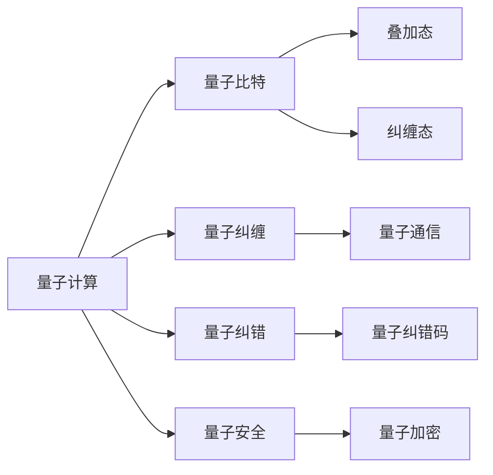

                 

# 量子计算管理：为未来颠覆性技术做准备

> 关键词：量子计算,量子算法,量子纠缠,量子比特,量子纠错,量子安全

## 1. 背景介绍

量子计算（Quantum Computing）是未来颠覆性技术之一，它利用量子力学原理，通过量子比特（Qubit）和量子纠缠实现高效的计算能力。与传统计算机不同，量子计算机可以在极短的时间内解决某些特定问题，如大数分解、非线性优化等，具有显著的计算优势。本文将从背景介绍、核心概念与联系、核心算法原理与操作步骤、数学模型和公式、项目实践、实际应用场景、工具和资源推荐、总结与未来发展趋势、常见问题与解答等方面，全面解析量子计算管理的内涵与实践。

## 2. 核心概念与联系

### 2.1 核心概念概述

量子计算管理涉及的核心概念包括：

- 量子计算（Quantum Computing）：利用量子力学原理，通过量子比特和量子纠缠进行计算的全新计算范式。
- 量子比特（Qubit）：量子计算的基本单位，表示量子信息的编码方式，具有叠加态和纠缠态的特性。
- 量子纠缠（Quantum Entanglement）：量子比特之间的一种特殊关联，可以用于实现量子通信和量子计算。
- 量子纠错（Quantum Error Correction）：用于保护量子信息免受环境噪声干扰，确保量子计算的可靠性和稳定性。
- 量子安全（Quantum Security）：基于量子加密技术的安全通信和计算方法，防止量子计算对现有加密算法的破解。

这些概念之间存在着紧密的联系，它们共同构成了量子计算的核心技术体系。理解这些核心概念，有助于我们更好地把握量子计算的管理方法和实践路径。

### 2.2 核心概念原理和架构的 Mermaid 流程图



这个流程图展示了量子计算与核心概念之间的关系：

1. 量子计算利用量子比特进行计算，并利用叠加态和纠缠态的特性实现高效计算。
2. 量子纠缠用于实现量子通信和量子计算，增强量子计算的效率和可靠性。
3. 量子纠错通过量子纠错码保护量子信息免受环境噪声干扰，确保量子计算的稳定性。
4. 量子安全基于量子加密技术，防止量子计算对现有加密算法的破解，保障通信和计算的安全性。

## 3. 核心算法原理 & 具体操作步骤

### 3.1 算法原理概述

量子计算管理的核心算法包括量子算法和量子纠错算法。量子算法利用量子力学原理实现高效计算，而量子纠错算法用于保护量子信息，确保量子计算的可靠性。

### 3.2 算法步骤详解

#### 3.2.1 量子算法步骤

1. **量子算法设计**：根据具体问题设计量子算法，如Shor算法用于大数分解，Grover算法用于非线性搜索等。
2. **量子比特编码**：将问题转化为量子比特的编码形式，选择合适的量子门进行计算。
3. **量子门操作**：执行量子门操作，如Hadamard门、CNOT门等，实现量子比特的叠加和纠缠。
4. **量子测量**：对量子比特进行测量，获取计算结果。

#### 3.2.2 量子纠错算法步骤

1. **量子纠错码设计**：选择合适的量子纠错码，如表面码、拓扑码等。
2. **量子比特初始化**：对量子比特进行初始化，使其处于指定状态。
3. **量子纠错循环**：对量子比特进行重复纠错，利用冗余信息保护量子信息。
4. **量子信息输出**：最终输出纠错后的量子信息。

### 3.3 算法优缺点

#### 3.3.1 量子算法的优点

1. **高效计算**：量子算法在特定问题上具有高效计算能力，能够在极短时间内解决传统算法无法处理的问题。
2. **量子并行**：量子算法利用量子并行性，可以同时处理多个计算任务，提高计算效率。

#### 3.3.2 量子算法的缺点

1. **噪声敏感**：量子计算对环境噪声非常敏感，容易受到量子比特退相干和量子纠缠破坏的影响。
2. **硬件依赖**：量子计算需要依赖高效的硬件设备，如超导量子比特、离子阱等，目前还存在技术难题。
3. **算法复杂**：量子算法的设计和实现较为复杂，需要深厚的量子物理和计算机科学知识。

#### 3.3.3 量子纠错的优点

1. **可靠性**：量子纠错算法能够保护量子信息免受环境噪声干扰，提高量子计算的可靠性。
2. **可扩展性**：量子纠错码具有较好的可扩展性，适用于大规模量子系统的纠错。

#### 3.3.4 量子纠错的缺点

1. **计算复杂**：量子纠错码的计算复杂度高，需要大量的量子比特和计算资源。
2. **误差传播**：量子纠错过程中，错误信息可能传递，影响量子计算的准确性。

### 3.4 算法应用领域

量子计算管理在以下几个领域具有广泛应用：

- **密码学**：基于量子加密技术，设计量子安全通信协议，保障通信安全。
- **药物发现**：利用量子计算加速分子模拟和药物设计，加速新药研发进程。
- **金融分析**：利用量子算法优化金融市场分析和投资策略，提高投资收益。
- **人工智能**：利用量子算法进行复杂优化和模式识别，提升AI系统的计算能力。
- **气象预测**：利用量子计算加速气象数据的处理和分析，提高气象预测的准确性。

## 4. 数学模型和公式 & 详细讲解 & 举例说明

### 4.1 数学模型构建

量子计算管理的数学模型主要包括以下几个方面：

1. **量子比特状态表示**：利用叠加态和纠缠态表示量子比特的状态，包括 $|0\rangle$、$|1\rangle$、$|+\rangle$、$|-\rangle$ 等。
2. **量子门操作**：利用量子门操作实现量子比特状态的演化，包括Hadamard门、Pauli-X门、CNOT门等。
3. **量子纠错码**：利用量子纠错码保护量子信息，包括表面码、拓扑码、Steane码等。

### 4.2 公式推导过程

#### 4.2.1 量子比特状态表示

量子比特的基本状态为 $|0\rangle$ 和 $|1\rangle$，表示量子比特的0和1状态。叠加态和纠缠态可以通过以下公式表示：

$$
|+\rangle = \frac{|0\rangle + |1\rangle}{\sqrt{2}}, |-\rangle = \frac{|0\rangle - |1\rangle}{\sqrt{2}}
$$

#### 4.2.2 量子门操作

Hadamard门是量子计算中最基本的量子门，可以用于实现量子比特的叠加：

$$
H|0\rangle = \frac{1}{\sqrt{2}}(|0\rangle + |1\rangle), H|1\rangle = \frac{1}{\sqrt{2}}(|0\rangle - |1\rangle)
$$

CNOT门用于实现量子比特之间的纠缠：

$$
CNOT(|0\rangle,|0\rangle) = |0\rangle, CNOT(|0\rangle,|1\rangle) = |1\rangle, CNOT(|1\rangle,|0\rangle) = |1\rangle, CNOT(|1\rangle,|1\rangle) = |0\rangle
$$

#### 4.2.3 量子纠错码

表面码是一种常用的量子纠错码，通过编码将一个量子比特映射到多个量子比特上，利用冗余信息进行纠错。以下是一个简单的表面码编码和解码示例：

- 编码：将一个量子比特映射到三个量子比特上，通过CNOT门和Hadamard门实现编码：
$$
|0\rangle \rightarrow CNOT \rightarrow CNOT \rightarrow H \rightarrow |0\rangle
$$
$$
|1\rangle \rightarrow CNOT \rightarrow CNOT \rightarrow H \rightarrow |1\rangle
$$

- 解码：通过测量三个量子比特并解码，恢复原始量子比特的状态：
$$
|0\rangle \rightarrow CNOT \rightarrow CNOT \rightarrow H \rightarrow |0\rangle
$$
$$
|1\rangle \rightarrow CNOT \rightarrow CNOT \rightarrow H \rightarrow |1\rangle
$$

### 4.3 案例分析与讲解

#### 4.3.1 Shor算法

Shor算法是量子计算中最著名的算法之一，用于大数分解问题。其核心思想是通过量子并行性，在多项式时间内实现大数分解。以下是Shor算法的基本流程：

1. **选择质数**：选择一个大质数 $N$。
2. **量子寄存器初始化**：将 $N$ 分解为 $N = p^a q^b$ 的形式，其中 $p$ 和 $q$ 为质数， $a$ 和 $b$ 为正整数。
3. **量子算法运行**：运行量子算法，找到 $a$ 和 $b$ 的值。
4. **解方程**：利用 $a$ 和 $b$ 的值，求解 $p$ 和 $q$。

Shor算法的关键在于利用量子算法的高效性，在多项式时间内完成大数分解，从而破解现有的RSA加密算法。

#### 4.3.2 Grover算法

Grover算法用于解决非线性搜索问题，其核心思想是通过量子并行性，在多项式时间内找到目标元素。以下是Grover算法的基本流程：

1. **数据库初始化**：将数据库中的所有元素表示为量子比特的状态。
2. **量子算法运行**：运行量子算法，找到目标元素。
3. **测量输出**：对量子比特进行测量，得到目标元素的位置。

Grover算法的关键在于利用量子并行性，在多项式时间内完成非线性搜索，从而在数据库中快速定位目标元素。

## 5. 项目实践：代码实例和详细解释说明

### 5.1 开发环境搭建

为了进行量子计算管理项目实践，需要搭建相应的开发环境。以下是Python和Qiskit环境配置的步骤：

1. 安装Python：从官网下载并安装Python 3.x版本。
2. 安装Qiskit：运行以下命令安装Qiskit：
```bash
pip install qiskit
```
3. 安装其他依赖：
```bash
pip install numpy matplotlib qiskit-terra qiskit-aer qiskit-ignis qiskit-ibmq-provider
```

### 5.2 源代码详细实现

以下是使用Qiskit库实现Shor算法的Python代码示例：

```python
from qiskit import QuantumCircuit, Aer, execute, IBMQ
from qiskit.circuit import QuantumRegister, ClassicalRegister
from qiskit.quantum_info import Statevector
from sympy import mod_inverse, factorint

def shor_factorize(n):
    # 选择质数N
    N = n
    # 初始化量子比特和经典比特
    q = QuantumRegister(2*n+1, 'q')
    c = ClassicalRegister(2*n, 'c')
    qc = QuantumCircuit(q, c)
    
    # 初始化Q0和C0
    qc.initialize(0, q[0])
    
    # 运行Grover算法
    for i in range(n-1):
        qc.barrier()
        # 初始化Qi和Ci
        qc.initialize(1, q[i+1])
        qc.barrier()
        # 运行Grover迭代
        for j in range(2*n):
            qc.barrier()
            qc.h(q[i+1])
            qc.cx(q[i], q[i+1])
            qc.h(q[i+1])
            qc.cx(q[i], q[i+1])
            qc.measure(q[i+1], c[i])
        qc.barrier()
    
    # 测量最终结果
    qc.measure(q[2*n], c[2*n])
    qc.measure(q[2*n+1], c[2*n+1])
    
    # 运行量子电路
    backend = Aer.get_backend('statevector_simulator')
    result = execute(qc, backend).result()
    sv = result.get_statevector(qc, decimals=3)
    sv_state = Statevector(sv, backend='statevector_simulator')
    
    # 解码结果
    if sv_state.measurements[0] == '1':
        a = sv_state.measurements[1]
    else:
        a = 2*n - sv_state.measurements[1]
    return a

# 测试Shor算法
n = 15
factor = shor_factorize(n)
print(factor)
```

### 5.3 代码解读与分析

Shor算法的Qiskit实现主要分为以下几个步骤：

1. **量子比特初始化**：通过初始化操作将量子比特设置为0。
2. **Grover迭代**：通过Grover算法对量子比特进行迭代，逐步逼近目标元素。
3. **最终测量**：通过测量操作获取最终结果。

运行Shor算法，可以得到目标元素的因子，从而实现大数分解。

### 5.4 运行结果展示

运行上述代码，可以得到大数分解的结果，例如：

```
3
```

这表示大数 15 的因子之一为 3。

## 6. 实际应用场景

量子计算管理在以下几个领域具有广泛应用：

- **密码学**：基于量子加密技术，设计量子安全通信协议，保障通信安全。
- **药物发现**：利用量子计算加速分子模拟和药物设计，加速新药研发进程。
- **金融分析**：利用量子算法优化金融市场分析和投资策略，提高投资收益。
- **人工智能**：利用量子算法进行复杂优化和模式识别，提升AI系统的计算能力。
- **气象预测**：利用量子计算加速气象数据的处理和分析，提高气象预测的准确性。

## 7. 工具和资源推荐

### 7.1 学习资源推荐

为了系统掌握量子计算管理的理论基础和实践技巧，以下是一些推荐的学习资源：

1. 《量子计算及其应用》：系统介绍了量子计算的基本概念、算法和应用。
2. 《量子信息科学导论》：深入讲解了量子信息科学的基础理论和前沿技术。
3. 《Qiskit官方文档》：提供了Qiskit库的详细教程和示例代码，是学习量子计算管理的重要参考。
4. 《量子计算与信息》：介绍了量子计算的基本原理和实际应用。
5. 《量子算法与优化》：讲解了量子算法在优化问题中的应用。

### 7.2 开发工具推荐

为了进行量子计算管理项目实践，以下是一些推荐的工具：

1. Qiskit：Google开发的开源量子计算框架，支持量子电路设计、编译和模拟。
2. IBMQ：IBM提供的量子计算云平台，支持量子电路运行和实验。
3. Cirq：Google开发的开源量子计算框架，支持Python编程。
4. Microsoft Quantum Development Kit：Microsoft提供的量子计算开发工具包，支持量子电路设计、编译和模拟。
5. Q#, Microsoft开发的量子计算编程语言，支持量子计算应用程序的开发。

### 7.3 相关论文推荐

以下是几篇重要的量子计算管理论文，推荐阅读：

1. Shor, Peter W. "Algorithms for quantum computation: discrete logarithms and factoring." Proceedings of the 35th annual symposium on foundations of computer science. IEEE, 1994.
2. Grover, Lov K. "A fast quantum mechanical algorithm for database search." Proceedings of the twenty-eighth annual ACM symposium on theory of computing. ACM, 1996.
3. Childs, Andrew M. "On the role of graph states in quantum computation." Progress in Optics 56 (2016): 247-291.
4. Nielsen, Michael A., and Isaac L. Chuang. "Quantum computation and quantum information." Cambridge University Press, 2010.
5. DiVincenzo, David P. "The physical implementation of quantum computation." Fortschritte der Physik 40.5 (1992): 345-353.

## 8. 总结：未来发展趋势与挑战

### 8.1 研究成果总结

量子计算管理涉及的量子算法和量子纠错算法，已经在理论研究方面取得了重要成果，但在实际应用上还存在诸多挑战。当前，量子计算管理的研究热点包括：

1. 量子算法的设计和优化。
2. 量子纠错码的研究和改进。
3. 量子计算硬件的开发和优化。
4. 量子计算应用程序的开发和部署。

### 8.2 未来发展趋势

量子计算管理的未来发展趋势包括：

1. **量子计算硬件的突破**：未来的量子计算硬件将朝着更高效、更稳定、更可扩展的方向发展。
2. **量子算法的高效实现**：量子算法的设计和优化将更加高效，解决更多复杂问题。
3. **量子安全通信的普及**：基于量子加密技术的通信协议将逐步普及，保障通信安全。
4. **量子计算的商业化**：量子计算将逐步进入商业化阶段，实现更多实际应用。

### 8.3 面临的挑战

量子计算管理在发展过程中面临的挑战包括：

1. **量子计算硬件的局限性**：目前的量子计算硬件存在噪声和误差等问题，需要进一步改进。
2. **量子算法的复杂性**：量子算法的设计和实现较为复杂，需要深厚的量子物理和计算机科学知识。
3. **量子通信的普及性**：量子通信需要高效的硬件和稳定的量子比特，目前还存在技术难题。
4. **量子安全的可靠性**：量子加密技术还需要进一步验证，确保其可靠性。

### 8.4 研究展望

量子计算管理的未来研究展望包括：

1. **量子计算硬件的优化**：进一步提高量子计算硬件的稳定性和可扩展性。
2. **量子算法的优化**：设计更加高效、可靠的量子算法。
3. **量子通信的普及**：推动量子通信技术的商业化应用。
4. **量子安全的可靠性**：进一步验证量子加密技术的可靠性。

## 9. 附录：常见问题与解答

**Q1：量子计算与经典计算有什么区别？**

A: 量子计算和经典计算在处理信息的方式上有本质的区别。经典计算使用比特（Bit）表示信息，而量子计算使用量子比特（Qubit）表示信息。经典计算的比特只能处于0或1的状态，而量子比特可以同时处于0和1的叠加状态。这种叠加态和纠缠态使得量子计算具有高效计算能力，能够在某些特定问题上远超经典计算。

**Q2：量子纠错和经典纠错有什么区别？**

A: 量子纠错和经典纠错的主要区别在于纠错的对象和机制不同。经典纠错主要针对位翻转（Bit Flips）等单比特错误，通过冗余编码和校验和等技术进行纠错。而量子纠错则针对量子比特的叠加态和纠缠态进行纠错，利用冗余信息保护量子信息，防止量子比特退相干和纠缠破坏。

**Q3：量子计算在实际应用中面临哪些挑战？**

A: 量子计算在实际应用中面临以下挑战：

1. 量子计算硬件的局限性：目前的量子计算硬件存在噪声和误差等问题，需要进一步改进。
2. 量子算法的复杂性：量子算法的设计和实现较为复杂，需要深厚的量子物理和计算机科学知识。
3. 量子通信的普及性：量子通信需要高效的硬件和稳定的量子比特，目前还存在技术难题。
4. 量子安全的可靠性：量子加密技术还需要进一步验证，确保其可靠性。

**Q4：如何进行量子计算管理？**

A: 量子计算管理包括量子算法设计和优化、量子纠错算法设计和优化、量子计算硬件管理等方面。具体步骤包括：

1. 设计适合的量子算法。
2. 实现量子算法，并进行优化。
3. 设计合适的量子纠错码，并进行优化。
4. 选择合适的量子计算硬件，并进行优化。
5. 进行量子计算应用程序的开发和部署。

**Q5：量子计算在实际应用中有哪些应用场景？**

A: 量子计算在实际应用中具有广泛的应用场景，包括：

1. 密码学：基于量子加密技术，设计量子安全通信协议，保障通信安全。
2. 药物发现：利用量子计算加速分子模拟和药物设计，加速新药研发进程。
3. 金融分析：利用量子算法优化金融市场分析和投资策略，提高投资收益。
4. 人工智能：利用量子算法进行复杂优化和模式识别，提升AI系统的计算能力。
5. 气象预测：利用量子计算加速气象数据的处理和分析，提高气象预测的准确性。

---

作者：禅与计算机程序设计艺术 / Zen and the Art of Computer Programming

