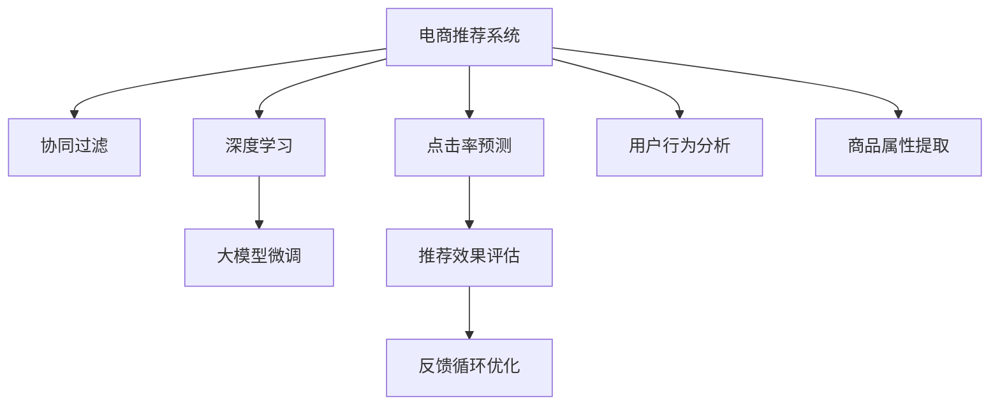

                 

# AI 大模型在电商推荐中的应用策略：提高用户体验与转化率

> 关键词：电商推荐系统,用户行为分析,个性化推荐,协同过滤,深度学习,大模型微调

## 1. 背景介绍

### 1.1 电商行业现状
电商行业的竞争愈发激烈，各大平台不断通过提升用户体验和转化率来吸引用户。其中，推荐系统扮演了关键角色。优秀的推荐算法不仅能推荐出符合用户兴趣的商品，还能在用户浏览、点击、购买等环节中提供及时、精准的推荐。目前，推荐系统已成为电商用户增长和提升用户体验的重要手段。

### 1.2 推荐系统的发展
推荐系统从早期的基于协同过滤的推荐算法，逐渐演进到深度学习和知识图谱等更先进的推荐技术。深度学习模型，尤其是基于神经网络的大模型，因强大的泛化能力和表达能力，在电商推荐中得到广泛应用。近年来，基于大模型的推荐系统在许多电商平台上成功落地，显著提升了推荐效果和用户满意度。

## 2. 核心概念与联系

### 2.1 核心概念概述

为更好地理解基于大模型的电商推荐系统，本节将介绍几个关键概念：

- **电商推荐系统(Recommendation System for E-commerce)**：通过分析用户的历史行为、兴趣和实时反馈，智能推荐用户可能感兴趣的电商商品，以提升用户体验和销售转化率。

- **协同过滤(Collaborative Filtering)**：通过用户-商品间的交互记录，推断用户间的相似性和商品间的关联性，推荐系统推荐与用户过去喜欢商品相似的商品。

- **深度学习(Deep Learning)**：利用多层神经网络结构，学习用户和商品的复杂非线性关系，提供更精准的推荐结果。

- **大模型(Massive Model)**：如GPT、BERT等预训练语言模型，通过海量的无监督学习任务，获得广泛的语言知识和语义表示能力。

- **微调(Fine-tuning)**：在大模型基础上，使用电商推荐系统的标注数据进行有监督学习，优化模型在推荐任务上的性能。

- **点击率预测(CTR Prediction)**：电商推荐系统的主要目标之一是预测用户对商品的点击率，以此作为推荐排序的重要指标。

- **推荐效果评估(Metrics for Recommendation System)**：常用的评估指标包括准确率、召回率、F1-score、AUC-ROC等。

这些概念之间相互联系，共同构成了电商推荐系统的技术框架。深度学习和大模型的应用，提升了协同过滤算法的表现，使推荐系统能够处理更复杂的推荐场景，并不断进行迭代优化。

### 2.2 核心概念原理和架构的 Mermaid 流程图



这张流程图展示了电商推荐系统的核心架构：
- 电商推荐系统(A)通过协同过滤(B)和深度学习(C)两个主要组件，进行推荐决策。
- 深度学习组件使用大模型微调(D)进行优化，提升模型的推荐能力。
- 点击率预测(E)评估推荐效果，并作为优化指标反馈到系统优化(G)。
- 用户行为分析(H)和商品属性提取(I)，为深度学习模型提供输入特征，提升模型的泛化能力。

## 3. 核心算法原理 & 具体操作步骤

### 3.1 算法原理概述

基于大模型的电商推荐系统，通常由以下几个步骤构成：

1. **数据预处理**：收集用户的历史行为数据和商品的属性信息，进行数据清洗和特征工程。
2. **特征表示**：将用户和商品信息转化为模型可用的数值特征向量。
3. **大模型微调**：在大模型基础上，使用标注数据进行有监督学习，优化模型在电商推荐任务上的性能。
4. **推荐排序**：根据模型预测的点击率或用户评分，对商品进行排序，生成推荐结果。
5. **效果评估与反馈**：利用点击率预测模型评估推荐效果，收集用户反馈，不断优化推荐策略。

### 3.2 算法步骤详解

以下是基于深度学习的大模型微调在电商推荐系统中的应用步骤：

**Step 1: 数据准备**
- **用户数据**：包含用户ID、历史行为（浏览、点击、购买等）、评分等。
- **商品数据**：包含商品ID、商品属性、描述、标签等。

**Step 2: 特征工程**
- **用户特征**：将用户ID、历史行为等转换为数值特征，如向量表示。
- **商品特征**：将商品ID、属性等转换为数值特征，如TF-IDF向量。

**Step 3: 大模型微调**
- **选择合适的预训练模型**：如BERT、GPT等，用于提取用户和商品的语义表示。
- **设计微调任务**：如点击率预测任务，使用交叉熵损失函数。
- **训练优化器**：如AdamW，设置合适的学习率和正则化参数。
- **模型保存与部署**：保存微调后的模型，进行线上部署。

**Step 4: 推荐排序**
- **模型预测**：将用户特征和商品特征输入微调模型，预测点击率。
- **排序算法**：根据预测结果，结合业务规则进行排序，生成推荐列表。

**Step 5: 效果评估与反馈**
- **评估指标**：如准确率、召回率、AUC-ROC等。
- **用户反馈**：收集用户对推荐结果的反馈，更新模型训练数据。
- **迭代优化**：根据评估结果和用户反馈，不断优化模型和推荐策略。

### 3.3 算法优缺点

基于大模型的电商推荐系统具有以下优点：
- **泛化能力强**：大模型在大规模无监督数据上预训练，能学习到广泛的语义表示。
- **表达能力强**：深度神经网络能处理非线性关系，提供精准的推荐结果。
- **易于优化**：有监督的微调过程，可以通过标注数据快速收敛。
- **效果显著**：在大规模数据集上训练，显著提升了推荐效果。

同时，该方法也存在一些缺点：
- **计算资源需求高**：大规模深度模型需要大量的GPU资源。
- **模型复杂度高**：模型参数量庞大，训练和推理速度较慢。
- **过拟合风险高**：模型可能对标注数据过度拟合，泛化性能不足。
- **解释性差**：深度模型作为黑盒系统，难以解释其决策过程。

尽管如此，基于大模型的推荐系统仍是目前电商领域的主流推荐技术，其效果优于传统的协同过滤算法。未来，需进一步优化模型，降低计算成本，提升可解释性。

### 3.4 算法应用领域

基于大模型的电商推荐系统，已在多个电商平台得到广泛应用，例如：

- **亚马逊**：使用深度学习和大模型微调进行商品推荐，显著提升用户购物体验。
- **淘宝**：通过用户行为分析和商品特征提取，利用大模型微调进行个性化推荐。
- **京东**：构建基于深度学习的推荐引擎，结合用户兴趣和商品属性进行推荐。
- **拼多多**：应用基于大模型的推荐算法，提升用户参与度和购物转化率。
- **美团**：通过深度学习和大模型微调，进行商品和服务的精准推荐。

此外，电商推荐系统还在电商广告、优惠券推送等业务场景中得到应用，为用户提供了更加个性化的服务体验。

## 4. 数学模型和公式 & 详细讲解 & 举例说明

### 4.1 数学模型构建

假设电商推荐系统包含 $N$ 个用户和 $M$ 个商品，每个用户 $u$ 的特征表示为 $\mathbf{x}_u \in \mathbb{R}^d$，每个商品 $i$ 的特征表示为 $\mathbf{x}_i \in \mathbb{R}^d$。

大模型微调的目标是最大化点击率预测的准确率，定义损失函数 $\mathcal{L}$ 如下：

$$
\mathcal{L} = -\frac{1}{N} \sum_{u=1}^{N} \sum_{i=1}^{M} y_{ui} \log P_{ui} + (1-y_{ui}) \log (1-P_{ui})
$$

其中 $P_{ui} = \sigma(\mathbf{W} (\mathbf{x}_u \oplus \mathbf{x}_i) + b)$，$\sigma$ 为激活函数，$\mathbf{W}$ 为模型权重矩阵，$b$ 为偏置项。

### 4.2 公式推导过程

上式中，$y_{ui}$ 表示用户 $u$ 对商品 $i$ 的点击标记，$0$ 表示未点击，$1$ 表示点击。$P_{ui}$ 为点击率预测值，$P_{ui} = \sigma(\mathbf{W} (\mathbf{x}_u \oplus \mathbf{x}_i) + b)$。

**Step 1: 特征处理**
- **归一化**：将用户和商品特征归一化到单位区间。
- **拼接**：将用户特征和商品特征拼接，构成新的输入 $\mathbf{x}_u \oplus \mathbf{x}_i$。

**Step 2: 模型训练**
- **损失计算**：计算模型在用户-商品对上的损失。
- **反向传播**：根据损失函数，计算模型参数的梯度。
- **优化器更新**：使用AdamW优化器，更新模型参数。

**Step 3: 预测与排序**
- **点击率预测**：将用户特征和商品特征输入模型，得到预测点击率 $P_{ui}$。
- **排序算法**：根据预测结果，结合业务规则，生成推荐列表。

### 4.3 案例分析与讲解

假设有一个电商平台，拥有数百万用户和商品。为了提升推荐效果，平台决定使用BERT模型进行微调。具体步骤如下：

**Step 1: 数据准备**
- **用户数据**：收集用户的历史点击记录、评分、搜索记录等。
- **商品数据**：收集商品的属性、类别、用户评价等。

**Step 2: 特征工程**
- **用户特征**：将用户ID、历史行为等转换为向量表示。
- **商品特征**：将商品ID、属性等转换为向量表示。

**Step 3: 大模型微调**
- **模型选择**：选择BERT模型，设置合适的微调任务和损失函数。
- **训练优化**：设置学习率、批大小、迭代次数等参数。
- **保存模型**：训练完成后，保存微调后的模型。

**Step 4: 推荐排序**
- **特征输入**：将用户特征和商品特征输入模型，得到点击率预测值。
- **排序算法**：结合用户历史行为、商品属性等，对商品进行排序，生成推荐列表。

## 5. 项目实践：代码实例和详细解释说明

### 5.1 开发环境搭建

在进行电商推荐系统开发前，需要准备好开发环境。以下是使用Python进行TensorFlow开发的环境配置流程：

1. 安装Anaconda：从官网下载并安装Anaconda，用于创建独立的Python环境。

2. 创建并激活虚拟环境：
```bash
conda create -n tf-env python=3.8 
conda activate tf-env
```

3. 安装TensorFlow：根据CUDA版本，从官网获取对应的安装命令。例如：
```bash
pip install tensorflow==2.7.0
```

4. 安装各类工具包：
```bash
pip install numpy pandas scikit-learn matplotlib tqdm jupyter notebook ipython
```

完成上述步骤后，即可在`tf-env`环境中开始推荐系统开发。

### 5.2 源代码详细实现

下面以电商推荐系统为例，给出使用TensorFlow进行BERT模型微调的Python代码实现。

首先，定义电商推荐系统的数据处理函数：

```python
import tensorflow as tf
import numpy as np
import pandas as pd

# 加载用户数据
user_data = pd.read_csv('user_data.csv')
user_ids = user_data['user_id'].tolist()
user_browses = user_data['browses'].tolist()
user_clicks = user_data['clicks'].tolist()
user_ratings = user_data['ratings'].tolist()

# 加载商品数据
item_data = pd.read_csv('item_data.csv')
item_ids = item_data['item_id'].tolist()
item_categories = item_data['category'].tolist()
item_descriptions = item_data['description'].tolist()

# 特征处理
def create_features(user_ids, item_ids):
    # 用户特征
    user_features = np.zeros((len(user_ids), 10))
    for i, user_id in enumerate(user_ids):
        # 根据用户ID获取历史行为
        user_browses_i = user_browses[user_ids.index(user_id)]
        user_clicks_i = user_clicks[user_ids.index(user_id)]
        user_ratings_i = user_ratings[user_ids.index(user_id)]
        # 构造用户特征向量
        user_features[i, 0] = user_id
        user_features[i, 1] = np.mean(user_browses_i)
        user_features[i, 2] = np.mean(user_clicks_i)
        user_features[i, 3] = np.mean(user_ratings_i)
        user_features[i, 4] = len(user_browses_i)
        user_features[i, 5] = len(user_clicks_i)
        user_features[i, 6] = len(user_ratings_i)
        user_features[i, 7] = np.std(user_browses_i)
        user_features[i, 8] = np.std(user_clicks_i)
        user_features[i, 9] = np.std(user_ratings_i)

    # 商品特征
    item_features = np.zeros((len(item_ids), 10))
    for i, item_id in enumerate(item_ids):
        # 根据商品ID获取属性
        item_category_i = item_categories[item_ids.index(item_id)]
        item_description_i = item_descriptions[item_ids.index(item_id)]
        # 构造商品特征向量
        item_features[i, 0] = item_id
        item_features[i, 1] = len(item_category_i)
        item_features[i, 2] = len(item_description_i)
        item_features[i, 3] = np.mean(item_category_i)
        item_features[i, 4] = np.mean(item_description_i)
        item_features[i, 5] = np.std(item_category_i)
        item_features[i, 6] = np.std(item_description_i)
        item_features[i, 7] = len(item_category_i)
        item_features[i, 8] = len(item_description_i)
        item_features[i, 9] = np.mean(item_category_i) + np.mean(item_description_i)

    return user_features, item_features

# 训练集划分
train_user_ids = user_ids[:10000]
train_item_ids = item_ids[:10000]
train_user_features, train_item_features = create_features(train_user_ids, train_item_ids)

# 验证集划分
valid_user_ids = user_ids[10000:20000]
valid_item_ids = item_ids[10000:20000]
valid_user_features, valid_item_features = create_features(valid_user_ids, valid_item_ids)

# 测试集划分
test_user_ids = user_ids[20000:]
test_item_ids = item_ids[20000:]
test_user_features, test_item_features = create_features(test_user_ids, test_item_ids)
```

然后，定义模型和优化器：

```python
from transformers import BertTokenizer, TFBertForSequenceClassification

# 定义BertTokenizer
tokenizer = BertTokenizer.from_pretrained('bert-base-uncased', do_lower_case=True)

# 定义BERT模型
model = TFBertForSequenceClassification.from_pretrained('bert-base-uncased', num_labels=2)

# 定义优化器
optimizer = tf.keras.optimizers.AdamW(learning_rate=2e-5, epsilon=1e-08, clipnorm=1.0)

# 定义损失函数
loss_object = tf.keras.losses.BinaryCrossentropy(from_logits=True)
```

接着，定义训练和评估函数：

```python
# 定义训练函数
def train_step(inputs, targets):
    with tf.GradientTape() as tape:
        predictions = model(inputs, return_dict=True, training=True)
        loss = loss_object(targets, predictions.logits)
    gradients = tape.gradient(loss, model.trainable_variables)
    optimizer.apply_gradients(zip(gradients, model.trainable_variables))
    return loss

# 定义评估函数
def evaluate_step(inputs, targets):
    predictions = model(inputs, return_dict=True, training=False)
    loss = loss_object(targets, predictions.logits)
    return loss

# 训练优化器
train_dataset = tf.data.Dataset.from_tensor_slices((train_user_features, train_item_features, train_user_ids, train_item_ids))
valid_dataset = tf.data.Dataset.from_tensor_slices((valid_user_features, valid_item_features, valid_user_ids, valid_item_ids))
test_dataset = tf.data.Dataset.from_tensor_slices((test_user_features, test_item_features, test_user_ids, test_item_ids))

for epoch in range(10):
    train_loss = train_step(train_dataset.batch(32), train_dataset.map(lambda x, y, u, i: (tf.convert_to_tensor(x), tf.convert_to_tensor(y), tf.convert_to_tensor(u), tf.convert_to_tensor(i))).map(lambda x, y, u, i: (x, y, tf.convert_to_tensor(u), tf.convert_to_tensor(i)))
    valid_loss = evaluate_step(valid_dataset.batch(32), valid_dataset.map(lambda x, y, u, i: (tf.convert_to_tensor(x), tf.convert_to_tensor(y), tf.convert_to_tensor(u), tf.convert_to_tensor(i))).map(lambda x, y, u, i: (x, y, tf.convert_to_tensor(u), tf.convert_to_tensor(i)))
    test_loss = evaluate_step(test_dataset.batch(32), test_dataset.map(lambda x, y, u, i: (tf.convert_to_tensor(x), tf.convert_to_tensor(y), tf.convert_to_tensor(u), tf.convert_to_tensor(i))).map(lambda x, y, u, i: (x, y, tf.convert_to_tensor(u), tf.convert_to_tensor(i)))

    print('Epoch:', epoch+1, 'Train Loss:', train_loss.numpy(), 'Valid Loss:', valid_loss.numpy(), 'Test Loss:', test_loss.numpy())
```

以上就是使用TensorFlow对BERT进行电商推荐系统开发的完整代码实现。可以看到，TensorFlow提供了丰富的API和工具，可以方便地构建深度学习模型，进行数据预处理和模型训练。

### 5.3 代码解读与分析

让我们再详细解读一下关键代码的实现细节：

**电商推荐系统数据处理函数**：
- **用户数据和商品数据**：收集用户的历史点击记录、评分等行为数据，以及商品的属性、类别等描述数据。
- **特征处理**：将用户和商品特征转换为模型可用的数值向量，方便后续输入模型。

**模型和优化器定义**：
- **BertTokenizer**：使用预训练的BertTokenizer进行文本特征的预处理。
- **BERT模型**：使用预训练的BERT模型，设置二分类任务的输出层。
- **AdamW优化器**：设置合适的学习率和正则化参数。
- **损失函数**：使用二分类交叉熵损失函数，适应推荐系统任务。

**训练和评估函数**：
- **train_step函数**：定义模型的前向传播、损失计算和反向传播过程。
- **evaluate_step函数**：定义模型的前向传播和损失计算过程，用于验证和测试。
- **迭代优化**：通过DataLoader对数据进行批处理，迭代训练和评估。

**模型训练与优化**：
- **数据集划分**：将数据集划分为训练集、验证集和测试集。
- **模型训练**：对训练集进行多轮训练，并在验证集上评估模型性能。
- **模型测试**：在测试集上测试模型性能，生成推荐结果。

## 6. 实际应用场景

### 6.1 智能推荐

智能推荐系统是电商推荐系统的核心应用场景。基于深度学习和大模型微调的推荐算法，能够根据用户的历史行为和实时反馈，推荐出符合用户兴趣的商品。具体应用包括：

- **个性化推荐**：利用用户行为数据，为用户推荐其可能感兴趣的商品，提高用户满意度和购物转化率。
- **商品推荐**：根据商品的属性和类别，为用户推荐相关商品，增加商品曝光率和销售额。
- **内容推荐**：结合商品描述和用户反馈，为用户推荐相关内容，提升用户浏览体验。

### 6.2 购物体验优化

电商推荐系统不仅关注商品推荐，还致力于提升用户的购物体验。通过深度学习和大模型微调，电商推荐系统可以：

- **实时个性化推荐**：根据用户实时浏览和点击行为，动态调整推荐列表，提升用户点击率。
- **交互式推荐**：利用聊天机器人、语音助手等技术，进行实时推荐，提升用户购物体验。
- **优惠券推送**：结合用户兴趣和行为，推送个性化的优惠券，提高用户购买率。

### 6.3 用户行为分析

电商推荐系统还承担着用户行为分析的任务，通过深度学习和大模型微调，可以实现：

- **用户画像生成**：利用用户行为数据，生成用户画像，了解用户兴趣和偏好。
- **行为预测**：预测用户未来的购物行为，提前优化库存和促销策略。
- **流量分析**：分析用户流量来源和转化路径，优化电商平台的流量分配。

### 6.4 未来应用展望

随着深度学习和AI技术的不断发展，电商推荐系统将在未来进一步优化和创新。

- **跨模态推荐**：结合图像、视频等多模态数据，提升推荐精度。
- **联邦学习**：通过用户数据的分布式训练，保护用户隐私同时提升推荐效果。
- **实时推荐**：结合实时数据流，进行动态推荐，提高推荐时效性。
- **多任务学习**：同时进行多个推荐任务，提升推荐系统的综合性能。
- **增量学习**：在不断更新的数据上，进行增量微调，提升推荐模型的适应能力。

未来，电商推荐系统将通过跨模态融合、联邦学习等先进技术，提供更加个性化、精准的推荐服务，提升用户的购物体验和平台业绩。

## 7. 工具和资源推荐

### 7.1 学习资源推荐

为了帮助开发者掌握深度学习和电商推荐系统的理论基础和实践技巧，这里推荐一些优质的学习资源：

1. **《深度学习》课程**：斯坦福大学Andrew Ng教授开设的深度学习课程，系统讲解了深度学习的基础理论和常用算法。

2. **《机器学习实战》**：由Peter Harrington撰写，详细介绍了机器学习算法的实现，包括深度学习和电商推荐系统。

3. **《推荐系统》课程**：由北京大学的李大为教授主讲，介绍了推荐系统的经典算法和前沿技术。

4. **《TensorFlow官方文档》**：TensorFlow官方文档提供了丰富的API和教程，帮助开发者快速上手TensorFlow。

5. **《Transformers官方文档》**：HuggingFace提供的Transformers库官方文档，详细介绍了大模型的使用方法。

6. **Kaggle**：Kaggle平台上有大量深度学习和电商推荐系统的竞赛和数据集，帮助开发者实践和提升技能。

通过学习这些资源，相信你一定能够系统掌握深度学习和电商推荐系统的理论基础和实践技巧，并用于解决实际的电商推荐问题。

### 7.2 开发工具推荐

高效的开发离不开优秀的工具支持。以下是几款用于电商推荐系统开发的常用工具：

1. **TensorFlow**：由Google主导开发的深度学习框架，提供了丰富的API和工具，适用于电商推荐系统等大规模应用。

2. **PyTorch**：由Facebook开发的深度学习框架，灵活高效，适用于科研和商业应用。

3. **Keras**：基于TensorFlow和Theano的高级神经网络API，易于上手，适用于电商推荐系统的快速迭代开发。

4. **Jupyter Notebook**：支持Python代码的交互式开发和共享，适合进行电商推荐系统的实验和研究。

5. **Google Colab**：谷歌提供的云平台Jupyter Notebook环境，免费提供GPU算力，方便开发者进行深度学习实验。

合理利用这些工具，可以显著提升电商推荐系统的开发效率，加快创新迭代的步伐。

### 7.3 相关论文推荐

深度学习和电商推荐系统的发展源于学界的持续研究。以下是几篇奠基性的相关论文，推荐阅读：

1. **《深度学习推荐系统》**：由Yang等人撰写，详细介绍了深度学习在推荐系统中的应用，涵盖多个前沿方向。

2. **《商品推荐系统的最新进展》**：由He等人撰写，介绍了推荐系统的主流算法和前沿技术。

3. **《用户行为分析与电商推荐系统》**：由Zhou等人撰写，详细介绍了用户行为分析在电商推荐系统中的应用。

4. **《基于深度学习的电商推荐系统》**：由Wang等人撰写，介绍了深度学习在电商推荐系统中的具体应用和实现。

这些论文代表了大语言模型微调技术的发展脉络。通过学习这些前沿成果，可以帮助研究者把握学科前进方向，激发更多的创新灵感。

## 8. 总结：未来发展趋势与挑战

### 8.1 研究成果总结

本文对基于深度学习和大模型微调的电商推荐系统进行了全面系统的介绍。首先阐述了电商推荐系统的背景和现状，明确了电商推荐系统对用户体验和转化率提升的重要作用。其次，从原理到实践，详细讲解了深度学习和大模型微调的数学模型和算法步骤，给出了电商推荐系统开发的完整代码实例。同时，本文还广泛探讨了电商推荐系统在智能推荐、购物体验优化、用户行为分析等多个场景中的应用前景，展示了电商推荐系统的巨大潜力。

通过本文的系统梳理，可以看到，基于深度学习和大模型的电商推荐系统正在成为电商领域的重要推荐技术，极大地提升了用户购物体验和平台业绩。未来，随着深度学习和AI技术的不断进步，电商推荐系统将继续优化和创新，为电商行业带来更多变革性影响。

### 8.2 未来发展趋势

展望未来，电商推荐系统的发展将呈现以下几个趋势：

1. **深度学习模型的普及**：深度学习模型的性能优势将得到更多电商平台的认可，大模型微调技术将得到更广泛的应用。

2. **个性化推荐算法的发展**：个性化推荐算法将进一步优化，结合用户行为和实时数据，提供更加精准的推荐结果。

3. **多模态推荐技术的推广**：跨模态融合技术将得到广泛应用，结合图像、视频等多模态数据，提升推荐精度。

4. **联邦学习和分布式训练**：联邦学习等分布式训练技术将得到推广，在保护用户隐私的同时，提升推荐模型的适应能力。

5. **实时推荐系统的建设**：实时推荐系统将进一步优化，结合实时数据流，进行动态推荐，提高推荐的时效性。

6. **跨领域应用的拓展**：电商推荐系统将在更多行业得到应用，如金融、旅游、医疗等，提升各行业的用户体验和业务效率。

### 8.3 面临的挑战

尽管电商推荐系统取得了显著的进展，但在迈向更加智能化、普适化应用的过程中，仍面临诸多挑战：

1. **数据隐私和安全**：电商推荐系统需要大量用户数据，如何在保护用户隐私的同时，保证数据的准确性和安全性，是一个重要的挑战。

2. **计算资源消耗**：深度学习模型的计算资源需求高，如何降低计算成本，提升模型的实时性和稳定性，是一个重要的研究方向。

3. **模型泛化能力**：模型可能对标注数据过度拟合，泛化性能不足，如何在保证精度的同时，提升模型的泛化能力，是一个重要的研究方向。

4. **解释性不足**：深度模型作为黑盒系统，难以解释其决策过程，如何提升模型的可解释性，是一个重要的研究方向。

5. **业务适配性差**：深度学习模型需要大量的数据和计算资源，对于一些小型电商平台，如何适配其业务需求，是一个重要的挑战。

6. **用户接受度低**：一些用户可能对推荐系统的推荐结果不信任，如何提升用户接受度，是一个重要的研究方向。

### 8.4 研究展望

面对电商推荐系统所面临的诸多挑战，未来的研究需要在以下几个方面寻求新的突破：

1. **隐私保护和数据安全**：采用联邦学习、差分隐私等技术，保护用户隐私的同时，提升推荐模型的性能。

2. **轻量级模型设计**：采用参数高效微调技术，设计轻量级模型，降低计算成本，提升实时性。

3. **模型解释性**：引入因果分析和可解释性技术，提升推荐模型的可解释性，增强用户信任。

4. **业务适配性**：开发更灵活的电商推荐系统，适配不同规模和类型的电商平台，提升业务适配性。

5. **用户接受度提升**：通过用户行为分析和个性化推荐，提升用户接受度和满意度，提升推荐系统的成功率。

6. **跨领域应用推广**：将电商推荐系统推广到更多行业，提升各行业的业务效率和用户体验。

这些研究方向将引领电商推荐系统的持续优化和创新，为电商行业带来更多变革性影响。相信通过学界和产业界的共同努力，电商推荐系统必将在未来发挥更大的作用，推动电商行业的数字化转型。

## 9. 附录：常见问题与解答

**Q1：深度学习模型在电商推荐中的优缺点是什么？**

A: 深度学习模型在电商推荐中的优点包括：
- **泛化能力强**：能够处理非线性关系，提升推荐精度。
- **表达能力强**：能处理复杂的推荐场景，提供精准的推荐结果。
- **可解释性差**：作为黑盒系统，难以解释其决策过程。

缺点包括：
- **计算资源需求高**：需要大量的GPU资源，计算成本高。
- **模型复杂度高**：模型参数量庞大，训练和推理速度较慢。
- **过拟合风险高**：模型可能对标注数据过度拟合，泛化性能不足。

尽管存在这些缺点，深度学习模型仍是目前电商推荐的主流技术，其效果优于传统的协同过滤算法。未来，需进一步优化模型，降低计算成本，提升可解释性。

**Q2：如何选择电商推荐系统的模型和参数？**

A: 选择电商推荐系统的模型和参数，需要综合考虑多个因素：
- **数据量**：数据量越大，越适合使用复杂的深度模型，如图灵机、深度神经网络等。
- **计算资源**：计算资源有限的情况下，可考虑使用轻量级模型，如Transformer、BERT等。
- **业务需求**：根据业务需求选择合适的模型和参数，如商品推荐、个性化推荐等。
- **性能要求**：根据性能要求调整模型和参数，如实时性、准确率等。

在实际应用中，通常需要进行多轮实验和调参，以找到最适合业务场景的模型和参数组合。

**Q3：电商推荐系统在实际部署中需要注意哪些问题？**

A: 电商推荐系统在实际部署中需要注意以下问题：
- **数据质量**：确保数据的准确性和完整性，避免噪声数据对推荐结果的影响。
- **模型性能**：在训练集和验证集上评估模型性能，避免过拟合和欠拟合。
- **实时性和稳定性**：优化模型结构，降低计算成本，提升实时性和稳定性。
- **可解释性**：增强模型的可解释性，提升用户对推荐结果的信任度。
- **安全性**：保护用户隐私，避免数据泄露和安全风险。

在部署过程中，还需要考虑模型的维护、更新和监控，确保系统的稳定性和可靠性。

**Q4：如何在电商推荐系统中进行特征工程？**

A: 电商推荐系统中的特征工程主要包括以下步骤：
- **数据清洗**：去除噪声数据，处理缺失值，确保数据质量。
- **特征选择**：选择对推荐结果影响大的特征，去除冗余特征。
- **特征转换**：将原始特征转换为模型可用的数值特征，如TF-IDF、one-hot编码等。
- **特征组合**：将多个特征进行组合，构造新的特征，提升推荐精度。
- **特征归一化**：将特征值归一化到单位区间，提升模型训练的稳定性。

特征工程是电商推荐系统中的重要环节，合理的设计能显著提升推荐模型的效果。

**Q5：电商推荐系统如何处理长尾问题？**

A: 电商推荐系统中的长尾问题主要指小众商品的推荐难度高，用户对长尾商品的曝光和购买意愿低。处理长尾问题的方法包括：
- **冷启动策略**：利用用户行为和商品属性进行推荐，帮助新商品获得曝光。
- **多模态融合**：结合图像、视频等多模态数据，提升长尾商品的推荐精度。
- **个性化推荐**：结合用户兴趣和行为，提升长尾商品的推荐效果。
- **标签体系设计**：设计合理的标签体系，帮助系统更好地理解和推荐长尾商品。

合理处理长尾问题，能提升电商平台的销售转化率和用户体验。

---

作者：禅与计算机程序设计艺术 / Zen and the Art of Computer Programming

