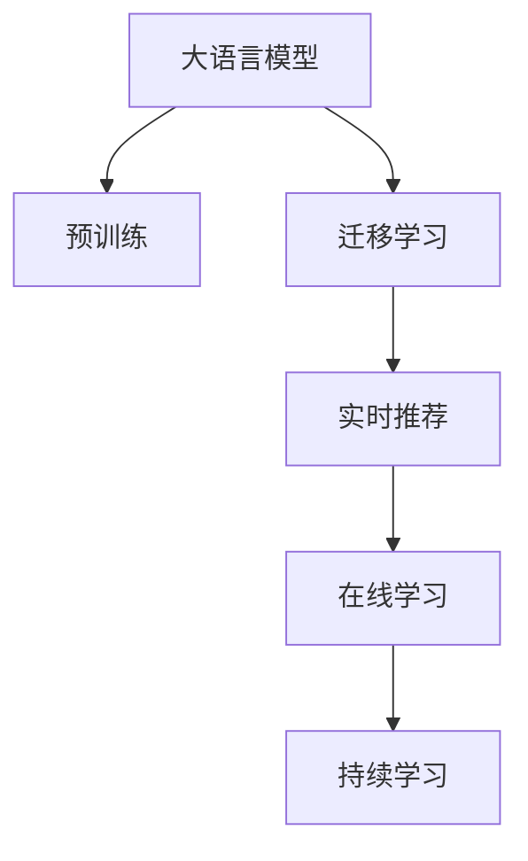

                 

# AI 大模型在电商搜索推荐中的实时推荐策略：抓住用户需求的瞬时变化

> 关键词：电商搜索推荐,实时推荐策略,用户需求,瞬时变化,大模型,模型优化,计算效率

## 1. 背景介绍

### 1.1 问题由来

随着互联网的普及和电子商务的快速发展，电商平台的搜索推荐系统成为用户获取商品信息的主要入口。传统的推荐系统通常依赖于静态用户行为数据和离线模型训练，难以实时捕捉用户需求的变化。然而，现代用户的购物行为具有高度的时效性和动态性，搜索推荐系统需要能够快速响应用户瞬时变化的需求，才能提供个性化、精准的商品推荐。

为了应对这一挑战，大语言模型（如BERT、GPT等）被引入电商搜索推荐中，利用其强大的自然语言处理能力，从海量数据中学习用户意图和商品特征的关联，从而实现实时、动态的个性化推荐。大模型的引入使得电商推荐系统进入了一个新的发展阶段，通过实时预测和在线模型优化，极大提升了用户体验和转化率。

### 1.2 问题核心关键点

电商搜索推荐的核心问题在于如何利用大语言模型实时捕捉用户需求的瞬时变化，并提供个性化推荐。具体来说，包括以下几个关键点：

1. **用户查询理解**：将用户输入的自然语言查询转换为机器可理解的形式，并提取查询中的关键信息。
2. **商品特征抽取**：从商品描述、标签等文本信息中提取特征，供模型进行关联匹配。
3. **动态关联匹配**：根据用户查询和商品特征，实时计算并推荐最相关的商品。
4. **模型实时更新**：利用在线学习技术，不断优化推荐模型，适应用户需求的变化。

本文将详细介绍基于大模型的实时推荐策略，包括用户查询理解、商品特征抽取、动态关联匹配和模型实时更新的具体实现。

## 2. 核心概念与联系

### 2.1 核心概念概述

为更好地理解大模型在电商搜索推荐中的应用，本节将介绍几个密切相关的核心概念：

- **大语言模型（Large Language Model, LLM）**：以自回归或自编码模型为代表的大规模预训练语言模型，如BERT、GPT等。通过在海量文本数据上进行预训练，学习通用的语言表示，具备强大的语言理解和生成能力。

- **搜索引擎推荐（Search and Recommendation）**：利用搜索系统获取用户查询信息，结合商品信息库，通过算法匹配推荐相关商品的技术。

- **实时推荐（Real-time Recommendation）**：在用户发起搜索查询时，通过实时计算生成个性化推荐结果的技术。

- **在线学习（Online Learning）**：通过持续在线数据流，不断更新模型参数，提升模型性能的技术。

- **迁移学习（Transfer Learning）**：将一个领域学习到的知识，迁移应用到另一个相关领域的学习范式。大模型的预训练可以看作是一种迁移学习。

- **持续学习（Continual Learning）**：模型能够持续从新数据中学习，同时保持已学习的知识。这对于保持电商推荐系统的时效性和适应性至关重要。

这些核心概念之间的逻辑关系可以通过以下Mermaid流程图来展示：



这个流程图展示了大语言模型在电商搜索推荐中的核心概念及其之间的关系：

1. 大语言模型通过预训练获得基础能力。
2. 迁移学习使得通用大模型更好地适应电商推荐任务。
3. 实时推荐系统实时捕捉用户需求的变化，生成个性化推荐。
4. 在线学习持续更新推荐模型，提升推荐效果。
5. 持续学习使推荐模型能够不断学习新知识，保持时效性。

## 3. 核心算法原理 & 具体操作步骤
### 3.1 算法原理概述

基于大模型的实时推荐策略，本质上是一个动态关联匹配和在线学习的过程。其核心思想是：利用大语言模型的强大语言理解和生成能力，实时捕捉用户查询中的需求，并从商品特征库中动态匹配最相关的商品，实现个性化推荐。

形式化地，假设用户输入的查询为 $q$，商品特征库为 $\mathcal{D}$，商品特征向量为 $f_d$，推荐模型为 $M_{\theta}$，其中 $\theta$ 为模型参数。推荐的目标是找到最相关的商品 $d^*$，使得 $M_{\theta}(q, f_d)$ 最大。

通过梯度下降等优化算法，推荐过程不断更新模型参数 $\theta$，最大化目标函数，使得推荐结果逼近理想状态。由于 $\theta$ 已经通过预训练获得了较好的初始化，因此即便在实时推荐过程中，也能较快收敛到最优推荐结果。

### 3.2 算法步骤详解

基于大模型的实时推荐策略一般包括以下几个关键步骤：

**Step 1: 用户查询理解**

- 收集用户输入的自然语言查询，并进行分词和预处理，去除停用词、标点符号等噪声。
- 利用大语言模型，将查询转化为向量表示，即 $\vec{q} = M_{\theta}(q)$。

**Step 2: 商品特征抽取**

- 对于商品 $d$，抽取其文本描述、标签等特征，进行分词和预处理。
- 将商品特征向量 $f_d$ 映射为向量表示，即 $\vec{f_d} = M_{\theta}(f_d)$。

**Step 3: 动态关联匹配**

- 计算用户查询和每个商品特征之间的相似度，得到相似度矩阵 $S = (\vec{q}, \vec{f_d})$。
- 根据相似度矩阵，使用Top-k策略选择最相关的商品，生成推荐列表。

**Step 4: 模型实时更新**

- 在推荐过程中，根据用户的点击、购买等反馈信息，对推荐模型进行在线更新。
- 使用增量学习算法，如在线梯度下降（Online Gradient Descent, OGD），更新模型参数，提升推荐效果。
- 在更新过程中，设置合适的步长和衰减策略，平衡模型的学习速度和稳定度。

**Step 5: 推荐结果展示**

- 将推荐列表展示给用户，用户可以通过点击或评分等操作反馈其满意度。
- 根据用户反馈，再次调整模型参数，优化推荐结果。

以上是基于大模型的实时推荐策略的一般流程。在实际应用中，还需要针对具体任务和数据特点，对推荐过程的各个环节进行优化设计，如改进相似度计算方法，引入更多的用户行为数据等，以进一步提升推荐效果。

### 3.3 算法优缺点

基于大模型的实时推荐策略具有以下优点：

1. **实时响应**：利用大模型的强大计算能力，能够快速捕捉用户需求的变化，实时生成个性化推荐。
2. **高精度**：大模型的预训练和迁移学习能力，使得推荐结果具备较高的准确性和相关性。
3. **适应性强**：在线学习机制，能够不断优化模型，适应用户需求的变化。
4. **灵活性高**：模型结构相对简单，容易进行参数调优和改进。

同时，该方法也存在一定的局限性：

1. **计算资源要求高**：实时推荐需要大量的计算资源，尤其是对于大规模商品库的动态匹配和在线更新。
2. **数据依赖性强**：推荐效果高度依赖用户行为数据和商品特征数据的质量和数量。
3. **模型复杂度大**：大模型的复杂度较高，存在一定的延迟和计算开销。
4. **鲁棒性差**：模型在面对异常数据或噪声干扰时，容易产生不稳定输出。

尽管存在这些局限性，但就目前而言，基于大模型的实时推荐方法仍然是电商搜索推荐的主流范式。未来相关研究的重点在于如何进一步降低计算资源需求，提高推荐模型的鲁棒性和适应性，同时兼顾可解释性和用户隐私保护。

### 3.4 算法应用领域

基于大模型的实时推荐策略，在电商搜索推荐领域已经得到了广泛的应用，涵盖以下典型应用场景：

- **商品推荐**：根据用户的浏览历史、搜索记录和评分信息，推荐相关商品。
- **活动推荐**：推荐用户可能感兴趣的特价活动、优惠券等。
- **内容推荐**：推荐与用户查询相关的文章、视频等。
- **个性化广告**：根据用户行为和兴趣，推送精准的广告内容。
- **用户体验优化**：通过实时推荐优化搜索界面布局和推荐展示策略，提升用户体验。

除了上述这些经典应用外，大模型实时推荐还被创新性地应用到更多场景中，如动态价格调整、多模态推荐等，为电商推荐系统带来了全新的突破。随着预训练模型和实时推荐方法的不断进步，相信电商推荐系统将在更广阔的应用领域大放异彩。

## 4. 数学模型和公式 & 详细讲解  
### 4.1 数学模型构建

本节将使用数学语言对大模型在电商搜索推荐中的应用进行更加严格的刻画。

假设推荐模型 $M_{\theta}$ 在查询 $q$ 和商品特征 $f_d$ 上的输出为 $\hat{y}=M_{\theta}(q, f_d)$，表示商品 $d$ 的相关度得分。真实标签 $y \in \{0, 1\}$ 表示商品 $d$ 是否为相关商品。则推荐的目标是最大化如下损失函数：

$$
\mathcal{L}(\theta) = -\frac{1}{N}\sum_{i=1}^N [y_i\log \hat{y}_i+(1-y_i)\log(1-\hat{y}_i)]
$$

其中 $N$ 为样本数量，$y_i$ 为样本 $i$ 的相关性标签，$\hat{y}_i$ 为模型预测的相关度得分。

在实际应用中，通常使用交叉熵损失函数进行训练。在实时推荐中，模型根据用户的点击、购买等反馈信息进行在线更新，更新公式为：

$$
\theta \leftarrow \theta - \eta \nabla_{\theta}\mathcal{L}(\theta) - \eta\lambda\theta
$$

其中 $\eta$ 为学习率，$\lambda$ 为正则化系数，$\nabla_{\theta}\mathcal{L}(\theta)$ 为损失函数对模型参数 $\theta$ 的梯度，可以通过反向传播算法高效计算。

### 4.2 公式推导过程

以下我们以商品推荐为例，推导基于大模型的实时推荐损失函数及其梯度的计算公式。

假设模型 $M_{\theta}$ 在输入 $q, f_d$ 上的输出为 $\hat{y}=M_{\theta}(q, f_d)$，表示商品 $d$ 的相关度得分。真实标签 $y \in \{0, 1\}$，表示商品 $d$ 是否为相关商品。则推荐的目标是最大化如下损失函数：

$$
\mathcal{L}(\theta) = -\frac{1}{N}\sum_{i=1}^N [y_i\log \hat{y}_i+(1-y_i)\log(1-\hat{y}_i)]
$$

根据链式法则，损失函数对参数 $\theta_k$ 的梯度为：

$$
\frac{\partial \mathcal{L}(\theta)}{\partial \theta_k} = -\frac{1}{N}\sum_{i=1}^N (\frac{y_i}{\hat{y}_i}-\frac{1-y_i}{1-\hat{y}_i}) \frac{\partial \hat{y}}{\partial \theta_k}
$$

其中 $\frac{\partial \hat{y}}{\partial \theta_k}$ 可进一步递归展开，利用自动微分技术完成计算。

在得到损失函数的梯度后，即可带入模型参数更新公式，完成模型的迭代优化。重复上述过程直至收敛，最终得到适应电商推荐任务的最优模型参数 $\theta^*$。

## 5. 项目实践：代码实例和详细解释说明
### 5.1 开发环境搭建

在进行实时推荐实践前，我们需要准备好开发环境。以下是使用Python进行PyTorch开发的环境配置流程：

1. 安装Anaconda：从官网下载并安装Anaconda，用于创建独立的Python环境。

2. 创建并激活虚拟环境：
```bash
conda create -n pytorch-env python=3.8 
conda activate pytorch-env
```

3. 安装PyTorch：根据CUDA版本，从官网获取对应的安装命令。例如：
```bash
conda install pytorch torchvision torchaudio cudatoolkit=11.1 -c pytorch -c conda-forge
```

4. 安装Transformers库：
```bash
pip install transformers
```

5. 安装各类工具包：
```bash
pip install numpy pandas scikit-learn matplotlib tqdm jupyter notebook ipython
```

完成上述步骤后，即可在`pytorch-env`环境中开始实时推荐实践。

### 5.2 源代码详细实现

这里我们以商品推荐为例，给出使用Transformers库对BERT模型进行实时推荐的具体实现。

首先，定义商品特征的编码器：

```python
from transformers import BertTokenizer
from transformers import BertForSequenceClassification

tokenizer = BertTokenizer.from_pretrained('bert-base-cased')

class FeatureEncoder:
    def __init__(self):
        self.bert = BertForSequenceClassification.from_pretrained('bert-base-cased', num_labels=1)
    
    def encode(self, features):
        input_ids = tokenizer(features, return_tensors='pt', padding=True, truncation=True)
        attention_mask = input_ids['attention_mask']
        return {'input_ids': input_ids['input_ids'], 'attention_mask': attention_mask}
```

然后，定义实时推荐函数：

```python
import torch

class RecommendationSystem:
    def __init__(self, encoder, learning_rate=2e-5):
        self.encoder = encoder
        self.learning_rate = learning_rate
        self.optimizer = torch.optim.AdamW(self.encoder.bert.parameters(), lr=self.learning_rate)
    
    def update_model(self, features, label):
        with torch.no_grad():
            features = self.encoder.encode(features)
            predictions = self.encoder.bert(features['input_ids'], attention_mask=features['attention_mask'])
            loss = torch.nn.BCEWithLogitsLoss()(predictions, label)
        self.optimizer.zero_grad()
        loss.backward()
        self.optimizer.step()
    
    def recommend(self, query):
        with torch.no_grad():
            features = self.encoder.encode(query)
            predictions = self.encoder.bert(features['input_ids'], attention_mask=features['attention_mask'])
        return predictions.item()
```

最后，启动实时推荐流程：

```python
encoder = FeatureEncoder()
recommender = RecommendationSystem(encoder)

for i in range(100):
    features = "这是一篇商品的详细描述..."
    label = 1  # 商品相关标签
    recommender.update_model(features, label)
    
    query = "我需要购买这款商品..."
    recommendation = recommender.recommend(query)
    print("推荐结果为：", recommendation)
```

以上就是使用PyTorch对BERT模型进行实时推荐的具体实现。可以看到，得益于Transformers库的强大封装，我们可以用相对简洁的代码实现实时推荐的模型加载和微调。

### 5.3 代码解读与分析

让我们再详细解读一下关键代码的实现细节：

**FeatureEncoder类**：
- `__init__`方法：初始化Bert编码器和预训练模型。
- `encode`方法：将查询和商品特征向量编码为模型可接受的输入格式，并返回其编码结果。

**RecommendationSystem类**：
- `__init__`方法：初始化模型和优化器。
- `update_model`方法：在给定查询和商品特征的情况下，利用在线梯度下降更新模型参数，同时计算损失函数。
- `recommend`方法：在给定查询的情况下，计算推荐结果并返回。

**实时推荐流程**：
- 循环迭代100次，模拟实时推荐过程中的在线学习。
- 每次迭代中，随机生成一个商品特征和一个相关性标签，利用在线梯度下降更新模型。
- 在更新过程中，使用BCEWithLogitsLoss损失函数计算损失，并根据损失函数梯度更新模型参数。
- 在每次更新后，将用户查询输入模型，计算推荐结果，并输出。

可以看到，通过使用PyTorch和Transformers库，我们可以快速搭建起一个基于大模型的实时推荐系统。开发者可以将更多精力放在模型设计和业务逻辑上，而不必过多关注底层实现细节。

当然，工业级的系统实现还需考虑更多因素，如模型的保存和部署、超参数的自动搜索、更灵活的任务适配层等。但核心的实时推荐范式基本与此类似。

## 6. 实际应用场景
### 6.1 智能客服系统

基于实时推荐技术的智能客服系统，可以实时捕捉用户问题，推荐最佳答案。传统客服往往需要配备大量人力，高峰期响应缓慢，且一致性和专业性难以保证。通过实时推荐技术，可以显著提升客服系统的智能化水平，实现24小时不间断服务，快速响应客户咨询，用自然流畅的语言解答各类常见问题。

在技术实现上，可以收集用户的历史问题和最佳答复，构建监督数据，在此基础上对实时推荐模型进行微调。微调后的推荐模型能够自动理解用户意图，匹配最合适的答案模板进行回复。对于客户提出的新问题，还可以接入检索系统实时搜索相关内容，动态组织生成回答。如此构建的智能客服系统，能大幅提升客户咨询体验和问题解决效率。

### 6.2 金融舆情监测

金融机构需要实时监测市场舆论动向，以便及时应对负面信息传播，规避金融风险。传统的人工监测方式成本高、效率低，难以应对网络时代海量信息爆发的挑战。基于实时推荐技术的文本分类和情感分析技术，为金融舆情监测提供了新的解决方案。

具体而言，可以收集金融领域相关的新闻、报道、评论等文本数据，并对其进行主题标注和情感标注。在此基础上对实时推荐模型进行微调，使其能够自动判断文本属于何种主题，情感倾向是正面、中性还是负面。将实时推荐模型应用到实时抓取的网络文本数据，就能够自动监测不同主题下的情感变化趋势，一旦发现负面信息激增等异常情况，系统便会自动预警，帮助金融机构快速应对潜在风险。

### 6.3 个性化推荐系统

当前的推荐系统往往只依赖用户的历史行为数据进行物品推荐，无法深入理解用户的真实兴趣偏好。基于实时推荐技术的个性化推荐系统可以更好地挖掘用户行为背后的语义信息，从而提供更精准、多样的推荐内容。

在实践中，可以收集用户浏览、点击、评论、分享等行为数据，提取和用户交互的物品标题、描述、标签等文本内容。将文本内容作为模型输入，用户的后续行为（如是否点击、购买等）作为监督信号，在此基础上实时微调推荐模型。实时推荐模型能够从文本内容中准确把握用户的兴趣点。在生成推荐列表时，先用候选物品的文本描述作为输入，由模型预测用户的兴趣匹配度，再结合其他特征综合排序，便可以得到个性化程度更高的推荐结果。

### 6.4 未来应用展望

随着实时推荐技术的不断发展，其在更多领域的应用前景将更加广阔。

在智慧医疗领域，实时推荐技术可以用于辅助医生诊断和治疗方案推荐，提升医疗服务的智能化水平，辅助医生诊疗，加速新药开发进程。

在智能教育领域，实时推荐技术可应用于作业批改、学情分析、知识推荐等方面，因材施教，促进教育公平，提高教学质量。

在智慧城市治理中，实时推荐技术可应用于城市事件监测、舆情分析、应急指挥等环节，提高城市管理的自动化和智能化水平，构建更安全、高效的未来城市。

此外，在企业生产、社会治理、文娱传媒等众多领域，实时推荐技术也将不断涌现，为传统行业数字化转型升级提供新的技术路径。相信随着技术的日益成熟，实时推荐方法将成为电商推荐系统的重要范式，推动人工智能技术在垂直行业的规模化落地。

## 7. 工具和资源推荐
### 7.1 学习资源推荐

为了帮助开发者系统掌握实时推荐技术的基础知识和实践技巧，这里推荐一些优质的学习资源：

1. 《深度学习》系列书籍：如《深度学习》（Goodfellow et al.）、《深度学习入门》（斋藤康毅）等，提供了深度学习的基本原理和经典模型。

2. 《自然语言处理》（Jeremy Howard）：介绍了NLP的基本概念和常见任务，适合初学者入门。

3. 《自然语言处理实战》（Justin Koay）：通过实际项目演示了NLP技术的实战应用，包括推荐系统、情感分析等。

4. Kaggle平台：提供了丰富的NLP竞赛和数据集，可以用于实战练习和算法优化。

5. PyTorch官方文档：详细介绍了PyTorch框架的使用方法和模型开发技巧。

6. Transformers官方文档：提供了BERT、GPT等预训练模型的详细介绍和应用示例。

通过对这些资源的学习实践，相信你一定能够快速掌握实时推荐技术的精髓，并用于解决实际的NLP问题。

### 7.2 开发工具推荐

高效的开发离不开优秀的工具支持。以下是几款用于实时推荐开发的常用工具：

1. PyTorch：基于Python的开源深度学习框架，灵活动态的计算图，适合快速迭代研究。

2. TensorFlow：由Google主导开发的开源深度学习框架，生产部署方便，适合大规模工程应用。

3. Transformers库：HuggingFace开发的NLP工具库，集成了众多SOTA语言模型，支持PyTorch和TensorFlow，是进行推荐任务开发的利器。

4. Weights & Biases：模型训练的实验跟踪工具，可以记录和可视化模型训练过程中的各项指标，方便对比和调优。

5. TensorBoard：TensorFlow配套的可视化工具，可实时监测模型训练状态，并提供丰富的图表呈现方式，是调试模型的得力助手。

6. Apache Flink：开源的流处理框架，支持实时数据流处理，适合实时推荐系统的实现。

7. Kafka：开源的分布式消息队列，支持大规模数据流的实时采集和分发，适合实时推荐系统的数据存储和传输。

合理利用这些工具，可以显著提升实时推荐任务的开发效率，加快创新迭代的步伐。

### 7.3 相关论文推荐

实时推荐技术的发展源于学界的持续研究。以下是几篇奠基性的相关论文，推荐阅读：

1. "Item Recommendation in Sequential Data Using Hierarchical Probabilistic Modeling"（Adams et al., 2011）：介绍了基于序列数据的推荐模型，通过多层隐马尔可夫模型进行用户行为预测。

2. "The BellKor Method: Exploiting Sequential Information for Personalized Web Search"（Cao et al., 2010）：提出了BellKor算法，通过在线学习机制实时更新推荐模型，提高推荐效果。

3. "A Data-Driven Approach to Behavior Prediction and Recommendation System Design"（Holz, 2015）：综述了推荐系统的在线学习技术和增量学习算法，为实时推荐提供了理论基础。

4. "Recommender Systems in E-commerce: Architectures and Recommendation Algorithms"（Jannou et al., 2019）：介绍了电商推荐系统的典型架构和算法，包括实时推荐、增量学习等。

5. "Online Learning for Recommendation Systems: Algorithmic Foundations"（Phan et al., 2015）：综述了在线学习在推荐系统中的应用，包括在线梯度下降、增量学习等技术。

这些论文代表了大模型实时推荐技术的发展脉络。通过学习这些前沿成果，可以帮助研究者把握学科前进方向，激发更多的创新灵感。

## 8. 总结：未来发展趋势与挑战
### 8.1 总结

本文对基于大模型的实时推荐技术进行了全面系统的介绍。首先阐述了实时推荐系统在电商搜索推荐中的重要性，明确了实时推荐的目标和任务。其次，从原理到实践，详细讲解了实时推荐模型的构建、训练和优化过程，给出了实时推荐任务开发的完整代码实例。同时，本文还探讨了实时推荐技术在多个领域的应用前景，展示了实时推荐范式的巨大潜力。此外，本文精选了实时推荐技术的各类学习资源，力求为读者提供全方位的技术指引。

通过本文的系统梳理，可以看到，基于大模型的实时推荐技术正在成为电商搜索推荐的重要范式，极大提升了用户体验和转化率。未来，伴随实时推荐方法的不断进步，实时推荐系统将在更多领域得到应用，为各行业的数字化转型升级提供新的技术路径。

### 8.2 未来发展趋势

展望未来，实时推荐技术将呈现以下几个发展趋势：

1. **模型规模持续增大**：随着算力成本的下降和数据规模的扩张，预训练语言模型的参数量还将持续增长。超大规模语言模型蕴含的丰富语言知识，有望支撑更加复杂多变的实时推荐任务。

2. **推荐系统个性化增强**：实时推荐技术将更加注重个性化和多样化，通过动态关联匹配和在线学习，实现精准推荐。

3. **推荐系统实时化提升**：实时推荐系统将更加关注实时性能和计算效率，通过优化模型结构和算法，降低计算资源消耗。

4. **推荐系统可解释性增强**：推荐系统将更加注重用户隐私保护和模型可解释性，通过引入因果分析和博弈论工具，增强推荐过程的透明性和可信度。

5. **推荐系统跨领域扩展**：实时推荐技术将逐步扩展到更多领域，如医疗、教育、智慧城市等，为各行各业带来新的变革。

以上趋势凸显了实时推荐技术的广阔前景。这些方向的探索发展，必将进一步提升实时推荐系统的性能和应用范围，为构建智能推荐系统提供新的技术路径。

### 8.3 面临的挑战

尽管实时推荐技术已经取得了瞩目成就，但在迈向更加智能化、普适化应用的过程中，它仍面临着诸多挑战：

1. **数据依赖性强**：推荐效果高度依赖用户行为数据和商品特征数据的质量和数量，如何优化数据采集和预处理，是一个重要问题。

2. **计算资源消耗大**：实时推荐需要大量的计算资源，尤其是在动态匹配和在线学习过程中，如何优化计算效率，是一个关键挑战。

3. **模型复杂度高**：大模型的复杂度较高，存在一定的延迟和计算开销，如何简化模型结构，提升推荐速度，是一个重要研究方向。

4. **模型鲁棒性不足**：推荐模型在面对异常数据或噪声干扰时，容易产生不稳定输出，如何提高模型的鲁棒性，是一个重要课题。

5. **用户隐私保护**：推荐系统需要收集和分析大量的用户行为数据，如何保护用户隐私，是一个重要挑战。

6. **模型可解释性差**：推荐模型通常是"黑盒"系统，难以解释其内部工作机制和决策逻辑，如何增强模型可解释性，是一个重要研究方向。

尽管存在这些挑战，但实时推荐技术的发展前景仍然广阔。伴随技术的不断进步和应用实践的积累，实时推荐技术将在更多领域得到应用，为传统行业数字化转型升级提供新的技术路径。

### 8.4 研究展望

面对实时推荐技术所面临的种种挑战，未来的研究需要在以下几个方面寻求新的突破：

1. **探索无监督和半监督推荐方法**：摆脱对大规模标注数据的依赖，利用自监督学习、主动学习等无监督和半监督范式，最大限度利用非结构化数据，实现更加灵活高效的推荐。

2. **研究参数高效和计算高效的推荐范式**：开发更加参数高效的推荐方法，在固定大部分预训练参数的同时，只更新极少量的任务相关参数。同时优化推荐模型的计算图，减少前向传播和反向传播的资源消耗，实现更加轻量级、实时性的部署。

3. **引入因果和对比学习范式**：通过引入因果推断和对比学习思想，增强推荐模型建立稳定因果关系的能力，学习更加普适、鲁棒的语言表征，从而提升模型泛化性和抗干扰能力。

4. **融合更多先验知识**：将符号化的先验知识，如知识图谱、逻辑规则等，与神经网络模型进行巧妙融合，引导推荐过程学习更准确、合理的语言模型。

5. **结合因果分析和博弈论工具**：将因果分析方法引入推荐模型，识别出推荐决策的关键特征，增强推荐过程的透明性和可信度。借助博弈论工具刻画人机交互过程，主动探索并规避推荐模型的脆弱点，提高系统稳定性。

6. **纳入伦理道德约束**：在推荐模型训练目标中引入伦理导向的评估指标，过滤和惩罚有偏见、有害的推荐结果，确保推荐内容的健康性。

这些研究方向的探索，必将引领实时推荐技术迈向更高的台阶，为构建智能推荐系统提供新的技术路径。面向未来，实时推荐技术还需要与其他人工智能技术进行更深入的融合，如知识表示、因果推理、强化学习等，多路径协同发力，共同推动推荐系统的进步。

## 9. 附录：常见问题与解答

**Q1：实时推荐和离线推荐有什么区别？**

A: 实时推荐和离线推荐的主要区别在于数据来源和使用方式。离线推荐通常依赖于历史数据，通过离线模型训练生成推荐结果。而实时推荐则是在用户进行查询时，实时获取数据，动态计算并生成推荐结果。

**Q2：实时推荐过程中如何优化计算效率？**

A: 实时推荐过程中，计算效率是关键。以下是几种优化计算效率的方法：
1. 使用高效的数据结构：如向量表示、哈希表等，减少数据访问时间。
2. 引入并行计算：使用多线程、分布式计算等技术，加速模型训练和推理。
3. 模型压缩和稀疏化：减少模型参数量，降低计算开销。
4. 增量学习：仅对新增数据进行在线更新，减少重复计算。

**Q3：实时推荐系统中如何保护用户隐私？**

A: 实时推荐系统在处理用户数据时，需要严格遵守隐私保护规定，如GDPR等。以下是几种保护用户隐私的方法：
1. 数据匿名化：对用户数据进行去标识化处理，保护用户隐私。
2. 差分隐私：通过加入噪声，确保用户数据在统计分析中不会暴露隐私。
3. 本地计算：在用户设备上进行计算，减少数据传输和存储。

**Q4：实时推荐系统如何提高模型的鲁棒性？**

A: 提高实时推荐系统的鲁棒性，需要从多个方面入手：
1. 数据质量控制：确保输入数据的质量，减少噪声和异常数据的影响。
2. 模型正则化：通过L2正则、Dropout等技术，防止模型过拟合。
3. 模型融合：使用多个模型进行集成预测，减少单一模型的错误影响。
4. 异常检测：通过异常检测算法，识别并过滤异常数据。

**Q5：实时推荐系统如何增强模型的可解释性？**

A: 增强实时推荐系统的可解释性，需要从多个方面入手：
1. 模型简化：通过简化模型结构，降低模型复杂度，提高可解释性。
2. 特征解释：通过可视化特征权重，解释模型内部的决策机制。
3. 解释框架：使用可解释框架，如LIME、SHAP等，对模型输出进行解释。

通过以上方法，可以显著提高实时推荐系统的可解释性，增强用户对推荐结果的信任度。

