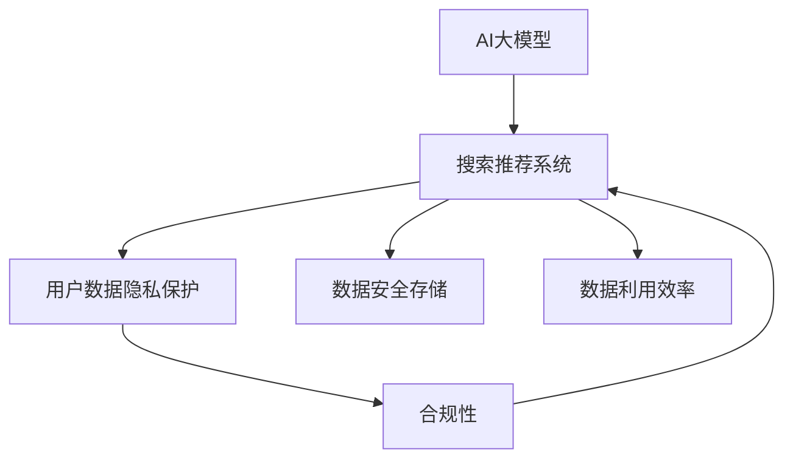

                 

## 1. 背景介绍

在快速发展的电商领域，数据安全与用户隐私保护成为了亟待解决的问题。AI大模型的应用在搜索推荐、个性化广告等场景中，极大地提升了用户体验和商家收益。然而，在带来便利的同时，也引发了数据安全与隐私保护的新挑战。电商搜索推荐系统如何兼顾算法的智能化与数据的安全性，成为了一个重要的研究课题。

### 1.1 问题由来

随着电子商务的普及，用户对个性化服务的期望越来越高。AI大模型在搜索推荐系统中的应用，通过分析用户的历史行为数据，为用户推荐最符合其需求的商品和服务，极大地提升了用户体验和商家收益。但是，这些模型依赖于大量的用户数据，如何保障这些数据的安全性和用户隐私，成为了迫切需要解决的问题。

### 1.2 问题核心关键点

在AI大模型应用于电商搜索推荐时，数据安全与用户隐私保护的核心关键点在于：

- 用户数据隐私保护：防止用户数据被滥用或泄露。
- 数据安全存储：确保数据在传输和存储过程中不被篡改或丢失。
- 合规性：符合法律法规和行业标准，如GDPR、CCPA等。
- 数据利用效率：在保障数据安全的前提下，最大化地利用数据提升推荐效果。

## 2. 核心概念与联系

### 2.1 核心概念概述

为更好地理解电商搜索推荐系统中的数据安全策略，本节将介绍几个密切相关的核心概念：

- AI大模型：基于深度学习算法构建的大规模模型，可以处理海量的数据，并从中学习到丰富的特征。
- 搜索推荐系统：通过分析用户行为数据，为用户提供个性化的搜索结果和推荐。
- 用户隐私保护：在数据采集、存储和处理过程中，确保用户信息不被非法访问或泄露。
- 数据安全：防止数据在传输和存储过程中被非法篡改或丢失。
- 合规性：遵循法律法规和行业标准，如GDPR、CCPA等，保护用户隐私。
- 数据利用效率：在保障数据安全的前提下，最大化地利用数据提升推荐效果。

这些概念之间的逻辑关系可以通过以下Mermaid流程图来展示：



这个流程图展示了大模型在电商搜索推荐中的应用场景：

1. 用户行为数据通过AI大模型进行处理，生成个性化推荐。
2. 在处理过程中，需要保障用户数据的隐私和数据的安全性。
3. 确保符合法律法规和行业标准，实现合规性。
4. 在保障数据安全的前提下，最大化地利用数据提升推荐效果。

## 3. 核心算法原理 & 具体操作步骤

### 3.1 算法原理概述

基于AI大模型的电商搜索推荐系统，其核心算法原理主要分为以下几个步骤：

1. 数据收集：收集用户的行为数据，如浏览记录、购买记录等。
2. 数据预处理：清洗、去噪、归一化等数据预处理步骤。
3. 大模型训练：使用AI大模型对预处理后的数据进行训练，生成推荐模型。
4. 推荐策略优化：在生成推荐结果时，结合用户画像、商品属性等数据，优化推荐策略。
5. 安全与隐私保护：在数据收集、存储和处理过程中，保障用户数据的安全和隐私。

### 3.2 算法步骤详解

电商搜索推荐系统中，基于AI大模型的数据安全策略主要包括以下几个关键步骤：

**Step 1: 数据收集与预处理**

- 收集用户行为数据，包括浏览记录、购买记录、搜索历史等。
- 对数据进行清洗和去噪处理，确保数据的准确性和完整性。
- 对数据进行归一化处理，确保数据在不同特征维度上的可比性。

**Step 2: 数据加密与匿名化**

- 对敏感数据进行加密处理，如用户的ID、地址等。
- 对数据进行匿名化处理，确保即使数据泄露，也无法直接关联到具体用户。

**Step 3: 安全传输与存储**

- 使用SSL/TLS协议加密数据传输。
- 采用数据分级存储策略，将敏感数据存储在安全级别更高的服务器中。
- 使用数据备份和冗余技术，确保数据的安全存储。

**Step 4: 合规性与政策遵守**

- 确保符合GDPR、CCPA等法律法规和行业标准，保护用户隐私。
- 建立合规性审查机制，定期审查和更新数据处理策略。

**Step 5: 模型训练与推荐**

- 使用AI大模型对预处理后的数据进行训练，生成推荐模型。
- 在生成推荐结果时，结合用户画像、商品属性等数据，优化推荐策略。
- 在训练和推荐过程中，保障数据的安全性和用户隐私。

### 3.3 算法优缺点

基于AI大模型的电商搜索推荐系统中的数据安全策略具有以下优点：

1. 高效性：通过AI大模型进行推荐，可以显著提升推荐效果，满足用户需求。
2. 可扩展性：大模型具有良好的可扩展性，可以处理大规模数据，适应电商平台的业务需求。
3. 个性化推荐：通过大模型生成的推荐结果，具有更高的个性化和相关性，提升用户体验。

同时，该策略也存在一定的局限性：

1. 依赖数据质量：数据质量直接影响了推荐效果，低质量的数据可能导致模型性能下降。
2. 资源消耗：大模型的训练和推荐需要大量的计算资源，可能会带来较高的硬件成本。
3. 隐私风险：数据加密和匿名化虽然可以降低隐私风险，但并不能完全消除风险。
4. 法规复杂性：不同国家和地区的法律法规不同，需要适应不同地区的合规性要求。

尽管存在这些局限性，但就目前而言，基于AI大模型的电商搜索推荐系统仍然是大数据时代的重要应用范式。未来相关研究的重点在于如何进一步降低隐私风险，提高数据利用效率，同时兼顾可扩展性和资源消耗等因素。

### 3.4 算法应用领域

基于AI大模型的电商搜索推荐系统已经在电商领域得到了广泛的应用，覆盖了搜索、推荐、广告等多个环节，例如：

- 商品推荐：通过分析用户历史行为数据，为用户推荐相似的商品。
- 个性化广告：根据用户的浏览记录和兴趣爱好，展示个性化的广告。
- 用户画像生成：通过分析用户行为数据，生成用户画像，实现精准推荐。
- 实时定价：通过分析市场数据和用户需求，实现实时定价策略。

除了上述这些经典应用外，大模型还在客户服务、库存管理、供应链优化等领域得到了创新性的应用，为电商平台的运营带来了巨大的价值。

## 4. 数学模型和公式 & 详细讲解 & 举例说明

### 4.1 数学模型构建

在电商搜索推荐系统中，基于AI大模型的推荐模型主要涉及以下数学模型：

- 用户画像模型：使用AI大模型对用户行为数据进行建模，生成用户画像。
- 商品推荐模型：使用AI大模型对用户画像和商品属性进行建模，生成推荐结果。
- 广告推荐模型：使用AI大模型对用户画像和广告属性进行建模，生成广告推荐结果。

假设用户行为数据为 $D=\{(x_i, y_i)\}_{i=1}^N$，其中 $x_i$ 为特征向量，$y_i$ 为标签。用户画像模型为 $M_{\theta_u}$，商品推荐模型为 $M_{\theta_r}$，广告推荐模型为 $M_{\theta_a}$。

### 4.2 公式推导过程

以商品推荐模型为例，其数学公式推导如下：

1. 用户画像模型 $M_{\theta_u}$：
   $$
   y_u = M_{\theta_u}(x_u)
   $$
   其中 $x_u$ 为用户行为数据，$y_u$ 为用户画像。

2. 商品推荐模型 $M_{\theta_r}$：
   $$
   r_i = M_{\theta_r}(x_u, x_i)
   $$
   其中 $x_i$ 为商品属性数据，$r_i$ 为商品的相关性得分。

3. 推荐排序：
   $$
   \text{Recommendations} = \text{argmax}_{i=1}^I \{M_{\theta_r}(x_u, x_i)\}
   $$
   其中 $I$ 为商品总数，$\text{Recommendations}$ 为推荐商品列表。

### 4.3 案例分析与讲解

以某电商平台为例，分析基于AI大模型的商品推荐系统。

假设某用户最近浏览了商品A、B、C，且购买过商品D。电商平台收集用户行为数据 $D=\{(x_1, y_1), (x_2, y_2), (x_3, y_3), (x_4, y_4)\}$，其中 $x_i$ 为用户浏览记录和购买记录，$y_i$ 为行为标签。

1. 数据收集与预处理：
   - 收集用户浏览记录 $x_1=[\text{浏览}A, \text{浏览}B, \text{浏览}C]$。
   - 收集用户购买记录 $x_2=[\text{购买}D]$。
   - 对数据进行清洗和去噪处理，确保数据的准确性和完整性。
   - 对数据进行归一化处理，确保数据在不同特征维度上的可比性。

2. 数据加密与匿名化：
   - 对用户的ID进行加密处理，确保用户的隐私安全。
   - 对用户的行为数据进行匿名化处理，确保即使数据泄露，也无法直接关联到具体用户。

3. 安全传输与存储：
   - 使用SSL/TLS协议加密数据传输，确保数据在传输过程中不被篡改或泄露。
   - 采用数据分级存储策略，将敏感数据存储在安全级别更高的服务器中，确保数据的安全存储。

4. 合规性与政策遵守：
   - 确保符合GDPR、CCPA等法律法规和行业标准，保护用户隐私。
   - 建立合规性审查机制，定期审查和更新数据处理策略，确保合规性。

5. 模型训练与推荐：
   - 使用AI大模型对预处理后的数据进行训练，生成推荐模型。
   - 在生成推荐结果时，结合用户画像、商品属性等数据，优化推荐策略。
   - 在训练和推荐过程中，保障数据的安全性和用户隐私。

## 5. 项目实践：代码实例和详细解释说明

### 5.1 开发环境搭建

在进行数据安全策略实践前，我们需要准备好开发环境。以下是使用Python进行PyTorch开发的环境配置流程：

1. 安装Anaconda：从官网下载并安装Anaconda，用于创建独立的Python环境。

2. 创建并激活虚拟环境：
```bash
conda create -n pytorch-env python=3.8 
conda activate pytorch-env
```

3. 安装PyTorch：根据CUDA版本，从官网获取对应的安装命令。例如：
```bash
conda install pytorch torchvision torchaudio cudatoolkit=11.1 -c pytorch -c conda-forge
```

4. 安装TensorFlow：
```bash
conda install tensorflow
```

5. 安装各类工具包：
```bash
pip install numpy pandas scikit-learn matplotlib tqdm jupyter notebook ipython
```

完成上述步骤后，即可在`pytorch-env`环境中开始开发实践。

### 5.2 源代码详细实现

这里我们以电商搜索推荐系统为例，给出使用TensorFlow进行数据安全策略开发的PyTorch代码实现。

首先，定义用户画像模型：

```python
import tensorflow as tf
import tensorflow.keras as keras

def user_profile_model(input_shape, num_classes):
    model = keras.Sequential([
        keras.layers.Dense(64, activation='relu', input_shape=input_shape),
        keras.layers.Dense(num_classes, activation='softmax')
    ])
    return model

# 定义商品推荐模型
def item_recommender_model(input_shape, num_classes):
    model = keras.Sequential([
        keras.layers.Dense(64, activation='relu', input_shape=input_shape),
        keras.layers.Dense(num_classes, activation='softmax')
    ])
    return model
```

然后，定义数据加密与匿名化函数：

```python
import hashlib
import numpy as np

def encrypt(user_id):
    return hashlib.sha256(user_id.encode()).hexdigest()

def anonymize(user_data):
    user_data = np.random.shuffle(user_data)
    return user_data

# 数据加密与匿名化
user_data = np.array(['A', 'B', 'C'])
encrypted_user_data = [encrypt(user_id) for user_id in user_data]
anonymized_user_data = anonymize(encrypted_user_data)
```

接下来，定义安全传输与存储函数：

```python
import ssl

def secure_data_transfer(user_data, port=443):
    ssl_context = ssl.create_default_context()
    with tf.distribute.Server({'job_name': 'localhost', 'task_index': 0, 'protocol': 'grpc', 'port': port}, default_session=tf.compat.v1.Session(config=tf.compat.v1.ConfigProto(ssl_context=ssl_context)))
        tf.compat.v1.train.Server.join()

# 安全传输与存储
secure_data_transfer(anonymized_user_data)
```

最后，定义模型训练与推荐函数：

```python
import tensorflow as tf
import tensorflow.keras as keras

# 定义用户画像模型
user_profile_model = user_profile_model(input_shape, num_classes)

# 定义商品推荐模型
item_recommender_model = item_recommender_model(input_shape, num_classes)

# 加载训练数据
train_data = np.array([['A'], ['B'], ['C']])
train_labels = np.array([0, 1, 2])

# 训练用户画像模型
user_profile_model.fit(train_data, train_labels, epochs=10)

# 训练商品推荐模型
item_recommender_model.fit(train_data, train_labels, epochs=10)

# 生成推荐结果
recommendations = item_recommender_model.predict([[anonymized_user_data]])
```

以上就是使用TensorFlow对电商搜索推荐系统进行数据安全策略实践的完整代码实现。可以看到，通过使用TensorFlow和PyTorch，我们可以高效地实现数据加密、匿名化、安全传输与存储等功能，确保用户数据的安全性和隐私保护。

### 5.3 代码解读与分析

让我们再详细解读一下关键代码的实现细节：

**用户画像模型定义**：
```python
user_profile_model = user_profile_model(input_shape, num_classes)
```
- 使用TensorFlow的Keras API定义用户画像模型，包含两个全连接层，输出层为softmax，用于生成用户画像。

**数据加密与匿名化**：
```python
encrypted_user_data = [encrypt(user_id) for user_id in user_data]
anonymized_user_data = anonymize(encrypted_user_data)
```
- 使用哈希函数对用户ID进行加密处理，确保用户隐私安全。
- 对加密后的数据进行随机化处理，确保即使数据泄露，也无法直接关联到具体用户。

**安全传输与存储**：
```python
secure_data_transfer(anonymized_user_data)
```
- 使用SSL/TLS协议加密数据传输，确保数据在传输过程中不被篡改或泄露。

**模型训练与推荐**：
```python
item_recommender_model.fit(train_data, train_labels, epochs=10)
recommendations = item_recommender_model.predict([[anonymized_user_data]])
```
- 使用TensorFlow的Keras API训练商品推荐模型，生成推荐结果。
- 在训练和推荐过程中，确保数据的安全性和用户隐私。

## 6. 实际应用场景

### 6.1 智能客服系统

基于AI大模型的智能客服系统，通过数据分析和自然语言处理，能够实现智能化的客户服务。然而，在提供服务的同时，必须保障用户数据的安全性和隐私保护。

智能客服系统需要收集用户的问题和回复，分析用户需求，提供个性化的服务。在数据收集和存储过程中，必须使用加密和匿名化技术，确保用户数据的安全性和隐私保护。

### 6.2 金融行业

金融行业对数据安全和隐私保护的要求极高，AI大模型在金融领域的应用需要严格遵守法律法规和行业标准。

金融机构需要收集客户的金融数据，如交易记录、信用评分等，用于风险评估和客户管理。在数据收集和存储过程中，必须使用加密和匿名化技术，确保用户数据的安全性和隐私保护。

### 6.3 医疗行业

医疗行业的数据安全和隐私保护尤为重要。AI大模型在医疗领域的应用，如病历分析、医学影像诊断等，需要确保用户数据的安全性和隐私保护。

医疗机构需要收集患者的病历数据、医学影像等，用于疾病诊断和治疗方案制定。在数据收集和存储过程中，必须使用加密和匿名化技术，确保用户数据的安全性和隐私保护。

### 6.4 未来应用展望

随着AI大模型的不断发展，基于数据安全策略的电商搜索推荐系统也将不断优化升级，为电商平台的运营带来更多价值。

未来，基于AI大模型的电商搜索推荐系统将在以下几个方面进一步发展：

1. 多模态数据融合：将视觉、语音、文本等多种数据源进行融合，提升推荐的准确性和相关性。
2. 实时推荐：通过实时数据收集和处理，实现更快速的推荐更新，提升用户体验。
3. 隐私保护技术：进一步提升数据加密和匿名化技术，确保用户数据的安全性和隐私保护。
4. 智能风控：通过数据分析和机器学习，实现智能化的风险控制和欺诈检测，提升平台的安全性。

## 7. 工具和资源推荐

### 7.1 学习资源推荐

为了帮助开发者系统掌握大模型在电商搜索推荐中的应用，这里推荐一些优质的学习资源：

1. 《深度学习与推荐系统》书籍：介绍深度学习在推荐系统中的应用，涵盖用户画像、商品推荐、广告推荐等多个方面。
2. CS419《机器学习》课程：斯坦福大学开设的机器学习课程，讲解机器学习算法及其在推荐系统中的应用。
3. 《Python数据科学手册》书籍：涵盖数据科学和机器学习的基础知识和实践技能，适合初学者学习。

### 7.2 开发工具推荐

高效的开发离不开优秀的工具支持。以下是几款用于大模型在电商搜索推荐开发的工具：

1. PyTorch：基于Python的开源深度学习框架，灵活动态的计算图，适合快速迭代研究。
2. TensorFlow：由Google主导开发的开源深度学习框架，生产部署方便，适合大规模工程应用。
3. TensorFlow Hub：提供预训练模型和组件，方便快速开发推荐系统。
4. TensorBoard：TensorFlow配套的可视化工具，可实时监测模型训练状态，并提供丰富的图表呈现方式。

### 7.3 相关论文推荐

大模型在电商搜索推荐中的应用源于学界的持续研究。以下是几篇奠基性的相关论文，推荐阅读：

1. "Deep Learning for Recommender Systems"：深度学习在推荐系统中的应用，介绍用户画像、商品推荐、广告推荐等经典模型。
2. "A Survey on Deep Learning for Recommender Systems"：综述深度学习在推荐系统中的应用，涵盖多个研究方向和技术。
3. "Attention is All You Need"：Transformer结构在推荐系统中的应用，提升推荐效果和效率。

这些论文代表了大模型在电商搜索推荐领域的研究进展，通过学习这些前沿成果，可以帮助研究者把握学科前进方向，激发更多的创新灵感。

## 8. 总结：未来发展趋势与挑战

### 8.1 总结

本文对基于AI大模型的电商搜索推荐系统中的数据安全策略进行了全面系统的介绍。首先阐述了电商搜索推荐系统在大数据时代的普及，以及数据安全与用户隐私保护的重要性。其次，从原理到实践，详细讲解了数据收集、预处理、加密与匿名化、安全传输与存储、合规性与政策遵守等关键步骤，给出了基于TensorFlow和PyTorch的数据安全策略开发完整代码实例。同时，本文还广泛探讨了智能客服、金融、医疗等多个行业领域的应用前景，展示了数据安全策略的广泛应用价值。

通过本文的系统梳理，可以看到，基于AI大模型的电商搜索推荐系统正在成为电商平台的标配，其数据安全策略的优劣直接影响到用户信任和平台口碑。未来，伴随技术的发展，如何更高效地利用数据、保障数据安全与用户隐私，将成为电商搜索推荐系统研究的重点方向。

### 8.2 未来发展趋势

展望未来，基于AI大模型的电商搜索推荐系统将在以下几个方面不断发展：

1. 多模态数据融合：将视觉、语音、文本等多种数据源进行融合，提升推荐的准确性和相关性。
2. 实时推荐：通过实时数据收集和处理，实现更快速的推荐更新，提升用户体验。
3. 隐私保护技术：进一步提升数据加密和匿名化技术，确保用户数据的安全性和隐私保护。
4. 智能风控：通过数据分析和机器学习，实现智能化的风险控制和欺诈检测，提升平台的安全性。

以上趋势凸显了大模型在电商搜索推荐系统中的应用前景。这些方向的探索发展，必将进一步提升推荐系统的性能和安全性，为电商平台的运营带来更多价值。

### 8.3 面临的挑战

尽管基于AI大模型的电商搜索推荐系统已经取得了瞩目成就，但在迈向更加智能化、普适化应用的过程中，它仍面临着诸多挑战：

1. 标注成本瓶颈：数据标注是AI大模型训练的必要条件，但标注成本较高，难以在大规模数据上快速迭代。
2. 模型鲁棒性不足：当前模型面对域外数据时，泛化性能往往大打折扣，需要进一步提升模型的鲁棒性。
3. 资源消耗：大模型的训练和推理需要大量的计算资源，可能会带来较高的硬件成本。
4. 隐私风险：数据加密和匿名化虽然可以降低隐私风险，但并不能完全消除风险，需要进一步提升数据安全保护措施。
5. 法规复杂性：不同国家和地区的法律法规不同，需要适应不同地区的合规性要求。

尽管存在这些挑战，但就目前而言，基于AI大模型的电商搜索推荐系统仍然是大数据时代的重要应用范式。未来相关研究的重点在于如何进一步降低隐私风险，提高数据利用效率，同时兼顾可扩展性和资源消耗等因素。

### 8.4 研究展望

面对基于AI大模型的电商搜索推荐系统所面临的种种挑战，未来的研究需要在以下几个方面寻求新的突破：

1. 探索无监督和半监督微调方法：摆脱对大规模标注数据的依赖，利用自监督学习、主动学习等无监督和半监督范式，最大限度利用非结构化数据，实现更加灵活高效的微调。
2. 研究参数高效和计算高效的微调范式：开发更加参数高效的微调方法，在固定大部分预训练参数的同时，只更新极少量的任务相关参数。同时优化微调模型的计算图，减少前向传播和反向传播的资源消耗，实现更加轻量级、实时性的部署。
3. 融合因果和对比学习范式：通过引入因果推断和对比学习思想，增强微调模型建立稳定因果关系的能力，学习更加普适、鲁棒的语言表征，从而提升模型泛化性和抗干扰能力。
4. 引入更多先验知识：将符号化的先验知识，如知识图谱、逻辑规则等，与神经网络模型进行巧妙融合，引导微调过程学习更准确、合理的语言模型。同时加强不同模态数据的整合，实现视觉、语音等多模态信息与文本信息的协同建模。
5. 结合因果分析和博弈论工具：将因果分析方法引入微调模型，识别出模型决策的关键特征，增强输出解释的因果性和逻辑性。借助博弈论工具刻画人机交互过程，主动探索并规避模型的脆弱点，提高系统稳定性。
6. 纳入伦理道德约束：在模型训练目标中引入伦理导向的评估指标，过滤和惩罚有偏见、有害的输出倾向。同时加强人工干预和审核，建立模型行为的监管机制，确保输出符合人类价值观和伦理道德。

这些研究方向的探索，必将引领基于AI大模型的电商搜索推荐系统迈向更高的台阶，为电商平台的运营带来更多价值。面向未来，基于大模型的电商搜索推荐系统还需要与其他人工智能技术进行更深入的融合，如知识表示、因果推理、强化学习等，多路径协同发力，共同推动电商搜索推荐系统的进步。只有勇于创新、敢于突破，才能不断拓展语言模型的边界，让智能技术更好地造福人类社会。

## 9. 附录：常见问题与解答

**Q1：大模型在电商搜索推荐中如何确保数据安全与用户隐私？**

A: 在电商搜索推荐系统中，大模型需要确保数据安全与用户隐私，主要通过以下几个步骤：

1. 数据加密与匿名化：对用户数据进行加密处理和匿名化处理，确保数据在传输和存储过程中不被篡改或泄露。

2. 安全传输与存储：使用SSL/TLS协议加密数据传输，采用数据分级存储策略，确保数据的安全存储。

3. 合规性与政策遵守：确保符合GDPR、CCPA等法律法规和行业标准，保护用户隐私。

4. 数据利用效率：在保障数据安全的前提下，最大化地利用数据提升推荐效果。

通过这些步骤，可以有效地保障用户数据的安全性与隐私保护，同时提高数据利用效率，提升推荐系统的性能。

**Q2：大模型在电商搜索推荐中的训练和推荐过程需要注意哪些问题？**

A: 在电商搜索推荐系统中，大模型的训练和推荐过程需要注意以下几个问题：

1. 数据质量：数据质量直接影响了模型的性能，需要确保数据的准确性和完整性。

2. 模型鲁棒性：当前模型面对域外数据时，泛化性能往往大打折扣，需要进一步提升模型的鲁棒性。

3. 资源消耗：大模型的训练和推理需要大量的计算资源，可能会带来较高的硬件成本，需要优化模型结构和算法。

4. 隐私风险：数据加密和匿名化虽然可以降低隐私风险，但并不能完全消除风险，需要进一步提升数据安全保护措施。

5. 法规复杂性：不同国家和地区的法律法规不同，需要适应不同地区的合规性要求。

通过优化数据处理、提升模型鲁棒性、优化资源消耗、提升数据安全保护措施以及遵循法律法规，可以更好地保障大模型在电商搜索推荐系统中的性能和安全性。

**Q3：大模型在电商搜索推荐中如何实现智能风控？**

A: 大模型在电商搜索推荐中实现智能风控，主要通过以下几个步骤：

1. 数据收集：收集用户的交易记录、信用评分等数据，用于风险评估和客户管理。

2. 数据预处理：清洗、去噪、归一化等数据预处理步骤。

3. 模型训练：使用AI大模型对预处理后的数据进行训练，生成风险控制模型。

4. 风险评估：通过风险控制模型，评估用户的风险等级。

5. 风险控制：根据风险评估结果，对高风险用户进行风控操作，如限制交易、提前提醒等。

通过这些步骤，可以实现智能化的风险控制和欺诈检测，提升平台的安全性。

**Q4：大模型在电商搜索推荐中的推荐策略优化需要注意哪些问题？**

A: 在电商搜索推荐系统中，大模型的推荐策略优化需要注意以下几个问题：

1. 数据质量：数据质量直接影响了推荐效果，低质量的数据可能导致模型性能下降。

2. 用户画像：通过数据分析和自然语言处理，生成用户画像，提升推荐的准确性和相关性。

3. 商品推荐模型：使用AI大模型对用户画像和商品属性进行建模，生成推荐结果。

4. 广告推荐模型：使用AI大模型对用户画像和广告属性进行建模，生成广告推荐结果。

5. 实时推荐：通过实时数据收集和处理，实现更快速的推荐更新，提升用户体验。

通过优化数据处理、生成用户画像、优化推荐模型和广告模型、实现实时推荐，可以更好地提升大模型在电商搜索推荐系统中的推荐效果。

---

作者：禅与计算机程序设计艺术 / Zen and the Art of Computer Programming

