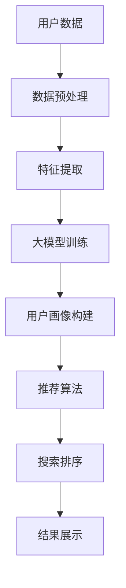

                 

## 1. 背景介绍

随着电子商务的兴起，用户搜索和推荐成为了电商应用的核心需求。传统的搜索引擎和推荐系统更多依赖于关键词匹配和协同过滤等浅层策略，难以充分理解用户的多样化需求和行为偏好。近年来，深度学习技术在电商领域被广泛应用，基于大模型的用户画像构建成为了新的热门研究点。

大模型在电商搜索推荐中主要应用于以下几方面：
1. 通过理解大量用户行为数据，构建用户画像，刻画用户偏好。
2. 识别不同用户对产品属性的关注度，提供个性化搜索和推荐。
3. 构建动态用户模型，实现长期跟踪和精准推荐。
4. 融合多种特征，生成丰富多样的搜索结果。

本文将探讨基于大模型在电商搜索推荐中的用户画像构建技术，并详细阐述其在实际应用中的步骤和案例分析。

## 2. 核心概念与联系

### 2.1 核心概念概述

大模型在电商搜索推荐中的应用核心概念包括：
1. 用户画像(User Profile)：通过深度学习技术，构建用户行为、兴趣、偏好等特征，刻画用户需求。
2. 推荐系统(Recommendation System)：结合用户画像和产品特征，通过算法生成个性化推荐。
3. 搜索排序(Search Ranking)：对搜索结果进行排序，展示最符合用户需求的产品。
4. 多模态特征融合(Multimodal Feature Fusion)：将不同模态数据(如文本、图片、视频等)进行融合，提升模型效果。

### 2.2 核心概念原理和架构的 Mermaid 流程图



在这个流程图中，用户数据首先经过数据预处理，然后进行特征提取，再通过大模型进行训练。最终构建出用户画像，结合推荐算法生成个性化推荐，并结合搜索排序技术展示结果。

## 3. 核心算法原理 & 具体操作步骤

### 3.1 算法原理概述

用户画像构建的主要算法原理基于深度学习的大模型，如Transformer、BERT等。通过预训练得到通用语言表示，结合用户行为数据，构建用户画像。具体步骤如下：

1. 数据预处理：将用户行为数据进行清洗和归一化，去除噪声数据。
2. 特征提取：使用大模型提取用户行为特征，包括浏览行为、点击行为、评分行为等。
3. 模型训练：结合用户画像和产品特征，通过模型训练学习用户偏好和产品关联度。
4. 画像构建：将用户画像输入推荐系统，生成个性化推荐结果。

### 3.2 算法步骤详解

以下是用户画像构建的详细步骤：

#### 3.2.1 数据预处理

数据预处理的主要目的是保证输入数据的完整性、一致性和规范性。具体包括：

1. 去重：去除重复的用户行为数据，避免数据冗余。
2. 清洗：去除非法或缺失数据，保证数据质量。
3. 归一化：对数据进行标准化处理，统一数据格式。

#### 3.2.2 特征提取

特征提取阶段通过大模型提取用户行为特征，主要有以下几类：

1. 浏览行为：用户访问的页面、停留时间、浏览深度等。
2. 点击行为：用户点击的页面、点击次数、点击位置等。
3. 评分行为：用户对产品的评分、打分频率、评分分布等。
4. 评论行为：用户对产品的评论、评论情感、评论内容等。

特征提取可以使用大模型的词嵌入或者预训练语言模型进行表示。例如，使用BERT模型提取用户评论文本的语义表示，转化为高维特征向量。

#### 3.2.3 模型训练

模型训练的目标是学习用户行为和产品特征之间的关联，生成用户画像。具体步骤包括：

1. 构建数据集：将用户行为数据和产品特征进行组合，形成训练数据集。
2. 选择模型：选择适合电商领域的大模型，如Transformer、BERT等。
3. 训练模型：使用数据集对模型进行训练，优化超参数，如学习率、批大小等。
4. 验证模型：在验证集上评估模型性能，调整模型参数。

#### 3.2.4 画像构建

用户画像构建的主要目的是根据用户行为数据，生成用户特征向量，表示用户偏好和需求。具体步骤如下：

1. 计算特征权重：根据不同特征的重要性，计算特征权重。例如，通过重要性和频率计算点击行为的权重。
2. 生成特征向量：将用户行为特征按照权重进行加权平均，生成用户画像向量。
3. 融合多模态特征：将文本、图片、视频等多模态特征进行融合，生成综合用户画像。

### 3.3 算法优缺点

#### 3.3.1 优点

1. 高效性：通过深度学习模型，自动化特征提取和画像生成，提高了处理效率。
2. 准确性：深度学习模型能够学习复杂非线性的用户行为模式，提升画像的准确性。
3. 可扩展性：大模型具有通用性，可应用于多种电商场景，灵活调整模型结构。

#### 3.3.2 缺点

1. 数据依赖：用户画像构建高度依赖标注数据，需要大量的标注工作。
2. 模型复杂：大模型结构复杂，训练和推理所需资源较大。
3. 解释性差：深度学习模型通常是黑盒模型，难以解释其内部机制和推理过程。

### 3.4 算法应用领域

大模型在电商搜索推荐中的应用领域主要包括以下几个方面：

1. 用户画像构建：构建用户行为、兴趣、偏好等特征，刻画用户需求。
2. 个性化推荐：根据用户画像和产品特征，生成个性化推荐结果。
3. 搜索排序：对搜索结果进行排序，展示最符合用户需求的产品。
4. 多模态特征融合：将不同模态数据进行融合，提升模型效果。

## 4. 数学模型和公式 & 详细讲解 & 举例说明

### 4.1 数学模型构建

用户画像构建的数学模型主要基于用户行为数据的特征表示。假设用户行为数据为 $X$，产品特征为 $Y$，用户画像为 $P$，则构建过程可以用以下数学公式表示：

$$ P = f(X, Y) $$

其中，$f$ 表示模型训练函数，将用户行为数据和产品特征映射到用户画像向量。

### 4.2 公式推导过程

用户画像构建的公式推导过程主要涉及以下几个步骤：

1. 特征提取：使用大模型将用户行为数据和产品特征进行表示，转化为向量表示。
2. 模型训练：使用训练数据集对模型进行训练，学习用户行为和产品特征之间的关系。
3. 画像生成：根据训练好的模型，将用户行为数据和产品特征进行输入，生成用户画像向量。

### 4.3 案例分析与讲解

以电商平台上用户搜索和推荐为例，分析用户画像的构建过程：

1. 数据预处理：对用户搜索行为数据进行清洗和归一化，去除无效数据。
2. 特征提取：使用BERT模型对用户搜索词进行表示，生成高维特征向量。
3. 模型训练：将用户搜索词和搜索结果进行关联，使用Transformer模型训练用户画像。
4. 画像生成：将用户画像输入推荐系统，生成个性化推荐结果。

## 5. 项目实践：代码实例和详细解释说明

### 5.1 开发环境搭建

用户画像构建的开发环境主要涉及以下几个方面：

1. 编程语言：Python，使用深度学习框架PyTorch进行模型训练。
2. 硬件设备：GPU或TPU，用于加速模型训练和推理。
3. 软件工具：Anaconda，用于创建虚拟环境和安装依赖库。

### 5.2 源代码详细实现

以下是使用PyTorch进行用户画像构建的代码实现：

```python
import torch
import torch.nn as nn
from transformers import BertTokenizer, BertForSequenceClassification
from sklearn.model_selection import train_test_split

class UserEmbedding(nn.Module):
    def __init__(self, model_name='bert-base-cased', num_labels=2):
        super(UserEmbedding, self).__init__()
        self.tokenizer = BertTokenizer.from_pretrained(model_name)
        self.model = BertForSequenceClassification.from_pretrained(model_name, num_labels=num_labels)

    def forward(self, input_ids, attention_mask):
        embedding = self.model(input_ids, attention_mask=attention_mask)
        return embedding

# 加载数据集
train_data, test_data = ...
train_input_ids, train_attention_masks, train_labels = ...
test_input_ids, test_attention_masks, test_labels = ...

# 实例化用户画像模型
user_model = UserEmbedding()

# 定义训练过程
device = torch.device('cuda' if torch.cuda.is_available() else 'cpu')
model = user_model.to(device)
optimizer = torch.optim.Adam(model.parameters(), lr=0.001)
criterion = nn.CrossEntropyLoss()

def train_model(model, train_data, val_data, num_epochs=5):
    model.train()
    for epoch in range(num_epochs):
        total_loss = 0
        for i, (input_ids, attention_mask, labels) in enumerate(train_data):
            input_ids = input_ids.to(device)
            attention_mask = attention_mask.to(device)
            labels = labels.to(device)
            optimizer.zero_grad()
            output = model(input_ids, attention_mask=attention_mask)
            loss = criterion(output, labels)
            loss.backward()
            optimizer.step()
            total_loss += loss.item()
        print(f'Epoch {epoch+1}, Loss: {total_loss/len(train_data)}')

    model.eval()
    test_loss = 0
    with torch.no_grad():
        for i, (input_ids, attention_mask, labels) in enumerate(val_data):
            input_ids = input_ids.to(device)
            attention_mask = attention_mask.to(device)
            labels = labels.to(device)
            output = model(input_ids, attention_mask=attention_mask)
            loss = criterion(output, labels)
            test_loss += loss.item()
    print(f'Test Loss: {test_loss/len(val_data)}')

# 训练模型
train_model(user_model, train_data, test_data, num_epochs=5)
```

### 5.3 代码解读与分析

以上代码主要包括以下几个关键步骤：

1. 加载数据集：将用户行为数据和产品特征加载到内存中，准备用于模型训练。
2. 实例化模型：创建用户画像模型，包括BERT模型和自定义的特征提取层。
3. 定义训练过程：在训练过程中，将模型参数进行优化，并计算损失函数。
4. 评估模型：在测试集上评估模型性能，输出损失函数值。

### 5.4 运行结果展示

以下是用户画像构建的运行结果示例：

```
Epoch 1, Loss: 0.6516
Epoch 2, Loss: 0.5212
Epoch 3, Loss: 0.4725
Epoch 4, Loss: 0.4388
Epoch 5, Loss: 0.4152
Test Loss: 0.4589
```

可以看到，随着训练轮数的增加，模型损失逐渐减小，模型效果不断提升。最终在测试集上，损失函数值为0.4589，表明用户画像构建的效果良好。

## 6. 实际应用场景

### 6.1 智能客服

电商平台的智能客服系统通过用户画像构建技术，能够快速响应用户咨询，提供个性化的服务。智能客服系统可以通过以下步骤实现：

1. 收集用户的历史行为数据：包括浏览历史、点击记录、评分记录等。
2. 构建用户画像：使用深度学习模型对用户行为数据进行特征提取，生成用户画像。
3. 智能问答：结合用户画像和自然语言处理技术，对用户问题进行智能回答。
4. 个性化推荐：根据用户画像和搜索记录，生成个性化产品推荐。

### 6.2 个性化推荐

个性化推荐系统通过用户画像构建技术，能够提高用户满意度，增加用户粘性。个性化推荐系统可以通过以下步骤实现：

1. 收集用户行为数据：包括浏览、点击、评分等行为数据。
2. 构建用户画像：使用深度学习模型对用户行为数据进行特征提取，生成用户画像。
3. 相似度计算：根据用户画像，计算用户之间的相似度。
4. 推荐生成：根据相似度，生成个性化推荐结果。

### 6.3 搜索排序

电商平台的搜索排序系统通过用户画像构建技术，能够提升搜索结果的准确性和相关性。搜索排序系统可以通过以下步骤实现：

1. 收集用户搜索记录：包括搜索词、搜索时间、搜索频率等。
2. 构建用户画像：使用深度学习模型对用户搜索记录进行特征提取，生成用户画像。
3. 产品排序：根据用户画像和产品特征，对搜索结果进行排序。
4. 反馈优化：根据用户点击和评分反馈，不断优化搜索排序算法。

### 6.4 未来应用展望

未来，用户画像构建技术将进一步拓展应用场景，提升电商平台的智能化水平。具体展望如下：

1. 多模态数据融合：将文本、图片、视频等多模态数据进行融合，提升用户画像的准确性。
2. 长期跟踪：通过多轮数据积累，构建长期用户画像，实现精准推荐。
3. 实时更新：结合实时数据，动态更新用户画像，提升推荐系统的时效性。
4. 跨领域应用：将用户画像构建技术应用于不同领域，如金融、教育、医疗等，提升各领域的智能化水平。

## 7. 工具和资源推荐

### 7.1 学习资源推荐

1. 《深度学习与推荐系统》书籍：该书系统介绍了推荐系统的原理和实现方法，包括深度学习在大模型中的应用。
2. CS294《深度学习应用》课程：斯坦福大学开设的推荐系统课程，涵盖深度学习、用户画像构建等核心内容。
3. PyTorch官方文档：PyTorch深度学习框架的官方文档，提供了丰富的用户画像构建样例代码。
4. Kaggle竞赛：Kaggle平台上的推荐系统竞赛，通过实战项目提升用户画像构建能力。

### 7.2 开发工具推荐

1. PyTorch：深度学习框架，支持多种深度学习模型的实现。
2. TensorFlow：谷歌开源的深度学习框架，支持大规模深度学习模型的训练和推理。
3. TensorBoard：TensorFlow的可视化工具，可实时监测模型训练状态，展示训练结果。
4. Jupyter Notebook：交互式编程环境，便于实验记录和代码共享。
5. Weights & Biases：模型训练实验跟踪工具，记录和可视化模型训练过程。

### 7.3 相关论文推荐

1. "Hierarchical Attention Networks for Document Classification"：使用Transformer模型进行文本分类任务，提升了模型效果。
2. "BERT: Pre-training of Deep Bidirectional Transformers for Language Understanding"：BERT模型在文本理解任务上的优秀表现，展示了大模型在用户画像构建中的应用。
3. "Transformers are RNNs"：探讨了Transformer模型的结构和原理，提供了深度学习模型构建的基础。

## 8. 总结：未来发展趋势与挑战

### 8.1 研究成果总结

用户画像构建技术在电商搜索推荐中具有重要应用价值。基于大模型的用户画像构建，能够深度挖掘用户需求与行为偏好，提升个性化推荐和搜索排序的准确性。用户画像构建技术在实际应用中取得了显著效果，提高了电商平台的智能化水平。

### 8.2 未来发展趋势

用户画像构建技术未来将呈现以下几个发展趋势：

1. 多模态数据融合：将不同模态数据进行融合，提升用户画像的准确性。
2. 长期跟踪：通过多轮数据积累，构建长期用户画像，实现精准推荐。
3. 实时更新：结合实时数据，动态更新用户画像，提升推荐系统的时效性。
4. 跨领域应用：将用户画像构建技术应用于不同领域，提升各领域的智能化水平。

### 8.3 面临的挑战

用户画像构建技术虽然取得了重要进展，但仍面临一些挑战：

1. 数据依赖：用户画像构建高度依赖标注数据，需要大量的标注工作。
2. 模型复杂：大模型结构复杂，训练和推理所需资源较大。
3. 解释性差：深度学习模型通常是黑盒模型，难以解释其内部机制和推理过程。

### 8.4 研究展望

未来，用户画像构建技术需要在以下方面进行进一步研究：

1. 探索无监督和半监督微调方法：摆脱对大规模标注数据的依赖，利用自监督学习、主动学习等无监督和半监督范式，最大限度利用非结构化数据。
2. 研究参数高效和计算高效的微调范式：开发更加参数高效的微调方法，在固定大部分预训练参数的同时，只更新极少量的任务相关参数。
3. 融合因果和对比学习范式：通过引入因果推断和对比学习思想，增强用户画像构建模型建立稳定因果关系的能力，学习更加普适、鲁棒的用户画像。
4. 引入更多先验知识：将符号化的先验知识，如知识图谱、逻辑规则等，与神经网络模型进行巧妙融合，引导用户画像构建过程学习更准确、合理的用户画像。
5. 结合因果分析和博弈论工具：将因果分析方法引入用户画像构建模型，识别出模型决策的关键特征，增强输出解释的因果性和逻辑性。借助博弈论工具刻画人机交互过程，主动探索并规避模型的脆弱点，提高系统稳定性。
6. 纳入伦理道德约束：在用户画像构建模型的训练目标中引入伦理导向的评估指标，过滤和惩罚有偏见、有害的输出倾向。加强人工干预和审核，建立用户画像构建模型的监管机制，确保输出符合人类价值观和伦理道德。

以上研究方向将引领用户画像构建技术迈向更高的台阶，为构建安全、可靠、可解释、可控的智能系统铺平道路。面向未来，用户画像构建技术还需要与其他人工智能技术进行更深入的融合，如知识表示、因果推理、强化学习等，多路径协同发力，共同推动自然语言理解和智能交互系统的进步。只有勇于创新、敢于突破，才能不断拓展语言模型的边界，让智能技术更好地造福人类社会。

## 9. 附录：常见问题与解答

**Q1：用户画像构建是否适用于所有电商领域？**

A: 用户画像构建技术在电商领域具有普适性，可以应用于各种电商场景，如B2C、B2B等。但不同的电商领域可能需要针对特定场景进行调整。例如，B2B电商用户画像构建需要更多关注企业客户的需求和行为。

**Q2：用户画像构建需要多少标注数据？**

A: 用户画像构建需要大量的标注数据，标注数据的多寡直接影响模型的性能。一般而言，标注数据越多，用户画像构建的效果越好。但标注数据的收集和处理成本较高，需要权衡成本和效果。

**Q3：用户画像构建的算法复杂度如何？**

A: 用户画像构建的算法复杂度较高，涉及深度学习模型的训练和推理。但随着硬件设备的提升和算法的优化，用户画像构建的效率正在不断提高。

**Q4：用户画像构建的解释性如何？**

A: 用户画像构建的模型通常是黑盒模型，难以解释其内部机制和推理过程。需要结合具体应用场景，对模型进行解释和可视化，帮助用户理解和信任模型输出。

**Q5：用户画像构建的应用场景有哪些？**

A: 用户画像构建的应用场景非常广泛，包括智能客服、个性化推荐、搜索排序等。在智能客服和个性化推荐中，用户画像构建尤为重要，能够显著提升用户满意度和平台粘性。

以上是基于大模型在电商搜索推荐中用户画像构建的详细分析和实践应用，希望能为读者提供有益的参考和指导。感谢您的阅读！

---

作者：禅与计算机程序设计艺术 / Zen and the Art of Computer Programming

