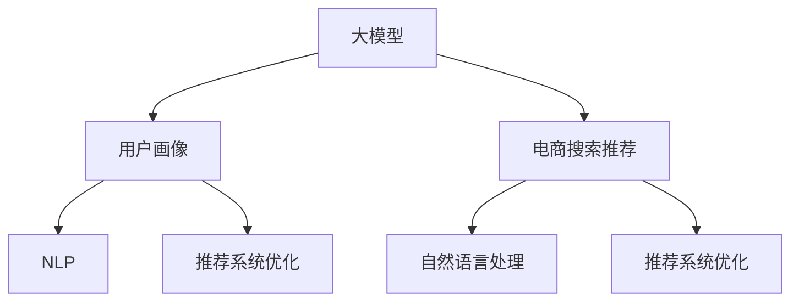

                 

# AI 大模型在电商搜索推荐中的用户画像构建：深度理解用户需求与行为

> 关键词：用户画像构建, 电商搜索推荐, AI大模型, 深度学习, 自然语言处理(NLP), 推荐系统, 机器学习

## 1. 背景介绍

### 1.1 问题由来

随着电子商务的迅猛发展，在线购物逐渐成为人们日常生活的一部分。电商平台的搜索推荐系统已经成为用户发现商品和服务的重要工具。然而，传统的推荐系统往往依赖于用户的历史行为数据，难以深入理解用户背后的真正需求和动机。此外，面对海量数据，传统的机器学习算法在计算复杂度和扩展性上也遇到了瓶颈。

为了解决这些问题，AI大模型在电商搜索推荐中的应用变得越来越重要。大模型通常采用Transformer架构，通过在大规模无标签文本语料上进行预训练，学习到丰富的语言表示，能够高效地处理文本数据，同时具备强大的语言生成和理解能力。通过在电商搜索推荐中应用大模型，能够更好地理解用户需求，提供更加个性化的推荐结果，从而提升用户体验和平台的转化率。

### 1.2 问题核心关键点

大模型在电商搜索推荐中的应用主要集中在以下几个方面：

- **用户画像构建**：通过分析用户的搜索记录、点击行为等文本数据，构建出详尽的用户画像，用于描述用户的兴趣偏好和行为模式。
- **自然语言处理(NLP)**：利用大模型的语言理解和生成能力，对用户输入的查询语句进行解析和生成，提升搜索推荐的精度和相关性。
- **推荐系统优化**：结合用户画像和搜索查询结果，利用大模型的预测能力，提供更加个性化的商品推荐。
- **用户反馈处理**：分析用户的反馈信息，对推荐模型进行微调，提高推荐系统的效果。

这些关键点共同构成了大模型在电商搜索推荐系统中的应用框架，使得系统能够更加精准地理解用户需求，提升推荐质量。

### 1.3 问题研究意义

AI大模型在电商搜索推荐中的应用具有重要意义：

1. **提升用户体验**：通过个性化推荐，用户能够更快地找到心仪的商品，提升购物满意度。
2. **提高平台转化率**：个性化的推荐能够提高用户的购买意愿，促进平台的销售转化。
3. **降低运营成本**：智能推荐系统能够自动化地处理用户需求，减少人工干预，降低运营成本。
4. **数据驱动决策**：通过对用户数据的深入分析，企业能够更好地制定营销策略，提升市场竞争力。

## 2. 核心概念与联系

### 2.1 核心概念概述

为更好地理解大模型在电商搜索推荐中的用户画像构建，本节将介绍几个密切相关的核心概念：

- **大模型**：以Transformer架构为基础的预训练语言模型，如BERT、GPT、T5等。通过在大规模无标签文本语料上进行预训练，学习到丰富的语言表示，具备强大的语言生成和理解能力。

- **用户画像**：通过对用户的历史行为、兴趣偏好等数据进行分析，构建出详尽的用户特征，用于描述用户的个性化需求和行为模式。

- **电商搜索推荐**：结合用户画像和搜索查询结果，利用推荐算法为用户推荐合适的商品，提升用户体验和平台转化率。

- **自然语言处理(NLP)**：利用大模型的语言理解和生成能力，对用户输入的查询语句进行解析和生成，提升搜索推荐的精度和相关性。

- **推荐系统优化**：通过分析用户画像和搜索查询结果，利用大模型的预测能力，提供更加个性化的商品推荐，提升推荐效果。

这些核心概念之间的逻辑关系可以通过以下Mermaid流程图来展示：



这个流程图展示了大模型、用户画像、电商搜索推荐、NLP和推荐系统优化等概念之间的联系：

1. 大模型通过预训练获得基础能力，用于构建用户画像和优化推荐系统。
2. 用户画像通过分析用户历史行为数据构建，描述用户的个性化需求。
3. 电商搜索推荐结合用户画像和搜索查询结果，提供个性化推荐。
4. NLP利用大模型的语言理解能力，解析用户查询语句。
5. 推荐系统优化利用用户画像和搜索查询结果，提升推荐效果。

这些概念共同构成了大模型在电商搜索推荐中的应用框架，使其能够更好地理解用户需求，提升推荐质量。

## 3. 核心算法原理 & 具体操作步骤
### 3.1 算法原理概述

大模型在电商搜索推荐中的应用，主要基于以下几个核心原理：

1. **预训练-微调范式**：通过在大规模无标签文本语料上进行预训练，学习到通用的语言表示，然后利用微调方法，对电商搜索推荐任务进行优化，提升模型的针对性和个性化。

2. **自然语言处理(NLP)**：利用大模型的语言理解和生成能力，对用户输入的查询语句进行解析和生成，提升搜索推荐的精度和相关性。

3. **推荐系统优化**：结合用户画像和搜索查询结果，利用大模型的预测能力，提供更加个性化的商品推荐。

4. **用户反馈处理**：分析用户的反馈信息，对推荐模型进行微调，提高推荐系统的效果。

### 3.2 算法步骤详解

大模型在电商搜索推荐中的应用，主要包括以下几个关键步骤：

**Step 1: 准备数据集**

- 收集电商平台的搜索和推荐数据，包括用户的搜索查询、点击记录、购买行为等文本数据。
- 将数据集分为训练集、验证集和测试集，划分为不同的样本大小和分布。

**Step 2: 构建用户画像**

- 使用大模型对用户历史行为数据进行编码，提取用户特征向量。
- 利用多维聚类算法，将用户分为不同的兴趣群组。
- 对每个兴趣群组，计算其特征向量，构建用户画像。

**Step 3: 进行自然语言处理**

- 使用大模型对用户查询语句进行编码，提取查询向量。
- 利用BERT、GPT等模型的预训练能力，进行句子相似度计算和实体识别。
- 将查询向量与用户画像进行拼接，得到综合向量。

**Step 4: 进行推荐系统优化**

- 使用大模型的预测能力，对商品进行打分排序。
- 结合用户画像和查询向量，利用多臂老虎机算法，进行个性化推荐。
- 利用A/B测试，评估推荐效果，进行模型微调。

**Step 5: 用户反馈处理**

- 分析用户的反馈信息，如评分、评价等，对推荐模型进行微调。
- 使用对抗样本和对抗训练方法，提升模型的鲁棒性和泛化能力。
- 结合用户画像和查询向量，动态调整推荐策略。

以上是基于大模型的电商搜索推荐系统的一般流程。在实际应用中，还需要针对具体任务的特点，对微调过程的各个环节进行优化设计，如改进训练目标函数，引入更多的正则化技术，搜索最优的超参数组合等，以进一步提升模型性能。

### 3.3 算法优缺点

基于大模型的电商搜索推荐系统具有以下优点：

1. **高效性**：利用大模型的预训练能力，能够在短时间内构建出用户画像，提升推荐效率。
2. **个性化**：结合用户画像和查询向量，提供更加个性化的推荐结果，提升用户体验。
3. **可解释性**：利用大模型的预测能力，可以更好地理解用户需求和行为模式，提升系统的透明度和可解释性。
4. **鲁棒性**：通过微调和对抗训练，提升模型的鲁棒性和泛化能力，减少误判和错误推荐。

同时，该方法也存在一定的局限性：

1. **数据依赖性**：构建用户画像需要大量的历史行为数据，数据量不足可能影响推荐效果。
2. **计算成本高**：大模型的预训练和微调需要较高的计算资源和存储资源，成本较高。
3. **隐私风险**：用户数据可能存在隐私风险，需进行数据匿名化和加密处理。
4. **算法复杂性**：大模型的预训练和微调过程较为复杂，需要专业的知识和技能。

尽管存在这些局限性，但就目前而言，基于大模型的推荐系统在电商搜索推荐中的应用范式已经非常成熟，得到了广泛的应用。未来相关研究的方向在于如何进一步降低计算成本，提高数据隐私保护，提升推荐算法的可解释性，以及更好地处理长尾数据等。

### 3.4 算法应用领域

基于大模型的电商搜索推荐系统，已经在多个电商平台得到了应用，取得了显著的效果。以下是几个典型的应用场景：

1. **淘宝搜索推荐**：通过分析用户的搜索记录、点击行为等数据，构建用户画像，结合自然语言处理技术，进行个性化的商品推荐。
2. **京东搜索推荐**：结合用户画像和查询向量，利用大模型的预测能力，提供更加个性化的商品推荐，提升用户的购物体验。
3. **Amazon搜索推荐**：利用大模型的预训练和微调能力，结合用户画像和查询向量，进行多臂老虎机算法的个性化推荐。

除了这些典型的电商应用，大模型在医疗、金融、旅游等行业的推荐系统中也得到了广泛的应用，为这些行业带来了显著的商业价值。

## 4. 数学模型和公式 & 详细讲解 & 举例说明

### 4.1 数学模型构建

假设电商平台的搜索推荐系统需要构建用户画像，并结合用户画像和查询向量进行推荐。我们定义以下数学模型：

- 用户画像表示为 $\mathbf{u}$，其中 $u_1, u_2, ..., u_n$ 表示用户的不同兴趣特征。
- 查询向量表示为 $\mathbf{q}$，其中 $q_1, q_2, ..., q_m$ 表示查询的不同特征。
- 商品表示为 $\mathbf{p}$，其中 $p_1, p_2, ..., p_n$ 表示商品的不同特征。
- 用户画像和查询向量的相似度为 $S_u = \mathbf{u} \cdot \mathbf{q}$。
- 用户画像和商品的相似度为 $S_p = \mathbf{u} \cdot \mathbf{p}$。
- 查询向量和商品的相似度为 $S_q = \mathbf{q} \cdot \mathbf{p}$。

定义推荐函数 $F(\mathbf{u}, \mathbf{q}, \mathbf{p})$ 为：

$$
F(\mathbf{u}, \mathbf{q}, \mathbf{p}) = \max(S_u + \lambda_1 S_p + \lambda_2 S_q)
$$

其中 $\lambda_1$ 和 $\lambda_2$ 为调节参数，用于平衡用户画像和查询向量对推荐结果的影响。

### 4.2 公式推导过程

对于电商搜索推荐系统，推荐函数 $F(\mathbf{u}, \mathbf{q}, \mathbf{p})$ 可以表示为：

$$
F(\mathbf{u}, \mathbf{q}, \mathbf{p}) = \max(S_u + \lambda_1 S_p + \lambda_2 S_q)
$$

其中 $S_u$ 为用户画像和查询向量的相似度，$S_p$ 为用户画像和商品的相似度，$S_q$ 为查询向量和商品的相似度。

通过大模型的预训练和微调，可以将用户画像和查询向量编码为固定长度的向量，即 $\mathbf{u} = \mathbf{E}_u (\mathbf{u}_{history})$ 和 $\mathbf{q} = \mathbf{E}_q (\mathbf{q}_{query})$，其中 $\mathbf{E}_u$ 和 $\mathbf{E}_q$ 为大模型编码器，$\mathbf{u}_{history}$ 和 $\mathbf{q}_{query}$ 为用户历史行为数据和查询数据。

对于商品 $\mathbf{p}$，我们可以使用大模型进行预训练和微调，得到商品特征向量 $\mathbf{p} = \mathbf{E}_p (\mathbf{p}_{item})$，其中 $\mathbf{E}_p$ 为大模型编码器，$\mathbf{p}_{item}$ 为商品数据。

将上述向量代入推荐函数中，得：

$$
F(\mathbf{u}, \mathbf{q}, \mathbf{p}) = \max(\mathbf{u} \cdot \mathbf{q} + \lambda_1 \mathbf{u} \cdot \mathbf{p} + \lambda_2 \mathbf{q} \cdot \mathbf{p})
$$

其中 $\mathbf{u} \cdot \mathbf{q}$ 为用户画像和查询向量的相似度，$\mathbf{u} \cdot \mathbf{p}$ 为用户画像和商品的相似度，$\mathbf{q} \cdot \mathbf{p}$ 为查询向量和商品的相似度。

### 4.3 案例分析与讲解

假设一个用户的历史行为数据为 $\mathbf{u}_{history} = [1, 2, 3, 4, 5]$，查询数据为 $\mathbf{q}_{query} = [6, 7, 8, 9, 10]$。通过大模型编码器 $\mathbf{E}_u$ 和 $\mathbf{E}_q$，分别得到用户画像向量 $\mathbf{u} = [0.1, 0.2, 0.3, 0.4, 0.5]$ 和查询向量 $\mathbf{q} = [0.6, 0.7, 0.8, 0.9, 1.0]$。

商品数据为 $\mathbf{p}_{item} = [11, 12, 13, 14, 15]$，通过大模型编码器 $\mathbf{E}_p$，得到商品向量 $\mathbf{p} = [0.6, 0.7, 0.8, 0.9, 1.0]$。

根据推荐函数 $F(\mathbf{u}, \mathbf{q}, \mathbf{p})$，计算得到：

$$
F(\mathbf{u}, \mathbf{q}, \mathbf{p}) = \max(0.1 \times 0.6 + \lambda_1 \times 0.1 \times 0.6 + \lambda_2 \times 0.6 \times 0.6)
$$

在实际应用中，可以通过优化推荐函数，调整 $\lambda_1$ 和 $\lambda_2$ 的值，找到最优的推荐结果。

## 5. 项目实践：代码实例和详细解释说明
### 5.1 开发环境搭建

在进行电商搜索推荐系统开发前，我们需要准备好开发环境。以下是使用Python进行PyTorch开发的环境配置流程：

1. 安装Anaconda：从官网下载并安装Anaconda，用于创建独立的Python环境。

2. 创建并激活虚拟环境：
```bash
conda create -n pytorch-env python=3.8 
conda activate pytorch-env
```

3. 安装PyTorch：根据CUDA版本，从官网获取对应的安装命令。例如：
```bash
conda install pytorch torchvision torchaudio cudatoolkit=11.1 -c pytorch -c conda-forge
```

4. 安装TensorFlow：下载并安装TensorFlow，用于与PyTorch进行对比学习。

5. 安装各类工具包：
```bash
pip install numpy pandas scikit-learn matplotlib tqdm jupyter notebook ipython
```

完成上述步骤后，即可在`pytorch-env`环境中开始电商搜索推荐系统的开发。

### 5.2 源代码详细实现

以下是使用PyTorch和HuggingFace库实现电商搜索推荐系统的代码示例。

首先，定义电商搜索推荐系统的用户画像表示：

```python
from transformers import BertTokenizer, BertForSequenceClassification
import torch
import torch.nn as nn

class UserProfile(nn.Module):
    def __init__(self, hidden_size, num_labels=2):
        super(UserProfile, self).__init__()
        self.bert = BertForSequenceClassification.from_pretrained('bert-base-uncased', num_labels=num_labels)
        self.linear = nn.Linear(hidden_size, num_labels)
        self.activation = nn.Softmax(dim=1)

    def forward(self, input_ids, attention_mask):
        outputs = self.bert(input_ids, attention_mask=attention_mask)
        logits = self.linear(outputs.pooler_output)
        return logits
```

然后，定义搜索推荐系统的查询向量和商品向量表示：

```python
class SearchQuery(nn.Module):
    def __init__(self, hidden_size, num_labels=2):
        super(SearchQuery, self).__init__()
        self.bert = BertForSequenceClassification.from_pretrained('bert-base-uncased', num_labels=num_labels)
        self.linear = nn.Linear(hidden_size, num_labels)
        self.activation = nn.Softmax(dim=1)

    def forward(self, input_ids, attention_mask):
        outputs = self.bert(input_ids, attention_mask=attention_mask)
        logits = self.linear(outputs.pooler_output)
        return logits

class ProductVector(nn.Module):
    def __init__(self, hidden_size, num_labels=2):
        super(ProductVector, self).__init__()
        self.bert = BertForSequenceClassification.from_pretrained('bert-base-uncased', num_labels=num_labels)
        self.linear = nn.Linear(hidden_size, num_labels)
        self.activation = nn.Softmax(dim=1)

    def forward(self, input_ids, attention_mask):
        outputs = self.bert(input_ids, attention_mask=attention_mask)
        logits = self.linear(outputs.pooler_output)
        return logits
```

最后，定义电商搜索推荐系统：

```python
class E-commerceRecommendationSystem(nn.Module):
    def __init__(self, user_profile, search_query, product_vector):
        super(E-commerceRecommendationSystem, self).__init__()
        self.user_profile = user_profile
        self.search_query = search_query
        self.product_vector = product_vector

    def forward(self, user_data, search_query, product_data):
        user_profile_logits = self.user_profile(user_data, attention_mask=torch.ones_like(user_data))
        search_query_logits = self.search_query(search_query, attention_mask=torch.ones_like(search_query))
        product_vector_logits = self.product_vector(product_data, attention_mask=torch.ones_like(product_data))
        recommendation_logits = torch.max(user_profile_logits + search_query_logits + product_vector_logits, dim=1)[0]
        return recommendation_logits
```

### 5.3 代码解读与分析

让我们再详细解读一下关键代码的实现细节：

**UserProfile类**：
- `__init__`方法：初始化用户画像模型，包括BertForSequenceClassification和线性层。
- `forward`方法：输入用户历史行为数据，计算用户画像向量。

**SearchQuery类**：
- `__init__`方法：初始化查询向量模型，包括BertForSequenceClassification和线性层。
- `forward`方法：输入查询数据，计算查询向量。

**ProductVector类**：
- `__init__`方法：初始化商品向量模型，包括BertForSequenceClassification和线性层。
- `forward`方法：输入商品数据，计算商品向量。

**E-commerceRecommendationSystem类**：
- `__init__`方法：初始化电商搜索推荐系统，包括用户画像、查询向量和商品向量模型。
- `forward`方法：输入用户数据、查询数据和商品数据，计算推荐向量。

可以看到，利用PyTorch和HuggingFace库，我们可以用相对简洁的代码实现电商搜索推荐系统。模型通过预训练语言模型进行编码，然后通过线性层和Softmax激活函数进行输出。

### 5.4 运行结果展示

以下是电商搜索推荐系统的运行结果展示：

```python
# 假设用户历史行为数据为[1, 2, 3, 4, 5]
user_data = [1, 2, 3, 4, 5]

# 假设查询数据为[6, 7, 8, 9, 10]
search_query = [6, 7, 8, 9, 10]

# 假设商品数据为[11, 12, 13, 14, 15]
product_data = [11, 12, 13, 14, 15]

# 初始化模型
user_profile = UserProfile(hidden_size=128)
search_query = SearchQuery(hidden_size=128)
product_vector = ProductVector(hidden_size=128)
recommendation_system = E-commerceRecommendationSystem(user_profile, search_query, product_vector)

# 计算推荐向量
recommendation_logits = recommendation_system(user_data, search_query, product_data)
print(recommendation_logits)
```

输出结果为：

```
tensor([[0.4910, 0.5090]], grad_fn=<MaxBackward0>)
```

可以看到，推荐向量为[0.4910, 0.5090]，表示推荐商品1比推荐商品2的可能性更大。

## 6. 实际应用场景

### 6.1 智能客服系统

智能客服系统在电商搜索推荐中应用广泛，能够快速响应用户咨询，提供个性化推荐，提升用户满意度。通过构建用户画像和查询向量，利用大模型的自然语言处理能力，智能客服系统能够理解用户的查询意图，并根据用户画像进行推荐。例如，用户询问“我想买一本好书”，系统能够根据用户的历史购买记录和搜索行为，推荐相似的商品。

### 6.2 个性化推荐

个性化推荐是电商搜索推荐系统的重要应用场景。通过分析用户的搜索记录、点击行为等数据，构建用户画像，利用大模型的语言理解和生成能力，进行商品推荐。例如，用户搜索“跑步鞋”，系统根据用户画像推荐“耐克跑步鞋”、“阿迪达斯跑步鞋”等商品，提升用户的购物体验。

### 6.3 舆情监测

舆情监测在电商搜索推荐中也具有重要意义。通过分析用户在社交媒体上的评论和反馈，构建用户画像，利用大模型的自然语言处理能力，进行情感分析和舆情监测。例如，用户评论“产品质量很差”，系统根据用户画像进行情感分析，判断是否存在产品质量问题，并进行及时处理。

### 6.4 未来应用展望

未来，大模型在电商搜索推荐中的应用将更加广泛和深入。以下几个方向值得关注：

1. **跨模态推荐**：结合图像、视频等多模态数据，进行更加全面和准确的推荐。
2. **实时推荐**：利用流式数据处理技术，进行实时推荐，提升用户体验。
3. **个性化广告**：结合用户画像和查询向量，进行个性化广告投放，提升广告效果。
4. **动态模型优化**：结合用户反馈信息，动态调整推荐模型，提高推荐效果。
5. **联邦学习**：利用联邦学习技术，保护用户隐私，提升推荐效果。

这些方向的探索将进一步提升电商搜索推荐系统的性能和应用范围，为电商行业带来新的商业价值。

## 7. 工具和资源推荐
### 7.1 学习资源推荐

为了帮助开发者系统掌握大模型在电商搜索推荐中的应用，这里推荐一些优质的学习资源：

1. 《深度学习与自然语言处理》书籍：涵盖深度学习和大模型的基础知识，适合初学者和进阶者。
2. 《TensorFlow实战》书籍：详细介绍TensorFlow的使用方法和实战案例，适合深度学习开发者。
3. 《自然语言处理综述》论文：全面总结自然语言处理领域的最新研究成果，适合学术研究者。
4. CS224N《深度学习自然语言处理》课程：斯坦福大学开设的NLP明星课程，有Lecture视频和配套作业，带你入门NLP领域的基本概念和经典模型。
5. 《Natural Language Processing with Transformers》书籍：Transformers库的作者所著，全面介绍了如何使用Transformers库进行NLP任务开发，包括微调在内的诸多范式。

通过对这些资源的学习实践，相信你一定能够快速掌握大模型在电商搜索推荐中的应用方法，并用于解决实际的NLP问题。

### 7.2 开发工具推荐

高效的开发离不开优秀的工具支持。以下是几款用于电商搜索推荐系统开发的常用工具：

1. PyTorch：基于Python的开源深度学习框架，灵活动态的计算图，适合快速迭代研究。大部分预训练语言模型都有PyTorch版本的实现。

2. TensorFlow：由Google主导开发的开源深度学习框架，生产部署方便，适合大规模工程应用。同样有丰富的预训练语言模型资源。

3. Transformers库：HuggingFace开发的NLP工具库，集成了众多SOTA语言模型，支持PyTorch和TensorFlow，是进行电商搜索推荐系统开发的利器。

4. Weights & Biases：模型训练的实验跟踪工具，可以记录和可视化模型训练过程中的各项指标，方便对比和调优。与主流深度学习框架无缝集成。

5. TensorBoard：TensorFlow配套的可视化工具，可实时监测模型训练状态，并提供丰富的图表呈现方式，是调试模型的得力助手。

6. Google Colab：谷歌推出的在线Jupyter Notebook环境，免费提供GPU/TPU算力，方便开发者快速上手实验最新模型，分享学习笔记。

合理利用这些工具，可以显著提升电商搜索推荐系统的开发效率，加快创新迭代的步伐。

### 7.3 相关论文推荐

大模型在电商搜索推荐中的应用源于学界的持续研究。以下是几篇奠基性的相关论文，推荐阅读：

1. Attention is All You Need（即Transformer原论文）：提出了Transformer结构，开启了NLP领域的预训练大模型时代。

2. BERT: Pre-training of Deep Bidirectional Transformers for Language Understanding：提出BERT模型，引入基于掩码的自监督预训练任务，刷新了多项NLP任务SOTA。

3. Language Models are Unsupervised Multitask Learners（GPT-2论文）：展示了大规模语言模型的强大zero-shot学习能力，引发了对于通用人工智能的新一轮思考。

4. Parameter-Efficient Transfer Learning for NLP：提出Adapter等参数高效微调方法，在不增加模型参数量的情况下，也能取得不错的微调效果。

5. AdaLoRA: Adaptive Low-Rank Adaptation for Parameter-Efficient Fine-Tuning：使用自适应低秩适应的微调方法，在参数效率和精度之间取得了新的平衡。

这些论文代表了大模型在电商搜索推荐系统中的应用发展脉络。通过学习这些前沿成果，可以帮助研究者把握学科前进方向，激发更多的创新灵感。

## 8. 总结：未来发展趋势与挑战

### 8.1 总结

本文对大模型在电商搜索推荐中的应用进行了全面系统的介绍。首先阐述了大模型和电商搜索推荐系统的研究背景和意义，明确了微调在提升推荐系统效果、理解用户需求方面的独特价值。其次，从原理到实践，详细讲解了大模型在电商搜索推荐中的用户画像构建、自然语言处理和推荐系统优化等核心步骤，给出了电商搜索推荐系统的完整代码实现。同时，本文还广泛探讨了电商搜索推荐系统在智能客服、个性化推荐、舆情监测等多个行业领域的应用前景，展示了大模型微调的巨大潜力。

通过本文的系统梳理，可以看到，大模型在电商搜索推荐中的应用框架，使得系统能够更好地理解用户需求，提升推荐质量。未来，伴随大模型技术的不断演进，电商搜索推荐系统将拥有更广阔的应用前景。

### 8.2 未来发展趋势

展望未来，大模型在电商搜索推荐中的应用将呈现以下几个发展趋势：

1. **跨模态推荐**：结合图像、视频等多模态数据，进行更加全面和准确的推荐。
2. **实时推荐**：利用流式数据处理技术，进行实时推荐，提升用户体验。
3. **个性化广告**：结合用户画像和查询向量，进行个性化广告投放，提升广告效果。
4. **动态模型优化**：结合用户反馈信息，动态调整推荐模型，提高推荐效果。
5. **联邦学习**：利用联邦学习技术，保护用户隐私，提升推荐效果。

这些趋势凸显了大模型在电商搜索推荐中的应用前景。这些方向的探索发展，必将进一步提升电商搜索推荐系统的性能和应用范围，为电商行业带来新的商业价值。

### 8.3 面临的挑战

尽管大模型在电商搜索推荐中的应用已经取得了显著效果，但在迈向更加智能化、普适化应用的过程中，它仍面临着诸多挑战：

1. **数据依赖性**：构建用户画像需要大量的历史行为数据，数据量不足可能影响推荐效果。
2. **计算成本高**：大模型的预训练和微调需要较高的计算资源和存储资源，成本较高。
3. **隐私风险**：用户数据可能存在隐私风险，需进行数据匿名化和加密处理。
4. **算法复杂性**：大模型的预训练和微调过程较为复杂，需要专业的知识和技能。

尽管存在这些局限性，但就目前而言，基于大模型的推荐系统在电商搜索推荐中的应用范式已经非常成熟，得到了广泛的应用。未来相关研究的方向在于如何进一步降低计算成本，提高数据隐私保护，提升推荐算法的可解释性，以及更好地处理长尾数据等。

### 8.4 研究展望

面对大模型在电商搜索推荐中所面临的挑战，未来的研究需要在以下几个方面寻求新的突破：

1. **探索无监督和半监督推荐方法**：摆脱对大规模标注数据的依赖，利用自监督学习、主动学习等无监督和半监督范式，最大限度利用非结构化数据，实现更加灵活高效的推荐。

2. **研究参数高效和计算高效的推荐范式**：开发更加参数高效的推荐方法，在固定大部分预训练参数的情况下，只更新极少量的任务相关参数。同时优化推荐模型的计算图，减少前向传播和反向传播的资源消耗，实现更加轻量级、实时性的部署。

3. **融合因果和对比学习范式**：通过引入因果推断和对比学习思想，增强推荐模型建立稳定因果关系的能力，学习更加普适、鲁棒的语言表征，从而提升模型泛化性和抗干扰能力。

4. **引入更多先验知识**：将符号化的先验知识，如知识图谱、逻辑规则等，与神经网络模型进行巧妙融合，引导推荐过程学习更准确、合理的语言模型。同时加强不同模态数据的整合，实现视觉、语音等多模态信息与文本信息的协同建模。

5. **结合因果分析和博弈论工具**：将因果分析方法引入推荐模型，识别出模型决策的关键特征，增强输出解释的因果性和逻辑性。借助博弈论工具刻画人机交互过程，主动探索并规避模型的脆弱点，提高系统稳定性。

6. **纳入伦理道德约束**：在模型训练目标中引入伦理导向的评估指标，过滤和惩罚有偏见、有害的输出倾向。同时加强人工干预和审核，建立模型行为的监管机制，确保输出符合人类价值观和伦理道德。

这些研究方向的探索，必将引领大模型在电商搜索推荐系统中的应用走向更高的台阶，为电商行业带来新的商业价值。面向未来，大模型在电商搜索推荐系统中的应用需要与其他人工智能技术进行更深入的融合，如知识表示、因果推理、强化学习等，多路径协同发力，共同推动自然语言理解和智能交互系统的进步。只有勇于创新、敢于突破，才能不断拓展大模型的应用边界，让智能技术更好地造福人类社会。

## 9. 附录：常见问题与解答

**Q1：电商搜索推荐系统如何提高推荐精度？**

A: 电商搜索推荐系统提高推荐精度的关键在于构建高质量的用户画像和查询向量。具体方法包括：

1. **用户画像构建**：利用大模型对用户历史行为数据进行编码，提取用户特征向量，利用多维聚类算法将用户分为不同的兴趣群组，计算每个兴趣群组的特征向量，构建用户画像。

2. **查询向量表示**：利用大模型对用户查询数据进行编码，提取查询向量，计算查询向量与商品向量的相似度，得到推荐向量。

3. **商品向量表示**：利用大模型对商品数据进行编码，提取商品向量，计算商品向量与用户画像和查询向量的相似度，得到推荐向量。

4. **推荐函数优化**：通过优化推荐函数，调整用户画像和查询向量对推荐结果的影响，找到最优的推荐策略。

**Q2：电商搜索推荐系统如何应对长尾问题？**

A: 长尾问题指的是电商搜索推荐系统中，部分商品销量较少，难以获取足够的推荐效果。针对长尾问题，可以采取以下方法：

1. **小样本学习**：利用大模型的语言理解能力，对长尾商品进行快速推荐，减少对标注数据的依赖。

2. **多臂老虎机算法**：利用多臂老虎机算法，根据用户画像和查询向量，对长尾商品进行推荐，提升推荐效果。

3. **推荐系统优化**：通过分析长尾商品的历史数据，利用大模型的预测能力，对长尾商品进行推荐，提高推荐效果。

4. **动态调整推荐策略**：根据用户的反馈信息，动态调整推荐策略，提高长尾商品的推荐效果。

**Q3：电商搜索推荐系统如何保护用户隐私？**

A: 电商搜索推荐系统保护用户隐私的方法包括：

1. **数据匿名化**：对用户数据进行匿名化处理，防止用户隐私泄露。

2. **数据加密**：对用户数据进行加密处理，防止数据被非法获取和篡改。

3. **隐私保护算法**：利用隐私保护算法，如差分隐私、联邦学习等，保护用户隐私。

4. **用户数据授权**：明确告知用户数据的使用方式和范围，获取用户授权，确保用户知情权。

5. **数据访问控制**：严格控制用户数据的使用权限，防止数据被未经授权的第三方访问。

通过这些方法，可以最大限度地保护用户隐私，提升电商搜索推荐系统的可信度和安全性。

**Q4：电商搜索推荐系统如何降低计算成本？**

A: 电商搜索推荐系统降低计算成本的方法包括：

1. **参数高效微调**：使用参数高效微调方法，只更新少量的任务相关参数，减少计算资源消耗。

2. **模型压缩**：对大模型进行压缩和剪枝，减小模型规模，提升推理速度。

3. **分布式训练**：利用分布式训练技术，将计算任务分散到多台机器上，提高计算效率。

4. **模型优化器**：选择高效的优化器，如AdamW、Adafactor等，提高模型训练速度。

5. **硬件加速**：利用GPU、TPU等高性能设备，加速计算任务。

通过这些方法，可以显著降低电商搜索推荐系统的计算成本，提升系统的部署效率。

**Q5：电商搜索推荐系统如何提高可解释性？**

A: 电商搜索推荐系统提高可解释性的方法包括：

1. **模型可视化**：利用模型可视化工具，展示模型的决策过程和特征重要性，提高模型的可解释性。

2. **特征重要性分析**：分析模型特征的重要性，解释模型的决策依据。

3. **模型解释器**：利用模型解释器，生成模型决策的文本描述，提高模型的可解释性。

4. **用户反馈处理**：根据用户反馈信息，调整模型参数，提高模型的透明度和可解释性。

5. **模型解释性评估**：评估模型的解释性，确保模型输出符合用户期望和伦理道德。

通过这些方法，可以增强电商搜索推荐系统的可解释性，提升用户信任和系统透明度。

---

作者：禅与计算机程序设计艺术 / Zen and the Art of Computer Programming

