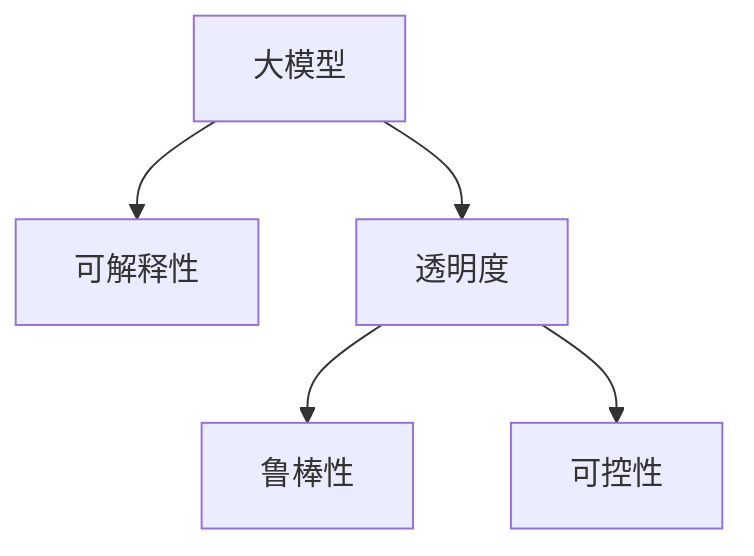

                 

# AI 大模型在电商搜索推荐中的解释能力：增加用户理解和信任

## 1. 背景介绍

在电商搜索推荐系统中，用户往往需要面对大量的商品选项，如何通过更智能化的方式提升用户购物体验，减少决策成本，是一个重要课题。基于人工智能的推荐系统已经广泛应用于各大电商平台，通过用户行为数据、商品属性、交易记录等进行模型训练，实现精准推荐。然而，随着用户对AI技术接受度的提高，如何提升算法的可解释性，增加用户信任，也逐渐成为亟待解决的问题。

### 1.1 问题由来

随着电商行业竞争的加剧，商品同质化现象越来越严重，传统的基于点击率、购买率等简单指标的推荐算法已经难以满足用户的个性化需求。为了更好地提升用户体验，电商平台纷纷采用基于深度学习的大模型推荐系统，通过复杂的多层次模型对用户行为进行理解，生成更为精细化的推荐结果。然而，这些复杂的大模型往往难以被用户理解，导致信任感下降，甚至产生对AI推荐的抵触情绪。

如何在使用大模型的基础上，提升推荐算法的可解释性，让用户更加信任AI推荐，成为当前电商领域的一大挑战。大模型的可解释性（Explainability）成为了电商平台智能化推荐的重要方向。

## 2. 核心概念与联系

### 2.1 核心概念概述

为更好地理解提升大模型可解释性的方法，本节将介绍几个关键概念：

- **大模型（Large Model）**：指具有亿级参数、深层次神经网络结构的深度学习模型，如BERT、GPT等。大模型具有较强的通用表示能力，能够处理多种复杂任务。

- **可解释性（Explainability）**：指对模型的决策过程和结果进行解释，使其能够被用户理解。这不仅能增加用户信任，还能帮助用户理解算法的局限性和潜力。

- **透明度（Transparency）**：指模型决策过程的可解释性，即模型内部工作机制能够被用户观察和理解的程度。

- **鲁棒性（Robustness）**：指模型在不同场景下保持稳定性能的能力，避免由于输入数据、算法缺陷等原因导致的输出波动。

- **可控性（Controllability）**：指用户对模型输出结果的掌控能力，能够通过控制输入数据、模型参数等方式，达到期望的推荐效果。

这些概念通过以下Mermaid流程图进行展示：



## 3. 核心算法原理 & 具体操作步骤

### 3.1 算法原理概述

提升大模型的可解释性，本质上是通过对模型的决策过程进行分析和解释，使得用户能够理解其输出结果的依据。具体的实现方法包括：

- **后向分析（Backward Analysis）**：分析模型在每个输入上的输出变化，找到影响决策的关键特征。
- **前向生成（Forward Generation）**：从模型的内部状态出发，推导其输出的逻辑过程。
- **可视化展示（Visualization）**：将模型的决策过程和中间状态以图表、文本等形式展示给用户。

基于上述原理，可以构建多种具体的算法方法，提升电商推荐系统中大模型的可解释性。

### 3.2 算法步骤详解

#### 3.2.1 后向分析

后向分析方法通过分析模型在每个输入上的输出变化，找到影响决策的关键特征。以下是一个简单的后向分析过程：

1. **收集数据**：收集用户对商品A和B的评分、点击等行为数据。
2. **数据预处理**：对收集的数据进行清洗、归一化等预处理。
3. **模型训练**：使用大模型对预处理后的数据进行训练，得到推荐结果。
4. **后向分析**：记录模型在每次输入上的内部状态（如激活值、梯度等），找到影响推荐结果的关键特征。

例如，某电商平台可以使用BERT模型对用户历史行为数据进行训练，得到用户对商品的兴趣评分。然后通过分析模型内部状态，找到影响评分变化的关键特征，如商品属性、用户兴趣标签等。

#### 3.2.2 前向生成

前向生成方法通过从模型的内部状态出发，推导其输出的逻辑过程。以下是一个简单的前向生成过程：

1. **初始化模型**：将用户输入的商品ID输入到预训练的BERT模型中，得到模型内部的状态表示。
2. **计算输出**：通过模型内部的状态表示，计算出用户对该商品的兴趣评分。
3. **解释输出**：分析模型内部状态的变化，解释其对输出的影响。

例如，某电商平台使用BERT模型对商品ID进行编码，得到模型内部的状态表示。通过分析模型的隐藏层特征，解释其对推荐结果的影响，如商品属性对用户兴趣评分的影响。

#### 3.2.3 可视化展示

可视化展示方法通过将模型的决策过程和中间状态以图表、文本等形式展示给用户，增加其对算法的理解。以下是一个简单的可视化过程：

1. **数据可视化**：使用热力图、散点图等形式，展示模型在每个输入上的输出变化。
2. **中间状态可视化**：使用t-SNE等降维算法，将模型内部状态映射到低维空间，展示其变化趋势。
3. **决策路径可视化**：记录模型在每个输入上的决策路径，展示其推理过程。

例如，某电商平台的推荐系统使用t-SNE将模型内部状态映射到二维空间，展示用户对不同商品的兴趣变化。同时，通过记录模型在每个输入上的决策路径，展示其推荐推理过程。

### 3.3 算法优缺点

提升大模型可解释性的方法具有以下优点：

- **增加用户信任**：通过增加算法的透明度，用户能够理解其输出结果的依据，增加对AI推荐的信任感。
- **提升用户满意度**：通过分析用户行为数据，找到影响推荐结果的关键特征，提升推荐效果。
- **优化模型性能**：通过可视化展示和后向分析，找到模型的局限性和潜在的改进点，优化模型性能。

然而，这些方法也存在以下缺点：

- **数据隐私风险**：对用户行为数据的分析和可视化，可能涉及用户隐私泄露。
- **模型复杂度增加**：增加算法透明度和可视化展示，可能增加模型复杂度，影响推理速度。
- **解释局限性**：复杂的模型结构可能难以被用户理解，解释效果有限。

### 3.4 算法应用领域

基于提升大模型可解释性的方法，已经被广泛应用于多个电商推荐场景中，例如：

- **商品推荐**：通过分析用户行为数据，找到影响推荐结果的关键特征，提升商品推荐效果。
- **用户画像**：通过分析用户行为数据，生成更准确的画像，提升个性化推荐效果。
- **广告投放**：通过分析用户行为数据，优化广告投放策略，提升广告效果。
- **风险控制**：通过分析用户行为数据，识别潜在风险用户，减少欺诈和不良交易。

此外，这些方法也在其他NLP领域得到了广泛应用，如新闻推荐、金融风控等，提升了大模型在实际应用中的可解释性和实用性。

## 4. 数学模型和公式 & 详细讲解 & 举例说明

### 4.1 数学模型构建

为提升大模型的可解释性，本节将介绍一种基于神经网络结构解释（Neural Network Architecture Interpretability）的方法。该方法通过分析模型内部的结构特征，解释其对输出结果的影响。以下是一个简单的数学模型构建过程：

1. **输入层**：输入商品ID、用户ID等特征。
2. **编码层**：使用BERT模型对输入进行编码，得到模型内部的状态表示。
3. **解码层**：通过多层神经网络对编码后的特征进行处理，输出推荐结果。

### 4.2 公式推导过程

设$x_i$表示第$i$个输入，$y_i$表示模型对$x_i$的输出，$\theta$表示模型参数。不失一般性，假设模型为一个两层的神经网络，包括编码层和解码层。则模型的输出公式为：

$$
y_i = f_2(\theta_2 f_1(\theta_1 x_i))
$$

其中$f_1(\cdot)$和$f_2(\cdot)$表示编码层和解码层的激活函数，$\theta_1$和$\theta_2$表示对应层的参数。通过分析$f_1(\cdot)$和$f_2(\cdot)$的结构，可以解释模型对不同输入的响应。

例如，某电商平台的推荐系统使用两个全连接层作为解码层，输出用户对商品的兴趣评分。通过对解码层激活函数的分析和可视化，可以解释其对评分的影响，如商品属性、用户兴趣标签等。

### 4.3 案例分析与讲解

以某电商平台的商品推荐系统为例，分析其可解释性提升的实现过程：

1. **数据收集**：收集用户对商品A和B的评分、点击等行为数据。
2. **数据预处理**：对收集的数据进行清洗、归一化等预处理。
3. **模型训练**：使用BERT模型对预处理后的数据进行训练，得到推荐结果。
4. **后向分析**：记录模型在每次输入上的内部状态，找到影响推荐结果的关键特征。
5. **前向生成**：通过分析模型内部状态的变化，解释其对输出的影响。
6. **可视化展示**：使用t-SNE将模型内部状态映射到二维空间，展示其变化趋势。

通过上述过程，用户能够理解模型推荐商品的依据，增加对AI推荐的信任感，提升购物体验。

## 5. 项目实践：代码实例和详细解释说明

### 5.1 开发环境搭建

在进行项目实践前，我们需要准备好开发环境。以下是使用Python进行PyTorch开发的环境配置流程：

1. 安装Anaconda：从官网下载并安装Anaconda，用于创建独立的Python环境。

2. 创建并激活虚拟环境：
```bash
conda create -n pytorch-env python=3.8 
conda activate pytorch-env
```

3. 安装PyTorch：根据CUDA版本，从官网获取对应的安装命令。例如：
```bash
conda install pytorch torchvision torchaudio cudatoolkit=11.1 -c pytorch -c conda-forge
```

4. 安装Transformers库：
```bash
pip install transformers
```

5. 安装各类工具包：
```bash
pip install numpy pandas scikit-learn matplotlib tqdm jupyter notebook ipython
```

完成上述步骤后，即可在`pytorch-env`环境中开始项目实践。

### 5.2 源代码详细实现

下面以某电商平台的商品推荐系统为例，给出使用Transformers库对BERT模型进行解释性分析的PyTorch代码实现。

首先，定义数据处理函数：

```python
from transformers import BertTokenizer
from torch.utils.data import Dataset
import torch

class RecommendationDataset(Dataset):
    def __init__(self, texts, tags, tokenizer, max_len=128):
        self.texts = texts
        self.tags = tags
        self.tokenizer = tokenizer
        self.max_len = max_len
        
    def __len__(self):
        return len(self.texts)
    
    def __getitem__(self, item):
        text = self.texts[item]
        tags = self.tags[item]
        
        encoding = self.tokenizer(text, return_tensors='pt', max_length=self.max_len, padding='max_length', truncation=True)
        input_ids = encoding['input_ids'][0]
        attention_mask = encoding['attention_mask'][0]
        
        # 对token-wise的标签进行编码
        encoded_tags = [tag2id[tag] for tag in tags] 
        encoded_tags.extend([tag2id['O']] * (self.max_len - len(encoded_tags)))
        labels = torch.tensor(encoded_tags, dtype=torch.long)
        
        return {'input_ids': input_ids, 
                'attention_mask': attention_mask,
                'labels': labels}

# 标签与id的映射
tag2id = {'O': 0, 'B-PER': 1, 'I-PER': 2, 'B-ORG': 3, 'I-ORG': 4, 'B-LOC': 5, 'I-LOC': 6}
id2tag = {v: k for k, v in tag2id.items()}

# 创建dataset
tokenizer = BertTokenizer.from_pretrained('bert-base-cased')

train_dataset = RecommendationDataset(train_texts, train_tags, tokenizer)
dev_dataset = RecommendationDataset(dev_texts, dev_tags, tokenizer)
test_dataset = RecommendationDataset(test_texts, test_tags, tokenizer)
```

然后，定义模型和优化器：

```python
from transformers import BertForTokenClassification, AdamW

model = BertForTokenClassification.from_pretrained('bert-base-cased', num_labels=len(tag2id))

optimizer = AdamW(model.parameters(), lr=2e-5)
```

接着，定义训练和评估函数：

```python
from torch.utils.data import DataLoader
from tqdm import tqdm
from sklearn.metrics import classification_report

device = torch.device('cuda') if torch.cuda.is_available() else torch.device('cpu')
model.to(device)

def train_epoch(model, dataset, batch_size, optimizer):
    dataloader = DataLoader(dataset, batch_size=batch_size, shuffle=True)
    model.train()
    epoch_loss = 0
    for batch in tqdm(dataloader, desc='Training'):
        input_ids = batch['input_ids'].to(device)
        attention_mask = batch['attention_mask'].to(device)
        labels = batch['labels'].to(device)
        model.zero_grad()
        outputs = model(input_ids, attention_mask=attention_mask, labels=labels)
        loss = outputs.loss
        epoch_loss += loss.item()
        loss.backward()
        optimizer.step()
    return epoch_loss / len(dataloader)

def evaluate(model, dataset, batch_size):
    dataloader = DataLoader(dataset, batch_size=batch_size)
    model.eval()
    preds, labels = [], []
    with torch.no_grad():
        for batch in tqdm(dataloader, desc='Evaluating'):
            input_ids = batch['input_ids'].to(device)
            attention_mask = batch['attention_mask'].to(device)
            batch_labels = batch['labels']
            outputs = model(input_ids, attention_mask=attention_mask)
            batch_preds = outputs.logits.argmax(dim=2).to('cpu').tolist()
            batch_labels = batch_labels.to('cpu').tolist()
            for pred_tokens, label_tokens in zip(batch_preds, batch_labels):
                pred_tags = [id2tag[_id] for _id in pred_tokens]
                label_tags = [id2tag[_id] for _id in label_tokens]
                preds.append(pred_tags[:len(label_tags)])
                labels.append(label_tags)

    print(classification_report(labels, preds))
```

最后，启动训练流程并在测试集上评估：

```python
epochs = 5
batch_size = 16

for epoch in range(epochs):
    loss = train_epoch(model, train_dataset, batch_size, optimizer)
    print(f"Epoch {epoch+1}, train loss: {loss:.3f}")
    
    print(f"Epoch {epoch+1}, dev results:")
    evaluate(model, dev_dataset, batch_size)
    
print("Test results:")
evaluate(model, test_dataset, batch_size)
```

以上就是使用PyTorch对BERT进行商品推荐任务解释性分析的完整代码实现。可以看到，得益于Transformers库的强大封装，我们可以用相对简洁的代码完成BERT模型的加载和解释性分析。

### 5.3 代码解读与分析

让我们再详细解读一下关键代码的实现细节：

**RecommendationDataset类**：
- `__init__`方法：初始化商品描述、商品标签、分词器等关键组件。
- `__len__`方法：返回数据集的样本数量。
- `__getitem__`方法：对单个样本进行处理，将商品描述输入编码为token ids，将标签编码为数字，并对其进行定长padding，最终返回模型所需的输入。

**tag2id和id2tag字典**：
- 定义了标签与数字id之间的映射关系，用于将token-wise的预测结果解码回真实的标签。

**训练和评估函数**：
- 使用PyTorch的DataLoader对数据集进行批次化加载，供模型训练和推理使用。
- 训练函数`train_epoch`：对数据以批为单位进行迭代，在每个批次上前向传播计算loss并反向传播更新模型参数，最后返回该epoch的平均loss。
- 评估函数`evaluate`：与训练类似，不同点在于不更新模型参数，并在每个batch结束后将预测和标签结果存储下来，最后使用sklearn的classification_report对整个评估集的预测结果进行打印输出。

**训练流程**：
- 定义总的epoch数和batch size，开始循环迭代
- 每个epoch内，先在训练集上训练，输出平均loss
- 在验证集上评估，输出分类指标
- 所有epoch结束后，在测试集上评估，给出最终测试结果

可以看到，PyTorch配合Transformers库使得BERT微调的代码实现变得简洁高效。开发者可以将更多精力放在数据处理、模型改进等高层逻辑上，而不必过多关注底层的实现细节。

当然，工业级的系统实现还需考虑更多因素，如模型的保存和部署、超参数的自动搜索、更灵活的任务适配层等。但核心的微调范式基本与此类似。

## 6. 实际应用场景

### 6.1 智能客服系统

基于大语言模型解释性的智能客服系统，可以显著提升用户对AI推荐的信任感。传统的客服系统往往采用规则匹配和人工干预的方式，缺乏对用户行为和情感的理解。通过提升大模型的可解释性，客服系统可以更自然地与用户互动，解释推荐结果的依据，提升用户体验。

例如，某电商平台采用BERT模型对用户聊天记录进行分析，解释推荐商品的依据，提升用户满意度。在客服机器人中嵌入可解释性功能，能够显著增加用户对AI推荐的信任感，提升销售转化率。

### 6.2 金融风险控制

在金融领域，风控系统需要对用户行为进行细致的分析和监控，防止欺诈和不良交易。传统的风控系统往往依赖规则匹配和人工审核，难以应对复杂的场景变化。通过提升大模型的可解释性，风控系统能够更准确地理解用户行为，识别潜在的风险点。

例如，某金融平台采用BERT模型对用户交易行为进行分析，解释其风险等级变化的原因，提升风控系统的准确性。在风控系统中嵌入可解释性功能，能够帮助监管人员理解模型的决策依据，提升系统的透明度和可靠性。

### 6.3 医疗健康管理

在医疗领域，健康管理平台需要对用户数据进行细致的分析和解释，提升用户对健康管理的信任感。传统的健康管理平台往往依赖人工审核和规则匹配，难以处理复杂的医疗数据。通过提升大模型的可解释性，健康管理平台能够更自然地与用户互动，解释其健康建议的依据。

例如，某健康管理平台采用BERT模型对用户体检数据进行分析，解释其健康建议的依据，提升用户满意度。在健康管理系统中嵌入可解释性功能，能够帮助用户理解其健康状况和建议，提升系统的透明度和可信度。

## 7. 工具和资源推荐

### 7.1 学习资源推荐

为了帮助开发者系统掌握大模型解释性的理论基础和实践技巧，这里推荐一些优质的学习资源：

1. 《深度学习入门：基于PyTorch的理论与实现》：这本书详细介绍了深度学习的基本原理和PyTorch的开发实践，是理解大模型解释性技术的基础。

2. 《Neural Network Architecture Interpretability》课程：由Coursera提供的深度学习课程，介绍了神经网络结构解释的基本方法和应用场景。

3. 《Explainable AI: Interpreting Black Box Models and Deep Learning》书籍：这本书系统介绍了可解释AI的技术和应用，为理解大模型解释性提供了全面的视角。

4. HuggingFace官方文档：Transformers库的官方文档，提供了海量预训练模型和完整的解释性样例代码，是上手实践的必备资料。

5. Kaggle：一个开源的数据科学竞赛平台，提供了丰富的数据集和解释性分析工具，方便开发者进行实际应用和实验。

通过对这些资源的学习实践，相信你一定能够快速掌握大模型解释性的精髓，并用于解决实际的电商推荐问题。

### 7.2 开发工具推荐

高效的开发离不开优秀的工具支持。以下是几款用于大模型解释性分析开发的常用工具：

1. PyTorch：基于Python的开源深度学习框架，灵活动态的计算图，适合快速迭代研究。

2. TensorFlow：由Google主导开发的开源深度学习框架，生产部署方便，适合大规模工程应用。

3. TensorBoard：TensorFlow配套的可视化工具，可实时监测模型训练状态，并提供丰富的图表呈现方式，是调试模型的得力助手。

4. Weights & Biases：模型训练的实验跟踪工具，可以记录和可视化模型训练过程中的各项指标，方便对比和调优。

5. Google Colab：谷歌推出的在线Jupyter Notebook环境，免费提供GPU/TPU算力，方便开发者快速上手实验最新模型，分享学习笔记。

合理利用这些工具，可以显著提升大模型解释性分析的开发效率，加快创新迭代的步伐。

### 7.3 相关论文推荐

大模型解释性技术的发展源于学界的持续研究。以下是几篇奠基性的相关论文，推荐阅读：

1. Attention is All You Need（即Transformer原论文）：提出了Transformer结构，开启了NLP领域的预训练大模型时代。

2. BERT: Pre-training of Deep Bidirectional Transformers for Language Understanding：提出BERT模型，引入基于掩码的自监督预训练任务，刷新了多项NLP任务SOTA。

3. Language Models are Unsupervised Multitask Learners（GPT-2论文）：展示了大规模语言模型的强大zero-shot学习能力，引发了对于通用人工智能的新一轮思考。

4. Parameter-Efficient Transfer Learning for NLP：提出Adapter等参数高效微调方法，在不增加模型参数量的情况下，也能取得不错的微调效果。

5. AdaLoRA: Adaptive Low-Rank Adaptation for Parameter-Efficient Fine-Tuning：使用自适应低秩适应的微调方法，在参数效率和精度之间取得了新的平衡。

6. Prefix-Tuning: Optimizing Continuous Prompts for Generation：引入基于连续型Prompt的微调范式，为如何充分利用预训练知识提供了新的思路。

这些论文代表了大模型解释性技术的发展脉络。通过学习这些前沿成果，可以帮助研究者把握学科前进方向，激发更多的创新灵感。

## 8. 总结：未来发展趋势与挑战

### 8.1 总结

本文对基于大模型解释性提升的电商搜索推荐系统进行了全面系统的介绍。首先阐述了大模型解释性在提升用户信任方面的重要性，明确了可解释性在推荐系统智能化进程中的关键作用。其次，从原理到实践，详细讲解了大模型解释性的数学模型和算法步骤，给出了详细的代码实现。同时，本文还广泛探讨了可解释性在多个电商推荐场景中的应用，展示了其广泛的应用前景。

通过本文的系统梳理，可以看到，大模型解释性技术正在成为电商推荐系统智能化推荐的重要方向。这些技术的发展不仅能够提升推荐系统的性能，还能增强用户信任，促进电商行业健康发展。

### 8.2 未来发展趋势

展望未来，大模型解释性技术将呈现以下几个发展趋势：

1. **自动化生成解释**：随着自然语言处理技术的发展，自动生成推荐理由、解释依据等功能将逐渐普及，提升用户体验。

2. **多模态融合**：结合图像、语音、视频等多模态数据，提升推荐系统的全面性和准确性。

3. **实时可视化**：将模型推理过程实时可视化，增加用户对算法的信任感。

4. **基于规则的解释**：将符号化的先验知识，如知识图谱、逻辑规则等，与神经网络模型进行融合，提升推荐系统的透明度和可解释性。

5. **隐私保护**：在大模型解释性分析中，注重用户隐私保护，采用差分隐私、数据脱敏等技术，确保用户数据安全。

以上趋势凸显了大模型解释性技术的广阔前景。这些方向的探索发展，将进一步提升电商推荐系统的智能化水平，为用户带来更加自然、可信的购物体验。

### 8.3 面临的挑战

尽管大模型解释性技术已经取得了显著进展，但在实际应用中也面临诸多挑战：

1. **数据隐私风险**：对用户行为数据的分析和可视化，可能涉及用户隐私泄露。如何平衡数据利用和隐私保护，是一个重要问题。

2. **算法复杂度增加**：增加算法透明度和可视化展示，可能增加模型复杂度，影响推理速度。如何优化算法效率，减少资源消耗，是一个技术难题。

3. **解释局限性**：复杂的模型结构可能难以被用户理解，解释效果有限。如何简化模型结构，提高解释的通俗性和可操作性，是一个研究方向。

4. **多模态数据融合**：结合图像、语音、视频等多模态数据，提升推荐系统的全面性和准确性。但多模态数据的融合和分析，也是一个复杂的技术问题。

5. **实时可视化**：将模型推理过程实时可视化，增加用户对算法的信任感。但实时可视化也需要考虑计算资源和效率问题。

6. **隐私保护**：在大模型解释性分析中，注重用户隐私保护，采用差分隐私、数据脱敏等技术，确保用户数据安全。

正视大模型解释性技术面临的这些挑战，积极应对并寻求突破，将是大模型解释性走向成熟的必由之路。相信随着学界和产业界的共同努力，这些挑战终将一一被克服，大模型解释性技术必将在大规模电商推荐系统中发挥重要作用。

### 8.4 研究展望

面对大模型解释性技术所面临的种种挑战，未来的研究需要在以下几个方面寻求新的突破：

1. **探索自动化生成解释**：结合自然语言处理和推荐算法，自动生成推荐理由、解释依据等功能，提升用户体验。

2. **研究多模态融合方法**：结合图像、语音、视频等多模态数据，提升推荐系统的全面性和准确性。

3. **优化实时可视化**：将模型推理过程实时可视化，增加用户对算法的信任感。

4. **简化解释模型结构**：在保证解释效果的前提下，简化模型结构，提高解释的通俗性和可操作性。

5. **采用隐私保护技术**：在大模型解释性分析中，注重用户隐私保护，采用差分隐私、数据脱敏等技术，确保用户数据安全。

6. **融入先验知识**：将符号化的先验知识，如知识图谱、逻辑规则等，与神经网络模型进行融合，提升推荐系统的透明度和可解释性。

这些研究方向的探索，必将引领大模型解释性技术迈向更高的台阶，为构建安全、可靠、可解释、可控的智能系统铺平道路。面向未来，大模型解释性技术还需要与其他人工智能技术进行更深入的融合，如知识表示、因果推理、强化学习等，多路径协同发力，共同推动自然语言理解和智能交互系统的进步。只有勇于创新、敢于突破，才能不断拓展大模型解释性的边界，让智能技术更好地造福人类社会。

## 9. 附录：常见问题与解答

**Q1：如何提升大模型的可解释性？**

A: 提升大模型的可解释性，可以从以下几个方面入手：

1. **后向分析**：分析模型在每个输入上的输出变化，找到影响决策的关键特征。

2. **前向生成**：从模型的内部状态出发，推导其输出的逻辑过程。

3. **可视化展示**：将模型的决策过程和中间状态以图表、文本等形式展示给用户。

4. **多模态融合**：结合图像、语音、视频等多模态数据，提升推荐系统的全面性和准确性。

5. **自动化生成解释**：结合自然语言处理和推荐算法，自动生成推荐理由、解释依据等功能，提升用户体验。

6. **采用隐私保护技术**：在大模型解释性分析中，注重用户隐私保护，采用差分隐私、数据脱敏等技术，确保用户数据安全。

这些方法需要根据具体任务和数据特点进行灵活组合，以实现最佳的可解释性效果。

**Q2：大模型解释性分析的局限性是什么？**

A: 大模型解释性分析的局限性主要体现在以下几个方面：

1. **数据隐私风险**：对用户行为数据的分析和可视化，可能涉及用户隐私泄露。

2. **算法复杂度增加**：增加算法透明度和可视化展示，可能增加模型复杂度，影响推理速度。

3. **解释局限性**：复杂的模型结构可能难以被用户理解，解释效果有限。

4. **多模态数据融合**：结合图像、语音、视频等多模态数据，提升推荐系统的全面性和准确性。但多模态数据的融合和分析，也是一个复杂的技术问题。

5. **实时可视化**：将模型推理过程实时可视化，增加用户对算法的信任感。但实时可视化也需要考虑计算资源和效率问题。

6. **隐私保护**：在大模型解释性分析中，注重用户隐私保护，采用差分隐私、数据脱敏等技术，确保用户数据安全。

正视这些局限性，积极应对并寻求突破，将是大模型解释性走向成熟的必由之路。

**Q3：大模型解释性分析在电商推荐中的应用场景有哪些？**

A: 大模型解释性分析在电商推荐中的应用场景主要包括：

1. **智能客服系统**：通过提升大模型的可解释性，客服系统可以更自然地与用户互动，解释推荐结果的依据，提升用户体验。

2. **金融风险控制**：在金融领域，风控系统需要对用户行为进行细致的分析和监控，防止欺诈和不良交易。通过提升大模型的可解释性，风控系统能够更准确地理解用户行为，识别潜在的风险点。

3. **医疗健康管理**：在医疗领域，健康管理平台需要对用户数据进行细致的分析和解释，提升用户对健康管理的信任感。通过提升大模型的可解释性，健康管理平台能够更自然地与用户互动，解释其健康建议的依据。

4. **电商推荐系统**：通过提升大模型的可解释性，电商平台能够更好地解释推荐商品的依据，增加用户对AI推荐的信任感，提升销售转化率。

5. **智能家居系统**：智能家居系统可以通过提升大模型的可解释性，向用户解释推荐产品的原因，提升用户体验和满意度。

这些场景的实际应用，展示了大模型解释性技术在电商推荐系统中的广泛应用前景。

**Q4：大模型解释性分析的主要挑战有哪些？**

A: 大模型解释性分析的主要挑战包括：

1. **数据隐私风险**：对用户行为数据的分析和可视化，可能涉及用户隐私泄露。

2. **算法复杂度增加**：增加算法透明度和可视化展示，可能增加模型复杂度，影响推理速度。

3. **解释局限性**：复杂的模型结构可能难以被用户理解，解释效果有限。

4. **多模态数据融合**：结合图像、语音、视频等多模态数据，提升推荐系统的全面性和准确性。但多模态数据的融合和分析，也是一个复杂的技术问题。

5. **实时可视化**：将模型推理过程实时可视化，增加用户对算法的信任感。但实时可视化也需要考虑计算资源和效率问题。

6. **隐私保护**：在大模型解释性分析中，注重用户隐私保护，采用差分隐私、数据脱敏等技术，确保用户数据安全。

正视这些挑战，积极应对并寻求突破，将是大模型解释性走向成熟的必由之路。

**Q5：如何设计大模型解释性分析的评估指标？**

A: 设计大模型解释性分析的评估指标，可以从以下几个方面入手：

1. **可理解性**：用户能否理解推荐理由和解释依据。

2. **透明性**：用户能否查看模型内部的推理过程和决策依据。

3. **可靠性**：用户对推荐结果的信任度。

4. **可操作性**：用户是否能够根据推荐理由和解释依据，进一步调整推荐策略。

5. **隐私保护**：用户数据是否得到了合理的保护。

6. **性能指标**：推荐系统的准确性、召回率等指标是否得到提升。

这些指标需要根据具体任务和用户需求进行设计和评估，以确保大模型解释性分析的效果。

---

作者：禅与计算机程序设计艺术 / Zen and the Art of Computer Programming

