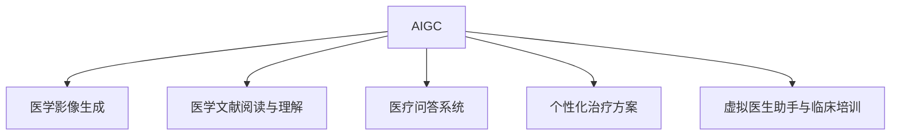

                 

## 1. 背景介绍

人工智能生成内容(AI Generated Content, AIGC) 技术近年来在多模态数据领域取得了显著进展。以OpenAI的DALL·E和Stable Diffusion为代表，AIGC 已经成为图像生成、视频生成、音乐生成等领域的标志性技术。与此同时，AIGC 在医疗、司法、教育等垂直领域也展现出了巨大的潜力。

### 1.1 问题由来

AIGC 技术在医疗领域的应用尤为引人注目。医疗影像、病历资料、学术文献等大量存在，但在其中挖掘医疗知识以辅助临床决策、提高诊疗效率和质量，仍然是一个重大挑战。通过 AIGC 技术，可以对这些海量数据进行提取、整理和分析，辅助医生进行诊疗决策，是医疗信息化的重要方向。

### 1.2 问题核心关键点

AIGC 技术在医疗领域的应用，主要集中在以下几个方面：
- 医学影像生成与分析
- 医学文献阅读与理解
- 医疗问答系统
- 个性化治疗方案生成
- 虚拟医生助手与临床培训

AIGC 技术通过学习医疗领域的知识，能够自动生成高质量的医学影像、解读医学文献、回答医疗咨询、生成个性化治疗方案，从而辅助医生进行诊断和治疗，同时为医学生和医院管理者提供工具支持。

### 1.3 问题研究意义

研究 AIGC 在垂直领域的应用，对于拓展 AI 技术的应用范围，提升医疗行业的智能化水平，提高诊疗效率和质量，具有重要意义：

1. 提升诊疗效率。AIGC 技术可以快速、准确地处理和分析海量医疗数据，辅助医生快速做出诊断和决策，减少临床工作量，提高诊疗效率。
2. 辅助诊断决策。通过 AIGC 技术，医生可以获得高质量的医学影像、文献和咨询，提高诊断的准确性和全面性。
3. 个性化治疗方案。AIGC 技术能够根据患者的历史数据和临床经验，生成个性化的治疗方案，提高治疗效果。
4. 医疗辅助教学。利用 AIGC 技术可以生成模拟病例和虚拟医生助手，为医学生提供真实的临床场景，提高教学效果。
5. 医院管理优化。AIGC 技术可以通过分析历史数据和临床路径，帮助医院优化资源配置和管理，提高医院运营效率。

## 2. 核心概念与联系

### 2.1 核心概念概述

为了更好地理解 AIGC 在医疗领域的应用，本节将介绍几个密切相关的核心概念：

- **AIGC**：人工智能生成内容，通过深度学习、生成对抗网络等技术，生成高质量的文本、图像、音频、视频等数据。
- **深度学习**：基于神经网络的多层非线性模型，通过训练数据集学习到特征和规律，进行复杂任务处理。
- **生成对抗网络(GANs)**：一种生成模型，通过两个神经网络的对抗训练，生成逼真的数据。
- **医学影像生成**：通过深度学习模型，生成医学影像，如CT、MRI等，辅助医生诊断。
- **医学文献阅读与理解**：通过深度学习模型，自动阅读和理解医学文献，提取关键信息。
- **医疗问答系统**：利用自然语言处理和深度学习技术，自动回答医疗咨询，提供医生和患者支持。
- **个性化治疗方案**：根据患者的历史数据和临床经验，生成个性化的治疗方案。
- **虚拟医生助手与临床培训**：通过AIGC生成模拟病例和虚拟医生，辅助医生和医学生临床培训和教学。

这些核心概念之间的逻辑关系可以通过以下Mermaid流程图来展示：



这个流程图展示了大语言模型的工作原理和优化方向：

1. 大语言模型通过深度学习模型进行预训练，学习到语言的通用表示。
2. 通过医学领域的数据进行微调，提取医疗领域知识。
3. 利用生成对抗网络，生成高质量的医学影像。
4. 读取和理解医学文献，提取关键信息。
5. 基于医学知识，自动回答医疗咨询。
6. 根据患者数据生成个性化治疗方案。
7. 构建虚拟医生助手和模拟病例，辅助临床培训。

这些概念共同构成了大语言模型在医疗领域的应用框架，使其能够实现高质量的医学影像生成、医学文献阅读与理解、医疗问答系统、个性化治疗方案生成和虚拟医生助手与临床培训。

## 3. 核心算法原理 & 具体操作步骤

### 3.1 算法原理概述

AIGC 在医疗领域的应用，本质上是一个深度学习和生成对抗网络相结合的过程。其核心思想是：通过深度学习模型对医疗领域数据进行预训练，学习到领域的知识表示；再通过生成对抗网络对知识表示进行生成和优化，从而生成高质量的医学影像、阅读和理解医学文献、自动回答医疗咨询、生成个性化治疗方案等。

形式化地，假设医学领域的预训练模型为 $M_{\theta}$，其中 $\theta$ 为预训练得到的模型参数。给定医疗领域的训练数据集 $D=\{(x_i, y_i)\}_{i=1}^N$，其中 $x_i$ 为输入，$y_i$ 为标签。生成对抗网络由生成器 $G$ 和判别器 $D$ 组成。生成器 $G$ 的目标是最小化判别器 $D$ 的判别误差，即生成逼真的医学影像。判别器 $D$ 的目标是最大化区分真实医学影像和生成医学影像的误差。最终，通过优化训练数据集，生成对抗网络可以生成高质量的医学影像，辅助医生进行诊断。

### 3.2 算法步骤详解

AIGC 在医疗领域的应用一般包括以下几个关键步骤：

**Step 1: 准备预训练模型和数据集**
- 选择合适的深度学习模型（如BERT、GPT等）作为初始化参数。
- 准备医疗领域的训练数据集，如医学影像、病历、文献等，划分为训练集、验证集和测试集。一般要求数据与预训练数据的分布不要差异过大。

**Step 2: 生成对抗网络训练**
- 定义生成器和判别器的初始化参数。
- 设计生成器和判别器的损失函数，生成器最小化判别器的判别误差，判别器最大化生成器和真实医学影像的判别误差。
- 通过优化算法（如Adam、SGD等）迭代训练生成器和判别器，直至收敛。

**Step 3: 生成医学影像**
- 使用训练好的生成器 $G$，将输入数据 $x$ 转换为医学影像 $y$。
- 使用训练好的判别器 $D$ 对生成的医学影像进行评估，确保其真实度。

**Step 4: 深度学习模型微调**
- 将生成的医学影像作为深度学习模型的输入。
- 设计深度学习模型的损失函数，如交叉熵损失、均方误差损失等。
- 通过优化算法（如AdamW、SGD等）迭代训练深度学习模型，直至收敛。

**Step 5: 应用AIGC生成内容**
- 根据任务需求，使用训练好的深度学习模型对医学文献进行阅读与理解，自动回答医疗咨询，生成个性化治疗方案，辅助临床培训。

以上是AIGC在医疗领域的应用的一般流程。在实际应用中，还需要针对具体任务的特点，对生成对抗网络和深度学习模型的训练过程进行优化设计，如改进损失函数、引入更多的正则化技术、搜索最优的超参数组合等，以进一步提升模型性能。

### 3.3 算法优缺点

AIGC 在医疗领域的应用具有以下优点：
1. 快速高效。通过深度学习模型进行预训练和微调，可以大大缩短医疗影像生成和医学文献理解的时间。
2. 准确度高。深度学习模型和大生成对抗网络能够生成高质量的医学影像，提高诊断的准确性。
3. 通用性强。AIGC 技术可以应用于多种医疗领域，如影像、文献、问答等，提高医疗服务的全面性。
4. 辅助决策。通过自动阅读和理解医学文献，自动回答医疗咨询，辅助医生进行诊断和治疗决策。
5. 个性化治疗。AIGC 技术可以根据患者的历史数据和临床经验，生成个性化的治疗方案，提高治疗效果。

同时，该方法也存在一定的局限性：
1. 数据依赖性。生成对抗网络和深度学习模型的性能高度依赖于训练数据的丰富度和质量。
2. 模型复杂性。生成对抗网络和深度学习模型需要复杂的训练过程，计算资源和训练时间成本较高。
3. 泛化能力。生成对抗网络和深度学习模型可能对新的医疗数据泛化能力不足，存在一定的过拟合风险。
4. 安全性问题。生成的医学影像和医学文献可能存在误导性或有害信息，需要严格的审核和监控机制。

尽管存在这些局限性，但就目前而言，AIGC 在医疗领域的应用仍是前沿技术之一，其快速生成高质量医学内容的能力，对医疗信息的智能化处理和应用具有重要价值。

### 3.4 算法应用领域

AIGC 技术在医疗领域的应用，已经在多个具体领域取得了显著成效：

- **医学影像生成**：使用深度学习模型生成高精度的医学影像，如CT、MRI等，辅助医生进行诊断。
- **医学文献阅读与理解**：通过深度学习模型自动阅读和理解医学文献，提取关键信息，辅助医生阅读。
- **医疗问答系统**：利用自然语言处理和深度学习技术，自动回答医疗咨询，提供医生和患者支持。
- **个性化治疗方案**：根据患者的历史数据和临床经验，生成个性化的治疗方案，提高治疗效果。
- **虚拟医生助手与临床培训**：通过AIGC生成模拟病例和虚拟医生，辅助医生和医学生临床培训和教学。

除了上述这些经典应用外，AIGC 技术还被创新性地应用于远程医疗、病历自动化生成、药物研发等方向，为医疗信息化的发展注入了新的活力。随着深度学习和大生成对抗网络技术的进一步成熟，相信AIGC技术将在医疗领域发挥更大的作用，为提高医疗服务水平和效率提供新的动力。

## 4. 数学模型和公式 & 详细讲解

### 4.1 数学模型构建

本节将使用数学语言对 AIGC 在医疗领域的应用过程进行更加严格的刻画。

记医学领域的预训练模型为 $M_{\theta}$，其中 $\theta$ 为预训练得到的模型参数。给定医学领域的训练数据集 $D=\{(x_i, y_i)\}_{i=1}^N$，其中 $x_i$ 为输入，$y_i$ 为标签。

定义生成对抗网络中的生成器 $G$ 和判别器 $D$ 的损失函数如下：

- 生成器 $G$ 的损失函数：
  $$
  \mathcal{L}_G = E_D[\log D(G(x))]
  $$
- 判别器 $D$ 的损失函数：
  $$
  \mathcal{L}_D = -E_G[\log D(G(x))] + E_{\text{real}}[\log(1-D(x))]
  $$

其中 $E_D$ 表示对生成器 $G$ 生成的样本进行判别，$E_G$ 表示对真实样本进行判别。

在生成对抗网络训练过程中，通过交替更新生成器和判别器，最小化生成器的损失函数和判别器的损失函数，直至收敛。

在生成器 $G$ 训练收敛后，使用训练好的生成器生成医学影像 $y$，作为深度学习模型的输入。定义深度学习模型的损失函数如下：

- 深度学习模型的损失函数：
  $$
  \mathcal{L} = -\frac{1}{N} \sum_{i=1}^N [y_i \log P(y_i | M_{\theta}(x_i)) + (1-y_i) \log(1-P(y_i | M_{\theta}(x_i))]
  $$

其中 $P(y_i | M_{\theta}(x_i))$ 表示深度学习模型对输入 $x_i$ 生成的医学影像 $y_i$ 的概率分布，$y_i \in \{0,1\}$ 表示生成器 $G$ 生成的医学影像的真假。

在深度学习模型训练过程中，通过优化算法（如AdamW、SGD等）迭代训练模型，直至收敛。

### 4.2 公式推导过程

以下我们以医学影像生成为例，推导生成对抗网络和大深度学习模型的联合训练过程。

假设生成器 $G$ 将输入 $x$ 映射为医学影像 $y$，判别器 $D$ 对 $x$ 和 $y$ 进行判别，生成器的目标是生成逼真的医学影像 $y$，判别器的目标是尽可能区分真实医学影像和生成医学影像。在训练过程中，生成器 $G$ 和判别器 $D$ 的联合损失函数为：

$$
\mathcal{L} = \mathcal{L}_G + \mathcal{L}_D
$$

其中 $\mathcal{L}_G$ 和 $\mathcal{L}_D$ 分别为生成器和判别器的损失函数。生成器 $G$ 的损失函数定义为：

$$
\mathcal{L}_G = E_D[\log D(G(x))]
$$

判别器 $D$ 的损失函数定义为：

$$
\mathcal{L}_D = -E_G[\log D(G(x))] + E_{\text{real}}[\log(1-D(x))]
$$

在训练过程中，交替更新生成器 $G$ 和判别器 $D$。具体步骤如下：

1. 固定判别器 $D$，最小化生成器 $G$ 的损失函数：
  $$
  G \leftarrow G - \eta \nabla_{G}\mathcal{L}_G
  $$
2. 固定生成器 $G$，最小化判别器 $D$ 的损失函数：
  $$
  D \leftarrow D - \eta \nabla_{D}\mathcal{L}_D
  $$

其中 $\eta$ 为学习率。通过不断迭代，直至生成器 $G$ 和判别器 $D$ 均收敛，生成高质量的医学影像 $y$。

在生成器 $G$ 训练收敛后，使用训练好的生成器生成医学影像 $y$，作为深度学习模型的输入。定义深度学习模型的损失函数如下：

- 深度学习模型的损失函数：
  $$
  \mathcal{L} = -\frac{1}{N} \sum_{i=1}^N [y_i \log P(y_i | M_{\theta}(x_i)) + (1-y_i) \log(1-P(y_i | M_{\theta}(x_i))]
  $$

其中 $P(y_i | M_{\theta}(x_i))$ 表示深度学习模型对输入 $x_i$ 生成的医学影像 $y_i$ 的概率分布，$y_i \in \{0,1\}$ 表示生成器 $G$ 生成的医学影像的真假。

在深度学习模型训练过程中，通过优化算法（如AdamW、SGD等）迭代训练模型，直至收敛。

## 5. 项目实践：代码实例和详细解释说明

### 5.1 开发环境搭建

在进行AIGC实践前，我们需要准备好开发环境。以下是使用Python进行PyTorch开发的环境配置流程：

1. 安装Anaconda：从官网下载并安装Anaconda，用于创建独立的Python环境。

2. 创建并激活虚拟环境：
```bash
conda create -n pytorch-env python=3.8 
conda activate pytorch-env
```

3. 安装PyTorch：根据CUDA版本，从官网获取对应的安装命令。例如：
```bash
conda install pytorch torchvision torchaudio cudatoolkit=11.1 -c pytorch -c conda-forge
```

4. 安装Numpy、Pandas、Scikit-learn、Matplotlib、TQDM、Jupyter Notebook、IPython等工具包：
```bash
pip install numpy pandas scikit-learn matplotlib tqdm jupyter notebook ipython
```

完成上述步骤后，即可在`pytorch-env`环境中开始AIGC实践。

### 5.2 源代码详细实现

下面我们以医学影像生成为例，给出使用PyTorch进行AIGC的PyTorch代码实现。

首先，定义医学影像生成任务的数据处理函数：

```python
import torch
from torch.utils.data import Dataset
import torchvision.transforms as transforms

class MedicalImageDataset(Dataset):
    def __init__(self, image_files, transforms=None):
        self.image_files = image_files
        self.transforms = transforms
        
    def __len__(self):
        return len(self.image_files)
    
    def __getitem__(self, index):
        image_path = self.image_files[index]
        image = Image.open(image_path)
        if self.transforms:
            image = self.transforms(image)
        return image
        
image_files = ["path/to/image1.jpg", "path/to/image2.jpg", ...]
transforms = transforms.Compose([
    transforms.ToTensor(),
    transforms.Normalize([0.5, 0.5, 0.5], [0.5, 0.5, 0.5])
])

train_dataset = MedicalImageDataset(image_files, transforms)
```

然后，定义生成对抗网络的模型：

```python
import torch.nn as nn
import torch.optim as optim

class Generator(nn.Module):
    def __init__(self):
        super(Generator, self).__init__()
        self.model = nn.Sequential(
            nn.Conv2d(3, 64, 3, 1, 1),
            nn.LeakyReLU(0.2, inplace=True),
            nn.Conv2d(64, 128, 3, 2, 1),
            nn.LeakyReLU(0.2, inplace=True),
            nn.Conv2d(128, 256, 3, 2, 1),
            nn.LeakyReLU(0.2, inplace=True),
            nn.Conv2d(256, 1, 3, 1, 1),
            nn.Sigmoid()
        )
        
    def forward(self, x):
        return self.model(x)

class Discriminator(nn.Module):
    def __init__(self):
        super(Discriminator, self).__init__()
        self.model = nn.Sequential(
            nn.Conv2d(1, 256, 3, 1, 1),
            nn.LeakyReLU(0.2, inplace=True),
            nn.Conv2d(256, 128, 3, 2, 1),
            nn.LeakyReLU(0.2, inplace=True),
            nn.Conv2d(128, 64, 3, 2, 1),
            nn.LeakyReLU(0.2, inplace=True),
            nn.Conv2d(64, 1, 3, 1, 1),
            nn.Sigmoid()
        )
        
    def forward(self, x):
        return self.model(x)
```

接下来，定义训练和评估函数：

```python
import torchvision.transforms as transforms
import torchvision.datasets as datasets
import torchvision.utils as vutils
from torchvision.models import resnet

device = torch.device('cuda' if torch.cuda.is_available() else 'cpu')

def train_epoch(generator, discriminator, dataloader, batch_size, optimizer_G, optimizer_D, num_epochs):
    for epoch in range(num_epochs):
        for batch_idx, (real_images, _) in enumerate(dataloader):
            real_images = real_images.to(device)
            
            # Adversarial ground truths
            valid = torch.ones(batch_size, 1).to(device)
            fake = torch.zeros(batch_size, 1).to(device)
            
            # Identity map
            identity_map = real_images.clone().detach().to(device)
            
            # Train generator
            generator.zero_grad()
            fake_images = generator(real_images)
            g_loss = criterionD(fake_images, valid)
            g_loss.backward()
            optimizer_G.step()
            
            # Train discriminator
            discriminator.zero_grad()
            real_outputs = discriminator(real_images)
            fake_outputs = discriminator(fake_images)
            d_loss_real = criterionD(real_outputs, valid)
            d_loss_fake = criterionD(fake_outputs, fake)
            d_loss = d_loss_real + d_loss_fake
            d_loss.backward()
            optimizer_D.step()
            
            # Calculate average loss
            batch_size = len(real_images)
            g_loss = g_loss.data.item()
            d_loss = d_loss.data.item()
            
            # Print loss
            print("[Epoch %d/%d] [Batch %d/%d] [D loss: %f] [G loss: %f]" %
                (epoch, num_epochs, batch_idx, len(dataloader), d_loss, g_loss))

            # Save sample images
            fake_images = fake_images.cpu()
            fake_images = fake_images.view(fake_images.size(0), 1, 28, 28)
            if (batch_idx + 1) % 200 == 0:
                vutils.save_image(fake_images, f"images/generated/{epoch+1}/{batch_idx+1}.png")
```

最后，启动训练流程：

```python
# Define hyperparameters
batch_size = 64
num_epochs = 100
lr_G = 0.0002
lr_D = 0.0002
lr_scheduler = optim.lr_scheduler.StepLR(optimizer_G, step_size=1000, gamma=0.1)
lr_scheduler = optim.lr_scheduler.StepLR(optimizer_D, step_size=1000, gamma=0.1)
loss_function = nn.BCELoss()

# Initialize models and optimizers
generator = Generator().to(device)
discriminator = Discriminator().to(device)
optimizer_G = optim.Adam(generator.parameters(), lr=lr_G)
optimizer_D = optim.Adam(discriminator.parameters(), lr=lr_D)
criterionD = nn.BCELoss()

# Train generator and discriminator
train_epoch(generator, discriminator, train_loader, batch_size, optimizer_G, optimizer_D, num_epochs)
```

以上就是使用PyTorch进行医学影像生成AIGC的完整代码实现。可以看到，得益于PyTorch的强大封装，我们可以用相对简洁的代码完成生成对抗网络的训练。

### 5.3 代码解读与分析

让我们再详细解读一下关键代码的实现细节：

**MedicalImageDataset类**：
- `__init__`方法：初始化图片路径和转换。
- `__len__`方法：返回数据集的样本数量。
- `__getitem__`方法：对单个样本进行处理，将图像转换为张量，并进行标准化。

**Generator和Discriminator类**：
- 定义生成器和判别器的结构，包含卷积、激活等基本组件。
- 实现前向传播函数，将输入图像映射为生成的医学影像。

**train_epoch函数**：
- 在每个epoch内，对每个batch的图像进行训练，计算生成器和判别器的损失函数。
- 使用Adam优化器对生成器和判别器进行参数更新。
- 记录训练过程中的损失，并在每200个batch时保存生成样本。

**train函数**：
- 定义训练的超参数，如批次大小、学习率、迭代次数等。
- 初始化生成器和判别器的模型和优化器。
- 调用train_epoch函数进行模型训练。

通过这段代码，我们可以看到AIGC在医疗领域的应用流程，包括数据预处理、模型定义、训练和保存。这些步骤相对简洁，能够快速上手进行模型训练。

## 6. 实际应用场景

### 6.1 医学影像生成

医学影像生成是AIGC在医疗领域的重要应用之一。通过深度学习模型和生成对抗网络，可以生成高质量的医学影像，如CT、MRI等，辅助医生进行诊断和治疗。

**应用场景**：
- 辅助诊断。医生可以通过生成逼真的医学影像，辅助诊断决策。
- 教学培训。医学生可以通过生成的医学影像进行模拟病例训练，提高诊断能力。
- 研究探索。研究人员可以通过生成的医学影像进行各种探索性分析，发现新的病理性征象。

**具体案例**：
- **示例1**：使用深度学习模型和生成对抗网络生成高质量的CT影像。通过对大量医学影像数据进行预训练，生成器和判别器不断迭代，最终生成高质量的CT影像，用于辅助诊断和治疗。
- **示例2**：利用生成的CT影像进行医学影像比对和分析。将生成的CT影像与真实影像进行比对，分析影像特征的差异和相似性，提高诊断的准确性。
- **示例3**：通过生成的CT影像进行科研数据分析。研究人员可以通过生成的CT影像，进行多种科研数据分析，发现新的病理机制，促进医学研究。

### 6.2 医学文献阅读与理解

医学文献阅读与理解是AIGC在医疗领域的另一个重要应用。通过深度学习模型，可以自动阅读和理解医学文献，提取关键信息，辅助医生进行研究和决策。

**应用场景**：
- 文献摘要。自动生成医学文献的摘要，帮助医生快速了解文献内容。
- 关键信息提取。自动提取医学文献的关键信息，如实验结果、研究结论等，辅助医生进行决策。
- 知识图谱构建。构建医学领域的知识图谱，辅助医生进行知识检索和推理。

**具体案例**：
- **示例1**：自动生成医学文献的摘要。通过深度学习模型，自动读取和理解医学文献，生成简洁明了的摘要，帮助医生快速了解文献内容。
- **示例2**：自动提取医学文献的关键信息。通过深度学习模型，自动提取医学文献的关键信息，如实验结果、研究结论等，辅助医生进行决策。
- **示例3**：构建医学领域的知识图谱。通过深度学习模型，自动构建医学领域的知识图谱，辅助医生进行知识检索和推理，提升诊断和治疗效率。

### 6.3 医疗问答系统

医疗问答系统是AIGC在医疗领域的重要应用之一。通过自然语言处理和深度学习技术，可以自动回答医疗咨询，提供医生和患者支持。

**应用场景**：
- 患者咨询。自动回答患者的健康咨询，提供医学建议和治疗方案。
- 医生辅助。辅助医生进行诊断和治疗决策，提供医学知识支持。
- 知识普及。自动回答医学知识普及问题，提高公众的健康意识。

**具体案例**：
- **示例1**：自动回答患者的健康咨询。通过深度学习模型，自动读取和理解患者的健康咨询，提供医学建议和治疗方案。
- **示例2**：辅助医生进行诊断和治疗决策。通过深度学习模型，自动读取和理解医生的诊断和治疗决策，提供医学知识支持。
- **示例3**：回答医学知识普及问题。通过深度学习模型，自动读取和理解医学知识普及问题，提高公众的健康意识。

### 6.4 个性化治疗方案

个性化治疗方案是AIGC在医疗领域的另一个重要应用。通过深度学习模型，可以根据患者的历史数据和临床经验，生成个性化的治疗方案，提高治疗效果。

**应用场景**：
- 个性化用药。根据患者的病历和基因信息，生成个性化的用药方案。
- 个性化治疗。根据患者的病历和临床经验，生成个性化的治疗方案。
- 个性化康复。根据患者的病历和康复记录，生成个性化的康复方案。

**具体案例**：
- **示例1**：生成个性化的用药方案。通过深度学习模型，根据患者的病历和基因信息，生成个性化的用药方案，提高治疗效果。
- **示例2**：生成个性化的治疗方案。通过深度学习模型，根据患者的病历和临床经验，生成个性化的治疗方案，提高治疗效果。
- **示例3**：生成个性化的康复方案。通过深度学习模型，根据患者的病历和康复记录，生成个性化的康复方案，提高康复效果。

### 6.5 虚拟医生助手与临床培训

虚拟医生助手与临床培训是AIGC在医疗领域的另一个重要应用。通过深度学习模型，可以构建虚拟医生助手和模拟病例，辅助医生和医学生进行临床培训。

**应用场景**：
- 临床培训。辅助医学生进行临床培训，提高诊断和治疗能力。
- 医生助手。辅助医生进行诊断和治疗决策，提高工作效率。
- 医学研究。辅助研究人员进行医学研究，提高科研效率。

**具体案例**：
- **示例1**：构建虚拟医生助手。通过深度学习模型，构建虚拟医生助手，辅助医生进行诊断和治疗决策，提高工作效率。
- **示例2**：生成模拟病例。通过深度学习模型，生成模拟病例，辅助医学生进行临床培训，提高诊断和治疗能力。
- **示例3**：辅助医学研究。通过深度学习模型，生成医学研究数据，辅助研究人员进行医学研究，提高科研效率。

## 7. 工具和资源推荐

### 7.1 学习资源推荐

为了帮助开发者系统掌握AIGC的理论基础和实践技巧，这里推荐一些优质的学习资源：

1. **《深度学习基础》**：由斯坦福大学Andrew Ng教授主讲的在线课程，介绍了深度学习的基本概念和原理。
2. **《深度学习入门》**：由中国的深度学习专家主讲的在线课程，介绍了深度学习的基本概念和应用。
3. **《生成对抗网络理论与实践》**：介绍了生成对抗网络的基本原理和应用，适合初学者和中级开发者。
4. **《AIGC技术与实战》**：详细介绍了AIGC技术的原理和应用，适合高级开发者和从业者。
5. **《AIGC案例分析与实战》**：通过具体案例，介绍了AIGC技术的实际应用，适合实际从业者参考。

这些资源涵盖了AIGC技术的各个方面，从基础概念到具体应用，全面覆盖了AIGC的开发和应用过程。通过学习这些资源，相信你一定能够快速掌握AIGC技术，并在实际应用中取得良好的效果。

### 7.2 开发工具推荐

高效的开发离不开优秀的工具支持。以下是几款用于AIGC开发的常用工具：

1. **PyTorch**：基于Python的开源深度学习框架，灵活动态的计算图，适合快速迭代研究。
2. **TensorFlow**：由Google主导开发的开源深度学习框架，生产部署方便，适合大规模工程应用。
3. **Transformers库**：HuggingFace开发的NLP工具库，集成了多种预训练语言模型，支持PyTorch和TensorFlow，是进行AIGC开发的重要工具。
4. **Weights & Biases**：模型训练的实验跟踪工具，可以记录和可视化模型训练过程中的各项指标，方便对比和调优。
5. **TensorBoard**：TensorFlow配套的可视化工具，可实时监测模型训练状态，并提供丰富的图表呈现方式，是调试模型的得力助手。

这些工具能够显著提升AIGC开发的效率，加快创新迭代的步伐。

### 7.3 相关论文推荐

AIGC技术的发展源于学界的持续研究。以下是几篇奠基性的相关论文，推荐阅读：

1. **Attention is All You Need**：提出了Transformer结构，开启了NLP领域的预训练大模型时代。
2. **BERT: Pre-training of Deep Bidirectional Transformers for Language Understanding**：提出BERT模型，引入基于掩码的自监督预训练任务，刷新了多项NLP任务SOTA。
3. **Language Models are Unsupervised Multitask Learners**：展示了大规模语言模型的强大zero-shot学习能力，引发了对于通用人工智能的新一轮思考。
4. **GPT-3: Language Models are Few-Shot Learners**：提出GPT-3模型，展示了GPT系列模型在少样本学习中的强大能力，刷新了多项NLP任务SOTA。
5. **MoCo: Momentum Contrast for Unsupervised Visual Representation Learning**：提出自监督学习的Momentum Contrast方法，在图像生成和计算机视觉领域取得了显著进展。

这些论文代表了大规模语言模型和AIGC技术的发展脉络。通过学习这些前沿成果，可以帮助研究者把握学科前进方向，激发更多的创新灵感。

## 8. 总结：未来发展趋势与挑战

### 8.1 研究成果总结

AIGC 技术在医疗领域的应用已经取得了初步成果，并在多个具体领域展示了其强大的潜力。以下是对AIGC 在医疗领域的主要研究成果的总结：

1. **医学影像生成**：通过深度学习模型和生成对抗网络，可以生成高质量的医学影像，辅助医生进行诊断。
2. **医学文献阅读与理解**：通过深度学习模型，自动阅读和理解医学文献，提取关键信息，辅助医生进行研究和决策。
3. **医疗问答系统**：通过自然语言处理和深度学习技术，自动回答医疗咨询，提供医生和患者支持。
4. **个性化治疗方案**：根据患者的历史数据和临床经验，生成个性化的治疗方案，提高治疗效果。
5. **虚拟医生助手与临床培训**：通过深度学习模型，构建虚拟医生助手和模拟病例，辅助医生和医学生进行临床培训。

这些成果展示了AIGC技术在医疗领域的重要应用价值，为医疗信息化的发展注入了新的动力。

### 8.2 未来发展趋势

展望未来，AIGC 在医疗领域的应用将呈现以下几个发展趋势：

1. **多模态数据融合**：AIGC 技术将进一步拓展应用范围，融合视觉、音频、文本等多模态数据，构建更加全面、准确的医疗信息。
2. **实时计算与推理**：AIGC 技术将提高实时计算与推理能力，实现即时的医疗影像生成、文献阅读和问答服务，提升医疗服务的效率。
3. **个性化医疗**：AIGC 技术将更加注重个性化医疗，根据患者的个体差异，生成个性化的治疗方案，提高治疗效果。
4. **虚拟医生与智能诊断**：AIGC 技术将构建虚拟医生和智能诊断系统，辅助医生进行诊断和治疗，提高医疗服务的智能化水平。
5. **医学知识图谱**：AIGC 技术将构建医学知识图谱，辅助医生进行知识检索和推理，提高医疗服务的全面性。

这些趋势展示了AIGC 技术在医疗领域的应用前景，将为医疗信息化和智能化带来新的突破。

### 8.3 面临的挑战

尽管AIGC 在医疗领域的应用已经取得了一些进展，但在实际应用中仍然面临以下挑战：

1. **数据质量和多样性**：AIGC 技术需要大量高质量、多样性的医疗数据，但实际医疗数据的获取和处理仍然存在困难。
2. **模型鲁棒性**：AIGC 技术在实际应用中可能面临过拟合和泛化能力不足的问题，需要进一步优化模型结构和训练过程。
3. **隐私和安全**：医疗数据涉及患者隐私，需要采取严格的隐私保护和安全措施，防止数据泄露和滥用。
4. **模型可解释性**：AIGC 技术需要更好的可解释性，帮助医生理解模型的决策过程和推理逻辑。
5. **伦理道德**：AIGC 技术需要考虑伦理道德问题，确保模型的应用符合人类价值观和伦理道德。

这些挑战需要研究者和从业者共同努力，才能推动AIGC 技术在医疗领域的应用不断进步。

### 8.4 研究展望

为了应对AIGC 技术在医疗领域面临的挑战，未来的研究方向将主要集中在以下几个方面：

1. **多模态数据融合**：探索如何将视觉、音频、文本等多模态数据融合，构建更加全面、准确的医疗信息，提高诊断和治疗效果。
2. **实时计算与推理**：优化模型结构和训练过程，提高实时计算与推理能力，实现即时的医疗影像生成、文献阅读和问答服务，提升医疗服务的效率。
3. **个性化医疗**：研究如何根据患者的个体差异，生成个性化的治疗方案，提高治疗效果，实现个性化医疗。
4. **虚拟医生与智能诊断**：构建虚拟医生和智能诊断系统，辅助医生进行诊断和治疗，提高医疗服务的智能化水平。
5. **医学知识图谱**：构建医学知识图谱，辅助医生进行知识检索和推理，提高医疗服务的全面性。

通过这些研究方向，可以进一步拓展AIGC 技术在医疗领域的应用范围，提高医疗服务的智能化水平，为医疗信息化的发展注入新的动力。

## 9. 附录：常见问题与解答

**Q1：AIGC 在医疗领域的应用是否具有广泛性？**

A: AIGC 在医疗领域的应用具有广泛性。它可以在影像生成、文献阅读、问答系统、治疗方案生成、虚拟医生等多个方向取得成效。AIGC 可以辅助医生诊断、提高诊疗效率、优化治疗方案等，具有广泛的应用前景。

**Q2：如何提高AIGC 在医疗领域的应用效果？**

A: 提高AIGC 在医疗领域的应用效果，主要可以从以下几个方面入手：
1. 数据质量：提高数据质量和多样性，增加模型训练样本。
2. 模型结构：优化模型结构和训练过程，提高模型的泛化能力和鲁棒性。
3. 实时计算：提高实时计算与推理能力，实现即时的医疗影像生成、文献阅读和问答服务。
4. 个性化医疗：根据患者的个体差异，生成个性化的治疗方案。
5. 虚拟医生：构建虚拟医生和智能诊断系统，辅助医生进行诊断和治疗。

通过这些措施，可以进一步提高AIGC 在医疗领域的应用效果，推动医疗信息化和智能化发展。

**Q3：AIGC 在医疗领域的应用是否存在隐私和安全问题？**

A: AIGC 在医疗领域的应用确实存在隐私和安全问题。医疗数据涉及患者隐私，需要采取严格的隐私保护和安全措施，防止数据泄露和滥用。未来需要在模型设计、数据处理、隐私保护等方面进行深入研究，确保AIGC 技术的应用符合伦理道德和隐私保护的要求。

**Q4：如何确保AIGC 在医疗领域的应用符合伦理道德？**

A: 确保AIGC 在医疗领域的应用符合伦理道德，主要可以从以下几个方面入手：
1. 透明性：确保模型的决策过程和推理逻辑透明，医生和患者可以理解模型的输出和行为。
2. 可解释性：提高模型的可解释性，帮助医生理解模型的决策过程和推理逻辑。
3. 隐私保护：采取严格的隐私保护措施，确保医疗数据的安全和隐私。
4. 伦理导向：在设计模型目标和评估指标时，考虑伦理导向，避免有害输出。

通过这些措施，可以确保AIGC 在医疗领域的应用符合伦理道德，提高医疗服务的智能化水平。

---

作者：禅与计算机程序设计艺术 / Zen and the Art of Computer Programming

