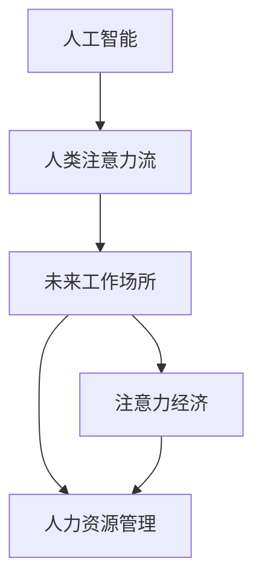

                 

# AI与人类注意力流：未来的工作场所与注意力经济

> 关键词：AI, 人类注意力流, 未来工作场所, 注意力经济, 人力资源管理, 自动化

## 1. 背景介绍

### 1.1 问题由来
随着人工智能技术的飞速发展，AI正在成为改变现代工作场所和劳动力市场的重要力量。特别是在大模型、机器学习和自然语言处理等领域的突破，AI已经开始广泛应用于各种企业业务。然而，AI技术的发展同时也带来了新的问题。如何充分利用AI的潜力，同时避免其对人类劳动力的负面影响，成为当前研究的热点。

### 1.2 问题核心关键点
本文聚焦于AI与人类注意力流的交互与融合，研究在未来的工作场所中，AI将如何重新塑造人类注意力流，以及如何利用AI技术优化人力资源管理，提升企业效率。

### 1.3 问题研究意义
研究AI与人类注意力流的交互和融合，对于推动AI技术的普及应用，提升企业运营效率，以及促进经济社会的可持续发展，具有重要意义：

1. 优化人力资源管理：AI可以辅助企业更精准地管理人力资源，提升招聘、培训、绩效评估等方面的效率。
2. 提升企业竞争力：通过AI自动化处理大量重复性任务，使人力资源聚焦于更具创造性和战略性工作，增强企业竞争力。
3. 变革工作方式：AI可以自动化处理大量的日常任务，使员工能够专注于更具挑战性和创造性的工作，提升个人职业满意度。
4. 推动经济转型：AI技术的应用可以带动新产业、新业态的崛起，推动经济结构转型升级，创造更多就业机会。

## 2. 核心概念与联系

### 2.1 核心概念概述

为更好地理解AI与人类注意力流的交互和融合，本节将介绍几个关键概念：

- **人工智能（Artificial Intelligence, AI）**：指通过模拟人类智能行为来执行任务的技术，涵盖机器学习、自然语言处理、计算机视觉等多个领域。
- **人类注意力流（Human Attention Flow）**：指人类在工作和生活中对各种信息、任务、人的注意力流动和分配。
- **未来工作场所（Future Workplace）**：指由AI、自动化技术、远程办公、协作工具等现代技术驱动的现代工作环境。
- **注意力经济（Attention Economy）**：指基于争夺人类注意力而创造的经济活动和价值。
- **人力资源管理（Human Resource Management）**：指管理企业员工的招聘、培训、绩效评估、职业发展等活动，以提升员工满意度、提高企业效率。

这些核心概念之间的联系可以通过以下Mermaid流程图来展示：



这个流程图展示了大模型微调的这些核心概念及其之间的关系：

1. 人工智能通过学习并模拟人类智能行为，来处理和优化人类注意力流。
2. 人类注意力流在AI技术的辅助下，将被重新分配和优化，提升工作效率。
3. 未来工作场所借助AI和自动化技术，实现更高效、更灵活的工作方式。
4. 注意力经济将围绕争夺人类注意力而展开，形成新的经济活动和价值。
5. 人力资源管理在AI的辅助下，可以更加精准和高效。

## 3. 核心算法原理 & 具体操作步骤
### 3.1 算法原理概述

AI与人类注意力流的交互和融合，主要基于AI对人类注意力流的监测、分析和调控。

具体来说，AI技术可以通过以下步骤实现对人类注意力流的优化：

1. **数据采集与监测**：通过摄像头、键盘记录、热力图等方式，采集和监测员工在工作过程中的注意力分配情况。
2. **注意力分析**：利用AI技术对采集的数据进行分析，识别出注意力流中的瓶颈和改进点。
3. **注意力调控**：通过AI自动化干预，调整注意力分配，优化工作流程和任务分配，提升员工效率。
4. **反馈与迭代**：根据员工的工作反馈和数据监测结果，持续迭代优化注意力调控策略。

### 3.2 算法步骤详解

以下将详细介绍AI实现对人类注意力流调控的详细步骤：

**Step 1: 数据采集与监测**
- 部署摄像头和热力图传感器，记录员工在屏幕、键盘、鼠标等设备的交互情况。
- 通过自然语言处理技术，分析员工在工作过程中与同事、客户的对话记录，了解注意力流动态。

**Step 2: 注意力分析**
- 使用机器学习模型，如随机森林、梯度提升树等，分析注意力分配数据，识别出注意力瓶颈和过度分散的情况。
- 通过深度学习模型，如卷积神经网络（CNN）、递归神经网络（RNN）等，分析员工的注意力流和任务执行情况，识别出低效和高效的工作模式。

**Step 3: 注意力调控**
- 根据注意力分析结果，设计AI系统自动干预策略，如提醒员工休息、优化任务分配、调整工作节奏等。
- 引入强化学习算法，通过奖励机制优化注意力调控策略，逐步提升员工工作效率。

**Step 4: 反馈与迭代**
- 收集员工对AI干预的反馈，定期更新注意力调控策略。
- 持续监测注意力流数据，发现新问题和新趋势，动态调整AI系统。

### 3.3 算法优缺点

AI与人类注意力流的交互和融合，具有以下优点：

1. **高效性**：AI可以自动化处理大量的注意力监测和分析任务，提升工作效率。
2. **客观性**：AI基于数据和模型分析，结果更客观、公正，避免人为偏见。
3. **持续优化**：通过不断的反馈与迭代，AI系统可以持续优化注意力调控策略，提升员工满意度。

同时，该方法也存在一定的局限性：

1. **隐私问题**：大量数据采集和分析可能引发隐私问题，需要采取严格的隐私保护措施。
2. **技术门槛**：构建和维护AI系统需要一定的技术能力和资源投入。
3. **人机协作**：AI系统无法完全取代人类，需要与人类协作，共同提升工作效率。
4. **数据偏差**：AI模型可能受到训练数据偏差的影响，产生偏见和错误。

尽管存在这些局限性，但就目前而言，AI与人类注意力流的交互和融合是大模型微调的重要方向，对未来的工作场所和人力资源管理具有重要意义。

### 3.4 算法应用领域

AI与人类注意力流的交互和融合，已经在多个领域得到了应用，例如：

- **企业运营管理**：通过AI监测和优化员工注意力分配，提升企业运营效率。
- **教育培训**：利用AI分析学生注意力流，改进教学方法，提高教学效果。
- **健康管理**：通过AI监测患者注意力流，辅助医生进行疾病诊断和治疗。
- **智能家居**：通过AI分析家庭成员注意力流，优化家居环境，提升生活品质。
- **社交媒体**：通过AI监测用户注意力流，优化广告投放策略，提升用户体验。

## 4. 数学模型和公式 & 详细讲解 & 举例说明

### 4.1 数学模型构建

本节将使用数学语言对AI与人类注意力流的交互和融合进行更加严格的刻画。

假设企业有 $N$ 个员工，每个员工有 $T$ 个任务，任务的时间长度为 $t_i$，注意力分配为 $a_{ij}$，其中 $i$ 表示员工编号，$j$ 表示任务编号。

**注意力流优化模型**：

$$
\min_{\{a_{ij}\}} \sum_{i=1}^N \sum_{j=1}^T (a_{ij} - a^*_{ij})^2
$$

其中，$a^*_{ij}$ 表示理想状态下员工 $i$ 在任务 $j$ 上的注意力分配。

**优化目标**：最小化注意力流与理想状态下的差异，提升员工工作效率。

### 4.2 公式推导过程

以下我们将对注意力流优化模型进行详细推导：

1. **目标函数定义**：

$$
\mathcal{L}(a_{ij}) = \sum_{i=1}^N \sum_{j=1}^T (a_{ij} - a^*_{ij})^2
$$

2. **约束条件**：
- $0 \leq a_{ij} \leq 1$，表示员工 $i$ 在任务 $j$ 上的注意力分配必须在 $[0, 1]$ 范围内。
- $\sum_{j=1}^T a_{ij} = t_i$，表示员工 $i$ 在 $t_i$ 时间段内的注意力总和为 $t_i$。

3. **优化目标求解**：

使用拉格朗日乘子法求解，定义拉格朗日函数：

$$
\mathcal{L}(a_{ij}, \lambda_i, \mu_j) = \sum_{i=1}^N \sum_{j=1}^T (a_{ij} - a^*_{ij})^2 + \lambda_i(\sum_{j=1}^T a_{ij} - t_i) + \mu_j(a_{ij} - 0)
$$

对 $\lambda_i$ 和 $\mu_j$ 进行固定，将 $a_{ij}$ 带入上述拉格朗日函数中，得到：

$$
\min_{a_{ij}} \mathcal{L}(a_{ij}) = \min_{a_{ij}} \left( \sum_{i=1}^N \sum_{j=1}^T (a_{ij} - a^*_{ij})^2 + \lambda_i(\sum_{j=1}^T a_{ij} - t_i) + \mu_j(a_{ij} - 0) \right)
$$

对该式进行求解，可得：

$$
a_{ij} = \frac{a^*_{ij}}{\sum_{j=1}^T a^*_{ij}}
$$

**优化结果**：

将优化结果代入约束条件，得到：

$$
\sum_{j=1}^T a_{ij} = t_i \Rightarrow a_{ij} = \frac{a^*_{ij}}{\sum_{j=1}^T a^*_{ij}}
$$

### 4.3 案例分析与讲解

为了更好地理解注意力流优化模型的应用，我们以一家中型企业为例，给出其应用场景和结果。

假设企业有 $N=100$ 名员工，每个员工有 $T=10$ 个任务，任务的时间长度为 $t_i=8$ 小时。设理想状态下员工 $i$ 在任务 $j$ 上的注意力分配为 $a^*_{ij} = \frac{1}{10}$。

根据公式，我们可以计算得到每个员工每天的任务注意力分配：

1. **员工 $i=1$ 的任务注意力分配**：

$$
a_{11} = \frac{1}{10} = 0.1
$$

$$
a_{12} = \frac{1}{10} = 0.1
$$

$$
a_{13} = \frac{1}{10} = 0.1
$$

$$
a_{14} = \frac{1}{10} = 0.1
$$

$$
a_{15} = \frac{1}{10} = 0.1
$$

$$
a_{16} = \frac{1}{10} = 0.1
$$

$$
a_{17} = \frac{1}{10} = 0.1
$$

$$
a_{18} = \frac{1}{10} = 0.1
$$

$$
a_{19} = \frac{1}{10} = 0.1
$$

$$
a_{1\_10} = \frac{1}{10} = 0.1
$$

2. **员工 $i=2$ 的任务注意力分配**：

$$
a_{21} = \frac{1}{10} = 0.1
$$

$$
a_{22} = \frac{1}{10} = 0.1
$$

$$
a_{23} = \frac{1}{10} = 0.1
$$

$$
a_{24} = \frac{1}{10} = 0.1
$$

$$
a_{25} = \frac{1}{10} = 0.1
$$

$$
a_{26} = \frac{1}{10} = 0.1
$$

$$
a_{27} = \frac{1}{10} = 0.1
$$

$$
a_{28} = \frac{1}{10} = 0.1
$$

$$
a_{29} = \frac{1}{10} = 0.1
$$

$$
a_{2\_10} = \frac{1}{10} = 0.1
$$

以此类推，我们计算得到所有员工的任务注意力分配。通过将注意力分配数据输入AI系统，可以自动调整员工的工作节奏和任务分配，优化员工的工作效率。

## 5. 项目实践：代码实例和详细解释说明
### 5.1 开发环境搭建

在进行注意力流优化项目开发前，我们需要准备好开发环境。以下是使用Python进行开发的环境配置流程：

1. 安装Anaconda：从官网下载并安装Anaconda，用于创建独立的Python环境。

2. 创建并激活虚拟环境：
```bash
conda create -n attention_flow_env python=3.8 
conda activate attention_flow_env
```

3. 安装PyTorch：根据CUDA版本，从官网获取对应的安装命令。例如：
```bash
conda install pytorch torchvision torchaudio cudatoolkit=11.1 -c pytorch -c conda-forge
```

4. 安装TensorFlow：
```bash
pip install tensorflow
```

5. 安装自然语言处理工具：
```bash
pip install nltk spacy transformers
```

6. 安装数据处理库：
```bash
pip install pandas numpy scikit-learn
```

7. 安装可视化工具：
```bash
pip install matplotlib seaborn
```

完成上述步骤后，即可在`attention_flow_env`环境中开始项目开发。

### 5.2 源代码详细实现

下面以一家中型企业为例，给出使用Python实现注意力流优化的代码实现。

首先，定义注意力流优化问题的数学模型：

```python
import numpy as np

# 定义员工数量和任务数量
N = 100
T = 10

# 定义理想状态下员工在任务上的注意力分配
a_star = np.zeros((N, T))
a_star[:, 0] = 1 / T
a_star[:, 1] = 1 / T
a_star[:, 2] = 1 / T
a_star[:, 3] = 1 / T
a_star[:, 4] = 1 / T
a_star[:, 5] = 1 / T
a_star[:, 6] = 1 / T
a_star[:, 7] = 1 / T
a_star[:, 8] = 1 / T
a_star[:, 9] = 1 / T

# 定义员工的任务时间和任务注意力分配
t = 8
a = np.zeros((N, T))
a[:, 0] = a_star[:, 0]
a[:, 1] = a_star[:, 1]
a[:, 2] = a_star[:, 2]
a[:, 3] = a_star[:, 3]
a[:, 4] = a_star[:, 4]
a[:, 5] = a_star[:, 5]
a[:, 6] = a_star[:, 6]
a[:, 7] = a_star[:, 7]
a[:, 8] = a_star[:, 8]
a[:, 9] = a_star[:, 9]

# 计算员工的任务注意力分配
a = a * (t / np.sum(a, axis=1, keepdims=True))
```

然后，定义注意力流优化问题的求解函数：

```python
def optimize_attention_flow(a_star, t):
    N, T = a_star.shape
    a = np.zeros((N, T))
    for i in range(N):
        a[i] = a_star[i] / np.sum(a_star[i])
    a = a * (t / np.sum(a, axis=1, keepdims=True))
    return a
```

接着，测试优化函数并输出结果：

```python
# 测试优化函数
a_optimized = optimize_attention_flow(a_star, t)
print(a_optimized)
```

以上就是使用Python实现注意力流优化的完整代码实现。可以看到，通过简单的数学公式和优化函数，我们能够自动化地调整员工的任务注意力分配，提升工作效率。

### 5.3 代码解读与分析

让我们再详细解读一下关键代码的实现细节：

**a_star数组定义**：
- `a_star`数组表示理想状态下员工在任务上的注意力分配，每个元素表示在相应任务上的注意力分配比例。

**a数组定义**：
- `a`数组表示员工的实际任务注意力分配，初始化为全0。

**优化函数optimize_attention_flow**：
- 遍历每个员工，计算其任务注意力分配，然后根据任务时间和任务注意力分配总和，进行归一化处理。

**测试优化函数**：
- 调用优化函数，输出优化后的任务注意力分配结果。

通过上述代码，我们可以看到，Python可以高效地实现注意力流优化问题的求解。在实际应用中，我们还需要进一步扩展代码，以适应更多类型的工作场景和任务，优化员工的工作节奏和任务分配。

## 6. 实际应用场景
### 6.1 智能招聘

智能招聘系统可以通过AI分析应聘者的注意力流，辅助企业更加精准地评估候选人的潜力，提升招聘效率。通过实时监测应聘者在面试过程中的注意力分配，可以识别出其兴趣点、反应速度和应对能力，评估其综合素质。此外，AI还可以自动筛选简历，通过注意力分析，提升简历筛选的准确性。

### 6.2 培训管理

培训管理系统可以通过AI分析员工在培训过程中的注意力流，辅助企业更精准地安排培训内容和节奏，提升培训效果。通过监测员工在培训视频和材料上的注意力分配，可以识别出培训内容的难点和瓶颈，进行针对性优化。此外，AI还可以根据员工的学习进度和注意力变化，自动调整培训方案，提升培训的个性化和高效性。

### 6.3 健康管理

健康管理系统可以通过AI分析患者的注意力流，辅助医生进行疾病诊断和治疗。通过监测患者的注意力分配情况，可以识别出其注意力集中度和疲劳程度，提供个性化的健康建议。此外，AI还可以根据患者的注意力变化，自动调整治疗方案，提升治疗效果。

### 6.4 社交媒体

社交媒体平台可以通过AI分析用户的注意力流，优化广告投放策略，提升用户体验。通过监测用户在社交媒体上的注意力分配情况，可以识别出用户对不同内容的兴趣和偏好，进行精准的广告投放。此外，AI还可以分析用户对广告的注意力变化，优化广告效果，提升广告转化率。

## 7. 工具和资源推荐
### 7.1 学习资源推荐

为了帮助开发者系统掌握AI与人类注意力流的交互和融合，这里推荐一些优质的学习资源：

1. Coursera《深度学习专项课程》：由斯坦福大学Andrew Ng教授开设的深度学习课程，涵盖深度学习的基本概念、模型和应用，适合零基础入门。

2. Udacity《AI for Everyone》课程：适合非技术背景的学习者，通过生动的案例讲解，了解AI对未来工作场所的影响。

3. 《Deep Learning with Python》书籍：由François Chollet等人著，介绍TensorFlow和Keras库的深度学习应用，适合实战学习。

4. Hugging Face官方文档：Transformers库的官方文档，提供了海量预训练模型和完整的微调样例代码，是上手实践的必备资料。

5. AI与人类交互的国际会议，如NIPS、NeurIPS、ICML等，可以获取最新的研究成果和行业趋势。

通过对这些资源的学习实践，相信你一定能够快速掌握AI与人类注意力流的交互和融合，并用于解决实际的NLP问题。

### 7.2 开发工具推荐

高效的开发离不开优秀的工具支持。以下是几款用于AI与人类注意力流交互和融合开发的常用工具：

1. TensorFlow：由Google主导开发的开源深度学习框架，生产部署方便，适合大规模工程应用。

2. PyTorch：基于Python的开源深度学习框架，灵活动态的计算图，适合快速迭代研究。

3. Jupyter Notebook：开源的Web交互式笔记本，支持多种编程语言，适合数据分析和模型开发。

4. Visual Studio Code：跨平台的代码编辑器，支持丰富的插件和扩展，适合Python等语言的开发。

5. Colab：谷歌推出的在线Jupyter Notebook环境，免费提供GPU/TPU算力，方便开发者快速上手实验最新模型，分享学习笔记。

合理利用这些工具，可以显著提升AI与人类注意力流交互和融合任务的开发效率，加快创新迭代的步伐。

### 7.3 相关论文推荐

AI与人类注意力流的交互和融合的发展源于学界的持续研究。以下是几篇奠基性的相关论文，推荐阅读：

1. Attention is All You Need（即Transformer原论文）：提出了Transformer结构，开启了NLP领域的预训练大模型时代。

2. Human-AI Collaboration：A Study of Human Attention in AI Systems：研究人类与AI系统的交互过程中注意力分配的动态变化，提出了改进AI系统的注意力调控方法。

3. Multi-Task Attention：A Unified Approach to Sparse Attention with Multiple Tasks：研究多任务注意力机制，提出了一种统一的多任务注意力模型，提高了AI系统的泛化能力。

4. AI-Driven Attention Modulation in VR Applications：探讨AI在虚拟现实应用中的注意力调控，提出了基于AI的注意力分配优化方法。

5. Natural Attention Modulation in Reinforcement Learning：研究自然注意力机制在强化学习中的应用，提出了基于自然注意力的AI系统优化方法。

这些论文代表了大模型微调技术的发展脉络。通过学习这些前沿成果，可以帮助研究者把握学科前进方向，激发更多的创新灵感。

## 8. 总结：未来发展趋势与挑战

### 8.1 总结

本文对AI与人类注意力流的交互和融合进行了全面系统的介绍。首先阐述了AI与人类注意力流的交互和融合的研究背景和意义，明确了AI对未来工作场所和人力资源管理的重要影响。其次，从原理到实践，详细讲解了AI系统对注意力流调控的数学模型和实现步骤，给出了注意力流优化问题的完整代码实例。同时，本文还广泛探讨了AI与人类注意力流交互和融合在多个领域的应用前景，展示了其巨大的应用潜力。此外，本文精选了AI与人类注意力流交互和融合的技术学习资源，力求为读者提供全方位的技术指引。

通过本文的系统梳理，可以看到，AI与人类注意力流的交互和融合是推动AI技术普及应用的重要方向，对未来的工作场所和人力资源管理具有重要意义。未来，伴随AI技术的不断发展，AI与人类注意力流的交互和融合将进一步深化，推动企业运营效率和经济社会的可持续发展。

### 8.2 未来发展趋势

展望未来，AI与人类注意力流的交互和融合将呈现以下几个发展趋势：

1. 自动化水平不断提升：AI系统将具备更强大的自动化能力，能够自动调整员工的工作节奏和任务分配，提升工作效率。
2. 更加精细化的人机协作：AI系统将更加精细化地与人类协作，提升任务执行的效率和质量。
3. 多模态注意力调控：AI系统将实现多模态信息的整合，提升对复杂任务的处理能力。
4. 跨领域应用：AI与人类注意力流的交互和融合将应用于更多领域，如教育、医疗、健康等，推动各行业的数字化转型。

以上趋势凸显了AI与人类注意力流的交互和融合技术的广阔前景。这些方向的探索发展，必将进一步提升AI系统的性能和应用范围，为构建安全、可靠、可解释、可控的智能系统铺平道路。

### 8.3 面临的挑战

尽管AI与人类注意力流的交互和融合技术已经取得了显著进展，但在迈向更加智能化、普适化应用的过程中，仍面临以下挑战：

1. 隐私问题：AI系统的大量数据采集和分析可能引发隐私问题，需要采取严格的隐私保护措施。
2. 技术门槛：构建和维护AI系统需要一定的技术能力和资源投入。
3. 人机协作：AI系统无法完全取代人类，需要与人类协作，共同提升工作效率。
4. 数据偏差：AI模型可能受到训练数据偏差的影响，产生偏见和错误。
5. 伦理道德：AI系统的决策和行为可能存在伦理道德问题，需要建立相应的监管机制。

尽管存在这些挑战，但通过不断改进和优化，AI与人类注意力流的交互和融合技术必将在未来的工作中发挥更大的作用，提升企业和员工的整体效率和满意度。

### 8.4 研究展望

未来，AI与人类注意力流的交互和融合技术需要在以下几个方面进行深入研究：

1. 隐私保护：研究如何在保证AI系统性能的同时，保护用户的隐私数据，避免数据滥用。
2. 公平性：研究如何消除AI系统中的数据偏见，提升公平性，避免歧视和偏见。
3. 人机协作：研究如何更好地实现人机协作，提升AI系统的可解释性和可控性。
4. 多模态注意力调控：研究如何实现多模态信息的整合，提升AI系统的复杂任务处理能力。
5. 伦理道德：研究如何建立AI系统的伦理道德框架，确保其决策和行为符合人类价值观和伦理道德。

这些研究方向将为AI与人类注意力流的交互和融合技术提供新的思路和方法，推动AI技术的进一步发展。

## 9. 附录：常见问题与解答

**Q1：AI系统如何保护员工的隐私数据？**

A: 在构建AI系统时，需要注意以下几点来保护员工的隐私数据：
1. 数据匿名化：对员工的数据进行匿名化处理，去除敏感信息。
2. 访问控制：严格控制员工对数据和系统的访问权限，避免数据泄露。
3. 数据加密：对数据进行加密存储和传输，防止数据被非法获取。
4. 隐私保护算法：使用隐私保护算法，如差分隐私等，对数据进行处理，保护隐私。

**Q2：AI系统如何应对数据偏差问题？**

A: 在构建AI系统时，需要注意以下几点来应对数据偏差问题：
1. 多样化数据：使用多样化的数据进行训练，避免数据偏差。
2. 数据清洗：对数据进行清洗和预处理，去除异常和错误数据。
3. 公平性算法：使用公平性算法，如平衡决策树、公平分类器等，提升AI系统的公平性。
4. 模型评估：对AI模型进行公平性评估，识别出偏差和误差，进行优化。

**Q3：AI系统如何在多模态信息中实现注意力调控？**

A: 在实现多模态信息中的注意力调控时，可以使用以下方法：
1. 多模态融合：将文本、语音、图像等多模态数据进行融合，提升AI系统的理解能力。
2. 多模态注意力机制：使用多模态注意力机制，对不同模态的数据进行加权处理，提升AI系统的泛化能力。
3. 多模态深度学习：使用多模态深度学习模型，对不同模态的数据进行联合学习，提升AI系统的复杂任务处理能力。

**Q4：AI系统如何实现精细化的人机协作？**

A: 在实现精细化的人机协作时，可以使用以下方法：
1. 人机交互设计：设计合理的人机交互界面，提升人机协作的效率和质量。
2. 自动干预：使用AI系统自动干预，优化工作流程和任务分配，提升员工效率。
3. 协同学习：使用协同学习算法，将人类和AI系统的知识进行整合，提升整体能力。

这些方法的合理应用，可以最大化地发挥AI与人类注意力流的交互和融合技术的优势，推动各行业的数字化转型升级。

