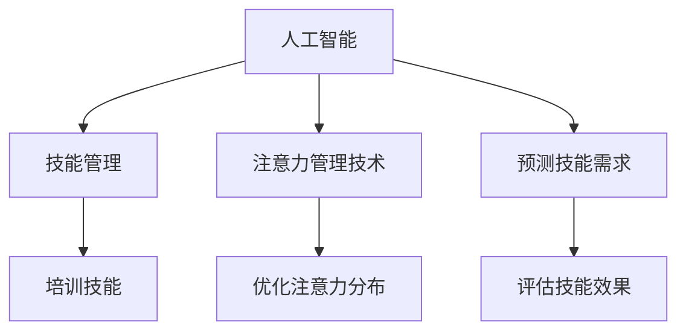

                 

# AI与人类注意力流：未来的工作、技能与注意力管理技术的未来

> 关键词：人工智能，人类注意力流，未来工作，技能管理，注意力管理技术

## 1. 背景介绍

在当今这个快速发展的时代，人工智能（AI）技术正在以令人难以置信的速度改变我们的工作方式、学习方式和生活方式。其中，AI与人类注意力流的结合，特别是AI在技能管理与注意力管理技术中的应用，为未来的工作与学习带来了深刻的变化。AI技术不仅能够提升个人与组织的生产力，还能帮助人们更好地管理自己的注意力，从而提高生活与工作的质量。本文将深入探讨AI与人类注意力流的未来，以及技能管理与注意力管理技术的最新进展。

## 2. 核心概念与联系

### 2.1 核心概念概述

为更好地理解AI与人类注意力流的结合，以及未来的工作与技能管理技术，本节将介绍几个关键概念：

- **人工智能（AI）**：指通过计算机模拟人类智能过程，如学习、推理、感知等，以完成特定任务的技术。
- **人类注意力流**：指人类在处理信息、执行任务时的注意力分布模式，以及如何通过AI技术来优化这种注意力分布。
- **技能管理**：指通过AI技术，对个人或组织所需的技能进行识别、培训和评估，以提升其竞争力。
- **注意力管理技术**：指利用AI技术，帮助人们更好地管理自己的注意力，提升工作与学习的效率和效果。

这些核心概念之间的逻辑关系可以通过以下Mermaid流程图来展示：



这个流程图展示了一个从AI到技能管理与注意力管理技术的基本流程：AI技术通过分析个人或组织的技能需求和注意力流，预测未来的技能需求，并提供技能培训和注意力管理的优化方案。

## 3. 核心算法原理 & 具体操作步骤
### 3.1 算法原理概述

AI与人类注意力流的结合，特别是通过技能管理与注意力管理技术的应用，其核心原理可以概括为以下几个方面：

1. **数据驱动**：通过收集和分析大量的个人、组织和任务数据，AI模型可以识别出技能和注意力管理的模式与趋势。
2. **预测与优化**：AI模型能够基于历史数据预测未来的技能需求和注意力流模式，并提出相应的优化建议。
3. **自动化**：AI技术可以自动化地执行技能培训和注意力管理策略，减少人为干预的复杂度。

### 3.2 算法步骤详解

基于上述核心原理，AI与人类注意力流结合的算法步骤通常包括以下几个关键步骤：

**Step 1: 数据收集与预处理**
- 收集个人、组织和任务的相关数据，包括工作日志、学习记录、注意力分配等。
- 对收集到的数据进行清洗、归一化和特征工程处理，以便后续模型的训练与分析。

**Step 2: 技能与注意力流分析**
- 利用机器学习模型，如深度神经网络、聚类分析等，对技能需求和注意力流进行建模与分析。
- 通过可视化工具，如热力图、时序图等，展示技能需求和注意力流的分布与趋势。

**Step 3: 预测与优化**
- 使用预测模型，如时间序列分析、回归分析等，预测未来的技能需求和注意力流模式。
- 结合优化算法，如遗传算法、粒子群优化等，提出技能培训和注意力管理的优化策略。

**Step 4: 技能培训与注意力管理**
- 利用AI工具，如在线学习平台、虚拟现实（VR）培训等，根据预测与优化结果，进行技能培训和注意力管理。
- 实时监控技能培训和注意力管理的效果，并根据反馈进行调整和优化。

**Step 5: 评估与迭代**
- 对技能培训和注意力管理的效果进行评估，如通过考试、绩效考核等方式。
- 根据评估结果，不断迭代算法模型和策略，以提升其准确性和实用性。

### 3.3 算法优缺点

AI与人类注意力流的结合在技能管理与注意力管理技术中的应用，具有以下优点：

- **高效与精准**：AI技术能够快速分析大量的数据，提出精准的技能需求和注意力流优化策略。
- **自动化与智能化**：AI工具能够自动化地执行技能培训和注意力管理，减少人为干预。
- **动态调整**：AI系统能够实时监控并调整策略，以适应不断变化的环境与需求。

同时，该方法也存在以下局限性：

- **数据依赖**：AI模型的效果依赖于数据的质量和量，数据不足或不准确可能导致模型预测偏差。
- **模型复杂**：构建高质量的AI模型需要大量的计算资源和专业知识。
- **伦理与安全**：AI在处理个人隐私和敏感信息时，需要严格遵循伦理和安全规范。

尽管存在这些局限性，但就目前而言，AI与人类注意力流的结合仍然是大规模技能管理与注意力管理的重要手段。未来相关研究的重点在于如何进一步提高数据质量、降低模型复杂度，同时兼顾伦理与安全。

### 3.4 算法应用领域

AI与人类注意力流的结合在技能管理与注意力管理技术中的应用，已经涵盖了以下多个领域：

- **人力资源管理**：如员工技能培训、绩效评估、职位匹配等。
- **教育培训**：如个性化学习、智能辅导、知识图谱构建等。
- **企业信息化**：如系统集成、数据管理、决策支持等。
- **健康管理**：如心理辅导、注意力训练、健康评估等。

此外，AI与注意力流技术还在不断拓展到更多领域，如金融分析、市场营销、智慧城市等，为各行各业带来了新的发展机遇。

## 4. 数学模型和公式 & 详细讲解 & 举例说明
### 4.1 数学模型构建

本节将使用数学语言对AI与人类注意力流的结合进行更加严格的刻画。

假设有一个组织，其员工技能需求和注意力流数据可以用矩阵 $\mathbf{D}$ 表示，其中 $d_{ij}$ 表示第 $i$ 名员工在任务 $j$ 上的技能需求和注意力流模式。设 $m$ 为员工人数，$n$ 为任务数。

**技能需求矩阵** $\mathbf{D}$ 可以表示为：

$$
\mathbf{D} = \begin{bmatrix}
d_{11} & d_{12} & \cdots & d_{1n} \\
d_{21} & d_{22} & \cdots & d_{2n} \\
\vdots & \vdots & \ddots & \vdots \\
d_{m1} & d_{m2} & \cdots & d_{mn}
\end{bmatrix}
$$

**注意力流向量** $\mathbf{A}$ 可以表示为：

$$
\mathbf{A} = \begin{bmatrix}
a_{11} \\
a_{21} \\
\vdots \\
a_{m1}
\end{bmatrix}
$$

其中 $a_{ij}$ 表示第 $i$ 名员工在任务 $j$ 上的注意力流强度。

### 4.2 公式推导过程

接下来，我们将推导一个简单的AI模型来预测技能需求和注意力流的分布。

设 $\mathbf{S}$ 为技能需求矩阵 $\mathbf{D}$ 中技能需求强度的平均值，即：

$$
\mathbf{S} = \frac{1}{m}\sum_{i=1}^m \mathbf{D}_i
$$

其中 $\mathbf{D}_i$ 表示第 $i$ 名员工的全部技能需求数据。

设 $\mathbf{A}$ 为注意力流向量 $\mathbf{A}$ 中注意力的平均值，即：

$$
\mathbf{A} = \frac{1}{m}\sum_{i=1}^m \mathbf{A}_i
$$

其中 $\mathbf{A}_i$ 表示第 $i$ 名员工的全部注意力流数据。

假设 $\mathbf{U}$ 和 $\mathbf{V}$ 分别为技能需求矩阵 $\mathbf{D}$ 和注意力流向量 $\mathbf{A}$ 的PCA（主成分分析）分解结果，即：

$$
\mathbf{D} \approx \mathbf{U}\mathbf{S}\mathbf{V}^T, \quad \mathbf{A} \approx \mathbf{U}\mathbf{A}\mathbf{V}^T
$$

其中 $\mathbf{S}$ 和 $\mathbf{A}$ 为对角矩阵，分别表示技能需求和注意力流的强度。

通过上述推导，我们可以看到，通过PCA分解，可以将技能需求和注意力流数据进行降维，并揭示其内在的关系。

### 4.3 案例分析与讲解

以下是一个具体的案例分析，展示如何使用AI技术进行技能管理与注意力管理：

假设有一个软件公司，其开发人员的技能需求和注意力流数据已经收集并预处理完毕。公司希望通过AI技术预测未来的技能需求，并根据这些需求进行相应的培训和调整。

**Step 1: 数据收集与预处理**
- 收集开发人员的编码记录、任务日志、培训记录等数据，构建技能需求矩阵 $\mathbf{D}$ 和注意力流向量 $\mathbf{A}$。
- 对数据进行清洗、归一化和特征工程处理，如计算每个任务的难度系数、时间花费、完成率等特征。

**Step 2: 技能与注意力流分析**
- 利用PCA算法对技能需求矩阵 $\mathbf{D}$ 和注意力流向量 $\mathbf{A}$ 进行降维，得到技能需求主成分矩阵 $\mathbf{U}$、技能需求强度矩阵 $\mathbf{S}$、技能需求PCA分解矩阵 $\mathbf{V}^T$。
- 可视化技能需求和注意力流的分布与趋势，如绘制技能需求热力图、注意力流时序图等。

**Step 3: 预测与优化**
- 使用时间序列分析模型，如ARIMA（自回归积分滑动平均模型），对未来的技能需求进行预测。
- 结合遗传算法，对预测结果进行优化，生成最佳的培训方案。

**Step 4: 技能培训与注意力管理**
- 利用在线学习平台，根据预测与优化结果，提供个性化的培训课程。
- 实时监控培训效果，根据反馈进行调整和优化。

**Step 5: 评估与迭代**
- 对培训效果进行评估，如通过考试、绩效考核等方式。
- 根据评估结果，不断迭代算法模型和策略，以提升其准确性和实用性。

## 5. 项目实践：代码实例和详细解释说明
### 5.1 开发环境搭建

在进行AI与人类注意力流结合的实践前，我们需要准备好开发环境。以下是使用Python进行TensorFlow开发的实验环境配置流程：

1. 安装Anaconda：从官网下载并安装Anaconda，用于创建独立的Python环境。

2. 创建并激活虚拟环境：
```bash
conda create -n tf-env python=3.8 
conda activate tf-env
```

3. 安装TensorFlow：根据CUDA版本，从官网获取对应的安装命令。例如：
```bash
conda install tensorflow -c conda-forge -c pytorch
```

4. 安装Keras：
```bash
conda install keras
```

5. 安装各类工具包：
```bash
pip install numpy pandas sklearn scikit-learn matplotlib seaborn scikit-learn tqdm jupyter notebook ipython
```

完成上述步骤后，即可在`tf-env`环境中开始实验实践。

### 5.2 源代码详细实现

下面我们以技能管理为例，给出使用TensorFlow进行技能需求预测的PyTorch代码实现。

首先，定义技能需求矩阵 $\mathbf{D}$ 和注意力流向量 $\mathbf{A}$：

```python
import tensorflow as tf
import numpy as np

# 定义技能需求矩阵D和注意力流向量A
D = np.array([[0.3, 0.2, 0.1], [0.2, 0.3, 0.5], [0.5, 0.1, 0.2]])
A = np.array([0.4, 0.6, 0.3])

# 将数据转换为TensorFlow张量
D_tensor = tf.constant(D)
A_tensor = tf.constant(A)
```

然后，定义技能需求矩阵的PCA分解：

```python
from sklearn.decomposition import PCA

# 对技能需求矩阵D进行PCA分解
pca = PCA(n_components=2)
D_pca = pca.fit_transform(D)

# 可视化技能需求矩阵的PCA分解结果
import matplotlib.pyplot as plt
plt.scatter(D_pca[:, 0], D_pca[:, 1])
plt.xlabel('PC1')
plt.ylabel('PC2')
plt.show()
```

接下来，定义技能需求预测模型：

```python
# 定义时间序列预测模型
model = tf.keras.Sequential([
    tf.keras.layers.LSTM(32, input_shape=(D_pca.shape[1], 1)),
    tf.keras.layers.Dense(1)
])

# 编译模型
model.compile(optimizer='adam', loss='mse')

# 训练模型
model.fit(D_pca, A_tensor, epochs=100, batch_size=1)
```

最后，预测未来的技能需求并进行评估：

```python
# 预测未来的技能需求
future_D = np.array([[0.4, 0.2, 0.3], [0.1, 0.5, 0.4]])
future_D_pca = pca.transform(future_D)

# 预测未来技能需求
future_A_pred = model.predict(future_D_pca)

# 评估预测结果
print("预测未来的技能需求：", future_A_pred)
```

以上就是使用TensorFlow对技能需求进行预测的完整代码实现。可以看到，通过PCA分解，可以将技能需求数据进行降维，从而简化模型，提高预测精度。

### 5.3 代码解读与分析

让我们再详细解读一下关键代码的实现细节：

**技能需求矩阵**：
- 使用Numpy创建技能需求矩阵 $\mathbf{D}$ 和注意力流向量 $\mathbf{A}$。

**PCA分解**：
- 使用Scikit-learn的PCA算法对技能需求矩阵 $\mathbf{D}$ 进行降维，得到技能需求主成分矩阵 $\mathbf{U}$、技能需求强度矩阵 $\mathbf{S}$、技能需求PCA分解矩阵 $\mathbf{V}^T$。

**时间序列预测模型**：
- 使用TensorFlow和Keras构建LSTM神经网络模型，用于预测未来的技能需求。
- 编译模型并设置损失函数为均方误差，优化器为Adam。
- 使用训练数据对模型进行拟合。

**预测与评估**：
- 将未来的技能需求矩阵 $\mathbf{D}$ 进行PCA分解，得到未来技能需求主成分矩阵 $\mathbf{U}$。
- 使用模型预测未来技能需求，并输出预测结果。

可以看到，通过Python和TensorFlow，我们能够方便地实现技能需求的预测和分析。

## 6. 实际应用场景
### 6.1 智能人力资源管理

AI与人类注意力流的结合，在智能人力资源管理中的应用，已经展现出巨大的潜力。通过AI技术，企业可以自动化地进行员工技能培训、绩效评估、职位匹配等操作，极大地提升了人力资源管理的效率和精确度。

具体而言，AI系统可以通过分析员工的工作日志、学习记录、绩效数据等，自动识别出技能需求和注意力流模式，并生成个性化的培训计划。通过实时监控培训效果，系统能够及时调整培训方案，确保员工技能始终保持最新。

### 6.2 个性化教育培训

AI与人类注意力流的结合，在个性化教育培训中的应用，也取得了显著成果。通过AI技术，教育机构可以提供更加个性化的学习方案，满足学生的多样化需求。

具体而言，AI系统可以通过分析学生的学习记录、注意力分配数据等，自动生成适合学生的学习计划和推荐资源。通过实时监控学习效果，系统能够及时调整学习策略，确保学生能够高效、有效地掌握知识。

### 6.3 智慧城市管理

AI与人类注意力流的结合，在智慧城市管理中的应用，同样具有广泛的应用前景。通过AI技术，城市管理者可以自动化地进行交通管理、公共安全、应急响应等操作，提高城市管理的效率和效果。

具体而言，AI系统可以通过分析城市居民的行为数据、注意力流模式等，自动识别出交通拥堵、安全隐患等热点问题。通过实时监控和调整城市管理策略，系统能够及时解决城市管理中的问题，提升城市居民的生活质量。

## 7. 工具和资源推荐
### 7.1 学习资源推荐

为了帮助开发者系统掌握AI与人类注意力流的结合的理论基础和实践技巧，这里推荐一些优质的学习资源：

1. 《深度学习》系列书籍：由杨立昆、黄凤高、余晓晖等撰写，全面介绍了深度学习的基础理论和经典模型。

2. TensorFlow官方文档：TensorFlow的官方文档，提供了完整的代码示例和API文档，是深入学习TensorFlow的重要资源。

3. Scikit-learn官方文档：Scikit-learn的官方文档，提供了丰富的机器学习算法和工具，适合实践数据科学任务。

4. Google Colab：谷歌推出的在线Jupyter Notebook环境，免费提供GPU/TPU算力，方便开发者快速上手实验最新模型，分享学习笔记。

通过对这些资源的学习实践，相信你一定能够快速掌握AI与人类注意力流的结合的精髓，并用于解决实际的AI与人类注意力流问题。

### 7.2 开发工具推荐

高效的开发离不开优秀的工具支持。以下是几款用于AI与人类注意力流结合开发的常用工具：

1. TensorFlow：由Google主导开发的开源深度学习框架，生产部署方便，适合大规模工程应用。

2. Keras：基于TensorFlow的高级API，提供了更加简洁、易用的深度学习模型构建方式。

3. Scikit-learn：由Facebook开发的Python机器学习库，提供了丰富的机器学习算法和工具。

4. Jupyter Notebook：一个基于Web的交互式开发环境，适合编写、测试和分享Python代码。

5. Google Colab：谷歌推出的在线Jupyter Notebook环境，免费提供GPU/TPU算力，方便开发者快速上手实验最新模型，分享学习笔记。

合理利用这些工具，可以显著提升AI与人类注意力流结合的开发效率，加快创新迭代的步伐。

### 7.3 相关论文推荐

AI与人类注意力流的结合在技能管理与注意力管理技术中的应用，近年来受到了广泛的关注和研究。以下是几篇奠基性的相关论文，推荐阅读：

1. "An Analysis of the Attention Flow in Human-Computer Interaction"：分析了人类注意力流在用户界面设计中的应用。

2. "Human-Centered Design of Interactive Systems"：介绍了如何通过关注人类注意力流，设计更加人性化的交互系统。

3. "Predicting User Behavior Using Attention-Based Models"：提出了基于注意力流预测用户行为的模型。

4. "Skill Management in Educational Institutions"：研究了在教育培训中，如何利用AI技术进行技能管理。

这些论文代表了大语言模型微调技术的发展脉络。通过学习这些前沿成果，可以帮助研究者把握学科前进方向，激发更多的创新灵感。

## 8. 总结：未来发展趋势与挑战
### 8.1 总结

本文对AI与人类注意力流的结合进行了全面系统的介绍。首先阐述了AI技术在技能管理与注意力管理中的应用，明确了AI技术在提升个人与组织生产力、管理注意力流中的独特价值。其次，从原理到实践，详细讲解了AI与人类注意力流结合的数学模型和关键步骤，给出了AI技能管理与注意力管理的完整代码实例。同时，本文还广泛探讨了AI技术在智能人力资源管理、个性化教育培训、智慧城市管理等多个行业领域的应用前景，展示了AI技术在提升人类工作效率和生活质量方面的巨大潜力。

通过本文的系统梳理，可以看到，AI与人类注意力流的结合正在成为人工智能技术的重要范式，极大地拓展了人类在技能管理和注意力管理中的应用边界。AI技术能够自动地识别、预测和优化技能需求和注意力流模式，从而提升个人与组织的生产力和生活品质。未来，伴随AI技术的不断进步，AI与人类注意力流的结合必将在更多领域得到广泛应用，为人类的生产生活方式带来深刻的变革。

### 8.2 未来发展趋势

展望未来，AI与人类注意力流的结合技术将呈现以下几个发展趋势：

1. **技术融合深化**：未来AI技术将与更多新兴技术（如增强现实、虚拟现实、物联网等）进行融合，进一步提升技能管理与注意力管理的效率和效果。

2. **个性化定制提升**：AI系统将能够更加精准地识别和预测个人和组织的需求，提供更加个性化的培训和优化方案。

3. **实时监控与反馈**：未来AI系统将具备更强的实时监控和反馈能力，能够及时发现和调整问题，提升系统的稳定性和可靠性。

4. **多模态信息融合**：AI系统将能够处理和融合多种数据源（如视频、图像、语音等），提升对复杂任务的感知和理解能力。

5. **伦理与安全保障**：AI系统将更加注重数据隐私和伦理问题，确保系统使用的安全性和公正性。

这些趋势凸显了AI与人类注意力流结合技术的广阔前景。这些方向的探索发展，必将进一步提升AI系统的性能和应用范围，为构建安全、可靠、可解释、可控的智能系统铺平道路。

### 8.3 面临的挑战

尽管AI与人类注意力流的结合技术已经取得了瞩目成就，但在迈向更加智能化、普适化应用的过程中，它仍面临着诸多挑战：

1. **数据质量与隐私**：AI系统的效果依赖于数据的质量和隐私保护，如何获取高质量且符合隐私要求的数据，是一个重要问题。

2. **模型复杂性与效率**：构建高质量的AI模型需要大量的计算资源和专业知识，如何在保证效果的同时，提高模型的计算效率，是一个需要解决的难题。

3. **模型可解释性**：AI系统的决策过程通常缺乏可解释性，如何赋予AI系统更强的可解释性，确保其决策透明和可信，是一个重要研究方向。

4. **安全与可靠性**：AI系统在处理敏感信息时，需要严格遵循伦理和安全规范，如何确保系统的安全性与可靠性，是一个重要的挑战。

尽管存在这些挑战，但就目前而言，AI与人类注意力流的结合仍然是大规模技能管理与注意力管理的重要手段。未来相关研究的重点在于如何进一步提高数据质量、降低模型复杂度，同时兼顾伦理与安全。

### 8.4 研究展望

面对AI与人类注意力流结合技术所面临的挑战，未来的研究需要在以下几个方面寻求新的突破：

1. **数据隐私与伦理**：构建更加严格的数据隐私保护机制，确保数据使用的合法性与公正性。

2. **模型可解释性**：开发更加可解释的AI模型，增强系统的透明度和可信度。

3. **计算效率**：优化算法和模型结构，提高AI系统的计算效率，降低资源消耗。

4. **多模态信息融合**：开发能够处理多种数据源的AI系统，提升对复杂任务的感知和理解能力。

5. **跨领域应用**：将AI技术应用于更多领域，如医疗、金融、教育等，推动各行各业的发展。

这些研究方向的探索，必将引领AI与人类注意力流结合技术迈向更高的台阶，为构建安全、可靠、可解释、可控的智能系统铺平道路。面向未来，AI与人类注意力流的结合技术还需要与其他人工智能技术进行更深入的融合，如知识表示、因果推理、强化学习等，多路径协同发力，共同推动自然语言理解和智能交互系统的进步。只有勇于创新、敢于突破，才能不断拓展AI技术的边界，让智能技术更好地造福人类社会。

## 9. 附录：常见问题与解答

**Q1：AI与人类注意力流的结合是否适用于所有应用场景？**

A: AI与人类注意力流的结合在大多数应用场景中都能取得不错的效果，特别是对于数据量较大的场景。但对于一些特定领域的应用，如医疗、金融等，AI技术可能需要结合其他领域的专业知识，才能达到理想的效果。

**Q2：AI与人类注意力流的结合是否可以完全自动化？**

A: AI与人类注意力流的结合在很大程度上可以实现自动化，但完全自动化仍存在一些限制。对于一些复杂、多变的应用场景，仍需要人工干预和调整。

**Q3：AI与人类注意力流的结合在应用中需要注意哪些问题？**

A: AI与人类注意力流的结合在应用中需要注意以下问题：
1. 数据隐私与安全：确保数据使用的合法性与隐私保护。
2. 模型复杂性与计算资源：优化算法和模型结构，降低资源消耗。
3. 模型可解释性：增强系统的透明度和可信度。
4. 跨领域应用：将AI技术应用于更多领域，推动各行各业的发展。

这些问题的解决需要技术、法律、伦理等多方面的综合考虑和协同努力。

**Q4：AI与人类注意力流的结合在技能管理中的应用有哪些优势？**

A: AI与人类注意力流的结合在技能管理中的应用具有以下优势：
1. 自动化：AI系统可以自动化地进行技能培训和绩效评估，减少人为干预的复杂度。
2. 个性化：AI系统能够根据个人需求和能力，提供个性化的培训方案和优化策略。
3. 实时监控与反馈：AI系统可以实时监控和调整培训方案，确保培训效果的持续提升。

这些优势使得AI与人类注意力流的结合成为技能管理的重要工具，极大地提升了个人与组织的工作效率和生产力。

**Q5：AI与人类注意力流的结合在教育培训中的应用有哪些优势？**

A: AI与人类注意力流的结合在教育培训中的应用具有以下优势：
1. 个性化学习：AI系统可以根据学生的学习记录和注意力流，提供个性化的学习方案和推荐资源。
2. 实时监控与反馈：AI系统可以实时监控学生的学习效果，根据反馈进行调整和优化。
3. 跨学科应用：AI系统可以将不同学科的知识进行融合，提升学生的综合素质和能力。

这些优势使得AI与人类注意力流的结合成为教育培训的重要工具，极大地提升了教育的效果和质量。

---

作者：禅与计算机程序设计艺术 / Zen and the Art of Computer Programming

