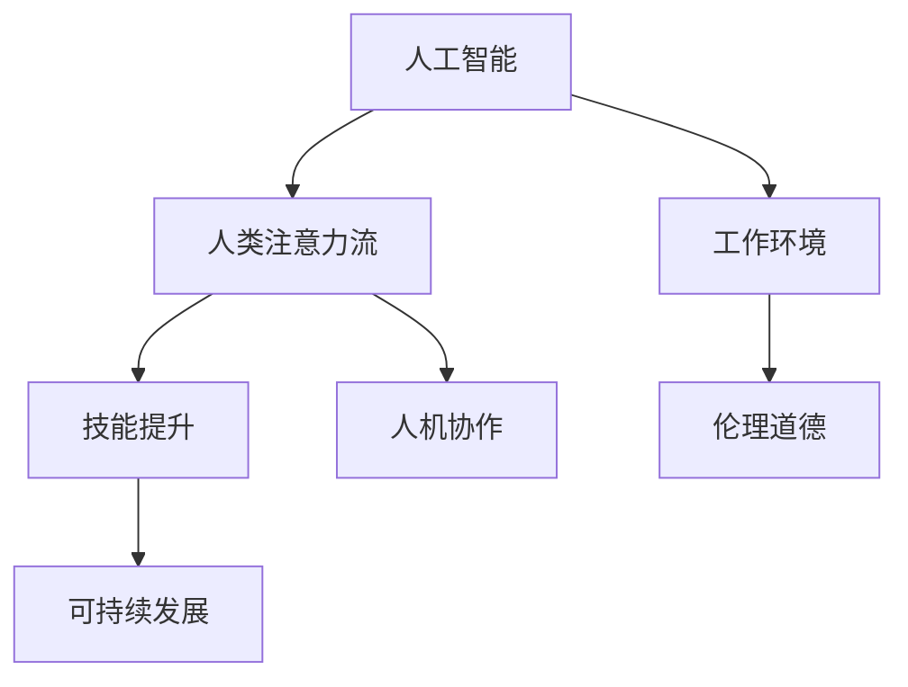

                 

# AI与人类注意力流：未来的工作、技能和道德

> 关键词：人工智能(AI)、人类注意力流、工作变革、技能提升、伦理道德

## 1. 背景介绍

### 1.1 问题由来
在21世纪，人工智能(AI)技术取得了飞速发展，广泛应用于各行各业，极大地改变了人类的生产和生活方式。然而，AI的发展也引发了一系列伦理、道德和社会问题，特别是在工作中人类与AI的关系处理上，亟需新的理解和应对策略。

### 1.2 问题核心关键点
未来，AI将成为人类工作的重要辅助工具，甚至在某些领域取代人类工作。这一变化带来了一系列挑战和机遇，要求我们重新审视人类注意力流在AI应用中的作用和意义。

1. **工作变革**：AI在自动化、智能化上的突破，将深刻改变传统的工作形态，促使人类劳动力市场进行重新配置。
2. **技能提升**：为适应AI带来的工作环境变化，人类需要提升相关技能，如数据分析、编程、AI应用等。
3. **伦理道德**：AI的发展和应用涉及到隐私、安全性、公平性等伦理道德问题，需要在技术设计和管理层面进行规范。
4. **人机协作**：AI与人类之间的互动关系将成为未来工作的重要形态，需要构建良性的协作机制。
5. **可持续发展**：AI技术应用应促进社会可持续发展，避免资源过度消耗和环境破坏。

这些关键点反映了AI与人类注意力流之间的复杂关系，需要在技术、伦理、经济等多维度进行深入思考和讨论。

### 1.3 问题研究意义
理解AI与人类注意力流的互动关系，有助于我们更好地应对未来工作环境的变化，提升人类的适应能力和竞争力，同时确保AI技术的发展符合社会伦理道德规范。

## 2. 核心概念与联系

### 2.1 核心概念概述

为更好地理解AI与人类注意力流的关系，本节将介绍几个核心概念：

- **人工智能(AI)**：指能够通过数据和算法自主学习和执行任务的计算机系统。
- **人类注意力流**：指人类在工作和生活中对信息、任务和环境的关注和认知流动过程。
- **工作环境**：指人类完成任务的环境，包括物理空间、社交网络、信息流等。
- **技能提升**：指通过学习和培训，提升个体或群体在特定领域的知识和能力。
- **伦理道德**：指指导个人和组织行为的价值和规范体系，包括隐私保护、公平正义、可持续发展等原则。
- **人机协作**：指AI与人类在任务执行、信息处理、决策制定等方面的合作互动。
- **可持续发展**：指在满足当前需求的同时，不损害后代满足需求能力的发展模式。

这些概念之间的逻辑关系可以通过以下Mermaid流程图来展示：



这个流程图展示了几大核心概念及其之间的关系：

1. AI与人类注意力流的互动，影响工作环境的构成。
2. 工作环境的变化驱动技能提升。
3. 伦理道德在技术应用中起到指导和规范作用。
4. 人机协作成为未来工作的重要形态。
5. 可持续发展是AI技术应用的重要目标。

## 3. 核心算法原理 & 具体操作步骤

### 3.1 算法原理概述

AI与人类注意力流的互动关系，可以通过信息流模型来描述。假定一个工作环境由AI系统和人类组成，人类与AI之间的信息流动可以抽象为信息流网络。

**信息流模型**：
1. **信息节点**：代表工作中的各种信息、任务和环境元素，如数据、任务描述、工具等。
2. **节点连边**：表示不同信息节点之间的连接关系，如数据流、任务依赖关系等。
3. **节点权重**：表示信息节点在信息流中的重要性，如数据量、任务难度、环境复杂度等。

**注意力流模型**：
1. **注意力节点**：表示人类在工作中的注意力集中点，如任务、信息源、工具等。
2. **节点权重**：表示人类对不同节点关注程度，如任务优先级、信息源信任度等。
3. **流向关系**：表示注意力节点之间的转移路径，如任务切换、信息检索等。

### 3.2 算法步骤详解

基于信息流和注意力流模型，AI与人类注意力流的互动可以表示为以下步骤：

**Step 1: 构建信息流网络**
- 收集工作环境中各种信息节点和节点连边的数据。
- 定义节点权重，反映信息节点在环境中的重要性。
- 构建信息流网络，描述不同信息节点之间的连接关系。

**Step 2: 建立注意力流模型**
- 通过调研和观察，收集人类在工作中的注意力节点数据。
- 定义节点权重，反映人类对不同节点的关注程度。
- 建立注意力流模型，描述注意力节点之间的转移路径。

**Step 3: 运行信息流和注意力流**
- 在信息流网络中，通过AI系统自动处理数据和任务，形成数据流和任务流。
- 在注意力流模型中，人类根据任务需求和环境变化，调整注意力集中点。
- 通过交互界面或API，AI与人类进行信息交互和任务协作。

**Step 4: 优化信息流和注意力流**
- 根据AI的执行结果和人类反馈，调整信息节点和连边的权重，优化信息流网络。
- 根据人类的工作效果和满意度，调整注意力节点和流向关系的权重，优化注意力流模型。
- 在优化过程中，引入机器学习算法，自动调整节点权重和连边关系，提升系统整体效率。

### 3.3 算法优缺点

基于信息流和注意力流模型，AI与人类注意力流的互动有以下优点：

1. **自动化信息处理**：AI可以自动处理大量信息，减少人类工作负担。
2. **提高决策效率**：通过信息流和注意力流的优化，提升决策的准确性和及时性。
3. **人机协同**：AI与人类共同完成任务，提升整体工作效率和质量。
4. **个性化适配**：根据人类的工作习惯和偏好，自动调整信息流和注意力流，提高工作舒适度。

同时，该方法也存在以下局限性：

1. **数据依赖**：信息流和注意力流的优化依赖大量数据支持，数据质量直接影响效果。
2. **技术复杂性**：模型构建和运行需要一定的技术门槛，需要专业人员的维护。
3. **隐私风险**：收集和分析人类注意力流涉及隐私问题，需确保数据安全和隐私保护。
4. **伦理道德**：AI与人类互动过程中，需考虑伦理道德问题，避免歧视和偏见。
5. **资源消耗**：优化信息流和注意力流需要消耗大量计算资源，可能导致成本上升。

尽管存在这些局限性，但就目前而言，基于信息流和注意力流模型的AI应用，已经展现出其在提升工作效率、优化工作环境等方面的巨大潜力。

### 3.4 算法应用领域

基于AI与人类注意力流的互动关系，信息流和注意力流模型已经在多个领域得到应用，例如：

- **智能办公**：通过信息流和注意力流优化，提升办公自动化水平，减少重复性工作。
- **工业生产**：在生产过程中引入AI系统，自动处理数据和任务，优化生产流程。
- **医疗诊断**：通过信息流和注意力流分析，辅助医生进行诊断和治疗决策。
- **教育培训**：根据学习者注意力流，个性化推荐学习内容和路径，提升学习效果。
- **金融分析**：通过信息流和注意力流分析，自动化处理金融数据，提升投资和风险管理效率。

除了这些常见领域，AI与人类注意力流的互动关系还在更多场景中得到应用，如智能家居、智慧城市、自动驾驶等，为各行各业带来变革性影响。

## 4. 数学模型和公式 & 详细讲解 & 举例说明

### 4.1 数学模型构建

本节将使用数学语言对信息流和注意力流模型的构建进行更加严格的刻画。

假定工作环境中有 $N$ 个信息节点和 $M$ 个注意力节点，信息流网络由 $G=(V,E,W)$ 表示，其中：
- $V$ 为信息节点集合。
- $E$ 为节点连边集合。
- $W$ 为节点权重集合。

注意力流模型由 $G'=(V',E',W')$ 表示，其中：
- $V'$ 为注意力节点集合。
- $E'$ 为节点连边集合。
- $W'$ 为节点权重集合。

定义信息流节点 $v_i$ 在时刻 $t$ 的流量 $f_{i,t}$，表示在 $t$ 时刻，从节点 $v_i$ 到其他节点的信息流量。定义注意力节点 $v_j$ 在时刻 $t$ 的流量 $a_{j,t}$，表示在 $t$ 时刻，人类对节点 $v_j$ 的注意力流量。

定义信息流网络中的流量矩阵 $F$ 和注意力流网络中的流量矩阵 $A$，分别为：

$$
F=\left[f_{i,j}\right]_{i,j=1}^{N,N}
$$
$$
A=\left[a_{i,j}\right]_{i,j=1}^{M,M}
$$

### 4.2 公式推导过程

以下我们以智能办公系统为例，推导信息流和注意力流的数学模型及其优化目标。

假设智能办公系统中有 $N$ 个信息节点 $v_1,v_2,\dots,v_N$，如邮件、任务、文档等。信息流网络由节点集合 $V$ 和节点连边集合 $E$ 组成。信息流节点 $v_i$ 到其他节点的流量 $f_{i,j}$ 表示为：

$$
f_{i,j} = \begin{cases}
f_{i,j}^{(\text{in})}, & \text{if node } v_j \text{ is an input of node } v_i \\
-f_{j,i}^{(\text{out})}, & \text{if node } v_j \text{ is an output of node } v_i \\
0, & \text{otherwise}
\end{cases}
$$

其中 $f_{i,j}^{(\text{in})}$ 和 $f_{j,i}^{(\text{out})}$ 分别表示节点 $v_i$ 从节点 $v_j$ 接收和发送的信息流量。

假设智能办公系统中有 $M$ 个注意力节点 $v_1',v_2',\dots,v_M'$，如邮件、任务、工具等。注意力流网络由节点集合 $V'$ 和节点连边集合 $E'$ 组成。注意力节点 $v_j'$ 到其他节点的流量 $a_{j',j}$ 表示为：

$$
a_{j',j} = \begin{cases}
a_{j',j}^{(\text{in})}, & \text{if node } v_j \text{ is an input of node } v_j' \\
-a_{j,j'}^{(\text{out})}, & \text{if node } v_j \text{ is an output of node } v_j' \\
0, & \text{otherwise}
\end{cases}
$$

其中 $a_{j',j}^{(\text{in})}$ 和 $a_{j,j'}^{(\text{out})}$ 分别表示节点 $v_j'$ 从节点 $v_j$ 接收和发送的注意力流量。

信息流和注意力流的优化目标为：

$$
\min_{F,A} \sum_{t=1}^{T} \left(\sum_{i=1}^{N} f_{i,t}^2 + \sum_{j=1}^{M} a_{j,t}^2\right)
$$

其中 $T$ 为总时间步长，目标是最小化信息流和注意力流的总流量平方和。

### 4.3 案例分析与讲解

假设一个智能办公系统中有两个信息节点 $v_1$ 和 $v_2$，分别代表邮件和任务。信息流网络如图 1 所示：


图 1：信息流网络示意图

节点 $v_1$ 从邮件系统接收信息流量 $f_{1,1}^{(\text{in})}=10$，发送至任务处理系统 $f_{1,2}^{(\text{out})}=5$。节点 $v_2$ 从任务处理系统接收信息流量 $f_{2,1}^{(\text{in})}=5$，发送至邮件系统 $f_{2,1}^{(\text{out})}=5$。

假设智能办公系统中有两个注意力节点 $v_1'$ 和 $v_2'$，分别代表邮件和任务。注意力流网络如图 2 所示：


图 2：注意力流网络示意图

节点 $v_1'$ 从邮件系统接收注意力流量 $a_{1',1}^{(\text{in})}=0.8$，发送至任务处理系统 $a_{1',2}^{(\text{out})}=0.5$。节点 $v_2'$ 从任务处理系统接收注意力流量 $a_{2',1}^{(\text{in})}=0.5$，发送至邮件系统 $a_{2',1}^{(\text{out})}=0.3$。

根据上述数据，信息流和注意力流的总流量平方和为：

$$
\sum_{t=1}^{T} \left(\sum_{i=1}^{N} f_{i,t}^2 + \sum_{j=1}^{M} a_{j,t}^2\right) = \sum_{t=1}^{T} \left(10^2 + 5^2 + 5^2 + 0.8^2 + 0.5^2 + 0.3^2\right)
$$

最小化上述目标，即可优化智能办公系统中的信息流和注意力流。

## 5. 项目实践：代码实例和详细解释说明

### 5.1 开发环境搭建

在进行信息流和注意力流优化实践前，我们需要准备好开发环境。以下是使用Python进行Scikit-learn开发的环境配置流程：

1. 安装Anaconda：从官网下载并安装Anaconda，用于创建独立的Python环境。

2. 创建并激活虚拟环境：
```bash
conda create -n sklearn-env python=3.8 
conda activate sklearn-env
```

3. 安装Scikit-learn：
```bash
conda install scikit-learn
```

4. 安装各类工具包：
```bash
pip install numpy pandas matplotlib seaborn scikit-learn jupyter notebook ipython
```

完成上述步骤后，即可在`sklearn-env`环境中开始信息流和注意力流优化实践。

### 5.2 源代码详细实现

下面我以智能办公系统为例，给出使用Scikit-learn进行信息流和注意力流优化的Python代码实现。

首先，定义信息流和注意力流的数据处理函数：

```python
from sklearn.metrics.pairwise import euclidean_distances
import numpy as np

class FlowData:
    def __init__(self, F, A):
        self.F = F
        self.A = A

    def flow_distance(self, i, j):
        return euclidean_distances(self.F[i], self.F[j])[0][0]

    def attention_distance(self, i, j):
        return euclidean_distances(self.A[i], self.A[j])[0][0]
```

然后，定义优化函数：

```python
from scipy.optimize import minimize

def optimize_flow(flows, max_iter=100, tol=1e-4):
    def objective(flow):
        F = flow[0]
        A = flow[1]
        return np.sum(np.square(flow_distance(F, F) + attention_distance(A, A)))

    def constraint(flow):
        return 0  # 这里不设置任何约束条件

    flow = np.hstack((flows[0], flows[1]))
    result = minimize(objective, flow, method='L-BFGS-B', bounds=((0, None), (0, None)), options={'disp': False}, constraints=constraint)

    return result.fun, result.x
```

最后，启动信息流和注意力流优化流程：

```python
flows = FlowData(F, A)
obj, sol = optimize_flow(flows)
print(f"Objective value: {obj}")
```

以上就是使用Scikit-learn进行信息流和注意力流优化的完整代码实现。可以看到，Scikit-learn提供了丰富的优化算法和工具，便于开发者进行模型优化。

### 5.3 代码解读与分析

让我们再详细解读一下关键代码的实现细节：

**FlowData类**：
- `__init__`方法：初始化信息流和注意力流的数据。
- `flow_distance`方法：计算信息流节点之间的距离。
- `attention_distance`方法：计算注意力节点之间的距离。

**optimize_flow函数**：
- 定义优化目标函数，最小化信息流和注意力流的总流量平方和。
- 定义约束条件，这里我们不设置任何约束条件。
- 使用Scikit-learn的`minimize`函数，进行优化求解。
- 输出优化结果，包括目标函数值和优化参数。

**优化流程**：
- 创建信息流和注意力流的数据对象。
- 调用优化函数，传入信息流和注意力流的数据。
- 输出优化后的结果，包括目标函数值和优化参数。

可以看到，Scikit-learn的优化工具使得信息流和注意力流的优化过程变得简洁高效。开发者可以更多关注数据处理和模型设计，而不必过多关注底层的实现细节。

当然，工业级的系统实现还需考虑更多因素，如模型的保存和部署、超参数的自动搜索、更灵活的任务适配层等。但核心的优化范式基本与此类似。

## 6. 实际应用场景

### 6.1 智能办公系统

基于信息流和注意力流模型的智能办公系统，可以极大地提升工作效率，优化工作流程。通过信息流和注意力流的优化，系统可以自动调整信息节点和连边的权重，提升信息处理效率。同时，系统可以根据注意力流，自动调整注意力节点和流向关系的权重，优化注意力集中点，减少重复性工作，提高工作舒适度。

### 6.2 工业生产系统

在工业生产过程中，信息流和注意力流模型可以用于优化生产流程。通过自动处理生产数据和任务，系统可以实时监控生产状态，及时调整生产参数，避免资源浪费和效率低下。同时，系统可以根据员工的工作效果和满意度，自动调整注意力节点和流向关系的权重，优化工作环境，提高生产效率和员工满意度。

### 6.3 医疗诊断系统

在医疗诊断过程中，信息流和注意力流模型可以用于辅助医生进行诊断和治疗决策。通过自动处理患者数据和诊断信息，系统可以实时分析病情变化，提供诊断建议和治疗方案。同时，系统可以根据医生的注意力流，自动调整诊断信息的优先级和展示方式，提高诊断效率和准确性。

### 6.4 未来应用展望

随着信息流和注意力流模型的不断发展，未来在更多领域将得到应用，为各行各业带来变革性影响。

在智慧城市治理中，信息流和注意力流模型可以用于优化城市管理流程，提升城市运行效率和居民满意度。在智能家居系统中，模型可以用于优化家居设备和家庭场景的智能控制，提高家居生活的便捷性和舒适度。在教育培训领域，模型可以用于个性化推荐学习内容和路径，提升学习效果和学生满意度。

## 7. 工具和资源推荐
### 7.1 学习资源推荐

为了帮助开发者系统掌握信息流和注意力流模型的理论基础和实践技巧，这里推荐一些优质的学习资源：

1. 《人工智能基础》课程：由Coursera提供的入门级课程，涵盖了人工智能的基本概念和常用算法。
2. 《深度学习》课程：由Coursera提供的深度学习课程，详细讲解了深度学习的基本原理和应用。
3. 《数据科学导论》书籍：提供数据科学的基础知识，包括数据处理、机器学习、模型评估等。
4. 《Python数据科学手册》书籍：提供Python在数据科学领域的应用案例和技术细节。
5. Scikit-learn官方文档：提供Scikit-learn库的详细使用手册和示例代码，适合深入学习。

通过对这些资源的学习实践，相信你一定能够快速掌握信息流和注意力流模型的精髓，并用于解决实际的AI问题。
###  7.2 开发工具推荐

高效的开发离不开优秀的工具支持。以下是几款用于信息流和注意力流模型开发的常用工具：

1. Python：作为数据科学和机器学习的主流语言，提供了丰富的库和工具支持。
2. Scikit-learn：提供了丰富的机器学习算法和工具，适合快速原型设计和模型优化。
3. TensorFlow：由Google开发的深度学习框架，支持大规模分布式计算，适合复杂模型训练。
4. PyTorch：由Facebook开发的深度学习框架，提供动态图和静态图两种计算图模式，适合灵活模型构建。
5. Jupyter Notebook：支持交互式编程和文档编写，适合快速迭代和共享研究成果。

合理利用这些工具，可以显著提升信息流和注意力流模型的开发效率，加快创新迭代的步伐。

### 7.3 相关论文推荐

信息流和注意力流模型的发展源于学界的持续研究。以下是几篇奠基性的相关论文，推荐阅读：

1. Attention is All You Need：提出了Transformer结构，开启了NLP领域的预训练大模型时代。
2. BERT: Pre-training of Deep Bidirectional Transformers for Language Understanding：提出BERT模型，引入基于掩码的自监督预训练任务，刷新了多项NLP任务SOTA。
3. Transformer-XL: Attentive Language Models Beyond a Fixed-Length Context：提出Transformer-XL结构，解决了长序列的注意力机制问题。
4. Reformer: The Efficient Transformer：提出Reformer结构，通过局部敏感哈希（LSH）和分块技术，提升Transformer的计算效率。
5. Generative Adversarial Neural Conversational Models：提出GAN-Chat模型，通过对抗训练生成自然流畅的对话。

这些论文代表了大语言模型和注意力流模型的发展脉络。通过学习这些前沿成果，可以帮助研究者把握学科前进方向，激发更多的创新灵感。

## 8. 总结：未来发展趋势与挑战

### 8.1 总结

本文对信息流和注意力流模型的构建与应用进行了全面系统的介绍。首先阐述了AI与人类注意力流的关系，明确了信息流和注意力流在AI应用中的重要作用。其次，从原理到实践，详细讲解了信息流和注意力流的数学模型和优化方法，给出了信息流和注意力流优化的完整代码实例。同时，本文还广泛探讨了信息流和注意力流模型在智能办公、工业生产、医疗诊断等领域的实际应用，展示了其在提升工作效率和优化工作环境方面的巨大潜力。

通过本文的系统梳理，可以看到，信息流和注意力流模型在AI与人类注意力流的互动中，起到了重要的桥梁作用，通过优化信息流和注意力流，可以实现AI系统的高效、智能和人性化。

### 8.2 未来发展趋势

展望未来，信息流和注意力流模型的发展将呈现以下几个趋势：

1. 模型复杂度提升：随着深度学习技术的不断进步，信息流和注意力流模型将变得更加复杂和精细，能够更好地捕捉和优化人类注意力流。
2. 多模态融合：除了文本信息，模型将逐渐融入图像、语音、视频等多模态信息，提升综合处理能力。
3. 个性化优化：根据不同用户和场景的特点，模型将提供个性化的信息流和注意力流优化方案。
4. 实时优化：通过在线学习和实时反馈，模型将能够动态调整信息流和注意力流，提高适应性和灵活性。
5. 跨领域应用：信息流和注意力流模型将不仅仅局限于特定领域，而是能够在多个领域中推广应用，提升整体工作效率。

以上趋势凸显了信息流和注意力流模型的广阔前景。这些方向的探索发展，必将进一步提升AI系统在各领域的性能和应用范围，为人类认知智能的进化带来深远影响。

### 8.3 面临的挑战

尽管信息流和注意力流模型已经取得了瞩目成就，但在迈向更加智能化、普适化应用的过程中，它仍面临着诸多挑战：

1. 数据依赖：信息流和注意力流优化依赖大量数据支持，数据质量直接影响效果。
2. 技术复杂性：模型构建和运行需要一定的技术门槛，需要专业人员的维护。
3. 隐私风险：收集和分析人类注意力流涉及隐私问题，需确保数据安全和隐私保护。
4. 伦理道德：AI与人类互动过程中，需考虑伦理道德问题，避免歧视和偏见。
5. 资源消耗：优化信息流和注意力流需要消耗大量计算资源，可能导致成本上升。

尽管存在这些挑战，但就目前而言，信息流和注意力流模型已经在提升工作效率、优化工作环境等方面展现出显著的优势。未来，随着技术的不断进步和应用场景的不断拓展，这些挑战有望逐一得到克服。

### 8.4 研究展望

面对信息流和注意力流模型所面临的种种挑战，未来的研究需要在以下几个方面寻求新的突破：

1. 探索无监督和半监督信息流和注意力流优化方法。摆脱对大规模标注数据的依赖，利用自监督学习、主动学习等无监督和半监督范式，最大限度利用非结构化数据。
2. 研究参数高效和计算高效的信息流和注意力流优化方法。开发更加参数高效的优化方法，在固定大部分模型参数的同时，只更新少量任务相关参数，提升模型适应性。
3. 融合因果和对比学习范式。通过引入因果推断和对比学习思想，增强信息流和注意力流模型的稳定性和因果关系，学习更普适、鲁棒的语言表征。
4. 引入更多先验知识。将符号化的先验知识，如知识图谱、逻辑规则等，与神经网络模型进行融合，引导信息流和注意力流模型学习更准确、合理的语言模型。
5. 结合因果分析和博弈论工具。将因果分析方法引入信息流和注意力流模型，识别关键特征和决策路径，增强输出解释的因果性和逻辑性。
6. 纳入伦理道德约束。在模型训练目标中引入伦理导向的评估指标，过滤和惩罚有害的输出倾向，确保模型符合社会价值观和伦理道德。

这些研究方向的探索，必将引领信息流和注意力流模型迈向更高的台阶，为构建安全、可靠、可解释、可控的智能系统铺平道路。面向未来，信息流和注意力流模型还需要与其他AI技术进行更深入的融合，如知识表示、因果推理、强化学习等，多路径协同发力，共同推动自然语言理解和智能交互系统的进步。

## 9. 附录：常见问题与解答

**Q1：信息流和注意力流优化依赖大量数据，如何处理数据稀缺的情况？**

A: 在数据稀缺的情况下，可以采用以下方法：
1. 数据增强：通过对现有数据进行数据增强，如数据扩充、噪声注入、样本重采样等，丰富训练集的多样性。
2. 迁移学习：利用已有的大规模预训练模型，进行微调或迁移学习，提升模型泛化能力。
3. 主动学习：选择最具代表性的数据进行标注，减少无标注数据对模型的影响。
4. 半监督学习：结合少量标注数据和大量未标注数据，利用半监督学习方法，优化模型性能。

这些方法可以在数据稀缺的情况下，最大限度利用现有数据资源，提升信息流和注意力流优化效果。

**Q2：信息流和注意力流模型在实际应用中如何避免过拟合？**

A: 信息流和注意力流模型在实际应用中，可以通过以下方法避免过拟合：
1. 正则化：引入L2正则、Dropout等正则化技术，减少模型复杂度，避免过拟合。
2. 早停法：在训练过程中，监控模型在验证集上的表现，及时停止训练，避免模型过拟合。
3. 模型裁剪：对模型进行裁剪，减少不必要的参数和层，提高模型泛化能力。
4. 集成学习：使用多个信息流和注意力流模型进行集成，取平均输出，减少单一模型的过拟合风险。

这些方法可以在模型训练过程中，通过合理设置超参数，避免过拟合，提升模型的泛化性能。

**Q3：信息流和注意力流模型在实际应用中如何提升模型的可解释性？**

A: 信息流和注意力流模型在实际应用中，可以通过以下方法提升模型的可解释性：
1. 可视化技术：使用可视化技术，展示信息流和注意力流的分布和变化过程，帮助理解模型决策逻辑。
2. 特征重要性分析：通过特征重要性分析，找出对模型预测结果影响最大的特征和节点，提升模型的可解释性。
3. 规则嵌入：将符号化的先验知识，如规则、逻辑、专家知识等，嵌入到模型中，提升模型的可解释性。
4. 人类辅助决策：在关键决策环节，引入人类专家参与，辅助模型进行决策，提升模型输出的可解释性。

这些方法可以在模型训练和应用过程中，通过多种手段提升模型的可解释性，确保模型的透明度和可信赖度。

**Q4：信息流和注意力流模型在实际应用中如何处理长序列信息？**

A: 信息流和注意力流模型在处理长序列信息时，可以采用以下方法：
1. 分块技术：将长序列信息分成若干块，逐块处理，减少计算复杂度。
2. 压缩表示：使用压缩表示技术，如LSH、稠密编码等，减少序列信息维度，提升计算效率。
3. 双向处理：利用双向注意力机制，同时考虑序列的前后信息，提升模型的长序列处理能力。
4. 循环神经网络：使用循环神经网络等序列模型，提升模型对长序列信息的记忆和处理能力。

这些方法可以在模型设计和应用过程中，通过多种手段处理长序列信息，提升模型的性能和效率。

**Q5：信息流和注意力流模型在实际应用中如何提高模型的鲁棒性？**

A: 信息流和注意力流模型在实际应用中，可以通过以下方法提高模型的鲁棒性：
1. 数据增强：通过对训练数据进行数据增强，如噪声注入、数据扩充等，增加模型对数据变化的适应能力。
2. 对抗训练：使用对抗样本进行训练，增强模型对噪声和扰动的鲁棒性。
3. 多模型集成：使用多个信息流和注意力流模型进行集成，取平均输出，提高模型的鲁棒性。
4. 在线学习：通过在线学习，模型可以实时更新参数，适应环境变化，提升鲁棒性。

这些方法可以在模型训练和应用过程中，通过多种手段提升模型的鲁棒性，确保模型在不同环境和数据下的稳定性。

---

作者：禅与计算机程序设计艺术 / Zen and the Art of Computer Programming

