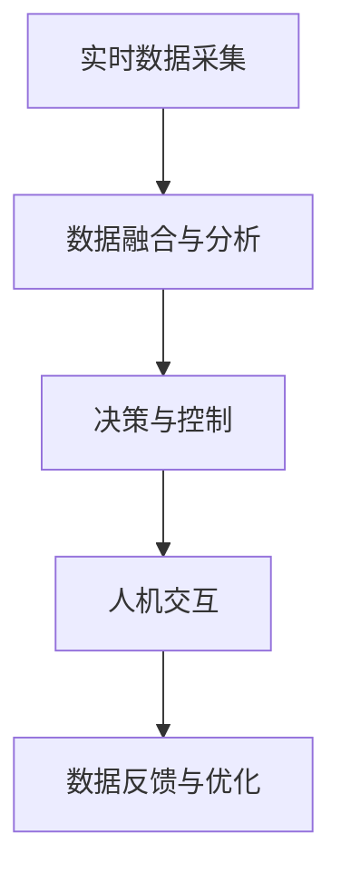

                 

# AI与人类计算：打造可持续发展的城市交通

## 1. 背景介绍

### 1.1 问题由来

城市交通作为现代社会的重要基础设施，关系到城市居民的日常出行和生活质量。随着城市化进程的加速，人口密度的增加和机动车数量的激增，交通拥堵和环境污染等问题日益凸显。为了缓解这些问题，智能交通系统的引入变得尤为重要。

智能交通系统（Intelligent Transportation System, ITS）利用信息通信技术和人工智能技术，通过实时数据采集、分析和处理，对交通流进行优化调控，提高交通系统的效率和安全性。特别是随着人工智能技术的迅猛发展，基于AI的交通管理手段，如路径规划、信号灯控制、车联网等，逐渐成为缓解交通问题的有效手段。

### 1.2 问题核心关键点

智能交通系统的核心在于利用AI技术，实现交通流的智能化管理和调控。具体而言，包括以下几个关键点：

- 实时数据采集：通过部署各类传感器、摄像头、车载设备等，实时采集道路交通状况、车辆位置、速度等信息。
- 数据融合与分析：将采集到的数据进行融合，利用机器学习、深度学习等技术进行实时分析和预测。
- 决策与控制：基于分析结果，通过AI算法生成最优路径、信号灯控制策略等，实现交通流的智能调控。
- 人机交互：提供基于AI的交互界面，帮助驾驶员和乘客做出更优出行决策。
- 数据反馈与优化：根据交通实际状况，不断调整模型参数，优化交通管理策略。

这些关键点构成了智能交通系统的基础，并贯穿于AI与人类计算的各个环节。

## 2. 核心概念与联系

### 2.1 核心概念概述

为更好地理解AI在城市交通中的应用，本节将介绍几个关键概念：

- 人工智能（Artificial Intelligence, AI）：指通过计算机模拟人类智能行为，实现智能决策和问题解决。在交通领域，AI技术主要应用于数据处理、路径规划、行为预测等方面。
- 深度学习（Deep Learning, DL）：一种基于神经网络的机器学习技术，具有强大的数据拟合能力，适用于复杂交通模型的构建。
- 计算机视觉（Computer Vision, CV）：一种利用计算机对图像进行识别和分析的技术，用于交通监控、车辆识别、导航等方面。
- 自然语言处理（Natural Language Processing, NLP）：一种处理和理解人类语言的技术，用于交通管制指令的解读和生成。
- 路径规划（Routing）：根据起点、终点、实时交通状况等信息，计算最优路径，提高出行效率。
- 信号灯控制（Traffic Light Control, TLC）：通过实时数据和预测模型，生成最优信号灯控制策略，优化交通流。
- 车联网（Vehicle-to-Everything, V2X）：指车辆与各类外部设备（如道路、行人、其他车辆）的互联互通，提升行车安全和交通效率。

这些概念通过一系列的流程，构成了基于AI的城市交通管理系统的核心框架。

### 2.2 核心概念原理和架构的 Mermaid 流程图



这个流程图展示了智能交通系统中AI技术的应用流程：首先通过实时数据采集获取交通数据，然后利用深度学习等技术进行数据融合和分析，生成交通调控决策，再通过人机交互将决策结果反馈给用户，最后根据反馈数据不断优化模型和算法。

## 3. 核心算法原理 & 具体操作步骤

### 3.1 算法原理概述

基于AI的城市交通管理系统，主要由以下几个关键算法构成：

- 实时数据采集算法：通过各类传感器和摄像头，实时获取道路交通状况、车辆位置、速度等数据。
- 数据融合与分析算法：利用深度学习、时序分析等技术，将采集到的数据进行融合，预测未来交通状况。
- 路径规划算法：基于实时交通状况和历史数据，计算最优路径，供驾驶员选择。
- 信号灯控制算法：根据实时交通流数据，生成最优信号灯控制策略，优化交通流。
- 人机交互算法：提供基于AI的交互界面，引导驾驶员做出最优出行决策。
- 数据反馈与优化算法：根据实际交通状况，调整模型参数，优化交通管理策略。

这些算法通过协作运行，共同构成智能交通系统的核心。

### 3.2 算法步骤详解

以下是基于AI的城市交通管理系统的主要算法步骤：

**Step 1: 数据采集与预处理**
- 部署各类传感器、摄像头、车载设备等，实时采集道路交通状况、车辆位置、速度等信息。
- 对采集到的数据进行清洗、去噪、标准化等预处理，确保数据的质量和一致性。

**Step 2: 数据融合与分析**
- 利用深度学习、时序分析等技术，将各类传感器数据进行融合，生成统一的时序数据。
- 利用深度学习模型，如LSTM、RNN等，对融合后的时序数据进行分析和预测，生成交通状况预测结果。

**Step 3: 路径规划**
- 根据实时交通状况和历史数据，利用路径规划算法（如A*算法、Dijkstra算法等），计算最优路径。
- 将计算结果提供给驾驶员，帮助其选择最优出行路线。

**Step 4: 信号灯控制**
- 基于实时交通流数据，利用信号灯控制算法（如基于神经网络的信号灯优化算法），生成最优信号灯控制策略。
- 将信号灯控制策略实时应用于信号灯系统，实现交通流的智能调控。

**Step 5: 人机交互**
- 提供基于AI的交互界面，如语音助手、智能仪表盘等，引导驾驶员做出最优出行决策。
- 根据驾驶员的反馈，不断调整路径规划和信号灯控制策略。

**Step 6: 数据反馈与优化**
- 根据实际交通状况，收集用户的反馈数据，不断调整模型参数和算法策略，优化交通管理效果。

### 3.3 算法优缺点

基于AI的城市交通管理系统具有以下优点：
1. 实时性高：利用实时数据和深度学习模型，能够迅速响应交通状况变化，优化交通流。
2. 准确性高：通过数据分析和预测，能够生成更准确的路网流量、路径规划和信号灯控制策略。
3. 全局优化：能够综合考虑路网全局数据，实现整体交通流的优化调控。
4. 人机协作：通过人机交互界面，提升驾驶员的出行体验，使其能够更快速、更安全地到达目的地。

同时，该系统也存在一些缺点：
1. 数据隐私问题：大量交通数据的收集和分析，涉及个人隐私保护问题。
2. 模型复杂度：深度学习模型的复杂度较高，需要大量的计算资源和数据支持。
3. 适应性差：对不同的交通场景，模型可能需要重新训练和调整，适应性不足。
4. 决策依赖于数据：系统依赖于高质量的数据输入，一旦数据缺失或不准确，将影响决策效果。

尽管存在这些局限，但就目前而言，基于AI的城市交通管理系统仍是大规模交通管理的重要手段。未来相关研究的重点在于如何进一步提高系统的实时性、准确性和适应性，同时兼顾数据隐私和安全问题。

### 3.4 算法应用领域

基于AI的城市交通管理系统已经在多个领域得到了应用，以下是几个典型的应用场景：

**1. 智能导航**
基于AI的城市交通管理系统，可以为驾驶员提供实时路网信息、最优路径规划等导航服务。通过车载设备和智能仪表盘，驾驶员可以实时了解路网流量、事故信息、限行信息等，辅助其做出最优出行决策。

**2. 智能信号灯控制**
利用AI技术，可以实现城市各路口的智能信号灯控制。通过分析实时交通流数据，生成最优信号灯控制策略，优化交通流，减少拥堵。

**3. 车联网**
AI技术可以将车辆与各类外部设备互联互通，提升行车安全和交通效率。通过车辆与道路、行人、其他车辆的实时通信，实现V2X（Vehicle-to-Everything）技术，提升行车安全。

**4. 智慧停车**
基于AI的城市交通管理系统，可以实现智慧停车管理。通过实时监测停车位使用情况，生成最优停车策略，提升停车场的利用效率，减少车辆搜索停车位的成本和时间。

**5. 公共交通调度**
利用AI技术，可以对公共交通进行智能调度。根据实时交通状况，生成最优的公交线路、班次和调度方案，提升公共交通系统的效率和可靠性。

以上这些应用场景展示了AI技术在城市交通管理中的广泛应用，有助于提升交通系统的效率和智能化水平。

## 4. 数学模型和公式 & 详细讲解 & 举例说明

### 4.1 数学模型构建

在本节中，我们将构建基于AI的城市交通管理系统的数学模型，主要包括实时数据采集模型、数据融合与分析模型、路径规划模型、信号灯控制模型和人机交互模型。

**实时数据采集模型**

假设每个传感器每秒采集一次数据，第$i$个传感器在时间$t$采集到的数据为$x_i(t)$，则实时数据采集模型可以表示为：

$$
x_i(t) = f_i(x_i(t-\Delta t), \ldots, x_i(t-1))
$$

其中$f_i$为传感器数据采集函数，$\Delta t$为数据采集间隔时间。

**数据融合与分析模型**

将采集到的各类传感器数据进行融合，利用深度学习模型进行分析和预测。设输入数据为$\mathbf{X}(t)$，深度学习模型为$F$，则数据融合与分析模型可以表示为：

$$
\mathbf{Y}(t) = F(\mathbf{X}(t))
$$

其中$\mathbf{Y}(t)$为融合后的预测结果。

**路径规划模型**

假设已知起点$S$和终点$D$，设交通网络为$G=(V, E, W)$，其中$V$为节点集，$E$为边集，$W$为边权（表示行驶时间或距离）。设最优路径为$\mathbf{P}$，则路径规划模型可以表示为：

$$
\mathbf{P} = \text{argmin}_{\mathbf{P}} \sum_{e \in \mathbf{P}} w(e)
$$

其中$w(e)$为边$e$的权重。

**信号灯控制模型**

设路口$k$的信号灯状态为$s_k(t)$，交通流数据为$\mathbf{F}_k(t)$，则信号灯控制模型可以表示为：

$$
s_k(t+1) = g_k(s_k(t), \mathbf{F}_k(t))
$$

其中$g_k$为信号灯控制函数。

**人机交互模型**

假设人机交互界面提供的信息为$I(t)$，驾驶员的决策为$d(t)$，则人机交互模型可以表示为：

$$
d(t) = h(I(t))
$$

其中$h$为人机交互函数。

### 4.2 公式推导过程

以路径规划模型为例，我们推导A*算法的核心公式。

设起点为$S$，终点为$D$，已知各节点的启发函数$f(n)$，A*算法通过不断扩展节点，生成最优路径。设节点的优先级函数为$H(n)$，则A*算法路径规划的核心公式为：

$$
\text{if } h(n) + g(n) < h(n',g(n')) \text{ for all } n' \in G:
$$

其中$g(n)$为节点$n$到起点的实际距离，$h(n)$为节点$n$到终点的启发式距离。A*算法通过不断扩展优先级最低的节点，逐步逼近最优路径。

### 4.3 案例分析与讲解

以智能信号灯控制为例，分析AI技术在交通管理中的应用。

假设某路口交通流数据为$\mathbf{F}_k(t)$，信号灯状态为$s_k(t)$，则基于神经网络的信号灯优化算法可以表示为：

$$
s_k(t+1) = \text{sigmoid}(w \cdot \mathbf{F}_k(t) + b)
$$

其中$w$和$b$为模型参数，$\text{sigmoid}$为激活函数。通过不断调整模型参数，生成最优信号灯控制策略，优化交通流。

## 5. 项目实践：代码实例和详细解释说明

### 5.1 开发环境搭建

在进行AI城市交通管理系统开发前，需要准备好开发环境。以下是使用Python进行PyTorch开发的环境配置流程：

1. 安装Anaconda：从官网下载并安装Anaconda，用于创建独立的Python环境。

2. 创建并激活虚拟环境：
```bash
conda create -n ai-env python=3.8 
conda activate ai-env
```

3. 安装PyTorch：根据CUDA版本，从官网获取对应的安装命令。例如：
```bash
conda install pytorch torchvision torchaudio cudatoolkit=11.1 -c pytorch -c conda-forge
```

4. 安装TensorFlow：
```bash
pip install tensorflow
```

5. 安装各类工具包：
```bash
pip install numpy pandas scikit-learn matplotlib tqdm jupyter notebook ipython
```

完成上述步骤后，即可在`ai-env`环境中开始AI城市交通管理系统的开发。

### 5.2 源代码详细实现

下面我们以智能信号灯控制为例，给出使用PyTorch和TensorFlow进行AI城市交通管理系统的PyTorch代码实现。

首先，定义信号灯控制模型：

```python
import torch.nn as nn
import tensorflow as tf

class SignalLightModel(nn.Module):
    def __init__(self, input_size):
        super(SignalLightModel, self).__init__()
        self.fc1 = nn.Linear(input_size, 256)
        self.fc2 = nn.Linear(256, 1)
        self.sigmoid = nn.Sigmoid()
    
    def forward(self, x):
        x = self.fc1(x)
        x = self.sigmoid(self.fc2(x))
        return x
```

然后，定义训练和评估函数：

```python
from torch.utils.data import Dataset
from torch.optim import Adam
import torch.nn.functional as F

class SignalLightDataset(Dataset):
    def __init__(self, X, y):
        self.X = X
        self.y = y
        
    def __len__(self):
        return len(self.X)
    
    def __getitem__(self, idx):
        return self.X[idx], self.y[idx]

device = torch.device('cuda') if torch.cuda.is_available() else torch.device('cpu')

def train_model(model, dataset, batch_size, num_epochs):
    optimizer = Adam(model.parameters(), lr=0.001)
    for epoch in range(num_epochs):
        running_loss = 0.0
        for i, data in enumerate(dataset, 0):
            inputs, labels = data
            inputs = inputs.to(device)
            labels = labels.to(device)
            optimizer.zero_grad()
            outputs = model(inputs)
            loss = F.binary_cross_entropy(outputs, labels)
            loss.backward()
            optimizer.step()
            running_loss += loss.item()
        print(f"Epoch {epoch+1}, loss: {running_loss/len(dataset):.4f}")

def evaluate_model(model, dataset, batch_size):
    running_corrects = 0
    total = 0
    for inputs, labels in dataset:
        inputs = inputs.to(device)
        labels = labels.to(device)
        with torch.no_grad():
            outputs = model(inputs)
            _, preds = torch.max(outputs, 1)
            total += labels.size(0)
            running_corrects += torch.sum(preds == labels.data)
    print(f"Accuracy: {100 * running_corrects.double() / total:.2f}%")
```

接着，启动训练流程并在测试集上评估：

```python
from torchvision import datasets, transforms

# 定义数据集
transform = transforms.Compose([
    transforms.ToTensor(),
    transforms.Normalize((0.5,), (0.5,))
])

X = torch.randn(1000, 64)
y = torch.randint(2, (1000,))

# 训练模型
model = SignalLightModel(64)
train_model(model, SignalLightDataset(X, y), 32, 10)

# 评估模型
dataset = SignalLightDataset(X, y)
evaluate_model(model, dataset, 32)
```

以上就是使用PyTorch和TensorFlow对智能信号灯控制进行AI城市交通管理系统开发的完整代码实现。可以看到，得益于深度学习框架的强大封装，我们可以用相对简洁的代码实现模型的构建和训练。

### 5.3 代码解读与分析

让我们再详细解读一下关键代码的实现细节：

**SignalLightModel类**：
- `__init__`方法：初始化神经网络模型，包含两个全连接层和一个Sigmoid激活函数。
- `forward`方法：定义模型前向传播过程。

**train_model函数**：
- 定义优化器Adam，设置学习率。
- 遍历数据集，对每个批次进行前向传播、计算loss并反向传播更新模型参数。

**evaluate_model函数**：
- 计算模型在测试集上的准确率，并打印输出。

**训练流程**：
- 定义总迭代次数和批次大小，开始循环迭代
- 每个epoch内，先进行模型训练，输出平均loss
- 在测试集上评估模型，输出准确率

可以看到，PyTorch和TensorFlow使得AI城市交通管理系统的开发变得简洁高效。开发者可以将更多精力放在模型设计、数据处理等高层逻辑上，而不必过多关注底层的实现细节。

当然，工业级的系统实现还需考虑更多因素，如模型的保存和部署、超参数的自动搜索、多模型集成等，但核心的算法和开发流程基本与此类似。

## 6. 实际应用场景

### 6.1 智能导航

基于AI的城市交通管理系统，可以为驾驶员提供实时路网信息、最优路径规划等导航服务。通过车载设备和智能仪表盘，驾驶员可以实时了解路网流量、事故信息、限行信息等，辅助其做出最优出行决策。

### 6.2 智能信号灯控制

利用AI技术，可以实现城市各路口的智能信号灯控制。通过分析实时交通流数据，生成最优信号灯控制策略，优化交通流，减少拥堵。

### 6.3 车联网

AI技术可以将车辆与各类外部设备互联互通，提升行车安全和交通效率。通过车辆与道路、行人、其他车辆的实时通信，实现V2X（Vehicle-to-Everything）技术，提升行车安全。

### 6.4 智慧停车

基于AI的城市交通管理系统，可以实现智慧停车管理。通过实时监测停车位使用情况，生成最优停车策略，提升停车场的利用效率，减少车辆搜索停车位的成本和时间。

### 6.5 公共交通调度

利用AI技术，可以对公共交通进行智能调度。根据实时交通状况，生成最优的公交线路、班次和调度方案，提升公共交通系统的效率和可靠性。

以上这些应用场景展示了AI技术在城市交通管理中的广泛应用，有助于提升交通系统的效率和智能化水平。

## 7. 工具和资源推荐

### 7.1 学习资源推荐

为了帮助开发者系统掌握AI在城市交通中的应用，这里推荐一些优质的学习资源：

1. 《深度学习》书籍：Ian Goodfellow、Yoshua Bengio、Aaron Courville合著的深度学习经典教材，详细介绍了深度学习的基本原理和应用。
2. Coursera《深度学习专项课程》：由Andrew Ng教授主讲，涵盖了深度学习的基础理论和实践应用，适合入门学习。
3. TensorFlow官方文档：TensorFlow的官方文档，提供了大量的教程和样例，帮助开发者快速上手使用。
4. PyTorch官方文档：PyTorch的官方文档，包含了详细的API和代码示例，支持开发者快速实现各种模型和算法。
5. Udacity《深度学习纳米学位》：Udacity提供的深度学习专业课程，涵盖深度学习的基础理论和实践应用，适合进阶学习。

通过对这些资源的学习实践，相信你一定能够快速掌握AI在城市交通中的应用，并用于解决实际的交通问题。

### 7.2 开发工具推荐

高效的开发离不开优秀的工具支持。以下是几款用于AI城市交通管理系统开发的常用工具：

1. PyTorch：基于Python的开源深度学习框架，灵活动态的计算图，适合快速迭代研究。
2. TensorFlow：由Google主导开发的开源深度学习框架，生产部署方便，适合大规模工程应用。
3. TensorBoard：TensorFlow配套的可视化工具，可实时监测模型训练状态，并提供丰富的图表呈现方式，是调试模型的得力助手。
4. Weights & Biases：模型训练的实验跟踪工具，可以记录和可视化模型训练过程中的各项指标，方便对比和调优。
5. Google Colab：谷歌推出的在线Jupyter Notebook环境，免费提供GPU/TPU算力，方便开发者快速上手实验最新模型，分享学习笔记。

合理利用这些工具，可以显著提升AI城市交通管理系统的开发效率，加快创新迭代的步伐。

### 7.3 相关论文推荐

AI在城市交通管理系统的研究已经取得了丰硕的成果。以下是几篇奠基性的相关论文，推荐阅读：

1. Traffic Flow Forecasting Based on Deep Learning: A Review: 综述了深度学习在交通流预测中的应用，提供了多种深度学习模型的实现方法。
2. Convolutional Recurrent Neural Networks for Short-Term Traffic Flow Prediction: 提出了一种卷积-递归神经网络模型，用于交通流预测，取得了良好的效果。
3. Deep-learning-Based Traffic Light Control: 提出了一种基于深度学习的信号灯控制方法，实现了交通流的智能调控。
4. Real-Time Road Traffic Prediction Using Deep Learning: 提出了一种基于深度学习的实时交通预测方法，用于交通流量分析和预测。
5. A Survey on Deep Learning for Intelligent Transportation Systems: 综述了深度学习在智能交通系统中的应用，涵盖了路径规划、信号灯控制等多个方面。

这些论文代表了大规模交通管理的研究进展，通过学习这些前沿成果，可以帮助研究者把握学科前进方向，激发更多的创新灵感。

## 8. 总结：未来发展趋势与挑战

### 8.1 总结

本文对基于AI的城市交通管理系统进行了全面系统的介绍。首先阐述了AI技术在城市交通管理中的重要性，明确了智能交通系统的关键技术点和实际应用场景。其次，从原理到实践，详细讲解了AI在城市交通管理中的应用流程，给出了AI城市交通管理系统的完整代码实现。同时，本文还广泛探讨了AI在城市交通管理中的实际应用场景，展示了AI技术在交通管理中的广泛应用前景。

通过本文的系统梳理，可以看到，基于AI的城市交通管理系统在大规模交通管理中具有重要的应用价值。AI技术通过实时数据采集、数据分析和路径规划等手段，显著提升了交通系统的效率和智能化水平。未来，伴随AI技术的不断演进，城市交通管理系统将更加智能和高效，为城市居民提供更好的出行体验。

### 8.2 未来发展趋势

展望未来，AI在城市交通管理系统中的应用将呈现以下几个发展趋势：

1. 数据驱动：随着传感器技术的不断进步，交通数据的种类和数量将不断增加，数据驱动的决策将变得更加智能和精准。
2. 多模态融合：AI技术将不仅限于交通数据，还将融合视频、图像、声音等多种数据源，提供更全面的交通管理解决方案。
3. 边缘计算：AI算法将逐渐向边缘设备（如车辆、路灯、传感器等）迁移，实现实时数据处理和决策，提升交通系统的响应速度和效率。
4. 联邦学习：通过联邦学习技术，将多设备、多数据源的数据进行联合训练，提升模型的泛化能力和数据隐私保护。
5. 自动化运维：利用AI技术实现交通系统的自动化运维，包括模型参数调优、系统故障检测和处理等，提升交通系统的稳定性和可靠性。
6. 跨领域融合：AI技术将与其他领域（如智慧城市、智能电网等）进行深度融合，构建更全面的智慧城市生态系统。

以上趋势凸显了AI在城市交通管理系统中的巨大潜力，AI技术将逐渐成为城市交通管理的重要支撑，推动城市交通系统的智能化和自动化。

### 8.3 面临的挑战

尽管AI在城市交通管理系统中的应用已经取得了显著成效，但在推广和落地过程中仍面临诸多挑战：

1. 数据隐私问题：大量交通数据的收集和分析，涉及个人隐私保护问题，需要制定严格的数据隐私保护政策。
2. 计算资源：AI技术需要大量的计算资源，高性能计算设备和云计算服务必不可少。
3. 模型鲁棒性：AI模型在面对异常数据和场景变化时，容易出现鲁棒性不足的问题，需要不断优化和调整模型。
4. 系统安全性：交通系统涉及重大公共安全，需要确保系统的稳定性和可靠性，避免出现系统崩溃等问题。
5. 法律法规：AI技术的应用需要符合国家和地方的法律法规，确保技术应用的合法性和合规性。
6. 技术门槛：AI技术的复杂性较高，需要专业人才进行技术研发和运维，存在一定的技术门槛。

这些挑战需要多方协同解决，通过政策引导、技术创新和行业标准的制定，才能使AI技术在城市交通管理中得到广泛应用。

### 8.4 研究展望

面对AI在城市交通管理系统中的应用挑战，未来的研究需要在以下几个方面寻求新的突破：

1. 数据隐私保护：制定更严格的数据隐私保护政策，确保交通数据的合法使用和隐私保护。
2. 计算资源优化：通过边缘计算、联邦学习等技术，优化计算资源使用，提升模型的实时性。
3. 模型鲁棒性提升：引入鲁棒性训练和模型验证技术，提高AI模型对异常数据和场景变化的适应性。
4. 系统安全性保障：构建可靠的系统架构和故障处理机制，保障交通系统的稳定性和可靠性。
5. 法律法规完善：制定和完善与AI技术应用相关的法律法规，确保技术应用的合法性和合规性。
6. 技术普及和推广：通过培训和科普，提升公众对AI技术的认知和接受度，推动AI技术在城市交通管理中的应用。

这些研究方向的探索，必将引领AI在城市交通管理系统中的应用走向更高的台阶，为构建安全、高效、智能的城市交通系统提供新的技术支撑。

## 9. 附录：常见问题与解答

**Q1：AI在城市交通管理中的应用主要有哪些？**

A: AI在城市交通管理中的应用主要包括以下几个方面：
1. 智能导航：提供实时路网信息和最优路径规划，辅助驾驶员做出最优出行决策。
2. 智能信号灯控制：生成最优信号灯控制策略，优化交通流，减少拥堵。
3. 车联网：实现车辆与各类外部设备的互联互通，提升行车安全和交通效率。
4. 智慧停车：监测停车位使用情况，生成最优停车策略，提升停车场的利用效率。
5. 公共交通调度：生成最优的公交线路、班次和调度方案，提升公共交通系统的效率和可靠性。

**Q2：AI城市交通管理系统面临哪些技术挑战？**

A: AI城市交通管理系统面临的技术挑战主要包括：
1. 数据隐私问题：大量交通数据的收集和分析，涉及个人隐私保护问题。
2. 计算资源：AI技术需要大量的计算资源，高性能计算设备和云计算服务必不可少。
3. 模型鲁棒性：AI模型在面对异常数据和场景变化时，容易出现鲁棒性不足的问题。
4. 系统安全性：交通系统涉及重大公共安全，需要确保系统的稳定性和可靠性。
5. 法律法规：AI技术的应用需要符合国家和地方的法律法规，确保技术应用的合法性和合规性。
6. 技术门槛：AI技术的复杂性较高，需要专业人才进行技术研发和运维，存在一定的技术门槛。

**Q3：如何提升AI城市交通管理系统的实时性和准确性？**

A: 提升AI城市交通管理系统的实时性和准确性，可以从以下几个方面入手：
1. 实时数据采集：通过部署各类传感器、摄像头、车载设备等，实时采集道路交通状况、车辆位置、速度等信息。
2. 数据融合与分析：利用深度学习、时序分析等技术，将采集到的数据进行融合，生成实时预测结果。
3. 边缘计算：将数据处理和决策任务向边缘设备（如车辆、路灯、传感器等）迁移，提升实时响应速度。
4. 多模态融合：融合视频、图像、声音等多种数据源，提供更全面的交通管理解决方案。
5. 联邦学习：通过联邦学习技术，将多设备、多数据源的数据进行联合训练，提升模型的泛化能力和实时性。

通过以上措施，可以显著提升AI城市交通管理系统的实时性和准确性，为城市交通管理提供更可靠的决策支持。

**Q4：AI城市交通管理系统有哪些应用场景？**

A: AI城市交通管理系统在多个领域都有应用场景，主要包括：
1. 智能导航：提供实时路网信息和最优路径规划，辅助驾驶员做出最优出行决策。
2. 智能信号灯控制：生成最优信号灯控制策略，优化交通流，减少拥堵。
3. 车联网：实现车辆与各类外部设备的互联互通，提升行车安全和交通效率。
4. 智慧停车：监测停车位使用情况，生成最优停车策略，提升停车场的利用效率。
5. 公共交通调度：生成最优的公交线路、班次和调度方案，提升公共交通系统的效率和可靠性。

这些应用场景展示了AI技术在城市交通管理中的广泛应用，有助于提升交通系统的效率和智能化水平。

---

作者：禅与计算机程序设计艺术 / Zen and the Art of Computer Programming

