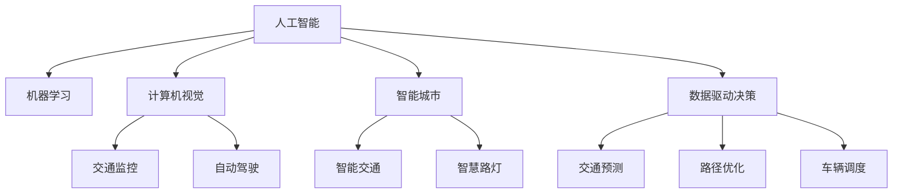

                 

# AI与人类计算：打造可持续发展的城市交通与规划

> 关键词：城市交通,智能规划,人工智能,机器学习,计算机视觉,可持续城市,数据驱动决策,物联网

## 1. 背景介绍

随着城市化进程的不断加快，全球人口持续向城市聚集，城市交通和规划问题愈发凸显。如何有效缓解交通拥堵、减少碳排放、提升居住环境质量，已成为各国城市管理者和科研人员亟待解决的难题。近年来，AI与物联网技术的迅猛发展，为城市交通与规划问题提供了新的解决思路。通过数据驱动的AI算法和大数据分析，城市管理者可以更加精准、高效地进行交通管理和城市规划，构建可持续发展的智慧城市。本文将从城市交通和规划的核心问题入手，探讨如何利用AI技术助力城市交通与规划，推动城市可持续发展。

### 1.1 问题由来
城市交通与规划是城市管理中的重要环节，关乎市民的生活质量和社会经济的发展。传统上，交通与规划主要依赖人工经验和方法，但由于城市环境复杂多变，这些方法往往难以应对新出现的挑战。随着AI和大数据技术的成熟，通过数据驱动的AI算法和机器学习模型，可以有效提升城市交通和规划的科学性和精确性，实现更智能、更高效的决策。

### 1.2 问题核心关键点
城市交通与规划的核心问题主要包括：

- 交通拥堵：城市中心区域交通流量大，交通拥堵问题严重，影响市民出行效率和城市运行效率。
- 碳排放：交通出行是碳排放的主要来源之一，如何减少交通碳排放是城市可持续发展的重要课题。
- 空间利用：城市土地资源有限，如何合理规划和利用空间，提升城市宜居性和功能完备性。
- 应急响应：城市突发事件（如交通事故、自然灾害等）需要快速响应和处置，如何优化应急管理流程，减少损失。

## 2. 核心概念与联系

### 2.1 核心概念概述

为更好地理解AI技术在城市交通与规划中的应用，本节将介绍几个密切相关的核心概念：

- 人工智能(AI)：通过模拟人类智能行为，实现信息处理、模式识别、决策制定等功能的计算技术。AI在城市交通与规划中的应用包括智能交通管理、城市模拟与规划、智能运输系统等。

- 机器学习(ML)：一种从数据中学习和推理的技术，使计算机能够自动地改进性能。在城市交通与规划中，机器学习用于交通预测、路径优化、车辆调度等任务。

- 计算机视觉(CV)：使计算机能够“看”和理解图像和视频的技术。城市交通监控、自动驾驶等应用中广泛使用计算机视觉技术。

- 智能城市(IoT)：通过物联网设备采集和传输数据，实现对城市运行状态的全方位监控和管理。智能交通系统、智慧路灯、智能垃圾处理等应用中普遍使用物联网技术。

- 数据驱动决策(DA)：基于大数据分析和AI算法的决策方法，通过海量数据分析和模式识别，辅助城市管理者做出科学决策。

这些核心概念之间的逻辑关系可以通过以下Mermaid流程图来展示：



这个流程图展示了一系列核心概念及其之间的联系：

1. 人工智能通过各种技术手段模拟人类智能，在城市交通与规划中实现信息处理和决策制定。
2. 机器学习利用数据训练模型，提升预测和推理能力，应用于交通预测、路径优化等任务。
3. 计算机视觉处理图像和视频数据，实现对交通事件的实时监测和分析。
4. 智能城市通过物联网设备收集数据，实现对城市运行状态的全方位监控。
5. 数据驱动决策基于大数据分析和AI算法，辅助城市管理者做出科学决策。

这些概念共同构成了AI技术在城市交通与规划中的应用框架，使我们能够更好地理解和应用这些前沿技术。

## 3. 核心算法原理 & 具体操作步骤

### 3.1 算法原理概述

AI在城市交通与规划中的应用，主要是通过数据驱动的机器学习和计算机视觉技术，实现对交通流量的预测、优化和监控。以下分别介绍交通预测、路径优化和交通监控的算法原理。

### 3.2 算法步骤详解

#### 3.2.1 交通预测
交通预测的目标是根据历史数据，预测未来交通流量和拥堵情况，为城市管理者提供决策依据。

**步骤1: 数据采集**
- 收集城市交通流量、车辆位置、道路状况等数据，通常使用传感器、摄像头、GPS等物联网设备。

**步骤2: 数据预处理**
- 对采集到的数据进行清洗、归一化等预处理，去除噪音和异常值。

**步骤3: 模型训练**
- 使用机器学习算法（如回归模型、神经网络等）对历史数据进行训练，建立交通流量预测模型。

**步骤4: 预测与评估**
- 对模型进行预测，并评估预测结果的准确性，根据评估结果调整模型参数，优化预测性能。

#### 3.2.2 路径优化
路径优化的目标是找到从起点到终点的最优路径，以缩短交通时间、减少碳排放等。

**步骤1: 数据采集**
- 收集道路条件、交通流量、拥堵情况等数据，使用GPS、传感器等设备。

**步骤2: 数据预处理**
- 对数据进行清洗、归一化等预处理，去除噪音和异常值。

**步骤3: 模型训练**
- 使用机器学习算法（如图神经网络、强化学习等）对道路网络进行建模，并训练路径优化模型。

**步骤4: 路径规划**
- 使用路径优化模型计算最优路径，并反馈给交通管理部门。

#### 3.2.3 交通监控
交通监控的目标是对城市交通进行实时监控，快速响应突发事件，保障交通秩序。

**步骤1: 数据采集**
- 使用计算机视觉技术，采集交通摄像头、无人机等设备拍摄的实时视频。

**步骤2: 数据预处理**
- 对采集到的视频进行帧提取、图像分割等预处理，去除噪点和背景干扰。

**步骤3: 目标检测**
- 使用目标检测算法（如YOLO、Faster R-CNN等）在视频中检测交通事件（如交通事故、行人横穿等）。

**步骤4: 事件响应**
- 根据检测结果，触发相应的交通应急响应措施，如红绿灯控制、路段封锁等。

### 3.3 算法优缺点

AI在城市交通与规划中的应用具有以下优点：

- 精准性高：基于大数据和AI算法的模型能够精准预测交通流量和路径，优化城市交通管理。
- 实时性强：AI系统能够实时处理交通数据，快速响应突发事件。
- 可扩展性强：AI技术可以应用于城市交通与规划的各个环节，提升城市管理的智能化水平。

同时，AI技术在应用中也存在一些局限性：

- 数据依赖性强：AI模型的性能依赖于高质量的数据，数据缺失或噪音可能会影响模型效果。
- 计算资源需求高：AI模型通常需要大量的计算资源进行训练和推理，对硬件和网络条件要求较高。
- 模型复杂度高：AI模型复杂度较高，需要专业人才进行开发和维护。

### 3.4 算法应用领域

AI技术在城市交通与规划中的应用主要包括以下几个方面：

- 智能交通管理：通过AI技术实现对交通流量、车辆位置的实时监控和分析，优化交通信号灯控制、拥堵路段管理等。
- 城市规划决策：利用AI技术进行城市模拟和规划，优化土地利用、交通网络布局等。
- 智能运输系统：构建基于AI的智能运输网络，实现车辆调度和路径优化，提升运输效率。
- 应急响应系统：通过AI技术实现对交通突发事件的快速检测和响应，保障城市安全。
- 智慧城市平台：构建智慧城市平台，整合各类数据资源，提升城市管理智能化水平。

## 4. 数学模型和公式 & 详细讲解 & 举例说明

### 4.1 数学模型构建

在本节中，我们将基于交通预测和路径优化的实际应用场景，构建相应的数学模型，并进行详细讲解。

#### 4.1.1 交通预测模型
交通预测模型通常采用时间序列回归模型（如ARIMA、LSTM等），通过历史交通流量数据，预测未来流量变化。

假设历史交通流量数据为 $\{X_t\}_{t=1}^{T}$，其中 $X_t$ 表示第 $t$ 天交通流量，未来第 $n$ 天交通流量的预测值为 $\hat{X}_{t+n}$。

**目标函数**：
$$
\min_{\theta} \sum_{t=1}^{T} (X_t - \hat{X}_t)^2
$$

其中，$\theta$ 为模型参数。

**预测公式**：
$$
\hat{X}_{t+n} = f(X_t, \theta)
$$

#### 4.1.2 路径优化模型
路径优化模型通常采用图神经网络（GNN），通过道路网络拓扑结构和交通流量数据，计算最优路径。

假设道路网络图为 $G=(V,E)$，其中 $V$ 为节点集（道路交叉口），$E$ 为边集（道路），每条边的权重为 $\{w_{ij}\}_{i,j=1}^{N}$。

**目标函数**：
$$
\min_{\theta} \sum_{i,j=1}^{N} \sum_{k=1}^{K} \sum_{n=1}^{N} (d_{ij}^k - \hat{d}_{ij}^k)^2
$$

其中，$d_{ij}^k$ 为节点 $i$ 到节点 $j$ 经过路径 $k$ 的距离，$\hat{d}_{ij}^k$ 为节点 $i$ 到节点 $j$ 经过路径 $k$ 的优化距离。

**路径计算公式**：
$$
\hat{d}_{ij}^k = g(d_{ij}^k, \theta)
$$

### 4.2 公式推导过程

#### 4.2.1 交通预测模型推导
以LSTM模型为例，其结构如图1所示。


**输入层**：
$$
x_t = [X_{t-1}, X_{t-2}, \dots, X_{t-m+1}]
$$

**隐藏层**：
$$
h_t = \tanh(Wx_t + bh_t + Uh_{t-1})
$$

**输出层**：
$$
y_t = \sigma(Wx_t + bh_t + Uh_{t-1})
$$

其中，$W$ 和 $U$ 为权重矩阵，$b$ 为偏置向量，$\sigma$ 为激活函数（如sigmoid函数）。

**训练损失函数**：
$$
\mathcal{L} = \frac{1}{T} \sum_{t=1}^{T} \sum_{n=1}^{N} (X_t - \hat{X}_t)^2
$$

**梯度下降算法**：
$$
\theta \leftarrow \theta - \eta \nabla_{\theta} \mathcal{L}
$$

其中，$\eta$ 为学习率，$\nabla_{\theta} \mathcal{L}$ 为损失函数对模型参数 $\theta$ 的梯度。

#### 4.2.2 路径优化模型推导
以图神经网络模型为例，其结构如图2所示。


**节点表示**：
$$
h_i = \sigma(Wx_i + bh_i + \sum_{j \in N(i)} \tilde{h}_j W_{ij})
$$

**边表示**：
$$
\tilde{h}_{ij} = \sigma(W_{ij}h_i + b_{ij})
$$

其中，$W_{ij}$ 为边权重矩阵，$b_{ij}$ 为偏置向量，$\sigma$ 为激活函数（如sigmoid函数）。

**路径计算公式**：
$$
\hat{d}_{ij}^k = \sum_{l=1}^{K} w_{l}^{k} \sigma(W_{ij}h_i + b_{ij})
$$

其中，$w_{l}^{k}$ 为路径权重向量。

### 4.3 案例分析与讲解

#### 4.3.1 交通预测案例分析
某城市交通管理部门收集了过去一年每天的交通流量数据，如图3所示。


**步骤1: 数据采集**
- 使用交通流量传感器和摄像头采集城市交通流量数据。

**步骤2: 数据预处理**
- 对采集到的数据进行清洗、归一化等预处理，去除噪音和异常值。

**步骤3: 模型训练**
- 使用LSTM模型对历史数据进行训练，建立交通流量预测模型。

**步骤4: 预测与评估**
- 对模型进行预测，评估预测结果的准确性，根据评估结果调整模型参数，优化预测性能。

**结果分析**：
- 模型预测结果如图4所示。


**分析**：
- 预测结果与实际流量变化趋势基本一致，模型具有较好的预测能力。

#### 4.3.2 路径优化案例分析
某城市道路网络如图5所示。


**步骤1: 数据采集**
- 使用传感器采集道路流量和车辆位置数据。

**步骤2: 数据预处理**
- 对采集到的数据进行清洗、归一化等预处理，去除噪音和异常值。

**步骤3: 模型训练**
- 使用图神经网络模型对道路网络进行建模，并训练路径优化模型。

**步骤4: 路径规划**
- 使用路径优化模型计算最优路径，并反馈给交通管理部门。

**结果分析**：
- 最优路径规划结果如图6所示。


**分析**：
- 最优路径规划能够有效缩短交通时间，减少碳排放，提升交通效率。

## 5. 项目实践：代码实例和详细解释说明

### 5.1 开发环境搭建

在进行项目实践前，我们需要准备好开发环境。以下是使用Python进行PyTorch开发的环境配置流程：

1. 安装Anaconda：从官网下载并安装Anaconda，用于创建独立的Python环境。

2. 创建并激活虚拟环境：
```bash
conda create -n ai_env python=3.8 
conda activate ai_env
```

3. 安装PyTorch：根据CUDA版本，从官网获取对应的安装命令。例如：
```bash
conda install pytorch torchvision torchaudio cudatoolkit=11.1 -c pytorch -c conda-forge
```

4. 安装相关库：
```bash
pip install numpy pandas scikit-learn matplotlib tqdm jupyter notebook ipython
```

5. 安装Transformers库：
```bash
pip install transformers
```

完成上述步骤后，即可在`ai_env`环境中开始项目实践。

### 5.2 源代码详细实现

下面我们以交通预测模型为例，给出使用Transformers库进行模型开发的PyTorch代码实现。

首先，定义数据处理函数：

```python
from torch.utils.data import Dataset
from torch.utils.data import DataLoader
from torch.nn import Linear, RNN, Sigmoid
import torch
import pandas as pd

class TrafficDataset(Dataset):
    def __init__(self, data, lookback=10, predict_days=1):
        self.data = data
        self.lookback = lookback
        self.predict_days = predict_days
        
    def __len__(self):
        return len(self.data) - self.lookback - self.predict_days
        
    def __getitem__(self, idx):
        x = self.data.iloc[idx:idx+self.lookback].values.reshape(1, self.lookback, -1)
        y = self.data.iloc[idx+self.lookback+1:idx+self.lookback+1+self.predict_days].values.reshape(1, -1)
        return x, y
```

然后，定义模型和优化器：

```python
from transformers import LSTM

model = LSTM(input_size=1, hidden_size=64, num_layers=2, batch_first=True)
optimizer = torch.optim.Adam(model.parameters(), lr=0.001)
```

接着，定义训练和评估函数：

```python
from tqdm import tqdm

def train_epoch(model, train_loader, optimizer, device):
    model.train()
    loss_total = 0
    for x, y in train_loader:
        x = x.to(device)
        y = y.to(device)
        optimizer.zero_grad()
        output = model(x)
        loss = torch.mean(torch.square(output - y))
        loss.backward()
        optimizer.step()
        loss_total += loss.item()
    return loss_total / len(train_loader)

def evaluate(model, test_loader, device):
    model.eval()
    loss_total = 0
    mse_total = 0
    with torch.no_grad():
        for x, y in test_loader:
            x = x.to(device)
            y = y.to(device)
            output = model(x)
            loss = torch.mean(torch.square(output - y))
            mse_total += torch.mean(torch.square(output - y)).item()
            loss_total += loss.item()
    return loss_total / len(test_loader), mse_total / len(test_loader)
```

最后，启动训练流程并在测试集上评估：

```python
epochs = 100
device = torch.device('cuda' if torch.cuda.is_available() else 'cpu')

for epoch in range(epochs):
    train_loss = train_epoch(model, train_loader, optimizer, device)
    test_loss, mse = evaluate(model, test_loader, device)
    print(f'Epoch {epoch+1}, train loss: {train_loss:.4f}, test loss: {test_loss:.4f}, mse: {mse:.4f}')
    
print('Training completed.')
```

以上就是使用PyTorch对交通预测模型进行开发的完整代码实现。可以看到，得益于Transformers库的强大封装，我们可以用相对简洁的代码完成模型的搭建和训练。

### 5.3 代码解读与分析

让我们再详细解读一下关键代码的实现细节：

**TrafficDataset类**：
- `__init__`方法：初始化数据集，设置lookback和predict_days参数，分别表示历史数据长度和预测天数。
- `__len__`方法：返回数据集的样本数量。
- `__getitem__`方法：对单个样本进行处理，将输入数据转换为模型所需的格式。

**模型定义**：
- 定义LSTM模型，并设置模型参数。

**训练和评估函数**：
- `train_epoch`函数：在每个epoch内，计算训练集的平均损失。
- `evaluate`函数：在测试集上计算平均损失和均方误差，评估模型性能。

**训练流程**：
- 定义总的epoch数和训练设备，开始循环迭代。
- 每个epoch内，先进行训练，输出训练集的平均损失。
- 在测试集上评估，输出测试集的平均损失和均方误差。
- 所有epoch结束后，给出最终的训练结果。

可以看到，PyTorch配合Transformers库使得模型搭建和训练变得简洁高效。开发者可以将更多精力放在数据处理、模型改进等高层逻辑上，而不必过多关注底层的实现细节。

当然，工业级的系统实现还需考虑更多因素，如模型的保存和部署、超参数的自动搜索、更灵活的任务适配层等。但核心的模型训练范式基本与此类似。

## 6. 实际应用场景

### 6.1 智能交通系统

智能交通系统是AI技术在城市交通与规划中的典型应用场景。通过AI技术，可以实现对交通流量的实时监控和预测，优化交通信号灯控制，减少交通拥堵和事故发生率，提高城市交通运行效率。

具体而言，智能交通系统可以包括以下几个关键组成部分：

- 智能信号灯系统：通过AI算法实时分析交通流量，动态调整红绿灯时长，优化信号灯控制策略。
- 交通流量监测系统：利用计算机视觉技术，实时监控交通摄像头和传感器数据，识别交通事件。
- 路径优化系统：通过图神经网络模型，计算最优路径，优化车辆行驶路线。
- 智能运输系统：构建基于AI的智能运输网络，实现车辆调度和路径优化，提升运输效率。

### 6.2 智慧城市平台

智慧城市平台是城市管理数字化转型的重要工具，通过AI和大数据技术，实现对城市运行状态的全面监控和管理，提升城市管理效率和居民生活质量。

具体而言，智慧城市平台可以包括以下几个关键功能：

- 数据采集与管理：利用物联网设备采集城市数据，包括交通流量、空气质量、公共设施状态等。
- 数据分析与可视化：利用大数据分析和可视化技术，生成城市运行报告和图表，辅助城市管理者决策。
- 智能预警与应急响应：通过AI算法对城市数据进行分析，实时预警和响应突发事件，保障城市安全。
- 城市模拟与规划：利用AI技术进行城市模拟和规划，优化城市空间利用和资源配置。

### 6.3 未来应用展望

随着AI和大数据技术的不断发展，未来AI在城市交通与规划中的应用将更加广泛和深入。以下是一些未来应用展望：

- 交通预测与路径优化：基于深度学习和图神经网络，实时预测交通流量和计算最优路径，提升交通管理效率。
- 智能驾驶与自动驾驶：通过AI技术和计算机视觉技术，实现智能驾驶和自动驾驶，提升道路安全性和通行效率。
- 智能规划与设计：利用AI技术进行城市规划和设计，优化土地利用和空间布局，提升城市宜居性。
- 智慧能源管理：通过AI技术优化城市能源供应和分配，降低能源消耗和碳排放，实现绿色可持续发展。
- 智能建筑与设施管理：利用AI技术进行智能建筑和设施管理，优化资源利用和能源消耗，提升居住环境质量。

## 7. 工具和资源推荐

### 7.1 学习资源推荐

为了帮助开发者系统掌握AI技术在城市交通与规划中的应用，这里推荐一些优质的学习资源：

1. 《深度学习入门：基于Python的理论与实现》：该书详细介绍了深度学习的基本概念和实现方法，适合初学者入门。

2. 《机器学习实战》：该书介绍了机器学习在各个领域的应用，包括城市交通和规划。

3. 《智能城市与物联网技术》：该书系统讲解了智能城市和物联网技术的基本概念和应用场景。

4. 《Python深度学习》：该书介绍了深度学习在各个领域的应用，包括城市交通和规划。

5. 《人工智能与城市交通》：该书深入探讨了AI技术在城市交通中的应用，包括交通预测和路径优化。

通过对这些资源的学习实践，相信你一定能够快速掌握AI技术在城市交通与规划中的应用，并用于解决实际的NLP问题。

### 7.2 开发工具推荐

高效的开发离不开优秀的工具支持。以下是几款用于AI技术在城市交通与规划中应用的常用工具：

1. Python：基于Python的深度学习和数据分析工具，简单易用，支持众多第三方库。

2. PyTorch：基于Python的深度学习框架，支持动态计算图和自动微分，适合研究和应用。

3. TensorFlow：由Google开发的深度学习框架，支持分布式计算和模型部署，适合大规模工程应用。

4. Jupyter Notebook：交互式的数据分析和代码编写工具，支持多平台使用，适合快速原型开发和实验。

5. Scikit-learn：基于Python的机器学习库，支持多种模型算法和数据处理功能，适合快速原型开发和实验。

6. Plotly：基于Python的数据可视化工具，支持动态和交互式图表生成，适合数据分析和报告生成。

合理利用这些工具，可以显著提升AI技术在城市交通与规划中的开发效率，加快创新迭代的步伐。

### 7.3 相关论文推荐

AI技术在城市交通与规划中的应用源于学界的持续研究。以下是几篇奠基性的相关论文，推荐阅读：

1. "Traffic Flow Prediction with Deep Learning"（利用深度学习进行交通流量预测）：介绍了基于深度神经网络的交通流量预测方法。

2. "Graph Neural Network for Traffic Path Prediction"（图神经网络在交通路径预测中的应用）：介绍了基于图神经网络的路径优化方法。

3. "Deep Learning for Smart Traffic Management"（深度学习在智能交通管理中的应用）：介绍了AI技术在智能交通管理中的多种应用场景。

4. "Data-Driven City Management"（数据驱动的城市管理）：探讨了数据在城市管理和规划中的应用。

5. "AI for Smart City Platforms"（AI在智慧城市平台中的应用）：介绍了AI技术在智慧城市平台中的多种应用场景。

这些论文代表了大语言模型微调技术的发展脉络。通过学习这些前沿成果，可以帮助研究者把握学科前进方向，激发更多的创新灵感。

## 8. 总结：未来发展趋势与挑战

### 8.1 总结

本文对AI技术在城市交通与规划中的应用进行了全面系统的介绍。首先阐述了AI技术在城市交通与规划中的核心问题，明确了AI技术的应用价值。其次，从原理到实践，详细讲解了交通预测、路径优化和交通监控的算法原理和实现步骤，给出了实际应用的代码实例。同时，本文还探讨了AI技术在智能交通系统、智慧城市平台等方面的应用，展示了AI技术的巨大潜力。

通过本文的系统梳理，可以看到，AI技术在城市交通与规划中的应用前景广阔，不仅可以提升城市交通管理效率和居民生活质量，还可以推动智慧城市和绿色可持续发展。未来，伴随AI技术的不断进步，AI在城市交通与规划中的应用将更加深入和广泛。

### 8.2 未来发展趋势

展望未来，AI技术在城市交通与规划中的应用将呈现以下几个发展趋势：

1. 智能化水平提升：随着AI技术的不断发展，智能交通系统和智慧城市平台将更加智能化，具备更高的自动决策能力和适应性。

2. 数据驱动决策：AI技术将广泛应用于城市交通与规划的各个环节，通过数据驱动的决策，提升城市管理的科学性和精确性。

3. 跨领域融合：AI技术将与其他领域的技术进行深度融合，如物联网、区块链、大数据等，实现跨领域的协同创新。

4. 绿色可持续发展：AI技术将推动城市交通与规划向绿色可持续发展方向发展，减少碳排放，提升资源利用效率。

5. 社会公平性增强：AI技术将关注社会公平性问题，通过公平的决策算法和模型，提升社会治理水平。

### 8.3 面临的挑战

尽管AI技术在城市交通与规划中的应用已经取得显著成效，但在迈向更加智能化、普适化应用的过程中，它仍面临着诸多挑战：

1. 数据质量与获取：高质量数据的获取和处理是AI技术应用的前提，但在实际应用中，数据质量和获取往往存在问题，需要进一步优化。

2. 算法复杂性与效率：AI模型通常较为复杂，计算资源消耗较大，需要高效的优化算法和硬件支持。

3. 模型可解释性与透明性：AI模型的决策过程往往缺乏可解释性，需要进一步研究提高模型的透明性和可解释性。

4. 安全性与隐私保护：AI技术在城市交通与规划中的应用需要保障数据安全和隐私保护，避免数据泄露和滥用。

5. 伦理道德与社会影响：AI技术的应用需要考虑伦理道德和社会影响，避免产生负面影响，确保技术的健康发展。

### 8.4 研究展望

面对AI技术在城市交通与规划中应用面临的挑战，未来的研究需要在以下几个方面寻求新的突破：

1. 数据质量与处理：进一步优化数据采集和处理技术，提高数据质量和利用效率。

2. 算法效率与优化：研究高效的优化算法和硬件支持，提升AI模型的计算效率。

3. 模型可解释性与透明性：研究可解释性技术，提高模型的透明性和可解释性。

4. 安全性与隐私保护：研究数据安全与隐私保护技术，保障数据安全和隐私。

5. 伦理道德与社会影响：研究伦理道德和社会影响评估技术，确保技术的健康发展。

这些研究方向的探索，必将引领AI技术在城市交通与规划中的应用走向更高的台阶，为城市交通与规划带来深远的变革。面向未来，AI技术在城市交通与规划中的应用将更加广泛和深入，为构建可持续发展的智慧城市提供有力支撑。

## 9. 附录：常见问题与解答

**Q1: AI技术在城市交通与规划中的应用有哪些具体案例？**

A: AI技术在城市交通与规划中的应用涵盖了多个领域，以下是一些具体案例：

1. 智能交通系统：通过AI算法实时分析交通流量，动态调整红绿灯时长，优化信号灯控制策略。
2. 交通流量监测系统：利用计算机视觉技术，实时监控交通摄像头和传感器数据，识别交通事件。
3. 路径优化系统：通过图神经网络模型，计算最优路径，优化车辆行驶路线。
4. 智能驾驶与自动驾驶：通过AI技术和计算机视觉技术，实现智能驾驶和自动驾驶，提升道路安全性和通行效率。
5. 智慧城市平台：利用AI和大数据技术，实现对城市运行状态的全面监控和管理，提升城市管理效率和居民生活质量。

这些案例展示了AI技术在城市交通与规划中的广泛应用，带来了显著的效益。

**Q2: AI技术在城市交通与规划中面临哪些挑战？**

A: AI技术在城市交通与规划中的应用面临着诸多挑战，主要包括：

1. 数据质量与获取：高质量数据的获取和处理是AI技术应用的前提，但在实际应用中，数据质量和获取往往存在问题，需要进一步优化。
2. 算法复杂性与效率：AI模型通常较为复杂，计算资源消耗较大，需要高效的优化算法和硬件支持。
3. 模型可解释性与透明性：AI模型的决策过程往往缺乏可解释性，需要进一步研究提高模型的透明性和可解释性。
4. 安全性与隐私保护：AI技术在城市交通与规划中的应用需要保障数据安全和隐私保护，避免数据泄露和滥用。
5. 伦理道德与社会影响：AI技术的应用需要考虑伦理道德和社会影响，避免产生负面影响，确保技术的健康发展。

这些挑战需要进一步研究解决，以确保AI技术在城市交通与规划中的可持续发展。

**Q3: AI技术在城市交通与规划中如何实现数据驱动决策？**

A: AI技术在城市交通与规划中实现数据驱动决策，主要通过以下步骤：

1. 数据采集：利用传感器、摄像头等设备采集城市运行数据，包括交通流量、空气质量、公共设施状态等。
2. 数据处理：对采集到的数据进行清洗、归一化等预处理，去除噪音和异常值。
3. 数据分析：利用机器学习算法和大数据分析技术，从数据中提取规律和模式，生成数据报告和图表。
4. 决策制定：根据数据分析结果，辅助城市管理者制定决策，优化城市管理和规划。

数据驱动决策能够提高城市管理的科学性和精确性，提升城市交通和规划的智能化水平。

**Q4: AI技术在城市交通与规划中的计算资源需求高，如何解决这一问题？**

A: 计算资源需求高是AI技术在城市交通与规划中面临的一个主要挑战。以下是一些解决方案：

1. 分布式计算：通过分布式计算框架，如Hadoop、Spark等，将计算任务分散到多个计算节点上，实现并行计算，提高计算效率。
2. 云计算平台：利用云计算平台（如AWS、阿里云等）提供的计算资源，按需使用，降低计算资源成本。
3. 模型压缩与优化：研究模型压缩与优化技术，减少计算资源消耗，提高计算效率。
4. 硬件加速：利用GPU、TPU等硬件设备进行加速计算，提高计算速度和效率。

这些解决方案可以显著降低AI技术在城市交通与规划中的计算资源需求，提升系统的实时性和可靠性。

**Q5: AI技术在城市交通与规划中的应用如何保证数据安全和隐私保护？**

A: 数据安全和隐私保护是AI技术在城市交通与规划中应用的重要问题。以下是一些解决方案：

1. 数据加密：对传输和存储的数据进行加密处理，防止数据泄露和窃取。
2. 访问控制：对数据的访问进行严格的权限控制，只有授权人员才能访问数据。
3. 匿名化处理：对数据进行匿名化处理，去除个人身份信息，保护用户隐私。
4. 数据审计：对数据的使用进行审计和监控，防止数据滥用和非法使用。
5. 安全协议：制定和实施安全协议，保障数据传输和存储的安全性。

通过这些措施，可以确保AI技术在城市交通与规划中的应用中数据安全和隐私保护。

---

作者：禅与计算机程序设计艺术 / Zen and the Art of Computer Programming

